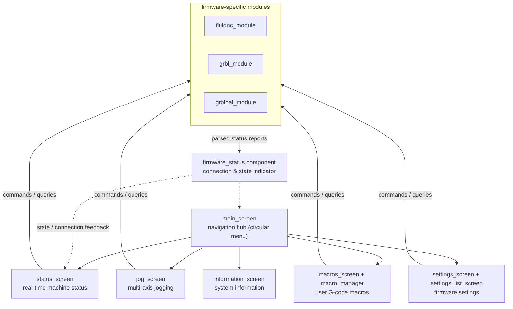

# cnc_shared

## Overview

The **cnc_shared** module (`main/display/cnc/`) is the shared CNC user-interface layer of the pendant firmware. It implements every screen and component that is **common to all three supported CNC firmware targets** — FluidNC, grblHAL, and grbl — so that the firmware-specific modules ([fluidnc_module](fluidnc_module.md), [grbl_module](grbl_module.md), [grblhal_module](grblhal_module.md)) only have to supply their protocol-specific behavior (status parsing, command dialects, file/probe workflows).

It contains:

- **The application screens** (`screens/`) — the operator-facing UI: jogging, real-time status, macros, settings, information, and firmware status
- **The firmware status component** (`components/firmware_status.*`) — the shared connection/state indicator fed by the real-time value system
- **Shared definitions** — `esp3d_firmware_states.h` (the canonical machine-state enumeration mapped to colors/labels) and `esp3d_system_translations_defs.inc` (screen translations)
- **Per-resolution resources** (`res_320_240/`, `res_480_272/`, `res_480_320/`, `res_800_480/`) — fonts, images, and layout constants for each supported display size

> **Parent module:** [UI_Framework_&_Screens](UI_Framework_%26_Screens.md) — cnc_shared builds on the generic screen framework ([ui_core](ui_core.md), [ui_components](ui_components.md)) and the reusable components it provides (virtual buttons, circular menu, list menus, message boxes).

---

## Architecture Overview

---

## Sub-modules

### [firmware_status](firmware_status.md) — Firmware status component

The shared component (`components/firmware_status.*`) that tracks the connected CNC firmware's state — connection lifecycle, machine state enumeration (`esp3d_firmware_states.h`), and the visual state indicator reused across screens. It normalizes what each firmware target reports so the UI reacts identically whether the machine runs FluidNC, grblHAL, or grbl.

### [status_screen](status_screen.md) — Real-time status screen

The operator's live view of the machine: axis positions (work/machine coordinates), feed and spindle overrides, active state, and running job progress. It subscribes to the real-time value system, so it updates continuously as status reports stream in from the firmware — no polling loop in the UI itself.

### [jog_screen](jog_screen.md) — Jog screen

Multi-axis jogging interface: axis selection, jog distance steps, continuous vs. incremental moves, and rate controls. Designed to be driven both by touch (virtual buttons) and by the physical rotary encoder/buttons on boards that have them, with on-screen input emulation on touch-only boards.

### [macro_system](macro_system.md) — Macro system

User-defined G-code macros: `macro_manager.*` handles storage and execution of named macro sequences, and `macros_screen.*` provides the list-menu UI to browse, launch, and manage them. Macros are sent to the firmware through the same command pipeline as manual input.

### [settings](settings.md) — Settings screens

Firmware settings management: `settings_screen.*` for individual setting editing (with validation) and `settings_list_screen.*` for browsing the full settings table exposed by the firmware (e.g. via the `ESP400` command on ESP3D-style targets). Values are read on screen entry and written back through the active transport.

### [navigation_screens](navigation_screens.md) — Navigation & information screens

The navigation backbone: `main_screen.*` — the central hub shown after boot, from which every feature screen is reached (circular menu) — and `information_screen.*`, which reports system and firmware information (versions, IP addresses, build options).

---

## Relationship with the firmware-specific modules

cnc_shared deliberately contains **no protocol logic**. Command formatting, status-report parsing, file transfer, probing, and tool-change workflows live in the per-target modules:

- [fluidnc_module](fluidnc_module.md) — FluidNC target (`main/display/cnc/fluidnc/`)
- [grbl_module](grbl_module.md) — grbl target (`main/display/cnc/grbl/`)
- [grblhal_module](grblhal_module.md) — grblHAL target (`main/display/cnc/grblhal/`)

The shared screens emit commands and consume status through the common G-code handler and client transport layers (see [gcode_host](gcode_host.md) and [Communication_Transports](Communication_Transports.md)), which is what allows one screen implementation to serve all three firmware dialects.

## Documents de conception (depot)

- [screens_architecture.md](https://github.com/luc-github/Pibot-cnc-pendant-firmware/blob/main/docs/architecture/screens_architecture.md)
- [fluidnc](https://github.com/luc-github/Pibot-cnc-pendant-firmware/blob/main/docs/ux_flows/fluidnc/)
- [grblhal](https://github.com/luc-github/Pibot-cnc-pendant-firmware/blob/main/docs/ux_flows/grblhal/)
