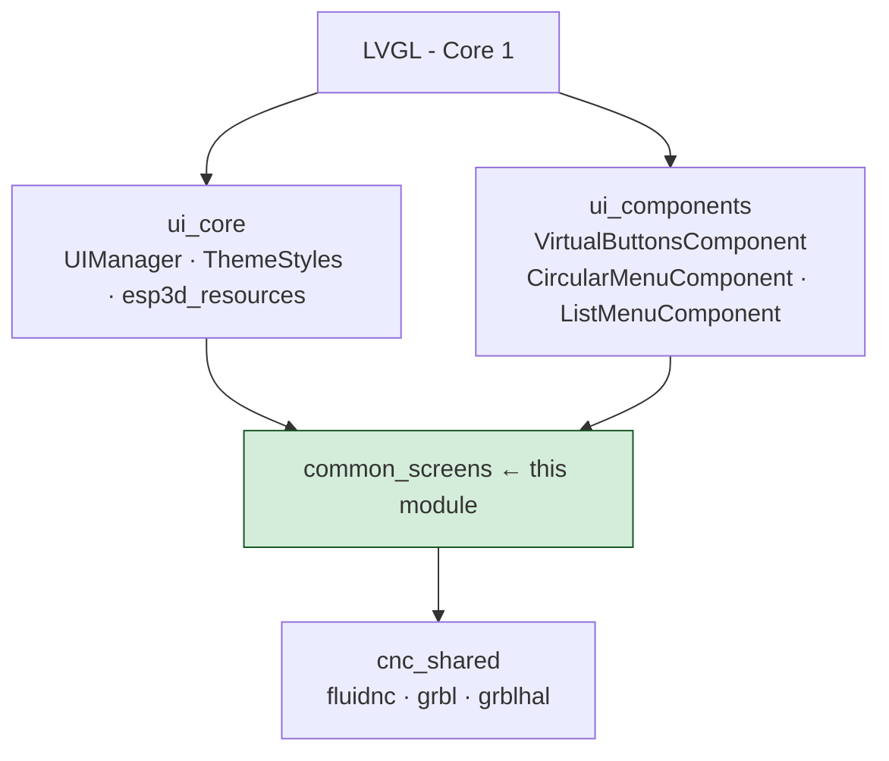
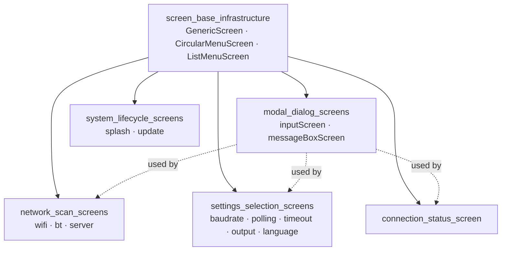
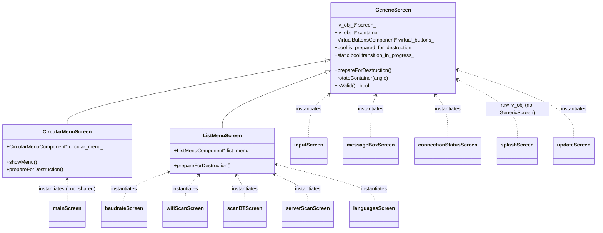
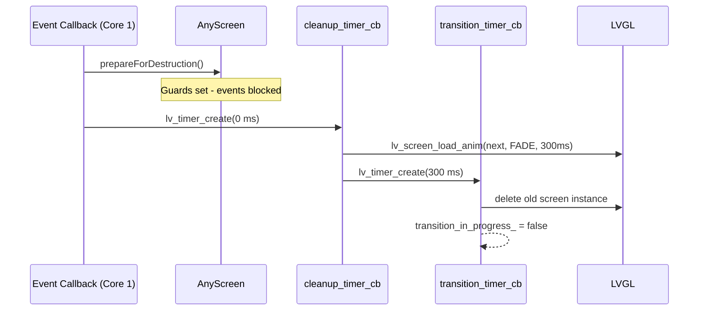
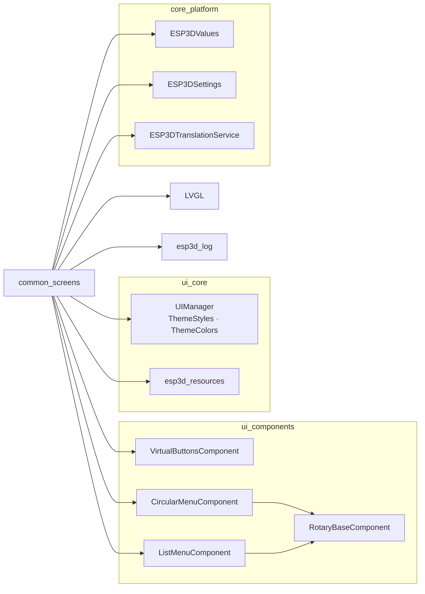

# `common_screens` Module Overview

**Path:** `main/display/screens`

## Purpose

The `common_screens` module provides the complete library of reusable, firmware-agnostic LVGL screens for the Pibot CNC Pendant. It is partitioned into six sub-modules that together cover every screen the application needs outside of CNC-firmware-specific flows (FluidNC, grbl, grblHAL). Each sub-module builds on the base infrastructure defined in this same module, following a shared lifecycle pattern enforced through macros (`ESP3D_TRANSITION_START`, `ESP3D_CLEANUP_TIMER_BODY`, `ESP3D_PREPARE_DESTRUCTION_GUARD`).

All screens run exclusively on **Core 1** (the LVGL task) and use timer-based two-phase destruction to avoid deleting LVGL objects from within event callbacks.

---

## Sub-module Summary

| Sub-module | Path | Key Screens |
|---|---|---|
| `screen_base_infrastructure` | `generic_screen.h`, `circular_menu_screen.h`, `list_menu_screen.h` | Base classes for all screens |
| `modal_dialog_screens` | `input_screen.h/cpp`, `message_box_screen.h/cpp` | Keyboard input, confirmation/info dialogs |
| `network_scan_screens` | `wifi_scan_screen.cpp`, `scan_bt_screen.cpp`, `server_scan_screen.cpp` | Async scan-and-select for WiFi APs, BT devices, mDNS servers |
| `settings_selection_screens` | `baudrate_screen.cpp`, `polling_screen.cpp`, `screen_timeout_screen.cpp`, `output_selection_screen.cpp`, `languages_screen.cpp` | Predefined-list pickers that persist to NVS |
| `connection_status_screen` | `connection_status_screen.h/cpp` | Interactive transport/CNC connection diagnostic hub |
| `system_lifecycle_screens` | `splash_screen.cpp`, `update_screen.cpp` | Boot splash and SD-card firmware/resource update |

---

## Architecture

### Position in the UI Framework

### Internal Sub-module Dependency Graph

### Class Hierarchy

---

## Shared Lifecycle Pattern

Every screen in this module follows the same two-phase timer-based destruction pattern to comply with LVGL's single-thread constraint.

Key guard variables shared across all screens:

| Variable | Role |
|---|---|
| `is_prepared_for_destruction_` | Blocks re-entry after teardown begins |
| `cleanup_executed_` | Makes `prepareForDestruction()` idempotent |
| `transition_in_progress_` (static) | Prevents re-entrant screen transitions |

---

## Sub-module Details

### `screen_base_infrastructure`

The foundation layer. Provides three base classes consumed by every other screen in the project:

- **`GenericScreen`** (`generic_screen.h`) — owns the LVGL screen object, a rotatable content container, and a `VirtualButtonsComponent` button strip. Registers with `UIManager`.
- **`CircularMenuScreen`** (`circular_menu_screen.h`) — extends `GenericScreen` with a radial section-picker (`CircularMenuComponent`). Used by `main_screen` and `settings_screen`.
- **`ListMenuScreen`** (`list_menu_screen.h`) — extends `GenericScreen` with a virtual-scrolling list (`ListMenuComponent`). Used by all list-based screens.

### `modal_dialog_screens`

Two full-screen overlay dialogs invoked from any screen across the application:

- **`inputScreen`** — configurable keyboard input (numeric, alphanumeric, PIN, semicolon-separated list). Validates range, decimal places, length, and optional leading zeros.
- **`messageBoxScreen`** — typed dialogs (`Information`, `Confirmation`, `Error`, `InformationWithAction`) with up to three action buttons.

Both use a **creation timer chain** (to allow caller teardown before the dialog appears) and a **dismissal timer chain** (to safely destroy and navigate away).

### `network_scan_screens`

Three async scan-and-select screens sharing an identical pattern: a `ListMenuScreen` base, a FreeRTOS scan task (off the LVGL thread), a 250 ms poll timer, and a loading spinner.

- **`wifiScanScreen`** — scans 802.11 APs, handles three WiFi driver states, prompts for passwords via `inputScreen`, navigates to `connectionStatusScreen`.
- **`scanBTScreen`** — scans BT Classic / BLE devices, supports PIN entry, countdown timer showing remaining scan duration.
- **`serverScanScreen`** — discovers CNC servers via mDNS (`_telnet._tcp` or `_ws._tcp`), guards against a known TLSF/lwIP race on re-connect.

### `settings_selection_screens`

Five single-purpose list-pickers that write immediately to NVS and apply the change live:

| Screen | NVS key written | Live effect |
|---|---|---|
| `baudrateScreen` | `esp3d_baud_rate` | `serialClient.change_baud_rate()` |
| `pollingScreen` | `esp3d_polling_interval` | `gcodeHandler.updateReportingInterval()` |
| `screenTimeoutScreen` | `esp3d_screen_timeout` | `ActivitySubscriber::setTimeout()` |
| `outputSelectionScreen` | `esp3d_output_client`, `esp3d_radio_mode` | Live switch or restart |
| `languagesScreen` | active language code | `ui_manager.setLanguage()` — no restart |

### `connection_status_screen`

A full-screen diagnostic hub showing transport and CNC server status side by side, with adaptive action buttons that change based on the current connection state character (`C`, `T`, `A`, `?`, `.`). Subscribes to `connection_status` and `server_status` values from `ESP3DValues`. Provides PIN/password re-entry flows for authentication failures.

### `system_lifecycle_screens`

Two screens that bracket the device's operational life:

- **`splashScreen`** — shown at boot; loads macros, displays the logo, auto-transitions after 1 500 ms. Uses raw LVGL (no `GenericScreen`) to minimize heap pressure at startup.
- **`updateScreen`** — shown when the SD-card update service detects pending firmware, resources, or config files. Uses firmware-embedded fonts (not XIP) because the `ui_resources` partition may be erased while the screen is live. Progress is routed through `ESP3DValues` to stay thread-safe (update runs on Core 0, LVGL on Core 1).

---

## Key Dependencies

---

## Core Components Documentation

| Document | Content |
|---|---|
| `docs/architecture/screens_architecture.md` | Full screen system: `UIManager`, `ESP3DScreenType`, registration, orientation, full lifecycle |
| `docs/architecture/screen_transitions_flow.md` | Timer-based safe transition pattern; `ESP3D_TRANSITION_START` / `ESP3D_CLEANUP_TIMER_BODY` macros |
| `docs/architecture/Input_system.md` | Physical encoder, buttons, switch, potentiometer routing into virtual buttons |
| `docs/ui_resources/ui_style_guide.md` | `ThemeStyles` architecture, `apply*` functions, per-screen style inventory |
| `docs/ui_resources/theme_palette.md` | 26 semantic color tokens (`ESP3D_*` constants), RGBA format, per-theme values |
| `docs/guides/esp32_memory_constraints.md` | Heap fragmentation playbook; allocation rules for constrained builds |
| `docs/features/feature_resource_matrix.md` | WiFi/BT/socket-client mutual exclusion; RAM budgets |
| `docs/features/mdns.md` | mDNS registered services (relevant for `serverScanScreen`) |
| `docs/ui_resources/development.md` | `ui_resources` partition binary format; SD-card update mechanisms (relevant for `updateScreen` and `languagesScreen`) |
| `docs/architecture/connection_management.md` | Transport lifecycle and connection state character protocol |

## Modules complementaires

- [network_scan_screens](network_scan_screens.md)

## Documents de conception (depot)

- [screens_architecture.md](https://github.com/luc-github/Pibot-cnc-pendant-firmware/blob/main/docs/architecture/screens_architecture.md)
- [screen_transitions_flow.md](https://github.com/luc-github/Pibot-cnc-pendant-firmware/blob/main/docs/architecture/screen_transitions_flow.md)
