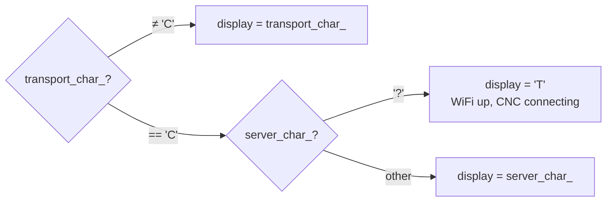
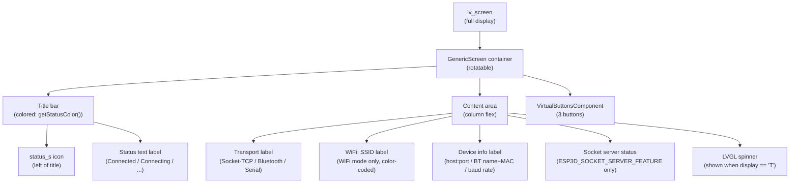
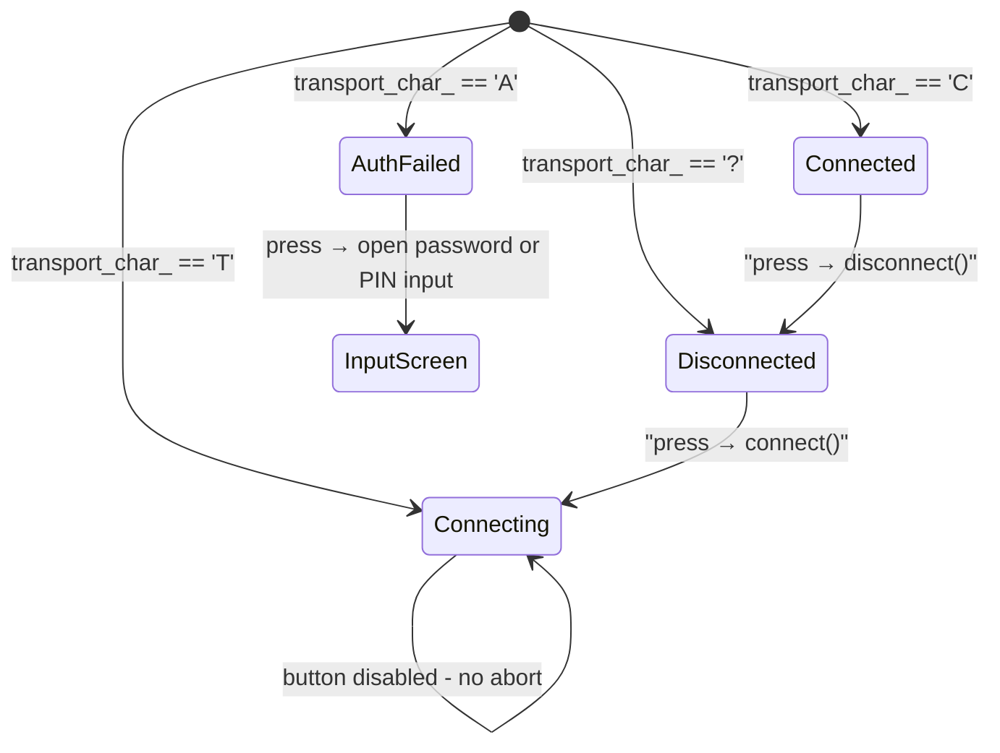
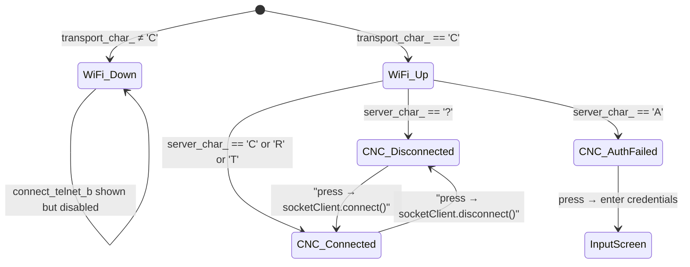
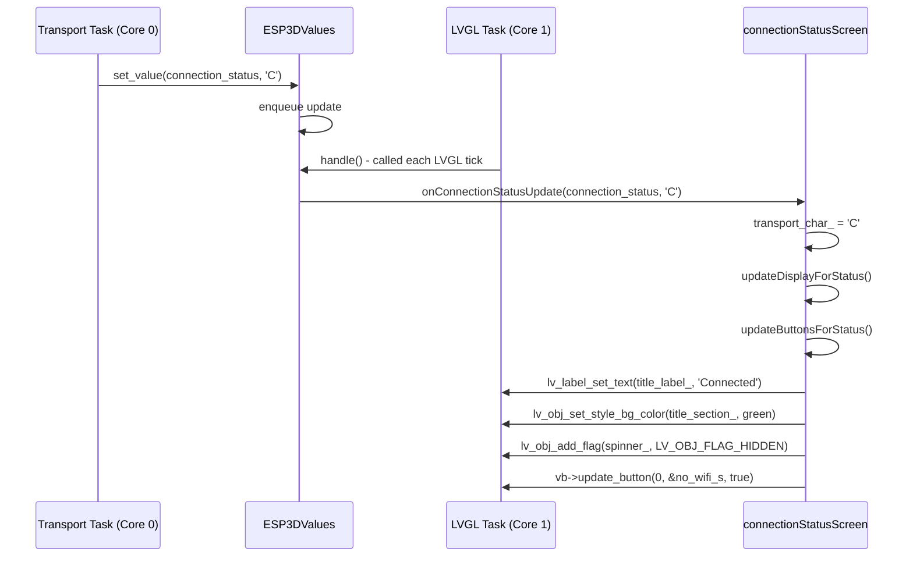
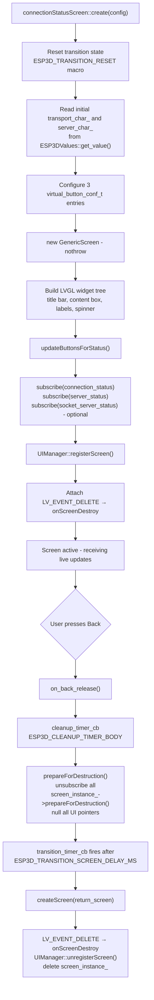
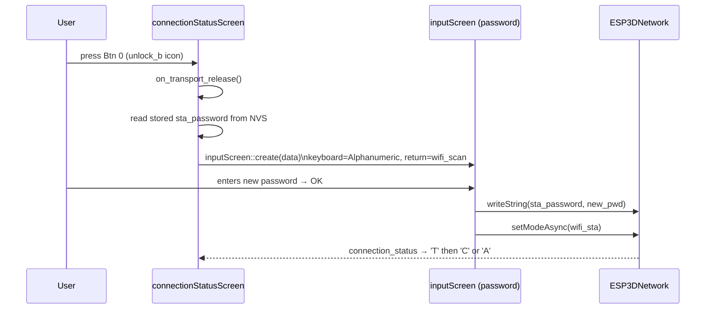
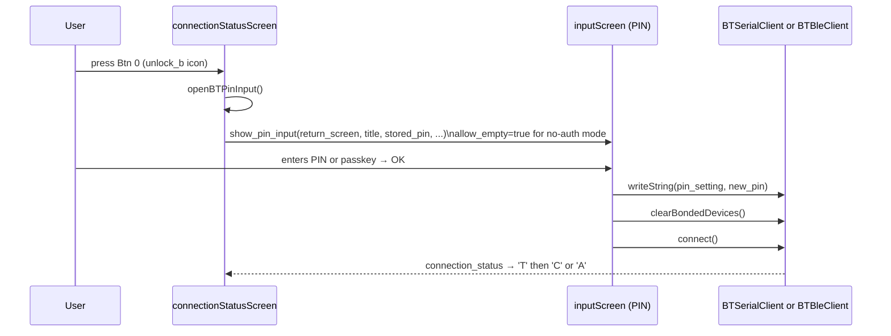
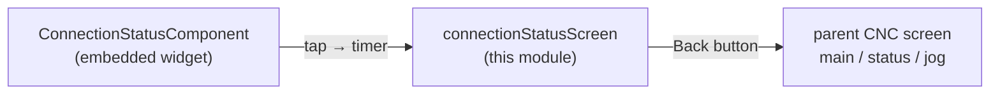

# Connection Status Screen

## Introduction

The **Connection Status Screen** is a full-screen LVGL UI component that provides real-time, interactive visibility into the active CNC transport link — whether that is WiFi (STA), Bluetooth Classic (SPP), Bluetooth BLE (GATT), Serial/UART, USB Serial, TCP Socket, or WebSocket. It is the diagnostic hub the user navigates to when a connection fails, stalls, or needs to be manually managed.

Unlike the compact `ConnectionStatusComponent` widget embedded in operational screens, this is a *dedicated* modal screen that exposes the full connection lifecycle: a color-coded header, protocol details, device info, and contextual action buttons that adapt to the precise connection state character reported by the transport layer.

**Source files:**
- `main/display/screens/connection_status_screen.h`
- `main/display/screens/connection_status_screen.cpp`

---

## Architecture Overview

```mermaid
graph TD
    subgraph "UI Layer - LVGL / Core 1"
        CSS["connectionStatusScreen\n(namespace)"]
        GS["GenericScreen\n(base)"]
        VBC["VirtualButtonsComponent\n(3 buttons)"]
        IS["inputScreen\n(PIN / password entry)"]
    end

    subgraph "Value System"
        EV["ESP3DValues\n(observable store)"]
        CS_IDX["connection_status\n(transport char)"]
        SS_IDX["server_status\n(server char)"]
        SOC_IDX["socket_server_status\n(optional)"]
    end

    subgraph "Transport Clients - background tasks"
        WiFi["ESP3DWifiClient\n(WiFi STA)"]
        BTS["ESP3DBTSerialClient\n(BT Classic SPP)"]
        BTLE["ESP3DBTBleClient\n(BT BLE GATT)"]
        SER["ESP3DSerialClient\n(UART)"]
        SOC["ESP3DSocketClient\n(TCP)"]
        WSC["ESP3DWebsocketClient\n(WebSocket)"]
    end

    subgraph "UIManager"
        UM["UIManager\n(screen registry)"]
    end

    CSS -->|"owns"| GS
    GS -->|"owns"| VBC
    CSS -->|"subscribes"| CS_IDX
    CSS -->|"subscribes"| SS_IDX
    CSS -->|"subscribes (optional)"| SOC_IDX
    CS_IDX --> EV
    SS_IDX --> EV
    SOC_IDX --> EV
    EV -->|"callbacks\n(LVGL task)"| CSS
    CSS -->|"registers"| UM
    CSS -->|"dispatches to"| WiFi
    CSS -->|"dispatches to"| BTS
    CSS -->|"dispatches to"| BTLE
    CSS -->|"dispatches to"| SER
    CSS -->|"dispatches to"| SOC
    CSS -->|"dispatches to"| WSC
    CSS -->|"navigates to\n(on auth failure)"| IS
```

The screen follows the same lifecycle patterns as `firmware_status_screen` — static module-level state, timer-based transitions, `prepareForDestruction()` guard, and UIManager registration — so developers already familiar with that screen can navigate this one immediately. See [screens_architecture.md](https://github.com/luc-github/Pibot-cnc-pendant-firmware/blob/main/docs/architecture/screens_architecture.md) for the general screen system description.

---

## Status Character Protocol

The connection model uses a single `char` per logical layer, published through `ESP3DValues`. See [connection_management.md](https://github.com/luc-github/Pibot-cnc-pendant-firmware/blob/main/docs/architecture/connection_management.md) for the full protocol definition.

| Char | Meaning | Title bar color token |
|------|---------|-----------------------|
| `C`  | Connected (transport or server fully established) | `ESP3D_ACCENT_SELECT_COLOR` (green) |
| `R`  | Read-only / Passive (connected but CNC control limited) | `ESP3D_ACCENT_ACTION_COLOR` (orange) |
| `T`  | Connecting (in progress, spinner shown) | `ESP3D_ACCENT_ACTIVE_COLOR` (blue) |
| `A`  | Authentication failed (wrong PIN / password) | `ESP3D_ACCENT_ACTION_COLOR` (orange) |
| `.`  | Radio/transport off (not attempting to connect) | `ESP3D_DISABLED_COLOR` (grey) |
| `?`  | Disconnected / unknown | `ESP3D_ACCENT_ALERT_COLOR` (red) |

Two independent status indices are tracked simultaneously:

- **`connection_status`** → `transport_char_`: state of the *transport layer* (WiFi association, BT link, Serial readiness).
- **`server_status`** → `server_char_`: state of the *CNC server* connection on top of that transport (TCP socket peer, WebSocket handshake). Only meaningful when the output client is a socket or WebSocket client.

The **displayed** status character is computed by `computeDisplayChar()`, which mirrors the same logic used by the embedded `ConnectionStatusComponent::compute_display_state()`:

This ensures that when WiFi is connected but the TCP/WS peer has not yet responded, the display correctly shows "Connecting" (blue, spinner) rather than the misleading "Connected" of the transport layer alone.

---

## Component Layout

The content area uses LVGL `LV_FLEX_FLOW_COLUMN` with center alignment. The spinner is always created in the column but hidden via `LV_OBJ_FLAG_HIDDEN` when not in connecting state, avoiding object creation/deletion overhead inside callbacks.

---

## Button Layout and State Machine

The three virtual buttons are positioned **left / center / right** and their icon and enabled state are recalculated on every subscription callback via `updateButtonsForStatus()`.

### Button 0 — Transport Action (Left)

Controls the *transport layer*: WiFi association, BT link, Serial open/close.

**Icon mapping by transport type:**

| Transport | `?` state | `C` state | `T` state | `A` state |
|-----------|-----------|-----------|-----------|-----------|
| WiFi STA | `wifi_s` (enabled) | `no_wifi_s` | `wifi_s` (disabled) | `unlock_b` |
| BT Classic | `connect_bt_b` | `disconnect_bt_b` | `connect_bt_b` (disabled) | `unlock_b` |
| BT BLE | `connect_bt_b` | `disconnect_bt_b` | `connect_bt_b` (disabled) | `unlock_b` |
| Serial / UART | `serial_m` | `disconnect_serial_m` | `serial_m` (disabled) | — |
| UART Ext | `ext_module_m` | `disconnect_ext_module_m` | `ext_module_m` (disabled) | — |

### Button 1 — Server Action (Center)

Present only in specific build configurations. Behavior depends on the active feature flags:

- **WiFi + Socket Client or WebSocket Client** (`ESP3D_SOCKET_CLIENT_FEATURE` or `ESP3D_WS_CLIENT_SERVICE_FEATURE`): controls the TCP/WS connection to the CNC host. Hidden when the active output client is not an IP-based CNC client.
- **Serial / UART (no BT, no WiFi socket)**: shows a "refresh init commands" button, visible only when transport is connected.
- **BT builds**: always hidden (BT host = server, single connection layer, no separate server control).

### Button 2 — Back (Right)

Always present and always enabled. Triggers the standard `cleanup_timer → transition_timer` chain that safely destroys this screen and navigates to `config.return_screen` (typically `ESP3DScreenType::main`).

---

## Subscription Data Flow

> **Thread safety**: All `lv_obj_*` calls happen on the LVGL task (Core 1) because `ESP3DValues::handle()` is called from the LVGL tick timer and subscription callbacks are invoked synchronously from `handle()`. Transport tasks on Core 0 only call `set_value()`, which enqueues the update into a thread-safe ring buffer without touching LVGL objects.

---

## Screen Lifecycle

The `prepareForDestruction()` guard (`is_prepared_for_destruction_` + `cleanup_executed_`) prevents double-unsubscription if both a timer callback and `onScreenDestroy` fire in quick succession — a real risk in the LVGL event model during rapid transitions. This pattern is described in detail in [screen_transitions_flow.md](https://github.com/luc-github/Pibot-cnc-pendant-firmware/blob/main/docs/architecture/screen_transitions_flow.md).

---

## Authentication Flows

### WiFi Authentication Failure (`transport_char_ == 'A'`)

The user pressed Btn 0 while transport status is `'A'`. The screen opens `inputScreen` in alphanumeric (password) mode and returns to `wifi_scan` on completion.

### Bluetooth PIN / BLE Passkey Failure (`transport_char_ == 'A'`)

The `openBTPinInput()` helper selects the correct PIN length (4 digits for BT Classic HC-06, 6 digits for BLE passkey) and NVS setting index based on the active output client. Passing `allow_empty=true` permits an empty PIN, which means no authentication (SEC_NONE).

See [Input_system.md](https://github.com/luc-github/Pibot-cnc-pendant-firmware/blob/main/docs/architecture/Input_system.md) for details on the PIN and alphanumeric keyboard modes.

---

## Relationship to ConnectionStatusComponent

The compact `ConnectionStatusComponent` (defined separately for each CNC firmware variant in `main/display/cnc/fluidnc/components/`, `main/display/cnc/grbl/components/`, and `main/display/cnc/grblhal/components/`) is a **lightweight embeddable widget** shown inside operational screens (status screen, jog screen, probe screen).

| Aspect | `ConnectionStatusComponent` | `connectionStatusScreen` |
|--------|---------------------------|--------------------------|
| Type | Inline widget (icon + spinner) | Full-screen modal |
| Purpose | Passive status indicator | Interactive diagnostic and action hub |
| Buttons | None — tap opens this screen | 3 adaptive action buttons |
| Navigation | Tap → opens `connection_status` screen | Back button → returns to `return_screen` |
| Status tracked | `transport_char_` + `server_char_` | `transport_char_` + `server_char_` |
| Display logic | `compute_display_state()` | `computeDisplayChar()` (identical logic) |
| Auth retry | Not available | Full PIN / password re-entry flow |

When the user taps the `ConnectionStatusComponent` icon, a timer fires `createScreen(ESP3DScreenType::connection_status)` with the parent screen set as `return_screen`, bringing up this full-screen view.

---

## Build-Time Feature Guards

The screen compiles conditionally based on active transport features. Only enabled features contribute code:

| Preprocessor symbol | Effect on this screen |
|---------------------|-----------------------|
| `ESP3D_WIFI_FEATURE` | Enables WiFi transport button, network label (`WiFi: SSID`), `esp_wifi_sta_get_ap_info()` |
| `ESP3D_BT_SERIAL_FEATURE` | Enables BT Classic connect / disconnect / PIN flow |
| `ESP3D_BT_BLE_FEATURE` | Enables BLE connect / disconnect / passkey flow |
| `ESP3D_SOCKET_CLIENT_FEATURE` | Enables center button for TCP socket CNC connection |
| `ESP3D_WS_CLIENT_SERVICE_FEATURE` | Enables center button for WebSocket CNC connection |
| `ESP3D_UART_EXT_FEATURE` | Enables external UART module connect / disconnect |
| `ESP3D_SOCKET_SERVER_FEATURE` | Adds `socket_label_` showing local socket server state (WiFi STA only) |

> **Mutual exclusion**: `ESP3D_SOCKET_CLIENT_FEATURE` and `ESP3D_BT_SERIAL_FEATURE` / `ESP3D_BT_BLE_FEATURE` are mutually exclusive at the build level, enforced by `cmake/sanity_check.cmake`. The center button logic reflects this: BT builds always hide Btn 1; WiFi + Socket builds show it only when the active output client is an IP client. See [feature_resource_matrix.md](https://github.com/luc-github/Pibot-cnc-pendant-firmware/blob/main/docs/features/feature_resource_matrix.md) for the full compatibility matrix.

---

## Key Design Decisions and Constraints

### No LVGL Object Access from Background Tasks

All `lv_obj_*` calls (label text, color, visibility, spinner) happen exclusively inside subscription callbacks and button release callbacks, which both execute on the **LVGL task (Core 1)**. Transport tasks on Core 0 only call `ESP3DValues::set_value()`, which enqueues the update into a thread-safe ring buffer without touching LVGL objects. This is the mandatory pattern for all UI updates in this project — see the LVGL constraints section of `CLAUDE.md`.

### `prepareForDestruction()` Before Navigation

Any code path that creates a new screen (Back press, PIN input entry, WiFi scan redirect) must call `prepareForDestruction()` first, or supply it as the `prepare_current_screen_destruction` callback. This unsubscribes all value callbacks before the LVGL object tree starts being torn down, preventing callbacks from firing on a partially-destroyed widget tree during the transition delay.

### `std::nothrow` Allocation

`GenericScreen` is allocated with `new (std::nothrow)` to prevent uncaught exceptions in the LVGL context. An uncaught exception in an LVGL callback would reset the board. A failed allocation is logged with heap diagnostics and the function returns early, leaving the existing screen intact.

### I4 Icon Images — No Recolor

The `status_s` icon in the title bar uses LVGL 9.2's I4 (4-bit indexed) image format. Applying `image_recolor` with `LV_OPA_COVER` on indexed images silently drops pixel alpha, making the icon invisible. The palette is pre-baked to near-white pixels that render correctly on all title-bar background colors without requiring runtime recolor.

### Spinner Always in the Flex Column

The spinner is created once at screen creation time and inserted into the content flex column. It is shown or hidden with `LV_OBJ_FLAG_HIDDEN` based on `computeDisplayChar() == 'T'`. This avoids the LVGL object creation and deletion cost inside a subscription callback that fires on every status change.

### Color-Coded Labels (WiFi + Socket Mode)

In WiFi + socket/WebSocket builds, the network label and device info label use three-level color coding updated on every status callback:

- **Grey** (`ESP3D_DISABLED_COLOR`): WiFi is not associated — CNC host is unreachable.
- **Orange** (`ESP3D_INDICATOR_WARNING_COLOR`): WiFi is up but CNC is not connected.
- **Normal text** (`ESP3D_SCREEN_BACKGROUND_TEXT_COLOR`): both layers are connected.

---

## Related Documentation

- [screens_architecture.md](https://github.com/luc-github/Pibot-cnc-pendant-firmware/blob/main/docs/architecture/screens_architecture.md) — Screen system overview, `GenericScreen` base class, UIManager screen registry
- [screen_transitions_flow.md](https://github.com/luc-github/Pibot-cnc-pendant-firmware/blob/main/docs/architecture/screen_transitions_flow.md) — Timer-based transition patterns: `cleanup_timer`, `transition_timer`, `prepareForDestruction()` guard
- [connection_management.md](https://github.com/luc-github/Pibot-cnc-pendant-firmware/blob/main/docs/architecture/connection_management.md) — Full connection status protocol (`U`, `T`, `C`, `?`, `A`), shared initialization sequence across transports
- [Input_system.md](https://github.com/luc-github/Pibot-cnc-pendant-firmware/blob/main/docs/architecture/Input_system.md) — `inputScreen` PIN / password entry modal used for authentication retry flows
- [ui_components.md](ui_components.md) — `VirtualButtonsComponent`, `GenericScreen`, and other shared UI building blocks
- [values.md](values.md) — `ESP3DValues` observable store, subscription API, thread-safety model
- [feature_resource_matrix.md](https://github.com/luc-github/Pibot-cnc-pendant-firmware/blob/main/docs/features/feature_resource_matrix.md) — WiFi / BT / socket-client mutual exclusion rules, resource budgets
