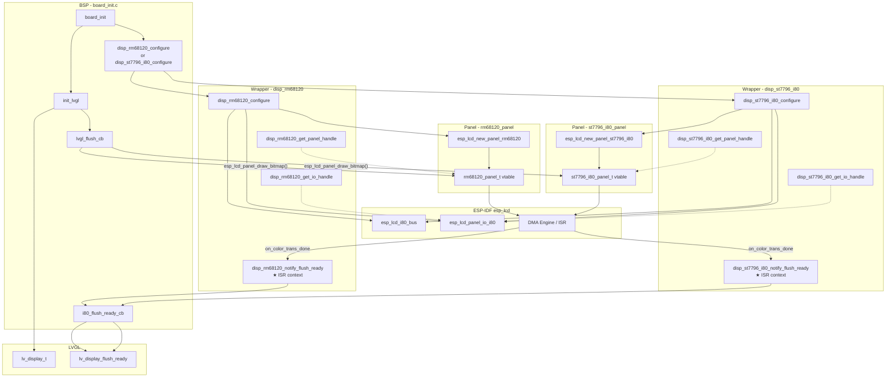
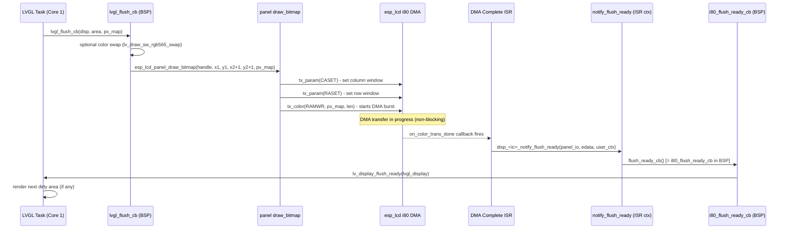
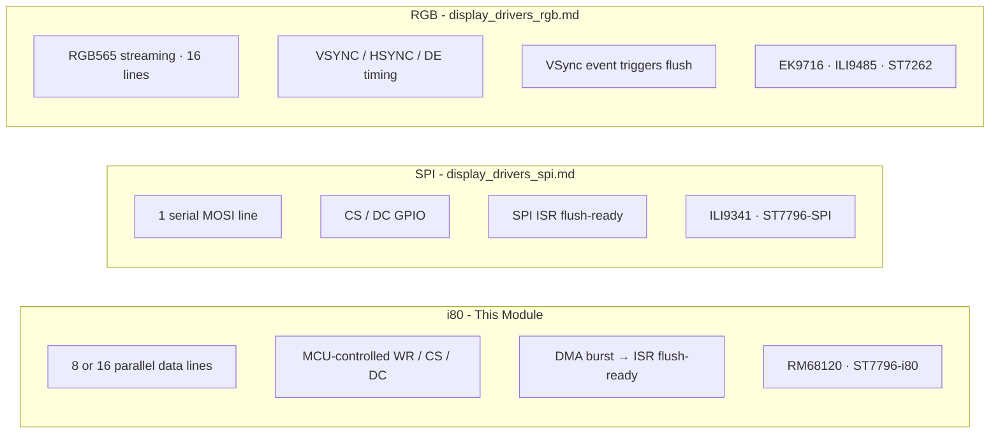

# Display Drivers — Intel 8080 (i80) Parallel Bus

## Introduction

The `display_drivers_i80` module provides ESP-IDF–compatible LCD panel drivers for the **Intel 8080 (i80) parallel bus**, also known as the "8080-compatible MCU interface" or "8-bit/16-bit parallel" interface. Unlike SPI (serial) or RGB streaming interfaces, the i80 bus transfers pixel data over a wide parallel data bus (8 or 16 data lines), giving it significantly higher bandwidth than SPI while retaining MCU-controlled timing — a key advantage for mid-to-large displays on ESP32-S3.

This module sits in the Hardware Abstraction Layer (HAL) as a peer of [display_drivers_spi.md](display_drivers_spi.md) and [display_drivers_rgb.md](display_drivers_rgb.md). It is consumed exclusively by board-specific BSP code; the application layer (LVGL, UI Manager) never calls into it directly.

Two controller families are supported:

| Sub-driver | Controller | Bus | Typical Board |
|---|---|---|---|
| `disp_rm68120` | Raydium RM68120 | i80 16-bit | `esp32s3_hmi43v3` |
| `disp_st7796_i80` | Sitronix ST7796 (i80 mode) | i80 8/16-bit | `esp32s3_zx3d50ce02s_usrc_4832` |

---

## Architecture Overview

Each sub-driver is composed of three files forming two distinct layers:

```
┌─────────────────────────────────────────────────┐
│              BSP  (board_init.c)                │  ← board-specific pin config + lifecycle
├─────────────────────────────────────────────────┤
│  WRAPPER LAYER   disp_<ic>.c / disp_<ic>.h      │  ← bus/IO init, flush-ready plumbing
├─────────────────────────────────────────────────┤
│  PANEL LAYER     <ic>_panel.c / <ic>_panel.h    │  ← esp_lcd_panel_t vtable implementation
├─────────────────────────────────────────────────┤
│  ESP-IDF esp_lcd  (esp_lcd_panel_io / ops)      │  ← IDF i80 bus + DMA engine
└─────────────────────────────────────────────────┘
```

### Layer Responsibilities

| Layer | Files | Responsibility |
|---|---|---|
| BSP | `boards/<board>/components/bsp/board_init.c` | Pin mapping, config structs, calls `disp_<ic>_configure()`, wires LVGL flush chain |
| Wrapper | `disp_<ic>.c`, `disp_<ic>.h` | Creates i80 bus + panel IO handles, stores static handles, injects `on_color_trans_done` ISR hook, exposes `get_panel_handle()` / `get_io_handle()` |
| Panel | `<ic>_panel.c`, `<ic>_panel.h` | Implements full `esp_lcd_panel_t` vtable: `init`, `reset`, `draw_bitmap`, `mirror`, `swap_xy`, `invert_color`, `set_gap`, `disp_on_off`, `del` |

---

## Component Diagram



---

## File Structure

```
hardware/drivers_video_i80/
├── disp_rm68120/
│   ├── disp_rm68120.h          # Public API — configure, get_panel/io_handle
│   ├── disp_rm68120.c          # Wrapper: bus/IO creation, ISR routing
│   ├── disp_rm68120_config.h   # disp_rm68120_config_t, orientation enum, callback typedef
│   ├── rm68120_panel.h         # esp_lcd_new_panel_rm68120() declaration
│   └── rm68120_panel.c         # Panel vtable implementation + init register sequence
└── disp_st7796_i80/
    ├── disp_st7796_i80.h       # Public API — configure, get_panel/io_handle
    ├── disp_st7796_i80.c       # Wrapper: bus/IO creation, ISR routing
    ├── disp_st7796_i80_config.h# disp_st7796_i80_config_t, orientation enum, callback typedef
    ├── st7796_i80_panel.h      # esp_lcd_new_panel_st7796_i80() declaration
    └── st7796_i80_panel.c      # Panel vtable implementation + init register sequence
```

---

## Sub-Driver: RM68120 (`disp_rm68120`)

### Overview

The RM68120 is a Raydium TFT LCD controller supporting up to 480×800 resolution on an i80 16-bit parallel bus. It is used on the **ESP32-S3 HMI 4.3″ board** (`esp32s3_hmi43v3`).

The RM68120 initialization sequence is extensive: it programs three full per-channel gamma curves (Red D100h–D134h, Green D200h–D234h, Blue D300h–D334h, plus D400h–D634h for the second set of channels), AVDD/AVEE/VCL/VGLX voltage regulators (B000h–BA02h), display timing controls (C80xh), and tearing-effect output before issuing SLEEP OUT, MADCTL, COLMOD, and DISPON.

### Configuration Structure

```c
// hardware/drivers_video_i80/disp_rm68120/disp_rm68120_config.h

typedef struct {
    esp_lcd_i80_bus_config_t      bus_config;    // Data bus width, clock speed, GPIO data pins
    esp_lcd_panel_io_i80_config_t io_config;     // CS, DC/RS, pclk_hz, lcd_cmd_bits (16-bit)
    esp_lcd_panel_dev_config_t    panel_config;  // RST GPIO, bits_per_pixel, RGB element order
    disp_rm68120_orientation_t    orientation;   // Portrait / Landscape / inverted variants
    uint16_t                      hor_res;       // Native horizontal resolution (pixels)
    uint16_t                      ver_res;       // Native vertical resolution (pixels)
} disp_rm68120_config_t;

// Invoked from the DMA ISR when a color transfer completes — must be minimal and ISR-safe
typedef void (*disp_rm68120_flush_ready_cb_t)(void);
```

#### Orientation Enum

| Value | Degrees | MADCTL byte | Width/Height swap |
|---|---|---|---|
| `DISP_RM68120_ORIENTATION_PORTRAIT` | 0° | `0x00` | No |
| `DISP_RM68120_ORIENTATION_LANDSCAPE` | 90° | `0x60` | Yes |
| `DISP_RM68120_ORIENTATION_PORTRAIT_INVERTED` | 180° | `0xC0` | No |
| `DISP_RM68120_ORIENTATION_LANDSCAPE_INVERTED` | 270° | `0xA0` | Yes |

The panel struct also stores a `scr_dir_t` direction value (`SCR_DIR_LRTB`, `SCR_DIR_TBLR`, etc.) derived from the orientation that encodes the physical frame-buffer scan direction.

### Public API

```c
// Initialize the i80 bus, panel IO, and RM68120 panel.
// flush_ready_cb is called from the DMA ISR when a pixel transfer completes.
esp_err_t disp_rm68120_configure(const disp_rm68120_config_t *config,
                                  disp_rm68120_flush_ready_cb_t flush_ready_cb);

// Returns the panel handle for use with esp_lcd_panel_* ops and LVGL user data.
esp_lcd_panel_handle_t disp_rm68120_get_panel_handle(void);

// Returns the panel IO handle.
esp_lcd_panel_io_handle_t disp_rm68120_get_io_handle(void);
```

### Internal Panel Struct (`rm68120_panel_t`)

```c
typedef struct {
    esp_lcd_panel_t          base;           // vtable — must be first member
    esp_lcd_panel_io_handle_t io;
    int                      reset_gpio_num;
    bool                     reset_level;
    uint16_t                 width;          // effective after orientation swap
    uint16_t                 height;
    uint8_t                  dir;            // scr_dir_t scan direction
    int                      x_gap;
    int                      y_gap;
    unsigned int             bits_per_pixel;
    uint8_t                  madctl_val;     // current MADCTL register value (3600h)
    uint8_t                  colmod_cal;     // current COLMOD register value (3A00h)
} rm68120_panel_t;
```

### Panel Vtable Operations

| Function | Description |
|---|---|
| `panel_rm68120_reset` | Hardware GPIO reset (20 ms assert + 20 ms deassert) or software `SWRESET` |
| `panel_rm68120_init` | Runs `rm68120_reg_config()`, then SLEEP OUT → MADCTL → COLMOD → DISPON |
| `panel_rm68120_draw_bitmap` | Sets column window via 4 separate 8-bit register writes to CASET, row window via 4 writes to RASET, then `RAMWR` + DMA color burst |
| `panel_rm68120_mirror` | Updates `MX` / `MY` bits of live MADCTL register |
| `panel_rm68120_swap_xy` | Updates `MV` bit of live MADCTL register |
| `panel_rm68120_invert_color` | Sends `INVON` or `INVOFF` |
| `panel_rm68120_set_gap` | Stores x/y pixel offsets applied at every `draw_bitmap` |
| `panel_rm68120_disp_off` | Sends `DISPOFF` or `DISPON` |
| `panel_rm68120_del` | Resets RST GPIO and frees the panel struct |

> **RM68120 register protocol note:** Unlike standard MIPI DCS where a command is followed by a data payload in a single transaction, the RM68120 encodes each command byte and its sequential byte-index into a 16-bit word on the i80 bus. For example, the first byte of CASET is sent as `(LCD_CMD_CASET << 8) + 0`, the second as `(LCD_CMD_CASET << 8) + 1`, etc. This is why `draw_bitmap` issues **eight separate `tx_param` calls** (four for CASET, four for RASET) instead of two 4-byte payloads.

---

## Sub-Driver: ST7796 i80 (`disp_st7796_i80`)

### Overview

The ST7796 is a Sitronix TFT LCD controller with both SPI and parallel interface modes. This sub-driver covers the **i80 (parallel) variant** used on the **ZX3D50CE02S board** (`esp32s3_zx3d50ce02s_usrc_4832`). The SPI variant of the same controller is covered in [display_drivers_spi.md](display_drivers_spi.md).

Unlike the RM68120, the ST7796 i80 panel uses standard MIPI DCS command framing: CASET/RASET are sent as single 4-byte payload transactions. Color inversion (`INVON`) is applied by default in `disp_st7796_i80_configure()` immediately after `panel.init()`. If the orientation is landscape, `swap_xy` is also applied automatically at configure time.

### Configuration Structure

```c
// hardware/drivers_video_i80/disp_st7796_i80/disp_st7796_i80_config.h

typedef struct {
    esp_lcd_i80_bus_config_t       bus_config;   // Data bus width, clock speed, GPIO data pins
    esp_lcd_panel_io_i80_config_t  io_config;    // CS, DC, pclk_hz, lcd_cmd_bits
    esp_lcd_panel_dev_config_t     panel_config; // RST GPIO, bits_per_pixel, RGB element order
    disp_st7796_i80_orientation_t  orientation;  // Portrait / Landscape / inverted
    uint16_t                       hor_res;      // Horizontal resolution (pixels)
    uint16_t                       ver_res;      // Vertical resolution (pixels)
} disp_st7796_i80_config_t;

// Invoked from the DMA ISR when a color transfer completes — must be minimal and ISR-safe
typedef void (*disp_st7796_i80_flush_ready_cb_t)(void);
```

#### Orientation Enum

| Value | Degrees |
|---|---|
| `DISP_ST7796_I80_ORIENTATION_PORTRAIT` | 0° |
| `DISP_ST7796_I80_ORIENTATION_LANDSCAPE` | 90° |
| `DISP_ST7796_I80_ORIENTATION_PORTRAIT_INVERTED` | 180° |
| `DISP_ST7796_I80_ORIENTATION_LANDSCAPE_INVERTED` | 270° |

### Public API

```c
// Initialize the i80 bus, panel IO, and ST7796 panel.
// Also applies invert_color and swap_xy post-init when landscape orientation is selected.
esp_err_t disp_st7796_i80_configure(const disp_st7796_i80_config_t *config,
                                     disp_st7796_i80_flush_ready_cb_t flush_ready_cb);

// Returns the panel handle for LVGL / esp_lcd_panel_* calls.
esp_lcd_panel_handle_t disp_st7796_i80_get_panel_handle(void);

// Returns the panel IO handle.
esp_lcd_panel_io_handle_t disp_st7796_i80_get_io_handle(void);
```

### Internal Panel Struct (`st7796_i80_panel_t`)

```c
typedef struct {
    esp_lcd_panel_t           base;           // vtable — must be first member
    esp_lcd_panel_io_handle_t io;
    int                       reset_gpio_num;
    bool                      reset_level;
    int                       x_gap;
    int                       y_gap;
    unsigned int              bits_per_pixel;
    uint8_t                   madctl_val;     // current MADCTL register value
    uint8_t                   colmod_cal;     // current COLMOD register value
} st7796_i80_panel_t;
```

### Panel Vtable Operations

| Function | Description |
|---|---|
| `panel_st7796_i80_reset` | Hardware GPIO reset (10 ms pulse) or software `SWRESET` (20 ms delay) |
| `panel_st7796_i80_init` | SLEEP OUT (100 ms) → MADCTL → COLMOD → DISPON |
| `panel_st7796_i80_draw_bitmap` | CASET (4-byte payload), RASET (4-byte payload), `RAMWR` + DMA color burst |
| `panel_st7796_i80_mirror` | Updates `MX` / `MY` bits of live MADCTL register |
| `panel_st7796_i80_swap_xy` | Updates `MV` bit of live MADCTL register |
| `panel_st7796_i80_invert_color` | Sends `INVON` or `INVOFF` |
| `panel_st7796_i80_set_gap` | Stores x/y pixel offsets |
| `panel_st7796_i80_disp_off` | Sends `DISPOFF` or `DISPON` |
| `panel_st7796_i80_del` | Resets RST GPIO and frees the panel struct |

---

## Data Flow: LVGL → DMA → Flush Ready

The i80 flush path is fully asynchronous and DMA-driven. The LVGL task submits a pixel buffer and returns immediately; LVGL can render the next frame only after the ISR signals completion.



### Critical Rules for This Flow

- **`notify_flush_ready` runs in ISR context.** It invokes the user callback through the `user_ctx` pointer stored at configure time — zero heap allocation, no blocking, no FreeRTOS API calls.
- **`i80_flush_ready_cb` must be one line.** In all i80 board BSPs it contains exactly: `lv_display_flush_ready(lvgl_display);`.
- **`lvgl_flush_cb` must not block after submitting the bitmap.** It calls `esp_lcd_panel_draw_bitmap()` and returns; LVGL resumes only after the ISR fires.
- **The `on_color_trans_done` field is always injected by the wrapper** — the BSP never sets it on `io_config`. The wrapper overwrites that field before calling `esp_lcd_new_panel_io_i80`, piping the callback through `user_ctx`.

---

## Board Initialization Sequence

```mermaid
flowchart TD
    START([board_init]) --> ACT[activity_manager_init]
    ACT --> OPT_BL{Backlight\nControl?}
    OPT_BL -- yes --> BLINIT["backlight_configure()\nbacklight_set(0)"]
    OPT_BL -- no --> OPT_IO
    BLINIT --> OPT_IO

    OPT_IO{IO Expander\nNeeded?}
    OPT_IO -- yes --> IOINIT[init_io_expander\ne.g. CH422G on hmi43v3]
    OPT_IO -- no --> DCFG
    IOINIT --> DCFG

    DCFG["disp_rm68120_configure()\nor disp_st7796_i80_configure()"]
    DCFG --> BUS[esp_lcd_new_i80_bus\nAllocate i80 bus handle]
    BUS --> PIO["esp_lcd_new_panel_io_i80\nInject on_color_trans_done → notify_flush_ready"]
    PIO --> PNEW["esp_lcd_new_panel_<ic>()\nAlloc panel struct, populate vtable"]
    PNEW --> RST["panel.reset()\nHardware or software reset"]
    RST --> INIT["panel.init()\nWrite registers, gamma tables, timing"]
    INIT --> OPT_POST{Post-init\nadjustments?}
    OPT_POST -- "ST7796: invert_color + landscape swap_xy" --> ISWAP["esp_lcd_panel_invert_color()\nesp_lcd_panel_swap_xy()"]
    OPT_POST -- RM68120: orientation handled in init --> SKIP[ ]
    ISWAP --> TOUCH
    SKIP --> TOUCH

    TOUCH{Touch Feature\nEnabled?}
    TOUCH -- yes --> TCHINI[init_touch_controller]
    TOUCH -- no --> LVGL
    TCHINI --> LVGL

    LVGL[init_lvgl]
    LVGL --> LVINIT[lv_init]
    LVINIT --> LVD["lv_display_create(DISPLAY_WIDTH_PX, DISPLAY_HEIGHT_PX)"]
    LVD --> DBUF["heap_caps_malloc(MALLOC_CAP_DMA)\nSingle or double draw buffer"]
    DBUF --> LVCB["lv_display_set_flush_cb → lvgl_flush_cb\nlv_display_set_user_data → panel_handle"]
    LVCB --> LVTICK["esp_timer_start_periodic → increase_lvgl_tick"]
    LVTICK --> LVTOUCH{Touch indev\nregistered?}
    LVTOUCH -- yes --> LTINDEV["lv_indev_create(LV_INDEV_TYPE_POINTER)\nlv_indev_set_read_cb → touch_read_cb"]
    LVTOUCH -- no --> DONE
    LTINDEV --> DONE([Board ready])
```



---

## BSP Integration Pattern

Both i80 boards follow the same three-part integration pattern. Here is the canonical form:

```c
// ── 1. Static board config (pin numbers are board-specific) ──────────────
static const disp_rm68120_config_t disp_rm68120_default_config = {
    .bus_config = {
        .dc_gpio_num     = PIN_DC,
        .wr_gpio_num     = PIN_WR,
        .clk_src         = LCD_CLK_SRC_DEFAULT,
        .data_gpio_nums  = { PIN_D0, PIN_D1, ... PIN_D15 },
        .bus_width       = 16,
        .max_transfer_bytes = DISPLAY_WIDTH_PX * DISPLAY_HEIGHT_PX * 2 + 8,
    },
    .io_config = {
        .cs_gpio_num     = PIN_CS,
        .pclk_hz         = 10 * 1000 * 1000,
        .lcd_cmd_bits    = 16,
        .lcd_param_bits  = 16,
        /* on_color_trans_done is left 0 here — wrapper injects it */
    },
    .panel_config = {
        .reset_gpio_num  = PIN_RST,
        .bits_per_pixel  = 16,
        .rgb_ele_order   = LCD_RGB_ELEMENT_ORDER_RGB,
    },
    .orientation = DISP_RM68120_ORIENTATION_LANDSCAPE,
    .hor_res = 480,
    .ver_res = 800,
};

// ── 2. ISR-context flush-ready callback — must stay minimal ─────────────
static void i80_flush_ready_cb(void) {
    lv_display_flush_ready(lvgl_display);  // single safe call, no blocking
}

// ── 3. LVGL flush callback — runs on LVGL task (Core 1) ─────────────────
static void lvgl_flush_cb(lv_display_t *disp,
                           const lv_area_t *area,
                           uint8_t *px_map) {
    esp_lcd_panel_handle_t panel = lv_display_get_user_data(disp);
    if (DISPLAY_SWAP_COLOR_FLAG) {
        lv_draw_sw_rgb565_swap(
            px_map,
            (area->x2 + 1 - area->x1) * (area->y2 + 1 - area->y1));
    }
    // Submit to DMA — returns immediately, ISR fires lv_display_flush_ready later
    esp_lcd_panel_draw_bitmap(panel,
                              area->x1, area->y1,
                              area->x2 + 1, area->y2 + 1,
                              px_map);
}

// ── 4. board_init wires everything together ──────────────────────────────
ret = disp_rm68120_configure(&disp_rm68120_default_config, i80_flush_ready_cb);
// init_lvgl() retrieves the panel handle via disp_rm68120_get_panel_handle()
```

---

## Board Support Matrix

| Board | Driver | Controller | Bits/px | Orientation | IO Expander | Touch |
|---|---|---|---|---|---|---|
| `esp32s3_hmi43v3` | `disp_rm68120` | RM68120 | 16 | Landscape | CH422G | FT5x06 |
| `esp32s3_zx3d50ce02s_usrc_4832` | `disp_st7796_i80` | ST7796 | 16 | Landscape | — | FT6336U |

Both boards also ship factory test applications that include a lean standalone flush-ready callback:
- `boards/esp32s3_hmi43v3/Factory/main/rm68120.c` — `rm68120_flush_ready_cb()`
- `boards/esp32s3_zx3d50ce02s_usrc_4832/Factory/main/st7796_i80.c` — `st7796_i80_flush_ready_cb()`

> The `esp32s3_hmi43v3` board requires the CH422G I/O expander to drive the RM68120 reset line and control backlight GPIO. See [bsp.md](bsp.md) for IO expander driver details.

---

## RM68120 vs ST7796-i80 Differences

| Aspect | RM68120 | ST7796 i80 |
|---|---|---|
| Register protocol | Extended: `(cmd << 8) + byte_index` per 16-bit word | Standard MIPI DCS: `cmd` + contiguous data payload |
| CASET / RASET | 8 separate `tx_param` calls (one byte each) | 2 `tx_param` calls (4-byte payload each) |
| Gamma tables | Fully programmed in `rm68120_reg_config()` at startup | Default silicon gamma; no custom gamma at startup |
| Page unlock sequence | Required: F000h–F004h sequence before register groups | Not required |
| Invert default | Not inverted (driver applies orientation MADCTL only) | Inverted by default — `INVON` always applied in `configure()` |
| Orientation handling | Fully resolved inside `esp_lcd_new_panel_rm68120()` using `scr_dir_t` | `swap_xy` applied by the wrapper in `disp_st7796_i80_configure()` for landscape |
| Color order | Configurable via `rgb_ele_order` (`LCD_RGB_ELEMENT_ORDER_RGB/BGR`) | Configurable via `rgb_ele_order` |
| Pixel color format | 16/18/24 bpp via COLMOD (0x55/0x66/0x77) | 16/18/24 bpp via COLMOD (0x55/0x66/0x77) |

---

## Comparison with Other Display Bus Types



| Property | i80 (this module) | SPI | RGB |
|---|---|---|---|
| Data lines | 8 or 16 | 1 (MOSI) | 16 (RGB565) |
| Timing control | MCU (WR pulse) | MCU (CLK edge) | Panel (VSYNC/HSYNC) |
| Flush trigger | `on_color_trans_done` DMA ISR | DMA ISR / `notify_flush_ready` | `disp_on_vsync_event` |
| Frame buffer | Partial — in MCU DMA-capable RAM | Partial — in MCU RAM | Full frame — typically PSRAM |
| Typical panel size | 3.5–5″ | ≤ 3.5″ | 4.3–7″ |
| GPIO count | High (8–16 data + control) | Low (≤ 4) | Very high (16 data + sync) |

---

## Memory Considerations

The i80 drivers themselves allocate only one small struct per panel (`calloc(1, sizeof(<panel>_t))`). All substantial memory is owned by the BSP:

- **Draw buffer(s):** Allocated in `init_lvgl()` via `heap_caps_malloc(..., MALLOC_CAP_DMA)`. **DMA-capable internal DRAM is required** — the ESP32-S3 i80 DMA engine cannot access PSRAM without special configuration.
- **Single vs double buffer:** Controlled per board by the `DISPLAY_USE_DOUBLE_BUFFER_FLAG` compile-time flag. Double buffering eliminates tearing at the cost of doubling the DMA buffer allocation.
- **Flush path is allocation-free:** The `notify_flush_ready` ISR handler performs no heap operations.
- **Snapshot feature:** When `ESP3D_SNAPSHOT_FEATURE` is enabled, `lvgl_flush_cb` writes pixel chunks to a file during the flush. Chunk size is fixed at 120 bytes to avoid stack pressure.

See [esp32_memory_constraints.md](https://github.com/luc-github/Pibot-cnc-pendant-firmware/blob/main/docs/guides/esp32_memory_constraints.md) for heap budget analysis across display configurations.

---

## Related Documentation

| Document | Topic |
|---|---|
| [display_drivers.md](https://github.com/luc-github/Pibot-cnc-pendant-firmware/blob/main/docs/architecture/display_drivers.md) | Top-level architecture: SPI vs i80 vs RGB, physical/logical resolution, orientation math |
| [display_drivers_spi.md](display_drivers_spi.md) | SPI bus drivers: ILI9341, ST7796 SPI variant |
| [display_drivers_rgb.md](display_drivers_rgb.md) | RGB parallel streaming drivers: EK9716, ILI9485, ST7262 |
| [bsp.md](bsp.md) | Board Support Package: board_init, touch controllers, IO expanders, control events |
| [esp32_memory_constraints.md](https://github.com/luc-github/Pibot-cnc-pendant-firmware/blob/main/docs/guides/esp32_memory_constraints.md) | Heap budgets, DMA buffer sizing, fragmentation guidance |
