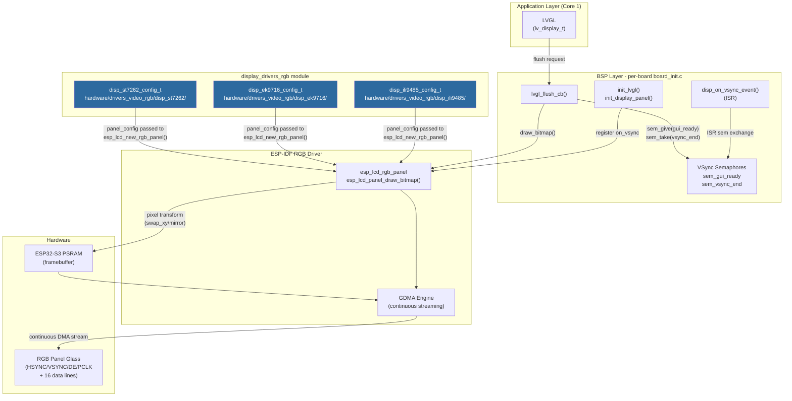
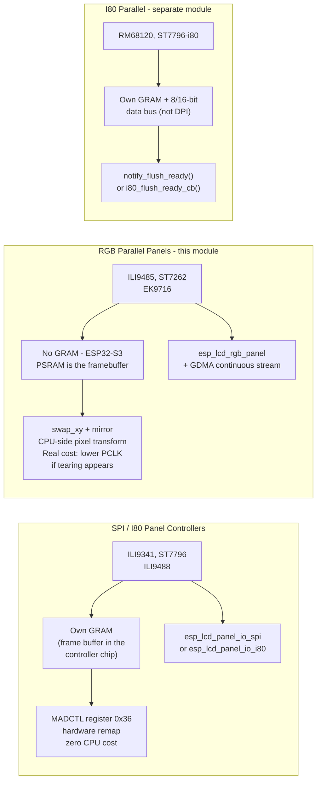
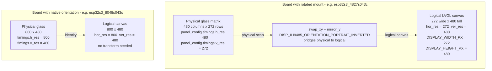
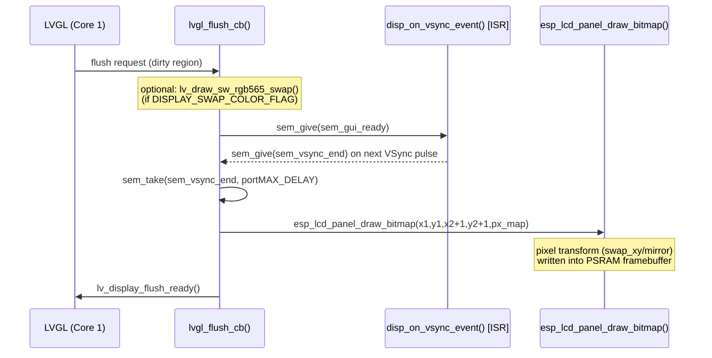
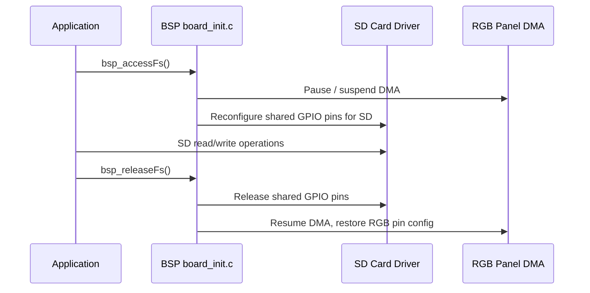
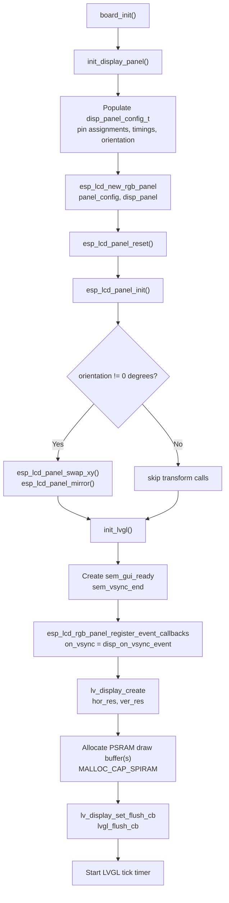
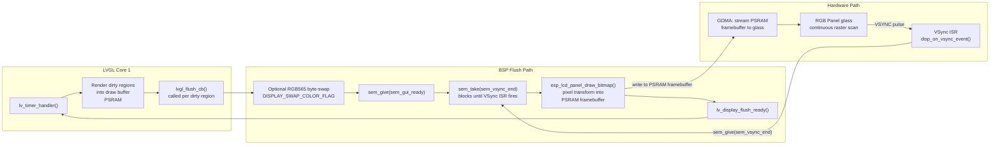
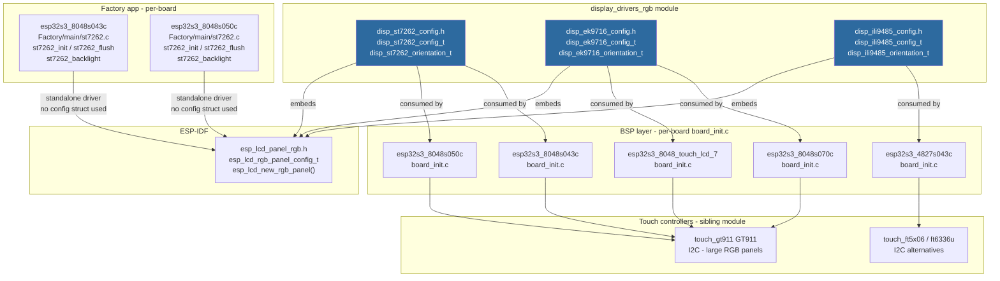

# RGB Parallel Display Drivers — Technical Documentation

> **Module:** `bsp_display_drivers_rgb`
> **Source path:** `hardware/drivers_video_rgb/`
> **Components:** `disp_ek9716_config_t`, `disp_ili9485_config_t`, `disp_st7262_config_t`
> **Purpose:** Configuration layer for the three RGB parallel (DPI) panel controllers supported by the firmware. Each driver exposes a typed configuration struct and an orientation enum that abstract ESP-IDF's raw `esp_lcd_rgb_panel_config_t` + `swap_xy`/`mirror` calls behind a board-facing API.

---

## Table of Contents

1. [Introduction](#introduction)
2. [Architecture Overview](#architecture-overview)
3. [Driver Inventory](#driver-inventory)
4. [Configuration Structures](#configuration-structures)
   - [Common Fields](#common-fields)
   - [disp_st7262_config_t](#disp_st7262_config_t)
   - [disp_ek9716_config_t](#disp_ek9716_config_t)
   - [disp_ili9485_config_t](#disp_ili9485_config_t)
5. [Orientation Enumerations](#orientation-enumerations)
   - [ST7262 and EK9716 (native-portrait)](#st7262-and-ek9716-native-portrait)
   - [ILI9485 (native-landscape — orientation mapping differs)](#ili9485-native-landscape--orientation-mapping-differs)
6. [RGB Parallel vs. SPI/I80 Drivers](#rgb-parallel-vs-spii80-drivers)
7. [Physical vs. Logical Resolution](#physical-vs-logical-resolution)
8. [VSync Synchronisation and the LVGL Flush Path](#vsync-synchronisation-and-the-lvgl-flush-path)
9. [SD Card Shared-Bus Constraint](#sd-card-shared-bus-constraint)
10. [Board Compatibility Matrix](#board-compatibility-matrix)
11. [Integration with the BSP Layer](#integration-with-the-bsp-layer)
12. [Data Flow Diagram](#data-flow-diagram)
13. [Component Interaction Diagram](#component-interaction-diagram)
14. [Key Constraints and Pitfalls](#key-constraints-and-pitfalls)
15. [Related Documentation](#related-documentation)

---

## Introduction

The `display_drivers_rgb` module provides the hardware configuration layer for displays driven over the **RGB parallel (DPI)** interface. Unlike SPI or Intel 8080 (i80) panel controllers — which hold their own on-chip frame-buffer RAM (GRAM) and accept pixel data over a serial or 8/16-bit data bus — RGB parallel panels have **no on-chip frame buffer**. The ESP32-S3's own PSRAM is the framebuffer; a GDMA engine continuously streams it to the glass, synchronized with hardware HSYNC/VSYNC/DE/PCLK signals.

This structural difference makes the RGB driver module significantly simpler at the C-API level (it is *configuration only*, not a panel-command driver), while requiring more careful system integration: PSRAM allocation, VSync semaphore synchronisation inside the BSP, and PCLK frequency budgeting are all critical correctness concerns that do not exist for SPI panels.

The three drivers in this module share an identical struct layout:

```
esp_lcd_rgb_panel_config_t  ←  physical timing/wiring (fixed by glass)
orientation enum             ←  logical orientation for the mounted board
hor_res / ver_res            ←  logical (LVGL-facing) resolution
```

For orientation math, validation status, and the UI-layer implications of these choices, see [display_drivers.md](https://github.com/luc-github/Pibot-cnc-pendant-firmware/blob/main/docs/architecture/display_drivers.md), which is the canonical cross-family reference.

---

## Architecture Overview



---

## Driver Inventory

| Driver | Config header | Orientation enum | Typical board / panel size |
|---|---|---|---|
| **ST7262** | `disp_st7262/disp_st7262_config.h` | `disp_st7262_orientation_t` | esp32s3_8048s043c, esp32s3_8048s050c (800×480) |
| **EK9716** | `disp_ek9716/disp_ek9716_config.h` | `disp_ek9716_orientation_t` | esp32s3_8048s070c, esp32s3_8048_touch_lcd_7 (800×480 / 1024×600) |
| **ILI9485** | `disp_ili9485/disp_ili9485_config.h` | `disp_ili9485_orientation_t` | esp32s3_4827s043c (480×272 native, mounted 90°) |

All three drivers delegate panel initialisation entirely to ESP-IDF's `esp_lcd_rgb_panel` component (`esp_lcd_new_rgb_panel()`). The config struct is the sole output of this module — it feeds the BSP layer's `board_init.c` which calls the ESP-IDF API.

---

## Configuration Structures

### Common Fields

Every RGB config struct contains the same three fields:

| Field | Type | Description |
|---|---|---|
| `panel_config` | `esp_lcd_rgb_panel_config_t` | ESP-IDF RGB panel configuration: PSRAM handle, GDMA settings, PCLK frequency, HSYNC/VSYNC/DE polarity, back/front porch timings, 16 parallel data pin assignments, and **physical** `h_res`/`v_res` (glass pixel count — fixed by wiring, never virtual). |
| `orientation` | `disp_<panel>_orientation_t` | Logical orientation for the mounted board. Maps directly to an `esp_lcd_panel_swap_xy()` + `esp_lcd_panel_mirror()` call sequence at init. |
| `hor_res` | `uint16_t` | **Logical** horizontal resolution in pixels, LVGL-facing. Equals `DISPLAY_WIDTH_PX`. May differ from `panel_config.timings.h_res` when the board is rotated 90°/270°. |
| `ver_res` | `uint16_t` | **Logical** vertical resolution in pixels, LVGL-facing. Equals `DISPLAY_HEIGHT_PX`. May differ from `panel_config.timings.v_res` when the board is rotated 90°/270°. |

> **Important:** `panel_config.timings.h_res` and `v_res` must **always** equal the physical glass pixel matrix size. They are fixed by hardware wiring and cannot be virtualised. The logical `hor_res`/`ver_res` fields carry the board's orientation-corrected shape that LVGL operates on.

---

### disp_st7262_config_t

```c
/* hardware/drivers_video_rgb/disp_st7262/disp_st7262_config.h */

typedef struct {
    esp_lcd_rgb_panel_config_t panel_config; /**< RGB panel bus/timing configuration */
    disp_st7262_orientation_t  orientation;  /**< Panel orientation */
    uint16_t hor_res;                        /**< Horizontal resolution (logical) */
    uint16_t ver_res;                        /**< Vertical resolution (logical) */
} disp_st7262_config_t;
```

The ST7262 is a native-landscape 800×480 RGB controller. Its orientation enum uses a straightforward 0°/90°/180°/270° mapping (see [Orientation Enumerations](#orientation-enumerations) below).

---

### disp_ek9716_config_t

```c
/* hardware/drivers_video_rgb/disp_ek9716/disp_ek9716_config.h */

typedef struct {
    esp_lcd_rgb_panel_config_t panel_config; /**< RGB panel bus/timing configuration */
    disp_ek9716_orientation_t  orientation;  /**< Panel orientation */
    uint16_t hor_res;                        /**< Horizontal resolution (logical) */
    uint16_t ver_res;                        /**< Vertical resolution (logical) */
} disp_ek9716_config_t;
```

The EK9716 is another native-landscape RGB controller. Its orientation enum follows the same 0°/90°/180°/270° mapping as the ST7262.

---

### disp_ili9485_config_t

```c
/* hardware/drivers_video_rgb/disp_ili9485/disp_ili9485_config.h */

typedef struct {
    esp_lcd_rgb_panel_config_t panel_config; /**< RGB panel bus/timing configuration */
    disp_ili9485_orientation_t orientation;  /**< Panel orientation */
    uint16_t hor_res;                        /**< Horizontal resolution (logical) */
    uint16_t ver_res;                        /**< Vertical resolution (logical) */
} disp_ili9485_config_t;
```

The ILI9485 used in this codebase is wired in **RGB565 parallel mode** (not its SPI command-interface mode). Its native glass orientation is **landscape** (480×272), but the reference board (`esp32s3_4827s043c`) mounts it in a 90°-rotated enclosure. Consequently its orientation enum values carry different `swap_xy`/`mirror` semantics than the other two drivers — see the section below.

---

## Orientation Enumerations

### ST7262 and EK9716 (native-portrait)

Both the ST7262 and EK9716 orientation enums follow the same straightforward mapping:

| Enum value | Degree rotation | `swap_xy` | `mirror_x` | `mirror_y` | Determinant |
|---|---|---|---|---|---|
| `PORTRAIT` | 0° | — | — | — | +1 ✅ |
| `LANDSCAPE` | 90° | ✓ | ✓ | — | +1 ✅ |
| `PORTRAIT_INVERTED` | 180° | — | ✓ | ✓ | +1 ✅ |
| `LANDSCAPE_INVERTED` | 270° | ✓ | — | ✓ | +1 ✅ |

> **Note:** The `PORTRAIT` variant maps to 0° with these panels' native glass orientation.

---

### ILI9485 (native-landscape — orientation mapping differs)

The ILI9485's native glass layout is **landscape** (480×272). The `esp32s3_4827s043c` board mounts it 90° rotated inside the pendant enclosure, so its `PORTRAIT` enum value does **not** mean 0° — it means a 90°-rotated presentation. The mapping was corrected in 2026-08 to fix a reflection bug (see [display_drivers.md §Orientation math](https://github.com/luc-github/Pibot-cnc-pendant-firmware/blob/main/docs/architecture/display_drivers.md#orientation-math-why-swap_xy-alone-is-a-reflection-not-a-rotation)):

| Enum value | Logical orientation | `swap_xy` | `mirror_x` | `mirror_y` | Determinant | Comment |
|---|---|---|---|---|---|---|
| `LANDSCAPE` | 0° (native) | — | — | — | +1 ✅ | No transform |
| `LANDSCAPE_INVERTED` | 180° | — | ✓ | ✓ | +1 ✅ | Point reflection |
| `PORTRAIT` | 90° | ✓ | ✓ | — | +1 ✅ | swap + mirror X |
| `PORTRAIT_INVERTED` | 270° | ✓ | — | ✓ | +1 ✅ | swap + mirror Y |

> ⚠️ **Critical rule:** `swap_xy` alone has a transform matrix determinant of −1 (a reflection, not a rotation — text renders mirrored/backwards on hardware). `swap_xy` always requires exactly **one** mirrored axis alongside it to produce a genuine rotation (determinant +1). This was a confirmed hardware bug in an earlier revision. See [display_drivers.md §Orientation math](https://github.com/luc-github/Pibot-cnc-pendant-firmware/blob/main/docs/architecture/display_drivers.md#orientation-math-why-swap_xy-alone-is-a-reflection-not-a-rotation) for the full derivation.

---

## RGB Parallel vs. SPI/I80 Drivers



For the SPI driver details, see [display_drivers_spi.md](display_drivers_spi.md). For the I80 driver details, see [display_drivers_i80.md](display_drivers_i80.md).

| Characteristic | SPI (MADCTL) | RGB Parallel (this module) | I80 Parallel |
|---|---|---|---|
| Frame buffer location | Controller GRAM | ESP32 PSRAM | Controller GRAM |
| Orientation cost | Free (register write) | CPU pixel transform (real cost) | Free (register write) |
| VSync required | No | **Yes** (semaphore pair) | No — `notify_flush_ready` callback |
| Flush callback style | `notify_lvgl_flush_ready()` | VSync semaphore gate | `i80_flush_ready_cb()` |
| PCLK / pixel clock | N/A (SPI clock) | Critical — lower if tearing | N/A (i80 WR strobe) |
| PSRAM required | No | **Yes** (draw buffers) | No |

---

## Physical vs. Logical Resolution

Because RGB parallel panels cannot remap their physical scan resolution, **two separate resolution pairs** exist for any board with a rotated mount:

```
┌──────────────────────────────────────────────────────────┐
│  board_config.h (main firmware)                          │
│                                                          │
│  // Logical (LVGL-facing, portrait terms)                │
│  #define DISPLAY_WIDTH_PX              272               │
│  #define DISPLAY_HEIGHT_PX             480               │
│                                                          │
│  // Physical (glass wiring, feeds panel_config.timings)  │
│  #define DISPLAY_PANEL_PHYSICAL_WIDTH_PX    480          │
│  #define DISPLAY_PANEL_PHYSICAL_HEIGHT_PX   272          │
└──────────────────────────────────────────────────────────┘
```



> **Define both macro pairs for every RGB board**, even if the physical and logical resolutions are identical. This makes rotated-mount boards self-documenting and avoids silent divergence if orientation is later changed.

The Factory app uses the same convention under different macro names:
- `SCREEN_WIDTH` / `SCREEN_HEIGHT` — logical
- `TFT_PANEL_PHYSICAL_WIDTH` / `TFT_PANEL_PHYSICAL_HEIGHT` — physical

---

## VSync Synchronisation and the LVGL Flush Path

RGB parallel panels require explicit VSync synchronisation to prevent screen tearing. Because the GDMA engine streams the framebuffer to the glass continuously, writing pixels at an arbitrary moment will produce partial-frame artifacts. The BSP layer implements a two-semaphore protocol:



**Key points:**
- `sem_gui_ready` and `sem_vsync_end` are binary FreeRTOS semaphores created in `init_lvgl()`.
- The VSync ISR (`disp_on_vsync_event`) is registered via `esp_lcd_rgb_panel_register_event_callbacks()`.
- The flush callback **blocks** on `sem_vsync_end` — it must never be called from an ISR context or from a high-priority task that cannot afford to block.
- LVGL draw buffers are allocated from PSRAM (`MALLOC_CAP_SPIRAM`) because internal SRAM is insufficient for RGB panel buffer sizes.
- Optional `DISPLAY_SWAP_COLOR_FLAG` byte-swaps the pixel buffer **before** the VSync wait — never in-place if the buffer is reused across multiple flush calls (see [Key Constraints](#key-constraints-and-pitfalls)).

---

## SD Card Shared-Bus Constraint

Several RGB boards share GPIO pins between the RGB parallel data bus and the SD card SPI/SDIO bus. The BSP layer on affected boards exposes:

```c
esp_err_t bsp_accessFs(void);   // Pause RGB panel DMA, reconfigure shared pins for SD
esp_err_t bsp_releaseFs(void);  // Restore shared pins to RGB panel, resume DMA
```

These guards appear in `board_init.c` for: `esp32s3_8048s043c`, `esp32s3_8048s050c`, `esp32s3_8048s070c`, and `esp32s3_8048_touch_lcd_7`.



> **Not all RGB boards have this constraint.** `esp32s3_4827s043c` does not expose `bsp_accessFs`/`bsp_releaseFs` because its SD card uses dedicated pins. Check the specific board's `board_init.c` before accessing the filesystem on an RGB board.

See [shared_sd_mechanism_V2.0.md](https://github.com/luc-github/Pibot-cnc-pendant-firmware/blob/main/docs/architecture/shared_sd_mechanism_V2.0.md) for the full SD-sharing protocol.

---

## Board Compatibility Matrix

| Board | Driver config struct | Physical resolution | Logical resolution | Default orientation | `bsp_accessFs`? |
|---|---|---|---|---|---|
| `esp32s3_4827s043c` | `disp_ili9485_config_t` | 480×272 | 272×480 (portrait) | `DISP_ILI9485_ORIENTATION_PORTRAIT_INVERTED` | No |
| `esp32s3_8048s043c` | `disp_st7262_config_t` | 800×480 | 800×480 (landscape) | `DISP_ST7262_ORIENTATION_LANDSCAPE` | **Yes** |
| `esp32s3_8048s050c` | `disp_st7262_config_t` | 800×480 | 800×480 (landscape) | `DISP_ST7262_ORIENTATION_LANDSCAPE` | **Yes** |
| `esp32s3_8048s070c` | `disp_ek9716_config_t` | 800×480 | 800×480 (landscape) | TBD — not yet ported | **Yes** |
| `esp32s3_8048_touch_lcd_7` | `disp_ek9716_config_t` | 1024×600 | 1024×600 (landscape) | TBD — not yet ported | **Yes** |

> **"Not yet ported"** entries: orientation, PCLK frequency, and touch calibration must be hardware-confirmed on each board before marking as complete. Do not assume values transfer from a sibling board — see [display_drivers.md §Common pitfalls](https://github.com/luc-github/Pibot-cnc-pendant-firmware/blob/main/docs/architecture/display_drivers.md#common-pitfalls).

---

## Integration with the BSP Layer

The RGB config structs are consumed exclusively by each board's `board_init.c` inside the BSP component. The typical call chain at boot:



The `orientation` field in the config struct drives the `swap_xy`/`mirror` call sequence — it is the **single authoritative source** for physical display orientation. The `hor_res`/`ver_res` fields are passed directly to `lv_display_create()` as the logical LVGL canvas size.

On boards that link `DEFAULT_ORIENTATION` from CMake (e.g. `esp32s3_4827s043c`), the `orientation` field is derived from the CMake-level `ESP3D_ORIENTATION_*` macro — the physical driver orientation and the UI-layer orientation selection share the same source of truth. See [display_drivers.md §UI-layer orientation](https://github.com/luc-github/Pibot-cnc-pendant-firmware/blob/main/docs/architecture/display_drivers.md#ui-layer-orientation-esp3d_dynamic_rotation_feature--esp3d_default_orientation) for the full unification design.

---

## Data Flow Diagram



---

## Component Interaction Diagram



> **Factory app note:** The Factory app (`boards/*/Factory/main/st7262.c`) implements its own minimal `st7262_init()` / `st7262_flush()` without using the `disp_st7262_config_t` struct. It calls `esp_lcd_new_rgb_panel()` directly with hardcoded config values. The two code paths are **independent** — changes to the BSP driver config struct do not propagate to the Factory app automatically.

---

## Key Constraints and Pitfalls

### PCLK Frequency and `swap_xy` CPU Cost

ESP-IDF's `esp_lcd_rgb_panel` implements `swap_xy` as a per-pixel index computation (`rgb_lcd_rotation_sw.h`) instead of the plain `memcpy` used for unrotated panels. This measurably increases CPU load on every `draw_bitmap()` call.

> **If a rotated RGB board shows screen tearing or drift that a non-rotated board of the same family does not:** reduce `DISPLAY_PCLK_FREQ_HZ` first (e.g. 14 MHz → 8 MHz was needed for `esp32s3_4827s043c`). Do not assume it is the same flash/PSRAM bandwidth issue documented in [esp32_memory_constraints.md](https://github.com/luc-github/Pibot-cnc-pendant-firmware/blob/main/docs/guides/esp32_memory_constraints.md) — they present similarly but have different root causes.

### Touch Calibration Is Independent

Touch controllers (GT911, FT5x06, FT6336U) have their own `swap_xy`/`invert_x`/`invert_y` settings that are physically unrelated to the display driver's orientation. These **must be re-derived from scratch** on real hardware every time the display orientation changes, including between `PORTRAIT` and `PORTRAIT_INVERTED` variants. There is no formula that maps display `swap_xy`/`mirror` bits to touch config bits. See [display_drivers.md §Touch axis tuning](https://github.com/luc-github/Pibot-cnc-pendant-firmware/blob/main/docs/architecture/display_drivers.md#touch-axis-tuning).

### Never Byte-Swap a Reused Buffer In Place

If `DISPLAY_SWAP_COLOR_FLAG` is set, the byte-swap operation must target a **separate scratch buffer**, not the caller's pixel map. The BSP calls `lv_draw_sw_rgb565_swap()` on the `px_map` pointer before the VSync wait; if LVGL reuses the same buffer across multiple `lvgl_flush_cb()` calls (e.g. for multi-row fills), an in-place swap will corrupt every other call. See [display_drivers.md §gfx.c pixel-count convention](https://github.com/luc-github/Pibot-cnc-pendant-firmware/blob/main/docs/architecture/display_drivers.md#gfxcs-pixel-count-convention) for the related `gfx.c` byte-order caveat.

### Orientation Isolation: CMake → Driver → UI Must Stay in Sync

On boards that wire `DEFAULT_ORIENTATION` through CMake (e.g. `esp32s3_4827s043c`), the `orientation` field of the config struct is derived from a CMake macro chain. If the CMake-level value and the hardcoded C value are ever allowed to diverge, the panel will scan in the wrong direction while LVGL renders in the other — a failure mode that compiles silently. Always drive orientation from a single CMake source of truth. See [display_drivers.md §UI-layer orientation](https://github.com/luc-github/Pibot-cnc-pendant-firmware/blob/main/docs/architecture/display_drivers.md#ui-layer-orientation-esp3d_dynamic_rotation_feature--esp3d_default_orientation).

### Physical Resolution in `panel_config.timings` Must Match the Glass

`panel_config.timings.h_res` and `v_res` are not software-configurable window sizes — they are the hardware pixel matrix counts of the physical glass. Setting them to the *logical* (rotated) resolution will produce incorrect GDMA timing and a corrupted image. For a 90°-rotated mount, `timings.h_res` = physical width (columns), `timings.v_res` = physical height (rows) — these are swapped relative to the logical `hor_res`/`ver_res`.

### PSRAM Allocation Can Fail Under Fragmentation

Draw buffers for RGB panels are large (an 800×480 RGB565 buffer is ~768 KB). These must be allocated from PSRAM (`MALLOC_CAP_SPIRAM`). The allocation is performed in `init_lvgl()` with a logged failure path — always check the log and the largest free PSRAM block before concluding that "there is enough memory." See [esp32_memory_constraints.md](https://github.com/luc-github/Pibot-cnc-pendant-firmware/blob/main/docs/guides/esp32_memory_constraints.md).

---

## Related Documentation

| Document | Relevance |
|---|---|
| [display_drivers.md](https://github.com/luc-github/Pibot-cnc-pendant-firmware/blob/main/docs/architecture/display_drivers.md) | **Primary cross-family reference:** SPI vs RGB vs I80 comparison, orientation math (determinant proof), physical vs logical resolution, PCLK cost, touch tuning, `gfx.c` pixel-count convention, UI-layer orientation (`ESP3D_DYNAMIC_ROTATION_FEATURE`), board reference table |
| [display_drivers_spi.md](display_drivers_spi.md) | SPI panel driver details (ILI9341, ST7796) — MADCTL, GRAM, zero-cost orientation |
| [display_drivers_i80.md](display_drivers_i80.md) | Intel 8080 parallel driver details (RM68120, ST7796-i80) — `notify_flush_ready`, `i80_flush_ready_cb` |
| [shared_sd_mechanism_V2.0.md](https://github.com/luc-github/Pibot-cnc-pendant-firmware/blob/main/docs/architecture/shared_sd_mechanism_V2.0.md) | SD card shared-bus protocol for RGB boards with pin-muxed SD (`bsp_accessFs`/`bsp_releaseFs`) |
| [screens_architecture.md](https://github.com/luc-github/Pibot-cnc-pendant-firmware/blob/main/docs/architecture/screens_architecture.md) | LVGL screen system that consumes the display initialised by this module |
| [esp32_memory_constraints.md](https://github.com/luc-github/Pibot-cnc-pendant-firmware/blob/main/docs/guides/esp32_memory_constraints.md) | PSRAM fragmentation, heap constraints, draw-buffer allocation strategy |
| [board_build_guidelines.md](https://github.com/luc-github/Pibot-cnc-pendant-firmware/blob/main/docs/guides/board_build_guidelines.md) | How to port a new board, including RGB panel orientation bring-up checklist |
