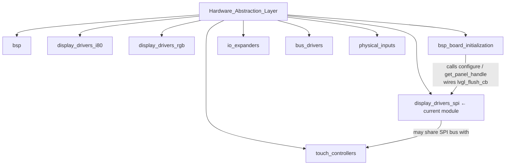
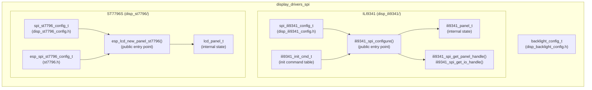
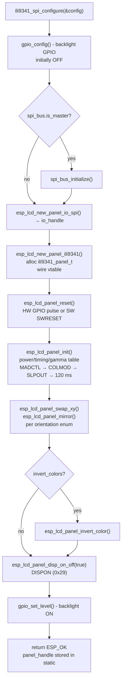
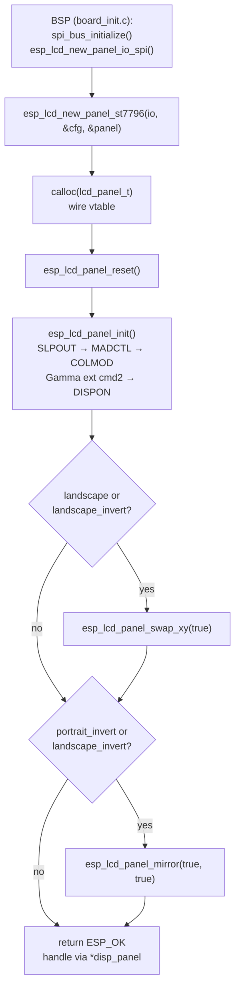
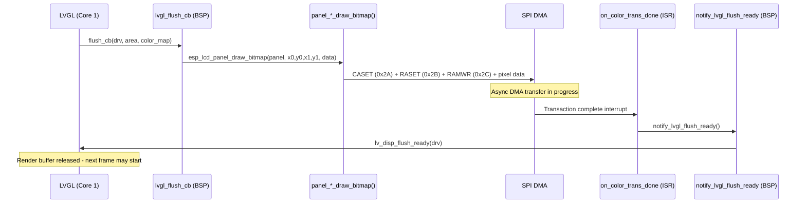

# Display Drivers — SPI (`display_drivers_spi`)

## Introduction

The `display_drivers_spi` module is the SPI panel-controller driver layer of the Hardware Abstraction Layer (HAL). It provides two custom ESP-IDF-compatible LCD panel drivers — one for the **ILI9341** and one for the **ST7796S** controller — along with a shared backlight configuration type. Both drivers implement the standard `esp_lcd_panel_t` virtual-function interface, allowing all higher-level code (BSP, LVGL) to drive either display controller through the same uniform API.

**What this module is responsible for:**

- Allocating, initializing, and owning the `esp_lcd_panel_t` handle for each supported SPI controller
- Managing the SPI bus and DMA pipeline for pixel transfer
- Implementing MADCTL-based orientation (0°/90°/180°/270°) at zero per-frame CPU cost
- Providing the `on_color_trans_done` ISR callback hook that releases LVGL's render buffer after a DMA transfer completes
- Exposing a `backlight_config_t` type for GPIO or PWM-based backlight control

**What this module is not responsible for:**

- RGB parallel panel drivers → see [`bsp_display_drivers_rgb.md`](bsp_display_drivers_rgb.md)
- Intel 8080 (i80) parallel panel drivers → see [`bsp_display_drivers_i80.md`](bsp_display_drivers_i80.md)
- Touch controller configuration → see [`bsp_touch_controllers.md`](bsp_touch_controllers.md)
- Per-board pin assignments and LVGL flush-callback wiring → see [`bsp_board_initialization.md`](bsp_board_initialization.md)
- Orientation math, SPI vs. RGB panel family comparison, `gfx.c` pixel-count convention → see [`display_drivers.md`](https://github.com/luc-github/Pibot-cnc-pendant-firmware/blob/main/docs/architecture/display_drivers.md)

---

## Module Position in the HAL



---

## File Map

```
hardware/common/drivers/
├── disp_ili9341/
│   ├── disp_ili9341_config.h    spi_ili9341_config_t, spi_ili9341_orientation_t
│   └── disp_ili9341_spi.c       ILI9341 panel driver + ili9341_spi_configure() entry point
├── disp_st7796/
│   ├── disp_st7796_config.h     spi_st7796_config_t, spi_st7796_orientation_t (modern API)
│   ├── st7796.h                 esp_spi_st7796_config_t, esp_spi_bus_st7796_config_t
│   └── st7796.c                 ST7796S panel driver + esp_lcd_new_panel_st7796()
└── disp_backlight/
    └── disp_backlight_config.h  backlight_config_t (GPIO or LEDC PWM)
```

---

## Component Architecture



Both `ili9341_panel_t` and `lcd_panel_t` (the ST7796 internal struct) are private heap allocations that extend `esp_lcd_panel_t` as their first member, making them safe to cast via `__containerof`. All panel operations are dispatched through the `esp_lcd_panel_t` vtable and never called directly.

---

## Supported Controllers and Board Mapping

| Controller | Typical resolution | Boards |
|---|---|---|
| **ILI9341** | 240 × 320 | `pibot_pendant_v1_0`, `esp32_2432s028r` |
| **ST7796S** | 320 × 480 | `esp32_3248s035c`, `esp32_3248s035r`, `esp32s3_bzm_tft35_gt911` |

Key board notes:

- **`pibot_pendant_v1_0`** — The primary pendant target. ILI9341 in portrait orientation. Also has a standalone ILI9341 driver in `boards/pibot_pendant_v1_0/Factory/main/ili9341.c` for the factory app (independent of this module).
- **`esp32_2432s028r`** — ILI9341 shares the SPI bus with the XPT2046 touch controller (`spi_bus.is_master = false`).
- **`esp32_3248s035r` / `esp32_3248s035c`** — ST7796S with a MADCTL quirk (`0x88`) that bypasses the orientation enum. Documented in [`display_drivers.md`](https://github.com/luc-github/Pibot-cnc-pendant-firmware/blob/main/docs/architecture/display_drivers.md).
- **`esp32s3_bzm_tft35_gt911`** — ST7796S with GT911 touch (I²C); orientation not yet hardware-verified.

---

## Initialization Flow

### ILI9341 — Single-call configure pattern

`ili9341_spi_configure()` owns the full lifecycle: SPI bus, panel IO, panel create, reset, init, orientation, and backlight.



After this call the BSP retrieves the panel handle with `ili9341_spi_get_panel_handle()` and passes it to `init_lvgl()`.

### ST7796S — Caller-managed bus + factory create pattern

The BSP must initialize the SPI bus and create the panel IO handle before calling `esp_lcd_new_panel_st7796()`, which then performs reset, init, and orientation atomically.



---

## MADCTL Orientation Reference

Both drivers use the MADCTL register (0x36) to set orientation via three bits:

| Bit | Mask | Meaning |
|---|---|---|
| MV | `LCD_CMD_MV_BIT` | Swap row/column (axis transpose) |
| MX | `LCD_CMD_MX_BIT` | Mirror X (column address direction) |
| MY | `LCD_CMD_MY_BIT` | Mirror Y (row address direction) |

**ILI9341 orientation table** (applied by `ili9341_spi_configure()`):

| Enum | swap_xy | mirror_x | mirror_y |
|---|---|---|---|
| `PORTRAIT` | ✗ | ✓ | ✗ |
| `LANDSCAPE` | ✓ | ✓ | ✓ |
| `PORTRAIT_INVERTED` | ✗ | ✗ | ✓ |
| `LANDSCAPE_INVERTED` | ✓ | ✗ | ✗ |

**ST7796 orientation table** (applied inside `esp_lcd_new_panel_st7796()`):

| Enum | swap_xy | mirror (X, Y) |
|---|---|---|
| `portrait` | ✗ | (✗, ✗) |
| `landscape` | ✓ | (✗, ✗) |
| `portrait_invert` | ✗ | (✓, ✓) |
| `landscape_invert` | ✓ | (✓, ✓) |

> ⚠️ `swap_xy` without any mirror is a **reflection**, not a rotation — the `landscape` ST7796 case may require a board-specific MADCTL override. See [`display_drivers.md § Orientation math`](https://github.com/luc-github/Pibot-cnc-pendant-firmware/blob/main/docs/architecture/display_drivers.md#orientation-math-why-swap_xy-alone-is-a-reflection-not-a-rotation) for the proof and per-board workaround values.

---

## LVGL Flush Pipeline

SPI panel controllers hold their own GRAM, so the MCU only needs to push changed pixel rectangles via DMA. The panel then autonomously scan-outs its GRAM to the glass, independent of SPI activity.



**Flush signaling models across SPI boards:**

| Model | Boards | Mechanism |
|---|---|---|
| **Async (preferred)** | All SPI boards in this repo | `on_color_trans_done` callback in panel IO config → `notify_lvgl_flush_ready()` → `lv_disp_flush_ready()` |
| **Synchronous** | Legacy / simple boards | `lv_disp_flush_ready()` called directly at end of `lvgl_flush_cb()`, blocking until SPI transfer completes |

> The async model lets LVGL prepare the next render buffer while DMA drains the current one — critical for maintaining smooth 30+ FPS on a constrained SPI clock.

**⚠️ LVGL thread constraint:** `lv_disp_flush_ready()` must only be called from the LVGL task (Core 1) or via an ISR-safe wrapper. Never call it directly from a SPI ISR without the `notify_lvgl_flush_ready()` indirection.

---

## Backlight Configuration

`backlight_config_t` (from `disp_backlight_config.h`) is the shared type for backlight control used across all SPI boards. It supports both simple GPIO and PWM dimming via LEDC.

| Field | `pwm_control = false` | `pwm_control = true` |
|---|---|---|
| `gpio_num` | ✓ used | ✓ used |
| `output_invert` | ✓ used | ✓ used |
| `timer_idx`, `channel_idx` | ignored | ✓ used |
| `duty`, `freq_hz`, `resolution_bits` | ignored | ✓ used |

The ILI9341 driver manages its own backlight inline (simple `gpio_set_level()`) using the `backlight` sub-struct of `spi_ili9341_config_t`. `backlight_config_t` is available for BSPs that manage backlight independently of the panel driver.

---

## Panel Operation Summary

Both drivers implement the identical `esp_lcd_panel_t` vtable:

| Operation | ILI9341 function | ST7796 function | SPI command(s) |
|---|---|---|---|
| Delete | `panel_ili9341_del` | `lcd_panel_del` | — (free only) |
| Reset | `panel_ili9341_reset` | `lcd_panel_reset` | `0x01` (SW) |
| Init | `panel_ili9341_init` | `lcd_panel_init` | `0x11`,`0x36`,`0x3A`,`0xE0`,`0xE1`,`0x29` |
| Draw bitmap | `panel_ili9341_draw_bitmap` | `lcd_panel_draw_bitmap` | `0x2A`, `0x2B`, `0x2C` |
| Mirror | `panel_ili9341_mirror` | `lcd_panel_mirror` | `0x36` |
| Swap XY | `panel_ili9341_swap_xy` | `lcd_panel_swap_xy` | `0x36` |
| Invert color | `panel_ili9341_invert_color` | `lcd_panel_invert_color` | `0x20`/`0x21` |
| Set gap | `panel_ili9341_set_gap` | `lcd_panel_set_gap` | — (stored, used in draw) |
| Display on/off | `panel_ili9341_disp_on_off` | `lcd_panel_disp_on_off` | `0x28`/`0x29` |

---

## Detailed Component Reference

For per-function documentation, configuration field descriptions, init command table breakdown, and public API signatures, see:

➡ **[`bsp_display_drivers_spi.md`](bsp_display_drivers_spi.md)** — full component reference for all three drivers in this module

---

## Related Documentation

| Document | Content |
|---|---|
| [`display_drivers.md`](https://github.com/luc-github/Pibot-cnc-pendant-firmware/blob/main/docs/architecture/display_drivers.md) | SPI vs. RGB panel family comparison; orientation/rotation math; PCLK cost of `swap_xy`; `gfx.c` pixel-count convention; `ESP3D_DYNAMIC_ROTATION_FEATURE`; full board reference table |
| [`bsp_display_drivers_spi.md`](bsp_display_drivers_spi.md) | Per-driver component reference: config structs, panel structs, operation tables, init flow diagrams, public API |
| [`bsp_display_drivers_i80.md`](bsp_display_drivers_i80.md) | I80 parallel bus drivers (RM68120, ST7796 i80) |
| [`bsp_display_drivers_rgb.md`](bsp_display_drivers_rgb.md) | RGB parallel drivers (EK9716, ILI9485, ST7262) |
| [`bsp_board_initialization.md`](bsp_board_initialization.md) | Per-board `board_init.c` — calls these drivers and wires `lvgl_flush_cb` |
| [`bsp_board_initialization_display.md`](bsp_board_initialization_display.md) | Display-specific BSP init: flush callbacks, vsync events, flush-ready signaling |
| [`bsp_touch_controllers.md`](bsp_touch_controllers.md) | Touch controllers — orientation must be calibrated independently from display |
| [`guides/board_build_guidelines.md`](https://github.com/luc-github/Pibot-cnc-pendant-firmware/blob/main/docs/guides/board_build_guidelines.md) | Porting steps for new SPI boards |
