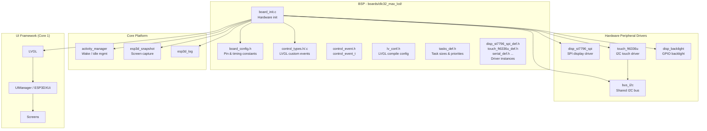
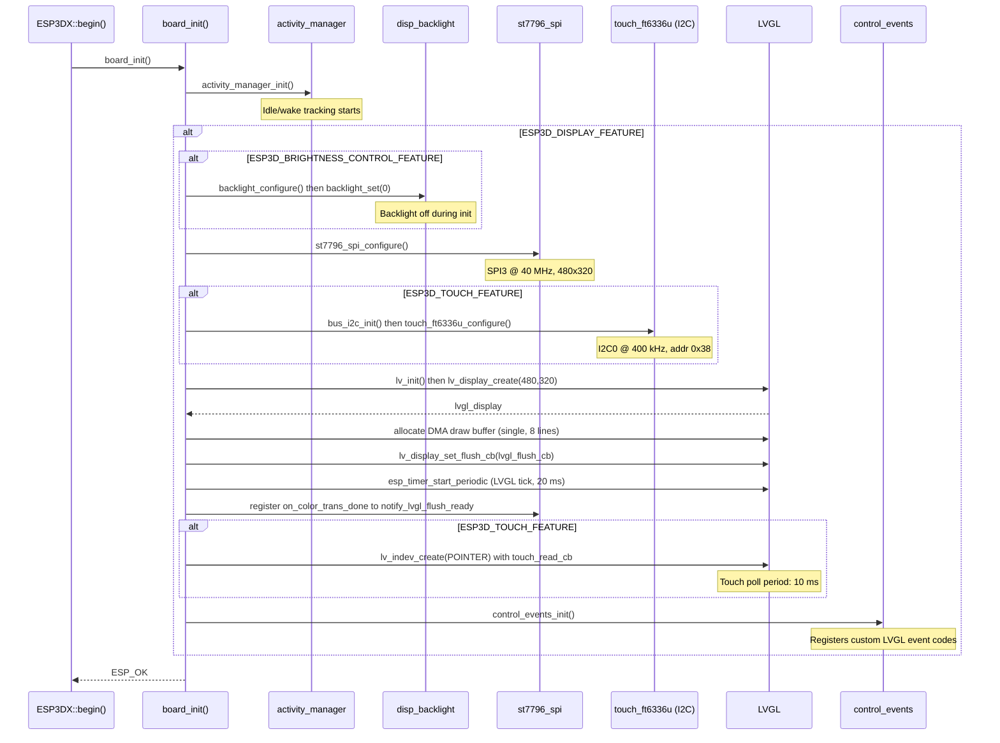
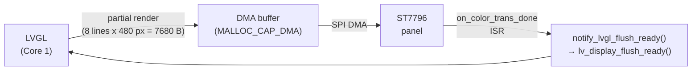
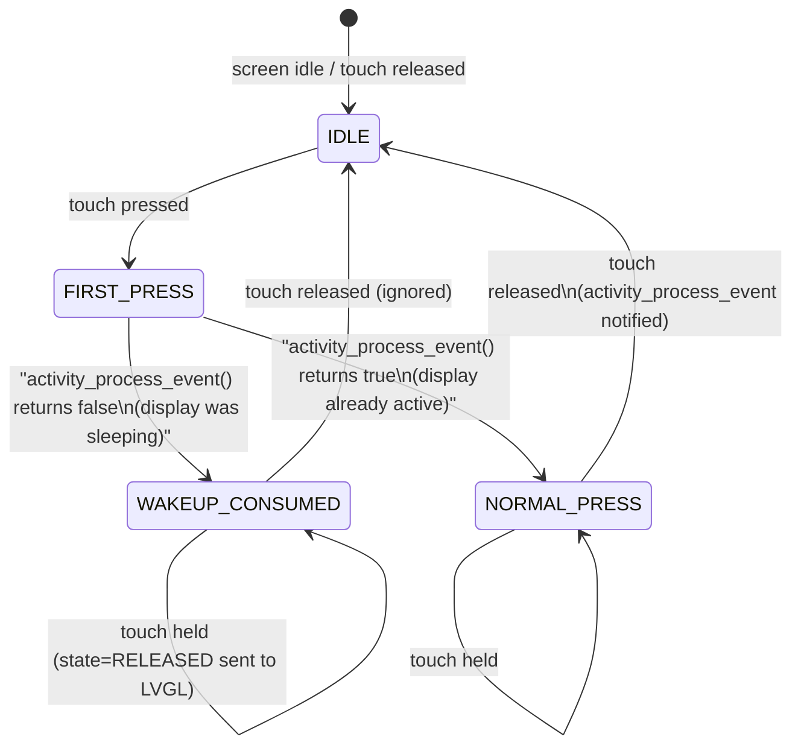
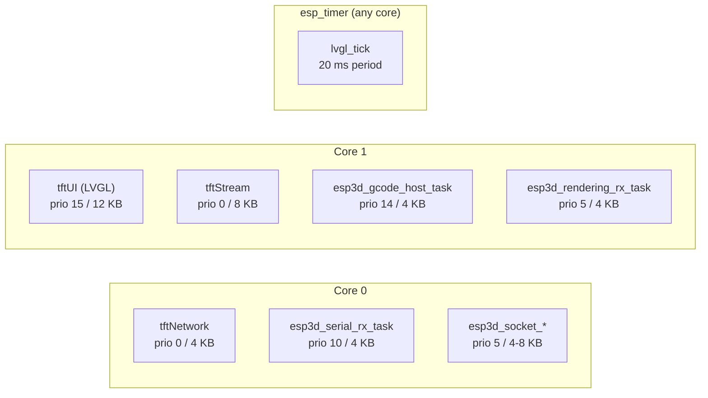
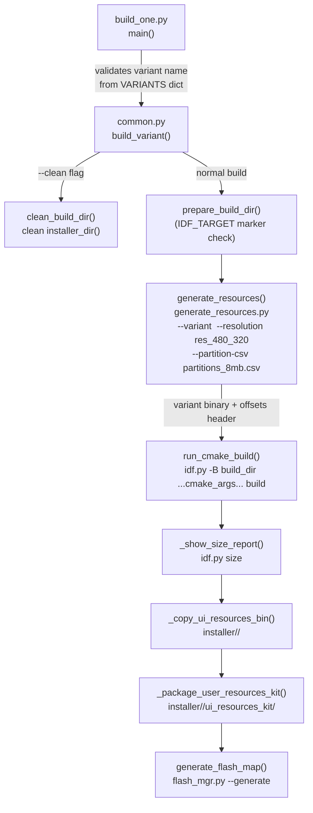
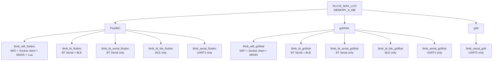

# DLC32 MAX LCD — Board Support Package

The **DLC32 MAX LCD** BSP targets a compact ESP32-based CNC pendant that pairs an 8 MB ESP32-WROOM-32U-N8 with a 3.5″ 480 × 320 capacitive-touch SPI display (ST7796 controller). It is a display-and-touch-only board: there is no SD card, no rotary encoder, no potentiometer, and no buzzer enabled by default. All user input is touch-screen-driven.

The BSP lives under `boards/dlc32_max_lcd/` and is one sibling in the family of boards documented alongside the [pibot\_pendant\_v1\_0 BSP](pibot_pendant_v1_0.md) and the [esp32s3 display boards](esp32s3_8048s043c.md). It integrates with the shared [Hardware Peripheral Drivers](Hardware_Peripheral_Drivers.md), the [Core Platform](Core_Platform_and_Infrastructure.md), and the [UI Framework](UI_Framework_and_Screens.md).

---

## Table of Contents

1. [Architecture Overview](#1-architecture-overview)
2. [Hardware Specification](#2-hardware-specification)
3. [BSP Component Structure](#3-bsp-component-structure)
4. [Board Initialization Sequence](#4-board-initialization-sequence)
5. [Display Subsystem](#5-display-subsystem)
6. [Touch Subsystem](#6-touch-subsystem)
7. [Control Events](#7-control-events)
8. [FreeRTOS Task Layout](#8-freertos-task-layout)
9. [Flash Partition Layout](#9-flash-partition-layout)
10. [Build System](#10-build-system)
11. [Firmware Variants](#11-firmware-variants)
12. [sdkconfig Variants](#12-sdkconfig-variants)
13. [Key Differences from Other Boards](#13-key-differences-from-other-boards)

---

## 1. Architecture Overview



The BSP is the only layer that is board-specific. Everything above it (UIManager, screens, GCode host, communication transports) is shared across all boards. `board_init()` is the single entry point called by `ESP3DX::begin()` before the UI task starts.

---

## 2. Hardware Specification

| Component | Detail |
|---|---|
| **SoC** | ESP32-WROOM-32U-N8 (Xtensa LX6 dual-core, 240 MHz) |
| **Flash** | 8 MB (no PSRAM) |
| **Display** | 3.5″ 480 × 320 SPI TFT — ST7796 (or compatible ILI9488) |
| **Touch** | FT6336U capacitive controller, I2C |
| **Backlight** | GPIO-controlled, active-low (inverted) |
| **CNC serial** | UART2 (hardware) |
| **Physical inputs** | 1 physical button (GPIO 35); 3 virtual buttons via touch UI |
| **SD card** | None (disabled in board config) |
| **Buzzer** | GPIO 22 footprint — disabled by default |
| **Encoder** | Not fitted |
| **Potentiometer** | Not fitted |

### GPIO Pinout

| Function | GPIO | Notes |
|---|---|---|
| LCD MOSI (SDA) | 23 | SPI3_HOST |
| LCD MISO (SDO) | 19 | SPI3_HOST |
| LCD SCLK | 18 | SPI3_HOST |
| LCD CS | 25 | |
| LCD DC/RS | 33 | |
| LCD RST | 27 | |
| Backlight | 5 | Active-low (inverted) |
| Touch SDA | 0 | I2C0 |
| Touch SCL | 4 | I2C0 |
| Touch INT | 21 | |
| Touch RST | 14 | |
| UART2 RX | 16 | CNC serial in |
| UART2 TX | 17 | CNC serial out |
| Physical button | 35 | Input only, no pull-up |
| Buzzer | 22 | GPIO placeholder, not enabled |

---

## 3. BSP Component Structure

```
boards/dlc32_max_lcd/
├── board_config.cmake          # CMake board selection & capabilities
├── partitions_8mb.csv          # Custom partition table (dual OTA, no factory)
├── flash_params.json           # Flash parameters for esptool
├── README.md                   # Quick-start reference
├── sdkconfig.8mb.wifi          # SDK defaults — WiFi transport
├── sdkconfig.8mb.bt            # SDK defaults — BT Serial + BLE
├── sdkconfig.8mb.bt_serial     # SDK defaults — BT Serial only
├── sdkconfig.8mb.bt_ble        # SDK defaults — BLE only
├── sdkconfig.8mb.serial        # SDK defaults — Serial only
├── build_scripts/
│   ├── build_one.py            # Build a single named variant
│   ├── common.py               # Build helpers (build_variant, check_variant, ...)
│   └── variants.py             # All 11 variant definitions (VARIANTS dict)
└── components/
    └── bsp/
        ├── board_config.h          # All pin/timing constants
        ├── board_init.h/.c         # board_init() and LVGL callbacks
        ├── control_event.h         # control_event_t struct
        ├── control_types.h/.c      # control_family_t + custom LVGL events
        ├── tasks_def.h             # FreeRTOS task sizes and priorities
        ├── lv_conf.h               # Board-level LVGL configuration
        ├── disp_st7796_spi_def.h   # ST7796 driver instance config
        ├── disp_backlight_def.h    # Backlight config instance
        ├── touch_ft6336u_def.h     # FT6336U driver instance config
        ├── serial_def.h            # UART2 config instance
        ├── bt_serial_def.h         # BT Serial config instance
        └── bt_ble_def.h            # BLE config instance
```

The `*_def.h` files hold `const` driver configuration structs instantiated directly from the constants in `board_config.h`. This pattern avoids dynamic configuration and keeps all hardware constants in one place.

---

## 4. Board Initialization Sequence

`board_init()` runs once on Core 0 before the LVGL task is created. It initialises hardware in strict dependency order.



### Failure Behaviour

Each step returns `ESP_OK` or logs an error and returns immediately. If any step fails the application will not reach the UI task; the failure is visible in the serial log before the display is active.

---

## 5. Display Subsystem

### Driver Configuration

| Parameter | Value |
|---|---|
| Controller | ST7796 (SPI mode) |
| SPI host | SPI3_HOST |
| Clock speed | 40 MHz |
| Resolution | 480 × 320 px |
| Colour depth | 16-bit RGB565 |
| Byte swap | Enabled (`DISPLAY_SWAP_COLOR_FLAG = 1`) |
| Orientation | Landscape (`DISPLAY_ORIENTATION = 1`) |
| Colour inversion | Off |
| Backlight control | GPIO 5, active-low |

### LVGL Buffer Strategy



The board uses a **single** partial-render buffer (8 scan lines, 7 680 bytes). Double buffering is explicitly disabled (`DISPLAY_USE_DOUBLE_BUFFER_FLAG = 0`) to conserve heap on the no-PSRAM ESP32. The `notify_lvgl_flush_ready` callback fires from the SPI DMA completion ISR and releases LVGL to start the next render cycle.

### Snapshot Integration

When `ESP3D_SNAPSHOT_FEATURE` is enabled, `lvgl_flush_cb` intercepts each DMA transfer and streams the raw pixel data to a file before forwarding it to the panel, enabling full-screen captures without a separate frame buffer.

---

## 6. Touch Subsystem

### Driver Configuration

| Parameter | Value |
|---|---|
| Controller | FT6336U |
| Interface | I2C0 |
| I2C address | `0x38` |
| I2C speed | 400 kHz |
| SDA / SCL | GPIO 0 / GPIO 4 |
| INT | GPIO 21 |
| RST | GPIO 14 |
| Swap XY | No |
| Mirror X/Y | No |
| Poll period | 10 ms |

### Wake-Up Touch Consumption

The `touch_read_cb` implements a **touch-consumed-for-wakeup** pattern to prevent the first press after screen inactivity from accidentally triggering a UI action:



`activity_process_event()` is called by the [Activity Manager](Core_Platform_and_Infrastructure.md) component, which drives the screen-timeout and dim/wake lifecycle.

---

## 7. Control Events

### `control_event_t`

All hardware input events on this board flow through a unified struct:

```c
typedef struct {
    lv_indev_t      *indev;          // LVGL input device handle
    uint32_t         btn_id;         // Button / control index
    lv_indev_type_t  type;           // LV_INDEV_TYPE_POINTER, etc.
    control_family_t family_id;      // CONTROL_FAMILY_BUTTONS / TOUCH / ...
    int32_t          steps;          // Encoder steps (unused on this board)
    uint32_t         press_duration; // Press duration in milliseconds
} control_event_t;
```

### `control_family_t` Enum

| Value | Meaning | Used on this board |
|---|---|---|
| `CONTROL_FAMILY_BUTTONS` | Physical buttons | ✓ (GPIO 35 + 2 virtual) |
| `CONTROL_FAMILY_SWITCH` | 4-position switch | ✗ |
| `CONTROL_FAMILY_TOUCH` | Touchscreen | ✓ (primary input) |
| `CONTROL_FAMILY_ENCODER` | Rotary encoder | ✗ |
| `CONTROL_FAMILY_POTENTIOMETER` | Analog potentiometer | ✗ |

### Custom LVGL Events

`control_events_init()` registers three custom event codes after `lv_init()`:

| Event code | Trigger |
|---|---|
| `LV_EVENT_SWITCH_PRESSED` | Positional switch pressed (not fitted) |
| `LV_EVENT_SWITCH_RELEASED` | Positional switch released (not fitted) |
| `LV_EVENT_POTENTIOMETER_CHANGED` | Analog value changed (not fitted) |

These slots are declared for BSP interface compatibility. They fire no hardware events on this board but are required so shared UI code compiles without `#ifdef` guards. See [Input System Architecture](https://github.com/luc-github/Pibot-cnc-pendant-firmware/blob/main/docs/architecture/Input_system.md) for how screens consume control events.

---

## 8. FreeRTOS Task Layout



| Task | Core | Priority | Stack |
|---|---|---|---|
| Network (`tftNetwork`) | 0 | 0 | 4 096 B |
| Serial RX | 0 | 10 | 4 096 B |
| Socket client RX | 0 | 5 | 8 192 B |
| Socket server RX | 0 | 5 | 4 096 B |
| LVGL UI (`tftUI`) | 1 | 15 | 12 288 B |
| GCode host | 1 | 14 | 4 096 B |
| Rendering RX | 1 | 5 | 4 096 B |
| Stream (`tftStream`) | 1 | 0 | 8 192 B |

> **Important:** LVGL runs exclusively on Core 1 at the highest priority. All `lv_obj_*` calls must originate from the UI task (or under `lvgl_api_lock`). See the [Screens Architecture](https://github.com/luc-github/Pibot-cnc-pendant-firmware/blob/main/docs/architecture/screens_architecture.md) documentation for safe patterns.

No PSRAM is fitted; `STREAM_CHUNK_SIZE` falls to 1 024 B (the `< 2 MB` branch in `tasks_def.h`).

---

## 9. Flash Partition Layout

The partition table is custom, with the table itself relocated to `0xC000` (from the standard `0x8000`) to accommodate a larger bootloader area (~44 KB vs. 32 KB standard).

```
Address    Name          Type   SubType   Size        Notes
─────────────────────────────────────────────────────────────
0x01000    [bootloader]  —      —         ~44 KB      Standard ESP32 bootloader
0x0C000    [pt table]   —      —         —           Partition table (custom offset)
0x0D000    nvs           data   nvs       12 KB       NVS key-value store
0x10000    otadata       data   ota        8 KB       OTA selection metadata
0x20000    app0          app    ota_0      3.1 MB     Active firmware slot
0x340000   app1          app    ota_1      3.1 MB     OTA update slot
0x660000   ui_resources  data   0x42       212 KB     LVGL icon/font/theme assets
0x695000   flashfs       data   spiffs     1.42 MB    LittleFS user filesystem
```

> **No factory partition** — there is no SD card and therefore no recovery mechanism for a bricked firmware. Dual OTA (`app0` / `app1`) is the only recovery path. Flash the initial firmware with the full esptool command; subsequent updates go through the OTA mechanism.

The `ui_resources` partition is managed by the [UI Resources build pipeline](https://github.com/luc-github/Pibot-cnc-pendant-firmware/blob/main/docs/ui_resources/development.md). The `flashfs` partition stores user configuration, macros, and language packs.

---

## 10. Build System



### Key `common.py` Functions

| Function | Purpose |
|---|---|
| `build_variant(config)` | Full build pipeline: clean → resources → cmake → size report → installer copy |
| `check_variant(config)` | CMake `reconfigure` only — validates flags without compiling |
| `generate_resources(cmake_args, build_dir)` | Derives `--variant` string from cmake flags and calls `generate_resources.py` |
| `resource_variant_string(cmake_args)` | Maps cmake flags → `{mem}mb_{transport}_{fw}` string (e.g. `8mb_wifi_fluidnc`) |
| `build_config_name(cmake_args)` | Derives human-readable config name for the installer directory |
| `prepare_build_dir(build_dir)` | Writes `.idf_target` marker; clears build dir if target changed |
| `installer_dir_for(config)` | Returns `installer/<config_name>/` path when `cwd == REPO_ROOT` |

### Invocation

```bash
# From the board build-scripts directory:
cd boards/dlc32_max_lcd/build_scripts

# Build a single variant
python build_one.py 8mb_wifi_fluidnc

# Build and clean first
python build_one.py 8mb_bt_grblhal --clean

# Validate cmake flags only (no compile)
python build_one.py 8mb_serial_grbl --check

# List available variants (no args)
python build_one.py
```

For building all variants at once, use the repo-level `tools/build_scripts/build_mgr.py` which iterates over boards and calls `build_one.py` per variant.

---

## 11. Firmware Variants

All variants require `MEMORY_8_MB=ON`. The board enforces this in `board_config.cmake` — any other memory setting is a `FATAL_ERROR`.

WiFi and Bluetooth are mutually exclusive (no PSRAM; both stacks cannot coexist). The `cmake/sanity_check.cmake` enforces this at configure time.



### Variant Feature Matrix

| Variant | FW | Radio | UART2 | Socket client | MDNS | Lua |
|---|---|---|---|---|---|---|
| `8mb_wifi_fluidnc` | FluidNC | WiFi | ✓ | ✓ | ✓ | ✓ |
| `8mb_bt_fluidnc` | FluidNC | BT+BLE | ✓ | ✗ | ✗ | ✗ |
| `8mb_bt_serial_fluidnc` | FluidNC | BT SPP | ✓ | ✗ | ✗ | ✗ |
| `8mb_bt_ble_fluidnc` | FluidNC | BLE | ✓ | ✗ | ✗ | ✗ |
| `8mb_serial_fluidnc` | FluidNC | None | ✓ | ✗ | ✗ | ✗ |
| `8mb_wifi_grblhal` | grblHAL | WiFi | ✓ | ✓ | ✓ | ✗ |
| `8mb_bt_grblhal` | grblHAL | BT+BLE | ✓ | ✗ | ✗ | ✗ |
| `8mb_bt_serial_grblhal` | grblHAL | BT SPP | ✓ | ✗ | ✗ | ✗ |
| `8mb_bt_ble_grblhal` | grblHAL | BLE | ✓ | ✗ | ✗ | ✗ |
| `8mb_serial_grblhal` | grblHAL | None | ✓ | ✗ | ✗ | ✗ |
| `8mb_serial_grbl` | grbl | None | ✓ | ✗ | ✗ | ✗ |

> **No factory variants.** `FACTORY_VARIANTS = {}` in `variants.py`. The board has no SD card, so factory-app recovery is not implemented.

---

## 12. sdkconfig Variants

Five sdkconfig defaults files cover the five radio combinations. The build system selects the appropriate one in `board_config.cmake` based on the active `BT_SERVICE` / `WIFI_SERVICE` flags. The file is applied only on the **first** configure (when no `sdkconfig` file exists in the build directory); subsequent configures preserve any `menuconfig` changes.

| File | Applied when |
|---|---|
| `sdkconfig.8mb.wifi` | `WIFI_SERVICE=ON` |
| `sdkconfig.8mb.bt` | `BT_SERVICE=ON` with both `BT_SERIAL_SERVICE` and `BT_BLE_SERVICE` ON |
| `sdkconfig.8mb.bt_serial` | `BT_SERVICE=ON`, `BT_SERIAL_SERVICE=ON`, `BT_BLE_SERVICE=OFF` |
| `sdkconfig.8mb.bt_ble` | `BT_SERVICE=ON`, `BT_BLE_SERVICE=ON`, `BT_SERIAL_SERVICE=OFF` |
| `sdkconfig.8mb.serial` | Neither WiFi nor BT active |

All sdkconfigs share these key settings:

| Setting | Value |
|---|---|
| `IDF_TARGET` | `esp32` |
| `CONFIG_ESPTOOLPY_FLASHSIZE` | `8MB` |
| `CONFIG_ESPTOOLPY_FLASHFREQ` | `80m` |
| `CONFIG_ESPTOOLPY_FLASHMODE` | `dio` |
| `CONFIG_PARTITION_TABLE_CUSTOM_FILENAME` | `boards/dlc32_max_lcd/partitions_8mb.csv` |
| `CONFIG_PARTITION_TABLE_OFFSET` | `0xC000` |
| `CONFIG_COMPILER_OPTIMIZATION_SIZE` | `y` |

---

## 13. Key Differences from Other Boards

| Feature | DLC32 MAX LCD | PiBot Pendant v1.0 | ESP32-3248S035C |
|---|---|---|---|
| SoC | ESP32 (Xtensa) | ESP32-S3 | ESP32 |
| Flash | 8 MB (no PSRAM) | 16 MB + 8 MB PSRAM | 4 MB |
| Display | 480×320 SPI ST7796 | 320×240 SPI ILI9341 | 480×320 SPI ST7796 |
| Touch | FT6336U (capacitive) | XPT2046 (resistive) | GT911 (capacitive) |
| Physical buttons | 1 | 3 | 3 |
| Encoder | ✗ | ✓ | ✓ |
| Potentiometer | ✗ | ✓ | ✗ |
| SD card | ✗ | ✓ | ✓ |
| Factory app | ✗ | ✓ | ✓ |
| Buzzer | ✗ (footprint only) | ✓ | ✓ |
| BT + WiFi coexist | ✗ | ✗ (no PSRAM) | ✗ |
| WiFi fallback mode | STA only (no AP) | STA with AP fallback | STA with AP fallback |
| Hostname | `DLC32-MAX-LCD` | `ESP3D-TFT` | board-specific |
| LVGL buffer | Single / 8 lines | Double / configurable | Single / configurable |

### WiFi Fallback Behaviour

This board sets `ESP3D_FALLBACK_MODE="1"` (stay in `wifi_sta` on connection failure) rather than the default AP-fallback. This means a failed WiFi connection keeps the pendant in STA mode, and the user reconnects manually via the [Connection Status Screen](https://github.com/luc-github/Pibot-cnc-pendant-firmware/blob/main/docs/architecture/connection_management.md).

---

## Related Documentation

- [Hardware — PiBot CNC Pendant](https://github.com/luc-github/Pibot-cnc-pendant-firmware/blob/main/docs/hardware/pibot-cnc-pendant-hardware-documentation.md)
- [Display Drivers Architecture](https://github.com/luc-github/Pibot-cnc-pendant-firmware/blob/main/docs/architecture/display_drivers.md)
- [Screens Architecture](https://github.com/luc-github/Pibot-cnc-pendant-firmware/blob/main/docs/architecture/screens_architecture.md)
- [Screen Transition Flow](https://github.com/luc-github/Pibot-cnc-pendant-firmware/blob/main/docs/architecture/screen_transitions_flow.md)
- [Input System](https://github.com/luc-github/Pibot-cnc-pendant-firmware/blob/main/docs/architecture/Input_system.md)
- [Connection Management](https://github.com/luc-github/Pibot-cnc-pendant-firmware/blob/main/docs/architecture/connection_management.md)
- [UI Resources Development](https://github.com/luc-github/Pibot-cnc-pendant-firmware/blob/main/docs/ui_resources/development.md)
- [UI Resources Guide](https://github.com/luc-github/Pibot-cnc-pendant-firmware/blob/main/docs/guides/ui_resources_guide.md)
- [Memory Constraints](https://github.com/luc-github/Pibot-cnc-pendant-firmware/blob/main/docs/guides/esp32_memory_constraints.md)
- [Feature Resource Matrix](https://github.com/luc-github/Pibot-cnc-pendant-firmware/blob/main/docs/features/feature_resource_matrix.md)
- [esp3d\_log Guide](https://github.com/luc-github/Pibot-cnc-pendant-firmware/blob/main/docs/guides/esp3d_log_guide.md)
