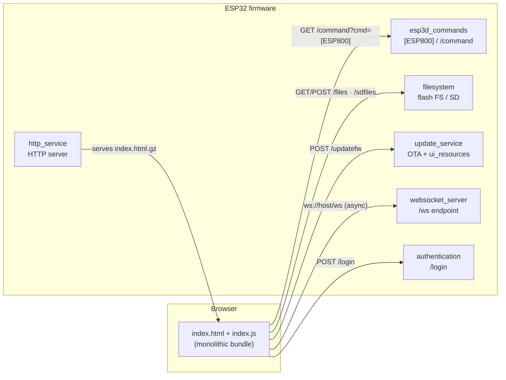

# embedded_webui

## Overview

The **embedded_webui** module (`embedded/`) is the minimal built-in web page served directly from the ESP32 flash by the [http_service](http_service.md). It provides a zero-install fallback interface — terminal console, file browser, and firmware/resources update — when the full ESP3D-WEBUI 3.0 package is not installed on the device.

It is a plain JavaScript/webpack project (no framework) deliberately kept tiny: the production build produces a **single gzipped `index.html`** that must stay **under 15 KB**, works **fully offline**, and loads **no external assets**. Current page version: `3.0.0.a6`.

> **Parent module:** [Network_&_Web_Services](Network_and_Web_Services.md) — the page is served by the firmware HTTP server from `main/embedded/index.html.gz` and consumes its REST/WebSocket endpoints.

---

## Architecture Overview



---

## Source Layout

| Path | Role |
|------|------|
| `embedded/src/index.html` | HTML shell — panels, login modal, element IDs used by the JS |
| `embedded/src/index.js` | **All runtime behavior** (987 lines, bundled by webpack) |
| `embedded/src/menu.js` | Top-menu external links (firmware repo, WebUI repo, wiki) |
| `embedded/src/style.css` | Styles, extracted and inlined at build time |
| `embedded/config/webpack.prod.js` | Production build → single inlined HTML → `dist/index.html.gz` |
| `embedded/config/webpack.dev.js` | Dev server config (`npm run dev`) |
| `embedded/config/server.js` | Local dev backend (express + express-ws, mocks the firmware API) |
| `embedded/config/buildassets.js` | Post-build: gzips favicon, copies `index.html.gz` into `main/embedded/` |
| `embedded/tools/format_sources.py` | Source formatting helper |

---

## Boot Sequence (`[ESP800]` discovery)

1. `window.onload` wires all event listeners, then calls `getFWData()`.
2. `getFWData()` issues `GET /command?cmd=[ESP800]json=YES version=3.0.0.a6 time=<PC time>`.
3. `processFWJson()` validates the `{status, cmd, data}` envelope, then configures the UI from `json.data`:
   - `Authentication == "Enabled"` → show login link
   - `FWVersion` → version label (click opens `/config`)
   - `FlashFileSystem` / `SDConnection` → show file panel (falls back to `/sdfiles` when no flash FS)
   - `WebUpdate` → show firmware update panel; `WebUpdateResources` → show the UI-resources target selector
   - `HostPath`, `Hostname` (→ `document.title`), `RadioMode` (captive-portal detection → "limited environment" warning)
4. WebSocket bootstrap (see below), then `SendFileCommand("list", "all")` populates the file browser.

---

## Feature Areas

### Terminal console
- Collapsible panel; input `GET /command?cmd=<text>`; response rendered via `processCmdJson` (JSON pretty-printed, raw text otherwise; `ESP3D says: command forwarded` is filtered out).
- Ring buffer of the last **300 lines**, optional auto-scroll.

### File browser
- Endpoint: `GET <fspath>?action=<list|delete|createdir|deletedir>&filename=...&path=...` where `fspath` is `/files` (flash) or `/sdfiles` (SD fallback).
- Renders status bar (total/used/occupation meter), directories (size `-1`) then files, sorted case-insensitively; navigation via `currentPath`, "Up.." entry, per-item delete with confirm.
- Clicking a file opens it in a new tab. If `index.html(.gz)` is detected at `HostPath`, the **WebUI link** is revealed (gateway to the full ESP3D-WEBUI).
- Multi-file upload: `POST <fspath>` with `FormData` — each file is preceded by a `<path><name>S` field carrying its size so the firmware can verify completeness; progress bar via `upload.progress`.

### Firmware & UI-resources update
- `POST /updatefw` (firmware OTA) or `POST /updatefw?partition=ui_resources` (resources partition), with the same size-prefix `FormData` contract.
- Firmware success → countdown (40 s) then page reload; resources success → "Please restart device".

### Authentication
- Modal login: `POST /login` with `USER` / `PASSWORD` / `SUBMIT=yes` form fields; HTTP **401** anywhere triggers `handle401()` (re-shows modal, hides all panels). See [authentication](authentication.md).

### WebSocket channel
- **Asynchronous mode** (default): `ws(s)://<same host>/ws`, sub-protocol `webui-v3` — handled by [websocket_server](websocket_server.md).
- **Synchronous (legacy) mode**: `ws://<WebSocketIP>:<WebSocketPort>` from the `[ESP800]` fields.
- Binary frames are decoded to text and appended to the console; text control messages: `currentID` (session id), `activeID` (kicks the page if another client took over), `ERROR` (aborts an ongoing upload).
- Unclean close / error → `finalizeServerDisconnect()` (hides UI, marks title "(disconnected)"); clean close → reconnect attempt after 3 s.

### Captive-portal detection
`isLimitedEnvironment()` checks the page host against known connectivity-check domains (Android/Apple/Microsoft) when `RadioMode == "AP"` and warns the user to browse the board's real IP instead.

---

## Build Pipeline

```bash
npm run build   # = npm run pack && npm run convert-assets
```

1. **`pack`** — webpack production: Babel (`preset-env` + core-js), CSS extraction, `HtmlWebpackPlugin` + inline script/css plugins → one HTML file, minified, then `CompressionPlugin` → `dist/index.html.gz`.
2. **`convert-assets`** — `buildassets.js` gzips the favicon and copies `index.html.gz` to **`main/embedded/index.html.gz`**, where the firmware HTTP server picks it up.

Development: `npm run dev` runs webpack-dev-server plus the express mock backend (`config/server.js`).

---

## Dependencies

| Consumes | Provided by |
|---|---|
| `[ESP800]` JSON capabilities, `/command` | [esp3d_commands](esp3d_commands.md), [gcode_host](gcode_host.md) |
| HTTP server, static file serving | [http_service](http_service.md) |
| `/ws` asynchronous WebSocket | [websocket_server](websocket_server.md) |
| `/login`, 401 flow | [authentication](authentication.md) |
| `/files`, `/sdfiles` actions | [filesystem](filesystem.md) |
| `/updatefw` OTA + resources partition | [update_service](update_service.md) |

## Related Design Documents (repository)

- [Embedded WebUI — function inventory](https://github.com/luc-github/Pibot-cnc-pendant-firmware/blob/main/docs/embedded/embedded_webui_function_inventory.md)
- [Embedded WebUI — build flow and JSON/API contract](https://github.com/luc-github/Pibot-cnc-pendant-firmware/blob/main/docs/embedded/embedded_webui_build_and_json_flow.md)
- [Embedded WebUI — rewrite risks and anti-patterns](https://github.com/luc-github/Pibot-cnc-pendant-firmware/blob/main/docs/embedded/embedded_webui_rewrite_risks_and_antipatterns.md)
- [docs/embedded README](https://github.com/luc-github/Pibot-cnc-pendant-firmware/blob/main/docs/embedded/README.md)


## Documents de conception (depot)

- [compression-support](https://github.com/luc-github/Pibot-cnc-pendant-firmware/blob/main/docs/guides/compression-support.md)
