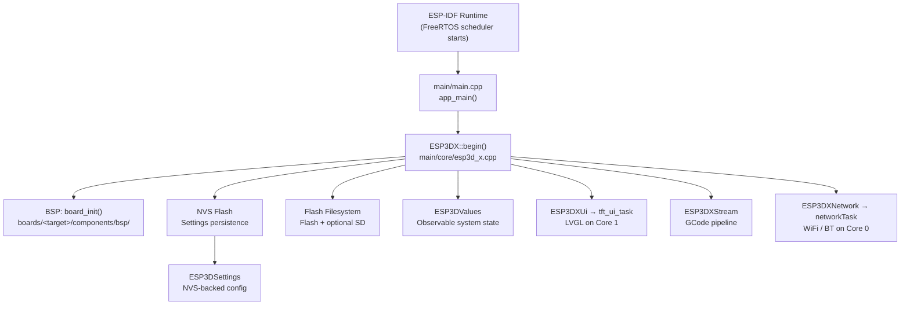
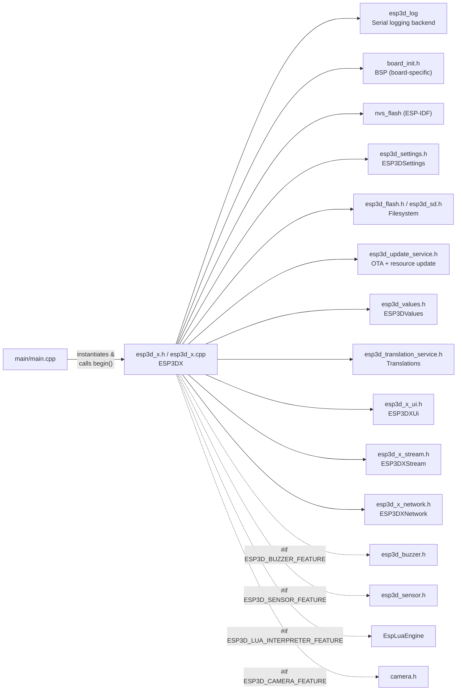
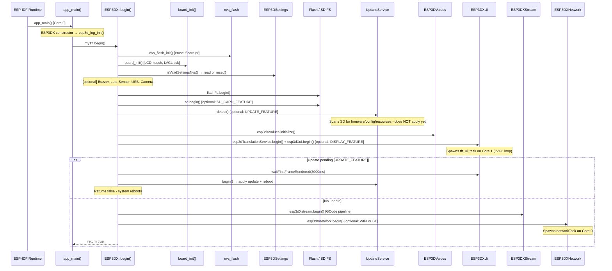
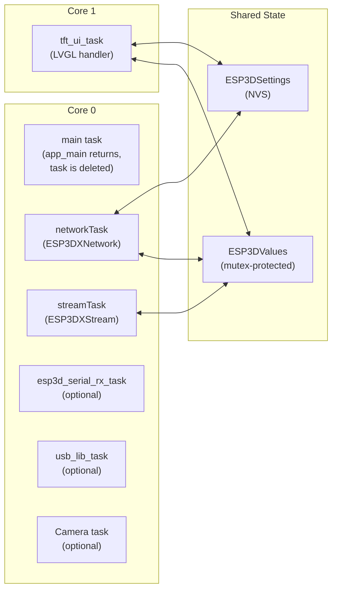
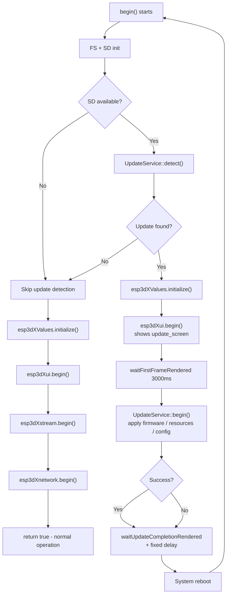

# Entry Point Module

## Overview

The **entry point** module is the single-file bridge between the ESP-IDF runtime and the entire ESP3D-X firmware. It consists of `main/main.cpp`, which contains only the mandatory `app_main()` function required by ESP-IDF. All real boot logic is delegated immediately to `ESP3DX::begin()`, making this module a thin but architecturally significant gateway.

```cpp
// main/main.cpp  — the complete file
static ESP3DX myTft;
extern "C" void app_main(void) { myTft.begin(); }
```

The `ESP3DX` class (defined in `main/core/includes/esp3d_x.h`, implemented in `main/core/esp3d_x.cpp`) orchestrates every subsystem startup in a strict, dependency-ordered sequence. Understanding this sequence is essential for anyone working on boot behavior, feature gating, or memory budgeting.

---

## Architecture

### Position in the System



`app_main()` is called once by the ESP-IDF scheduler on **Core 0** after all hardware peripherals are ready. It is a `C`-linkage symbol (`extern "C"`) because the ESP-IDF startup code is C, while the firmware is C++.

---

## Component Relationships



Dashed lines represent **compile-time optional** subsystems controlled by CMake feature flags.

---

## Initialization Sequence (Boot Flow)

`ESP3DX::begin()` executes on the main task (Core 0) and follows a strict, sequential order. Steps marked `[optional]` are compiled in only when the corresponding CMake feature flag is enabled.



### Key Observations

| Step | Notes |
|---|---|
| `esp3d_log_init()` | Called in the `ESP3DX` **constructor**, before `begin()`. The serial log backend is active from the very first line. |
| `board_init()` | BSP-specific. Initializes the display panel, touch controller, LVGL tick timer, and any board-specific GPIO. See [Board Support Packages documentation](Board_Support_Packages.md). |
| NVS validation | If NVS is corrupt or version-mismatched, `ESP3DSettings::reset()` is called to restore factory defaults before anything else reads from settings. |
| `esp3dXValues.initialize()` | Always runs regardless of the display feature flag. Network and CNC code may call `set_value` / `get_value` even on headless builds. |
| `esp3dXui.begin()` | Returns immediately after spawning `tft_ui_task`. The UI runs independently on **Core 1**. The calling task only blocks when an update is pending. |
| Update path | If an update is detected, `begin()` waits for the update screen to become visible (`waitFirstFrameRendered`), applies the update, then **returns `false`**. The system reboots. The normal boot path never executes. |
| `esp3dXnetwork.begin()` | Spawns `networkTask`, which initializes the TCP/IP stack (`esp_netif_init`) and starts WiFi or Bluetooth depending on build configuration. WiFi and Bluetooth are mutually exclusive (hardware constraint). |

---

## Feature-Gate Summary

The entry point's behavior changes significantly depending on compile-time flags set in `CMakeLists.txt`:

```mermaid
graph TD
    FLAGS["CMake Feature Flags"]
    DISPLAY["ESP3D_DISPLAY_FEATURE\n→ UI task, translations,\n  update screen"]
    UPDATE["ESP3D_UPDATE_FEATURE\n→ SD update detection &\n  application before normal boot"]
    WIFI["ESP3D_WIFI_FEATURE\n→ networkTask with TCP/IP stack"]
    BT["ESP3D_BT_SERIAL_FEATURE /\nESP3D_BT_BLE_FEATURE\n→ networkTask with Bluetooth\n(mutually exclusive with WiFi)"]
    SD["ESP3D_SD_CARD_FEATURE\n→ SD FS init, update detection"]
    USB["ESP3D_USB_SERIAL_FEATURE\n→ USB OTG host init/deinit"]
    BUZZER["ESP3D_BUZZER_FEATURE\n→ buzzer.begin()"]
    SENSOR["ESP3D_SENSOR_FEATURE\n→ sensor.begin()"]
    LUA["ESP3D_LUA_INTERPRETER_FEATURE\n→ lua_interpreter.begin()"]
    CAM["ESP3D_CAMERA_FEATURE\n→ camera.begin()"]

    FLAGS --> DISPLAY
    FLAGS --> UPDATE
    FLAGS --> WIFI
    FLAGS --> BT
    FLAGS --> SD
    FLAGS --> USB
    FLAGS --> BUZZER
    FLAGS --> SENSOR
    FLAGS --> LUA
    FLAGS --> CAM
```



See `cmake/features.cmake` for macro definitions and `cmake/sanity_check.cmake` for mutual-exclusion rules (e.g., WiFi + BT, socket client + WebUI).

---

## FreeRTOS Task Topology After Boot

Once `begin()` completes successfully, the system stabilizes into the following task layout:



> ⚠️ **Critical constraint**: LVGL is single-threaded and runs exclusively on **Core 1** inside `tft_ui_task`. All other tasks must never call LVGL APIs directly. Shared data is exchanged through `ESP3DValues` (observable, mutex-protected). See [UI Framework & Screens documentation](UI_Framework_and_Screens.md) for the full LVGL threading model.

---

## Update Boot Path Detail

When a firmware or resource update is detected on the SD card, the boot sequence diverges from normal operation:



---

## Related Modules

| Module | Relationship |
|---|---|
| [Core Platform & Infrastructure](Core_Platform_and_Infrastructure.md) | Defines `ESP3DX`, `ESP3DSettings`, `ESP3DValues`, `ESP3DCommands`, and the logging system initialized at boot |
| [Board Support Packages](Board_Support_Packages.md) | `board_init()` called directly in `begin()` — provides display, touch, and LVGL tick for each hardware target |
| [UI Framework & Screens](UI_Framework_and_Screens.md) | `ESP3DXUi::begin()` starts the LVGL task; the entry point gates the update flow on `waitFirstFrameRendered` |
| [CNC Firmware Integration](CNC_Firmware_Integration.md) | `ESP3DXStream::begin()` starts the GCode pipeline task after the update check |
| [Network & Web Services](Network_and_Web_Services.md) | `ESP3DXNetwork::begin()` spawns the network task (WiFi or Bluetooth, build-exclusive) |
| [Storage & Configuration](Storage_and_Configuration.md) | Flash and SD filesystems initialized early in `begin()` before any service that reads files |
| [Hardware Peripheral Drivers](Hardware_Peripheral_Drivers.md) | Low-level drivers consumed by `board_init()` for display, touch, encoder, buzzer |
