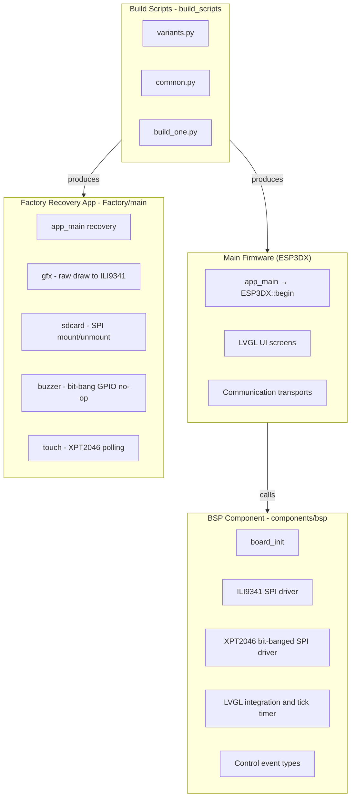
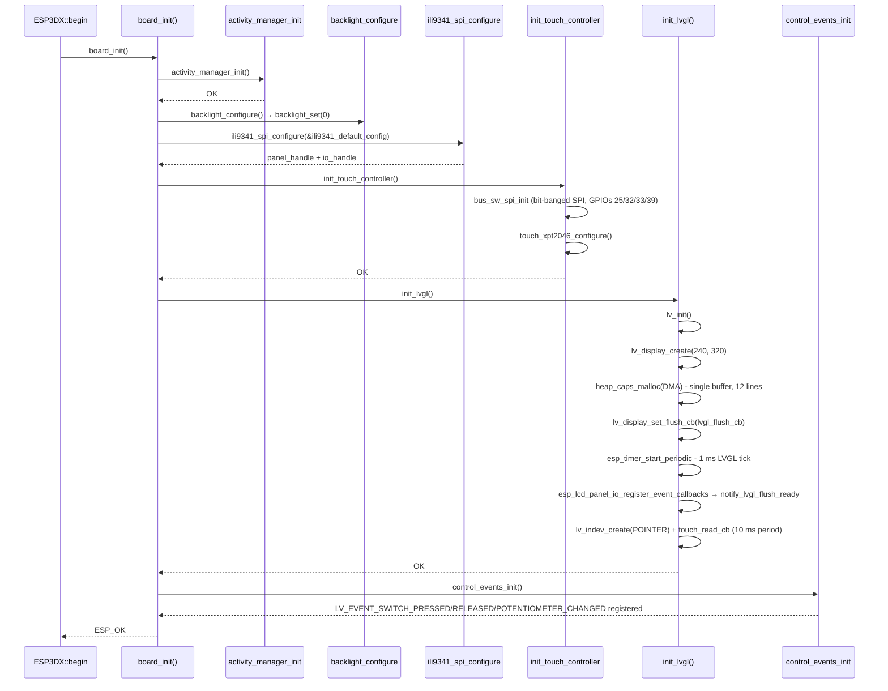
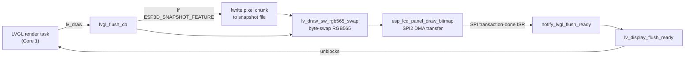
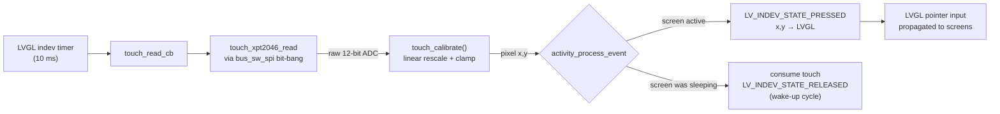
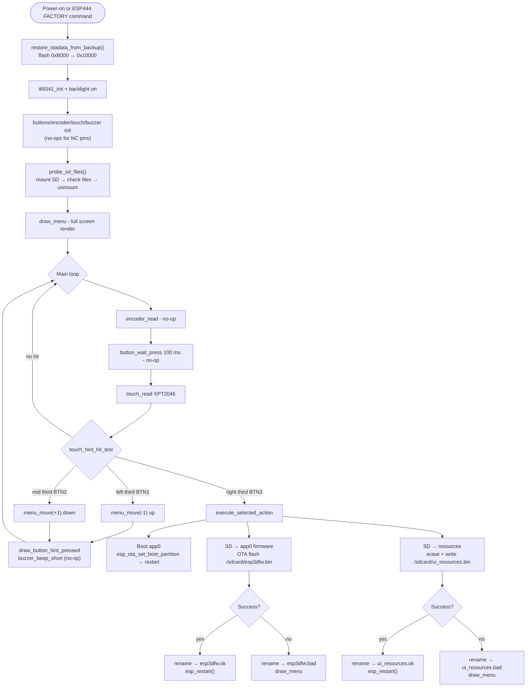
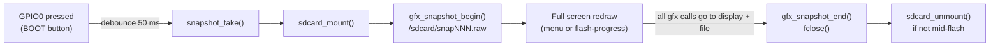
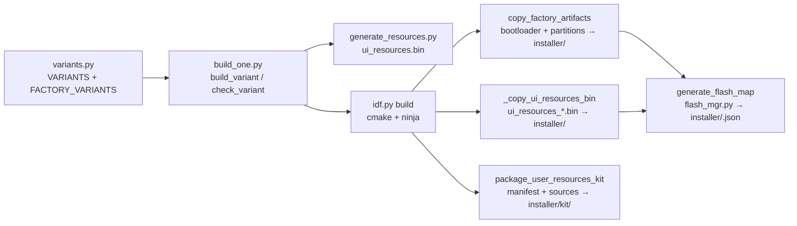

# ESP32-2432S028R Board Support Package

The `esp32_2432s028r` module provides the Board Support Package (BSP) for the **ESP32-2432S028R**, a popular low-cost ESP32 development board — also referred to as the "CYD" (Cheap Yellow Display) — equipped with a 2.8-inch ILI9341 SPI TFT display and an XPT2046 resistive touchscreen. The module covers the complete lifecycle of this board within the pendant firmware: hardware abstraction, LVGL display and touch integration, the standalone factory recovery application, and the multi-variant build system.

> **Touch-only board.** Physical buttons, rotary encoder, buzzer, 4-position switch, and potentiometer are all `GPIO_NUM_NC`. All pendant controls are implemented as on-screen virtual elements driven exclusively by touch.

---

## Hardware Specification

| Feature | Detail |
|---|---|
| MCU | ESP32 (Xtensa dual-core LX6, 240 MHz) |
| Flash | 4 MB (only supported configuration) |
| PSRAM | None |
| Display | ILI9341 SPI TFT — 240×320 px portrait |
| Display bus | SPI2/HSPI, hardware DMA, **20 MHz** (40 MHz causes progressive line-shift corruption on this clone board) |
| Touch | XPT2046 resistive — **dedicated bit-banged SPI bus** (separate GPIOs from the display) |
| SD Card | SPI3/VSPI, on-board micro-SD slot |
| UART | UART0 (GPIO1 TX / GPIO3 RX) — shared with console |
| Buzzer | Not populated (`GPIO_NUM_NC`) |
| Physical buttons | Not populated (`GPIO_NUM_NC`) |
| Rotary encoder | Not populated (`GPIO_NUM_NC`) |

### Pin Assignments

**ILI9341 Display — SPI2 / HSPI (hardware SPI, DMA)**

| Signal | GPIO |
|---|---|
| CS | 15 |
| DC | 2 |
| MOSI | 13 |
| CLK | 14 |
| MISO | 12 |
| RST | 4 |
| Backlight | 21 (active-high, on/off — no PWM dimming) |

**XPT2046 Touch — Bit-banged SPI (separate bus)**

| Signal | GPIO | Notes |
|---|---|---|
| CS | 33 | |
| CLK | 25 | |
| MOSI | 32 | |
| MISO | 39 | Input-only GPIO |
| IRQ | 36 | Input-only GPIO |

Calibration: X raw 200–3850 → 0–240 px; Y raw 380–3950 → 0–320 px.
**X axis is hardware-inverted** (`TOUCH_MIRROR_X_FLAG=1`, confirmed on hardware 2026-08-03).

**SD Card — SPI3 / VSPI**

| Signal | GPIO |
|---|---|
| MISO | 19 |
| MOSI | 23 |
| CLK | 18 |
| CS | 5 |

### Key Hardware Constraints

- **No PSRAM** — imposes the tightest heap budget of all supported boards (≈75 KB free in WiFi mode). See [`esp32_memory_constraints.md`](https://github.com/luc-github/Pibot-cnc-pendant-firmware/blob/main/docs/guides/esp32_memory_constraints.md).
- **Dual SPI buses** — display on hardware SPI2; touch on a separate bit-banged SPI. The two buses must never share GPIO lines.
- **SPI speed cap** — hard-coded to 20 MHz in `board_config.h` and `hw_config.h` due to signal integrity issues at 40 MHz on this specific board.
- **Touch-only input** — all pendant controls are virtual (on-screen); no physical button, encoder, buzzer, switch, or potentiometer is wired.
- **Single OTA slot** — only `app0` exists. No `app1` partition fits in 4 MB alongside the factory partition.
- **No custom bootloader hook** — recovery is entered exclusively via the software `[ESP444]FACTORY` command from the main firmware; there is no physical button to hold at power-up.

---

## Architecture Overview

The module is organized into three independent layers: the main-firmware BSP component, the standalone factory recovery application, and the Python build scripts.



> The factory recovery app is **completely standalone** — it does not link the BSP component and drives the ILI9341 through its own `ili9341.c` driver and `gfx.c` abstraction layer rather than through `esp_lcd` or LVGL.

---

## Flash Partition Map (4 MB)

```
Offset     Name            Size      Notes
──────────────────────────────────────────────────────────────────
0x00000    bootloader      44 KB     Partition table at 0xC000 (not default 0x8000)
0x0D000    nvs             12 KB     NVS settings (ESP3DSettings)
0x10000    otadata          8 KB     OTA state tracking
0x20000    app0 (ota_0)  2880 KB    Main pendant firmware (single OTA slot)
0x2F0000   ui_resources    192 KB    LVGL icons, fonts, theme palette
0x320000   flashfs         576 KB    LittleFS / FAT file system
0x3B0000   factory         320 KB    Factory recovery application
```

> **OTA backup area**: Before switching to the factory partition, the main firmware writes an otadata backup to flash offset `0xB000` — a 4 KB-aligned region below the partition table. The factory app restores this backup at startup so that a power-off during recovery returns to the correct OTA partition. `CONFIG_SPI_FLASH_DANGEROUS_WRITE_ALLOWED=y` is **required** in the factory `sdkconfig` to permit writes below the first partition boundary.

---

## BSP Component (`components/bsp`)

The BSP component is linked into the main firmware. It owns the complete hardware-initialization sequence and the LVGL integration layer.

### Component Files

| File | Purpose |
|---|---|
| `board_config.h` | All pin, SPI, display, touch, UART, and peripheral constants |
| `board_init.c / .h` | Top-level `board_init()` and all LVGL sub-system setup |
| `disp_ili9341_spi_def.h` | ILI9341 default config struct instance |
| `touch_xpt2046_def.h` | XPT2046 config struct + bit-banged SPI read hook |
| `disp_backlight_def.h` | Backlight configuration struct instance |
| `sd_def.h` | SD card configuration struct instance |
| `serial_def.h` | UART configuration struct instance |
| `control_event.h` | `control_event_t` — unified structure for LVGL input events |
| `control_types.c / .h` | Custom LVGL event ID registration (`control_events_init`) |
| `tasks_def.h` | FreeRTOS task priorities and stack sizes |
| `lv_conf.h` | LVGL compile-time configuration |

### `board_init()` Initialization Sequence



### Display Pipeline



**Display buffer configuration:**

| Parameter | Value | Source |
|---|---|---|
| Buffer mode | Single | `DISPLAY_USE_DOUBLE_BUFFER_FLAG=0` |
| Buffer lines | 12 | `DISPLAY_BUFFER_LINES_NB=12` |
| Buffer size | 5 760 bytes | 240 × 12 × 2 bytes, DMA-capable SRAM |
| Color byte swap | Yes | `DISPLAY_SWAP_COLOR_FLAG=1` — ILI9341 expects big-endian RGB565 |
| Orientation | Portrait (0) | 240 wide × 320 tall |
| Color invert | No | `DISPLAY_INVERT_FLAG=0` |

### Touch Pipeline



The calibration formula applied inside `touch_read_cb`:

```c
// maps raw ADC [cal_min, cal_max] → pixel [0, range], clamped at 0
value = (raw > cal_min) ? (raw - cal_min) * range / (cal_max - cal_min) : 0;
```

| Axis | `cal_min` | `cal_max` | `range` | Mirror |
|---|---|---|---|---|
| X | 200 | 3 850 | 240 | **Yes** — `TOUCH_MIRROR_X_FLAG=1` |
| Y | 380 | 3 950 | 320 | No |

A first touch that wakes the screen from the activity-manager idle state is **consumed** (not forwarded to LVGL). The next press cycle is delivered normally.

### `touch_xpt2046_def.h` — Bit-banged SPI Hook

The XPT2046 driver (`hardware/common/drivers/touch_xpt2046`) accepts a `read_reg12_fn` function pointer. This board wires it to an inline helper that calls the bit-banged SPI layer:

```c
static inline uint16_t touch_xpt2046_spi_read_reg12(uint8_t reg) {
    return bus_sw_spi_read_reg16(reg) >> 3;  // 16-bit read, top 12 bits valid
}
```

This decouples the touch driver from knowing whether hardware or software SPI is in use. See [`display_spi_drivers.md`](display_spi_drivers.md) and [`touch_drivers.md`](touch_drivers.md) for the shared driver APIs.

### Custom Control Events

`control_events_init()` registers three dynamic LVGL event IDs after `lv_init()`. They are declared `extern` in `control_types.h` and consumed by the UI screen event handlers.

| Constant | Purpose |
|---|---|
| `LV_EVENT_SWITCH_PRESSED` | Virtual switch press (touch-emulated) |
| `LV_EVENT_SWITCH_RELEASED` | Virtual switch release |
| `LV_EVENT_POTENTIOMETER_CHANGED` | Analog value change (software-emulated) |

### `control_event_t` Structure

```c
typedef struct {
    lv_indev_t      *indev;
    uint32_t         btn_id;
    lv_indev_type_t  type;
    control_family_t family_id;
    int32_t          steps;
    uint32_t         press_duration;  // milliseconds
} control_event_t;
```

### LVGL Snapshot Feature

When `ESP3D_SNAPSHOT_FEATURE` is enabled, `lvgl_flush_cb` intercepts every LVGL flush and streams pixel data into an open `FILE *` held in the global `g_snapshot` structure (defined in `esp3d_snapshot.h`). The snapshot accumulates flushed tile areas until `captured_pixels >= expected_pixels`, then closes automatically. This is used for automated UI screenshot capture during testing. See [`display_drivers.md`](https://github.com/luc-github/Pibot-cnc-pendant-firmware/blob/main/docs/architecture/display_drivers.md) for the full snapshot state machine.

---

## Factory Recovery Application (`Factory/`)

The factory app is a self-contained ESP-IDF application flashed to the `factory` partition (320 KB at `0x3B0000`). It is entered exclusively via the `[ESP444]FACTORY` software command issued from the main firmware.

### Factory App File Structure

```
Factory/
├── main/
│   ├── main.c          — app_main, menu system, OTA flash actions
│   ├── gfx.c / .h      — raw raster graphics: hline/vline/fill/rect/string
│   ├── ili9341.c / .h  — standalone ILI9341 SPI driver (direct register writes)
│   ├── touch.c / .h    — XPT2046 bit-banged polling → touch_point_t
│   ├── sdcard.c / .h   — SPI mount/unmount via esp_vfs_fat
│   ├── buzzer.c / .h   — bit-bang square-wave (no-op: BUZZER_PIN = GPIO_NUM_NC)
│   ├── buttons.c / .h  — GPIO button polling (no-op: all pins = GPIO_NUM_NC)
│   ├── encoder.c / .h  — PCNT encoder (no-op: pins = GPIO_NUM_NC)
│   ├── hw_config.h     — factory-specific pin and screen constants
│   ├── font8x16.h      — embedded 8×16 bitmap font (ASCII 0x20–0x7E)
│   └── factory_log.h   — FACTORY_LOGD macro (silences SD stack noise)
└── cmake/
    ├── features.cmake
    ├── colors.cmake
    ├── targets.cmake   — installer artifact copy (postbuild)
    └── sanity_check.cmake
```

> **No LVGL, no BSP.** The factory app drives the ILI9341 directly via its own `ili9341.c` SPI driver. `gfx.c` provides an 8×16 font renderer, line/fill/rect primitives, and the optional raw-pixel snapshot mechanism. For cross-board factory app design, see [`factory_app_technical_doc.md`](https://github.com/luc-github/Pibot-cnc-pendant-firmware/blob/main/docs/Factory/factory_app_technical_doc.md).

### Recovery Flow



### Virtual Button Bar Layout

The recovery app renders a button-hint bar at the bottom of the 240×320 screen using raw circle and icon geometry (no LVGL). The touch hit-test divides the **full screen width** into three equal columns, making each button a much larger target than the drawn circle:

```
┌────────────────────────────────────────┐
│           Recovery v1.x.x              │  ← title (COLOR_CYAN)
│  ─────────────────────────────────     │
│  Active: app0 (default)                │  ← COLOR_YELLOW
│  SD: FW  RES                           │  ← SD file indicators
│  ─────────────────────────────────     │
│  > Boot app0                           │  ← selected (highlight box)
│    SD -> app0                          │
│    SD -> resources                     │
│  ─────────────────────────────────     │
│        Power off to cancel             │  ← status / footer
│  ════════════════════════════════      │  ← separator
│   ( up )       ( down )    ( ok )      │  ← virtual button circles
└────────────────────────────────────────┘
     left third   mid third  right third
        BTN1         BTN2       BTN3
```

### OTA Backup / Restore

The main firmware (`esp444.cpp`) writes an otadata backup to `0xB000` before switching the boot partition to `factory`. The factory app restores it on startup:

| Flash offset | Content |
|---|---|
| `0xB000 + 0x00` | OTA entry 1 (32 bytes) |
| `0xB000 + 0x20` | OTA entry 2 (32 bytes) |
| `0xB000 + 0x40` | Magic `0xAA55AA55` (4 bytes) — backup validity flag |

After restoring, the backup sector is erased so the restore does not repeat on the next boot. If the magic is absent or both entries are all `0xFF`, the restore is skipped silently.

> **Warning**: The factory `sdkconfig` **must** set `CONFIG_SPI_FLASH_DANGEROUS_WRITE_ALLOWED=y` because writing at `0xB000` targets an address below the first formal partition. This is intentional: the factory app is a privileged recovery tool.

### SD-Card File Naming Convention

| File | Role |
|---|---|
| `/sdcard/esp3dfw.bin` | Firmware image to flash to `app0` |
| `/sdcard/esp3dfw.ok` | Renamed from `esp3dfw.bin` after successful flash |
| `/sdcard/esp3dfw.bad` | Renamed from `esp3dfw.bin` after failed flash |
| `/sdcard/ui_resources.bin` | UI resources partition image |
| `/sdcard/ui_resources.ok` | Renamed after successful flash |
| `/sdcard/ui_resources.bad` | Renamed after failed flash |

The first 16 bytes of `ui_resources.bin` are inspected for a build header (`ESP3` + 12-char variant string). A mismatch is logged as a warning but does not abort the flash.

### Optional Snapshot Capture (`ENABLE_SNAPSHOT`)

When compiled with `ENABLE_SNAPSHOT`, pressing GPIO0 (the board's physical BOOT button) captures the current screen to a raw file on the SD card:



File format: 4-byte width (LE) + 4-byte height (LE) + raw RGB565 pixels, native-endian, row-major.
Total size: `8 + 240 × 320 × 2 = 153 608` bytes per snapshot.
Sequential filenames (`snap000.raw`, `snap001.raw`, …) are determined at startup by scanning existing files.

---

## Build System

See [`tools_build_scripts.md`](tools_build_scripts.md) for the general build infrastructure. This section covers what is specific to this board.

### Firmware Variants

| Variant name | Memory | CNC Firmware | Transport | Services |
|---|---|---|---|---|
| `4mb_wifi_fluidnc` | 4 MB | FluidNC | WiFi (socket client) + Serial | MDNS, UPDATE |
| `4mb_serial_fluidnc` | 4 MB | FluidNC | Serial (UART0) | UPDATE |
| `4mb_serial_grbl` | 4 MB | GRBL | Serial (UART0) | UPDATE |
| `4mb_wifi_grblhal` | 4 MB | grblHAL | WiFi (socket client) + Serial | MDNS, UPDATE |
| `factory_4mb` | 4 MB | — | — | Recovery app only |

WiFi and Bluetooth are **mutually exclusive** on this board (no PSRAM). Attempting to enable both causes a `cmake/sanity_check.cmake` build error.

> **Socket client / WebUI note**: `SOCKET_CLIENT_SERVICE=ON` enables WiFi-to-CNC mode. `WEBUI_SERVER`, `SSDP_SERVICE`, and `WS_SERVER_SERVICE` are prohibited simultaneously (enforced by `cmake/sanity_check.cmake`). See [`feature_resource_matrix.md`](https://github.com/luc-github/Pibot-cnc-pendant-firmware/blob/main/docs/features/feature_resource_matrix.md).

### `sdkconfig` Selection

| File | Used when |
|---|---|
| `sdkconfig.4mb.serial` | `WIFI_SERVICE=OFF` |
| `sdkconfig.4mb.wifi` | `WIFI_SERVICE=ON` |

`board_config.cmake` selects the appropriate defaults file at first configure time (when no `sdkconfig` exists yet in the build directory).

### Build Variant Dependency Flow



### `make_variant_args()` Pattern

All variant cmake flag lists are generated by `make_variant_args(*on_flags)`. The function first sets **every** recognized root CMake option to `OFF`, then re-enables only the provided flags. This guarantees no stale CMake cache values survive from a previous build targeting a different board.

```python
# Example: 4mb_wifi_fluidnc
make_variant_args(
    "ESP32_2432S028R=ON",
    "MEMORY_4_MB=ON",
    "TARGET_FW_FLUIDNC=ON",
    "SERIAL_SERVICE=ON",
    "WIFI_SERVICE=ON",
    "TFT_UI_SERVICE=ON",
    "TFT_TOUCH_SERVICE=ON",
    "SD_CARD_SERVICE=ON",
    "MDNS_SERVICE=ON",
    "SOCKET_CLIENT_SERVICE=ON",
    "UPDATE_SERVICE=ON",
    "FACTORY_SERVICE=ON",
)
```

### cmake Capabilities Set by `board_config.cmake`

| CMake variable | Value | Effect |
|---|---|---|
| `IDF_TARGET` | `esp32` | Enforced via environment during build |
| `RESOLUTION_SCREEN` | `res_320_240` | Shared UI resource set with `pibot_pendant_v1_0` |
| `DEFAULT_ORIENTATION` | `PORTRAIT` | 240 wide × 320 tall; fixed at compile time |
| `DYNAMIC_ROTATION_FEATURE` | `OFF` | Rotation menu entry hidden (no runtime transform cost) |
| `FIXED_UI` | `OFF` | Virtual control positions computed relative to canvas shape |
| `TFT_BRIGHTNESS_CONTROL` | `ON` | Backlight on/off control available |
| `HARDWARE_BUTTONS` | `OFF` | Physical buttons absent |
| `HARDWARE_ENCODER` | `OFF` | Encoder absent |
| `HARDWARE_SWITCH` | `OFF` | Switch absent |
| `HARDWARE_POTENTIOMETER` | `OFF` | Potentiometer absent |
| `BUZZER_SERVICE` | `OFF` (forced) | Buzzer not populated on this board |

---

## Comparison with Related Boards

| Feature | esp32_2432s028r | pibot_pendant_v1_0 | esp32_3248s035r |
|---|---|---|---|
| MCU | ESP32 | ESP32 | ESP32 |
| Display | ILI9341 240×320 SPI | ILI9341 240×320 SPI | ST7796 480×320 SPI |
| Touch controller | XPT2046 | XPT2046 | XPT2046 |
| Touch bus | **Separate bit-banged SPI** | Shared hardware SPI | **Separate bit-banged SPI** |
| Physical buttons | None | 3 | 3 |
| Rotary encoder | None | Yes | Yes |
| Buzzer | None | Yes | Yes |
| PSRAM | None | None | None |
| OTA slots | **1 (app0 only)** | 2 (app0 + app1) | 2 (app0 + app1) |
| Custom bootloader | No | Yes (physical button trigger) | Yes (physical button trigger) |
| Factory entry | Software `[ESP444]` only | SW + hold button at boot | SW + hold button at boot |
| Max SPI speed | **20 MHz** (HW limit) | 40 MHz | 40 MHz |
| UI resource set | `res_320_240` | `res_320_240` | Different resolution |

---

## Related Documentation

| Document | Relationship |
|---|---|
| [`display_drivers.md`](https://github.com/luc-github/Pibot-cnc-pendant-firmware/blob/main/docs/architecture/display_drivers.md) | SPI panel driver architecture, orientation/rotation math, snapshot state machine |
| [`esp32_memory_constraints.md`](https://github.com/luc-github/Pibot-cnc-pendant-firmware/blob/main/docs/guides/esp32_memory_constraints.md) | Heap budget per transport, fragmentation guidance for no-PSRAM builds |
| [`feature_resource_matrix.md`](https://github.com/luc-github/Pibot-cnc-pendant-firmware/blob/main/docs/features/feature_resource_matrix.md) | Feature/transport compatibility matrix and `sanity_check.cmake` rules |
| [`board_build_guidelines.md`](https://github.com/luc-github/Pibot-cnc-pendant-firmware/blob/main/docs/guides/board_build_guidelines.md) | General board build conventions and variant naming |
| [`ui_resources_guide.md`](https://github.com/luc-github/Pibot-cnc-pendant-firmware/blob/main/docs/guides/ui_resources_guide.md) | How to update icons, fonts, and theme palette via SD card |
| [`factory_app_technical_doc.md`](https://github.com/luc-github/Pibot-cnc-pendant-firmware/blob/main/docs/Factory/factory_app_technical_doc.md) | Cross-board factory app technical reference |
| [`pibot_pendant_v1_0_bsp.md`](pibot_pendant_v1_0_bsp.md) | Reference board — same ILI9341 + XPT2046 + `res_320_240`, with physical controls |
| [`esp32_3248s035r.md`](esp32_3248s035r.md) | Sibling board — also uses XPT2046 on a separate bit-banged SPI bus |
| [`screens_architecture.md`](https://github.com/luc-github/Pibot-cnc-pendant-firmware/blob/main/docs/architecture/screens_architecture.md) | Screen lifecycle and LVGL screen transition patterns |
| [`connection_management.md`](https://github.com/luc-github/Pibot-cnc-pendant-firmware/blob/main/docs/architecture/connection_management.md) | Transport initialization and connection status system |
