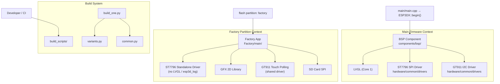
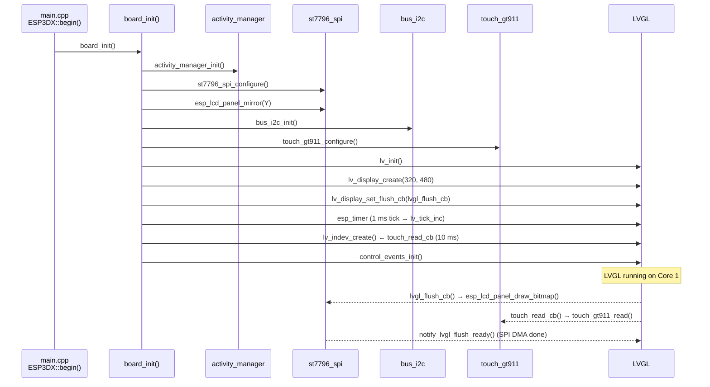
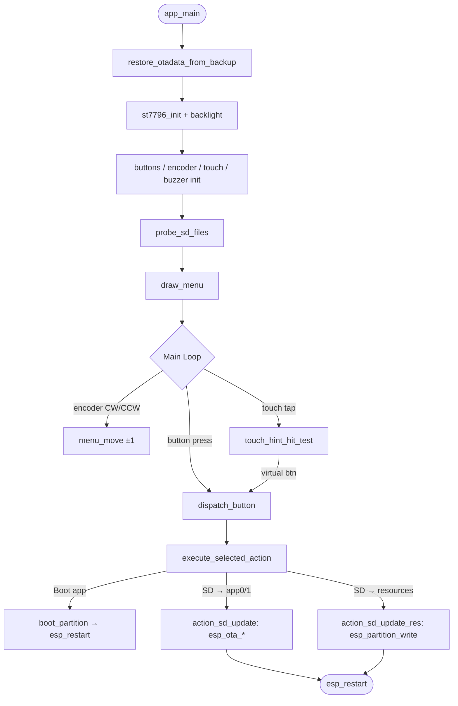

# ESP32-3248S035C Board Support Package

## Overview

The **ESP32-3248S035C** module is the Board Support Package (BSP) for the ESP32-3248S035C development board — a 3.5-inch IPS touchscreen panel built around the original ESP32 SoC. The **"C"** suffix denotes a **Capacitive** touch panel (GT911, I2C), distinguishing it from the otherwise similar [esp32_3248s035r](esp32_3248s035r.md) variant which uses a Resistive touch controller (XPT2046, SPI).

This BSP provides:
- A **standalone Factory/recovery application** flashed to the factory partition, used for OTA firmware and UI-resource updates from an SD card.
- A **BSP component** used by the main pendant firmware, wiring the ST7796 display and GT911 touch controller into LVGL.
- **Build scripts** that define and compile the supported firmware variants for this board.

The module lives entirely under `boards/esp32_3248s035c/` and is one board in the wider [Board Support Packages](esp32_2432s028r.md) family.

---

## Hardware Summary

| Feature | Detail |
|---|---|
| MCU | ESP32 (Xtensa dual-core LX6, 240 MHz) |
| Flash | 4 MB |
| PSRAM | None |
| Display | ST7796 3.5" IPS TFT, **320 × 480** px, SPI |
| Touch | GT911 capacitive multi-touch, I2C |
| Physical buttons | **Not populated** (`GPIO_NUM_NC`) |
| Rotary encoder | **Not populated** (`GPIO_NUM_NC`) |
| Buzzer | **Not populated** (`GPIO_NUM_NC`) |
| SD card | SPI interface |
| Recovery entry | Software trigger only (`[ESP444]FACTORY` from main firmware) |
| Custom bootloader | **None** (no physical boot button to hold at reset) |

> **Touch-only navigation.** Unlike the [pibot_pendant_v1_0](pibot_pendant_v1_0_bsp.md) or the resistive sibling [esp32_3248s035r](esp32_3248s035r.md), this board has no encoder, buttons, or buzzer wired. All navigation in the factory app is via virtual on-screen buttons. Driver code for buttons, encoder, and buzzer is compiled in but safely no-ops at runtime through `GPIO_IS_VALID_GPIO()` guards.

---

## Architecture Overview

The module is organized into three distinct layers, each documented in its own sub-module file:



### Flash Partition Layout

```
0x0000   Bootloader       (standard ESP-IDF — no custom hooks on this board)
0xC000   Partition table
0xD000   NVS
0xF000   otadata          ← saved to 0xB000 by main firmware before entering recovery
0x10000  app0             ← main pendant firmware
         factory          ← this module's Factory app
         ui_resources     ← LVGL images, fonts, theme palette
```

> The main firmware (in `esp444.cpp`) writes a magic-tagged backup of `otadata` to offset `0xB000` before switching to the factory partition. The factory app's `restore_otadata_from_backup()` restores it on startup so the board correctly returns to `app0` after a power cycle during recovery.

---

## Sub-Modules

### 1. Factory Application — [`esp32_3248s035c_factory.md`](esp32_3248s035c_factory.md)

The recovery application running from the factory flash partition. It presents a touch-navigable menu to:
- Boot a selected OTA partition (`app0` / `app1`).
- Flash a new firmware image from SD card (`esp3dfw.bin` → OTA via `esp_ota_write`).
- Flash new UI resources from SD card (`ui_resources.bin` → raw partition write).

**Key components:** `main.c` (menu loop, OTA actions), `gfx.c` (2D graphics / snapshot), `st7796.c` (standalone SPI display driver), `touch.c` (GT911 polling wrapper), `sdcard.c` (SPI SD mount), `buttons.c`, `buzzer.c`, `encoder.c` (no-op on this board), `factory_log.h`.

---

### 2. BSP Component — [`esp32_3248s035c_bsp.md`](esp32_3248s035c_bsp.md)

The hardware initialization layer consumed by the main pendant firmware. It:
- Initializes the **ST7796 SPI display** and applies a board-specific mirror-Y orientation correction.
- Initializes the **GT911 capacitive touch** controller via shared I2C driver, with activity-manager wakeup-suppression logic.
- Configures **LVGL**: display, DMA-capable draw buffers, flush callback, tick timer, and touch input device.
- Registers **custom LVGL control events** for switch and potentiometer inputs.

**Key components:** `board_init.c`, `control_event.h`, `control_types.c`.

---

### 3. Build Scripts — [`esp32_3248s035c_build_scripts.md`](esp32_3248s035c_build_scripts.md)

Python build system for the firmware variant matrix. It handles:
- Variant definitions (4 MB flash × transport × CNC firmware target).
- CMake invocation through ESP-IDF `idf.py` with forced `IDF_TARGET=esp32`.
- UI resource binary (`ui_resources_*.bin`) generation via `generate_resources.py`.
- Factory artifact copying (bootloader, partition table) from the factory build into the installer directory.
- Flash map JSON generation.

**Key components:** `build_one.py`, `common.py`, `variants.py`.

---

## Component Interaction — BSP Layer



---

## Component Interaction — Factory App



---

## Firmware Variants

The build system defines **four** production firmware variants and **one** factory variant:

| Variant | Memory | Transport | CNC Target |
|---|---|---|---|
| `4mb_wifi_fluidnc` | 4 MB | WiFi + Serial | FluidNC |
| `4mb_serial_fluidnc` | 4 MB | Serial UART | FluidNC |
| `4mb_serial_grbl` | 4 MB | Serial UART | GRBL |
| `4mb_wifi_grblhal` | 4 MB | WiFi + Serial | grblHAL |
| `factory_4mb` *(factory)* | 4 MB | — | Recovery |

All production variants enable `TFT_UI_SERVICE`, `TFT_TOUCH_SERVICE`, `UPDATE_SERVICE`, and `SERIAL_SERVICE`. WiFi variants additionally enable `WIFI_SERVICE`, `MDNS_SERVICE`, and `SOCKET_CLIENT_SERVICE`.

> **Transport policy:** Per `cmake/sanity_check.cmake`, `WEBUI_SERVER`, `SSDP_SERVICE`, and `WS_SERVER_SERVICE` are disabled when `SOCKET_CLIENT_SERVICE` is ON. See [feature_resource_matrix.md](https://github.com/luc-github/Pibot-cnc-pendant-firmware/blob/main/docs/features/feature_resource_matrix.md) for the full compatibility matrix.

---

## Comparison with Sibling Board (`esp32_3248s035r`)

| Aspect | `esp32_3248s035c` | `esp32_3248s035r` |
|---|---|---|
| Touch controller | GT911 (capacitive, I2C) | XPT2046 (resistive, SPI) |
| Touch calibration | Auto-detected by GT911 | Manual 4-point software calibration |
| BSP touch init | `touch_gt911_configure()` | `touch_xpt2046_configure()` + `touch_calibrate()` |
| Factory touch driver | Thin wrapper over shared `touch_gt911` | Standalone `read_reg12()` + `calibrate()` |
| Custom bootloader | None | None |
| Physical controls | None (`GPIO_NUM_NC`) | None (`GPIO_NUM_NC`) |
| Display driver | ST7796 SPI (same) | ST7796 SPI (same) |
| Orientation fix | mirror-Y via `esp_lcd_panel_mirror()` | Same panel quirk, same fix |

---

## Key Design Decisions

### Touch-Only Navigation (Factory App)
Three virtual buttons are rendered at the bottom of the 320×480 screen. `touch_hint_hit_test()` divides the screen width into thirds: left = Up, center = Down, right = OK. Visual press feedback (`draw_button_hint_pressed()`) and a buzzer beep (no-op on this board) are triggered before `dispatch_button()` to give tactile-like confirmation. The encoder and hardware button loops are still polled but return immediately with no-ops.

### Standalone Factory Display Driver
`Factory/main/st7796.c` reimplements the display driver over the raw SPI master driver without depending on `esp_lcd`, `esp3d_log`, or LVGL. This keeps the factory partition self-contained and minimal.

### Mirror-Y Orientation Quirk (BSP)
The ST7796 panel requires a mirror-Y correction not expressible via the shared driver's `DISPLAY_ORIENTATION` enum. `board_init()` calls `esp_lcd_panel_mirror(handle, false, true)` after `st7796_spi_configure()` as a board-specific one-off, leaving the shared driver unchanged for all other boards.

### OTA Data Backup / Restore
The backup offset `0xB000` and magic word `0xAA55AA55` at `0xB040` must match the values in the main firmware's `esp444.cpp` exactly. Both files contain warnings about this coupling.

---

## Related Documentation

| Topic | File |
|---|---|
| Hardware schematics | [pibot-cnc-pendant-hardware-documentation.md](https://github.com/luc-github/Pibot-cnc-pendant-firmware/blob/main/docs/hardware/pibot-cnc-pendant-hardware-documentation.md) |
| Display driver architecture | [display_drivers.md](https://github.com/luc-github/Pibot-cnc-pendant-firmware/blob/main/docs/architecture/display_drivers.md) |
| ST7796 SPI driver | [bsp_display_drivers_spi.md](bsp_display_drivers_spi.md) |
| GT911 touch driver | [bsp_touch_controllers.md](bsp_touch_controllers.md) |
| UI resources partition | [development.md](https://github.com/luc-github/Pibot-cnc-pendant-firmware/blob/main/docs/ui_resources/development.md) |
| Theme palette tokens | [theme_palette.md](https://github.com/luc-github/Pibot-cnc-pendant-firmware/blob/main/docs/ui_resources/theme_palette.md) |
| Build guidelines | [board_build_guidelines.md](https://github.com/luc-github/Pibot-cnc-pendant-firmware/blob/main/docs/guides/board_build_guidelines.md) |
| Memory constraints | [esp32_memory_constraints.md](https://github.com/luc-github/Pibot-cnc-pendant-firmware/blob/main/docs/guides/esp32_memory_constraints.md) |
| Feature / transport matrix | [feature_resource_matrix.md](https://github.com/luc-github/Pibot-cnc-pendant-firmware/blob/main/docs/features/feature_resource_matrix.md) |
| Sibling (resistive touch) | [esp32_3248s035r.md](esp32_3248s035r.md) |
| Logging guide | [esp3d_log_guide.md](https://github.com/luc-github/Pibot-cnc-pendant-firmware/blob/main/docs/guides/esp3d_log_guide.md) |
