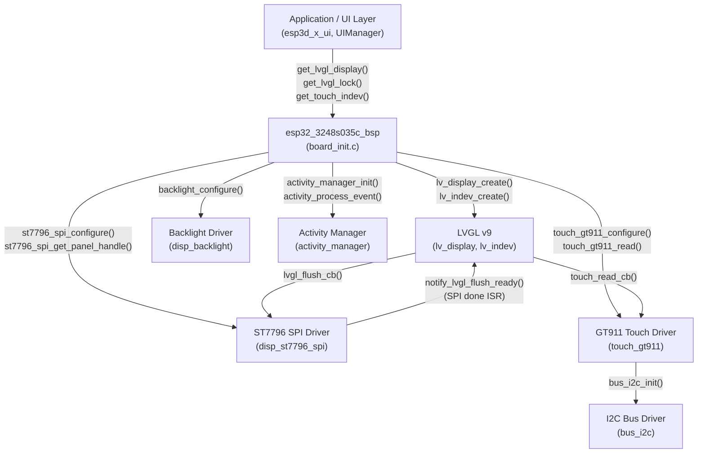
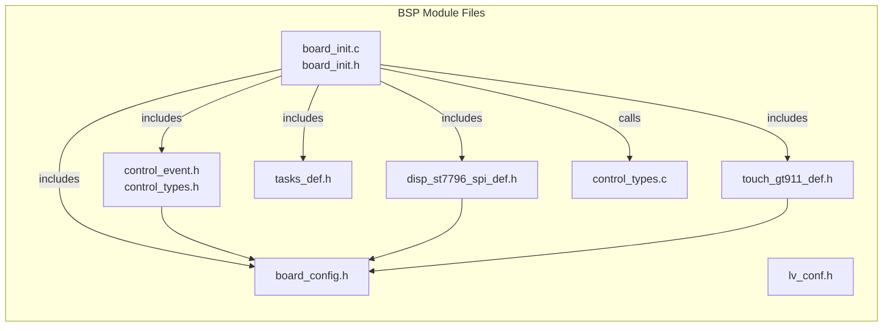
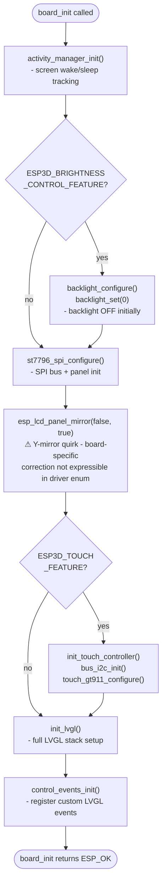
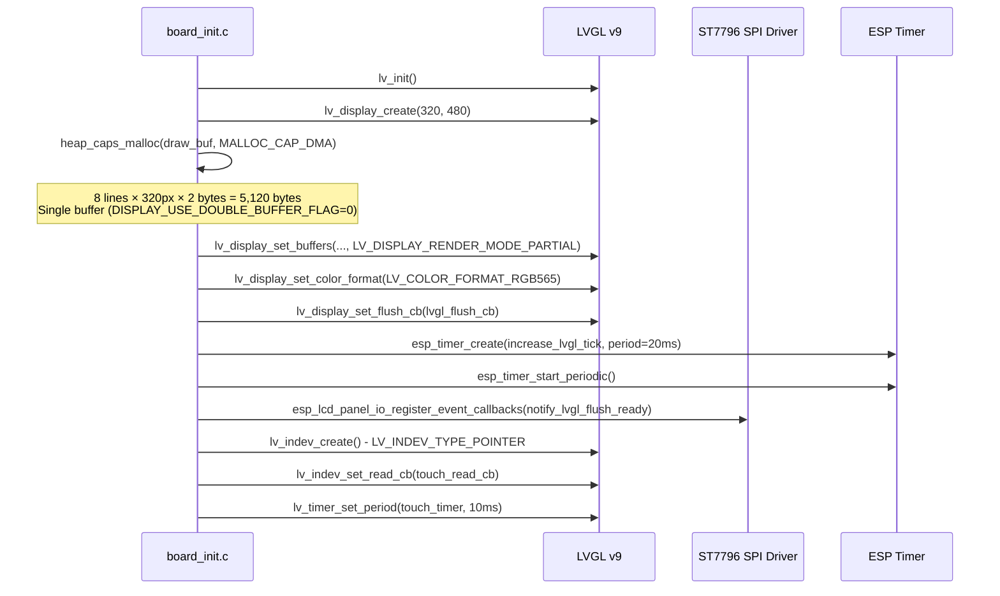
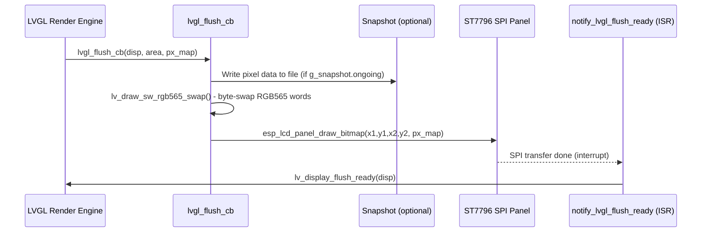
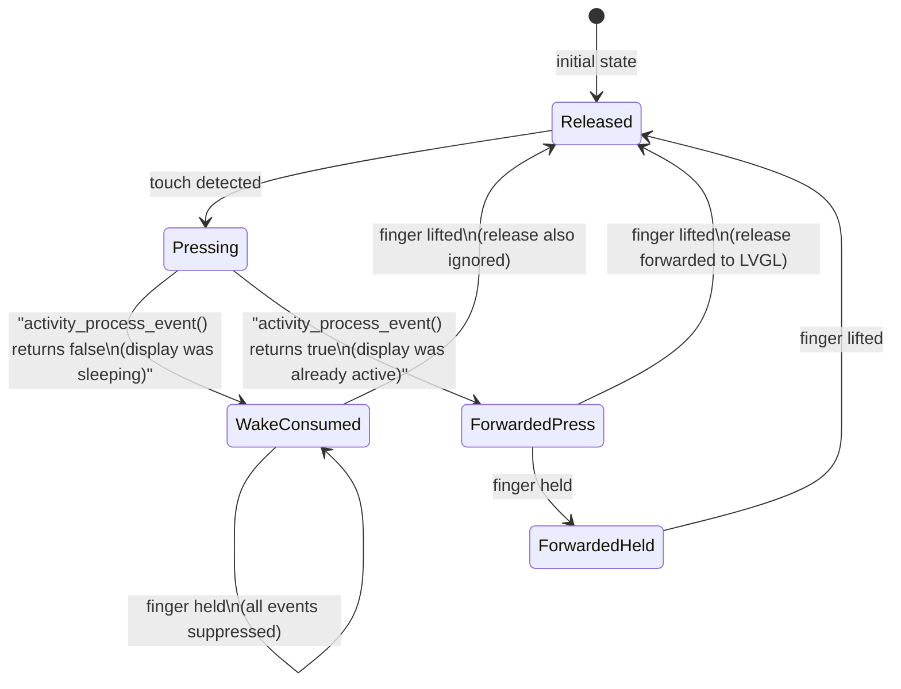
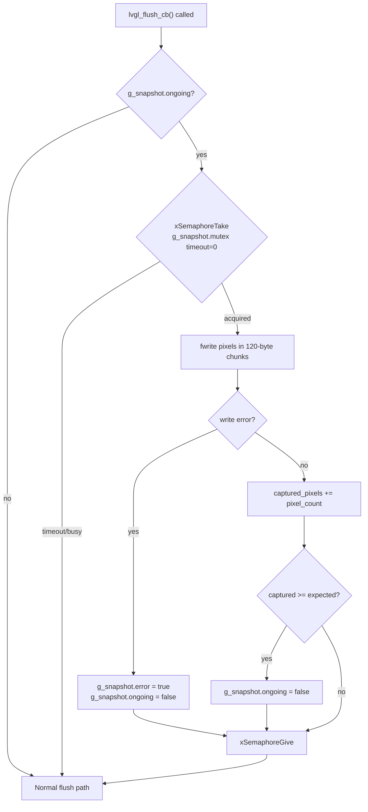
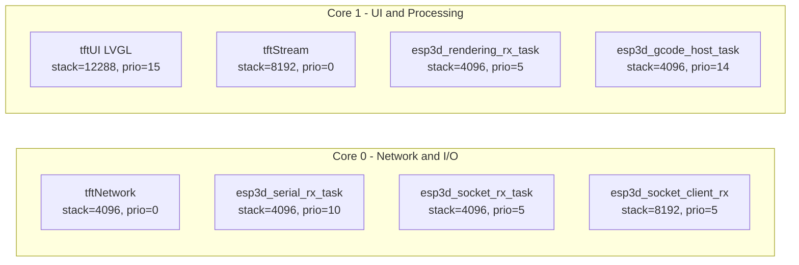
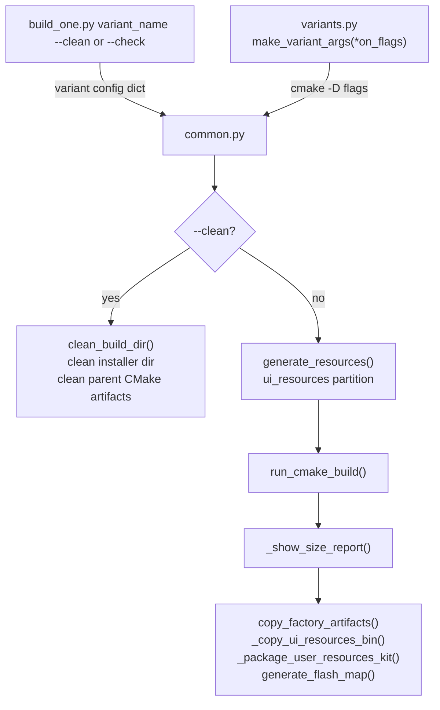

# ESP32-3248S035C Board Support Package (BSP)

The `esp32_3248s035c_bsp` module is the hardware abstraction layer for the **ESP32-3248S035C** development board — a 3.5-inch, 320×480 portrait-orientation touch display board built around the original ESP32 SoC. The "C" suffix denotes **capacitive touch** (GT911 controller), distinguishing it from the resistive-touch sibling [`esp32_3248s035r_bsp`](esp32_3248s035r_bsp.md).

The BSP's single responsibility is to bring up all hardware peripherals and hand off a ready-to-use LVGL display + input device stack to the application layer ([UI Framework](ui_core.md)).

---

## Table of Contents

1. [Hardware Overview](#1-hardware-overview)
2. [Module Architecture](#2-module-architecture)
3. [File Structure](#3-file-structure)
4. [Public API](#4-public-api)
5. [Initialization Flow](#5-initialization-flow)
6. [LVGL Integration](#6-lvgl-integration)
7. [Touch System & Wake-up Logic](#7-touch-system--wake-up-logic)
8. [Custom Control Events](#8-custom-control-events)
9. [Snapshot Feature](#9-snapshot-feature)
10. [FreeRTOS Task Layout](#10-freertos-task-layout)
11. [Build System](#11-build-system)
12. [Differences from Related BSPs](#12-differences-from-related-bsps)

---

## 1. Hardware Overview

| Category | Component | Details |
|---|---|---|
| **SoC** | ESP32 | Original Xtensa LX6 dual-core, 240 MHz |
| **Display** | ST7796 | 3.5″, 320×480, SPI (SPI2\_HOST / HSPI), 40 MHz |
| **Touch** | GT911 | Capacitive multi-touch, I2C (400 kHz) |
| **SD Card** | Micro-SD | SPI (SPI3\_HOST / VSPI), 20 MHz — own bus |
| **UART** | UART0 | TX=GPIO1, RX=GPIO3 (shared with console), 115200 bps |
| **Backlight** | GPIO27 | Active-HIGH, plain on/off (no PWM dimming) |
| **Buzzer** | — | Not populated (`GPIO_NC`) |
| **Encoder** | — | Not physical — emulated via touch |
| **Buttons** | — | Not physical — emulated via touch footer zone |
| **Switch** | — | Not physical — emulated |
| **Potentiometer** | — | Not physical — emulated |

### Pin Map

#### Display (ST7796, SPI2\_HOST)

| Signal | GPIO |
|---|---|
| CS | GPIO15 |
| DC | GPIO2 |
| MOSI | GPIO13 |
| CLK | GPIO14 |
| MISO | GPIO12 |
| RST | NC (not connected) |
| Backlight | GPIO27 |

#### Touch Controller (GT911, I2C\_NUM\_0)

| Signal | GPIO |
|---|---|
| SDA | GPIO33 |
| SCL | GPIO32 |
| RST | GPIO25 |
| IRQ | NC (default) / GPIO21 (with `HARDWARE_MOD_GT911_INT`) |

I2C addresses probed in order: `0x5D`, `0x14`.

#### SD Card (SPI3\_HOST)

| Signal | GPIO |
|---|---|
| MISO | GPIO19 |
| MOSI | GPIO23 |
| CLK | GPIO18 |
| CS | GPIO5 |
| CD | NC |

---

## 2. Module Architecture



### Component Relationships



---

## 3. File Structure

```
boards/esp32_3248s035c/
├── components/
│   └── bsp/
│       ├── board_init.c           # All hardware initialization logic
│       ├── board_init.h           # Public BSP API
│       ├── board_config.h         # GPIO pins, frequencies, display dimensions
│       ├── control_event.h        # control_event_t struct definition
│       ├── control_types.h        # control_family_t enum + custom event declarations
│       ├── control_types.c        # Custom LVGL event registration
│       ├── disp_st7796_spi_def.h  # ST7796 default config instance
│       ├── touch_gt911_def.h      # GT911 default config instance
│       ├── disp_backlight_def.h   # Backlight config instance
│       ├── tasks_def.h            # FreeRTOS task parameters
│       ├── lv_conf.h              # LVGL build configuration
│       ├── sd_def.h               # SD card config instance
│       └── serial_def.h           # UART config instance
└── build_scripts/
    ├── build_one.py               # Entry point: build/check a named variant
    ├── common.py                  # build_variant() / check_variant() logic
    └── variants.py                # make_variant_args() — cmake flag sets
```

---

## 4. Public API

Declared in `board_init.h` and consumed by [`esp3d_x_ui`](ui_core.md) (the LVGL task host).

```c
/* Board lifecycle */
esp_err_t   board_init(void);         // Initialize all hardware; called once at startup
const char* board_get_name(void);     // Returns "ESP32-3248S035C"
const char* board_get_version(void);  // Returns "v1.0"

/* LVGL access — valid after board_init() succeeds */
lv_display_t* get_lvgl_display(void); // LVGL display handle
_lock_t*      get_lvgl_lock(void);    // Mutex for thread-safe LVGL API calls
lv_indev_t*   get_touch_indev(void);  // Touch input device handle
                                       //   (only when ESP3D_TOUCH_FEATURE=1)
```

> **Thread safety**: LVGL itself is single-threaded (Core 1). The `get_lvgl_lock()` mutex must be held before calling any `lv_*` API from another task. See [UI Framework](ui_core.md) for the locking pattern.

---

## 5. Initialization Flow

`board_init()` is called once by `ESP3DX::begin()` (see [Core Platform](esp3d_core.md)) before the LVGL task starts.



### Y-Mirror Orientation Quirk

This board requires **mirror-Y only** (raw MADCTL `0x88`) for a correct portrait image. The shared ST7796 SPI driver expresses orientation as a 4-combination enum (swap\_xy × mirror\_x) and cannot represent mirror-Y-alone. Rather than patching the shared driver (which all other boards also use), `board_init()` applies a one-off call immediately after `st7796_spi_configure()`:

```c
esp_lcd_panel_mirror(st7796_spi_get_panel_handle(), false, true);
//                                                  ^mirrorX  ^mirrorY
```

The same quirk exists on [`esp32_3248s035r`](esp32_3248s035r_bsp.md), which is the same physical panel with a different touch controller.

---

## 6. LVGL Integration

### `init_lvgl()` — Detailed Steps



### Display Buffer Configuration

| Parameter | Value |
|---|---|
| Width | 320 px |
| Height | 480 px |
| Color format | RGB565 (16-bit) |
| Buffer mode | Single (no double buffering) |
| Buffer lines | 8 rows |
| Buffer size | 5,120 bytes (DMA-capable heap) |
| Render mode | `LV_DISPLAY_RENDER_MODE_PARTIAL` |
| Color byte swap | Yes (`DISPLAY_SWAP_COLOR_FLAG=1`) |

> **Memory note**: With no PSRAM on this board, the 5,120-byte DMA buffer is allocated from internal DRAM using `MALLOC_CAP_DMA`. This is deliberately small to leave headroom for WiFi and other subsystems. See [Memory Constraints Guide](https://github.com/luc-github/Pibot-cnc-pendant-firmware/blob/main/docs/guides/esp32_memory_constraints.md).

### Flush Data Flow



### LVGL Task Parameters

| Parameter | Value |
|---|---|
| Core | 1 |
| Priority | 15 |
| Stack size | 12,288 bytes |
| Tick period | 20 ms |
| Touch poll period | 10 ms |

---

## 7. Touch System & Wake-up Logic

### Touch Controller: GT911

The GT911 is a capacitive multi-touch controller read over I2C. The BSP reads a single contact point (x, y, is\_pressed) and feeds it to LVGL as a pointer input device.

**Orientation correction** applied at driver level:

| Parameter | Value | Effect |
|---|---|---|
| `swap_xy` | 0 | No axis swap |
| `invert_x` | 1 | Mirror horizontal |
| `invert_y` | 1 | Mirror vertical |

### Wake-up Touch Consumption

`touch_read_cb()` implements a first-touch-consumed pattern to prevent accidental input when waking the display from a screen-off / idle state:



- `activity_process_event()` (from [Activity Manager](esp3d_activity_manager.md)) notifies the system of user activity and returns `true` if the display was already active. When it returns `false`, the touch event is consumed internally and LVGL receives `LV_INDEV_STATE_RELEASED` for the entire press-hold-release cycle.

---

## 8. Custom Control Events

Three custom LVGL event codes are registered at runtime (after `lv_init()`) in `control_events_init()`:

| Event | Variable | Purpose |
|---|---|---|
| Switch pressed | `LV_EVENT_SWITCH_PRESSED` | 4-position switch depression |
| Switch released | `LV_EVENT_SWITCH_RELEASED` | 4-position switch release |
| Potentiometer changed | `LV_EVENT_POTENTIOMETER_CHANGED` | Analog position change |

> On this board, the 4-position switch and potentiometer are not physically present. The events are registered for API compatibility with other BSPs (e.g., [`pibot_pendant_v1_0_bsp`](pibot_pendant_v1_0_bsp.md)) that do have these hardware inputs. The UI screen layer listens to these same events regardless of board.

### `control_event_t` Payload

Passed as the LVGL event user data on `LV_EVENT_SWITCH_*` and `LV_EVENT_POTENTIOMETER_CHANGED`:

```c
typedef struct {
    lv_indev_t       *indev;          // LVGL input device originating the event
    uint32_t          btn_id;         // Button / switch position identifier
    lv_indev_type_t   type;           // LVGL input type (BUTTON, POINTER, etc.)
    control_family_t  family_id;      // Hardware family that fired
    int32_t           steps;          // Encoder delta steps (signed)
    uint32_t          press_duration; // Duration of press in milliseconds
} control_event_t;
```

### `control_family_t` Enum

```c
typedef enum {
    CONTROL_FAMILY_BUTTONS       = 0, // Physical or emulated push buttons
    CONTROL_FAMILY_SWITCH,            // 4-position selector switch
    CONTROL_FAMILY_TOUCH,             // Touchscreen contact (future use)
    CONTROL_FAMILY_ENCODER,           // Rotary encoder
    CONTROL_FAMILY_POTENTIOMETER      // Analog potentiometer
} control_family_t;
```

---

## 9. Snapshot Feature

When `ESP3D_SNAPSHOT_FEATURE=1` is enabled at build time, `lvgl_flush_cb()` intercepts each partial frame flush and writes raw pixel data to a file, progressively capturing a full-screen screenshot.



**Key implementation details**:
- Pixels are written in 120-byte chunks to avoid deep stack usage inside the flush callback.
- The mutex is taken with `timeout=0` (non-blocking); a flush tile that cannot acquire the mutex skips snapshot writing without blocking LVGL.
- `g_snapshot.expected_pixels` equals `display_width × display_height`; capture completes when `captured_pixels` reaches this value.
- This feature is shared across multiple boards; see also [`esp32_3248s035r_bsp`](esp32_3248s035r_bsp.md) and [`pibot_pendant_v1_0_bsp`](pibot_pendant_v1_0_bsp.md).

---

## 10. FreeRTOS Task Layout

All task parameters for this board are defined in `tasks_def.h`.



> **Critical constraint**: LVGL runs exclusively on Core 1 at priority 15. No other Core 1 task should block the LVGL task or call `lv_*` APIs without holding `get_lvgl_lock()`. See [UI Framework Architecture](https://github.com/luc-github/Pibot-cnc-pendant-firmware/blob/main/docs/architecture/screens_architecture.md).

---

## 11. Build System

The build scripts in `boards/esp32_3248s035c/build_scripts/` automate multi-variant firmware builds using the ESP-IDF CMake toolchain.



- **`make_variant_args(*on_flags)`** starts from `DEFAULT_OFF_CMAKE_ARGS` (all features off) and enables only the specified flags — ensuring clean, reproducible builds with no accidental feature leakage between variants.
- **`build_variant()`** also handles the Factory sub-project (whose `cwd` differs from `REPO_ROOT`) and cleans stale CMake artifacts from parent build directories on `--clean`.
- **`check_variant()`** runs `run_cmake_check()` only (no binary output), used for CI configuration validation.

---

## 12. Differences from Related BSPs

| Feature | `esp32_3248s035c` (this) | [`esp32_3248s035r`](esp32_3248s035r_bsp.md) | [`pibot_pendant_v1_0`](pibot_pendant_v1_0_bsp.md) |
|---|---|---|---|
| Touch type | Capacitive GT911 (I2C) | Resistive XPT2046 (SPI) | Capacitive (ILI9341 panel) |
| Touch calibration | Not needed (auto-detect) | `touch_calibrate()` required | Not needed |
| Display driver | ST7796 SPI | ST7796 SPI | ILI9341 SPI |
| Physical buttons | None — emulated | None — emulated | Yes — `button_read_cb()` |
| Physical encoder | None — emulated | None — emulated | Yes — `encoder_read_cb()` |
| Physical switch | None — emulated | None — emulated | Yes — `switch_read_cb()` |
| Potentiometer | None — emulated | None — emulated | Yes — `potentiometer_read_cb()` |
| Double buffer | No | No | No |
| Flush notify | SPI IO event callback | SPI IO event callback | SPI IO event callback |
| Y-mirror quirk | Yes — manual `panel_mirror` | Yes — same quirk, same fix | No |
| LVGL task stack | 12,288 bytes | 12,288 bytes | 12,288 bytes |

### vs `esp32_3248s035r`

Both boards share the same ST7796 panel and the same Y-mirror orientation quirk. The key implementation difference is the touch subsystem: the resistive XPT2046 requires SPI-based register reads and a software calibration step (`touch_calibrate()`), while the capacitive GT911 auto-detects its resolution over I2C and needs no calibration.

### vs `pibot_pendant_v1_0`

The PiBot Pendant v1.0 BSP has a richer `board_init()` that registers real hardware callbacks for five distinct input families (`button_read_cb`, `encoder_read_cb`, `potentiometer_read_cb`, `switch_read_cb`, `touch_read_cb`). The ESP32-3248S035C BSP only registers `touch_read_cb`; the other families are available through the custom LVGL event system but have no physical backing on this board.

---

## Related Documentation

- [Display Drivers Architecture](https://github.com/luc-github/Pibot-cnc-pendant-firmware/blob/main/docs/architecture/display_drivers.md) — SPI panel-controller driver details, orientation/rotation math
- [UI Framework & Screens](https://github.com/luc-github/Pibot-cnc-pendant-firmware/blob/main/docs/architecture/screens_architecture.md) — LVGL screen system consuming this BSP
- [Screen Transitions Flow](https://github.com/luc-github/Pibot-cnc-pendant-firmware/blob/main/docs/architecture/screen_transitions_flow.md) — Timer-safe transition patterns
- [Activity Manager](esp3d_activity_manager.md) — Screen wake/sleep used by `touch_read_cb`
- [ESP32 Memory Constraints](https://github.com/luc-github/Pibot-cnc-pendant-firmware/blob/main/docs/guides/esp32_memory_constraints.md) — Heap budget, DMA buffer sizing
- [UI Resources Guide](https://github.com/luc-github/Pibot-cnc-pendant-firmware/blob/main/docs/guides/ui_resources_guide.md) — Icon/font assets for the `res_480_320` resource set used by this board
- [Factory App](esp32_3248s035c_factory.md) — Factory test firmware for this board
- [Build Scripts](esp32_3248s035c_build_scripts.md) — Variant build automation details
