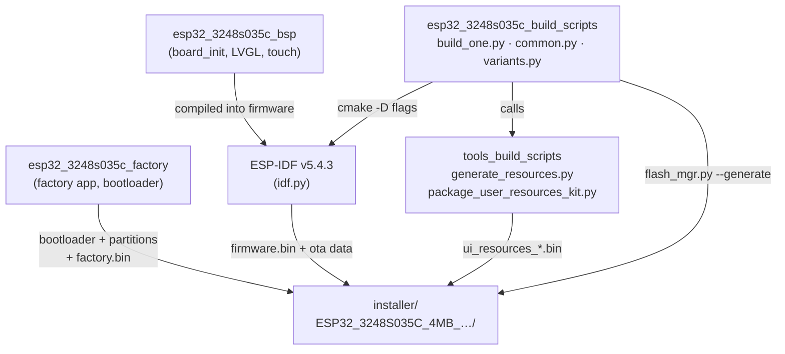
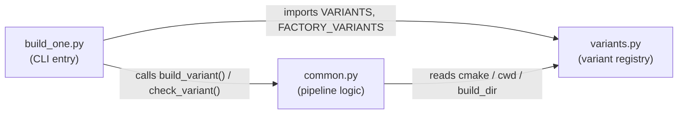
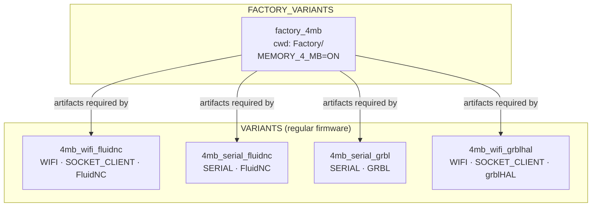
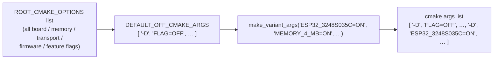
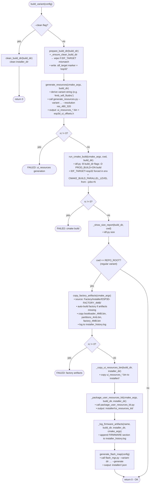
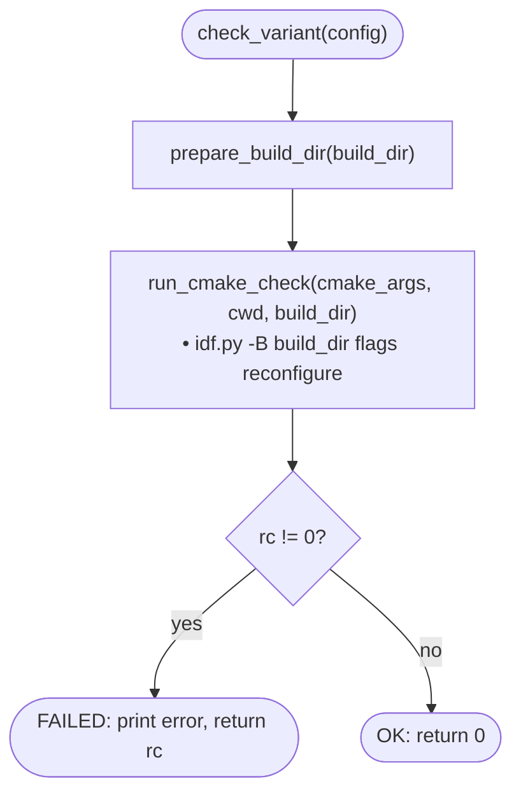
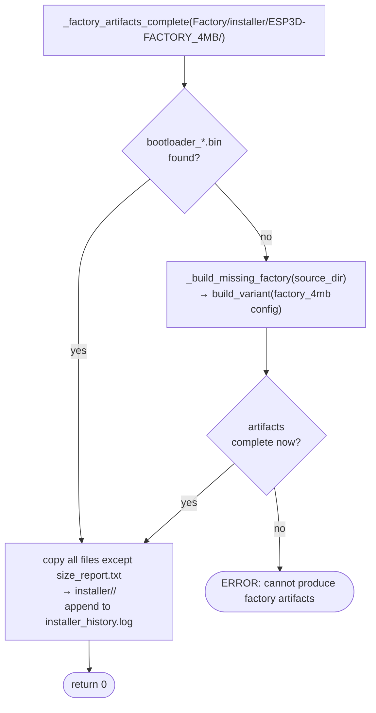
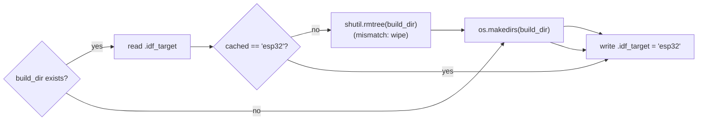
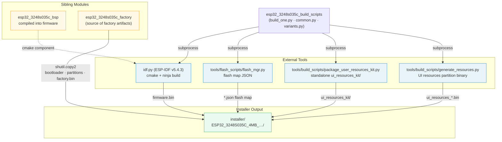

# esp32\_3248s035c\_build\_scripts

Build automation scripts for the **ESP32-3248S035C** board (ESP32, 4 MB flash, 480 × 320 ST7796 SPI display with capacitive GT911 touch). These three Python scripts define every named firmware *variant* for this board and orchestrate the complete build pipeline: UI-resource generation, ESP-IDF compilation, factory-artifact injection, installer assembly, and flash-map generation.

---

## Table of Contents

1. [Module Position](#1-module-position)
2. [File Overview](#2-file-overview)
3. [Variant System](#3-variant-system)
4. [Build Pipeline](#4-build-pipeline)
5. [Directory & Path Conventions](#5-directory--path-conventions)
6. [Component Reference](#6-component-reference)
   - 6.1 [variants.py](#61-variantspy)
   - 6.2 [common.py](#62-commonpy)
   - 6.3 [build\_one.py](#63-build_onepy)
7. [Environment & Prerequisites](#7-environment--prerequisites)
8. [Usage](#8-usage)
9. [Cross-Module Dependencies](#9-cross-module-dependencies)

---

## 1. Module Position

This module is one of three sibling sub-modules that together form the complete `esp32_3248s035c` board package. The other two siblings are documented separately:

- **[esp32\_3248s035c\_factory](esp32_3248s035c_factory.md)** — the Factory app sources whose build output this module copies into every regular variant's installer directory.
- **[esp32\_3248s035c\_bsp](esp32_3248s035c_bsp.md)** — the Board Support Package compiled into every firmware variant.

The build scripts also invoke utilities from **[tools\_build\_scripts](tools_build_scripts.md)** for UI resource generation and installer kit packaging.



---

## 2. File Overview

| File | Role |
|------|------|
| `variants.py` | Declares every named build variant as a Python dict with cmake flags, working directory, and build directory. Single source of truth for *what* can be built. |
| `common.py` | Implements the full build pipeline — cleaning, cmake invocation, resource generation, factory artifact injection, installer assembly, and flash-map generation. |
| `build_one.py` | Thin CLI entry-point. Parses the variant name from `sys.argv`, then delegates to `check_variant()` or `build_variant()` in `common.py`. |



---

## 3. Variant System

### 3.1 Design Principle

Every variant is a plain Python `dict` with four keys:

| Key | Type | Description |
|-----|------|-------------|
| `name` | `str` | Human-readable identifier, also used as the build-directory suffix |
| `cmake` | `list[str]` | Ordered list of `-D KEY=VALUE` arguments passed verbatim to `idf.py` |
| `cwd` | `str` | Working directory for `idf.py` (`REPO_ROOT` for regular variants, `FACTORY_DIR` for the factory variant) |
| `build_dir` | `str` | Absolute path to the build artifact directory |

### 3.2 Variant Registry (`VARIANTS` + `FACTORY_VARIANTS`)



#### Feature matrix

| Variant | Memory | Transport | Firmware | MDNS | Socket Client | WebUI |
|---------|--------|-----------|----------|------|---------------|-------|
| `4mb_wifi_fluidnc` | 4 MB | WiFi + Serial | FluidNC | ✓ | ✓ | — |
| `4mb_serial_fluidnc` | 4 MB | Serial | FluidNC | — | — | — |
| `4mb_serial_grbl` | 4 MB | Serial | GRBL | — | — | — |
| `4mb_wifi_grblhal` | 4 MB | WiFi + Serial | grblHAL | ✓ | ✓ | — |
| `factory_4mb` *(special)* | 4 MB | — | Factory App | — | — | — |

> **Note:** `SOCKET_CLIENT_SERVICE=ON` is used for WiFi CNC control (TCP socket to the machine). `WEBUI_SERVER` and `WS_SERVER_SERVICE` are intentionally OFF — the WiFi radio is dedicated to the CNC link. See the [feature resource matrix](https://github.com/luc-github/Pibot-cnc-pendant-firmware/blob/main/docs/features/feature_resource_matrix.md) for the rationale.

### 3.3 `make_variant_args()` — Flag Generation

`make_variant_args()` starts by setting **every** known cmake option to `OFF` (`DEFAULT_OFF_CMAKE_ARGS`), then selectively overrides specific flags to `ON`. This prevents stale cmake cache values from a previous build with a different profile from leaking into the current one.

```python
# Example output fragment:
make_variant_args("ESP32_3248S035C=ON", "MEMORY_4_MB=ON", "WIFI_SERVICE=ON")
# → [ '-D', 'ESP32_PIBOT_CNC_PENDANT_V1=OFF', …, '-D', 'ESP32_3248S035C=OFF', …,
#      '-D', 'ESP32_3248S035C=ON', '-D', 'MEMORY_4_MB=ON', '-D', 'WIFI_SERVICE=ON' ]
```



The final list is appended to the `idf.py` command line so later `-D` entries override earlier ones for the flags being enabled.

---

## 4. Build Pipeline

### 4.1 `build_variant()` — Full Build



### 4.2 `check_variant()` — Config Validation Only

A lightweight path that runs `idf.py reconfigure` (cmake configuration pass only, no compilation) to validate the cmake flags without producing any binaries.



### 4.3 Factory Artifact Auto-Bootstrap

Regular variants depend on bootloader and partition-table binaries compiled by the factory variant. `copy_factory_artifacts()` implements a self-healing dependency:



### 4.4 IDF_TARGET Guard

To prevent stale build directories from a different chip target (e.g., an ESP32-S3 build) causing silent miscompilation, `prepare_build_dir()` writes a `.idf_target` marker file and wipes the directory if the cached target does not match `"esp32"`.



---

## 5. Directory & Path Conventions

```
<REPO_ROOT>/
├── build/
│   └── esp32_3248s035c_<variant>/          ← idf.py build artifacts (.elf, .bin, .map, …)
│       ├── .idf_target                     ← IDF_TARGET guard marker ("esp32")
│       ├── ui_resources_<variant>.bin      ← generated by generate_resources.py
│       ├── ui_resources_manifest_<v>.json  ← manifest used by kit packager
│       └── esp3d_ui_offsets.h              ← generated offsets header
│
├── installer/
│   └── ESP32_3248S035C_4MB_<radio>_<fw>/  ← assembled installer directory
│       ├── bootloader_4MB.bin             ← from Factory (factory_4mb variant)
│       ├── partitions_4mb.bin             ← from Factory
│       ├── factory_4MB.bin                ← from Factory
│       ├── firmware.bin                   ← main pendant firmware
│       ├── ota_data_initial.bin           ← OTA partition initial state
│       ├── ui_resources_<variant>.bin     ← UI resources partition
│       ├── ui_resources_kit/              ← standalone customization kit
│       │   └── …                          ← see tools_build_scripts
│       ├── ESP32_3248S035C_4MB_….json     ← flash map (flash_mgr output)
│       └── installer_history.log          ← append-only audit log
│
└── boards/esp32_3248s035c/
    ├── build_scripts/
    │   ├── build_one.py
    │   ├── common.py
    │   └── variants.py
    ├── Factory/
    │   ├── build/factory_4mb/             ← factory app build artifacts
    │   └── installer/
    │       └── ESP3D-FACTORY_4MB/         ← factory installer output (source for copy)
    ├── resources/                         ← (optional) board-specific UI overrides
    ├── partitions_4mb.csv
    └── flash_params.json                  ← (optional) board flash parameters for flash_mgr
```

### Installer Directory Naming

`build_config_name()` derives the installer subdirectory name from the cmake flags:

```
ESP32_3248S035C_<memory>_<radio>_<firmware>

Examples:
  ESP32_3248S035C_4MB_wifi_fluidnc
  ESP32_3248S035C_4MB_serial_grbl
  ESP32_3248S035C_4MB_wifi_grblhal
```

For the factory variant (`cwd == FACTORY_DIR`), the fixed name `ESP3D-FACTORY_4MB` is used instead.

---

## 6. Component Reference

### 6.1 `variants.py`

#### `make_variant_args(*on_flags) → list[str]`

Generates the cmake argument list for a variant. Starts from `DEFAULT_OFF_CMAKE_ARGS` (all flags in `ROOT_CMAKE_OPTIONS` set to `OFF`) and appends each item in `on_flags` as `-D <flag>` to override it to `ON`.

#### `ROOT_CMAKE_OPTIONS`

Master list of every toggleable cmake option across the whole project, grouped by category:

| Category | Examples |
|----------|---------|
| Board selection | `ESP32_3248S035C`, `ESP32_3248S035R`, `ESP32S3_4827S043C`, … |
| Memory | `MEMORY_4_MB`, `MEMORY_8_MB`, `MEMORY_16_MB` |
| PSRAM | `PSRAM_NONE`, `PSRAM_2_MB`, `PSRAM_4_MB`, `PSRAM_8_MB` |
| Firmware target | `TARGET_FW_FLUIDNC`, `TARGET_FW_GRBLHAL`, `TARGET_FW_GRBL`, … |
| Transports | `SERIAL_SERVICE`, `WIFI_SERVICE`, `BT_SERVICE`, `BT_SERIAL_SERVICE`, … |
| Features | `TFT_UI_SERVICE`, `SD_CARD_SERVICE`, `MDNS_SERVICE`, `SOCKET_CLIENT_SERVICE`, … |

#### `VARIANTS`

| Key | `cwd` | `build_dir` |
|-----|-------|-------------|
| `4mb_wifi_fluidnc` | `REPO_ROOT` | `build/esp32_3248s035c_4mb_wifi_fluidnc` |
| `4mb_serial_fluidnc` | `REPO_ROOT` | `build/esp32_3248s035c_4mb_serial_fluidnc` |
| `4mb_serial_grbl` | `REPO_ROOT` | `build/esp32_3248s035c_4mb_serial_grbl` |
| `4mb_wifi_grblhal` | `REPO_ROOT` | `build/esp32_3248s035c_4mb_wifi_grblhal` |

#### `FACTORY_VARIANTS`

| Key | `cwd` | `build_dir` |
|-----|-------|-------------|
| `factory_4mb` | `boards/esp32_3248s035c/Factory` | `Factory/build/factory_4mb` |

---

### 6.2 `common.py`

#### Constants

| Name | Value / Source |
|------|---------------|
| `BOARD_ROOT` | `boards/esp32_3248s035c/` |
| `REPO_ROOT` | Two levels above `build_scripts/` |
| `IDF_PATH` | `$IDF_PATH` env var, default `C:\Users\luc\esp\v5.4.3\esp-idf` |
| `IDF_PY` | `$IDF_PATH/tools/idf.py` |
| `RESOLUTION` | `"res_480_320"` (hardcoded for this board) |
| `EXPECTED_IDF_TARGET` | `"esp32"` |
| `GENERATE_RESOURCES` | `tools/build_scripts/generate_resources.py` |
| `PACKAGE_USER_KIT` | `tools/build_scripts/package_user_resources_kit.py` |

#### Public Functions

| Function | Signature | Purpose |
|----------|-----------|---------|
| `build_variant` | `(config: dict) → int` | Execute the full build pipeline for one variant |
| `check_variant` | `(config: dict) → int` | Run cmake reconfigure only (no compilation) |
| `installer_dir_for` | `(config: dict) → str \| None` | Compute the installer output directory path |
| `generate_flash_map` | `(config: dict)` | Invoke `flash_mgr.py --generate` after a successful build |

#### Internal Functions

| Function | Purpose |
|----------|---------|
| `parse_cmake_flags(cmake_args)` | Parse `-D KEY=VALUE` pairs from the cmake args list into a `dict` |
| `build_config_name(cmake_args)` | Derive the human-readable config name (used as installer dir name) |
| `resource_variant_string(cmake_args)` | Derive the `generate_resources.py` `--variant` string (e.g. `"4mb_wifi_fluidnc"`); returns `None` for factory variants |
| `generate_resources(cmake_args, build_dir)` | Call `generate_resources.py`; skip silently if no resource variant |
| `copy_factory_artifacts(cmake_args)` | Copy factory binaries into the installer dir; auto-build factory if missing |
| `_factory_artifacts_complete(source_dir)` | Returns `True` only if `source_dir` contains at least one `bootloader_*.bin` |
| `_build_missing_factory(source_dir)` | Identify and build the matching factory variant by comparing installer dirs |
| `prepare_build_dir(build_dir)` | Create build dir and write `.idf_target`; wipe first if target mismatch |
| `_ensure_clean_build_dir(build_dir)` | Wipe build dir if `.idf_target` marker does not match `EXPECTED_IDF_TARGET` |
| `run_cmake_build(cmake_args, cwd, build_dir)` | Execute `idf.py … build` with `IDF_TARGET=esp32` forced in env |
| `run_cmake_check(cmake_args, cwd, build_dir)` | Execute `idf.py … reconfigure` |
| `clean_build_dir(build_dir)` | `shutil.rmtree` with existence check |
| `_show_size_report(build_dir, cwd)` | Run `idf.py size` (informational, non-fatal) |
| `_copy_ui_resources_bin(build_dir, installer_dir)` | Copy `ui_resources_*.bin` from build dir to installer dir |
| `_package_user_resources_kit(cmake_args, build_dir, installer_dir)` | Call `package_user_resources_kit.py`; failures are non-fatal (WARN) |
| `_log_firmware_artifacts(variant_name, build_dir, installer_dir, cmake_args)` | Append a `FIRMWARE` section to `installer_history.log` |
| `ensure_idf_py()` | Abort with a clear error if `IDF_PY` path does not exist |
| `_get_jobs_env_value()` | Extract `--jobs=N` from `sys.argv` for use as `CMAKE_BUILD_PARALLEL_LEVEL` |

---

### 6.3 `build_one.py`

#### `main()`

```
Usage:  python build_one.py <variant_name> [--clean] [--check]

Flags:
  --clean   Wipe build_dir and installer_dir, then exit (no compilation)
  --check   Run cmake reconfigure only (no compilation)
  (none)    Full build pipeline

Exit codes:
  0   Success (or --clean completed)
  1   Unknown variant or missing argument
  N   Propagated subprocess exit code from idf.py / cmake
```

The merged registry (`{**FACTORY_VARIANTS, **VARIANTS}`) means `factory_4mb` and all regular variants are accessible from the same CLI without distinguishing between the two dicts.

---

## 7. Environment & Prerequisites

| Requirement | Details |
|------------|---------|
| ESP-IDF | v5.4.3, activated in the current shell (`idf.py` on PATH or `IDF_PATH` set) |
| Python | 3.x (scripts re-invoke themselves via `sys.executable`) |
| `IDF_PATH` | Must point to the ESP-IDF root; fallback default is `C:\Users\luc\esp\v5.4.3\esp-idf` |
| Board IDF target | `esp32` (enforced via `IDF_TARGET` env var and `.idf_target` marker) |
| `tools/build_scripts/generate_resources.py` | Required for UI resource partition generation |
| `tools/build_scripts/package_user_resources_kit.py` | Required for kit packaging (non-fatal if it fails) |
| `tools/flash_scripts/flash_mgr.py` | Required for flash map JSON generation (called after build) |

> **Parallel builds:** Pass `--jobs=N` through `build_mgr.py`. The value is forwarded as `CMAKE_BUILD_PARALLEL_LEVEL` in the environment; `idf.py` does not accept `-j` directly.

> **Production vs. development builds:** By default (when `--dev` is absent) the cmake flag `-D PROD_BUILD=ON` is injected automatically. Pass `--dev` on the command line to suppress it.

---

## 8. Usage

### Build a single variant

```bash
# From the repo root, with ESP-IDF activated:
python boards/esp32_3248s035c/build_scripts/build_one.py 4mb_wifi_fluidnc
python boards/esp32_3248s035c/build_scripts/build_one.py 4mb_serial_grbl
python boards/esp32_3248s035c/build_scripts/build_one.py factory_4mb
```

### Clean a variant's build and installer directories

```bash
python boards/esp32_3248s035c/build_scripts/build_one.py 4mb_wifi_fluidnc --clean
```

### Validate cmake configuration without compiling

```bash
python boards/esp32_3248s035c/build_scripts/build_one.py 4mb_serial_grbl --check
```

### List all available variants

```bash
python boards/esp32_3248s035c/build_scripts/build_one.py
# Prints: Available variants: factory_4mb, 4mb_wifi_fluidnc, …
```

### Build all variants via build\_mgr

The top-level `tools/build_scripts/build_mgr.py` orchestrates multi-board, multi-variant builds and forwards `--jobs=N` for parallelism. See [tools\_build\_scripts](tools_build_scripts.md) for details.

---

## 9. Cross-Module Dependencies



### Dependency summary

| Dependency | Direction | Nature |
|-----------|-----------|--------|
| [esp32\_3248s035c\_factory](esp32_3248s035c_factory.md) | Consumes build output | `shutil.copy2` of `bootloader_4MB.bin`, `partitions_4mb.bin`, `factory_4MB.bin` from `Factory/installer/ESP3D-FACTORY_4MB/` |
| [esp32\_3248s035c\_bsp](esp32_3248s035c_bsp.md) | Compiled into firmware | ESP-IDF cmake component — no direct Python dependency |
| [tools\_build\_scripts](tools_build_scripts.md) — `generate_resources.py` | Subprocess call | Produces `ui_resources_*.bin` and `esp3d_ui_offsets.h` for the display partition |
| [tools\_build\_scripts](tools_build_scripts.md) — `package_user_resources_kit.py` | Subprocess call (non-fatal) | Assembles the standalone user customisation kit |
| `tools/flash_scripts/flash_mgr.py` | Subprocess call | Generates the per-variant flash map JSON consumed by the web installer |
| [pibot\_pendant\_v1\_0\_build\_scripts](pibot_pendant_v1_0_build_scripts.md) | Structural peer | Identical three-file pattern; useful reference for contrast on a different board |
