# esp32_3248s035c — Factory Recovery Application

## Introduction

The `esp32_3248s035c_factory` module is the **standalone recovery firmware** for the ESP32-3248S035C board — a 320×480 capacitive-touch TFT panel. It lives entirely inside `boards/esp32_3248s035c/Factory/` and is compiled as a separate ESP-IDF project, completely independent of the main pendant firmware.

Unlike boards with physical recovery buttons (e.g. `pibot_pendant_v1_0`), the ESP32-3248S035C has **no physical buttons wired at GPIO level** (`BUTTON_n_PIN = GPIO_NUM_NC`). Recovery is entered exclusively via the **`[ESP444]FACTORY` software command** from the main firmware, which backs up OTA data and switches the boot partition. The factory app then restores that backup on startup before presenting the touch-navigated menu.

**Key responsibilities:**
- Restore OTA partition data written by the main firmware before entry
- Present a touch-navigated recovery menu on the ST7796 display
- Flash firmware updates from SD card (`esp3dfw.bin` → `app0` / `app1`)
- Flash UI resource updates from SD card (`ui_resources.bin` → `ui_resources`)
- Reboot into the selected OTA partition on demand

---

## Hardware Profile

| Feature | Detail |
|---|---|
| SoC | ESP32 (single-core PCNT, no PSRAM) |
| Display | ST7796 SPI TFT — 320 × 480 px, portrait |
| Touch | GT911 capacitive (I2C) — coordinates pre-calibrated by IC |
| Physical buttons | **None** — `BUTTON_1/2/3_PIN = GPIO_NUM_NC` |
| Rotary encoder | **None** — `ENCODER_A/B_PIN = GPIO_NUM_NC` |
| Buzzer | **None** — `BUZZER_PIN = GPIO_NUM_NC` |
| SD card | SPI (separate host from display SPI) |
| Font | Bitmap 11 × 21 px (`font11x21`) |
| Custom bootloader | **No** — boot entry is software-only via `[ESP444]` |

> **Peripheral stub pattern:** The buttons, encoder, and buzzer drivers are initialized and polled in `app_main` exactly as on boards that _do_ have those parts. Each driver guards against `GPIO_NUM_NC` and becomes a safe no-op. This lets the Factory source tree stay identical across board variants with minimal `#ifdef` overhead.

---

## Architecture Overview

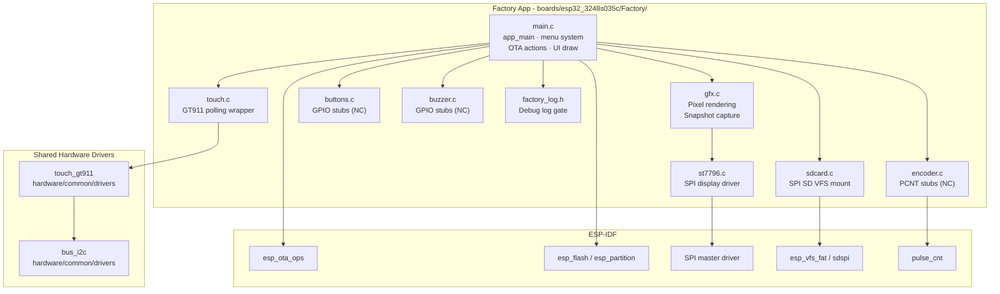

---

## Component Relationships

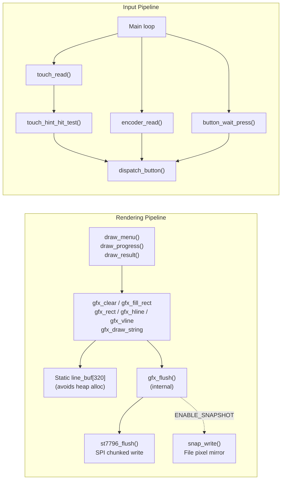

---

## Startup & Initialization Sequence

The `app_main` function follows a strict ordering. OTA data must be restored **before** any display or peripheral initialization to guarantee correct partition state even if the device is power-cycled during the recovery session.

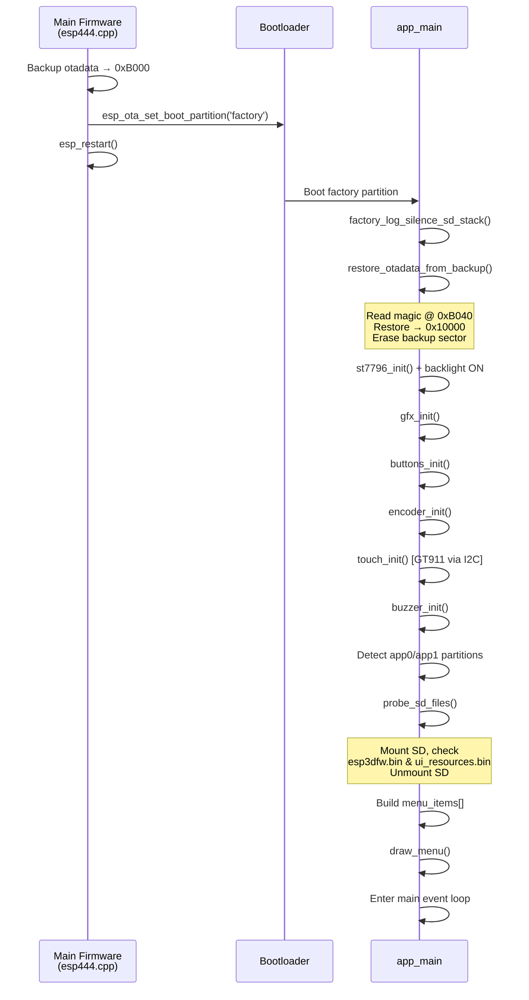

---

## OTA Backup / Restore Mechanism

This mechanism ensures the board can return to the correct OTA application even after power loss during recovery. The main firmware writes the backup; the factory app reads and restores it.

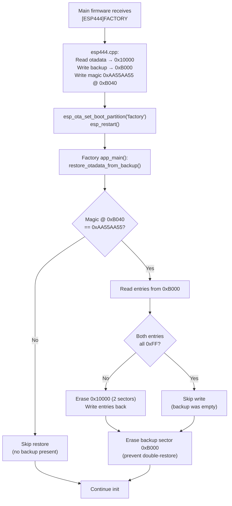

> **Flash address constraints (do not change without recalculating):**
>
> | Symbol | Value | Role |
> |---|---|---|
> | `OTADATA_BACKUP_OFFSET` | `0xB000` | Where backup is stored |
> | `OTADATA_OFFSET` | `0x10000` | Real OTA data location |
> | `BACKUP_MAGIC_OFFSET` | `0x40` | Magic word offset within backup sector |
> | `BACKUP_MAGIC` | `0xAA55AA55` | Sentinel to detect valid backup |
>
> The backup sector sits between bootloader end and the partition table (`0xC000`). The factory `sdkconfig` must set `CONFIG_SPI_FLASH_DANGEROUS_WRITE_ALLOWED=y` because erasing below the first partition is normally blocked by ESP-IDF. These values must match `esp444.cpp` in the main firmware exactly.

---

## Menu System

### Structure

The menu is a simple indexed list of `menu_item_t` entries, built dynamically at startup based on detected partitions and SD content.

```c
typedef struct {
    const char *label;     // display text
    menu_action_t action;  // enum: BOOT_APP0 | BOOT_APP1 | SD_UPDATE_APP0 | ...
    uint16_t color;        // RGB565 text color (when not selected)
} menu_item_t;
```

### Items Built at Runtime

| Condition | Item added |
|---|---|
| Always | `Boot app0` |
| `app1` partition exists | `Boot app1` |
| Always | `SD -> app0` |
| `app1` partition exists | `SD -> app1` |
| Always | `SD -> resources` |

### Screen Layout (320 × 480 px)

```
┌──────────────────────────────┐  ← y=0
│  Recovery v1.x.x             │  y=13  (title, cyan)
│──────────────────────────────│  y=40  (separator)
│  Active: app0                │  y=53  (yellow)
│  SD: FW RES                  │  y=81  (SD indicators)
│──────────────────────────────│  y=104 (separator)
│ ▶ Boot app0                  │  y=111 (menu item 0, highlighted)
│   Boot app1                  │  y=151 (menu item 1)
│   SD -> app0                 │  y=191 (menu item 2)
│   SD -> app1                 │  y=231 (menu item 3)
│   SD -> resources            │  y=271 (menu item 4)
│                              │
│──────────────────────────────│  y=377 (separator before status)
│  Power off to cancel         │  y=384 (status / footer zone)
│──────────────────────────────│  y=417 (button bar separator)
│   [↑]      [↓]      [✓]    │  y=449 (circle icon centers)
└──────────────────────────────┘  ← y=480
```

### Touch Navigation

Because this board has no physical buttons, three virtual button zones span the full bottom bar (`y ≥ 417`). The tappable columns are much wider than the drawn circles to ensure reliable touch targeting.

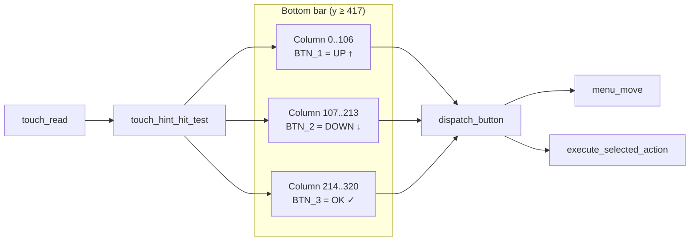

**Touch press feedback sequence:**
1. Redraw pressed circle in `BTN_PRESSED_COLOR` (violet)
2. Call `buzzer_beep_short()` — silent on this board (buzzer NC)
3. 80 ms delay for perceptual confirmation
4. Restore hint bar to normal colors
5. Call `dispatch_button(vbtn)`

---

## SD Card Flash Operations

Both operations follow the same pattern: mount → verify → flash in 1 KB chunks → rename result file → reboot.

```mermaid
flowchart TD
    subgraph "Firmware Flash - action_sd_update(label)"
        A1["sdcard_mount()"] --> B1{esp3dfw.bin\nexists?}
        B1 -- No --> ERR1["show_status: No esp3dfw.bin"]
        B1 -- Yes --> C1["Validate size ≤ partition size"]
        C1 --> D1["draw_flashing_screen()"]
        D1 --> E1["esp_ota_begin()"]
        E1 --> F1["Loop: fread 1 KB\n→ esp_ota_write()\n→ draw_progress()"]
        F1 --> G1["esp_ota_end()"]
        G1 --> H1["esp_ota_set_boot_partition(label)"]
        H1 --> I1["rename → esp3dfw.ok\nesp_restart()"]
        G1 -- fail --> J1["esp_ota_abort()\nrename → esp3dfw.bad\ndraw_menu()"]
    end

    subgraph "Resources Flash - action_sd_update_res()"
        A2["sdcard_mount()"] --> B2{ui_resources.bin\nexists?}
        B2 -- No --> ERR2["show_status: No ui_resources.bin"]
        B2 -- Yes --> B2H["Read & log 16-byte\nbuild header\n('ESP3' + variant string)"]
        B2H --> C2["Validate size ≤ partition size"]
        C2 --> D2["draw_flashing_screen()"]
        D2 --> E2["esp_partition_erase_range()\n(entire ui_resources partition)"]
        E2 --> F2["Loop: fread 1 KB\n→ esp_partition_write()\n→ draw_progress()"]
        F2 --> I2["rename → ui_resources.ok\nesp_restart()"]
        F2 -- fail --> J2["rename → ui_resources.bad\ndraw_menu()"]
    end
```

**SD file lifecycle:**

| SD File | On success | On failure |
|---|---|---|
| `esp3dfw.bin` | Renamed → `esp3dfw.ok` | Renamed → `esp3dfw.bad` |
| `ui_resources.bin` | Renamed → `ui_resources.ok` | Renamed → `ui_resources.bad` |

The rename-on-result pattern prevents accidental re-flash on the next recovery session while preserving the binary for post-mortem inspection.

**`ui_resources.bin` build header:** The resource flash action reads the first 16 bytes of the file before flashing. If the file begins with `ESP3`, the next 12 bytes are logged as the variant string (`FACTORY_LOGD`). This allows early detection of a wrong-variant binary (wrong CNC firmware type or transport) without aborting the flash — it is a log-only warning at this time.

---

## Graphics Subsystem

### Rendering Model

All drawing is done via a single static `line_buf[320]` buffer — no dynamic allocation. Each draw primitive fills the buffer and calls `gfx_flush()`, which serializes to the ST7796 via SPI and optionally mirrors to the snapshot file.

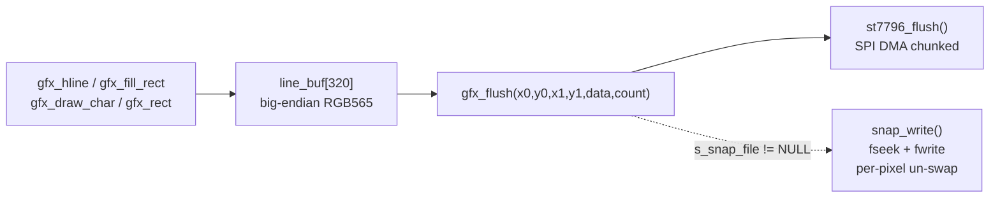

**Byte-swap note:** RGB565 pixels are stored big-endian for the SPI wire (`(color >> 8) | (color << 8)`). `snap_write` reverses this swap before writing to the file so the raw capture file contains native little-endian RGB565 pixels.

### Snapshot System (`ENABLE_SNAPSHOT`)

The snapshot feature is a debug-only build option. When enabled, pressing **GPIO0** (the physical BOOT button, separate from the on-screen virtual buttons) triggers a full-screen capture to the SD card.

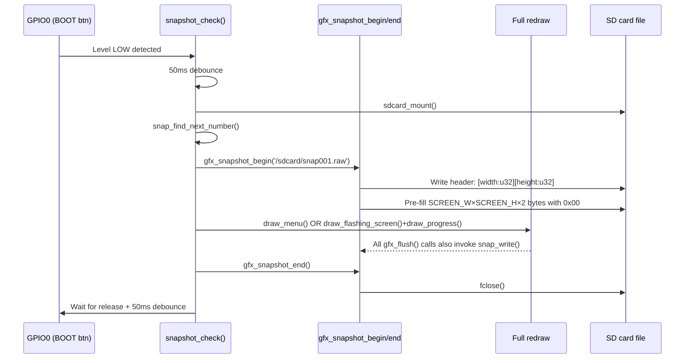

**Raw file format:**

```
Offset   Size      Content
0        4 bytes   width  (uint32_t, little-endian) = 320
4        4 bytes   height (uint32_t, little-endian) = 480
8        307200 B  Raw RGB565 pixels, native endian, row-major
                   Total: 8 + 320×480×2 = 307,208 bytes
```

> Files can be converted to PNG with the `boards/pibot_pendant_v1_0/Factory/tools/raw2png/snap2png.py` utility (shared across boards).

During a flash operation, `s_snap_in_flash = true` and `s_flash_last_percent` track the current state so a snapshot taken mid-flash captures a meaningful progress view rather than a stale menu frame.

---

## ST7796 Display Driver

The driver in `st7796.c` is reimplemented standalone — no `esp_lcd` or `esp3d_log` dependency — for minimal factory app footprint. The init sequence mirrors the shared `hardware/common/drivers/disp_st7796` component used by the main firmware. See [display_spi_drivers](display_spi_drivers.md) for the main firmware equivalent.

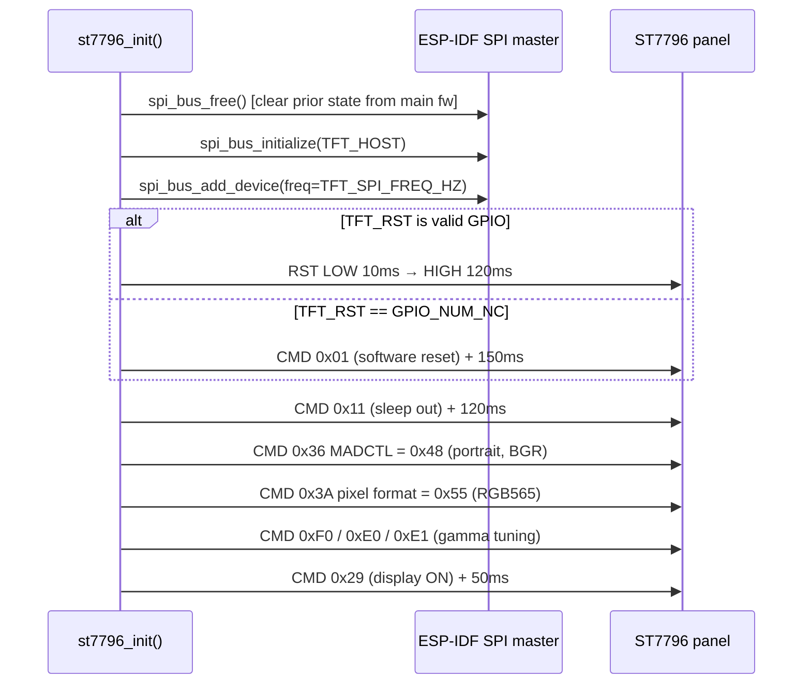

**Pixel write (st7796_flush):**
- Sets column address range (0x2A) and row address range (0x2B)
- Sends memory write command (0x2C)
- Transmits pixel data in ≤4096-byte SPI polling chunks

**Reset handling:** On this board variant `TFT_RST` may be `GPIO_NUM_NC`. The driver detects this at runtime via `GPIO_IS_VALID_GPIO()` and falls back to the ST7796 software reset command (0x01), matching the main firmware's shared driver behavior.

---

## GT911 Touch Driver

`touch.c` is a thin polling wrapper over the shared `hardware/common/drivers/touch_gt911` component. Unlike the resistive sibling (`esp32_3248s035r`) which requires runtime calibration via `calibrate()` and raw `read_reg12()` reads, the GT911 reports pre-calibrated, pixel-accurate coordinates directly. See [touch_drivers](touch_drivers.md) for the full driver API.

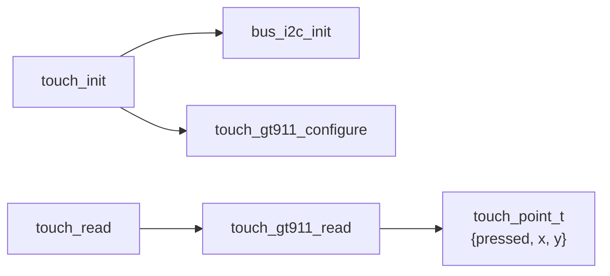

The `touch_gt911_config_t` passes `TOUCH_SWAP_XY_FLAG`, `TOUCH_MIRROR_X_FLAG`, and `TOUCH_MIRROR_Y_FLAG` from `hw_config.h` directly to the shared driver — no factory-app-level coordinate remapping is needed.

---

## Peripheral Stubs

The ESP32-3248S035C ships without physical buttons, encoder, or buzzer. All three drivers protect against `GPIO_NUM_NC` with the same `pin_bit()` guard pattern used throughout the codebase:

```c
static uint64_t pin_bit(gpio_num_t pin) {
    return GPIO_IS_VALID_GPIO(pin) ? (1ULL << pin) : 0ULL;
}
```

This prevents a compile-time negative shift warning on `GPIO_NUM_NC` (= -1) when the value is used in `1ULL << pin` expressions. The drivers remain fully functional if pins are ever populated.

| Behavior | `buttons_init()` | `encoder_init()` | `buzzer_init()` |
|---|---|---|---|
| Pin mask = 0 | Return early, no `gpio_config` | Return early (`!GPIO_IS_VALID_GPIO`) | Return early |
| Read call | `button_wait_press()` → `BTN_NONE` after timeout | `encoder_read()` → `0` | `buzzer_beep_short()` → immediate return |

---

## Factory Log System

`factory_log.h` provides a compile-time debug gate independent of `sdkconfig` log levels, controlled by the `ENABLE_FACTORY_DEBUG_LOG` CMake option.

| Build mode | `FACTORY_LOG_LEVEL` | `FACTORY_LOGD` behavior |
|---|---|---|
| Production (`OFF`) | `0` | Compiled out (zero overhead) |
| Debug (`ON`) | `1` | Expands to `ESP_LOGI` |

`factory_log_silence_sd_stack()` is the very first call in `app_main`. It mutes chatty ESP-IDF SD subsystem tags at runtime, preventing them from polluting the UART output even when `FACTORY_LOG_LEVEL=1` raises the sdkconfig log ceiling to INFO globally.

| Silenced tag | Subsystem |
|---|---|
| `sdmmc`, `sdmmc_periph`, `sdmmc_req`, `sdmmc_common` | SD host driver |
| `sdspi`, `sd_diskio` | SPI SD interface |
| `vfs_fat_sdmmc`, `fatfs` | FAT VFS layer |

---

## Main Event Loop

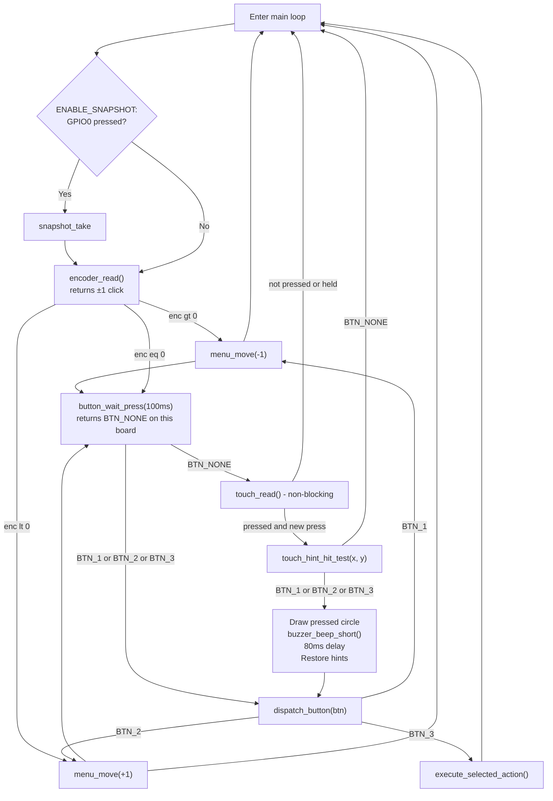

The 100 ms `button_wait_press` timeout on a board with no physical buttons is intentional — it provides a non-blocking poll interval that keeps the encoder responsive while the button driver returns `BTN_NONE` immediately on each call.

---

## Comparison with Sibling Boards

| Feature | `esp32_3248s035c` (this) | `esp32_3248s035r` | `pibot_pendant_v1_0` |
|---|---|---|---|
| Display | ST7796 SPI 320×480 | ST7796 SPI 320×480 | ILI9341 SPI 240×320 |
| Touch | GT911 capacitive (no calibration) | XPT2046 resistive + `calibrate()` | FT5x06 capacitive |
| Physical buttons | None (NC) | None (NC) | Physical GPIO |
| Rotary encoder | None (NC) | None (NC) | Physical PCNT |
| Buzzer | None (NC) | None (NC) | Physical GPIO |
| Custom bootloader | **No** | **No** | **Yes** |
| Recovery entry | `[ESP444]` software only | `[ESP444]` software only | Button hold at boot OR `[ESP444]` |
| Font size | 11 × 21 px | 11 × 21 px | 8 × 16 px (reference scale) |
| Snapshot trigger | GPIO0 (BOOT btn) | GPIO0 (BOOT btn) | GPIO0 (BOOT btn) |

---

## File Reference

| File | Purpose |
|---|---|
| `Factory/main/main.c` | Entry point, menu system, OTA actions, all UI drawing |
| `Factory/main/gfx.c` | Graphics primitives, font rendering, snapshot capture |
| `Factory/main/st7796.c` | Standalone ST7796 SPI driver (init, flush, backlight) |
| `Factory/main/touch.c` | GT911 I2C polling wrapper |
| `Factory/main/touch.h` | `touch_point_t` type definition |
| `Factory/main/sdcard.c` | SD card SPI mount/unmount via VFS FAT |
| `Factory/main/buttons.c` | GPIO button driver (no-op stub on this board) |
| `Factory/main/buzzer.c` | Bit-banged buzzer driver (no-op stub on this board) |
| `Factory/main/encoder.c` | PCNT quadrature decoder (no-op stub on this board) |
| `Factory/main/factory_log.h` | Compile-time debug gate + SD stack silencer |
| `Factory/main/hw_config.h` | Board-specific GPIO/SPI/I2C pin definitions |
| `Factory/main/version.h` | Firmware version string |

---

## Related Documentation

- [esp32_3248s035c_bsp](esp32_3248s035c_bsp.md) — BSP for the main pendant firmware on this board (LVGL, GT911 touch, control events)
- [esp32_3248s035c_build_scripts](esp32_3248s035c_build_scripts.md) — Build variant scripts for this board
- [esp32_3248s035r_factory](esp32_3248s035r_factory.md) — Resistive-touch sibling with XPT2046 calibration
- [pibot_pendant_v1_0_factory_app](pibot_pendant_v1_0_factory_app.md) — Reference implementation with custom bootloader, ILI9341, and physical buttons
- [display_spi_drivers](display_spi_drivers.md) — Shared ST7796 / ILI9341 drivers used by the main firmware
- [touch_drivers](touch_drivers.md) — Shared GT911 / XPT2046 driver components
- `docs/Factory/` — Factory app and bootloader design notes
- `docs/guides/board_build_guidelines.md` — Board build and flash procedures
- `docs/guides/ui_resources_guide.md` — How to build and flash `ui_resources.bin`
