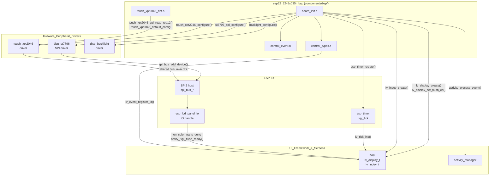
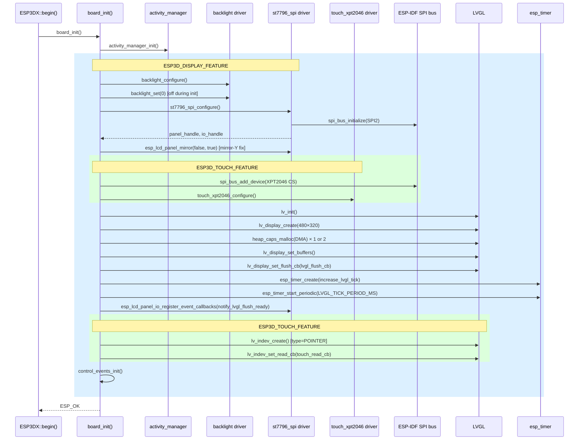
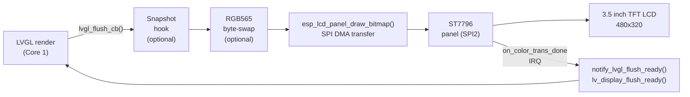
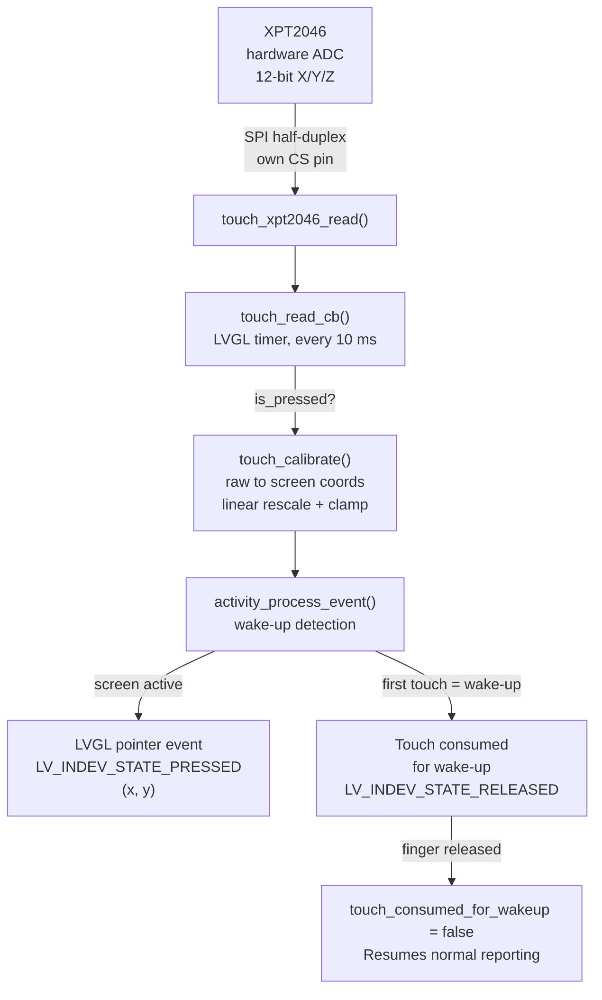
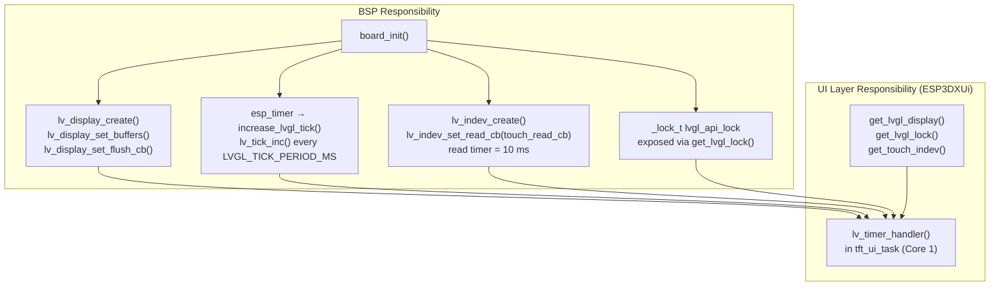
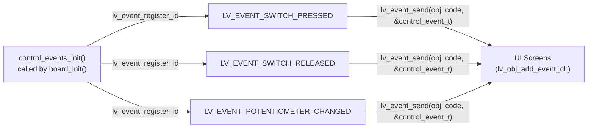
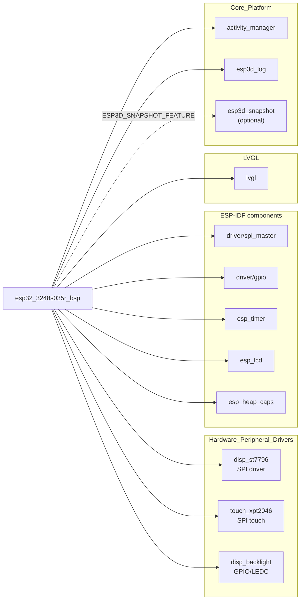

# ESP32-3248S035R Board Support Package (BSP)

The `esp32_3248s035r_bsp` module is the Board Support Package for the **ESP32-3248S035R** — a 3.5-inch ESP32 development board featuring an ST7796 TFT LCD and an **XPT2046 resistive touch controller** (the "R" suffix distinguishes it from the "C" capacitive variant). It abstracts all hardware initialization behind a single `board_init()` entry point, wires LVGL into the display and touch pipelines, and registers the custom control-event codes used by the UI layer.

This BSP is the resistive-touch counterpart to [`esp32_3248s035c_bsp.md`](esp32_3248s035c_bsp.md) (capacitive touch). Both share the same ST7796 display driver and the same BSP contract, but differ in their touch subsystem and touch-calibration logic.

---

## Table of Contents

1. [Hardware Profile](#1-hardware-profile)
2. [Module Structure](#2-module-structure)
3. [Architecture Overview](#3-architecture-overview)
4. [Component Reference](#4-component-reference)
   - 4.1 [board_init.c](#41-board_initc)
   - 4.2 [touch_xpt2046_def.h](#42-touch_xpt2046_defh)
   - 4.3 [control_event.h](#43-control_eventh)
   - 4.4 [control_types.c](#44-control_typesc)
5. [Initialization Sequence](#5-initialization-sequence)
6. [Display Pipeline](#6-display-pipeline)
7. [Touch Pipeline](#7-touch-pipeline)
8. [LVGL Integration](#8-lvgl-integration)
9. [Control Event System](#9-control-event-system)
10. [Key Design Decisions](#10-key-design-decisions)
11. [Configuration Constants](#11-configuration-constants)
12. [Dependencies](#12-dependencies)
13. [Related Modules](#13-related-modules)

---

## 1. Hardware Profile

| Feature | Detail |
|---|---|
| SoC | ESP32 (dual-core Xtensa LX6) |
| Display controller | ST7796 (SPI, 3.5-inch) |
| Display resolution | 480 × 320 px (landscape physical; portrait-corrected via MADCTL mirror-Y) |
| Display bus | SPI2 host, shared with touch |
| Touch controller | XPT2046 resistive (SPI, same bus as display, own CS pin) |
| Touch type | Resistive — requires linear ADC calibration |
| Backlight control | GPIO or LEDC PWM (feature-flag `ESP3D_BRIGHTNESS_CONTROL_FEATURE`) |
| Color format | RGB565 (16-bit, little-endian byte-swap optional) |

> **Important — orientation correction:** The ST7796 on this board requires a mirror-Y-only MADCTL value (`0x88`) for correct portrait orientation. This value is not reachable through the shared driver's `DISPLAY_ORIENTATION` enum, so `board_init()` calls `esp_lcd_panel_mirror(handle, false, true)` explicitly after driver initialization. This is a board-specific workaround; the shared ST7796 driver is not modified.

---

## 2. Module Structure

```
boards/esp32_3248s035r/
├── components/bsp/                  ← BSP component (this module)
│   ├── board_init.c                 ← All hardware init, LVGL wiring
│   ├── board_init.h                 ← Public BSP API
│   ├── board_config.h               ← Pin map and tuning constants
│   ├── control_event.h              ← control_event_t struct
│   ├── control_types.c              ← Custom LVGL event registration
│   ├── control_types.h              ← control_family_t, event code externs
│   └── touch_xpt2046_def.h         ← XPT2046 SPI instance & default config
├── Factory/                         ← Standalone factory test app
│   └── main/
│       ├── st7796.c / .h            ← Factory-only bare-metal ST7796 driver
│       ├── touch.c / .h             ← Factory-only bare-metal XPT2046 driver
│       ├── main.c                   ← Factory app entry point
│       └── ...                      ← buttons, buzzer, encoder, sdcard, gfx
└── build_scripts/                   ← Python variant build automation
    ├── build_one.py
    ├── common.py
    └── variants.py
```

The `components/bsp/` directory is the only part consumed by the main firmware. The `Factory/` subtree is an independent ESP-IDF project used only for production testing. See [`esp32_3248s035r_factory.md`](esp32_3248s035r_factory.md) and [`esp32_3248s035r_build_scripts.md`](esp32_3248s035r_build_scripts.md) for those sub-modules.

---

## 3. Architecture Overview



---

## 4. Component Reference

### 4.1 `board_init.c`

The central file of this module. All hardware bring-up, driver configuration, and LVGL wiring live here. It exposes a minimal public API through `board_init.h`.

#### Public API

| Symbol | Signature | Description |
|---|---|---|
| `board_init` | `esp_err_t board_init(void)` | Top-level initialization; call once from `ESP3DX::begin()`. |
| `board_get_name` | `const char *board_get_name(void)` | Returns `BOARD_NAME_STR` from `board_config.h`. |
| `board_get_version` | `const char *board_get_version(void)` | Returns `BOARD_VERSION_STR` from `board_config.h`. |
| `get_lvgl_display` | `lv_display_t *get_lvgl_display(void)` | Returns the LVGL display handle for use by `ESP3DXUi`. |
| `get_lvgl_lock` | `_lock_t *get_lvgl_lock(void)` | Returns the LVGL API mutex for thread-safe UI access. |
| `get_touch_indev` | `lv_indev_t *get_touch_indev(void)` | Returns the LVGL input device handle (touch). |

#### Private Functions

| Symbol | Description |
|---|---|
| `init_lvgl` | Initializes LVGL, creates the display and DMA draw buffer(s), registers the flush callback and tick timer, creates the touch input device. |
| `init_touch_controller` | Attaches XPT2046 to the shared SPI bus via `spi_bus_add_device()`, then calls `touch_xpt2046_configure()`. |
| `lvgl_flush_cb` | LVGL flush callback: optionally writes pixels to snapshot file, optionally byte-swaps RGB565, then calls `esp_lcd_panel_draw_bitmap()`. |
| `notify_lvgl_flush_ready` | `esp_lcd_panel_io` completion callback; calls `lv_display_flush_ready()` to release the render pipeline. |
| `touch_calibrate` | Linear rescaling of a raw 12-bit XPT2046 ADC reading to screen coordinates, clamped at zero on the low end. |
| `touch_read_cb` | LVGL input read callback; reads XPT2046 data, applies calibration, handles the wake-up touch-consume cycle via `activity_manager`. |
| `increase_lvgl_tick` | ESP timer callback; advances the LVGL tick by `LVGL_TICK_PERIOD_MS`. |

#### Module-level Statics

```c
static _lock_t            lvgl_api_lock;      // LVGL thread-safety mutex
static lv_display_t      *lvgl_display;        // LVGL display handle
static lv_color16_t      *lvgl_buf1;           // Primary DMA draw buffer
static lv_color16_t      *lvgl_buf2;           // Secondary DMA draw buffer (optional)
static esp_timer_handle_t lvgl_tick_timer;     // Periodic LVGL tick timer
static lv_indev_t        *touch_indev;         // LVGL touch input device
```

---

### 4.2 `touch_xpt2046_def.h`

Provides compile-time configuration and the SPI I/O function for the XPT2046 resistive touch controller.

#### `touch_xpt2046_spi_read_reg12`

```c
static inline uint16_t touch_xpt2046_spi_read_reg12(uint8_t reg);
```

Performs a 16-bit half-duplex SPI transaction using the device handle `touch_xpt2046_spi_device` (populated at runtime by `init_touch_controller()`). Returns the 12-bit ADC result shifted down from the 16-bit frame, or `0` on error.

**Protocol detail:** XPT2046 uses an 8-bit command byte followed by 16 RX bits; bits [15:3] hold the 12-bit result (`>> 3`).

#### Key Constants (from `board_config.h`)

| Constant | Purpose |
|---|---|
| `TOUCH_SPI_FREQ_HZ` | XPT2046 SPI clock speed |
| `TOUCH_SPI_CS_PIN` | GPIO for touch CS (separate from display CS) |
| `TOUCH_IRQ_PIN` | GPIO for touch interrupt / pen-down detection |
| `TOUCH_THRESHOLD` | Minimum pressure value to qualify a touch |
| `TOUCH_SWAP_XY_FLAG` | XY axis swap for physical orientation |
| `TOUCH_MIRROR_X_FLAG` / `TOUCH_MIRROR_Y_FLAG` | Axis inversion flags |
| `TOUCH_X_MAX` / `TOUCH_Y_MAX` | Logical screen dimensions |
| `TOUCH_CALIBRATION_X_MIN/MAX` | ADC raw values at screen edges (X axis) |
| `TOUCH_CALIBRATION_Y_MIN/MAX` | ADC raw values at screen edges (Y axis) |

#### Static Instances

```c
// Runtime device handle — NULL until spi_bus_add_device() in board_init.c
static spi_device_handle_t touch_xpt2046_spi_device = NULL;

// Passed to spi_bus_add_device() — half-duplex, 8-bit command field
const spi_device_interface_config_t touch_xpt2046_spi_device_config = { ... };

// Passed to touch_xpt2046_configure()
const touch_xpt2046_config_t touch_xpt2046_default_config = { ... };
```

---

### 4.3 `control_event.h`

Defines the **unified control event payload** carried by all physical input events dispatched to the UI layer via LVGL's custom event system.

```c
typedef struct {
    lv_indev_t        *indev;          // Source LVGL input device
    uint32_t           btn_id;         // Button / switch identifier
    lv_indev_type_t    type;           // LVGL input type (pointer, encoder, …)
    control_family_t   family_id;      // Device class (touch, encoder, switch, potentiometer)
    int32_t            steps;          // Encoder step count (signed)
    uint32_t           press_duration; // Duration of a hold press in milliseconds
} control_event_t;
```

This struct is the data payload attached to custom `lv_event_t` objects. UI screens receive it via `lv_event_get_param()`.

> On this board, only `indev`, `type` (pointer), and the calibrated coordinates passed through the standard LVGL pointer path are active. The `steps`, `btn_id`, `family_id`, and `press_duration` fields exist for API parity with richer boards such as [`pibot_pendant_v1_0_bsp.md`](pibot_pendant_v1_0_bsp.md) that expose encoders and physical switches.

---

### 4.4 `control_types.c`

Registers board-specific custom LVGL event codes after `lv_init()` has been called.

```c
// Defined in control_types.h — extern across the firmware
lv_event_code_t LV_EVENT_SWITCH_PRESSED;
lv_event_code_t LV_EVENT_SWITCH_RELEASED;
lv_event_code_t LV_EVENT_POTENTIOMETER_CHANGED;

void control_events_init(void);  // Called by board_init() after init_lvgl()
```

`lv_event_register_id()` assigns runtime numeric IDs (starting after `LV_EVENT_LAST`). These IDs are stable for the duration of a power cycle but are not persisted. The UI layer dispatches and listens for these codes through the standard `lv_event_send()` / `lv_obj_add_event_cb()` API.

---

## 5. Initialization Sequence



---

## 6. Display Pipeline

The display uses the **SPI panel model** from ESP-IDF's `esp_lcd` component, connected through the shared `disp_st7796` driver from [`display_spi_drivers.md`](display_spi_drivers.md).



**Key rendering properties:**

- Render mode: `LV_DISPLAY_RENDER_MODE_PARTIAL` — LVGL renders only dirty regions.
- Buffer size: `DISPLAY_WIDTH_PX × DISPLAY_BUFFER_LINES_NB × 2 bytes`, allocated from DMA-capable internal SRAM (`MALLOC_CAP_DMA`).
- Double buffer: controlled by `DISPLAY_USE_DOUBLE_BUFFER_FLAG`. When enabled, LVGL can prepare the next frame while the current one is transferring over SPI.
- Color format: `LV_COLOR_FORMAT_RGB565`.
- Color-byte swap: `DISPLAY_SWAP_COLOR_FLAG` controls whether `lv_draw_sw_rgb565_swap()` is called before `draw_bitmap()`.

---

## 7. Touch Pipeline

The XPT2046 resistive controller shares the SPI bus with the ST7796 display. Both are separate logical devices on `SPI2_HOST`, differentiated by their CS pins.



### Touch Calibration

The XPT2046 returns raw 12-bit ADC values that do not directly map to screen pixels. The `touch_calibrate()` function performs a linear rescaling per axis:

```
screen_coord = (raw - cal_min) * range / (cal_max - cal_min)
```

Where `cal_min` and `cal_max` are the measured ADC values at the physical screen edges (stored in `board_config.h` as `TOUCH_CALIBRATION_X_MIN/MAX` and `TOUCH_CALIBRATION_Y_MIN/MAX`), and `range` is the screen dimension (`TOUCH_X_MAX` or `TOUCH_Y_MAX`). Values below `cal_min` are clamped to zero.

The Factory app (`boards/esp32_3248s035r/Factory/main/touch.c`) uses an identical algorithm under the name `calibrate()`, ensuring consistent touch mapping between the factory test and the main firmware.

### Wake-up Touch Consumption

The touch callback integrates with the `activity_manager` to handle the display timeout/wake-up cycle:

1. **First touch after screen dim/sleep:** `activity_process_event()` returns `false` → the touch is flagged as a wake-up activator and **not** forwarded to LVGL. The display wakes up without triggering an unintended UI action.
2. **Touch hold or subsequent touches:** Reported normally to LVGL as `LV_INDEV_STATE_PRESSED` with calibrated coordinates.
3. **Touch release after wake-up:** The consumed flag is cleared silently; no spurious release event is generated.

---

## 8. LVGL Integration

The BSP wires LVGL to the hardware without any involvement from the UI layer itself. All glue code lives in `board_init.c`.



> **Thread-safety rule:** `lv_timer_handler()` runs exclusively on Core 1 inside `tft_ui_task`. The `lvgl_api_lock` must be held by any other task or ISR that calls LVGL APIs. The BSP exposes this lock via `get_lvgl_lock()` so the UI layer can manage it. See [`ui_core.md`](ui_core.md) for the full task architecture.

**Snapshot feature** (`ESP3D_SNAPSHOT_FEATURE`): When enabled, `lvgl_flush_cb()` intercepts each flush call and writes pixel data in 120-byte chunks to a file handle stored in `g_snapshot`. The snapshot completes when `captured_pixels >= expected_pixels`. The mutex `g_snapshot.mutex` is taken with a zero timeout so flush latency is unaffected when the snapshot system is idle.

---

## 9. Control Event System



The three custom event codes are defined for API parity with boards that have physical switches and potentiometers. On the ESP32-3248S035R, only the resistive touch path is active in normal use. The switch and potentiometer events exist because the same UI screens are shared across all supported boards.

The `control_event_t` payload is always stack-allocated by the caller and passed by pointer as the LVGL event user data. UI screens retrieve it with `lv_event_get_param()`.

---

## 10. Key Design Decisions

### Shared SPI Bus (Display + Touch)

Both the ST7796 display and the XPT2046 touch controller share `SPI2_HOST`. The display driver calls `spi_bus_initialize()` first; `init_touch_controller()` then calls `spi_bus_add_device()` to register XPT2046 as a second device on the already-initialized bus. The ESP-IDF SPI master driver serializes access per transaction, so no explicit application-level locking is needed.

### Mirror-Y Orientation Correction

The physical panel requires MADCTL `0x88` (portrait with mirror-Y). The shared `st7796` driver exposes only a 4-entry `DISPLAY_ORIENTATION` enum that cannot express this exact combination. Rather than modifying the shared driver (which would affect other boards), `board_init()` calls `esp_lcd_panel_mirror(handle, false, true)` immediately after `st7796_spi_configure()`. This is explicitly documented in the source with a comment referencing the Factory app's raw MADCTL value for cross-verification.

### DMA-Only Draw Buffers

`heap_caps_malloc(size, MALLOC_CAP_DMA)` is used for LVGL draw buffers instead of plain `malloc`. The SPI DMA engine on ESP32 requires the source buffer to be in internal SRAM reachable by DMA (not external PSRAM or stack). Failure to allocate is treated as a fatal error returned from `board_init()`.

### Wake-up Touch Consumption Pattern

The first touch after a screen timeout must not trigger a UI action — it should only wake the display. The `touch_consumed_for_wakeup` static flag in `touch_read_cb()` implements this pattern cleanly:

- `activity_process_event()` returns `false` when the display is sleeping → sets the flag.
- The flag suppresses forwarding of the press **and** the corresponding release to LVGL.
- The flag is cleared on finger-up without generating a spurious release event.

This same pattern appears across all touch-enabled BSPs in the project.

---

## 11. Configuration Constants

All board-specific constants are defined in `board_config.h` (part of the BSP component but not in this module's exported API). The BSP reads them at compile time. The most critical ones are:

| Category | Constant | Usage in BSP |
|---|---|---|
| **Display** | `DISPLAY_WIDTH_PX`, `DISPLAY_HEIGHT_PX` | `lv_display_create()` |
| **Display** | `DISPLAY_BUFFER_LINES_NB` | Draw buffer height in lines |
| **Display** | `DISPLAY_USE_DOUBLE_BUFFER_FLAG` | Enables second DMA buffer |
| **Display** | `DISPLAY_SWAP_COLOR_FLAG` | RGB565 byte-swap before DMA |
| **Display** | `DISPLAY_SPI_HOST_IDX` | SPI host shared by display and touch |
| **Touch** | `TOUCH_CALIBRATION_X_MIN/MAX` | XPT2046 ADC range for X axis |
| **Touch** | `TOUCH_CALIBRATION_Y_MIN/MAX` | XPT2046 ADC range for Y axis |
| **Touch** | `TOUCH_X_MAX`, `TOUCH_Y_MAX` | Screen pixel dimensions for calibration output |
| **Touch** | `TOUCH_SPI_FREQ_HZ`, `TOUCH_SPI_CS_PIN` | XPT2046 SPI parameters |
| **Touch** | `TOUCH_IRQ_PIN`, `TOUCH_THRESHOLD` | Pen-down detection |
| **Touch** | `TOUCH_SWAP_XY_FLAG`, `TOUCH_MIRROR_X/Y_FLAG` | Coordinate transform |
| **LVGL** | `LVGL_TICK_PERIOD_MS` | `esp_timer` period for `lv_tick_inc()` |

---

## 12. Dependencies



| Dependency | Where used |
|---|---|
| `disp_st7796` | Display driver — `st7796_spi_configure()`, `st7796_spi_get_panel_handle()`, `st7796_spi_get_io_handle()` |
| `touch_xpt2046` | Touch driver — `touch_xpt2046_configure()`, `touch_xpt2046_read()` |
| `disp_backlight` | Backlight — `backlight_configure()`, `backlight_set()` (conditional on `ESP3D_BRIGHTNESS_CONTROL_FEATURE`) |
| `activity_manager` | Wake-up event gate in `touch_read_cb()` and `board_init()` |
| `esp3d_log` | All diagnostic output via `esp3d_log()` / `esp3d_log_e()` |
| `esp3d_snapshot` | Screen capture hook inside `lvgl_flush_cb()` (conditional on `ESP3D_SNAPSHOT_FEATURE`) |
| ESP-IDF `spi_master` | Bus initialization, device attach, transaction execution |
| ESP-IDF `esp_lcd` | Panel I/O handle, `esp_lcd_panel_draw_bitmap()`, IO callbacks |
| ESP-IDF `esp_timer` | Periodic LVGL tick timer |
| LVGL | Display, input device, and event system |

---

## 13. Related Modules

| Module | Relationship |
|---|---|
| [`esp32_3248s035r_factory.md`](esp32_3248s035r_factory.md) | Factory test app for the same board; uses its own bare-metal ST7796 and XPT2046 drivers, fully independent of this BSP. |
| [`esp32_3248s035r_build_scripts.md`](esp32_3248s035r_build_scripts.md) | Python build automation for all firmware variants of this board. |
| [`esp32_3248s035c_bsp.md`](esp32_3248s035c_bsp.md) | Capacitive-touch variant BSP (same ST7796 display, no resistive `touch_calibrate()` logic). |
| [`display_spi_drivers.md`](display_spi_drivers.md) | Shared `disp_st7796` and `disp_backlight` hardware drivers consumed by this BSP. |
| [`touch_controllers.md`](touch_controllers.md) | Shared `touch_xpt2046` driver consumed by this BSP. |
| [`ui_core.md`](ui_core.md) | `ESP3DXUi` / `UIManager` — consumes `get_lvgl_display()`, `get_lvgl_lock()`, `get_touch_indev()` provided by this BSP. |
| [`esp3d_activity_manager.md`](esp3d_activity_manager.md) | Activity/wake-up manager called from `touch_read_cb()` and `board_init()`. |
| [`pibot_pendant_v1_0_bsp.md`](pibot_pendant_v1_0_bsp.md) | More complex BSP with full physical input suite; shows how `control_event_t` fields (encoder steps, switch ID, potentiometer) are fully populated. |
