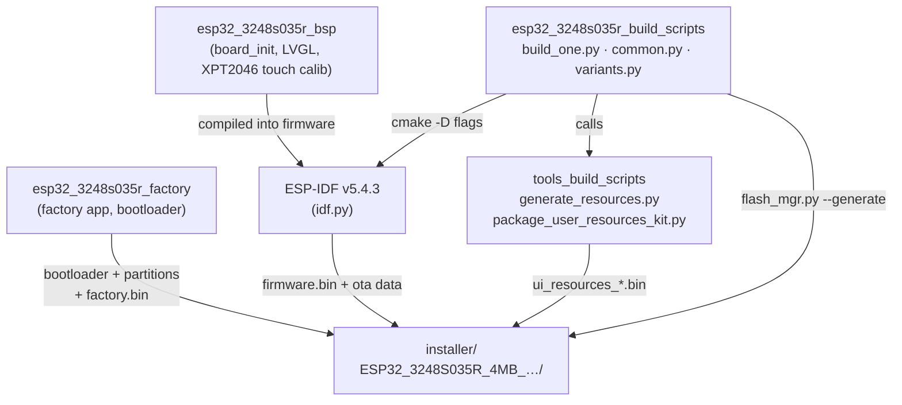
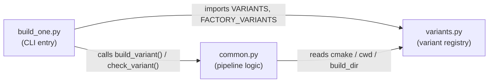
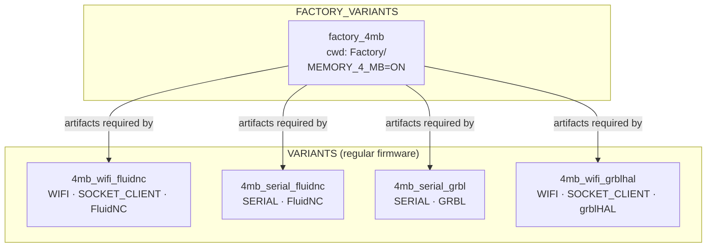
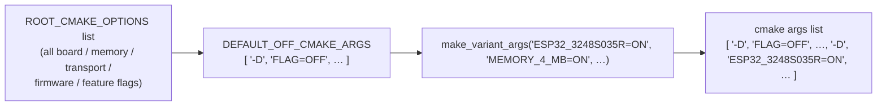
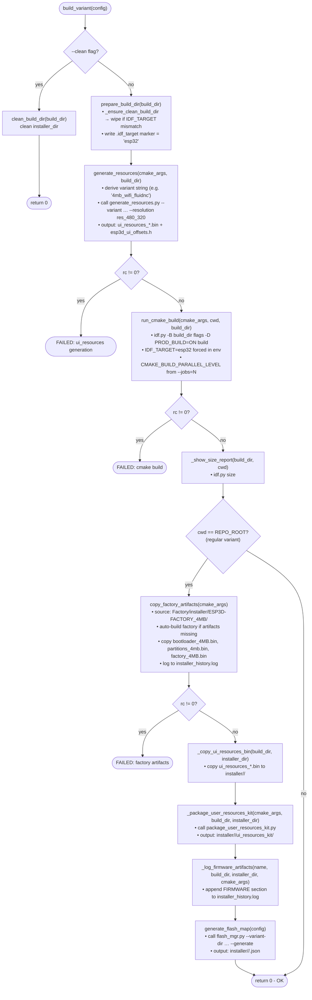
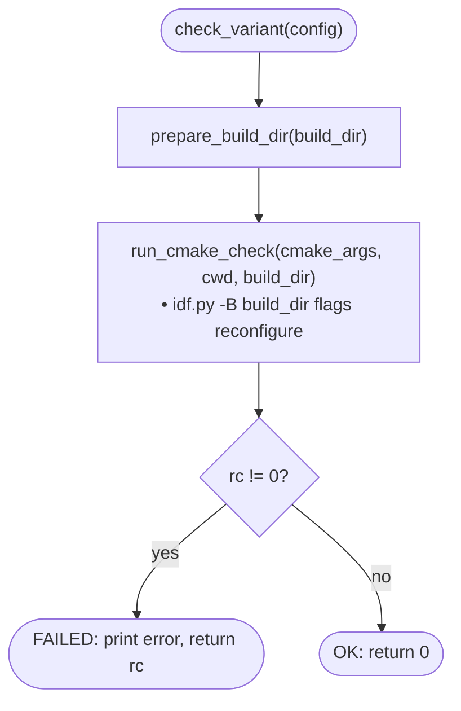
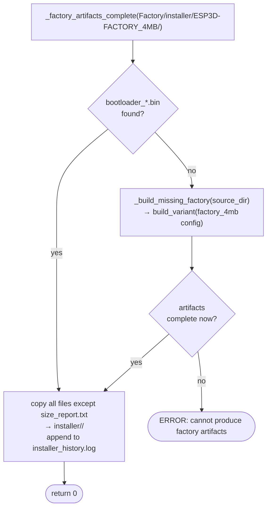
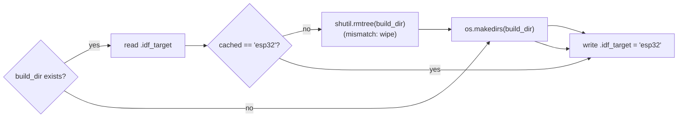
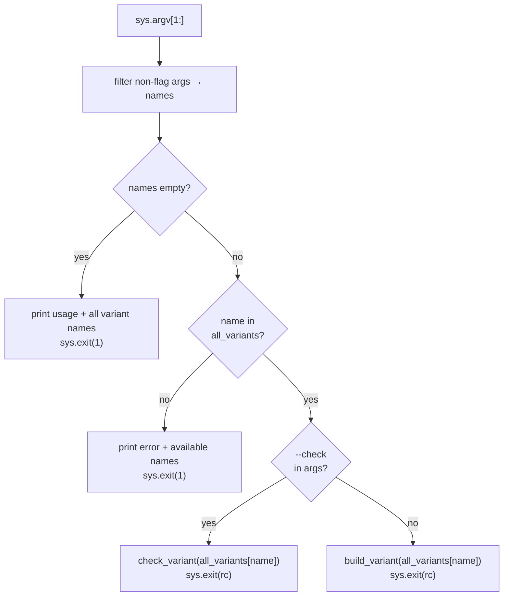
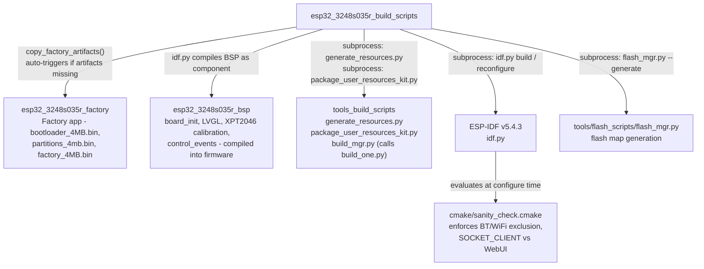

# esp32\_3248s035r\_build\_scripts

Build automation scripts for the **ESP32-3248S035R** board (ESP32, 4 MB flash, 480 × 320 ST7796 SPI display with **resistive XPT2046 touch**). These three Python scripts define every named firmware *variant* for this board and orchestrate the complete build pipeline: UI-resource generation, ESP-IDF compilation, factory-artifact injection, installer assembly, and flash-map generation.

The `esp32_3248s035r` board is the resistive-touch sibling of `esp32_3248s035c`. Both boards share the same ST7796 display and the identical three-file build-script pattern, but differ in their touch subsystem (resistive XPT2046 vs. capacitive GT911) and in the `touch_calibrate()` step that is unique to this variant.

---

## Table of Contents

1. [Module Position](#1-module-position)
2. [File Overview](#2-file-overview)
3. [Variant System](#3-variant-system)
4. [Build Pipeline](#4-build-pipeline)
5. [Directory & Path Conventions](#5-directory--path-conventions)
6. [Component Reference](#6-component-reference)
   - 6.1 [variants.py](#61-variantspy)
   - 6.2 [common.py](#62-commonpy)
   - 6.3 [build\_one.py](#63-build_onepy)
7. [Environment & Prerequisites](#7-environment--prerequisites)
8. [Usage](#8-usage)
9. [Adding a New Variant](#9-adding-a-new-variant)
10. [Cross-Module Dependencies](#10-cross-module-dependencies)

---

## 1. Module Position

This module is one of three sibling sub-modules that together form the complete `esp32_3248s035r` board package. The other two siblings are documented separately:

- **[esp32\_3248s035r\_factory](esp32_3248s035r_factory.md)** — the Factory app sources whose build output (bootloader, partition table, factory binary) this module copies into every regular variant's installer directory.
- **[esp32\_3248s035r\_bsp](esp32_3248s035r_bsp.md)** — the Board Support Package (board init, LVGL wiring, XPT2046 calibration, control events) compiled into every firmware variant.

The build scripts also invoke utilities from **[Build, Resource & Development Toolchain](Build_and_Development_Tools.md)** for UI resource generation and installer kit packaging.



The sister board `esp32_3248s035c` uses an identical three-file structure; see **[esp32\_3248s035c\_build\_scripts](esp32_3248s035c_build_scripts.md)** for comparison.

---

## 2. File Overview

| File | Role |
|------|------|
| `variants.py` | Declares every named build variant as a Python dict with cmake flags, working directory, and build directory. Single source of truth for *what* can be built. |
| `common.py` | Implements the full build pipeline — cleaning, cmake invocation, resource generation, factory artifact injection, installer assembly, and flash-map generation. |
| `build_one.py` | Thin CLI entry-point. Parses the variant name from `sys.argv`, then delegates to `check_variant()` or `build_variant()` in `common.py`. |



---

## 3. Variant System

### 3.1 Design Principle

Every variant is a plain Python `dict` with four keys:

| Key | Type | Description |
|-----|------|-------------|
| `name` | `str` | Human-readable identifier, also used as the build-directory suffix |
| `cmake` | `list[str]` | Ordered list of `-D KEY=VALUE` arguments passed verbatim to `idf.py` |
| `cwd` | `str` | Working directory for `idf.py` (`REPO_ROOT` for regular variants, `FACTORY_DIR` for the factory variant) |
| `build_dir` | `str` | Absolute path to the build artifact directory |

### 3.2 Variant Registry (`VARIANTS` + `FACTORY_VARIANTS`)



#### Feature matrix

| Variant | Memory | Transport | Firmware | MDNS | Socket Client | WebUI |
|---------|--------|-----------|----------|------|---------------|-------|
| `4mb_wifi_fluidnc` | 4 MB | WiFi + Serial | FluidNC | ✓ | ✓ | — |
| `4mb_serial_fluidnc` | 4 MB | Serial | FluidNC | — | — | — |
| `4mb_serial_grbl` | 4 MB | Serial | GRBL | — | — | — |
| `4mb_wifi_grblhal` | 4 MB | WiFi + Serial | grblHAL | ✓ | ✓ | — |
| `factory_4mb` *(special)* | 4 MB | — | Factory App | — | — | — |

> **Note:** `SOCKET_CLIENT_SERVICE=ON` dedicates the WiFi radio to the CNC TCP link. `WEBUI_SERVER` and `WS_SERVER_SERVICE` are intentionally OFF — `cmake/sanity_check.cmake` enforces this when `SOCKET_CLIENT_SERVICE` is ON.

> **Note on Bluetooth:** No BT variants are currently defined for this board. `ROOT_CMAKE_OPTIONS` includes `BT_SERVICE`, `BT_SERIAL_SERVICE`, and `BT_BLE_SERVICE` for cross-board flag consistency, but enabling BT and WiFi simultaneously is forbidden (no PSRAM on this board; `sanity_check.cmake` enforces mutual exclusion).

### 3.3 `make_variant_args()` — Flag Generation

`make_variant_args()` starts by setting **every** known cmake option to `OFF` (`DEFAULT_OFF_CMAKE_ARGS`), then selectively overrides specific flags to `ON`. This prevents stale cmake cache values from a previous build profile from leaking into the current one.

```python
# Example output fragment:
make_variant_args("ESP32_3248S035R=ON", "MEMORY_4_MB=ON", "WIFI_SERVICE=ON")
# → [ '-D', 'ESP32_PIBOT_CNC_PENDANT_V1=OFF', …, '-D', 'ESP32_3248S035R=OFF', …,
#      '-D', 'ESP32_3248S035R=ON', '-D', 'MEMORY_4_MB=ON', '-D', 'WIFI_SERVICE=ON' ]
```



The final list is appended to the `idf.py` command line so later `-D` entries override earlier ones for the flags being enabled.

`ROOT_CMAKE_OPTIONS` covers six categories:

| Category | Examples |
|----------|---------|
| Board selection | `ESP32_3248S035R`, `ESP32_3248S035C`, `ESP32S3_4827S043C`, … |
| Memory | `MEMORY_4_MB`, `MEMORY_8_MB`, `MEMORY_16_MB` |
| PSRAM | `PSRAM_NONE`, `PSRAM_2_MB`, `PSRAM_4_MB`, `PSRAM_8_MB` |
| Firmware target | `TARGET_FW_FLUIDNC`, `TARGET_FW_GRBLHAL`, `TARGET_FW_GRBL`, … |
| Transports | `SERIAL_SERVICE`, `WIFI_SERVICE`, `BT_SERVICE`, `BT_SERIAL_SERVICE`, … |
| Features | `TFT_UI_SERVICE`, `SD_CARD_SERVICE`, `MDNS_SERVICE`, `SOCKET_CLIENT_SERVICE`, … |

---

## 4. Build Pipeline

### 4.1 `build_variant()` — Full Build



### 4.2 `check_variant()` — Config Validation Only

A lightweight path that runs `idf.py reconfigure` (cmake configuration pass only, no compilation) to validate the cmake flags without producing any binaries. Useful for catching configuration errors quickly before a full build.



### 4.3 Factory Artifact Auto-Bootstrap

Regular variants depend on bootloader and partition-table binaries compiled by the factory variant. `copy_factory_artifacts()` implements a self-healing dependency: if `Factory/installer/ESP3D-FACTORY_4MB/` is absent or incomplete (no `bootloader_*.bin` present), it automatically triggers `build_variant(factory_4mb)` before proceeding.



> **Why `size_report.txt` is excluded:** The factory build writes its own `size_report.txt`. Copying it would clobber the regular variant's own size report, which `build_mgr.py` writes separately.

### 4.4 IDF\_TARGET Guard

`prepare_build_dir()` writes a `.idf_target` marker file and wipes the build directory if the cached target does not match `"esp32"`. This prevents a stale ESP32-S3 build directory from causing silent mis-compilation.



---

## 5. Directory & Path Conventions

```
<REPO_ROOT>/
├── build/
│   └── esp32_3248s035r_<variant>/          ← idf.py build artifacts (.elf, .bin, .map, …)
│       ├── .idf_target                     ← IDF_TARGET guard marker ("esp32")
│       ├── ui_resources_<variant>.bin      ← generated by generate_resources.py
│       ├── ui_resources_manifest_<v>.json  ← manifest consumed by kit packager
│       └── esp3d_ui_offsets.h              ← generated offsets header
│
├── installer/
│   └── ESP32_3248S035R_4MB_<radio>_<fw>/  ← assembled installer directory
│       ├── bootloader_4MB.bin             ← from Factory build
│       ├── partitions_4mb.bin             ← from Factory build
│       ├── factory_4MB.bin                ← from Factory build
│       ├── firmware.bin                   ← main pendant firmware
│       ├── ota_data_initial.bin           ← OTA partition initial state
│       ├── ui_resources_<variant>.bin     ← UI resources partition
│       ├── ui_resources_kit/              ← standalone user customization kit
│       ├── ESP32_3248S035R_4MB_….json     ← flash map (flash_mgr output)
│       └── installer_history.log          ← append-only audit log
│
└── boards/esp32_3248s035r/
    ├── build_scripts/                     ← this module
    │   ├── build_one.py
    │   ├── common.py
    │   └── variants.py
    ├── Factory/
    │   ├── build/factory_4mb/             ← factory app build artifacts
    │   └── installer/
    │       └── ESP3D-FACTORY_4MB/         ← factory installer output (source for copy)
    ├── resources/                         ← (optional) board-specific UI overrides
    ├── partitions_4mb.csv
    └── flash_params.json                  ← (optional) board flash parameters for flash_mgr
```

### Installer Directory Naming

`build_config_name()` derives the installer subdirectory name from the cmake flags:

```
ESP32_3248S035R_<memory>_<radio>_<firmware>

Examples:
  ESP32_3248S035R_4MB_wifi_fluidnc
  ESP32_3248S035R_4MB_serial_grbl
  ESP32_3248S035R_4MB_wifi_grblhal
```

Radio tokens: `wifi`, `serial`, `bt`, `bt_serial`, `bt_ble`.

For the factory variant (`cwd == FACTORY_DIR`), the fixed name `ESP3D-FACTORY_4MB` is used instead.

### Resource Variant String

`resource_variant_string()` derives the `--variant` argument for `generate_resources.py`:

```
<N>mb_<transport>_<firmware>

Examples:
  4mb_wifi_fluidnc
  4mb_serial_grbl
  4mb_wifi_grblhal
```

Returns `None` for the factory variant (no UI resource partition is generated for it).

---

## 6. Component Reference

### 6.1 `variants.py`

#### `make_variant_args(*on_flags) → list[str]`

Generates the cmake argument list for a variant. Starts from `DEFAULT_OFF_CMAKE_ARGS` (all flags in `ROOT_CMAKE_OPTIONS` set to `OFF`) and appends each item in `on_flags` as `-D <flag>` to override it to `ON`.

#### `VARIANTS`

| Key | `cwd` | `build_dir` |
|-----|-------|-------------|
| `4mb_wifi_fluidnc` | `REPO_ROOT` | `build/esp32_3248s035r_4mb_wifi_fluidnc` |
| `4mb_serial_fluidnc` | `REPO_ROOT` | `build/esp32_3248s035r_4mb_serial_fluidnc` |
| `4mb_serial_grbl` | `REPO_ROOT` | `build/esp32_3248s035r_4mb_serial_grbl` |
| `4mb_wifi_grblhal` | `REPO_ROOT` | `build/esp32_3248s035r_4mb_wifi_grblhal` |

All regular variants share: `ESP32_3248S035R=ON`, `MEMORY_4_MB=ON`, `TFT_UI_SERVICE=ON`, `TFT_TOUCH_SERVICE=ON`, `SD_CARD_SERVICE=ON`, `UPDATE_SERVICE=ON`, `FACTORY_SERVICE=ON`.

#### `FACTORY_VARIANTS`

| Key | `cwd` | `build_dir` |
|-----|-------|-------------|
| `factory_4mb` | `boards/esp32_3248s035r/Factory` | `Factory/build/factory_4mb` |

The factory variant sets only `MEMORY_4_MB=ON` and `MEMORY_8_MB=OFF`; all feature flags are controlled by the Factory CMakeLists.

#### Path constants

| Constant | Value |
|----------|-------|
| `BOARD_ROOT` | `boards/esp32_3248s035r/` |
| `REPO_ROOT` | Repository root (two levels above `build_scripts/`) |
| `BUILD_BASE` | `<REPO_ROOT>/build/` |
| `FACTORY_BUILD_BASE` | `<BOARD_ROOT>/Factory/build/` |

---

### 6.2 `common.py`

#### Constants

| Name | Value / Source |
|------|---------------|
| `BOARD_ROOT` | `boards/esp32_3248s035r/` |
| `REPO_ROOT` | Two levels above `build_scripts/` |
| `IDF_PATH` | `$IDF_PATH` env var; default `C:\Users\luc\esp\v5.4.3\esp-idf` |
| `IDF_PY` | `$IDF_PATH/tools/idf.py` |
| `RESOLUTION` | `"res_480_320"` (hardcoded for this board's 480 × 320 panel) |
| `EXPECTED_IDF_TARGET` | `"esp32"` |
| `GENERATE_RESOURCES` | `tools/build_scripts/generate_resources.py` |
| `PACKAGE_USER_KIT` | `tools/build_scripts/package_user_resources_kit.py` |

#### Public Functions

| Function | Signature | Purpose |
|----------|-----------|---------| 
| `build_variant` | `(config: dict) → int` | Execute the full build pipeline for one variant |
| `check_variant` | `(config: dict) → int` | Run cmake reconfigure only (no compilation) |
| `installer_dir_for` | `(config: dict) → str \| None` | Compute the installer output directory path |
| `generate_flash_map` | `(config: dict)` | Invoke `flash_mgr.py --generate` after a successful build |

#### Internal Functions

| Function | Purpose |
|----------|---------|
| `parse_cmake_flags(cmake_args)` | Parse `-D KEY=VALUE` pairs from cmake args list into a `dict` |
| `build_config_name(cmake_args)` | Derive the installer subdirectory name from cmake flags |
| `resource_variant_string(cmake_args)` | Derive the `generate_resources.py --variant` string; `None` for factory |
| `generate_resources(cmake_args, build_dir)` | Call `generate_resources.py` to produce the UI resources partition binary |
| `copy_factory_artifacts(cmake_args)` | Copy bootloader/partition binaries from factory installer; auto-triggers factory build if absent |
| `_factory_artifacts_complete(source_dir)` | Returns `True` only if `source_dir` contains a `bootloader_*.bin` file |
| `_build_missing_factory(source_dir)` | Locate and build the factory variant whose output is `source_dir` |
| `prepare_build_dir(build_dir)` | Ensure build dir exists; write `.idf_target` marker; wipe if target mismatch |
| `_ensure_clean_build_dir(build_dir)` | Read `.idf_target` marker; call `shutil.rmtree` if it doesn't match `"esp32"` |
| `run_cmake_build(cmake_args, cwd, build_dir)` | Invoke `idf.py … build` with forced `IDF_TARGET=esp32` in env |
| `run_cmake_check(cmake_args, cwd, build_dir)` | Invoke `idf.py … reconfigure` with forced `IDF_TARGET=esp32` in env |
| `_show_size_report(build_dir, cwd)` | Print `idf.py size` output after a successful build |
| `_copy_ui_resources_bin(build_dir, installer_dir)` | Copy `ui_resources_*.bin` from build dir to installer dir |
| `_package_user_resources_kit(cmake_args, build_dir, installer_dir)` | Call `package_user_resources_kit.py` to assemble the standalone end-user kit |
| `_log_firmware_artifacts(variant_name, build_dir, installer_dir, cmake_args)` | Append timestamped `FACTORY`/`FIRMWARE` entries to `installer_history.log` |
| `clean_build_dir(build_dir)` | Remove the build directory via `shutil.rmtree` |
| `ensure_idf_py()` | Verify `IDF_PY` exists; abort with a clear message if not |
| `_get_jobs_env_value()` | Parse `--jobs=N` from `sys.argv`; propagated via `CMAKE_BUILD_PARALLEL_LEVEL` |

#### Parallelism note — `_get_jobs_env_value()`

`idf.py` has no `-j` / `--jobs` CLI option. The job count is instead set via the `CMAKE_BUILD_PARALLEL_LEVEL` environment variable, which the underlying `cmake --build` step respects regardless of build generator (Ninja or Make).

---

### 6.3 `build_one.py`

#### `main()`

The sole function in `build_one.py`. Merges `FACTORY_VARIANTS` and `VARIANTS`, looks up the requested variant name, and dispatches to `check_variant()` or `build_variant()`.



`--clean` is not parsed in `build_one.py` — it is read directly from `sys.argv` inside `build_variant()` in `common.py`.

---

## 7. Environment & Prerequisites

| Requirement | Details |
|-------------|---------|
| Python | 3.x (invoked as `sys.executable`) |
| ESP-IDF | v5.4.3, activated in shell (`IDF_PATH` must be set, or the default Windows path must exist) |
| CMake | Bundled with ESP-IDF |
| Ninja / Make | Bundled with ESP-IDF |
| `--jobs=N` | Optional; forwarded via `CMAKE_BUILD_PARALLEL_LEVEL` to the underlying cmake build |

Set `IDF_PATH` to override the default installation path:

```bash
export IDF_PATH=/path/to/esp-idf
python build_one.py 4mb_wifi_fluidnc
```

---

## 8. Usage

```bash
# Navigate to the board's build_scripts directory
cd boards/esp32_3248s035r/build_scripts

# List all available variants
python build_one.py

# Build a specific variant
python build_one.py 4mb_wifi_fluidnc
python build_one.py 4mb_serial_grbl
python build_one.py 4mb_serial_fluidnc
python build_one.py 4mb_wifi_grblhal

# Build the factory variant
python build_one.py factory_4mb

# Validate cmake configuration only (no compilation)
python build_one.py 4mb_wifi_grblhal --check

# Clean build artifacts and installer output, then exit (no rebuild)
python build_one.py 4mb_wifi_fluidnc --clean

# Build with parallel jobs (forwarded to cmake via CMAKE_BUILD_PARALLEL_LEVEL)
python build_one.py 4mb_serial_fluidnc --jobs=8

# Development build (skips -D PROD_BUILD=ON)
python build_one.py 4mb_wifi_fluidnc --dev
```

Exit codes: `0` = success, non-zero = failure (propagated directly from `build_variant` / `check_variant`).

---

## 9. Adding a New Variant

1. Open `boards/esp32_3248s035r/build_scripts/variants.py`.
2. Call `make_variant_args()` with the desired flags and add the entry to `VARIANTS`:

    ```python
    "4mb_bt_ble_grblhal": {
        "name": "4mb_bt_ble_grblhal",
        "cmake": make_variant_args(
            "ESP32_3248S035R=ON",
            "MEMORY_4_MB=ON",
            "TARGET_FW_GRBLHAL=ON",
            "SERIAL_SERVICE=ON",
            "BT_SERVICE=ON",
            "BT_BLE_SERVICE=ON",
            "TFT_UI_SERVICE=ON",
            "TFT_TOUCH_SERVICE=ON",
            "SD_CARD_SERVICE=ON",
            "UPDATE_SERVICE=ON",
            "FACTORY_SERVICE=ON",
        ),
        "cwd": REPO_ROOT,
        "build_dir": os.path.join(BUILD_BASE, "esp32_3248s035r_4mb_bt_ble_grblhal"),
    },
    ```

3. Validate cmake configuration: `python build_one.py 4mb_bt_ble_grblhal --check`
4. Build: `python build_one.py 4mb_bt_ble_grblhal`

> ⚠️ **Bluetooth + WiFi mutual exclusion:** This board has no PSRAM. `cmake/sanity_check.cmake` rejects combinations of `BT_SERVICE` and `WIFI_SERVICE`.

---

## 10. Cross-Module Dependencies



| Dependency | Direction | Nature |
|------------|-----------|--------|
| `esp32_3248s035r_factory` | Build-time | `copy_factory_artifacts()` copies its output; auto-builds it if absent |
| `esp32_3248s035r_bsp` | Build-time | Compiled by `idf.py` as an ESP-IDF component of the main firmware |
| `tools_build_scripts` (generate_resources) | Runtime subprocess | Produces `ui_resources_*.bin` and `esp3d_ui_offsets.h` before `idf.py` runs |
| `tools_build_scripts` (package_user_resources_kit) | Runtime subprocess | Assembles the standalone end-user UI customization kit |
| `tools_build_scripts` (build_mgr) | Caller | Invokes `build_one.py` as a subprocess for batch multi-board builds |
| `tools/flash_scripts/flash_mgr.py` | Runtime subprocess | Generates the variant's flash map JSON for the web installer |
| `cmake/sanity_check.cmake` | Build-time | Enforces transport exclusivity (BT vs WiFi, SOCKET_CLIENT vs WebUI/WS) |
