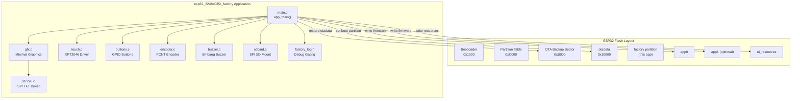
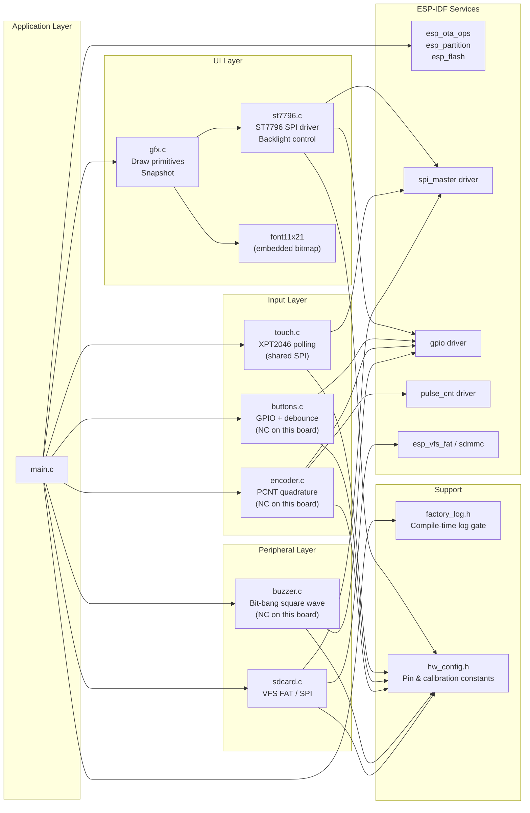
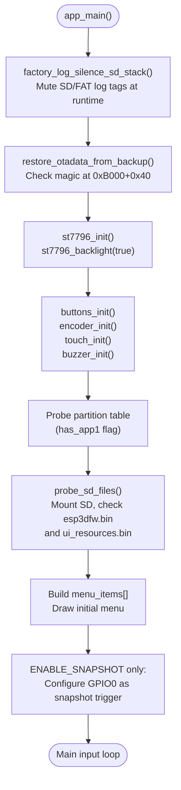
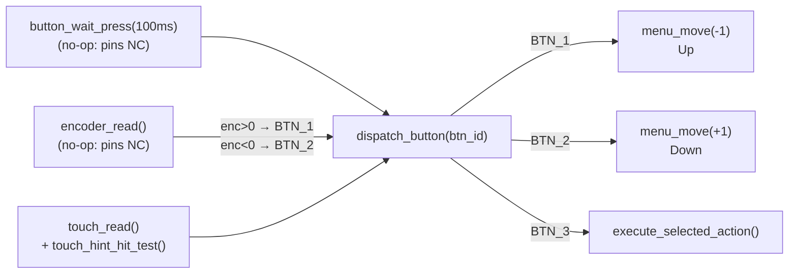
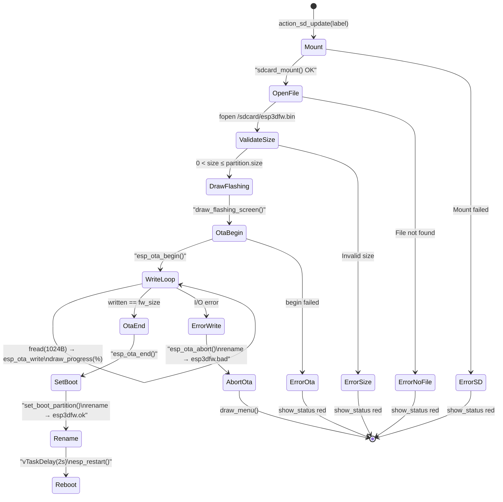
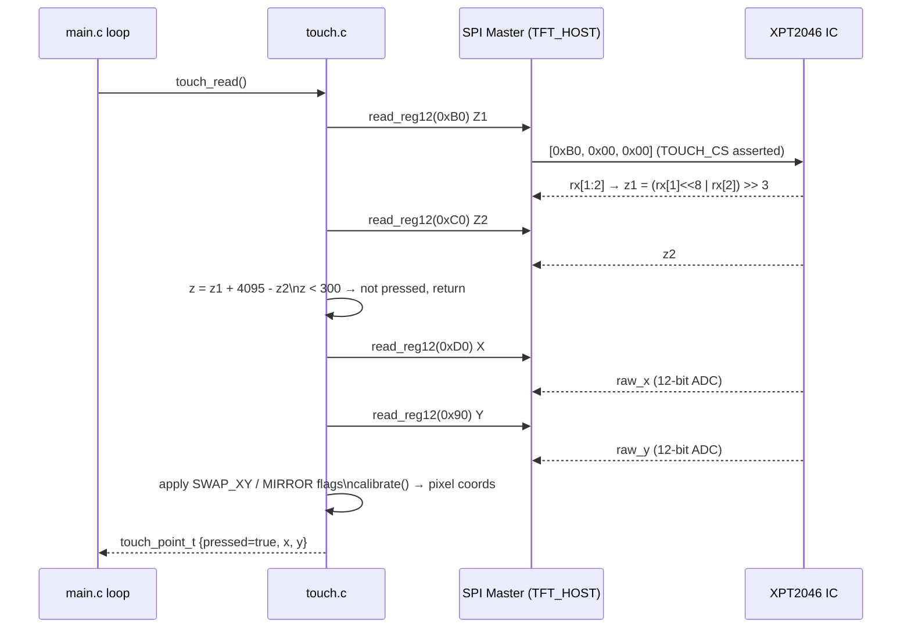
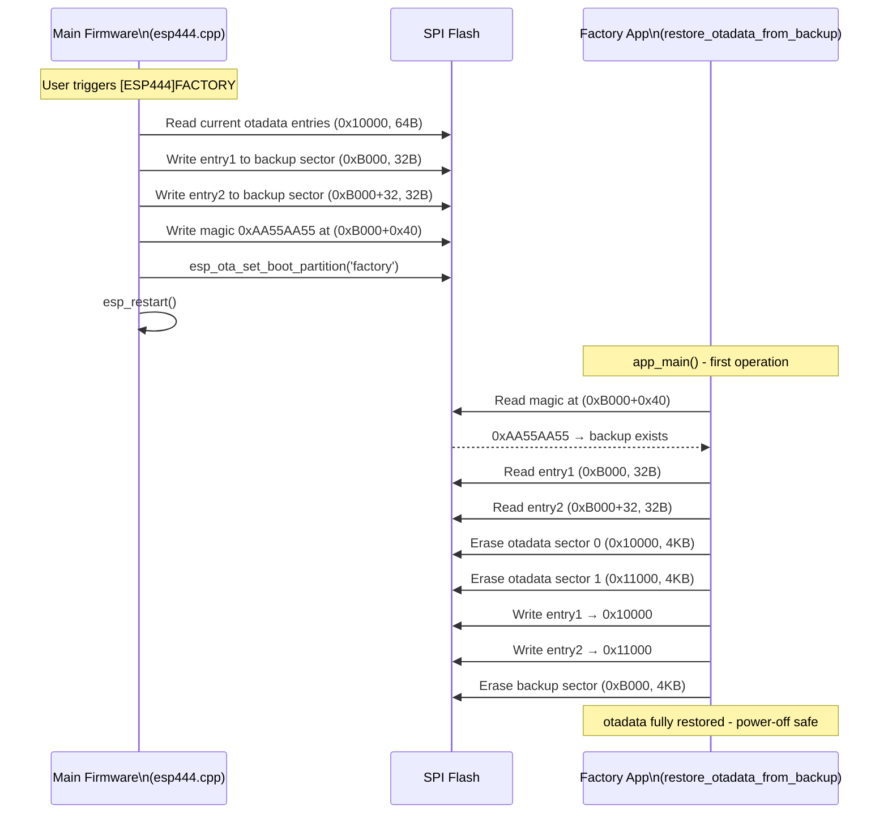
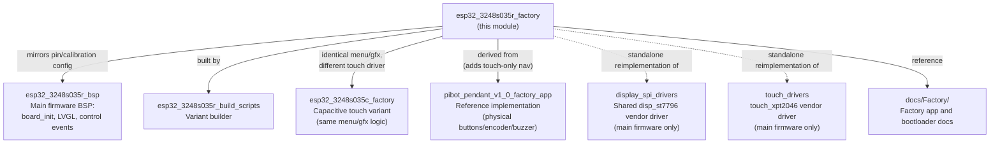

# esp32_3248s035r_factory

## Overview

The `esp32_3248s035r_factory` module is the **factory/recovery partition application** for the ESP32-3248S035R board — a 3.5″ 320×480 display board with a **resistive XPT2046 touchscreen** (the `-r` suffix distinguishes it from the capacitive `-c` variant). It runs as an independent, standalone ESP-IDF C application with no LVGL dependency, occupying the `factory` OTA slot in flash and providing a touch-navigable recovery menu.

The recovery app is entered exclusively via a **software trigger** from the main firmware (`[ESP444]FACTORY` command). Unlike the [pibot_pendant_v1_0](pibot_pendant_v1_0_factory_app.md) board, the ESP32-3248S035R has **no physical button held at boot**, so there is no custom bootloader hook. The main firmware backs up `otadata` before switching partitions, and the factory app restores it on startup.

Its four core responsibilities are:

1. **Restore the OTA pointer** on startup so power-cycling from recovery always returns to the correct application partition.
2. **Flash firmware** (`esp3dfw.bin`) from SD card into `app0` or `app1`.
3. **Flash UI resources** (`ui_resources.bin`) from SD card into the `ui_resources` partition.
4. **Boot-partition selection** — manually switch between `app0` and `app1`.

---

## Architecture



### Key Architectural Decisions

| Decision | Rationale |
|---|---|
| No LVGL dependency | Recovery must boot even if the main firmware or `ui_resources` partition is corrupt. Full independence is mandatory. |
| Shared SPI bus (display + touch) | XPT2046 is wired to the same hardware SPI bus as the ST7796 on this board, using its own CS pin. The factory driver mirrors the main firmware's wiring exactly. |
| All peripheral pins default to `GPIO_NUM_NC` | Code paths for buttons, encoder, and buzzer are identical to pibot_pendant_v1_0. Guards on `GPIO_IS_VALID_GPIO()` make those subsystems silent no-ops without `#ifdef` clutter. |
| OTA data backup sector at `0xB000` | Below the partition table (0xC000), 4 KB-aligned, no partition overlap. Requires `CONFIG_SPI_FLASH_DANGEROUS_WRITE_ALLOWED=y` because ESP-IDF rejects sub-partition-table writes by default. |
| Touch-only navigation | Virtual Up/Down/OK buttons are drawn at the bottom of the screen; `touch_hint_hit_test()` maps full-width tap columns to button IDs, making them easy to tap on the small display. |

---

## Component Dependency Graph



---

## File Structure

```
boards/esp32_3248s035r/Factory/main/
├── main.c            ← Recovery menu, OTA logic, input dispatch
├── st7796.c          ← ST7796 SPI display driver (standalone, no esp_lcd)
├── gfx.c             ← Minimal graphics: fill, lines, text, snapshot
├── touch.c           ← XPT2046 resistive touch (shared SPI bus)
├── touch.h           ← touch_point_t struct, API declarations
├── buttons.c         ← GPIO button driver with debounce
├── encoder.c         ← PCNT-based rotary encoder
├── buzzer.c          ← Bit-bang buzzer (short feedback beep)
├── sdcard.c          ← SPI SD card VFS FAT mount/unmount
└── factory_log.h     ← Compile-time debug log gate (FACTORY_LOGD)
```

---

## Module Components

### `main.c` — Recovery Application

The top-level application. Orchestrates the boot sequence, builds the menu, drives the main input loop, and implements all flash operations.

#### Boot Sequence



**OTA data restore** (`restore_otadata_from_backup`): Reads the magic word `0xAA55AA55` from offset `+0x40` inside the backup sector at `0xB000`. If found, copies the two 32-byte `otadata` entries back to `0x10000` (erasing those sectors first), then erases the backup sector. This runs before display initialization — even a display failure after restore leaves the flash in a consistent state.

#### Menu System

The menu is a static array of `menu_item_t` structs built at boot. Items are conditionally added based on the partition map and SD card contents detected at startup:

| Menu Item | Condition | Action |
|---|---|---|
| Boot app0 | always | `MENU_ACTION_BOOT_APP0` |
| Boot app1 | `app1` partition present in flash | `MENU_ACTION_BOOT_APP1` |
| SD → app0 | always | `MENU_ACTION_SD_UPDATE_APP0` |
| SD → app1 | `app1` partition present in flash | `MENU_ACTION_SD_UPDATE_APP1` |
| SD → resources | always | `MENU_ACTION_SD_UPDATE_RES` |

Navigation calls `menu_move(±1)`, which wraps around at list boundaries. The selected item is highlighted with a blue box (`MENU_HIGHLIGHT`) and bright blue text (`MENU_HIGHLIGHT_TXT`). SD file indicators (`FW` / `RES`) appear in the header zone.

#### Input Dispatch

All three input sources converge on a single `dispatch_button()` call:



**Touch feedback**: On a tap, `draw_button_hint_pressed(vbtn)` recolors the circle to violet, `buzzer_beep_short()` provides audible feedback (no-op here), an 80 ms delay gives visual dwell time, then `draw_button_hints()` redraws the bar in normal colors before `dispatch_button()` executes the action.

#### Firmware Flash State Machine



Resource flashing (`action_sd_update_res`) follows the same pattern using `esp_partition_erase_range` + `esp_partition_write` instead of the OTA API, targeting the `ui_resources` data partition by name. Both operations rename the source file on the SD card on completion: `.bin` → `.ok` (success) or `.bin` → `.bad` (failure).

#### Screen Layout (320×480 portrait)

```
┌──────────────────────────────────────┐  y=0
│  ╔══════════════════════════════╗    │
│  ║    Recovery vX.Y.Z          ║    │  title at y=13
│  ╚══════════════════════════════╝    │
│  ─────────────────────────────────  │  y=40
│  Active: app0                        │  y=53
│  SD: FW  RES                         │  y=81
│  ─────────────────────────────────  │  y=104
│                                      │
│  ┌──────────────────────────────┐   │  MENU_START_Y=111
│  │ ▶  Boot app0                 │   │  item height=40px
│  └──────────────────────────────┘   │
│     SD -> app0                       │
│     SD -> resources                  │
│  ─────────────────────────────────  │  STATUS_Y-7
│        Power off to cancel           │  STATUS_Y (or status msg)
│  ─────────────────────────────────  │  BTN_HINT_BASE_Y
│   ⬆ (Up)    ⬇ (Down)    ✓ (OK)    │  virtual touch buttons
└──────────────────────────────────────┘  y=480
```

Font: 11×21 px embedded bitmap (`font11x21`). Virtual button circles have radius 27 px, but the tap zones span the **full width in three equal columns** (~107 px each) for easy touch targeting.

#### Snapshot Feature (`ENABLE_SNAPSHOT`)

When compiled with `ENABLE_SNAPSHOT`, pressing the BOOT button (GPIO0) triggers a raw screen capture to SD card. `gfx_snapshot_begin(filepath)` opens the file and writes an 8-byte header (width + height as LE uint32), pre-filled with black. All subsequent `gfx_flush()` calls write pixel data (byte-swapped back to native RGB565) into the file alongside the display. `gfx_snapshot_end()` closes the file. Files are named `snap000.raw`, `snap001.raw`, etc., and can be converted to PNG with `tools/images_converter/raw2png.py`.

---

### `st7796.c` — ST7796 SPI Display Driver

A standalone, minimal SPI master driver for the ST7796 TFT controller. It does **not** use `esp_lcd` or any ESP3D logging — intentionally self-contained so the factory app has no dependency on main firmware components.

| Function | Description |
|---|---|
| `st7796_init()` | Free+reinitialize SPI bus (TFT_HOST), attach device, hardware reset via RST pin, send init sequence: sleep-out, MADCTL, pixel format 0x55, gamma tuning |
| `st7796_backlight(bool on)` | Drive `TFT_LED` GPIO high (on) or low (off) |
| `st7796_flush(x0,y0,x1,y1,data,len)` | Set column address (0x2A) + row address (0x2B) windows, send 0x2C pixel data in 4096-byte DMA chunks |
| `lcd_cmd(uint8_t cmd)` | Pull DC low, transmit 1-byte command via SPI polling |
| `lcd_data(uint8_t *data, int len)` | Pull DC high, transmit N bytes via SPI polling |
| `lcd_data_byte(uint8_t val)` | Single-byte convenience wrapper for `lcd_data` |

**MADCTL orientation mapping**: The board requires MADCTL `0x88` (portrait, mirror-Y only). The init sequence selects from a 4-entry `rotation_map[]` indexed by `SCREEN_ROTATION` from `hw_config.h`. This matches the main BSP's correction: `esp_lcd_panel_mirror(handle, false, true)` applied after `st7796_spi_configure()`.

**SPI bus cleanup on re-entry**: `spi_bus_free(TFT_HOST)` is called before `spi_bus_initialize()` to discard state left by the previous firmware image. This is safe if the bus was never initialized.

> **See also:** [`display_spi_drivers.md`](display_spi_drivers.md) for the shared `disp_st7796` vendor driver used by the main firmware. The factory driver's init sequence is derived from that source but reimplemented without the `esp_lcd` panel abstraction.

---

### `gfx.c` — Minimal Graphics Library

A row-oriented, framebuffer-free graphics library. All drawing sends pixel data directly to `st7796_flush()` line by line, using a single static `line_buf[SCREEN_WIDTH]` — no heap allocation.

#### Drawing API

| Function | Description |
|---|---|
| `gfx_init()` | No-op (framebuffer-free design; snapshot is on-demand) |
| `gfx_clear(color)` | Fill entire 320×480 screen with one color, line by line |
| `gfx_fill_rect(x,y,w,h,color)` | Filled rectangle with screen boundary clipping |
| `gfx_rect(x,y,w,h,color)` | Outline rectangle via 4 `hline`/`vline` calls |
| `gfx_hline(x,y,w,color)` | Horizontal line using `line_buf` |
| `gfx_vline(x,y,h,color)` | Vertical line, one `flush` call per pixel |
| `gfx_draw_char(x,y,c,fg,bg)` | Render one 11×21 character from embedded bitmap font |
| `gfx_draw_string(x,y,str,fg,bg)` | Render null-terminated string, stops at screen edge |
| `gfx_snapshot_begin(path)` | Open SD file, write 8-byte header, pre-fill with black |
| `gfx_snapshot_end()` | Close snapshot file |
| `gfx_snapshot_is_capturing()` | Returns `true` while a snapshot file is open |

**Color encoding**: Colors are passed as native RGB565 host-endian. The library byte-swaps internally (`swapped = (c >> 8) | (c << 8)`) before sending to SPI. The `GFX_RGB565(r,g,b)` macro packs 5/6/5 bits.

**Snapshot pixel write path** (`snap_write`): Receives byte-swapped pixel data (as sent to SPI), un-swaps each pixel back to native RGB565, then `fseek`s to the correct file position (`8 + row × SCREEN_WIDTH × 2 + col × 2`) and writes. This allows capturing while simultaneously driving the display.

---

### `touch.c` / `touch.h` — XPT2046 Resistive Touch Driver

Unlike [`esp32_2432s028r`](esp32_2432s028r.md) which uses a dedicated bit-banged SPI bus for the XPT2046, the ESP32-3248S035R routes the XPT2046 to the **same hardware SPI bus** as the ST7796, with its own CS pin (`TOUCH_SPI_CS_PIN`). The touch device is added as a second SPI slave via `spi_bus_add_device()` after `st7796_init()` has initialized the bus.

#### Data Types

```c
typedef struct {
    bool    pressed;   // true if touch detected above pressure threshold
    int16_t x;         // calibrated screen X coordinate [0, SCREEN_WIDTH)
    int16_t y;         // calibrated screen Y coordinate [0, SCREEN_HEIGHT)
} touch_point_t;
```

#### Touch Read Data Flow



**Pressure detection**: Uses the formula `z = Z1 + 4095 − Z2`. A threshold of 300 discriminates real touches from noise.

**Calibration** (`calibrate()`): Linear mapping from the raw 12-bit ADC range `[TOUCH_CALIBRATION_X_MIN, TOUCH_CALIBRATION_X_MAX]` to screen pixels `[0, SCREEN_WIDTH]`. Constants and swap/mirror flags are defined in `hw_config.h`.

**`read_reg12(cmd)`**: A full-duplex 24-bit transaction — command byte followed by two dummy bytes — clocks in the 16-bit response, then `>> 3` extracts the 12-bit ADC value. This matches the convention used by the main BSP's `touch_xpt2046_def.h::touch_xpt2046_spi_read_reg12`.

> **Resistive vs capacitive**: The `-r` variant requires calibration constants and pressure detection. The capacitive `-c` variant ([esp32_3248s035c_factory.md](esp32_3248s035c_factory.md)) reports pixel coordinates directly and needs no calibration.

---

### `buttons.c` — GPIO Button Driver

Supports up to three buttons (`BTN_1`, `BTN_2`, `BTN_3`) mapped to GPIO pins from `hw_config.h`. On the ESP32-3248S035R, all button pins are `GPIO_NUM_NC`.

| Function | Description |
|---|---|
| `buttons_init()` | Compute `pin_mask`; skip GPIO config entirely if mask is 0 |
| `button_is_pressed(btn)` | Returns `true` if GPIO level is LOW (active-low); guards invalid pins |
| `button_wait_press(timeout_ms)` | Poll at 20 ms intervals; debounce 50 ms; wait for release; return ID or `BTN_NONE`. `timeout_ms=0` means infinite. |
| `pin_bit(gpio_num)` | Returns `1ULL << pin` if valid, else `0ULL` — avoids UB from negative shift on `GPIO_NUM_NC` |

The 100 ms timeout used in the main loop keeps the encoder and touch polling responsive even when no button is pressed.

---

### `encoder.c` — Rotary Encoder Driver

Uses ESP-IDF's **PCNT** (pulse counter) peripheral for quadrature decoding. Two channels are configured:
- **Channel A**: edges on `ENCODER_A_PIN`, level from `ENCODER_B_PIN`
- **Channel B**: edges on `ENCODER_B_PIN`, level from `ENCODER_A_PIN`

Quadrature decode: channel A increases on rising edge when B is low, decreases on falling; channel B inverts that. A 1000 ns glitch filter matches the main firmware's PCNT configuration.

`encoder_read()` returns accumulated **detent clicks** (`raw_count / PULSES_PER_DETENT`, default 4) since the last call, then clears the counter. In the main loop, clockwise rotation maps to `menu_move(-1)` (up) and counter-clockwise to `menu_move(+1)` (down).

On the ESP32-3248S035R, both encoder pins are `GPIO_NUM_NC`: `encoder_init()` returns `ESP_OK` immediately and `encoder_read()` always returns 0.

---

### `buzzer.c` — Bit-Bang Buzzer

Generates a short square-wave beep via direct GPIO toggling (no PWM/LEDC). Parameters: 2700 Hz, 40 ms duration (~108 half-period cycles). `buzzer_beep_short()` uses `esp_rom_delay_us()` — a **blocking call (~40 ms)**, used only for touch-press feedback where a brief stall is acceptable.

On the ESP32-3248S035R, `BUZZER_PIN` is `GPIO_NUM_NC` — both functions are guarded by `GPIO_IS_VALID_GPIO()` and become silent no-ops.

---

### `sdcard.c` — SPI SD Card Driver

Mounts a FAT filesystem on the SD card via `sdspi_host`. The SPI bus is initialized once (`spi_bus_inited` flag) and reused across mount/unmount cycles. The SD SPI host (`SD_SPI_HOST`) is distinct from the display host (`TFT_HOST`).

| Function | Description |
|---|---|
| `sdcard_mount()` | Initialize SPI bus (once), configure device CS + frequency, call `esp_vfs_fat_sdspi_mount()` at `/sdcard` |
| `sdcard_unmount()` | Call `esp_vfs_fat_sdcard_unmount()`, set `card = NULL`; SPI bus stays initialized to avoid interfering with TFT SPI |

After a successful mount, standard POSIX file I/O works at `/sdcard/`. This is how all firmware and resource files are accessed.

---

### `factory_log.h` — Debug Log Gate

A compile-time log gate, controlled independently of `sdkconfig` log levels via the `ENABLE_FACTORY_DEBUG_LOG` CMake option.

```c
// Enabled only when ENABLE_FACTORY_DEBUG_LOG=ON
#if FACTORY_LOG_LEVEL
    #define FACTORY_LOGD(tag, fmt, ...) ESP_LOGI(tag, fmt, ##__VA_ARGS__)
#else
    #define FACTORY_LOGD(tag, fmt, ...) do {} while (0)
#endif
```

`factory_log_silence_sd_stack()` mutes 8 SD/FAT/SDMMC log tags at runtime via `esp_log_level_set(..., ESP_LOG_NONE)`. This is required in debug builds (`FACTORY_LOG_LEVEL=1` raises the sdkconfig log ceiling) to prevent the SD stack's internal verbosity from obscuring the factory app's own logs. Called as the very first operation in `app_main()`.

---

## OTA Data Backup / Restore Mechanism

The most critical invariant of the recovery system. The interaction between the main firmware and the factory app must be perfectly symmetric.



**`OTADATA_BACKUP_OFFSET` constraint checklist (`0xB000`)**:
- After bootloader end ✓
- Before partition table (`CONFIG_PARTITION_TABLE_OFFSET = 0xC000`) ✓
- No partition overlap (first partition = NVS at 0xD000) ✓
- 4 KB-aligned ✓

**`CONFIG_SPI_FLASH_DANGEROUS_WRITE_ALLOWED=y`** must be set in the factory `sdkconfig`. `esp_flash_erase_region(NULL, 0xB000, ...)` targets an address below the first partition — ESP-IDF aborts this by default.

> **Porting note:** When adapting this factory app to a new board, `OTADATA_BACKUP_OFFSET` must be recalculated for that board's flash layout, and the **same value** must appear in both this file and the main firmware's `esp444.cpp`.

---

## Differences from the Capacitive Variant (`esp32_3248s035c`)

| Aspect | `esp32_3248s035r` (this module) | `esp32_3248s035c` |
|---|---|---|
| Touch controller | XPT2046 (resistive, SPI) | Capacitive (I²C or dedicated SPI) |
| Touch SPI bus | **Shared** with display (TFT_HOST, 2nd CS pin) | Separate interface |
| Touch calibration | `calibrate()` linear rescale from `hw_config.h` ADC constants | Not required |
| Pressure detection | `z = Z1 + 4095 − Z2`, threshold 300 | Not applicable |
| `touch_init()` | `spi_bus_add_device()` on TFT_HOST | Different initialization |
| Display driver (`st7796.c`) | MADCTL `0x88`, mirror-Y via `rotation_map[]` | Same orientation logic |
| Custom bootloader | None | None |
| `main.c`, `gfx.c`, `buttons.c`, `encoder.c`, `buzzer.c`, `sdcard.c` | Identical to `esp32_3248s035c` | Identical to `esp32_3248s035r` |

> **See also:** [`esp32_3248s035c_factory.md`](esp32_3248s035c_factory.md)

---

## Build System Integration

> **See also:** [`esp32_3248s035r_build_scripts.md`](esp32_3248s035r_build_scripts.md) for the full variant build system.

The factory app is built from `boards/esp32_3248s035r/Factory/` as a separate ESP-IDF project via `build_scripts/build_one.py`. Key CMake options:

| CMake Option | Default | Effect |
|---|---|---|
| `ENABLE_FACTORY_DEBUG_LOG` | OFF | ON: sets `FACTORY_LOG_LEVEL=1`, enables `FACTORY_LOGD`, raises sdkconfig log ceiling |
| `ENABLE_SNAPSHOT` | OFF | ON: enables GPIO0 snapshot trigger and all `gfx_snapshot_*` functions; requires SD card |
| `ENABLE_CUSTOM_BOOT_LOADER` | OFF | Must remain OFF — this board has no physical button to hold at boot |

`build_variant()` in `common.py` runs CMake, generates UI resources, copies factory artifacts to the installer directory, packages the `ui_resources_kit`, and logs binary sizes.

---

## Relationship to Other Modules



- **[`esp32_3248s035r_bsp.md`](esp32_3248s035r_bsp.md)**: Main firmware BSP for the same hardware — includes LVGL, `board_init()`, `touch_calibrate()`, and `control_events_init()`. The factory app deliberately avoids this dependency.
- **[`esp32_3248s035c_factory.md`](esp32_3248s035c_factory.md)**: The capacitive-touch sibling board's factory app. Only `touch.c` (and minor orientation details) differ.
- **[`pibot_pendant_v1_0_factory_app.md`](pibot_pendant_v1_0_factory_app.md)**: The reference implementation that established the shared recovery pattern. Physical buttons, encoder, and buzzer are populated on that board; the 3248S035R version preserves those code paths as silent no-ops via `GPIO_IS_VALID_GPIO()` guards.
- **[`display_spi_drivers.md`](display_spi_drivers.md)**: The shared `disp_st7796` ESP-LCD vendor driver used by the main firmware. The factory `st7796.c` reimplements the same init sequence without that framework.
- **[`touch_drivers.md`](touch_drivers.md)**: The `touch_xpt2046` vendor driver used by the main BSP. The factory `touch.c` is a simpler reimplementation using plain `spi_master`.
