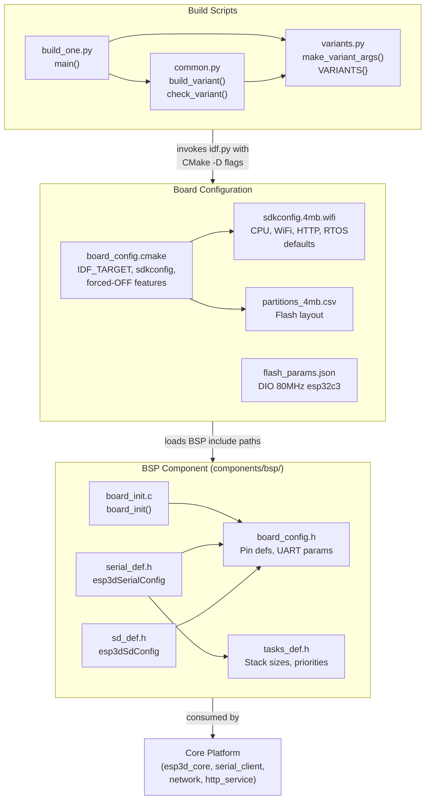
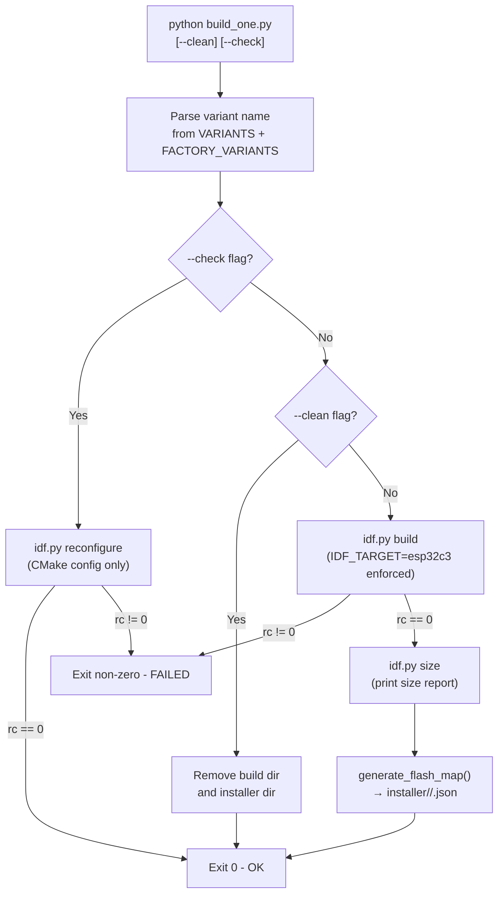
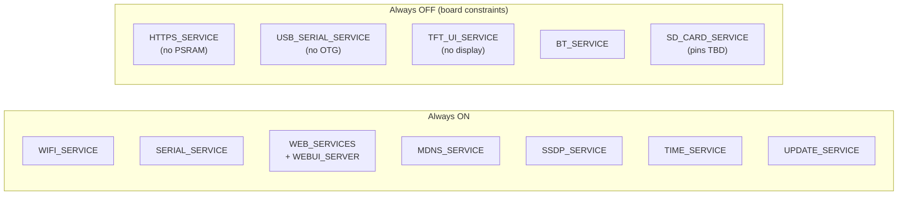
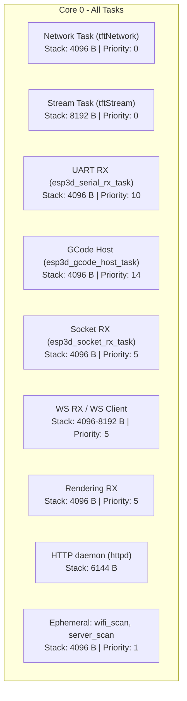

# ESP32_C3_BARE Board Module

The **ESP32_C3_BARE** board support module provides build scripts, BSP definitions, and hardware configuration for a minimal ESP32-C3-based WiFi-to-serial bridge. Unlike the display-equipped boards in this repository (see [pibot_pendant_v1_0_bsp.md](pibot_pendant_v1_0_bsp.md) or [esp32_3248s035r.md](esp32_3248s035r.md)), this board is **headless**: it carries no TFT, no touch controller, and no LVGL UI. Its sole purpose is to bridge a CNC controller (Grbl / grblHAL / FluidNC) over UART to a remote Web UI client over WiFi.

---

## Table of Contents

1. [Purpose and Scope](#1-purpose-and-scope)
2. [Hardware Profile](#2-hardware-profile)
3. [Module Architecture](#3-module-architecture)
4. [BSP Component](#4-bsp-component)
5. [Build System](#5-build-system)
6. [Build Variants](#6-build-variants)
7. [Flash Layout](#7-flash-layout)
8. [FreeRTOS Task Map](#8-freertos-task-map)
9. [Feature Constraints](#9-feature-constraints)
10. [Build Workflow](#10-build-workflow)
11. [Capability Comparison with Other Boards](#11-capability-comparison-with-other-boards)
12. [Related Documentation](#12-related-documentation)

---

## 1. Purpose and Scope

The ESP32-C3-BARE acts as a **headless WiFi bridge** between a host PC running the Web UI and a CNC machine connected via UART serial. The architecture is deliberately minimal:

- **WiFi** → serves the embedded Web UI, handles HTTP + WebSocket, mDNS, SSDP, and OTA updates.
- **Serial (UART0)** → forwards GCode commands to the CNC controller and relays responses back.

There is no local user interface of any kind. All user interaction happens remotely through a browser.


---

## 2. Hardware Profile

| Property | Value |
|---|---|
| SoC | ESP32-C3 (single-core RISC-V, 160 MHz) |
| Flash | 4 MB (DIO, 80 MHz) |
| PSRAM | None |
| Display | None (headless) |
| Touch | None |
| Bluetooth | Not used (WiFi-only variants) |
| USB | USB-JTAG/CDC only (no USB OTG) |
| UART (CNC) | UART0 — TX: GPIO21, RX: GPIO20 |
| UART baud | 115200, 8N1, no flow control |
| SD card | SPI via multiplexer — **pins TBD, implementation deferred** |
| Board hostname | `ESP32-C3-BARE` |
| WiFi fallback | Mode 1 (stay in STA on connection failure) |
| Board name str | `"ESP32-C3-BARE"` |
| Board version | `"v1.0"` |

---

## 3. Module Architecture

### 3.1 Repository Directory Layout

```
boards/ESP32_C3_BARE/
├── board_config.cmake          # IDF_TARGET, sdkconfig selection, feature overrides
├── flash_params.json           # esptool flash parameters (chip, mode, freq, reset)
├── partitions_4mb.csv          # Single-OTA partition table for 4MB flash
├── sdkconfig.4mb.wifi          # Default sdkconfig for 4MB WiFi build
├── build_scripts/
│   ├── build_one.py            # CLI entry-point: build or check a single variant
│   ├── common.py               # Shared build helpers: build_variant, check_variant
│   └── variants.py             # Variant definitions and make_variant_args()
└── components/
    └── bsp/
        ├── CMakeLists.txt      # BSP IDF component registration
        ├── board_config.h      # Pin assignments and hardware constants
        ├── board_init.h / .c   # board_init(), board_get_name(), board_get_version()
        ├── serial_def.h        # Extern declaration of esp3dSerialConfig
        ├── sd_def.h            # SD card config (SPI via multiplexer, pins NC)
        └── tasks_def.h         # FreeRTOS task sizes, priorities, and buffer sizes
```

### 3.2 Component Relationships



---

## 4. BSP Component

The BSP for this board is intentionally minimal — there is no display, no touch controller, no encoder, and no factory recovery application.

### 4.1 `board_init.c`

```c
esp_err_t board_init(void)       // logs board name and returns ESP_OK
const char* board_get_name()     // returns "ESP32-C3-BARE"
const char* board_get_version()  // returns "v1.0"
```

Compared to display-equipped boards (which call `init_lvgl()`, `init_touch_controller()`, `lvgl_flush_cb()`, etc.), this BSP does no peripheral initialization at start-up. All hardware the firmware needs (UART, WiFi, HTTP stack) is initialized by the respective modules in the core platform.

### 4.2 `board_config.h` — Pin Assignments

| Constant | Value | Description |
|---|---|---|
| `UART_TX_PIN` | `GPIO_NUM_21` | UART0 TX → CNC RX |
| `UART_RX_PIN` | `GPIO_NUM_20` | UART0 RX ← CNC TX |
| `UART_BAUD_RATE_BPS` | `115200` | Default CNC baud rate |
| `UART_PORT_IDX` | `UART_NUM_0` | Hardware UART port |
| `UART_RX_BUFFER_SIZE` | `512` | UART RX ring buffer |
| `UART_RX_FLUSH_TIMEOUT` | `1500` ms | Idle flush timeout |
| `SD_MISO/MOSI/CLK/CS` | `GPIO_NUM_NC` | **Not connected — SD deferred** |
| `SD_SPI_FREQ_KHZ` | `4000` | SPI frequency when SD is implemented |

### 4.3 `tasks_def.h` — FreeRTOS Sizing

Because the ESP32-C3 is **single-core**, all tasks use Core 0. There is no Core 1 / Core 0 separation that exists on the dual-core boards (Xtensa / ESP32-S3).

See [§8 FreeRTOS Task Map](#8-freertos-task-map) for the full table.

### 4.4 `sd_def.h` — SD Card (Deferred)

The SD card uses SPI via a multiplexer. All four SPI pins are currently `GPIO_NUM_NC`. The configuration struct `esp3dSdConfig` is present and correctly typed, but the hardware is not yet wired. Do not enable `SD_CARD_SERVICE` until the multiplexer design is finalized and pins are assigned.

### 4.5 CMake Dependencies

The BSP component declares the following IDF component requirements:

```
esp_timer  |  esp3d_log  |  nvs_flash  |  driver  |  esp3d_activity_manager
```

No LVGL, no display driver, and no touch driver dependencies exist.

---

## 5. Build System

### 5.1 Script Responsibilities

| Script | Role |
|---|---|
| `build_one.py` | CLI entry point: parses variant name and flags, dispatches to `build_variant()` or `check_variant()` |
| `common.py` | Low-level build engine: invokes `idf.py`, enforces `IDF_TARGET=esp32c3`, manages build directories, generates flash map |
| `variants.py` | Data layer: defines `VARIANTS` dict and `make_variant_args()` factory |

### 5.2 `make_variant_args()` Pattern

All CMake options listed in `ROOT_CMAKE_OPTIONS` are set to `OFF` first, then the flags specific to each variant are switched `ON`. This explicit whitelist-then-enable pattern prevents stale or inherited CMake cache values from activating unintended features.

```python
DEFAULT_OFF_CMAKE_ARGS = ["-D", "OPTION_A=OFF", "-D", "OPTION_B=OFF", ...]

def make_variant_args(*on_flags):
    args = DEFAULT_OFF_CMAKE_ARGS.copy()
    for flag in on_flags:          # e.g. "WIFI_SERVICE=ON"
        args.extend(["-D", flag])
    return args
```

### 5.3 Build Flow



### 5.4 IDF Target Enforcement

`common.py` writes a `.idf_target` marker file in the build directory. On the next invocation, if the cached target differs from `"esp32c3"`, the entire build directory is **deleted** before reconfiguring. This prevents subtle cross-target CMake cache corruption.

```python
EXPECTED_IDF_TARGET = "esp32c3"

def _ensure_clean_build_dir(build_dir):
    marker = os.path.join(build_dir, ".idf_target")
    if os.path.isdir(build_dir):
        cached = open(marker).read().strip() if os.path.isfile(marker) else None
        if cached != EXPECTED_IDF_TARGET:
            shutil.rmtree(build_dir)   # wipe stale build
```

### 5.5 Production vs. Development Builds

| Flag | Effect |
|---|---|
| *(default)* | `PROD_BUILD=ON` injected automatically |
| `--dev` passed to the script | `PROD_BUILD` not added — debug logging and asserts are active |

### 5.6 Parallel Build Support

The `--jobs=N` argument is forwarded via `CMAKE_BUILD_PARALLEL_LEVEL` (not via `idf.py -j`, which is unsupported). This is passed down by `build_mgr.py` when orchestrating multi-board parallel builds (see [tools_build_scripts.md](tools_build_scripts.md)).

### 5.7 Output Directories

```
<repo_root>/
├── build/
│   ├── c3_4mb_wifi_grblhal/     ← idf.py build output
│   ├── c3_4mb_wifi_grbl/
│   └── c3_4mb_wifi_fluidnc/
└── installer/
    └── ESP32_C3_BARE_4MB_wifi_<firmware>/
        └── ESP32_C3_BARE_4MB_wifi_<firmware>.json   ← flash map
```

---

## 6. Build Variants

This board has **no factory variants** (`FACTORY_VARIANTS = {}`). There is no custom bootloader, no factory recovery application, and no OTA-data backup/restore mechanism at boot — all of which exist in full-pendant boards like `pibot_pendant_v1_0`.

### 6.1 Variant Reference

| Variant name | CNC firmware | WiFi | Serial | mDNS | SSDP | WebUI | Time | Update | Build dir |
|---|---|---|---|---|---|---|---|---|---|
| `4mb_wifi_grblhal` | grblHAL | ✓ | ✓ | ✓ | ✓ | ✓ | ✓ | ✓ | `build/c3_4mb_wifi_grblhal` |
| `4mb_wifi_grbl` | Grbl | ✓ | ✓ | ✓ | ✓ | ✓ | ✓ | ✓ | `build/c3_4mb_wifi_grbl` |
| `4mb_wifi_fluidnc` | FluidNC | ✓ | ✓ | ✓ | ✓ | ✓ | ✓ | ✓ | `build/c3_4mb_wifi_fluidnc` |

All three variants share an identical feature set — the only difference is the `TARGET_FW_*` flag, which determines which CNC response parser and GCode flow-control logic is compiled in. Refer to [cnc_grbl.md](cnc_grbl.md), [cnc_grblhal.md](cnc_grblhal.md), and [cnc_fluidnc.md](cnc_fluidnc.md) for the parser-level differences.

### 6.2 Enabled Feature Set (All Variants)



---

## 7. Flash Layout

The partition scheme uses a **single OTA slot** with no `ota_1` partition, trading redundant-update safety for a larger application region and a large SPIFFS volume for WebUI assets and user files.

```
4MB Flash (0x000000 – 0x3FFFFF)
┌─────────────────────────────────────────────────────────────────┐
│ 0x0000  – 0x8FFF  │  Bootloader + Partition Table  (36 KB)      │
├─────────────────────────────────────────────────────────────────┤
│ 0x9000  – 0xBFFF  │  nvs          (12 KB)                       │
├─────────────────────────────────────────────────────────────────┤
│ 0xC000  – 0xDFFF  │  otadata      ( 8 KB)                       │
├─────────────────────────────────────────────────────────────────┤
│ 0x10000 – 0x1CFFF │  app0 / ota_0  (1.75 MB)  ← firmware image │
├─────────────────────────────────────────────────────────────────┤
│ 0x1D0000– 0x3FFFFF│  flashfs (SPIFFS)  (2.1875 MB) ← WebUI     │
└─────────────────────────────────────────────────────────────────┘
```

> **Note:** There is no `ota_1` partition. OTA updates overwrite `ota_0` directly. If an update is interrupted, the device may not boot until re-flashed via USB.

### Flash Parameters (`flash_params.json`)

| Parameter | Value |
|---|---|
| chip | `esp32c3` |
| flash_mode | `dio` |
| flash_freq | `80m` |
| before | `default_reset` |
| after | `hard_reset` |

---

## 8. FreeRTOS Task Map

The ESP32-C3 is **single-core** — all tasks are pinned to Core 0. There is no LVGL task (Core 1), no UI rendering task, and no display flush interrupt. The scheduling model is simpler than dual-core boards.



### Task Size Reference

| Task | Stack | Priority | Core |
|---|---|---|---|
| Network (`tftNetwork`) | 4096 B | 0 | 0 |
| Stream (`tftStream`) | 8192 B | 0 | 0 |
| UART RX | 4096 B | 10 | 0 |
| GCode host | 4096 B | 14 | 0 |
| Socket RX | 4096 B | 5 | 0 |
| WS RX | 4096 B | 5 | 0 |
| WS client | 8192 B | 5 | 0 |
| Rendering RX | 4096 B | 5 | 0 |
| HTTP daemon | 6144 B | — | 0 |
| wifi_scan / server_scan | 4096 B | 1 | 0 |

**Chunk size:** `STREAM_CHUNK_SIZE = 1024 B` (no PSRAM; scales up on PSRAM-equipped boards).

**HTTP limits (no PSRAM):**

| Constant | Value |
|---|---|
| `ESP3D_HTTP_MAX_OPEN_SOCKETS` | 4 |
| `ESP3D_HTTP_BACKLOG` | 4 |
| `ESP3D_HTTP_STACK_SIZE` | 6144 B |
| `ESP3D_HTTP_UPLOAD_READ_SIZE` | 256 B |
| `ESP3D_HTTP_UPLOAD_WRITE_SIZE` | 256 B |
| `ESP3D_HTTP_HEADER_MAX_LEN` | 300 B |

---

## 9. Feature Constraints

The following features are **permanently disabled** by `board_config.cmake` regardless of the CMake flags passed by the caller:

| Feature flag | Reason forced OFF |
|---|---|
| `HTTPS_SERVICE` | TLS buffers (~50 KB/connection) require PSRAM — C3 has none |
| `USB_SERIAL_SERVICE` | ESP32-C3 has USB-JTAG/CDC only; no USB OTG peripheral |
| `TFT_UI_SERVICE` | No display hardware on this board |

The following features are **absent from all variant definitions** (OFF by omission):

| Feature | Note |
|---|---|
| `BT_SERVICE` | Not used; WiFi and BT are mutually exclusive on the C3 under RAM constraints |
| `SD_CARD_SERVICE` | SD hardware not yet wired (see [§4.4](#44-sd_defh--sd-card-deferred)) |
| `LUA_INTERPRETER_SERVICE` | Not required for a headless bridge |
| `SOCKET_CLIENT_SERVICE` | Not applicable — WiFi is the *remote* link, not the *CNC* link |
| `WS_CLIENT_SERVICE` | Not required |
| `NOTIFICATIONS_SERVICE` | Not required |
| `CAMERA_SERVICE` | No camera hardware |

For the system-wide constraints table (WiFi vs. BT, SOCKET_CLIENT vs. WEB_SERVICES, etc.), refer to [feature_resource_matrix.md](https://github.com/luc-github/Pibot-cnc-pendant-firmware/blob/main/docs/features/feature_resource_matrix.md).

---

## 10. Build Workflow

### 10.1 Prerequisites

- ESP-IDF v5.4.3 installed and sourced (or `IDF_PATH` environment variable set).
- Python 3.x available on the system path.

### 10.2 Build a Single Variant

```bash
# From the board's build_scripts directory:
python build_one.py 4mb_wifi_grblhal
python build_one.py 4mb_wifi_grbl
python build_one.py 4mb_wifi_fluidnc

# Clean build (remove build dir, then exit — no compilation):
python build_one.py 4mb_wifi_fluidnc --clean

# Config check only (CMake reconfigure, no compilation):
python build_one.py 4mb_wifi_grblhal --check

# Development build (PROD_BUILD=OFF, debug logging active):
python build_one.py 4mb_wifi_grbl --dev

# With parallel jobs (passed as CMAKE_BUILD_PARALLEL_LEVEL):
python build_one.py 4mb_wifi_grblhal --jobs=8
```

### 10.3 Build via Build Manager

```bash
# From repo root — build all variants across all boards:
python tools/build_scripts/build_mgr.py

# Target this board specifically:
python tools/build_scripts/build_mgr.py --board ESP32_C3_BARE
```

See [tools_build_scripts.md](tools_build_scripts.md) for `build_mgr.py` documentation.

### 10.4 Flash

```bash
# Using idf.py directly:
idf.py -B build/c3_4mb_wifi_grblhal flash monitor

# Using flash_mgr (after build — uses generated flash map JSON):
python tools/flash_scripts/flash_mgr.py \
    --variant-dir installer/ESP32_C3_BARE_4MB_wifi_grblhal \
    --port /dev/ttyUSB0
```

### 10.5 sdkconfig Management

The file `sdkconfig.4mb.wifi` contains the default `CONFIG_*` values for this board. It is applied **only once** — when the `build/<variant>/sdkconfig` file does not yet exist. After the first build, `menuconfig` changes are preserved across `cmake` re-runs.

To reset to board defaults:

```bash
rm build/c3_4mb_wifi_<firmware>/sdkconfig
python build_one.py <variant>
```

> **Do not edit** `build/<variant>/sdkconfig` directly for permanent changes — edit `sdkconfig.4mb.wifi` instead.

---

## 11. Capability Comparison with Other Boards

| Capability | ESP32_C3_BARE | pibot_pendant_v1_0 | esp32_2432s028r | esp32s3_8048s043c |
|---|---|---|---|---|
| SoC | ESP32-C3 (RISC-V) | ESP32-S3 | ESP32 (Xtensa) | ESP32-S3 |
| Cores | 1 | 2 | 2 | 2 |
| Flash | 4 MB | 16 MB | 4 MB | 8 MB |
| PSRAM | None | 8 MB | None | 8 MB |
| Display | None (headless) | ILI9341 SPI | ILI9341 SPI | RGB parallel |
| Touch | None | XPT2046 | XPT2046 | GT911 |
| LVGL / UI | No | Yes | Yes | Yes |
| WiFi | Yes | Yes | Yes | Yes |
| Bluetooth | Not used | BT SPP / BLE | — | — |
| HTTPS | No (no PSRAM) | Yes | No (no PSRAM) | Yes |
| USB Serial | No (no OTG) | No | No | Yes |
| Factory app | No | Yes | Yes | Yes |
| Custom bootloader | No | Yes | No | No |
| Encoder | No | Yes | No | No |
| Buzzer | No | Yes | No | Yes |

---

## 12. Related Documentation

| Document | Relevance |
|---|---|
| [feature_resource_matrix.md](https://github.com/luc-github/Pibot-cnc-pendant-firmware/blob/main/docs/features/feature_resource_matrix.md) | Feature compatibility, WiFi/CNC usage model, resource "tickets" |
| [features.md](https://github.com/luc-github/Pibot-cnc-pendant-firmware/blob/main/docs/features/features.md) | Full hardware × SKU feature matrix |
| [esp32_memory_constraints.md](https://github.com/luc-github/Pibot-cnc-pendant-firmware/blob/main/docs/guides/esp32_memory_constraints.md) | Heap, fragmentation, WiFi vs BT RAM budget |
| [board_build_guidelines.md](https://github.com/luc-github/Pibot-cnc-pendant-firmware/blob/main/docs/guides/board_build_guidelines.md) | General board build conventions |
| [tools_build_scripts.md](tools_build_scripts.md) | `build_mgr.py`, `generate_resources.py`, `flash_mgr.py` |
| [gcode_host_architecture.md](https://github.com/luc-github/Pibot-cnc-pendant-firmware/blob/main/docs/architecture/gcode_host_architecture.md) | GCode host service architecture |
| [gcode_host_streaming_flow.md](https://github.com/luc-github/Pibot-cnc-pendant-firmware/blob/main/docs/architecture/gcode_host_streaming_flow.md) | GCode streaming state machine and flow control |
| [cnc_grbl.md](cnc_grbl.md) | Grbl target: parser, response handling |
| [cnc_grblhal.md](cnc_grblhal.md) | grblHAL target: parser, flow control |
| [cnc_fluidnc.md](cnc_fluidnc.md) | FluidNC target: parser, file streaming |
| [connection_management.md](https://github.com/luc-github/Pibot-cnc-pendant-firmware/blob/main/docs/architecture/connection_management.md) | Transport lifecycle and status model |
| [mdns.md](mdns.md) | mDNS registered services reference |
| [pibot_pendant_v1_0_bsp.md](pibot_pendant_v1_0_bsp.md) | Full-pendant BSP (contrasting reference) |
| [tools.md](https://github.com/luc-github/Pibot-cnc-pendant-firmware/blob/main/docs/guides/tools.md) | Development tools (serial bridge, WebSocket test, simulators) |
