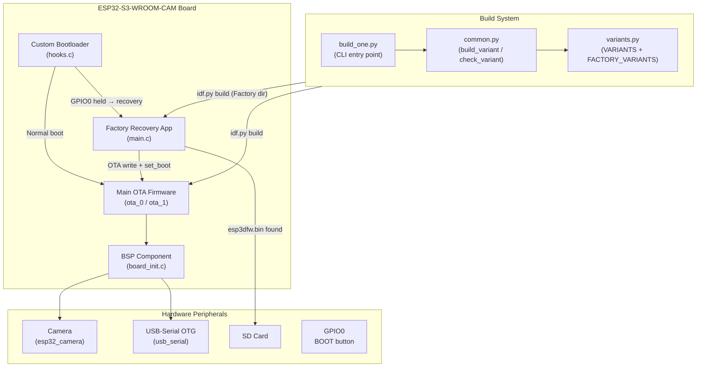
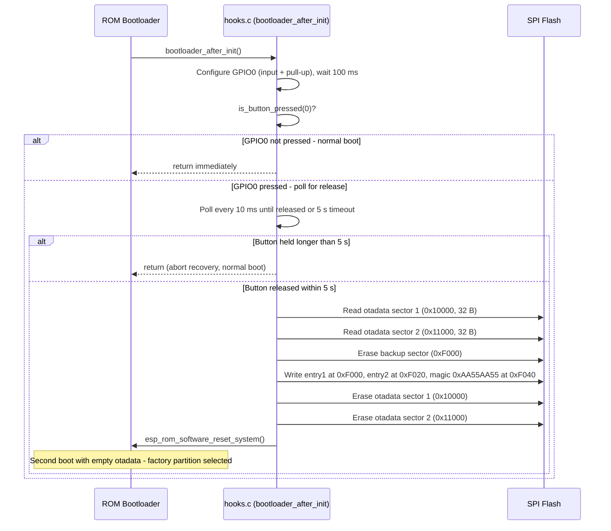
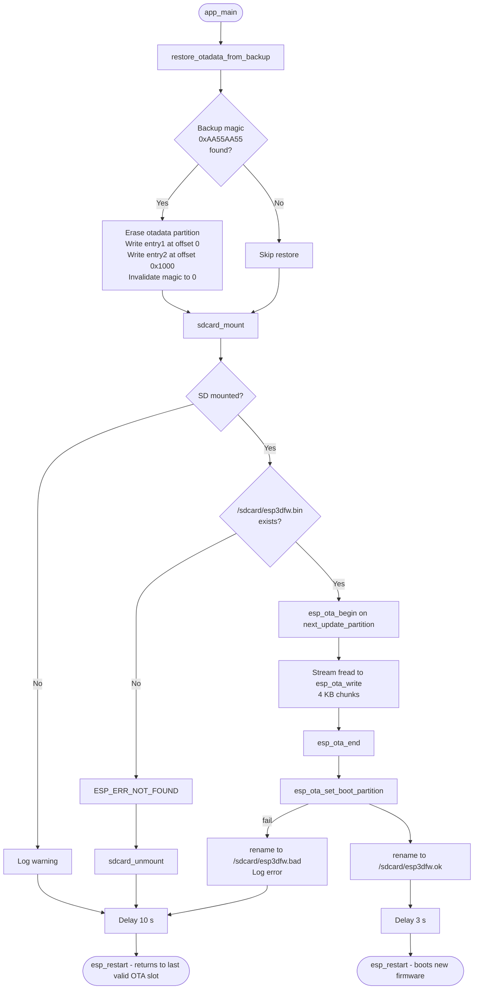
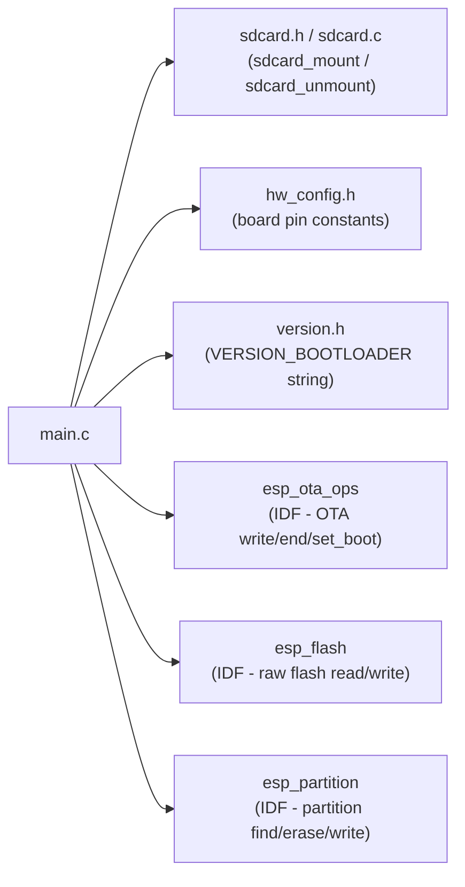
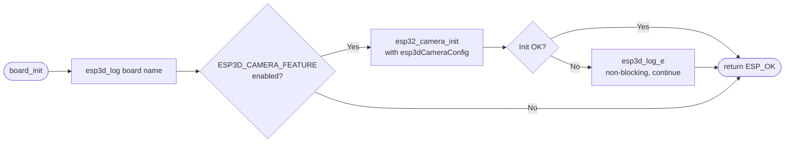
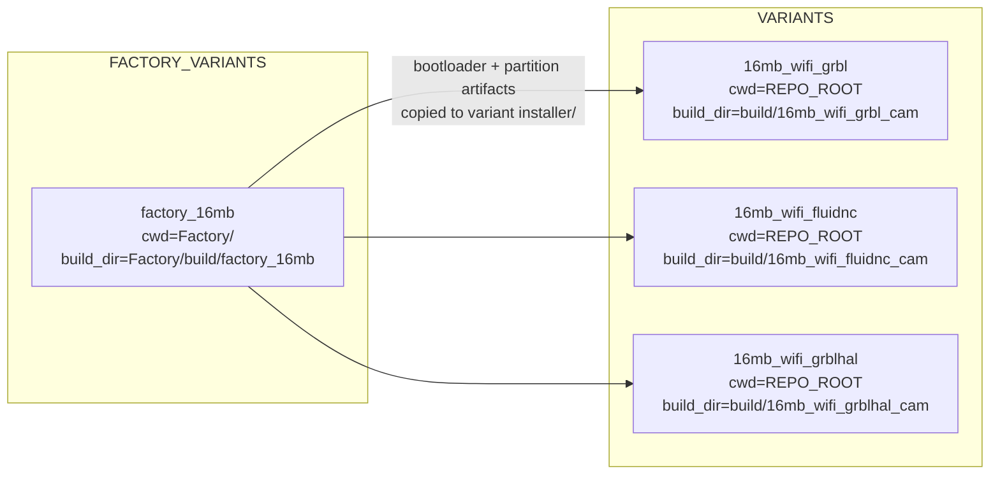
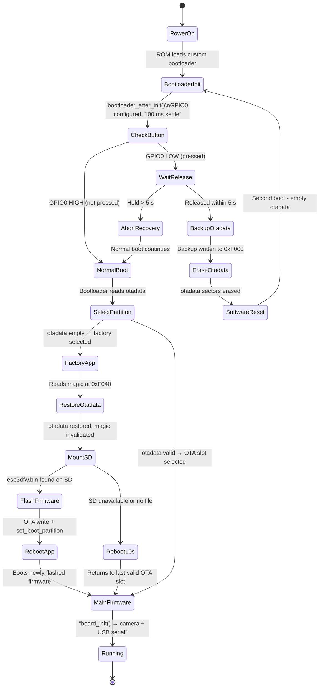

# ESP32-S3-WROOM-CAM Board Support Package

The `esp32_s3_wroom_cam` module is the Board Support Package (BSP) for the **ESP32-S3-WROOM-CAM** target. It is a **headless** (no display, no buzzer) pendant node built around the ESP32-S3 with 16 MB of flash, 8 MB of PSRAM, an integrated camera, and USB OTG. Unlike display-centric siblings such as [pibot_pendant_v1_0](pibot_pendant_v1_0_bsp.md), this board exposes all diagnostic and status output exclusively over UART/USB-CDC and is intended as a WiFi-connected CNC bridge with optional camera streaming.

---

## Table of Contents

1. [Hardware Profile](#hardware-profile)
2. [Module Architecture](#module-architecture)
3. [Sub-modules](#sub-modules)
   - [Custom Bootloader](#custom-bootloader)
   - [Factory Recovery App](#factory-recovery-app)
   - [Board Support Package (BSP)](#board-support-package-bsp)
   - [Build Scripts & Variants](#build-scripts--variants)
4. [Flash Memory Layout](#flash-memory-layout)
5. [Boot & Recovery Flow](#boot--recovery-flow)
6. [Build Variants](#build-variants)
7. [Build Instructions](#build-instructions)
8. [Key Differences from Display Boards](#key-differences-from-display-boards)
9. [Hardware Constraints](#hardware-constraints)

---

## Hardware Profile

| Property | Value |
|---|---|
| MCU | ESP32-S3 (dual-core Xtensa LX7) |
| Flash | 16 MB SPI |
| PSRAM | 8 MB (octal SPI) |
| Connectivity | WiFi 802.11 b/g/n (Bluetooth **excluded** — PSRAM conflict on S3) |
| Display | **None** |
| Touch | **None** |
| Buzzer | **None** |
| Camera | Yes (`CAMERA_SERVICE` — OV2640 or compatible via `esp32_camera`) |
| USB | USB OTG (USB Serial via `USB_SERIAL_SERVICE`) |
| Recovery button | GPIO0 — BOOT button (active LOW, internal pull-up, strapping pin) |

> **PSRAM/BT exclusion:** The ESP32-S3 cannot run both 8 MB PSRAM and Bluetooth simultaneously due to RF sharing. This board is **WiFi-only** by design; BT variants are build-system-forbidden. See [`cmake/sanity_check.cmake`](Build_and_Development_Tools.md) for the enforcement rule.

---

## Module Architecture



---

## Sub-modules

### Custom Bootloader

**Paths:**
- `boards/ESP32_S3_WROOM_CAM/Factory/bootloader_components/custom_bootloader/hooks.c` — ESP-IDF bootloader component (used by the factory project build)
- `boards/ESP32_S3_WROOM_CAM/Factory/custom_bootloader/hooks.c` — Source copy with full function set

The custom bootloader implements the **hardware recovery trigger** using ESP-IDF's bootloader hooks API. There is no display or audio feedback; all logging goes to the ROM debug UART.

#### Key Functions

| Function | Visibility | Purpose |
|---|---|---|
| `bootloader_hooks_include()` | Public (linker anchor) | Forces the hook object into the bootloader link |
| `bootloader_before_init()` | Public | Reserved; currently empty |
| `bootloader_after_init()` | Public | GPIO0 sense and recovery dispatch (main logic) |
| `is_button_pressed(pin)` | Static | Debounced GPIO read — samples 5× over 25 ms, returns true if ≥ 3 reads are LOW |
| `backup_and_erase_otadata()` | Static | Copies both otadata sectors to the backup flash sector, then erases otadata |

#### Recovery Trigger Sequence



#### Flash Constants (bootloader scope)

```
BOOT_BUTTON_PIN       = GPIO0
OTADATA_OFFSET        = 0x10000   (size 0x2000 — 2 × 4 KB sectors)
OTADATA_BACKUP_OFFSET = 0xF000    (last sector of the NVS region)
BACKUP_MAGIC          = 0xAA55AA55
RELEASE_TIMEOUT_US    = 5,000,000 (5 s)
POLL_INTERVAL_US      = 10,000    (10 ms)
```

> **Why no display/buzzer?** The ESP32-S3-WROOM-CAM board has no panel or audio hardware. Compare with [pibot_pendant_v1_0_bootloader](pibot_pendant_v1_0_bootloader.md), which adds `beep_confirm()` / `beep_short()` calls to the same recovery flow.

---

### Factory Recovery App

**Path:** `boards/ESP32_S3_WROOM_CAM/Factory/main/main.c`

A minimal C application that occupies the `factory` partition. It runs only when the bootloader selects factory (i.e., after a recovery-triggered otadata erase). Output is **UART/USB-CDC only** — no LVGL, no display driver.

#### Entry Point: `app_main()`



#### Key Behaviours

| Behaviour | Detail |
|---|---|
| otadata restore | Called first, before NVS init, to prevent the backup sector being overwritten |
| Firmware filename | `/sdcard/esp3dfw.bin` |
| Success marker | Renamed to `/sdcard/esp3dfw.ok` |
| Failure marker | Renamed to `/sdcard/esp3dfw.bad` (flash error path only) |
| Chunk size | 4 096 bytes (stack-allocated `static uint8_t buf[4096]`) |
| Progress logging | Every 64 KB via `ESP_LOGI` |
| No-update reboot | 10 s delay then `esp_restart()` (returns to last valid OTA slot) |

#### Dependencies (Factory App)



---

### Board Support Package (BSP)

**Path:** `boards/ESP32_S3_WROOM_CAM/components/bsp/board_init.c`

The BSP is intentionally minimal because this board has no display, touch, or encoder. It exposes a standard `board_init.h` API that the firmware's platform layer calls at startup.

#### API Surface

| Symbol | Returns | Description |
|---|---|---|
| `board_init()` | `esp_err_t` | Top-level hardware init — camera (optional), no display |
| `board_get_name()` | `const char *` | Returns `BOARD_NAME_STR` from `board_config.h` |
| `board_get_version()` | `const char *` | Returns `BOARD_VERSION_STR` from `board_config.h` |
| `board_init_usb()` | `esp_err_t` | Starts the USB serial task (`usb_serial_create_task`) — guarded by `ESP3D_USB_SERIAL_FEATURE` |
| `board_deinit_usb()` | `esp_err_t` | Tears down the USB serial task — guarded by `ESP3D_USB_SERIAL_FEATURE` |

#### `board_init()` Logic



> **Camera is non-blocking:** A camera init failure does not abort the firmware startup. This allows the firmware to run in degraded mode if the sensor is absent or faulty.

#### Compile-time Feature Guards

```c
#if ESP3D_USB_SERIAL_FEATURE   // USB serial task management
#if ESP3D_CAMERA_FEATURE       // Camera sensor init
```

These map to CMake `OPTION()` flags (`USB_SERIAL_SERVICE`, `CAMERA_SERVICE`) via `cmake/features.cmake`. See [Build_Development_Tools](Build_and_Development_Tools.md) for the feature pipeline.

#### BSP Comparison with Display Boards

This board's BSP is significantly simpler than display-enabled siblings:

| BSP Function | ESP32-S3-WROOM-CAM | pibot_pendant_v1_0 | esp32_3248s035c |
|---|---|---|---|
| `board_init` | Camera only | Display + Touch + Encoder + Buzzer + Potentiometer | Display + Touch |
| `increase_lvgl_tick` | **Absent** | ✓ | ✓ |
| `lvgl_flush_cb` | **Absent** | ✓ | ✓ |
| `touch_read_cb` | **Absent** | ✓ | ✓ |
| `encoder_read_cb` | **Absent** | ✓ | ✗ |
| `board_init_usb` | ✓ | **Absent** | **Absent** |
| Camera init | ✓ | **Absent** | **Absent** |

---

### Build Scripts & Variants

**Path:** `boards/ESP32_S3_WROOM_CAM/build_scripts/`

Three Python files mirror the pattern used across all boards in this repository.

#### `build_one.py`

CLI entry point. Accepts a single variant name plus optional flags.

```
python build_one.py <variant_name> [--clean] [--check]
```

- `--clean` — removes the build directory and installer output, then exits
- `--check` — runs `idf.py reconfigure` (CMake only) without a full build

#### `common.py`

Shared helpers. Key responsibilities:

| Function | Purpose |
|---|---|
| `build_variant(config)` | Orchestrates clean → cmake build → size report → factory artifact copy → flash map generation |
| `check_variant(config)` | Runs CMake reconfigure only (fast sanity check) |
| `copy_factory_artifacts(cmake_args)` | Copies bootloader/partition binaries from `Factory/installer/ESP3D-FACTORY_16MB/` into the variant installer dir |
| `build_config_name(cmake_args)` | Derives `ESP32_S3_WROOM_CAM_16MB_<radio>_<firmware>` from CMake flags |
| `generate_flash_map(config)` | Calls `tools/flash_scripts/flash_mgr.py --generate` for the installer directory |
| `_ensure_clean_build_dir(build_dir)` | Clears the build dir if previously built for a different `IDF_TARGET` |
| `_build_missing_factory(source_dir)` | Auto-triggers factory build when its artifacts are absent |

**IDF_TARGET enforcement:** All build and check commands hard-set `env["IDF_TARGET"] = "esp32s3"`. This prevents the wrong chip being selected even if the shell environment differs.

**Parallel build support:** `CMAKE_BUILD_PARALLEL_LEVEL` is forwarded from a `--jobs=N` argument passed by `build_mgr.py` (idf.py has no `-j` CLI option).

#### `variants.py`

Defines `VARIANTS` (main firmware) and `FACTORY_VARIANTS` (factory recovery) dictionaries consumed by `build_one.py` and the top-level `build_mgr.py`.



##### `make_variant_args(*on_flags)`

Generates the CMake argument list for a variant. It starts by turning **all** known board/feature options OFF (to prevent stale CMake cache values leaking across incremental builds), then turns on only the explicitly listed flags:

```python
DEFAULT_OFF_CMAKE_ARGS = []
for option in ROOT_CMAKE_OPTIONS:
    DEFAULT_OFF_CMAKE_ARGS.extend(["-D", f"{option}=OFF"])

def make_variant_args(*on_flags):
    args = DEFAULT_OFF_CMAKE_ARGS.copy()
    for flag in on_flags:
        args.extend(["-D", flag])
    return args
```

This ensures deterministic, reproducible builds regardless of the local CMake cache state.

---

## Flash Memory Layout

The following layout is derived from `Factory/partitions/partitions_16mb.csv` and the constants embedded in `hooks.c` / `main.c`.

```
Address        Size     Label / Purpose
─────────────────────────────────────────────────────────────
0x0000_0000    varies   Bootloader (custom hooks compiled in)
0x000D_000     12 KB    NVS region (0xD000–0xFFFF)
  └─ 0x000F_000  4 KB  ← Bootloader backup sector for otadata
0x0001_0000    8 KB     otadata (2 × 4 KB sectors)
  ├─ 0x0001_0000  4 KB  otadata sector 1
  └─ 0x0001_1000  4 KB  otadata sector 2
  ...
  factory partition      Factory recovery app (this module)
  ota_0 partition        Main firmware slot A
  ota_1 partition        Main firmware slot B (OTA target)
```

### Backup Sector Layout (at 0xF000)

```
Offset   Size     Content
──────────────────────────────────────
0x000    32 B     otadata entry 1 (copy of sector 1)
0x020    32 B     otadata entry 2 (copy of sector 2)
0x040     4 B     Magic: 0xAA55AA55 (valid backup marker)
0x044    rest     0xFF (erased flash)
```

The magic word at `0xF040` is the handshake between the bootloader and the factory app:
- **Bootloader** writes the magic after completing the backup → signals factory app to restore
- **Factory app** reads the magic, restores entries, then writes `0x00000000` to invalidate

---

## Boot & Recovery Flow



---

## Build Variants

All variants share the following base configuration:

| CMake Flag | Value |
|---|---|
| `ESP32_S3_WROOM_CAM` | ON |
| `MEMORY_16_MB` | ON |
| `PSRAM_8_MB` | ON |
| `USB_SERIAL_SERVICE` | ON |
| `WIFI_SERVICE` | ON |
| `ESP3D_AUTHENTICATION` | ON |
| `SD_CARD_SERVICE` | ON |
| `CAMERA_SERVICE` | ON |
| `MDNS_SERVICE` | ON |
| `WEB_SERVICES` | ON |
| `WEBUI_SERVER` | ON |
| `TIME_SERVICE` | ON |
| `UPDATE_SERVICE` | ON |

### Variant Matrix

| Variant Name | `TARGET_FW_*` | Build Dir | Installer Dir |
|---|---|---|---|
| `16mb_wifi_grbl` | `GRBL` | `build/16mb_wifi_grbl_cam` | `installer/ESP32_S3_WROOM_CAM_16MB_wifi_grbl/` |
| `16mb_wifi_fluidnc` | `FLUIDNC` | `build/16mb_wifi_fluidnc_cam` | `installer/ESP32_S3_WROOM_CAM_16MB_wifi_fluidnc/` |
| `16mb_wifi_grblhal` | `GRBLHAL` | `build/16mb_wifi_grblhal_cam` | `installer/ESP32_S3_WROOM_CAM_16MB_wifi_grblhal/` |
| `factory_16mb` | N/A | `Factory/build/factory_16mb` | `Factory/installer/ESP3D-FACTORY_16MB/` |

> **Factory artifacts dependency:** All three main variants require the factory variant to be built first. `common.py::copy_factory_artifacts()` auto-triggers `factory_16mb` if its output directory is absent.

### Feature Interaction Notes

- **Camera + WiFi:** Both run simultaneously. Camera frame buffers are allocated from PSRAM (`MALLOC_CAP_SPIRAM`) to avoid exhausting DRAM.
- **No Bluetooth:** BT is unconditionally excluded by `cmake/sanity_check.cmake`.
- **WebUI available:** `WEBUI_SERVER=ON` enables the embedded web interface over WiFi. SSDP is OFF for this board.
- **CNC link is USB serial:** `USB_SERIAL_SERVICE=ON`. Socket client/server are both OFF. See the WiFi role/CNC transport model in the [architecture overview](Core_Platform_and_Infrastructure.md).

---

## Build Instructions

### Prerequisites

- ESP-IDF v5.4.3 installed and sourced
- `IDF_PATH` environment variable set (or update in `common.py`)
- Python 3.x

### Build a Single Variant

```bash
cd boards/ESP32_S3_WROOM_CAM/build_scripts

# Build FluidNC variant
python build_one.py 16mb_wifi_fluidnc

# Build GRBL variant with a clean first
python build_one.py 16mb_wifi_grbl --clean

# CMake-only sanity check (no compile)
python build_one.py 16mb_wifi_grblhal --check

# Build factory recovery app
python build_one.py factory_16mb
```

### Flash

```bash
idf.py -B build/16mb_wifi_fluidnc_cam flash monitor
```

### Factory Recovery via SD Card

1. Copy the main firmware binary to the SD card root as `esp3dfw.bin`
2. Hold GPIO0 (BOOT button) at power-on
3. Release when the board resets (within 5 s of pressing)
4. The factory app flashes `esp3dfw.bin` to `ota_0` and reboots
5. On success, `esp3dfw.bin` is renamed to `esp3dfw.ok` on the SD card
6. On failure, `esp3dfw.bin` is renamed to `esp3dfw.bad` for diagnosis

---

## Key Differences from Display Boards

This board deliberately omits subsystems present on all display-based boards:

| Subsystem | Display boards | ESP32-S3-WROOM-CAM |
|---|---|---|
| Display driver (SPI/RGB/I80) | Required | **Absent** |
| LVGL init + tick timer | Required | **Absent** |
| Touch controller | Required | **Absent** |
| Buzzer feedback in bootloader | pibot_pendant_v1_0 has it | **Absent** |
| Factory app graphical UI | Full menus + GFX | **UART/USB-CDC only** |
| Encoder / potentiometer | pibot_pendant_v1_0 | **Absent** |
| Camera | Absent on all display boards | **Present** |
| USB Serial as primary CNC link | Rare | **Standard** |
| PSRAM | 0–4 MB on others | **8 MB** |

The absence of LVGL means none of the [UI Framework & Screens](UI_Framework_and_Screens.md) subsystem is compiled for this target. `board_init.c` does not call `init_lvgl()`, `increase_lvgl_tick()`, or any display flush callback.

---

## Hardware Constraints

### Memory

| Mode | Approximate available DRAM |
|---|---|
| WiFi active | ~75 KB (before PSRAM allocations) |
| Bluetooth | **Not supported** |

Camera frame buffers are allocated in PSRAM (`MALLOC_CAP_SPIRAM`). The 8 MB PSRAM headroom makes this board significantly less constrained than DRAM-only targets for camera and web workloads.

### GPIO0 Strapping Caution

GPIO0 is an ESP32-S3 strapping pin. The internal pull-up is enabled by the bootloader hook (`gpio_ll_pullup_en`). External circuitry connected to GPIO0 must not hold it LOW at power-on unless a factory recovery is intended.

### USB OTG Initialisation Order

`board_init_usb()` is called separately from `board_init()`. The platform layer must call both in sequence:

```c
board_init();       // Camera init (non-blocking on failure)
board_init_usb();   // USB serial task start
```

USB OTG and the standard UART can both log simultaneously.

### Build System Enforcement

- `IDF_TARGET` is hard-set to `esp32s3` in every `subprocess.run()` call — external environment overrides are ignored.
- The `_ensure_clean_build_dir()` helper writes a `.idf_target` marker file and clears the build directory on target mismatch, preventing silent cross-target contamination.

---

## Related Documentation

- [pibot_pendant_v1_0_bsp.md](pibot_pendant_v1_0_bsp.md) — Reference display-enabled BSP with full LVGL stack
- [pibot_pendant_v1_0_bootloader.md](pibot_pendant_v1_0_bootloader.md) — Bootloader with buzzer recovery feedback (comparison)
- [Build_Development_Tools.md](Build_and_Development_Tools.md) — `build_mgr.py`, variant conventions, `sanity_check.cmake`
- [Communication_Transports.md](Communication_Transports.md) — USB serial, WiFi socket, and WebSocket transports
- [CNC_Firmware_Integration.md](CNC_Firmware_Integration.md) — GCode host, FluidNC / GRBL / grblHAL targets
- [docs/guides/esp32_memory_constraints.md](https://github.com/luc-github/Pibot-cnc-pendant-firmware/blob/main/docs/guides/esp32_memory_constraints.md) — Heap and fragmentation guidance
- [docs/features/feature_resource_matrix.md](https://github.com/luc-github/Pibot-cnc-pendant-firmware/blob/main/docs/features/feature_resource_matrix.md) — Feature compatibility matrix


## Documents de conception (depot)

- [camera](https://github.com/luc-github/Pibot-cnc-pendant-firmware/blob/main/docs/features/camera.md)
