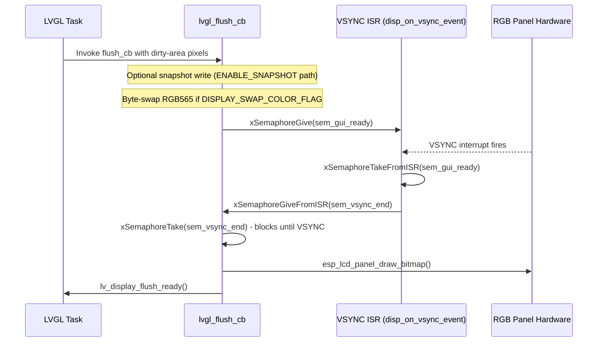
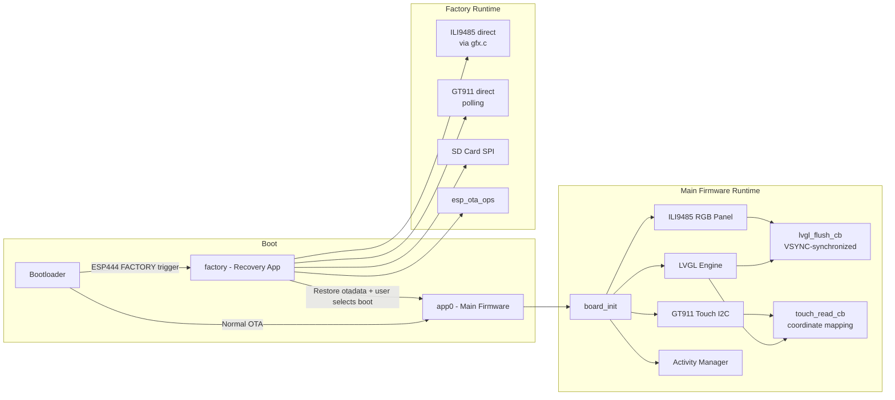

# esp32s3_4827s043c — Board Support Package

## Overview

The `esp32s3_4827s043c` module is the complete Board Support Package (BSP) for the ESP32-S3 board equipped with a **4.3-inch RGB parallel LCD panel** (480 × 272 pixels, ILI9485 controller) and a **GT911 capacitive touch controller**. The board name encodes its key hardware: `48`=480px wide, `27`=272px tall, `S043`=4.3″ diagonal, `C`=Capacitive touch.

This BSP covers three layers:

| Layer | Path | Purpose |
|---|---|---|
| **Factory App** | `boards/esp32s3_4827s043c/Factory/` | Self-contained recovery application for OTA and resource updates |
| **BSP Component** | `boards/esp32s3_4827s043c/components/bsp/` | Hardware abstraction for the main LVGL-based firmware |
| **Build Scripts** | `boards/esp32s3_4827s043c/build_scripts/` | Python variant management and build automation |

### Key Hardware Characteristics

- **MCU**: ESP32-S3 (dual-core Xtensa, 240 MHz)
- **Display**: RGB parallel panel, 480 × 272, ILI9485 — driven via `esp_lcd_rgb_panel` (not SPI)
- **Touch**: GT911 capacitive controller over I2C (auto-calibrated resolution, up to 5 simultaneous touch points)
- **Flash**: 16 MB (all shipping variants)
- **Physical inputs**: None — buttons, encoder, and buzzer pins are all `GPIO_NUM_NC`; navigation is touch-only
- **SD card**: SPI interface (used by Factory app for firmware/resource delivery)
- **Entry into recovery**: Software-triggered only via `[ESP444]FACTORY` from the main firmware (no physical boot button)

> **Important:** Because this board has no physical buttons, the Factory recovery UI draws virtual UP / DOWN / OK buttons at the bottom of the screen and maps touch hit-test regions to them. The BSP code that handles encoder, switch, and physical button events is compiled in (for portability across the board family) but is entirely inert at runtime on this hardware.

---

## Architecture Overview

```mermaid
graph TD
    subgraph "esp32s3_4827s043c Module"
        subgraph "Factory Application"
            FA_MAIN["main.c<br/>Recovery menu and OTA"]
            FA_GFX["gfx.c<br/>Framebuffer graphics"]
            FA_TOUCH["touch.c<br/>GT911 polling"]
            FA_SDCARD["sdcard.c<br/>SPI SD mount"]
            FA_BTN["buttons.c<br/>GPIO buttons"]
            FA_ENC["encoder.c<br/>PCNT encoder"]
            FA_BUZZ["buzzer.c<br/>Bit-bang buzzer"]
            FA_LOG["factory_log.h<br/>Log gate"]
        end

        subgraph "BSP Component"
            BSP_BOARD["board_init.c<br/>HW init and LVGL setup"]
            BSP_CTRL["control_event.h<br/>Event type definitions"]
            BSP_TYPES["control_types.c<br/>LVGL event registration"]
        end

        subgraph "Build Scripts"
            BS_VARIANTS["variants.py<br/>Variant definitions"]
            BS_COMMON["common.py<br/>Build helpers"]
            BS_ONE["build_one.py<br/>CLI entry point"]
        end
    end

    subgraph "Shared Hardware Drivers"
        DRV_ILI9485["disp_ili9485<br/>RGB panel driver"]
        DRV_GT911["touch_gt911<br/>I2C touch driver"]
        DRV_BACKLIGHT["disp_backlight<br/>PWM backlight"]
        DRV_I2C["bus_i2c<br/>Shared I2C bus"]
    end

    subgraph "Main Firmware"
        FW_LVGL["LVGL<br/>UI Framework"]
        FW_UI["UIManager<br/>Screen system"]
        FW_ACT["ActivityManager<br/>Wake and sleep"]
    end

    FA_MAIN --> FA_GFX
    FA_MAIN --> FA_TOUCH
    FA_MAIN --> FA_SDCARD
    FA_MAIN --> FA_BTN
    FA_MAIN --> FA_ENC
    FA_MAIN --> FA_BUZZ
    FA_TOUCH --> DRV_GT911
    FA_GFX --> DRV_ILI9485

    BSP_BOARD --> DRV_ILI9485
    BSP_BOARD --> DRV_GT911
    BSP_BOARD --> DRV_BACKLIGHT
    BSP_BOARD --> DRV_I2C
    BSP_BOARD --> FW_LVGL
    BSP_BOARD --> FW_ACT
    BSP_TYPES --> BSP_CTRL
    BSP_BOARD --> BSP_TYPES

    BS_ONE --> BS_COMMON
    BS_ONE --> BS_VARIANTS
    BS_COMMON --> BS_VARIANTS

    FW_LVGL --> FW_UI
```

---

## Display Architecture: RGB Parallel vs. SPI

This board uses an **RGB parallel panel** rather than the SPI panels found on older boards (ST7796, ILI9341). The difference is architecturally significant for the flush path:

| Aspect | SPI Panel (e.g. ST7796) | RGB Parallel (ILI9485) |
|---|---|---|
| Bus | SPI (MOSI/CLK/CS) | Parallel RGB + HSYNC/VSYNC/PCLK/DE |
| Frame buffer ownership | None — CPU sends pixels on demand | Panel scans the frame buffer in SPIRAM autonomously |
| Tearing prevention | N/A (each SPI transfer is atomic) | Requires VSYNC synchronization |
| LVGL flush signal | `notify_lvgl_flush_ready` in DMA done callback | Semaphore pair coordinated with VSYNC ISR |
| PSRAM requirement | Optional | Mandatory — frame buffer lives in SPIRAM |

Because the panel continuously scans from the SPIRAM frame buffer, the BSP must synchronize LVGL's partial-buffer copy with the display's scan-out to prevent visible tearing. This is achieved through a semaphore pair (`sem_gui_ready` / `sem_vsync_end`):

---

## Sub-Modules

### 1. Factory Application — [esp32s3_4827s043c_factory.md](esp32s3_4827s043c_factory.md)

The self-contained recovery app flashed to the `factory` OTA partition. It provides:

- A **touch-navigated menu** (virtual UP/DOWN/OK buttons rendered at the bottom of the screen) to select recovery actions
- **Firmware OTA update** from SD card (`/sdcard/esp3dfw.bin` → `app0` or `app1` partition) using `esp_ota_*` APIs with a 1 KB streaming buffer and live progress display
- **UI resources partition update** from SD card (`/sdcard/ui_resources.bin` → `ui_resources` partition) with variant header validation
- **OTADATA backup/restore**: on startup, restores the OTA boot target that the main firmware backed up before switching to factory, ensuring power-off from recovery returns to the correct app partition
- Optional **snapshot capture** (`ENABLE_SNAPSHOT`) for development — pressing GPIO0 saves a raw RGB565 screen capture to the SD card

Key source files:

| File | Responsibility |
|---|---|
| `main.c` | Recovery menu, OTA actions, touch dispatch, main event loop |
| `gfx.c` | Lightweight graphics over ILI9485 (no LVGL): `gfx_clear`, `gfx_draw_string`, `gfx_fill_rect`, `gfx_snapshot_*` |
| `touch.c` | GT911 I2C polling via the shared `touch_gt911` driver |
| `sdcard.c` | SPI SD mount/unmount via `esp_vfs_fat` |
| `buttons.c` | GPIO button driver (all pins `GPIO_NUM_NC` → inert on this board) |
| `encoder.c` | PCNT rotary encoder driver (pins `GPIO_NUM_NC` → inert on this board) |
| `buzzer.c` | Bit-bang buzzer driver (pin `GPIO_NUM_NC` → inert on this board) |
| `factory_log.h` | Compile-time debug log gate (`FACTORY_LOGD`) |

→ Full details: [esp32s3_4827s043c_factory.md](esp32s3_4827s043c_factory.md)

### 2. BSP Component — [esp32s3_4827s043c_bsp.md](esp32s3_4827s043c_bsp.md)

The hardware abstraction layer consumed by the main LVGL firmware (`board_init()` is the single entry point called from `ESP3DX::begin()`). It provides:

- **`board_init()`** — top-level initialization sequence: backlight PWM, ILI9485 RGB panel, GT911 touch controller, LVGL engine, VSYNC semaphores, activity manager
- **`lvgl_flush_cb()`** — VSYNC-synchronized LVGL flush callback with optional snapshot write path
- **`touch_read_cb()`** — GT911 read with coordinate scaling to display pixels and activity-manager wake-up gate
- **`increase_lvgl_tick()`** — ESP periodic timer callback that advances the LVGL tick counter
- **`disp_on_vsync_event()`** — VSYNC ISR handler that drives the tear-free semaphore protocol
- **`control_events_init()`** — registers custom LVGL event IDs for switch and potentiometer input
- **`control_event_t`** — unified control event struct carried to UI screens

→ Full details: [esp32s3_4827s043c_bsp.md](esp32s3_4827s043c_bsp.md)

### 3. Build Scripts — [esp32s3_4827s043c_build_scripts.md](esp32s3_4827s043c_build_scripts.md)

Python scripts for variant-aware firmware building:

| Script | Responsibility |
|---|---|
| `variants.py` | Declares all firmware variants as dicts of CMake flags, build directories, and working directories |
| `common.py` | `build_variant()`, `check_variant()`, UI resource generation, factory artifact copy, installer packaging, flash-map generation |
| `build_one.py` | CLI entry point: `python build_one.py <variant_name> [--clean] [--check]` |

**Defined firmware variants:**

| Variant name | Transport | CNC firmware | Features |
|---|---|---|---|
| `16mb_wifi_fluidnc` | WiFi (SOCKET_CLIENT) + Serial | FluidNC | mDNS, Lua, Update |
| `16mb_serial_fluidnc` | Serial only | FluidNC | Update |
| `16mb_serial_grbl` | Serial only | GRBL | Update |
| `16mb_wifi_grblhal` | WiFi (SOCKET_CLIENT) + Serial | GrblHAL | mDNS, Lua, Update |
| `factory_16mb` | — | Recovery app | — |

→ Full details: [esp32s3_4827s043c_build_scripts.md](esp32s3_4827s043c_build_scripts.md)

---

## Component Interaction and Boot Flow

---

## Relation to Other Boards

The `esp32s3_4827s043c` follows the same factory application and BSP pattern as other boards in this repository. The table below highlights the most relevant architectural differences:

| Board | Display bus | Touch | Physical inputs | VSYNC sync needed |
|---|---|---|---|---|
| `esp32s3_4827s043c` **(this)** | RGB parallel (ILI9485) | GT911 I2C | None (touch-only) | ✓ |
| [`esp32s3_8048s043c`](esp32s3_8048s043c.md) | RGB parallel (ST7262) | GT911 I2C | None | ✓ |
| [`esp32s3_8048s070c`](esp32s3_8048s070c.md) | RGB parallel | GT911 I2C | None | ✓ |
| [`esp32s3_hmi43v3`](esp32s3_hmi43v3.md) | i80 parallel (RM68120) | GT911 I2C | Buttons + encoder | ✗ (i80 done CB) |
| [`pibot_pendant_v1_0`](pibot_pendant_v1_0_bsp.md) | SPI (ILI9341) | XPT2046 SPI | Buttons + encoder | ✗ (notify_flush_ready) |

For shared hardware drivers (`touch_gt911`, `disp_ili9485`, `bus_i2c`, `disp_backlight`) see the [Hardware Peripheral Drivers — RGB Displays](display_rgb_drivers.md) documentation.

For the main firmware systems that consume `board_init()` output see:
- [UI Framework & Screens — Core](ui_core.md) — LVGL UIManager and screen system
- [Core Platform & Infrastructure](esp3d_core.md) — ESP3DX entry point and settings
- [CNC Firmware Integration — GCode Host](gcode_host.md) — GCode host and CNC protocol handling
