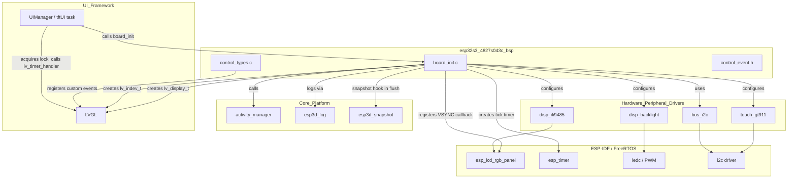
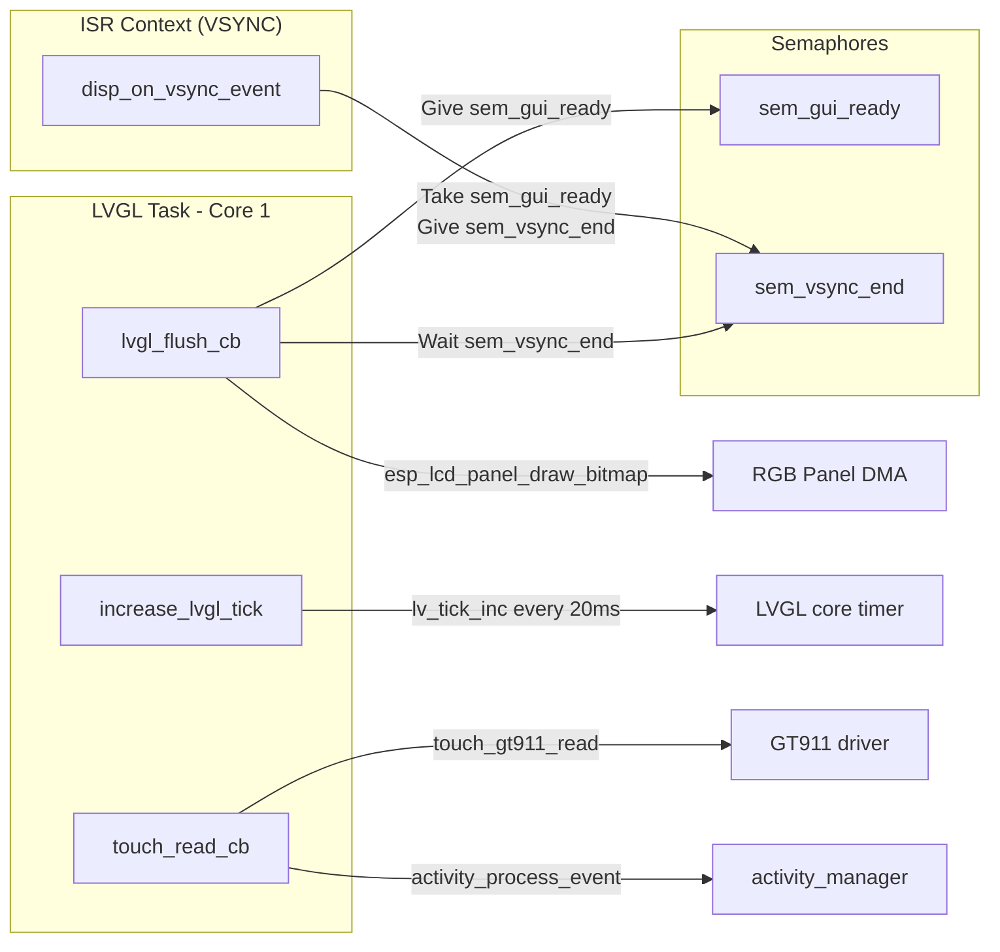
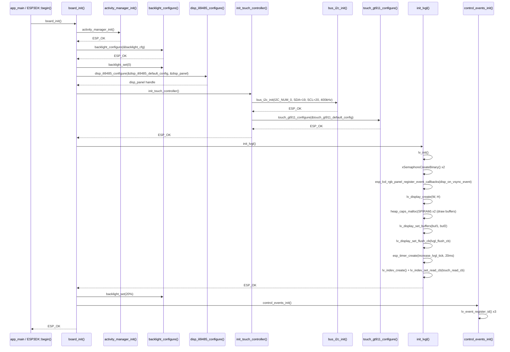
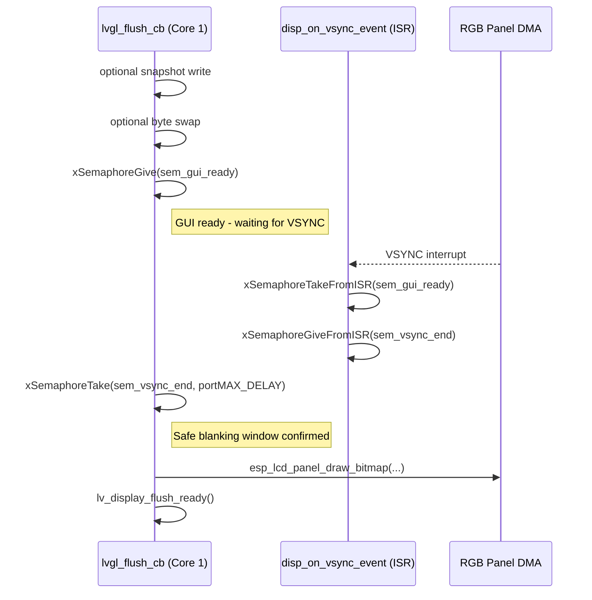
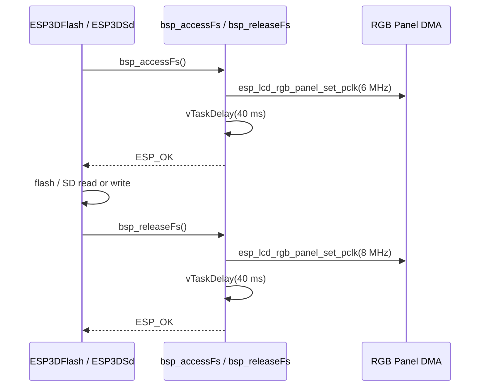
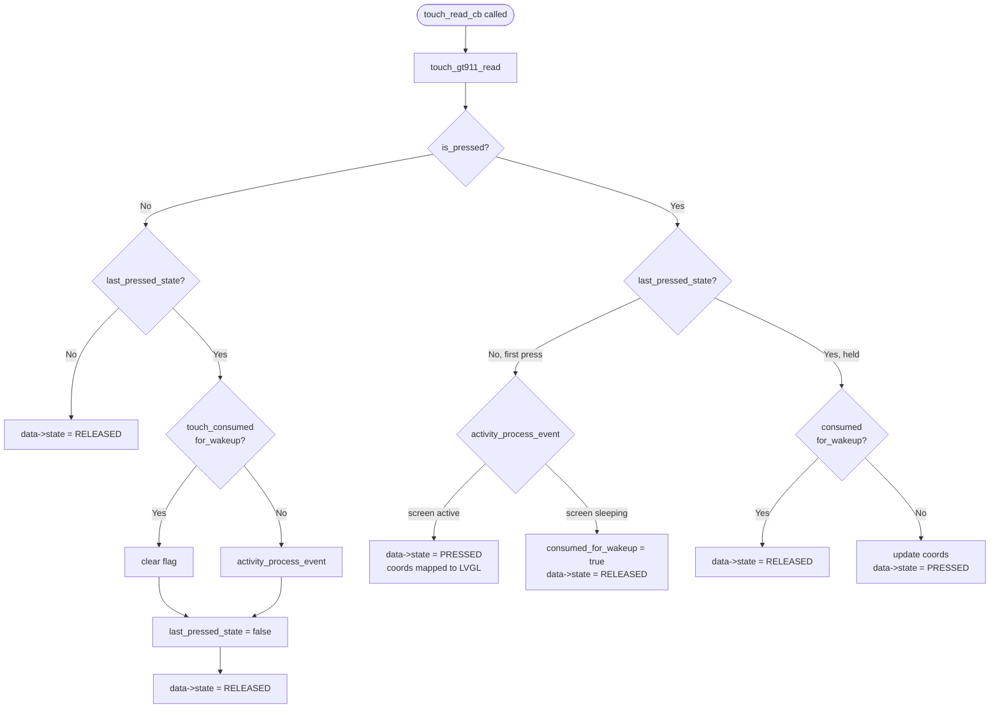
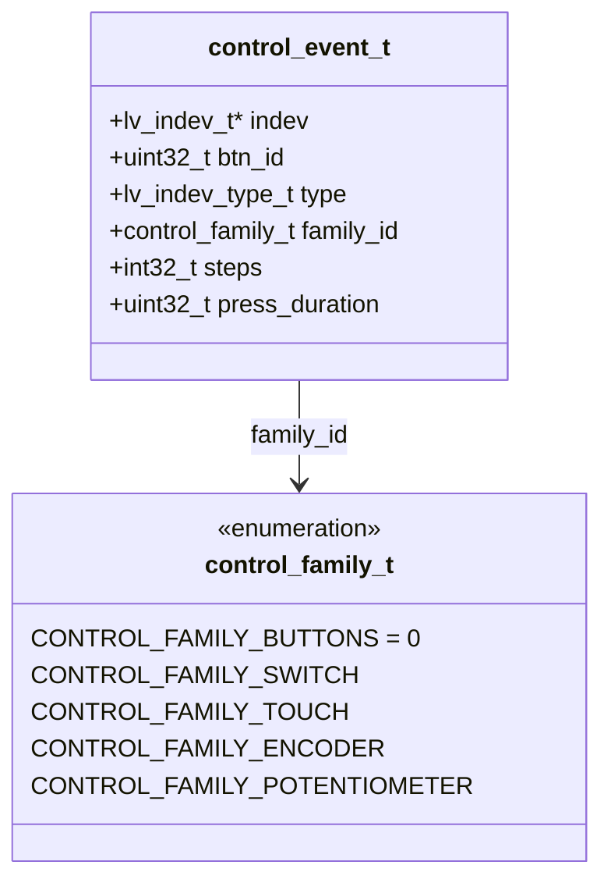
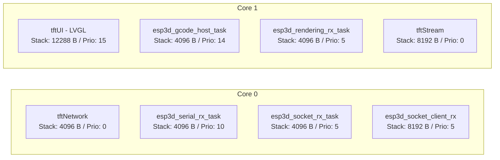

# ESP32S3-4827S043C Board Support Package (BSP)

The `esp32s3_4827s043c_bsp` module is the hardware abstraction layer for the **ESP32S3-4827S043C** board — a 4.3-inch capacitive touch display panel driven by an ILI9485 controller over a 16-bit RGB parallel interface. It initialises every hardware peripheral needed by the pendant firmware, wires LVGL to the RGB panel and the GT911 touch controller, and registers the board-specific custom control events that the UI layer consumes.

---

## Table of Contents

1. [Module Overview](#1-module-overview)
2. [Hardware Specifications](#2-hardware-specifications)
3. [GPIO Pin Reference](#3-gpio-pin-reference)
4. [Architecture](#4-architecture)
5. [Component Breakdown](#5-component-breakdown)
   - [board_init.c](#51-board_initc)
   - [control_event.h](#52-control_eventh)
   - [control_types.c / control_types.h](#53-control_typesc--control_typesh)
   - [Configuration Headers](#54-configuration-headers)
6. [Initialization Flow](#6-initialization-flow)
7. [Display Subsystem](#7-display-subsystem)
   - [RGB Parallel Interface](#71-rgb-parallel-interface)
   - [VSYNC Synchronization](#72-vsync-synchronization)
   - [LVGL Draw Buffers](#73-lvgl-draw-buffers)
   - [Orientation and Rotation](#74-orientation-and-rotation)
   - [Filesystem Access Clock Patch](#75-filesystem-access-clock-patch)
8. [Touch Subsystem](#8-touch-subsystem)
   - [GT911 Configuration](#81-gt911-configuration)
   - [Touch Callback and Activity Manager](#82-touch-callback-and-activity-manager)
9. [Control Events System](#9-control-events-system)
10. [Snapshot Feature](#10-snapshot-feature)
11. [FreeRTOS Task Layout](#11-freertos-task-layout)
12. [Public API](#12-public-api)
13. [Build System Integration](#13-build-system-integration)
14. [Compile-Time Feature Flags](#14-compile-time-feature-flags)
15. [Sibling Modules and References](#15-sibling-modules-and-references)

---

## 1. Module Overview

| Item | Value |
|------|-------|
| **Board name** | `ESP32S3-4827S043C` |
| **Board version** | v1.0 |
| **MCU** | ESP32-S3 |
| **Display** | ILI9485, 16-bit RGB parallel, 480×272 physical |
| **Touch** | GT911 capacitive, I2C |
| **Physical controls** | None (encoder, buttons, switch, potentiometer are all **emulated** through the UI) |
| **Source directory** | `boards/esp32s3_4827s043c/components/bsp/` |
| **Key source files** | `board_init.c`, `control_types.c` |
| **Key header files** | `board_init.h`, `board_config.h`, `control_event.h`, `control_types.h`, `tasks_def.h`, `disp_ili9485_def.h`, `touch_gt911_def.h`, `disp_backlight_def.h` |

The BSP is the **only** place in the firmware where hardware I/O details live for this board. The rest of the firmware (UI, GCode host, communication transports) is hardware-agnostic and addresses the board only through the public API exposed by `board_init.h` and the LVGL handles returned by this module.

---

## 2. Hardware Specifications

### Display

| Parameter | Value |
|-----------|-------|
| Controller | ILI9485 |
| Interface | 16-bit RGB565 parallel (no SPI) |
| Physical size | 4.3 inch |
| Physical resolution | 480 × 272 px |
| Mounting in enclosure | Rotated **90°** — portrait physical orientation maps to landscape logical view |
| Logical resolution (Portrait mode) | 272 × 480 (LVGL canvas) |
| Logical resolution (Landscape mode) | 480 × 272 (LVGL canvas) |
| Confirmed working orientation | `PORTRAIT_INVERTED` (confirmed 2026-08-05/07) |
| Pixel clock (normal) | 8 MHz |
| Pixel clock (FS access) | 6 MHz (hardware workaround) |
| Color format | RGB565 |
| Byte swap required | No (`DISPLAY_SWAP_COLOR_FLAG = 0`) |
| Frame buffer location | PSRAM (`fb_in_psram = true`) |
| LVGL draw buffer | Double, 1/4 screen height each, allocated in SPIRAM |

### Backlight

| Parameter | Value |
|-----------|-------|
| GPIO | GPIO 2 |
| Control | PWM (LEDC) |
| Active | High |
| Default level | 20 % |
| PWM timer | Timer 0, Channel 0 |
| PWM frequency | 5 kHz |
| PWM resolution | 8-bit |

### Touch Controller

| Parameter | Value |
|-----------|-------|
| Controller | GT911 (capacitive) |
| Interface | I2C |
| I2C port | I2C_NUM_0 |
| I2C SDA | GPIO 19 |
| I2C SCL | GPIO 20 |
| I2C frequency | 400 kHz |
| I2C addresses probed | 0x5D, 0x14 |
| Reset pin | GPIO 38 |
| Interrupt pin | NC by default (GPIO 18 with `HARDWARE_MOD_GT911_INT`) |
| Max X/Y | Auto-detected from device firmware |

### Serial (CNC Link)

| Parameter | Value |
|-----------|-------|
| Port | UART_NUM_0 |
| TX | GPIO 43 |
| RX | GPIO 44 |
| Default baud rate | 115 200 |
| Flow control | None |
| RX buffer | 512 bytes |

### SD Card (optional, SPI)

| Parameter | Value |
|-----------|-------|
| SPI host | SPI2_HOST |
| MISO | GPIO 13 |
| MOSI | GPIO 11 |
| CLK | GPIO 12 |
| CS | GPIO 10 |
| Card detect | NC |
| Frequency | 20 MHz |

### Physical Controls

All physical control GPIOs are set to `GPIO_NUM_NC` — there are no physical buttons, encoder, switch, or potentiometer on this board. The control events framework is retained so that upper UI layers (which are shared across all boards) compile without modification and handle emulated input through the touch UI.

---

## 3. GPIO Pin Reference

```
┌─────────────────────────────────────────────────────────┐
│            ESP32S3-4827S043C GPIO Map                   │
├──────────┬────────────┬─────────────────────────────────┤
│ GPIO     │ Direction  │ Function                        │
├──────────┼────────────┼─────────────────────────────────┤
│ GPIO 1   │ Output     │ D4  – RGB data bus (B4)         │
│ GPIO 2   │ Output     │ Backlight PWM                   │
│ GPIO 3   │ Output     │ D1  – RGB data bus (B1)         │
│ GPIO 4   │ Output     │ D10 – RGB data bus (G5)         │
│ GPIO 5   │ Output     │ D5  – RGB data bus (G0)         │
│ GPIO 6   │ Output     │ D6  – RGB data bus (G1)         │
│ GPIO 7   │ Output     │ D7  – RGB data bus (G2)         │
│ GPIO 8   │ Output     │ D0  – RGB data bus (B0)         │
│ GPIO 9   │ Output     │ D3  – RGB data bus (B3)         │
│ GPIO 10  │ Output     │ SD CS                           │
│ GPIO 11  │ Bidir      │ SD MOSI                         │
│ GPIO 12  │ Output     │ SD CLK                          │
│ GPIO 13  │ Input      │ SD MISO                         │
│ GPIO 14  │ Output     │ D15 – RGB data bus (R4)         │
│ GPIO 15  │ Output     │ D8  – RGB data bus (G3)         │
│ GPIO 16  │ Output     │ D9  – RGB data bus (G4)         │
│ GPIO 18  │ Input      │ Touch INT (opt: HARDWARE_MOD_GT911_INT) │
│ GPIO 19  │ Bidir      │ I2C SDA (touch GT911)           │
│ GPIO 20  │ Bidir      │ I2C SCL (touch GT911)           │
│ GPIO 21  │ Output     │ D14 – RGB data bus (R3)         │
│ GPIO 38  │ Output     │ Touch RST (GT911)               │
│ GPIO 39  │ Output     │ HSYNC                           │
│ GPIO 40  │ Output     │ DE                              │
│ GPIO 41  │ Output     │ VSYNC                           │
│ GPIO 42  │ Output     │ PCLK                            │
│ GPIO 43  │ Output     │ UART0 TX (CNC serial)           │
│ GPIO 44  │ Input      │ UART0 RX (CNC serial)           │
│ GPIO 45  │ Output     │ D11 – RGB data bus (R0)         │
│ GPIO 46  │ Output     │ D2  – RGB data bus (B2)         │
│ GPIO 47  │ Output     │ D13 – RGB data bus (R2)         │
│ GPIO 48  │ Output     │ D12 – RGB data bus (R1)         │
└──────────┴────────────┴─────────────────────────────────┘
```

---

## 4. Architecture

### High-Level Module Relationships



### Internal BSP Data Flow



---

## 5. Component Breakdown

### 5.1 `board_init.c`

The central initialization source file. Contains all internal state and all callback functions needed to drive LVGL on this board.

#### Module-level State

| Variable | Type | Purpose |
|----------|------|---------|
| `lvgl_api_lock` | `_lock_t` | Mutex protecting LVGL API calls from multiple threads |
| `lvgl_display` | `lv_display_t *` | LVGL display handle |
| `lvgl_buf1` | `lv_color16_t *` | Primary LVGL draw buffer (SPIRAM) |
| `lvgl_buf2` | `lv_color16_t *` | Secondary draw buffer (SPIRAM, double-buffer mode) |
| `lvgl_tick_timer` | `esp_timer_handle_t` | Periodic timer driving `lv_tick_inc()` |
| `touch_indev` | `lv_indev_t *` | LVGL input device handle for the GT911 |
| `disp_panel` | `esp_lcd_panel_handle_t` | ESP-LCD RGB panel handle |
| `sem_vsync_end` | `SemaphoreHandle_t` | Binary semaphore: VSYNC ISR signals flush completion |
| `sem_gui_ready` | `SemaphoreHandle_t` | Binary semaphore: flush signals readiness to VSYNC ISR |

#### Functions

| Function | Scope | Description |
|----------|-------|-------------|
| `board_init()` | Public | Top-level entry point: initialises activity manager, backlight, ILI9485, GT911, LVGL, and control events |
| `init_lvgl()` | Static | Creates LVGL display, allocates draw buffers, registers flush callback, starts tick timer, creates touch `indev` |
| `init_touch_controller()` | Static | Initialises shared I2C bus, then configures GT911 |
| `lvgl_flush_cb()` | Static | LVGL flush callback: optional snapshot write, VSYNC sync, `esp_lcd_panel_draw_bitmap()`, `lv_display_flush_ready()` |
| `disp_on_vsync_event()` | Static (ISR) | RGB panel VSYNC ISR callback — synchronises with `lvgl_flush_cb` via semaphores |
| `touch_read_cb()` | Static | LVGL `indev` read callback — reads GT911, maps coords, handles activity wakeup suppression |
| `increase_lvgl_tick()` | Static | `esp_timer` callback — calls `lv_tick_inc(LVGL_TICK_PERIOD_MS)` every 20 ms |
| `bsp_accessFs()` | Public (conditional) | Reduces pixel clock to 6 MHz before flash/SD access |
| `bsp_releaseFs()` | Public (conditional) | Restores pixel clock to 8 MHz after flash/SD access |
| `get_lvgl_display()` | Public | Returns `lvgl_display` handle for use by `ESP3DXUi` |
| `get_lvgl_lock()` | Public | Returns `&lvgl_api_lock` for thread-safe LVGL access |
| `get_touch_indev()` | Public | Returns `touch_indev` handle |
| `board_get_name()` | Public | Returns `"ESP32S3-4827S043C"` |
| `board_get_version()` | Public | Returns `"v1.0"` |

### 5.2 `control_event.h`

Defines the `control_event_t` structure — the common payload dispatched through the LVGL event system for all hardware controls on this board.

```c
typedef struct {
    lv_indev_t     *indev;           // LVGL input device that generated the event
    uint32_t        btn_id;          // Button / control index
    lv_indev_type_t type;            // LVGL indev type (pointer, button, encoder…)
    control_family_t family_id;      // Which hardware family generated the event
    int32_t         steps;           // Encoder step count (signed)
    uint32_t        press_duration;  // How long the control was held (ms)
} control_event_t;
```

Because this board has no physical encoder, buttons, switch, or potentiometer (`GPIO_NUM_NC` for all), `control_event_t` events with those family IDs will only be generated by the emulated UI virtual controls defined in the upper layers.

### 5.3 `control_types.c` / `control_types.h`

Declares and registers three custom LVGL event codes beyond the built-in set. These must be registered **after** `lv_init()`, which `board_init()` guarantees by calling `control_events_init()` at the end of its initialisation sequence.

| Event | Purpose |
|-------|---------|
| `LV_EVENT_SWITCH_PRESSED` | 4-position switch moved to a new position |
| `LV_EVENT_SWITCH_RELEASED` | 4-position switch released |
| `LV_EVENT_POTENTIOMETER_CHANGED` | Potentiometer value changed |

The `control_family_t` enum defines five input families relevant across all boards:

| Value | ID | Description |
|-------|----|-------------|
| `CONTROL_FAMILY_BUTTONS` | 0 | Physical push buttons |
| `CONTROL_FAMILY_SWITCH` | 1 | 4-position rotary switch |
| `CONTROL_FAMILY_TOUCH` | 2 | Touchscreen (future use) |
| `CONTROL_FAMILY_ENCODER` | 3 | Rotary encoder |
| `CONTROL_FAMILY_POTENTIOMETER` | 4 | Analog potentiometer |

### 5.4 Configuration Headers

All hardware constants live in dedicated `*_def.h` headers so that `board_init.c` stays free of magic numbers.

| Header | Contents |
|--------|----------|
| `board_config.h` | All GPIO assignments, pixel clock, resolution, I2C freq, UART pins, SD pins, touch axis flags — the single authoritative source for this board's wiring |
| `tasks_def.h` | FreeRTOS task stack sizes, core affinities, priorities, and LVGL tick period |
| `disp_ili9485_def.h` | Complete `disp_ili9485_config_t` struct wired from `board_config.h`, including RGB timing parameters |
| `touch_gt911_def.h` | Complete `touch_gt911_config_t` struct wired from `board_config.h`, axis swap/mirror flags per orientation |
| `disp_backlight_def.h` | `backlight_config_t` wired from `board_config.h`, PWM timer/channel/freq/resolution |
| `lv_conf.h` | LVGL configuration overrides for this board |
| `sd_def.h` | SD card configuration |
| `serial_def.h` | UART configuration |

---

## 6. Initialization Flow



---

## 7. Display Subsystem

### 7.1 RGB Parallel Interface

The ILI9485 is driven through the ESP32-S3's `esp_lcd_rgb_panel` driver. The panel connects via a **16-bit parallel data bus** carrying RGB565 pixel data directly — no SPI command overhead after initialisation.

The physical glass is 480×272 and is **mounted rotated 90° in the pendant enclosure**. The ILI9485 driver's `swap_xy` orientation capability transposes logical (portrait) LVGL coordinates into the physical landscape scan grid on every flush. This is the RGB-parallel equivalent of SPI panels' `MADCTL` byte.

> **Important**: `DISPLAY_WIDTH_PX` / `DISPLAY_HEIGHT_PX` in `board_config.h` are the **logical (rotated) LVGL canvas dimensions**, not the physical scan resolution. Use `DISPLAY_PANEL_PHYSICAL_WIDTH_PX` (480) and `DISPLAY_PANEL_PHYSICAL_HEIGHT_PX` (272) only for RGB timing configuration.

### 7.2 VSYNC Synchronization

RGB panels stream pixel data continuously from a single shared frame buffer. Without synchronization, LVGL's partial-buffer writes could race the ongoing LCD scan, causing visible tearing or a vertical shift artifact.

The BSP solves this with a **dual semaphore handshake** between the VSYNC ISR and the LVGL flush callback:



This ensures pixel data is written into the frame buffer only during the safe blanking period, preventing scan-line corruption on real hardware.

### 7.3 LVGL Draw Buffers

| Parameter | Value |
|-----------|-------|
| Number of buffers | 2 (double buffering) |
| Buffer size | `DISPLAY_WIDTH_PX × DISPLAY_HEIGHT_PX / 4` pixels = 1/4 screen |
| Storage | SPIRAM (`MALLOC_CAP_SPIRAM`) |
| Render mode | `LV_DISPLAY_RENDER_MODE_PARTIAL` |
| Color format | `LV_COLOR_FORMAT_RGB565` |
| Byte swap | None — direct RGB565 parallel, no endian mismatch |

A 1/4-screen partial buffer balances flush latency against SPIRAM bandwidth: smaller buffers mean more flushes per frame but each VSYNC wait is shorter.

### 7.4 Orientation and Rotation

The board supports four orientations, selected at compile time via the `DEFAULT_ORIENTATION` CMake variable (see [esp32s3_4827s043c_build_scripts.md](esp32s3_4827s043c_build_scripts.md)):

| `DEFAULT_ORIENTATION` | `DISPLAY_WIDTH_PX` | `DISPLAY_HEIGHT_PX` | ILI9485 driver constant | Touch confirmed |
|-----------------------|--------------------|--------------------|-------------------------|-----------------|
| `PORTRAIT` | 272 | 480 | `DISP_ILI9485_ORIENTATION_PORTRAIT` | Not yet confirmed |
| `PORTRAIT_INVERTED` | 272 | 480 | `DISP_ILI9485_ORIENTATION_PORTRAIT_INVERTED` | Yes — 2026-08-05/07 |
| `LANDSCAPE` | 480 | 272 | `DISP_ILI9485_ORIENTATION_LANDSCAPE` | Yes — 2026-08-09 |
| `LANDSCAPE_INVERTED` | 480 | 272 | `DISP_ILI9485_ORIENTATION_LANDSCAPE_INVERTED` | Not yet confirmed |

Touch axis mapping flags in `board_config.h` must be validated independently for each orientation — they cannot be derived algebraically from the display orientation. See the inline comments in `board_config.h` for the per-orientation confirmed values.

For the general display driver architecture and the `swap_xy` / mirror semantics, see [`docs/architecture/display_drivers.md`](https://github.com/luc-github/Pibot-cnc-pendant-firmware/blob/main/docs/architecture/display_drivers.md).

### 7.5 Filesystem Access Clock Patch

The ESP32-S3's RGB LCD DMA and the flash/PSRAM memory bus share internal bandwidth. At the normal 8 MHz pixel clock, flash or SD writes cause a visible **vertical shift/drift artifact** on the display (confirmed on real hardware, 2026-08-05).

The workaround is implemented via two public functions gated by `ESP3D_PATCH_FS_ACCESS_RELEASE`:



The 40 ms delay after each clock change allows the RGB panel PLL to stabilise and the DMA pipeline to flush before the display returns to normal operation.

---

## 8. Touch Subsystem

### 8.1 GT911 Configuration

The GT911 is configured via `touch_gt911_configure()` using the `touch_gt911_default_config` instance from `touch_gt911_def.h`. Key parameters:

- **I2C address**: Auto-detected from the {0x5D, 0x14} probe list
- **Resolution**: Auto-detected from GT911 device firmware (not hardcoded)
- **Axis mapping**: `swap_xy`, `invert_x`, `invert_y` set per orientation (see `board_config.h`)

In `touch_read_cb`, the raw GT911 coordinates (native resolution) are mapped to the LVGL display resolution:

```c
uint16_t x = touch_data.x * DISPLAY_WIDTH_PX / touch_gt911_get_x_max();
uint16_t y = touch_data.y * DISPLAY_HEIGHT_PX / touch_gt911_get_y_max();
```

The LVGL `indev` read timer is set to 10 ms (twice the LVGL tick period) for responsive touch tracking.

### 8.2 Touch Callback and Activity Manager

The touch callback integrates directly with the `activity_manager` to implement screen-wake-from-sleep behaviour:



This ensures the **first touch after the screen wakes** is consumed for the wake-up action and is **not forwarded** to LVGL widgets, preventing unintended button activations.

---

## 9. Control Events System

The BSP defines the custom LVGL event infrastructure used by all UI screens. Three events are registered at runtime (IDs assigned by `lv_event_register_id()` after `lv_init()`):

| Extern variable | Trigger |
|-----------------|---------|
| `LV_EVENT_SWITCH_PRESSED` | 4-position switch activated |
| `LV_EVENT_SWITCH_RELEASED` | 4-position switch deactivated |
| `LV_EVENT_POTENTIOMETER_CHANGED` | Potentiometer value changed |

These events carry a `control_event_t` payload (via `lv_event_get_param()`) with the full context needed by any screen handler:



`control_events_init()` is called **after** `lv_init()` inside `board_init()` — this ordering is mandatory. Calling it before `lv_init()` would cause `lv_event_register_id()` to return `LV_EVENT_ALL` for all three IDs, making them indistinguishable.

---

## 10. Snapshot Feature

When `ESP3D_SNAPSHOT_FEATURE` is enabled, `lvgl_flush_cb` intercepts every partial-buffer write and appends the raw pixel data to a file opened in `g_snapshot`. The capture logic runs under `g_snapshot.mutex` to avoid races with the snapshot controller:

- Pixels are written in 120-byte chunks to avoid large stack allocations
- Capture tracks `captured_pixels` vs `expected_pixels` (full-frame count)
- On any `fwrite` error, `g_snapshot.error` is set and `g_snapshot.ongoing` cleared
- `fflush()` is called after each successful chunk to ensure durability
- Snapshot capture is transparent to VSYNC sync — the byte swap and semaphore handshake still execute normally after the snapshot write

For the snapshot state type see `main/display/esp3d_snapshot.h` (`snapshot_state_t`).

---

## 11. FreeRTOS Task Layout



| Task | Core | Priority | Stack (bytes) | Notes |
|------|------|----------|---------------|-------|
| `tftUI` | 1 | 15 | 12 288 | LVGL handler — highest priority on Core 1 |
| `esp3d_gcode_host_task` | 1 | 14 | 4 096 | GCode stream manager |
| `esp3d_rendering_rx_task` | 1 | 5 | 4 096 | Rendering pipeline |
| `tftStream` | 1 | 0 | 8 192 | Stream I/O; chunk size scales with PSRAM |
| `esp3d_serial_rx_task` | 0 | 10 | 4 096 | UART RX for CNC serial |
| `tftNetwork` | 0 | 0 | 4 096 | Network orchestration |
| `esp3d_socket_rx_task` | 0 | 5 | 4 096 | Socket server RX |
| `esp3d_socket_client_rx` | 0 | 5 | 8 192 | Socket client RX |

LVGL runs exclusively on **Core 1**. No LVGL API calls are permitted from Core 0 tasks or from ISRs. The `lvgl_api_lock` returned by `get_lvgl_lock()` must be held by any non-UI-task code that calls into LVGL.

Stream chunk size adapts to installed PSRAM:

| PSRAM | `STREAM_CHUNK_SIZE` |
|-------|---------------------|
| >= 8 MB | 8 192 bytes |
| >= 4 MB | 4 096 bytes |
| >= 2 MB | 2 048 bytes |
| < 2 MB | 1 024 bytes |

---

## 12. Public API

Declared in `board_init.h`:

```c
/* Always available */
esp_err_t   board_init(void);
const char *board_get_name(void);
const char *board_get_version(void);

/* Requires ESP3D_DISPLAY_FEATURE */
lv_display_t *get_lvgl_display(void);
_lock_t      *get_lvgl_lock(void);

/* Requires ESP3D_DISPLAY_FEATURE && ESP3D_TOUCH_FEATURE */
lv_indev_t   *get_touch_indev(void);

/* Requires ESP3D_PATCH_FS_ACCESS_RELEASE */
esp_err_t bsp_accessFs(void);
esp_err_t bsp_releaseFs(void);
```

`board_init()` must be called once, early in `ESP3DX::begin()`, before any other subsystem that requires the display, touch, or LVGL infrastructure.

---

## 13. Build System Integration

The BSP is an ESP-IDF component registered in `CMakeLists.txt`:

```
Source files:  board_init.c  control_types.c
Include dirs:  .  (exposes all headers in the bsp/ directory)

IDF component dependencies:
  esp_timer              -- periodic LVGL tick timer
  esp3d_log              -- logging macros
  nvs_flash              -- settings persistence (transitive)
  driver                 -- GPIO, I2C, LEDC
  esp_lcd                -- RGB panel driver
  disp_backlight         -- PWM backlight abstraction
  disp_ili9485           -- ILI9485 RGB parallel driver
  touch_gt911            -- GT911 capacitive touch driver
  bus_i2c                -- shared I2C bus abstraction
  lvgl                   -- LVGL graphics library
  esp3d_activity_manager -- screen-wake / inactivity tracking
```

For build variant selection, sdkconfig management, and multi-variant compilation see [esp32s3_4827s043c_build_scripts.md](esp32s3_4827s043c_build_scripts.md).

---

## 14. Compile-Time Feature Flags

| Flag | Effect when enabled |
|------|---------------------|
| `ESP3D_DISPLAY_FEATURE` | Compiles all display and LVGL code |
| `ESP3D_TOUCH_FEATURE` | Compiles GT911 init and `touch_read_cb` |
| `ESP3D_BRIGHTNESS_CONTROL_FEATURE` | Enables backlight PWM control via `backlight_configure()` |
| `ESP3D_PATCH_FS_ACCESS_RELEASE` | Enables `bsp_accessFs()` / `bsp_releaseFs()` pixel-clock throttle |
| `ESP3D_SNAPSHOT_FEATURE` | Enables in-flush screen capture to file |
| `DISPLAY_USE_DOUBLE_BUFFER_FLAG` | Allocates second LVGL draw buffer in SPIRAM (set to 1 on this board) |
| `HARDWARE_MOD_GT911_INT` | Routes GT911 INT to GPIO 18 instead of NC |
| `ESP3D_ORIENTATION_PORTRAIT` | 272x480 canvas, portrait orientation |
| `ESP3D_ORIENTATION_PORTRAIT_INVERTED` | 272x480 canvas, portrait inverted (confirmed default) |
| `ESP3D_ORIENTATION_LANDSCAPE` | 480x272 canvas, landscape (confirmed 2026-08-09) |
| `ESP3D_ORIENTATION_LANDSCAPE_INVERTED` | 480x272 canvas, landscape inverted |

---

## 15. Sibling Modules and References

### Sibling Modules (same board)

| Module | Description |
|--------|-------------|
| [esp32s3_4827s043c_factory.md](esp32s3_4827s043c_factory.md) | Factory test application (standalone, does not use this BSP) |
| [esp32s3_4827s043c_build_scripts.md](esp32s3_4827s043c_build_scripts.md) | Build scripts, variant definitions, sdkconfig management |

### Hardware Driver Modules

| Module | Used by this BSP |
|--------|-----------------|
| [display_drivers_rgb.md](display_drivers_rgb.md) | `disp_ili9485` (RGB parallel) and `disp_backlight` |
| [touch_controllers.md](touch_controllers.md) | `touch_gt911` |
| [bus_drivers.md](bus_drivers.md) | `bus_i2c` (shared I2C bus for GT911) |

### Comparable BSP Modules (RGB parallel + VSYNC pattern)

| Module | Display | Notable difference |
|--------|---------|-------------------|
| [esp32s3_8048s043c.md](esp32s3_8048s043c.md) | ST7262, 800x480, GT911 | Also implements `bsp_accessFs`/`bsp_releaseFs` |
| [esp32s3_8048s050c.md](esp32s3_8048s050c.md) | ST7262, 800x480, GT911 | Same pattern, 5-inch panel |
| [esp32s3_8048s070c_bsp.md](esp32s3_8048s070c_bsp.md) | RGB, 800x480, GT911 | 7-inch panel with SD shared access |
| [esp32s3_8048_touch_lcd_7.md](esp32s3_8048_touch_lcd_7.md) | RGB, 800x480, GT911 | 7-inch touch LCD with `bsp_accessFs` |

### Architecture Documentation

| Document | Relevance |
|----------|-----------|
| [`docs/architecture/display_drivers.md`](https://github.com/luc-github/Pibot-cnc-pendant-firmware/blob/main/docs/architecture/display_drivers.md) | RGB parallel vs SPI driver architecture, `swap_xy` semantics, orientation math |
| [`docs/architecture/screens_architecture.md`](https://github.com/luc-github/Pibot-cnc-pendant-firmware/blob/main/docs/architecture/screens_architecture.md) | LVGL screen management built on top of this BSP |
| [`docs/guides/esp32_memory_constraints.md`](https://github.com/luc-github/Pibot-cnc-pendant-firmware/blob/main/docs/guides/esp32_memory_constraints.md) | SPIRAM, DRAM constraints, stream chunk sizing |
| [`docs/guides/esp3d_log_guide.md`](https://github.com/luc-github/Pibot-cnc-pendant-firmware/blob/main/docs/guides/esp3d_log_guide.md) | `esp3d_log` / `esp3d_log_e` usage in this module |

### Platform Modules Consumed

| Module | Usage |
|--------|-------|
| [bsp_board_initialization.md](bsp_board_initialization.md) | Cross-board BSP patterns and LVGL integration overview |
| [bsp_control_events.md](bsp_control_events.md) | Control event framework shared across all boards |
| [Hardware_Abstraction_Layer.md](Hardware_Peripheral_Drivers.md) | Overall HAL architecture this BSP fits into |
