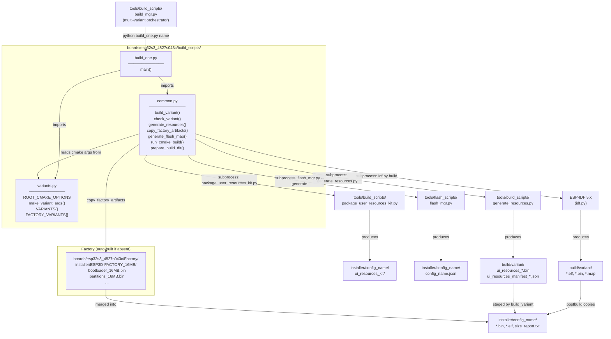
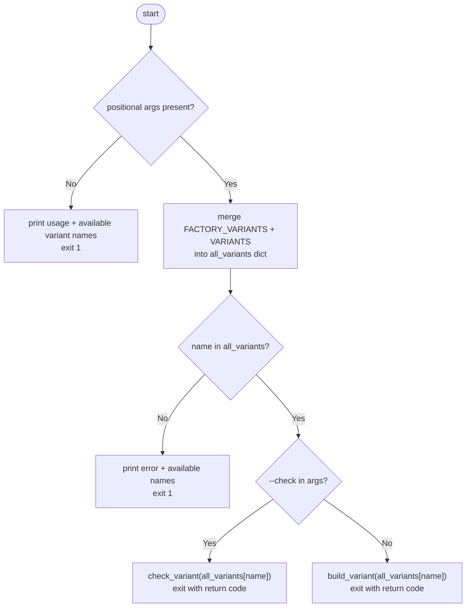
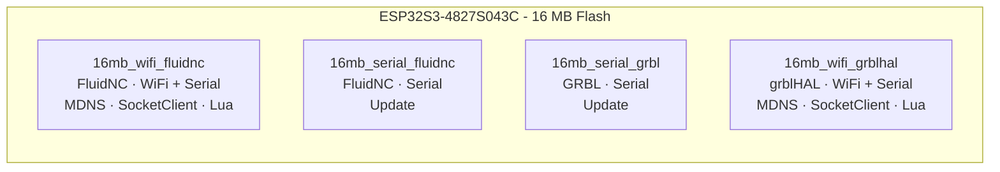
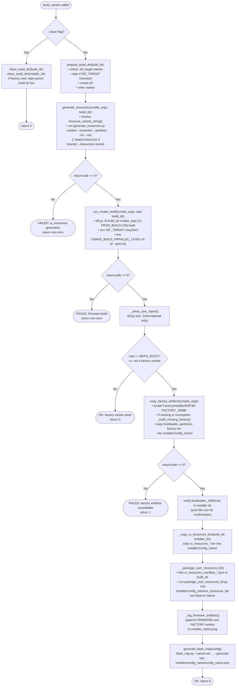
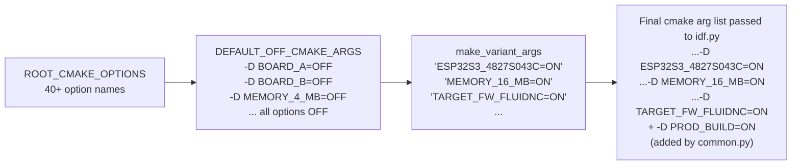
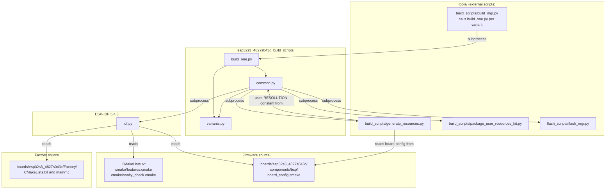

# esp32s3_4827s043c_build_scripts

Build automation scripts for the **ESP32-S3 4827S043C** board — a 480×272 capacitive-touch LCD panel. This module handles the full firmware build pipeline: CMake flag composition, ESP-IDF invocation, UI resource generation, factory artifact staging, and installer packaging for every supported firmware variant.

---

## Table of Contents

1. [Module Overview](#1-module-overview)
2. [File Structure](#2-file-structure)
3. [Architecture Diagram](#3-architecture-diagram)
4. [Component Reference](#4-component-reference)
   - [variants.py](#41-variantspy)
   - [common.py](#42-commonpy)
   - [build_one.py](#43-build_onepy)
5. [Variant Catalogue](#5-variant-catalogue)
6. [Build Pipeline](#6-build-pipeline)
7. [CMake Flag System](#7-cmake-flag-system)
8. [Installer Output Layout](#8-installer-output-layout)
9. [Dependency Map](#9-dependency-map)
10. [Usage](#10-usage)
11. [Related Modules](#11-related-modules)

---

## 1. Module Overview

| Property | Value |
|---|---|
| **Board** | ESP32-S3 4827S043C |
| **Display** | 480 × 272 px, RGB parallel, capacitive touch (GT911) |
| **Resolution constant** | `res_480_272` |
| **IDF target** | `esp32s3` |
| **Flash variants** | 16 MB only |
| **Supported CNC firmwares** | FluidNC, grblHAL, GRBL |
| **Transports** | Serial, WiFi (socket client) |
| **Factory app** | `boards/esp32s3_4827s043c/Factory/` |

The scripts reside in `boards/esp32s3_4827s043c/build_scripts/` and follow the same three-file pattern used across all board targets in this repository. They are the primary build entry point for developers targeting this board, and are also called programmatically by the repository-wide build manager (`tools/build_scripts/build_mgr.py`).

> **See also:** [`esp32s3_4827s043c_bsp.md`](esp32s3_4827s043c_bsp.md) for the Board Support Package (BSP) that these scripts compile, and [`esp32s3_4827s043c_factory.md`](esp32s3_4827s043c_factory.md) for the factory application whose artifacts are staged here.

---

## 2. File Structure

```
boards/esp32s3_4827s043c/build_scripts/
├── variants.py      # Variant definitions and CMake flag composition
├── common.py        # Build orchestration, IDF invocation, artifact management
└── build_one.py     # CLI entry point — build or check a single named variant
```

---

## 3. Architecture Diagram



---

## 4. Component Reference

### 4.1 `variants.py`

Defines **what** to build. No build logic lives here — it is pure data.

#### `ROOT_CMAKE_OPTIONS`

A master list of every CMake `OPTION()` that the root `CMakeLists.txt` exposes, covering:

| Category | Options |
|---|---|
| Board selection | `ESP32S3_4827S043C`, `ESP32S3_8048S043C`, `ESP32_PIBOT_CNC_PENDANT_V1`, … (16 boards total) |
| Memory | `MEMORY_4_MB`, `MEMORY_8_MB`, `MEMORY_16_MB` |
| PSRAM | `PSRAM_NONE`, `PSRAM_2_MB`, `PSRAM_4_MB`, `PSRAM_8_MB` |
| Firmware target | `TARGET_FW_FLUIDNC`, `TARGET_FW_GRBLHAL`, `TARGET_FW_GRBL`, `TARGET_FW_MARLIN`, … |
| Transports | `SERIAL_SERVICE`, `WIFI_SERVICE`, `BT_SERVICE`, `BT_SERIAL_SERVICE`, `BT_BLE_SERVICE`, `SOCKET_CLIENT_SERVICE`, … |
| Features | `TFT_UI_SERVICE`, `MDNS_SERVICE`, `UPDATE_SERVICE`, `LUA_INTERPRETER_SERVICE`, `SD_CARD_SERVICE`, … |

#### `DEFAULT_OFF_CMAKE_ARGS`

Auto-generated from `ROOT_CMAKE_OPTIONS`: a flat list of `-D OPTION=OFF` pairs covering **every** option. This ensures no stale CMake cache value from a previous build in the same directory can accidentally activate a feature not intended for the current variant.

#### `make_variant_args(*on_flags)`

```python
def make_variant_args(*on_flags):
    args = DEFAULT_OFF_CMAKE_ARGS.copy()   # all options → OFF
    for flag in on_flags:
        args.extend(["-D", flag])           # selectively enable
    return args
```

Returns the full `-D KEY=VALUE` list for one variant. Each `on_flag` is a string like `"ESP32S3_4827S043C=ON"` that appends after the blanket-off defaults, overriding them. CMake processes `-D` flags left-to-right, so later values win.

#### `VARIANTS` dictionary

| Key | Transport | CNC Firmware | Key extra features |
|---|---|---|---|
| `16mb_wifi_fluidnc` | WiFi + Serial | FluidNC | MDNS, SOCKET_CLIENT, LUA |
| `16mb_serial_fluidnc` | Serial only | FluidNC | UPDATE |
| `16mb_serial_grbl` | Serial only | GRBL | UPDATE |
| `16mb_wifi_grblhal` | WiFi + Serial | grblHAL | MDNS, SOCKET_CLIENT, LUA |

Each entry is a dict with four keys:

```python
{
    "name":      "16mb_wifi_fluidnc",         # human label and log identifier
    "cmake":     make_variant_args(...),       # full CMake arg list
    "cwd":       REPO_ROOT,                   # idf.py working directory
    "build_dir": os.path.join(BUILD_BASE, "esp32s3_4827s043c_16mb_wifi_fluidnc"),
}
```

#### `FACTORY_VARIANTS` dictionary

| Key | Memory | CWD | Purpose |
|---|---|---|---|
| `factory_16mb` | 16 MB | `boards/esp32s3_4827s043c/Factory/` | Factory application — provides bootloader and partition table for all regular variants |

Factory variants use a minimal CMake flag set (memory only) because the factory app has its own `CMakeLists.txt` and does not share the root feature flag system.

---

### 4.2 `common.py`

Implements **how** to build. All subprocess calls and file management are centralised here.

#### Path constants

| Constant | Value |
|---|---|
| `SCRIPT_DIR` | Absolute path to `build_scripts/` |
| `BOARD_ROOT` | `boards/esp32s3_4827s043c/` |
| `REPO_ROOT` | Repository root |
| `IDF_PATH` | From env `IDF_PATH`, defaults to a local Windows path |
| `IDF_PY` | `$IDF_PATH/tools/idf.py` |
| `GENERATE_RESOURCES` | `tools/build_scripts/generate_resources.py` |
| `PACKAGE_USER_KIT` | `tools/build_scripts/package_user_resources_kit.py` |
| `RESOLUTION` | `"res_480_272"` — must match `board_config.cmake` |
| `EXPECTED_IDF_TARGET` | `"esp32s3"` |

#### Function summary

| Function | Purpose |
|---|---|
| `ensure_idf_py()` | Validate `idf.py` is reachable; exit with an informative message if not |
| `prepare_build_dir(build_dir)` | Create dir; write `.idf_target` marker; wipe dir if marker mismatches `EXPECTED_IDF_TARGET` |
| `clean_build_dir(build_dir)` | `shutil.rmtree` a build or installer directory |
| `parse_cmake_flags(cmake_args)` | Parse a `-D KEY=VALUE` list into a `dict` |
| `build_config_name(cmake_args)` | Derive installer subdirectory name, e.g. `ESP32S3_4827S043C_16MB_wifi_fluidnc` |
| `resource_variant_string(cmake_args)` | Derive the `generate_resources.py --variant` string, e.g. `16mb_wifi_fluidnc`; returns `None` for factory |
| `generate_resources(cmake_args, build_dir)` | Invoke `generate_resources.py` to produce `ui_resources_*.bin` + manifest |
| `run_cmake_build(cmake_args, cwd, build_dir)` | `idf.py -B <build_dir> <cmake_args> build` |
| `run_cmake_check(cmake_args, cwd, build_dir)` | `idf.py -B <build_dir> <cmake_args> reconfigure` |
| `check_variant(config)` | Run `run_cmake_check` and report pass/fail |
| `build_variant(config)` | Full build pipeline (see §6) |
| `copy_factory_artifacts(cmake_args)` | Merge factory installer dir into variant installer dir; auto-builds factory if absent |
| `installer_dir_for(config)` | Resolve output installer path for a given variant config |
| `generate_flash_map(config)` | Run `flash_mgr.py --generate` to produce `<config>.json` |
| `_get_jobs_env_value()` | Extract `--jobs=N` from `sys.argv` for `CMAKE_BUILD_PARALLEL_LEVEL` |
| `_show_size_report(build_dir, cwd)` | `idf.py size` — printed to stdout only, not blocking |
| `_copy_ui_resources_bin(build_dir, installer_dir)` | Stage `ui_resources_*.bin` to installer dir |
| `_package_user_resources_kit(...)` | Run `package_user_resources_kit.py` to create `ui_resources_kit/` |
| `_log_firmware_artifacts(...)` | Append build provenance to `installer_history.log` |
| `_factory_artifacts_complete(source_dir)` | Check that `bootloader_*.bin` exists in factory installer dir |
| `_build_missing_factory(source_dir)` | Recursively invoke `build_variant` for the matching factory variant |
| `_ensure_clean_build_dir(build_dir)` | Internal: wipe build dir on IDF_TARGET mismatch |

#### IDF_TARGET guard

`prepare_build_dir` writes a `.idf_target` marker file into every build directory containing the string `esp32s3`. If the marker exists but contains a different target string (e.g. `esp32` left over from a different board), the directory is wiped automatically **before** any new files are written. This prevents silent cross-target contamination when a build directory is reused across different boards.

#### Production vs development builds

Unless `--dev` is present in `sys.argv`, the flag `-D PROD_BUILD=ON` is appended automatically to every CMake invocation. This keeps debug/logging symbols out of release images without requiring the caller to remember the flag.

#### Parallel build support

`_get_jobs_env_value()` scans `sys.argv` for `--jobs=N` (injected by `build_mgr.py`) and sets `CMAKE_BUILD_PARALLEL_LEVEL` in the subprocess environment. The `idf.py` CLI does not accept `-j`/`--jobs` directly, so the environment variable is the correct mechanism.

---

### 4.3 `build_one.py`

Thin CLI wrapper around `common.build_variant` and `common.check_variant`.

```
Usage: python build_one.py <variant_name> [--clean] [--check]

Flags:
  --clean   Wipe build dir + installer dir before building.
  --check   Run cmake reconfigure only (no compilation — fast).
```

`main()` control flow:



The merged lookup (`{**FACTORY_VARIANTS, **VARIANTS}`) ensures factory and regular variants share the same CLI namespace — `python build_one.py factory_16mb` works the same as `python build_one.py 16mb_wifi_fluidnc`.

---

## 5. Variant Catalogue

### Regular Firmware Variants



| Variant key | Memory | Transport | CNC target | Notable extra features |
|---|---|---|---|---|
| `16mb_wifi_fluidnc` | 16 MB | WiFi + Serial | FluidNC | MDNS, SocketClient, Lua |
| `16mb_serial_fluidnc` | 16 MB | Serial | FluidNC | Update |
| `16mb_serial_grbl` | 16 MB | Serial | GRBL | Update |
| `16mb_wifi_grblhal` | 16 MB | WiFi + Serial | grblHAL | MDNS, SocketClient, Lua |

All four variants share: `ESP32S3_4827S043C=ON`, `MEMORY_16_MB=ON`, `TFT_UI_SERVICE=ON`, `TFT_TOUCH_SERVICE=ON`, `SERIAL_SERVICE=ON`.

### Factory Variant

| Variant key | Memory | CWD | Artifacts produced |
|---|---|---|---|
| `factory_16mb` | 16 MB | `boards/esp32s3_4827s043c/Factory/` | `bootloader_16MB.bin`, `partitions_16MB.bin`, factory app binary |

Regular variant builds automatically invoke the factory build if its artifacts are absent or incomplete (no `bootloader_*.bin`).

---

## 6. Build Pipeline

The full sequence executed by `build_variant(config)`:



### Step summary

| Step | Tool invoked | Primary output |
|---|---|---|
| UI resource generation | `tools/build_scripts/generate_resources.py` | `ui_resources_<variant>.bin`, `ui_resources_manifest_<variant>.json`, `esp3d_ui_offsets.h` |
| Firmware compilation | `idf.py build` | `<variant>.elf`, `<variant>.bin`, `bootloader.bin`, `partitions.bin` |
| Size report | `idf.py size` | Stdout only |
| Factory staging | internal `shutil.copy2` | `bootloader_16MB.bin`, `partitions_16MB.bin`, factory bin → `installer/<config>/` |
| UI resource staging | internal `shutil.copy2` | `ui_resources_<variant>.bin` → `installer/<config>/` |
| User kit packaging | `tools/build_scripts/package_user_resources_kit.py` | `installer/<config>/ui_resources_kit/` |
| Provenance logging | internal | `installer/<config>/installer_history.log` (append) |
| Flash map generation | `tools/flash_scripts/flash_mgr.py --generate` | `installer/<config>/<config>.json` |

---

## 7. CMake Flag System

### How flags are composed



The "all-off, then selectively enable" strategy ensures reproducible configuration regardless of what is cached in the build directory.

### Config name derivation

`build_config_name()` maps CMake flags to a canonical installer directory name:

```
Pattern:  ESP32S3_4827S043C_{MEMORY}{_radio}_{firmware}

Examples:
  ESP32S3_4827S043C_16MB_wifi_fluidnc
  ESP32S3_4827S043C_16MB_serial_grbl
  ESP32S3_4827S043C_16MB_wifi_grblhal
```

`resource_variant_string()` maps the same flags to the shorter resource variant identifier used by `generate_resources.py`:

```
Pattern:  {mem}mb_{transport}_{firmware}

Examples:
  16mb_wifi_fluidnc
  16mb_serial_grbl
  16mb_wifi_grblhal
```

Returns `None` for factory variants — they have no UI resource partition.

### Flag categories and mutual exclusions

| Category | Rule |
|---|---|
| Board selection | Exactly one board flag `=ON` |
| Memory | Exactly one memory flag `=ON` |
| Firmware target | Exactly one `TARGET_FW_*=ON` |
| WiFi vs Bluetooth | Mutually exclusive — no PSRAM on this board. `cmake/sanity_check.cmake` enforces this at configure time. |
| `SOCKET_CLIENT_SERVICE` | Only valid when `WIFI_SERVICE=ON`. When ON, `WEBUI_SERVER`, `SSDP_SERVICE`, and `WS_SERVER_SERVICE` are prohibited. |

---

## 8. Installer Output Layout

After a successful `build_variant` for a regular variant:

```
installer/ESP32S3_4827S043C_16MB_wifi_fluidnc/
├── bootloader_16MB.bin                              ← factory artifact
├── partitions_16MB.bin                              ← factory artifact
├── ESP3D-FACTORY_16MB.bin                           ← factory artifact
├── ESP32S3_4827S043C_16MB_wifi_fluidnc.bin          ← main firmware
├── ESP32S3_4827S043C_16MB_wifi_fluidnc.elf          ← debug symbols
├── ui_resources_16mb_wifi_fluidnc.bin               ← UI partition
├── ESP32S3_4827S043C_16MB_wifi_fluidnc.json         ← flash map
├── size_report.txt                                  ← memory usage summary
├── installer_history.log                            ← provenance audit trail
└── ui_resources_kit/                                ← standalone customization kit
    ├── README.md
    ├── ui_resources_manifest_16mb_wifi_fluidnc.json
    ├── build_ui_resources_from_manifest.py
    └── resources/
        └── (default PNG + font sources)
```

Factory variant output:

```
boards/esp32s3_4827s043c/Factory/installer/ESP3D-FACTORY_16MB/
├── bootloader_16MB.bin
├── partitions_16MB.bin
└── ESP3D-FACTORY_16MB.bin
```

The `installer_history.log` separates entries by type to track which files came from the factory build and which from the firmware build:

```
[2026-08-18 10:30:00] factory artifacts from .../Factory/installer/ESP3D-FACTORY_16MB
  FACTORY  bootloader_16MB.bin
  FACTORY  partitions_16MB.bin
  FACTORY  ESP3D-FACTORY_16MB.bin

[2026-08-18 10:35:42] firmware build: 16mb_wifi_fluidnc
  FIRMWARE ESP32S3_4827S043C_16MB_wifi_fluidnc.bin
  FIRMWARE ESP32S3_4827S043C_16MB_wifi_fluidnc.elf
  FIRMWARE ui_resources_16mb_wifi_fluidnc.bin
```

---

## 9. Dependency Map



---

## 10. Usage

### Build a single variant

```bash
# Navigate to the build scripts directory
cd boards/esp32s3_4827s043c/build_scripts

# Standard firmware build
python build_one.py 16mb_wifi_fluidnc

# Factory application build
python build_one.py factory_16mb

# Clean build — wipes build dir + installer dir first
python build_one.py 16mb_serial_grbl --clean

# CMake reconfigure only — fast config check, no compilation
python build_one.py 16mb_wifi_grblhal --check

# List all available variant names
python build_one.py
```

### Build all variants via build_mgr

```bash
# From repository root
python tools/build_scripts/build_mgr.py --board esp32s3_4827s043c

# Parallel build with 8 jobs
python tools/build_scripts/build_mgr.py --board esp32s3_4827s043c --jobs=8
```

### Environment prerequisites

| Requirement | Notes |
|---|---|
| `IDF_PATH` env variable | Must point to ESP-IDF 5.4.3 installation |
| ESP-IDF activated shell | Run `. $IDF_PATH/export.sh` (Linux/Mac) or `export.bat` (Windows) before building |
| Python 3.8+ | Used via `sys.executable` for all subprocess calls, ensuring version consistency |
| `--dev` flag | Omit `PROD_BUILD=ON` to retain debug/verbose logging macros in the firmware |

### Adding a new variant

1. Open `boards/esp32s3_4827s043c/build_scripts/variants.py`.
2. Add an entry to `VARIANTS` using `make_variant_args()`:

```python
"16mb_serial_grblhal": {
    "name": "16mb_serial_grblhal",
    "cmake": make_variant_args(
        "ESP32S3_4827S043C=ON",
        "MEMORY_16_MB=ON",
        "TARGET_FW_GRBLHAL=ON",
        "SERIAL_SERVICE=ON",
        "TFT_UI_SERVICE=ON",
        "TFT_TOUCH_SERVICE=ON",
        "UPDATE_SERVICE=ON",
    ),
    "cwd": REPO_ROOT,
    "build_dir": os.path.join(BUILD_BASE, "esp32s3_4827s043c_16mb_serial_grblhal"),
},
```

3. Verify the CMake configuration: `python build_one.py 16mb_serial_grblhal --check`.
4. Run a full build: `python build_one.py 16mb_serial_grblhal`.

> **Constraint reminder:** WiFi (`WIFI_SERVICE`) and Bluetooth (`BT_SERVICE`) are mutually exclusive on this board (no PSRAM). `cmake/sanity_check.cmake` enforces this at configure time. Refer to [`docs/features/feature_resource_matrix.md`](https://github.com/luc-github/Pibot-cnc-pendant-firmware/blob/main/docs/features/feature_resource_matrix.md) before adding new service combinations, and [`docs/guides/esp32_memory_constraints.md`](https://github.com/luc-github/Pibot-cnc-pendant-firmware/blob/main/docs/guides/esp32_memory_constraints.md) for RAM budget implications.

---

## 11. Related Modules

| Module | Relationship |
|---|---|
| [`esp32s3_4827s043c_bsp.md`](esp32s3_4827s043c_bsp.md) | BSP compiled by these scripts — `board_init`, LVGL setup, RGB display driver, GT911 touch |
| [`esp32s3_4827s043c_factory.md`](esp32s3_4827s043c_factory.md) | Factory application whose installer artifacts are staged during regular variant builds |
| [`tools_build_scripts.md`](tools_build_scripts.md) | Repository-wide build tools: `build_mgr.py`, `generate_resources.py`, `package_user_resources_kit.py` |
| [`esp32_3248s035c_build_scripts.md`](esp32_3248s035c_build_scripts.md) | Sibling board build scripts — identical three-file pattern, SPI display |
| [`esp32_3248s035r_build_scripts.md`](esp32_3248s035r_build_scripts.md) | Sibling board build scripts — SPI display, resistive touch |
| [`esp32s3_8048s043c.md`](esp32s3_8048s043c.md) | Sibling ESP32-S3 board — 800×480 RGB display, same build script pattern |
| [`esp32s3_8048s070c_build_scripts.md`](esp32s3_8048s070c_build_scripts.md) | Sibling ESP32-S3 board — 800×480 7-inch display |
| [`docs/guides/board_build_guidelines.md`](https://github.com/luc-github/Pibot-cnc-pendant-firmware/blob/main/docs/guides/board_build_guidelines.md) | Cross-board build conventions and guidelines |
| [`docs/features/feature_resource_matrix.md`](https://github.com/luc-github/Pibot-cnc-pendant-firmware/blob/main/docs/features/feature_resource_matrix.md) | Feature compatibility matrix — consult before changing transport or service flags |
| [`docs/ui_resources/development.md`](https://github.com/luc-github/Pibot-cnc-pendant-firmware/blob/main/docs/ui_resources/development.md) | UI resource partition format; explains `generate_resources.py` inputs and outputs |
| [`docs/guides/esp32_memory_constraints.md`](https://github.com/luc-github/Pibot-cnc-pendant-firmware/blob/main/docs/guides/esp32_memory_constraints.md) | ESP32-S3 heap constraints relevant to variant selection |
