# esp32s3_4827s043c_factory

The `esp32s3_4827s043c_factory` module is the **factory/recovery partition application** for the ESP32-S3 4827S043C board — a 4.3″ capacitive-touch display panel based on the ILI9485 RGB controller and the GT911 I2C touch IC. It provides a self-contained, touch-navigable firmware recovery menu that can reflash the main application OTA partitions and the `ui_resources` data partition directly from a microSD card. Because this board variant ships with no physical buttons, no buzzer, and no rotary encoder (all pins are `GPIO_NUM_NC`), all navigation is driven exclusively by three virtual on-screen button regions rendered at the bottom of the display.

---

## Table of Contents

1. [Module Position in the System](#1-module-position-in-the-system)
2. [Hardware Context](#2-hardware-context)
3. [Module Architecture](#3-module-architecture)
4. [Factory Application (`Factory/main/`)](#4-factory-application-factorymain)
   - 4.1 [Initialization Sequence](#41-initialization-sequence)
   - 4.2 [OTA Backup Restore](#42-ota-backup-restore)
   - 4.3 [Menu System](#43-menu-system)
   - 4.4 [Touch Navigation](#44-touch-navigation)
   - 4.5 [Firmware Flash Action](#45-firmware-flash-action)
   - 4.6 [Resources Flash Action](#46-resources-flash-action)
   - 4.7 [Snapshot Subsystem (optional)](#47-snapshot-subsystem-optional)
5. [Graphics Layer (`gfx.c`)](#5-graphics-layer-gfxc)
6. [Peripheral Drivers](#6-peripheral-drivers)
   - 6.1 [Touch — GT911 (I2C)](#61-touch--gt911-i2c)
   - 6.2 [SD Card (SPI)](#62-sd-card-spi)
   - 6.3 [Buttons](#63-buttons)
   - 6.4 [Buzzer](#64-buzzer)
   - 6.5 [Rotary Encoder](#65-rotary-encoder)
   - 6.6 [Logging Gate (`factory_log.h`)](#66-logging-gate-factory_logh)
7. [Board Support Package (`components/bsp/`)](#7-board-support-package-componentsbsp)
   - 7.1 [Display Initialization — ILI9485 RGB](#71-display-initialization--ili9485-rgb)
   - 7.2 [VSYNC-Synchronized Flush](#72-vsync-synchronized-flush)
   - 7.3 [LVGL Initialization](#73-lvgl-initialization)
   - 7.4 [Touch Read Callback](#74-touch-read-callback)
   - 7.5 [Custom Control Events](#75-custom-control-events)
8. [Build System (`build_scripts/`)](#8-build-system-build_scripts)
9. [Flash Map and OTA Layout](#9-flash-map-and-ota-layout)
10. [Data Flow Diagrams](#10-data-flow-diagrams)
11. [Related Modules](#11-related-modules)

---

## 1. Module Position in the System

This module is a **child** of the `esp32s3_4827s043c` board target and is one of three sub-modules that constitute the full board package:

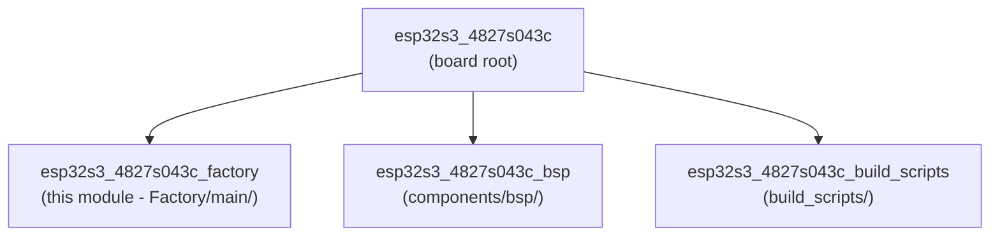

The factory app is **separate from the main firmware**. It resides in the ESP32-S3's `factory` OTA partition and is entered only via the software `[ESP444]FACTORY` trigger issued by the main firmware (see `esp444.cpp`). There is no custom bootloader hook on this board — the board has no physical button to hold during power-on, so `ENABLE_CUSTOM_BOOT_LOADER` is `OFF` in `CMakeLists.txt`. The main firmware itself saves the OTA partition state before switching the boot target.

Contrast with boards that **do** have a custom bootloader hook (e.g. `pibot_pendant_v1_0`, `ESP32_S3_WROOM_CAM`), where the user can hold a physical button at power-on to enter recovery — see [pibot_pendant_v1_0_bootloader.md](pibot_pendant_v1_0_bootloader.md).

---

## 2. Hardware Context

| Feature | Value |
|---|---|
| SoC | ESP32-S3 (dual-core Xtensa LX7, 240 MHz) |
| Display panel | ILI9485 — 480 × 272 physical (RGB parallel) |
| Logical orientation | 90° rotated → 272 × 480 portrait canvas |
| Touch IC | Goodix GT911 (capacitive, I2C) |
| Physical buttons | **None** — all `GPIO_NUM_NC` |
| Rotary encoder | **None** — all `GPIO_NUM_NC` |
| Buzzer | **None** — `GPIO_NUM_NC` |
| SD card | SPI (dedicated SPI host) |
| PSRAM | Yes — LVGL draw buffers allocated in SPIRAM |

The panel is physically mounted at 90° inside the enclosure. The `gfx` coordinate system treats the screen as **272 px wide × 480 px tall** (portrait). All layout constants in `main.c` are scaled from a 320 × 480 reference (other boards such as `esp32_3248s035r`) by a factor of `272/320 ≈ 0.85`. Border and outline pixel-thickness values (1–2 px insets) are left unscaled.

---

## 3. Module Architecture

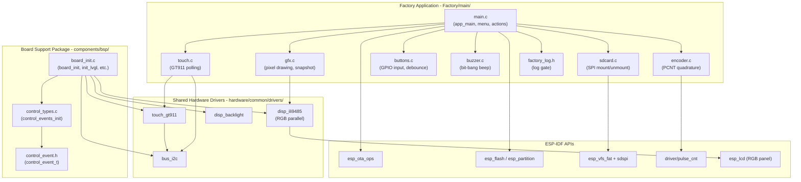

---

## 4. Factory Application (`Factory/main/`)

### 4.1 Initialization Sequence

`app_main()` executes the following startup sequence before entering the main event loop:

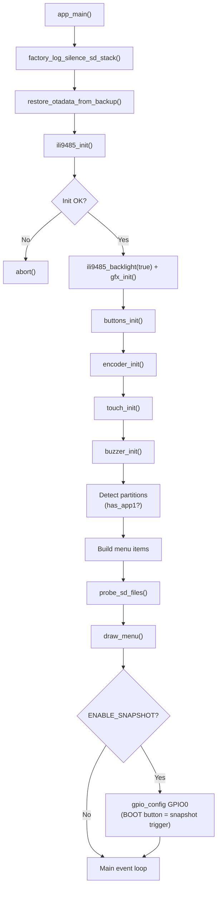

On this board, `buttons_init()`, `buzzer_init()`, and `encoder_init()` all detect `GPIO_NUM_NC` pins and return immediately without configuring any GPIO. The display and touch are the only active peripherals.

### 4.2 OTA Backup Restore

The main firmware (see `esp444.cpp`) writes a backup of the two OTA data entries to a reserved 4 KB sector **before** switching the boot partition to `factory`. This backup lives at `OTADATA_BACKUP_OFFSET = 0xB000`, safely between the bootloader end and the partition table at `0xC000`. A 32-bit magic word (`0xAA55AA55`) at `+0x40` marks a valid backup.

`restore_otadata_from_backup()` runs at the very start of `app_main()`, before any display or peripheral initialization. The algorithm is:

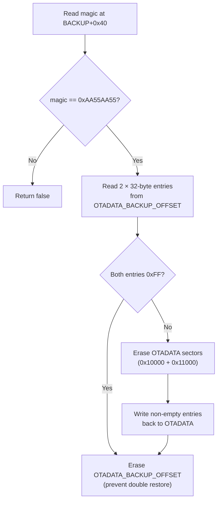

> **Critical constraint:** `esp_flash_erase_region(NULL, 0xB000, …)` targets an address below the first VFS partition. ESP-IDF's default `CONFIG_SPI_FLASH_DANGEROUS_WRITE_ABORTS` rejects this. The factory `sdkconfig` must set `CONFIG_SPI_FLASH_DANGEROUS_WRITE_ALLOWED=y`. This is intentional — the factory app is a privileged recovery tool with direct flash access.

When porting this board to a new flash layout, `OTADATA_BACKUP_OFFSET` must be recalculated and kept in sync with `esp444.cpp` in the main firmware.

### 4.3 Menu System

The menu is a statically-allocated array of `menu_item_t` structs built at startup:

```c
typedef struct {
    const char *label;
    menu_action_t action;
    uint16_t color;    /* text color when not selected */
} menu_item_t;
```

Available actions (`menu_action_t`):

| Action | Description |
|---|---|
| `MENU_ACTION_BOOT_APP0` | Set boot partition to `app0` and reboot |
| `MENU_ACTION_BOOT_APP1` | Set boot partition to `app1` and reboot (shown only if `app1` exists) |
| `MENU_ACTION_SD_UPDATE_APP0` | Flash `esp3dfw.bin` from SD → `app0` |
| `MENU_ACTION_SD_UPDATE_APP1` | Flash `esp3dfw.bin` from SD → `app1` (if `app1` exists) |
| `MENU_ACTION_SD_UPDATE_RES` | Flash `ui_resources.bin` from SD → `ui_resources` partition |

The SD is probed at startup and re-probed after any failed flash operation (`probe_sd_files()`). SD indicator labels `FW` (green) and `RES` (cyan) appear in the header area when the matching `.bin` file is detected on the card.

Menu navigation functions:

- `menu_select(index)` — moves selection, redraws both old and new highlighted items, clears any active status message.
- `menu_move(direction)` — wraps-around navigation (`+1` / `-1`), calls `menu_select`.
- `execute_selected_action()` — dispatches the currently highlighted action.

Layout constants are scaled to the 272 × 480 logical canvas (× 0.85 from the 320 × 480 reference boards):

| Constant | Value | Role |
|---|---|---|
| `MENU_START_Y` | 94 | Y of first menu item |
| `MENU_ITEM_H` | 34 | Height per item |
| `MENU_PAD_X` | 20 | Horizontal padding |
| `STATUS_Y` | `SCREEN_HEIGHT − 28 − BTN_HINT_H` | Status text Y |
| `BTN_HINT_H` | `2×22 + 9 = 53` | Height of virtual button bar |

The screen layout from top to bottom:

```
┌──────────────────────────────────┐  ← y=0
│  "Recovery vX.Y"  (header)       │
│  ──────────────────────────────  │  ← y=40
│  Active: app0          SD: FW RES│  ← y=45 / y=68
│  ──────────────────────────────  │  ← y=88
│  [ Boot app0              ]      │  ← MENU_START_Y=94
│  [ SD -> app0             ]      │
│  [ SD -> resources        ]      │
│  ──────────────────────────────  │
│  Power off to cancel (status)    │  ← STATUS_Y
│  ══════════════════════════════  │  ← BTN_HINT_BASE_Y
│    ▲        ▼         ✓          │  ← virtual button bar
└──────────────────────────────────┘  ← y=479
```

### 4.4 Touch Navigation

Because no physical buttons exist, three **virtual button regions** are drawn at the bottom of the screen. Each occupies the full bar height and one-third of the screen width, making the effective tap target far larger than the drawn circle icon.

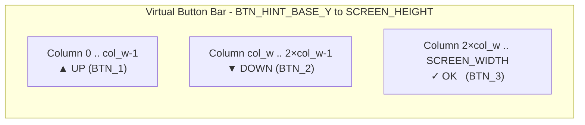

`touch_hint_hit_test(x, y)` maps a touch coordinate to `BTN_1 / BTN_2 / BTN_3 / BTN_NONE`. Touches above `BTN_HINT_BASE_Y` always return `BTN_NONE`.

Touch input in the main loop uses edge detection (`touch_was_pressed` flag) to fire only on the leading edge of a press:

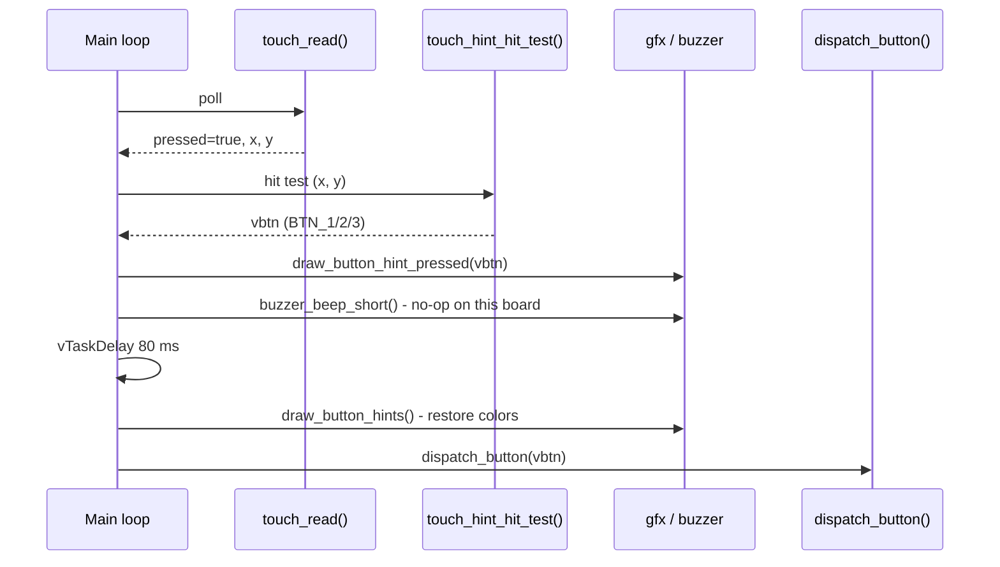

`dispatch_button()` is the single unified handler for both physical buttons (when present on other boards) and virtual touch buttons:

| Button | Action |
|---|---|
| `BTN_1` | `menu_move(-1)` — scroll up |
| `BTN_2` | `menu_move(+1)` — scroll down |
| `BTN_3` | `execute_selected_action()` — confirm |

### 4.5 Firmware Flash Action

`action_sd_update(target_label)` flashes `esp3dfw.bin` from the SD card to the named OTA partition using the standard ESP-IDF OTA API:

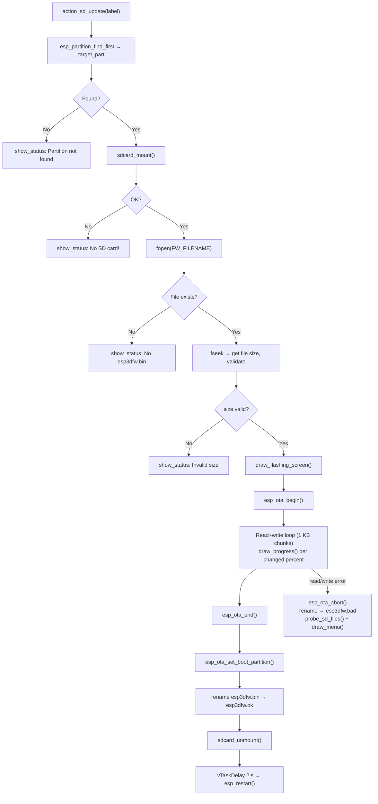

After a successful flash, the source file is renamed to `esp3dfw.ok` on the SD card. On failure it becomes `esp3dfw.bad`. This allows the operator to distinguish a successful flash from one that failed without removing the card.

### 4.6 Resources Flash Action

`action_sd_update_res()` writes `ui_resources.bin` from the SD card to the `ui_resources` data partition. Unlike firmware flashing it uses `esp_partition_erase_range` + `esp_partition_write` directly (no OTA handle), since `ui_resources` is a raw data partition, not an OTA app slot.

The binary begins with a 16-byte build header (`"ESP3"` + 12-char variant string) generated by `generate_resources.py`. The factory app reads and logs this header to help diagnose variant mismatches, but does not block the flash on a mismatch — the operator is expected to verify the correct binary beforehand.

Post-flash, the file is renamed to `ui_resources.ok` or `ui_resources.bad` using the same convention as firmware flashing.

### 4.7 Snapshot Subsystem (optional)

When `ENABLE_SNAPSHOT` is defined at compile time, pressing `GPIO0` (the ESP32-S3 `BOOT` button, always physically present on the module) triggers a full screen capture to the SD card:

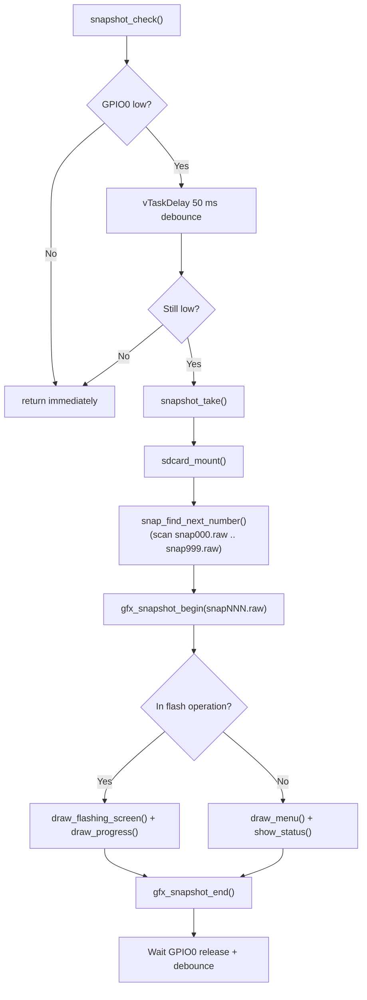

The raw file format is: `uint32_t width` + `uint32_t height` (little-endian) followed by native RGB565 pixels in row-major order. A companion Python tool `snap2png.py` (found in other boards' `Factory/tools/raw2png/`) converts these files to PNG. This board's factory app does not currently ship that tool, but the file format is identical.

Snapshot checks are placed at strategic points in the flash loop (once per progress percent) and at the result screen, so the full flash operation can be captured visually.

---

## 5. Graphics Layer (`gfx.c`)

The GFX layer is a lightweight, stateless drawing API that operates on a single `uint16_t line_buf[SCREEN_WIDTH]` static line buffer. All drawing is done line by line to minimise stack and heap usage on the memory-constrained ESP32-S3.

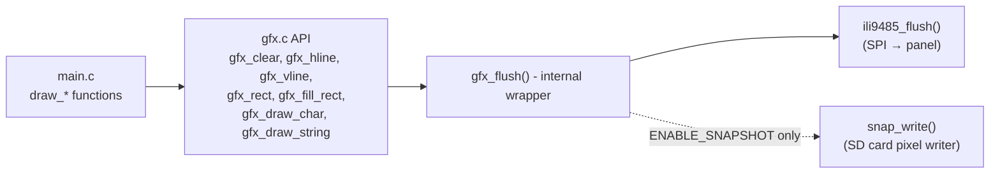

All pixel data is byte-swapped before transmission (the ILI9485 expects big-endian RGB565 over SPI). `snap_write()` un-swaps the bytes back to native RGB565 when writing to the SD card snapshot file, seeking to the correct file offset for each row.

**GFX API summary:**

| Function | Description |
|---|---|
| `gfx_init()` | No-op on this board (reserved hook) |
| `gfx_clear(color)` | Fill entire screen with one color, line by line |
| `gfx_hline(x, y, w, color)` | Horizontal line, clipped to screen bounds |
| `gfx_vline(x, y, h, color)` | Vertical line (single-pixel flush per row) |
| `gfx_rect(x, y, w, h, color)` | Outline rectangle (four calls to h/vline) |
| `gfx_fill_rect(x, y, w, h, color)` | Filled rectangle, line by line |
| `gfx_draw_char(x, y, c, fg, bg)` | 8 × 16 bitmap glyph from `font8x16` |
| `gfx_draw_string(x, y, str, fg, bg)` | String rendering via repeated `gfx_draw_char` |
| `gfx_snapshot_begin(filepath)` | Open `.raw` file, write 8-byte header, pre-fill black |
| `gfx_snapshot_end()` | Flush and close snapshot file |
| `gfx_snapshot_is_capturing()` | Returns `true` while a capture is in progress |

---

## 6. Peripheral Drivers

### 6.1 Touch — GT911 (I2C)

`touch.c` is a thin wrapper over the shared `hardware/common/drivers/touch_gt911` component — the same driver used by the main firmware BSP. No re-implementation occurs here; the shared driver handles I2C communication, coordinate swap/invert flags from `hw_config.h`, and auto-detection of the panel's native max coordinates from the GT911 device registers.

```c
typedef struct {
    bool    pressed;
    int16_t x;      /* display pixel column */
    int16_t y;      /* display pixel row   */
} touch_point_t;
```

`touch_read()` calls `touch_gt911_read()` and copies the result directly. No additional coordinate rescaling is needed because the GT911 driver applies swap/invert flags internally.

### 6.2 SD Card (SPI)

`sdcard.c` mounts the SD card via `esp_vfs_fat_sdspi_mount()` at `/sdcard`. It keeps the SPI bus initialized across unmount/remount cycles to avoid conflicts with the TFT SPI peripheral — `spi_bus_free()` is deliberately not called in `sdcard_unmount()`. The bus is initialized only once (guarded by a `spi_bus_inited` flag).

Expected files at the SD card root:

| Filename | Role | Post-flash rename |
|---|---|---|
| `esp3dfw.bin` | Main firmware binary | → `esp3dfw.ok` (success) / `esp3dfw.bad` (failure) |
| `ui_resources.bin` | UI resources partition image | → `ui_resources.ok` / `ui_resources.bad` |

### 6.3 Buttons

`buttons.c` implements GPIO polling with 50 ms debounce. On this board all three button pins are `GPIO_NUM_NC`, so `buttons_init()` detects an all-zero `pin_mask` and skips `gpio_config()` entirely. `button_wait_press(timeout_ms)` polls every 20 ms and returns `BTN_NONE` on timeout. The code is structurally identical to `pibot_pendant_v1_0` so it works unchanged if this board variant ever has physical buttons populated.

### 6.4 Buzzer

`buzzer.c` uses bit-bang square wave generation at 2700 Hz for a 40 ms duration (`buzzer_beep_short()`). On this board `BUZZER_PIN == GPIO_NUM_NC`; both `buzzer_init()` and `buzzer_beep_short()` return immediately after the `GPIO_IS_VALID_GPIO()` guard. Call sites in `main.c` are not conditionalised — they remain unchanged regardless of board capability.

### 6.5 Rotary Encoder

`encoder.c` uses the ESP32-S3 PCNT peripheral for quadrature decoding (4 pulses/detent, 1000 ns glitch filter). `encoder_init()` checks `GPIO_IS_VALID_GPIO()` for both `ENCODER_A_PIN` and `ENCODER_B_PIN` and skips PCNT setup entirely when they are `GPIO_NUM_NC`. `encoder_read()` returns `0` while `s_initialized` is false. The main loop polls the encoder every ~100 ms (governed by `button_wait_press(100)`).

### 6.6 Logging Gate (`factory_log.h`)

The factory app uses a compile-time logging gate independent of the main sdkconfig log level:

```c
#if FACTORY_LOG_LEVEL
#define FACTORY_LOGD(tag, fmt, ...) ESP_LOGI(tag, fmt, ##__VA_ARGS__)
#else
#define FACTORY_LOGD(tag, fmt, ...) do {} while (0)
#endif
```

`FACTORY_LOG_LEVEL` is set by the `ENABLE_FACTORY_DEBUG_LOG` option in `Factory/CMakeLists.txt`. Warnings (`ESP_LOGW`) and errors (`ESP_LOGE`) are always active regardless of this gate.

`factory_log_silence_sd_stack()` — called at the very start of `app_main()` — suppresses chatty runtime logs from `sdmmc`, `vfs_fat_sdmmc`, `sdspi`, `fatfs`, and related tags via `esp_log_level_set()`. This is separate from the sdkconfig-level suppression applied to early-boot IDF messages (emitted before `app_main()` runs and therefore not suppressible at runtime).

---

## 7. Board Support Package (`components/bsp/`)

The BSP is used by the **main firmware**, not by the factory app (which uses its own minimal peripheral drivers described in §6). It is documented here because it defines the canonical hardware configuration for this board.

### 7.1 Display Initialization — ILI9485 RGB

`board_init()` initialises the system in the following order:

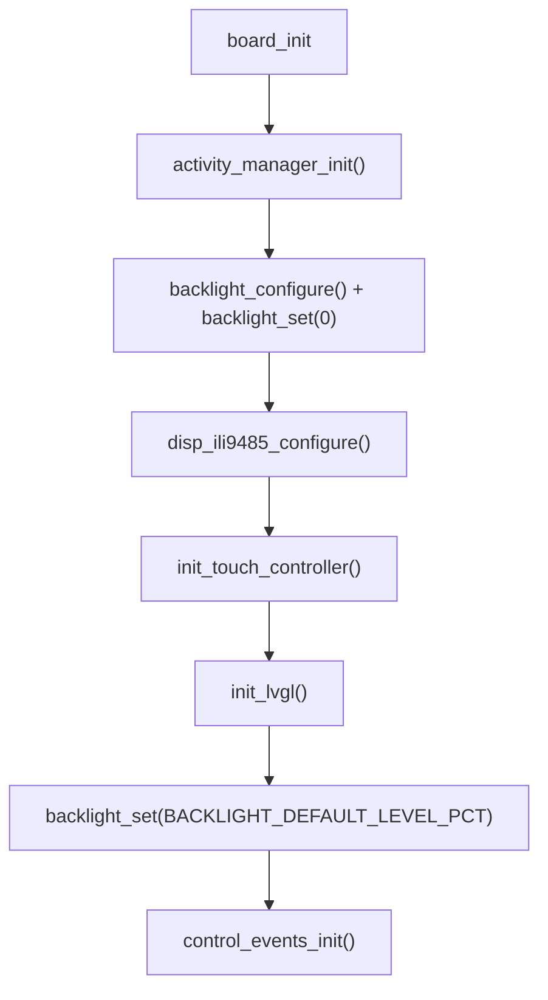

The ILI9485 is driven via the ESP-IDF `esp_lcd_rgb_panel` API through the shared `disp_ili9485` driver from `hardware/drivers_video_rgb/`. See [display_rgb_drivers.md](display_rgb_drivers.md) for driver-level details.

### 7.2 VSYNC-Synchronized Flush

The RGB panel shares a single frame buffer between the CPU and the display controller. To eliminate tearing, the LVGL flush callback synchronises with the panel's VSYNC interrupt using a pair of FreeRTOS binary semaphores:

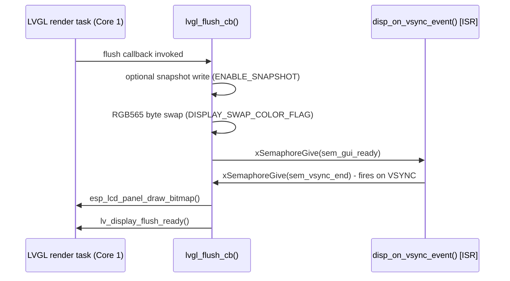

`sem_gui_ready` signals the ISR that the CPU render is complete; `sem_vsync_end` signals the flush callback that VSYNC has fired and it is safe to push the buffer to the panel.

### 7.3 LVGL Initialization

`init_lvgl()` performs the following setup:

1. Calls `lv_init()`
2. Creates `sem_vsync_end` and `sem_gui_ready` semaphores
3. Registers `disp_on_vsync_event` as the RGB panel VSYNC callback
4. Creates the LVGL display object at `DISPLAY_WIDTH_PX × DISPLAY_HEIGHT_PX`
5. Allocates one or two draw buffers from **SPIRAM** (`MALLOC_CAP_SPIRAM`)
6. Configures `LV_COLOR_FORMAT_RGB565`, partial render mode, and `lvgl_flush_cb`
7. Starts the LVGL tick `esp_timer` (period: `LVGL_TICK_PERIOD_MS`)
8. Creates and registers the GT911 touch input device with a 10 ms poll period

### 7.4 Touch Read Callback

`touch_read_cb()` maps GT911 native coordinates to display pixel coordinates using a ratio against `touch_gt911_get_x_max()` / `touch_gt911_get_y_max()`, then forwards the result to LVGL as `LV_INDEV_STATE_PRESSED` or `LV_INDEV_STATE_RELEASED`.

It also integrates with the **activity manager**: the first touch that wakes the display from a screen-timeout sleep is consumed for the wake-up event and not forwarded to LVGL, preventing accidental UI activation.

### 7.5 Custom Control Events

`control_events_init()` registers three board-specific LVGL event codes using `lv_event_register_id()`:

| Symbol | Role |
|---|---|
| `LV_EVENT_SWITCH_PRESSED` | Physical switch press (not populated on this board) |
| `LV_EVENT_SWITCH_RELEASED` | Physical switch release |
| `LV_EVENT_POTENTIOMETER_CHANGED` | Analog potentiometer change (not populated) |

These are carried in `control_event_t` payloads through the LVGL event system. On this board, only touch events are active; switch and potentiometer events are reserved for future hardware variants that may populate those components.

```c
typedef struct {
    lv_indev_t      *indev;
    uint32_t         btn_id;
    lv_indev_type_t  type;
    control_family_t family_id;
    int32_t          steps;
    uint32_t         press_duration;  /* milliseconds */
} control_event_t;
```

---

## 8. Build System (`build_scripts/`)

The build scripts orchestrate all ESP-IDF builds for this board's firmware variants. They are Python wrappers around `idf.py` that inject per-variant CMake arguments.

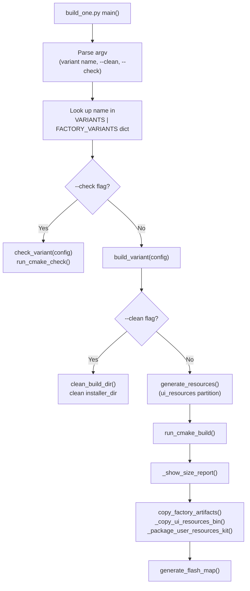

`make_variant_args()` in `variants.py` constructs the list of CMake `-D` flags from `DEFAULT_OFF_CMAKE_ARGS` (all features off by default) plus any feature flags explicitly enabled for the variant — for example `ENABLE_SNAPSHOT`, `ENABLE_FACTORY_DEBUG_LOG`, or transport selection flags.

---

## 9. Flash Map and OTA Layout

The factory app and the main firmware share a common flash map. Critical addresses:

| Region | Offset | Notes |
|---|---|---|
| Bootloader | `0x0000` | Standard IDF bootloader — no custom hook on this board |
| OTA data backup | `0xB000` | Written by main firmware before switching to factory |
| Partition table | `0xC000` | Standard IDF partition table |
| NVS | `0xD000` | First partition, start of VFS-managed area |
| OTA data (`otadata`) | `0x10000` | Two 4 KB sectors (entries at `+0x0000` and `+0x1000`) |
| `factory` partition | per table | This recovery app resides here |
| `app0` partition | per table | Primary main firmware OTA slot |
| `app1` partition | per table | Secondary slot (if present in partition table) |
| `ui_resources` | per table | Raw data partition for UI images, fonts, and themes |

The OTA backup sector at `0xB000` satisfies all constraints:
- After bootloader end
- Before the partition table (`0xC000`)
- Does not overlap any partition (NVS starts at `0xD000`)
- 4 KB-aligned

> **Porting note:** If the bootloader size changes (e.g. when enabling a custom bootloader on a derived board), `OTADATA_BACKUP_OFFSET` must be recalculated and the new value applied identically in both `Factory/main/main.c` (factory app) and `esp444.cpp` (main firmware).

---

## 10. Data Flow Diagrams

### Overall Recovery Entry and Exit Flow

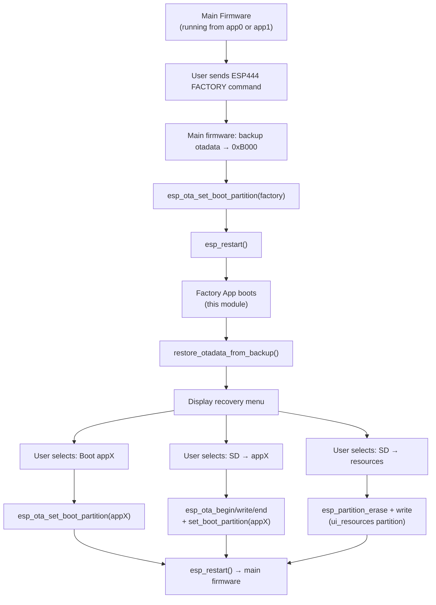

### SD Update Data Flow (Firmware)

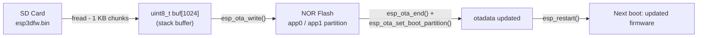

---

## 11. Related Modules

| Module | Relationship |
|---|---|
| [esp32s3_4827s043c_bsp.md](esp32s3_4827s043c_bsp.md) | BSP used by the main firmware on this board — defines ILI9485 / GT911 / LVGL integration |
| [esp32s3_4827s043c_build_scripts.md](esp32s3_4827s043c_build_scripts.md) | Build system orchestration for all firmware variants of this board |
| [pibot_pendant_v1_0_factory_app.md](pibot_pendant_v1_0_factory_app.md) | Reference implementation of the same factory pattern with physical buttons, buzzer, encoder, and ILI9341 SPI display |
| [pibot_pendant_v1_0_bootloader.md](pibot_pendant_v1_0_bootloader.md) | Custom bootloader hooks providing button-hold entry into recovery — not used on this board |
| [display_rgb_drivers.md](display_rgb_drivers.md) | Shared `disp_ili9485` RGB driver used by the BSP |
| [touch_drivers.md](touch_drivers.md) | Shared `touch_gt911` driver used by both the factory app (`touch.c`) and the BSP (`board_init.c`) |
| [esp32s3_8048s043c_factory.md](esp32s3_8048s043c_factory.md) | Parallel board with 800 × 480 RGB panel (ST7262) — same factory pattern, different display |
| [esp32s3_8048s070c_factory_app.md](esp32s3_8048s070c_factory_app.md) | 7″ RGB panel variant — same factory pattern |
