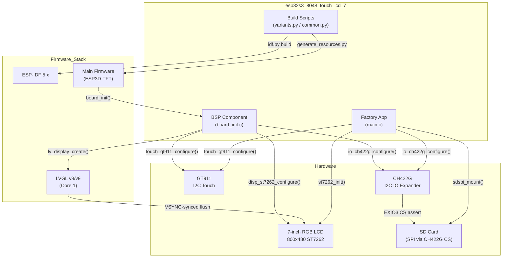
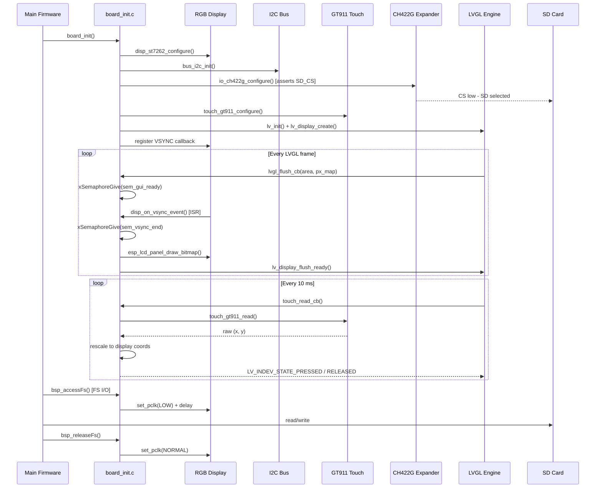

# esp32s3_8048_touch_lcd_7

## Introduction

The `esp32s3_8048_touch_lcd_7` module is the Board Support Package (BSP) for an ESP32-S3 based 7-inch 800×480 capacitive-touch LCD board. It provides all hardware-level initialization and recovery tooling required to run the ESP3D-TFT pendant firmware on this specific hardware variant.

Unlike boards that use SPI displays, this board drives its panel through a **parallel RGB interface** (ST7262-compatible), which imposes a dedicated VSYNC-synchronization path to prevent display tearing. The board also routes the SD card chip-select through a **CH422G I2C IO expander** rather than a direct GPIO, and carries **no physical buttons, rotary encoder, or buzzer** — user interaction in the factory recovery app is handled entirely through capacitive touch.

The module is composed of three sub-modules:

| Sub-module | Path | Purpose |
|---|---|---|
| [BSP Component](esp32s3_8048_touch_lcd_7_bsp.md) | `components/bsp/` | Hardware init: RGB display, GT911 touch, LVGL integration, FS access pixel-clock patch |
| [Factory App](esp32s3_8048_touch_lcd_7_factory.md) | `Factory/main/` | Recovery partition: OTA flashing, UI resources update, touch-navigable menu |
| [Build Scripts](esp32s3_8048_touch_lcd_7_build_scripts.md) | `build_scripts/` | Variant matrix, build automation, resource generation, installer packaging |

---

## Hardware Overview

| Property | Value |
|---|---|
| SoC | ESP32-S3 |
| Flash | 8 MB |
| PSRAM | Yes (SPIRAM, used for LVGL draw buffers) |
| Display | 7-inch, 800×480, RGB parallel (ST7262) |
| Touch | GT911 capacitive, I2C |
| IO Expander | CH422G (I2C) — SD card CS + LCD/touch reset lines |
| SD Card | SPI (chip-select via CH422G EXIO3) |
| Physical buttons | None (GPIO_NUM_NC for all BTN/ENCODER/BUZZER pins) |
| Recovery trigger | Software only — `[ESP444]FACTORY` command from main firmware |

---

## Architecture Overview

---

## Sub-module Descriptions

### BSP Component — [`esp32s3_8048_touch_lcd_7_bsp.md`](esp32s3_8048_touch_lcd_7_bsp.md)

The BSP is the hardware abstraction layer consumed by the main firmware. Its entry point is `board_init()`, which orchestrates:

1. **Display initialization** via `disp_st7262_configure()` — sets up the parallel RGB panel and returns an `esp_lcd_panel_handle_t`.
2. **VSYNC synchronization** — registers `disp_on_vsync_event()` on the RGB panel driver; the `lvgl_flush_cb` uses a binary semaphore pair (`sem_gui_ready` / `sem_vsync_end`) to ensure each LVGL frame is transferred during the safe blanking window.
3. **Touch controller** — `init_touch_controller()` initializes the shared I2C bus, configures the CH422G IO expander (asserting SD_CS), then configures the GT911. `touch_read_cb` maps raw GT911 coordinates to LVGL display coordinates using `touch_gt911_get_x_max()`/`get_y_max()` because the GT911's reported resolution differs from the panel's physical 800×480.
4. **LVGL initialization** — `init_lvgl()` allocates draw buffers from SPIRAM, registers the flush callback, and starts the tick timer.
5. **FS access pixel-clock patch** — `bsp_accessFs()` / `bsp_releaseFs()` throttle the RGB pixel clock during SD/flash access to prevent memory-bus contention that could corrupt the RGB framebuffer.
6. **Control events** — registers custom LVGL event IDs via `control_events_init()`.

Key distinction from SPI-display boards: the RGB driver owns a continuous DMA scan-out, so the flush callback cannot write pixels at any arbitrary time — it must wait for VSYNC.

---

### Factory App — [`esp32s3_8048_touch_lcd_7_factory.md`](esp32s3_8048_touch_lcd_7_factory.md)

The factory/recovery partition runs when the main firmware issues an `[ESP444]FACTORY` command. Because this board has no hardware boot button, **there is no custom bootloader hook** — the main firmware backs up `otadata` to a reserved flash sector (at `0xB000`) before switching the boot partition to factory; the factory app restores it on startup via `restore_otadata_from_backup()`.

The factory app implements a **touch-navigable menu** with virtual on-screen buttons (Up ↑ / Down ↓ / OK ✓) drawn using a bare-metal graphics layer (`gfx.c` over `st7262.c`). Navigation also works via rotary encoder and physical buttons, but those are wired to `GPIO_NUM_NC` on this board — the code remains portable for hardware variants that populate those parts.

Recovery actions:
- **Boot app0 / app1** — sets the OTA boot partition and reboots.
- **SD → app0 / app1** — streams `esp3dfw.bin` from SD card to flash using `esp_ota_begin/write/end`.
- **SD → resources** — erases and writes `ui_resources.bin` to the `ui_resources` partition.

An optional **snapshot feature** (`ENABLE_SNAPSHOT`) captures raw RGB565 framebuffer data to SD card for visual debugging.

---

### Build Scripts — [`esp32s3_8048_touch_lcd_7_build_scripts.md`](esp32s3_8048_touch_lcd_7_build_scripts.md)

The build scripts define the complete variant matrix for this board and orchestrate the full build pipeline:

- **`variants.py`** — defines `VARIANTS` (regular firmware) and `FACTORY_VARIANTS` (recovery partition), each specifying CMake flags, working directory, and build output path. The board supports 8 MB flash only; transports include WiFi + socket-client and serial (no Bluetooth — no PSRAM-safe BT on this variant).
- **`common.py`** — implements `build_variant()` which: generates UI resources (`generate_resources.py`), runs `idf.py build`, copies factory artifacts (bootloader, partition table), copies `ui_resources_*.bin` to the installer directory, packages the user-facing `ui_resources_kit`, and generates the flash map.
- **`build_one.py`** — CLI entry point for building a single named variant.

The `bsp_accessFs` / `bsp_releaseFs` pixel-clock patch and the absence of a custom bootloader hook are reflected in the CMake flags: `ENABLE_CUSTOM_BOOT_LOADER` is **OFF** for this board.

---

## Component Interaction Diagram

---

## Key Design Decisions

### RGB Parallel Interface + VSYNC Synchronization

The ST7262 panel uses a parallel RGB interface driven by the ESP32-S3's LCD peripheral in continuous DMA mode. Unlike SPI panels where transmission is fully software-controlled, the RGB DMA runs independently. Writing pixels at the wrong time relative to scan-out causes visible tearing. The BSP uses a binary semaphore pair: `lvgl_flush_cb` signals `sem_gui_ready` before the panel driver can latch the write window, and `disp_on_vsync_event` (ISR) signals `sem_vsync_end` to release the flush once the safe window opens.

### CH422G IO Expander for SD_CS

The SD card's chip-select is not a free GPIO on this board — it is routed through `EXIO3` of the onboard CH422G I2C expander. Both the BSP and the factory app must initialize the expander and assert `EXIO3` low before any SD access. The constant `CH422G_INITIAL_OUTPUT = 0x2E & ~(1<<3)` is the known-working vendor state with EXIO3 forced low. This value **must remain identical** between `board_init.c` and the factory app's `main.c`.

### FS Access Pixel-Clock Patch

Simultaneous SD/flash DMA and RGB DMA compete for the ESP32-S3 memory bus. To prevent RGB framebuffer corruption, `bsp_accessFs()` reduces the pixel clock to a safe lower frequency before any filesystem call and `bsp_releaseFs()` restores it afterward. The delay (`DISPLAY_PATCH_FS_DELAY_MS`) allows the panel to re-sync at the new clock. This mechanism is absent on SPI-display boards.

### Touch-Only Factory Navigation

All physical input pins (buttons, encoder, buzzer) are `GPIO_NUM_NC`. The factory app's input drivers (`buttons.c`, `encoder.c`, `buzzer.c`) guard every GPIO operation with `GPIO_IS_VALID_GPIO()` checks and silently no-op on invalid pins. The factory menu is navigated exclusively by tapping virtual on-screen button icons — their touch targets use midpoint boundaries between icon centers rather than equal thirds of screen width, so the clustered landscape icons map correctly.

### No Custom Bootloader Hook

Boards with physical buttons (e.g., `pibot_pendant_v1_0`) detect a held button at boot in a custom bootloader hook to enter recovery. This board has no button, so recovery is triggered only by the main firmware's `[ESP444]FACTORY` command. The main firmware writes an `otadata` backup to sector `0xB000` before rebooting to factory; the factory app restores it on startup so that powering off from the recovery menu returns to the correct OTA slot.

---

## Relationship to Other Board Modules

This board shares its BSP architecture with other ESP32-S3 RGB-parallel boards in the repository:

| Board | Display Interface | bsp_accessFs | CH422G | Custom Bootloader |
|---|---|---|---|---|
| `esp32s3_8048_touch_lcd_7` | RGB parallel | ✅ | ✅ | ❌ |
| `esp32s3_8048s043c` | RGB parallel | ✅ | ✅ | ❌ |
| `esp32s3_8048s050c` | RGB parallel | ✅ | ✅ | ❌ |
| `esp32s3_8048s070c` | RGB parallel | ✅ | ✅ | ❌ |
| `pibot_pendant_v1_0` | SPI (ILI9341) | ❌ | ❌ | ✅ |

The hardware driver layer (`disp_st7262`, `touch_gt911`, `io_ch422g`, `bus_i2c`) is shared across boards via `hardware/common/drivers/` and `hardware/drivers_video_rgb/` — see the [Hardware_Peripheral_Drivers](Hardware_Peripheral_Drivers.md) module documentation.

The main firmware's build system, core platform, and UI framework are documented in [Core_Platform_&_Infrastructure](Core_Platform_and_Infrastructure.md), [UI_Framework_&_Screens](UI_Framework_and_Screens.md), and [Build_&_Development_Tools](Build_and_Development_Tools.md).
