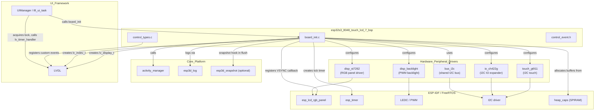
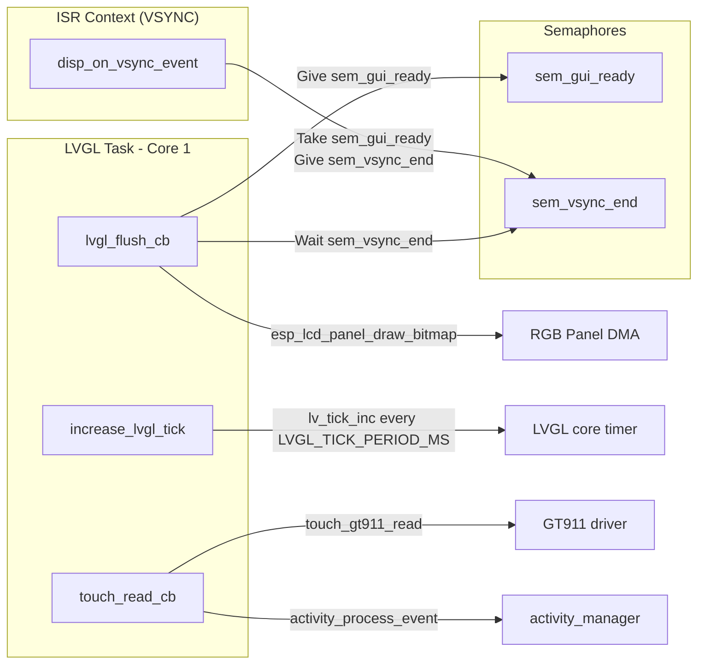
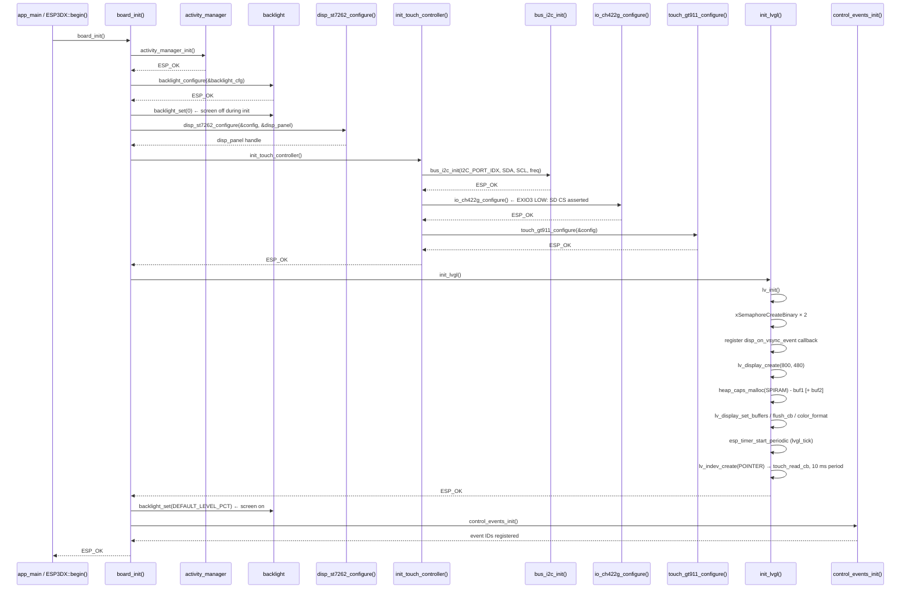
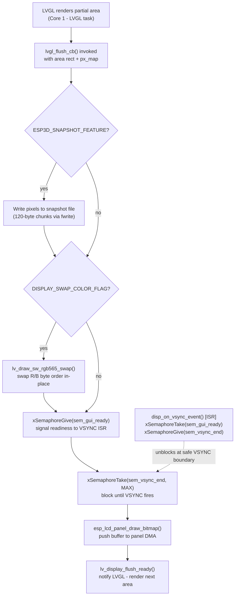
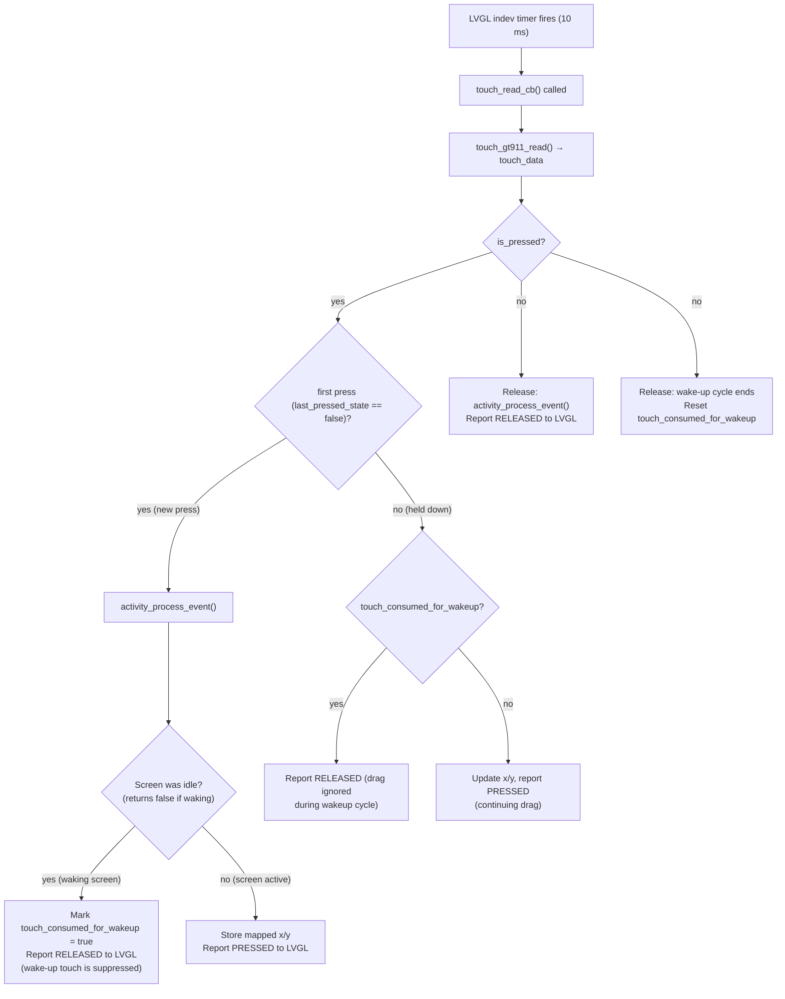
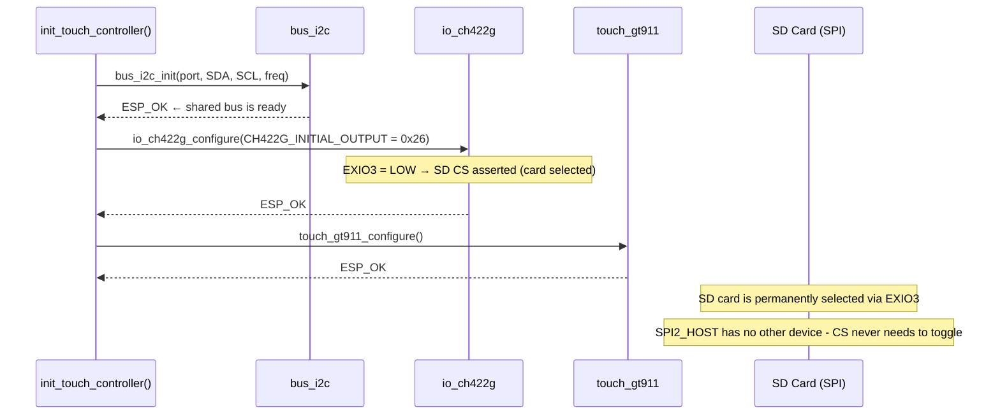
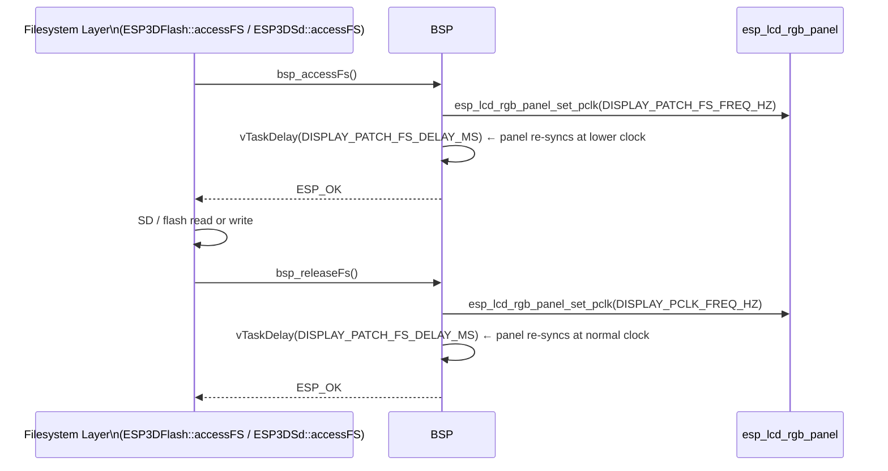

# ESP32S3 8048 Touch LCD 7 — Board Support Package (BSP)

The `esp32s3_8048_touch_lcd_7_bsp` module is the hardware abstraction layer for the **ESP32-S3 8048 Touch LCD 7"** board — a 7-inch 800 × 480 capacitive-touch display board driven by an ST7262-compatible controller over a 16-bit RGB parallel interface. It initialises every hardware peripheral required by the pendant firmware, wires LVGL to the RGB panel and the GT911 touch controller, manages the CH422G I²C IO expander that provides the SD card chip-select line, implements a pixel-clock throttling patch for safe filesystem access, and registers board-specific custom LVGL control events consumed by the UI layer.

This board is distinguished from its 4.3-inch and 5-inch siblings by its **7-inch display panel**, its **CH422G IO expander for SD CS routing** (no direct GPIO available), and the I²C shared bus that carries both touch and expander traffic. The parent board module is documented in [esp32s3_8048_touch_lcd_7](esp32s3_8048_touch_lcd_7.md).

---

## Table of Contents

1. [Module Overview](#1-module-overview)
2. [Hardware Specifications](#2-hardware-specifications)
3. [Architecture](#3-architecture)
4. [Component Breakdown](#4-component-breakdown)
   - [board_init.c](#41-board_initc)
   - [control_event.h](#42-control_eventh)
   - [control_types.c](#43-control_typesc)
   - [Configuration Headers](#44-configuration-headers)
5. [Initialization Flow](#5-initialization-flow)
6. [Display Subsystem](#6-display-subsystem)
   - [RGB Parallel Pipeline](#61-rgb-parallel-pipeline)
   - [VSYNC Synchronization](#62-vsync-synchronization)
   - [LVGL Draw Buffers](#63-lvgl-draw-buffers)
   - [Snapshot Support](#64-snapshot-support)
7. [Touch Subsystem](#7-touch-subsystem)
   - [GT911 Configuration](#71-gt911-configuration)
   - [Touch Callback and Activity Manager](#72-touch-callback-and-activity-manager)
8. [SD Card and IO Expander Integration](#8-sd-card-and-io-expander-integration)
9. [Filesystem Access Pixel-Clock Patch](#9-filesystem-access-pixel-clock-patch)
10. [Custom Control Events](#10-custom-control-events)
11. [Public API](#11-public-api)
12. [Compile-Time Feature Flags](#12-compile-time-feature-flags)
13. [Sibling Modules and References](#13-sibling-modules-and-references)

---

## 1. Module Overview

| Item | Value |
|------|-------|
| **Board name** | `ESP32S3-8048-TOUCH-LCD-7` |
| **MCU** | ESP32-S3 |
| **Display** | ST7262, 16-bit RGB565 parallel, 800 × 480 px, 7 inch |
| **Touch** | Goodix GT911, capacitive, I²C |
| **IO Expander** | CH422G (I²C, shared bus with touch) — SD card CS |
| **Storage** | SD card via SPI2_HOST, CS asserted through CH422G EXIO3 |
| **Physical controls** | None (encoder, buttons, switch, potentiometer are NC) |
| **Source directory** | `boards/esp32s3_8048_touch_lcd_7/components/bsp/` |
| **Key source files** | `board_init.c`, `control_types.c` |
| **Key header files** | `board_init.h`, `board_config.h`, `control_event.h`, `control_types.h`, `tasks_def.h`, `disp_st7262_def.h`, `touch_gt911_def.h`, `disp_backlight_def.h` |

The BSP is the **only** place in the firmware where hardware I/O details live for this board. The rest of the firmware (UI, GCode host, communication transports) is hardware-agnostic and addresses the board exclusively through the public API exposed by `board_init.h` and the LVGL handles returned by this module.

---

## 2. Hardware Specifications

### Display

| Parameter | Value |
|-----------|-------|
| Controller | ST7262 (RGB parallel) |
| Interface | 16-bit RGB565 parallel (no SPI) |
| Physical size | 7 inch |
| Resolution | 800 × 480 px |
| Pixel clock (normal) | `DISPLAY_PCLK_FREQ_HZ` (defined in `board_config.h`) |
| Pixel clock (FS access) | `DISPLAY_PATCH_FS_FREQ_HZ` (reduced for SD/flash safety) |
| Color format | RGB565 |
| Byte swap | Controlled by `DISPLAY_SWAP_COLOR_FLAG` |
| Frame buffer location | PSRAM (`fb_in_psram = true`) |
| LVGL draw buffer | Single or double, allocated in SPIRAM (`MALLOC_CAP_SPIRAM`) |
| LVGL render mode | `LV_DISPLAY_RENDER_MODE_PARTIAL` |

### Backlight

| Parameter | Value |
|-----------|-------|
| Control | PWM (LEDC) |
| Default level | `BACKLIGHT_DEFAULT_LEVEL_PCT` (defined in `board_config.h`) |

### Touch Controller

| Parameter | Value |
|-----------|-------|
| Controller | GT911 (capacitive) |
| Interface | I²C |
| Shared bus | Yes — same I²C bus as CH422G expander |
| Read interval | 10 ms (LVGL indev timer period) |
| Coordinate mapping | `raw_x × DISPLAY_WIDTH_PX / gt911_get_x_max()` |

### IO Expander (CH422G)

| Parameter | Value |
|-----------|-------|
| Interface | I²C (shared with GT911) |
| Purpose | Routes SD card CS (EXIO3) — no direct GPIO available |
| Initial output | `0x2E & ~(1<<3)` = `0x26` — EXIO3 LOW, CS asserted |
| CS toggle needed | No — SPI2_HOST serves only the SD card |

### SD Card

| Parameter | Value |
|-----------|-------|
| SPI host | SPI2_HOST |
| CS signal | CH422G EXIO3 (active-low, asserted once at init) |
| CLK / MOSI / MISO | Direct GPIO (defined in `board_config.h`) |

### Physical Controls

All physical control GPIOs are set to `GPIO_NUM_NC`. There are no physical buttons, encoder, switch, buzzer, or potentiometer on this board. The control events framework is retained so that upper UI layers (shared across all boards) compile and operate without modification.

---

## 3. Architecture

### High-Level Module Relationships



### Internal BSP Data Flow



---

## 4. Component Breakdown

### 4.1 `board_init.c`

The central initialisation source file. Contains all internal state variables and all callback functions needed to drive LVGL on this board.

#### Module-Level State

| Variable | Type | Purpose |
|----------|------|---------|
| `lvgl_api_lock` | `_lock_t` | Mutex protecting LVGL API calls from concurrent access |
| `lvgl_display` | `lv_display_t *` | LVGL display handle |
| `lvgl_buf1` | `lv_color16_t *` | Primary LVGL draw buffer (SPIRAM) |
| `lvgl_buf2` | `lv_color16_t *` | Secondary draw buffer (SPIRAM, double-buffer mode only) |
| `lvgl_tick_timer` | `esp_timer_handle_t` | Periodic timer driving `lv_tick_inc()` |
| `touch_indev` | `lv_indev_t *` | LVGL input device handle for the GT911 |
| `disp_panel` | `esp_lcd_panel_handle_t` | ESP-LCD RGB panel handle |
| `sem_vsync_end` | `SemaphoreHandle_t` | Binary semaphore: VSYNC ISR releases the flush pipeline |
| `sem_gui_ready` | `SemaphoreHandle_t` | Binary semaphore: flush signals readiness to the VSYNC ISR |

#### Functions

| Function | Scope | Description |
|----------|-------|-------------|
| `board_init()` | Public | Top-level entry: initialises activity manager, backlight, ST7262, I²C bus, CH422G, GT911, LVGL, and control events |
| `init_lvgl()` | Static | Creates LVGL display, allocates SPIRAM draw buffers, registers flush callback, starts tick timer, creates touch `indev` |
| `init_touch_controller()` | Static | Initialises shared I²C bus, optionally configures CH422G (SD CS), then configures GT911 |
| `lvgl_flush_cb()` | Static | LVGL flush callback: optional snapshot write → color swap → VSYNC sync → `draw_bitmap` → `flush_ready` |
| `disp_on_vsync_event()` | Static (ISR) | RGB panel VSYNC ISR — synchronises with `lvgl_flush_cb` via the semaphore pair |
| `touch_read_cb()` | Static | LVGL `indev` read callback — reads GT911, maps coordinates, handles wake-up touch suppression |
| `increase_lvgl_tick()` | Static | `esp_timer` callback — calls `lv_tick_inc(LVGL_TICK_PERIOD_MS)` |
| `bsp_accessFs()` | Public (conditional) | Reduces pixel clock to `DISPLAY_PATCH_FS_FREQ_HZ` before flash/SD I/O |
| `bsp_releaseFs()` | Public (conditional) | Restores pixel clock to `DISPLAY_PCLK_FREQ_HZ` after flash/SD I/O |
| `get_lvgl_display()` | Public | Returns `lvgl_display` handle for use by `ESP3DXUi` |
| `get_lvgl_lock()` | Public | Returns `&lvgl_api_lock` for thread-safe LVGL access |
| `get_touch_indev()` | Public | Returns `touch_indev` handle |
| `board_get_name()` | Public | Returns board name string (`BOARD_NAME_STR`) |
| `board_get_version()` | Public | Returns board version string (`BOARD_VERSION_STR`) |

### 4.2 `control_event.h`

Defines the `control_event_t` structure — the common payload dispatched through the LVGL event system for all hardware input events.

```c
typedef struct {
    lv_indev_t        *indev;           // LVGL input device that generated the event
    uint32_t           btn_id;          // Button / control index
    lv_indev_type_t    type;            // LVGL indev type (pointer, button, encoder…)
    control_family_t   family_id;       // Which hardware family generated the event
    int32_t            steps;           // Encoder step count (signed)
    uint32_t           press_duration;  // How long the control was held (ms)
} control_event_t;
```

Because all physical control GPIOs are `GPIO_NUM_NC` on this board, `control_event_t` events for `CONTROL_FAMILY_BUTTONS`, `CONTROL_FAMILY_SWITCH`, `CONTROL_FAMILY_ENCODER`, and `CONTROL_FAMILY_POTENTIOMETER` are only generated by emulated virtual controls in the upper UI layer.

### 4.3 `control_types.c`

Declares and registers three custom LVGL event codes beyond the built-in set. These are assigned real IDs by `lv_event_register_id()` inside `control_events_init()`, which `board_init()` calls at the end of its sequence — after `lv_init()` has run.

| Event | Purpose |
|-------|---------|
| `LV_EVENT_SWITCH_PRESSED` | Physical 4-position switch moved to a new position |
| `LV_EVENT_SWITCH_RELEASED` | Physical 4-position switch released |
| `LV_EVENT_POTENTIOMETER_CHANGED` | Analog potentiometer value changed |

All three are initialised to the sentinel `LV_EVENT_ALL` and receive valid IDs only after `control_events_init()` runs. Code that sends or receives these events must not be called before `board_init()` completes.

### 4.4 Configuration Headers

All hardware constants are separated into dedicated `*_def.h` headers so that `board_init.c` remains free of magic numbers.

| Header | Contents |
|--------|---------|
| `board_config.h` | All GPIO assignments, pixel clock frequencies, display resolution, I²C pins and frequency, SD pins — the single authoritative pin-map for this board |
| `tasks_def.h` | FreeRTOS task stack sizes, core affinities, priorities, `LVGL_TICK_PERIOD_MS` |
| `disp_st7262_def.h` | Complete `disp_st7262_config_t` wired from `board_config.h`, including RGB timing parameters |
| `touch_gt911_def.h` | Complete `touch_gt911_config_t` wired from `board_config.h`, including axis swap/mirror flags |
| `disp_backlight_def.h` | `backlight_config_t` wired from `board_config.h`, PWM timer/channel/frequency/resolution |

---

## 5. Initialization Flow



---

## 6. Display Subsystem

### 6.1 RGB Parallel Pipeline

The ST7262 panel is driven over the ESP32-S3 RGB parallel interface. Unlike SPI panels where pixel transmission is fully software-controlled, the RGB DMA engine scans out pixel data continuously from a framebuffer. The BSP pipeline from LVGL to the panel is:



### 6.2 VSYNC Synchronization

RGB panels on the ESP32-S3 stream pixel data from a single shared frame buffer. If LVGL writes new pixels while a scanline is being output, tearing is visible. The BSP avoids this with a binary semaphore pair:

| Semaphore | Direction | Role |
|-----------|-----------|------|
| `sem_gui_ready` | flush → ISR | Signals that the LVGL buffer contains new data ready for DMA transfer |
| `sem_vsync_end` | ISR → flush | Signals that the VSYNC blanking window has opened — safe to transfer |

`lvgl_flush_cb` gives `sem_gui_ready`, then blocks on `sem_vsync_end`. The VSYNC ISR (`disp_on_vsync_event`) takes `sem_gui_ready` and gives `sem_vsync_end`, releasing the flush exactly at the blanking window. This ensures every DMA transfer starts on a scanline boundary.

> **ISR constraint:** `disp_on_vsync_event` runs in interrupt context. It uses `xSemaphoreTakeFromISR` / `xSemaphoreGiveFromISR` and returns the `high_task_awoken` flag so FreeRTOS can reschedule if a higher-priority task was unblocked.

### 6.3 LVGL Draw Buffers

Both draw buffers are allocated from SPIRAM (`MALLOC_CAP_SPIRAM`) to preserve the scarce internal DRAM for FreeRTOS stacks and the LVGL object heap.

| Build flag | Buffer count | Behaviour |
|------------|-------------|-----------|
| `DISPLAY_USE_DOUBLE_BUFFER_FLAG = 0` | 1 × `DISP_BUF_SIZE_BYTES` | Single buffer — simpler, lower PSRAM usage |
| `DISPLAY_USE_DOUBLE_BUFFER_FLAG = 1` | 2 × `DISP_BUF_SIZE_BYTES` | Double buffer — LVGL can render next area while DMA is active |

Both buffers use `LV_DISPLAY_RENDER_MODE_PARTIAL`. LVGL divides the display into horizontal strips and calls `lvgl_flush_cb` once per strip.

### 6.4 Snapshot Support

When `ESP3D_SNAPSHOT_FEATURE` is enabled, `lvgl_flush_cb` writes pixel data to an open file (`g_snapshot.file`) for each rendered strip, building up a full-screen raw RGB565 capture. The capture uses 120-byte chunks to stay within the ESP32-S3's DMA and stack constraints. The snapshot is marked complete when `captured_pixels >= expected_pixels`.

---

## 7. Touch Subsystem

### 7.1 GT911 Configuration

The GT911 is initialized via `touch_gt911_configure()` using the board-specific configuration in `touch_gt911_def.h`. The GT911's native coordinate range may differ from the 800 × 480 panel; `touch_read_cb` normalises at read time:

```c
x_px = raw_x × DISPLAY_WIDTH_PX  / touch_gt911_get_x_max();
y_px = raw_y × DISPLAY_HEIGHT_PX / touch_gt911_get_y_max();
```

The LVGL indev read timer period is set to **10 ms** for responsive touch tracking.

### 7.2 Touch Callback and Activity Manager



**Wake-up isolation:** The first touch after an idle period wakes the screen but is not passed to LVGL widgets. The `touch_consumed_for_wakeup` flag prevents the gesture that woke the screen from accidentally triggering a button or menu item. Subsequent touch events within the same press-release cycle are also suppressed until the finger is lifted.

---

## 8. SD Card and IO Expander Integration

The SD card's chip-select (`SD_CS`) has no direct ESP32-S3 GPIO on this board; it is wired to **EXIO3** on the CH422G I²C IO expander. The expander is initialized inside `init_touch_controller()` when `ESP3D_SD_CARD_FEATURE` is enabled, sharing the I²C bus that was just opened for the GT911.



### CH422G Output Map

```
CH422G_INITIAL_OUTPUT = 0x2E & ~(1<<3)  →  0x26

Bit 1 (EXIO1) = 1  → Touch/LCD reset — HIGH  (no active reset pulse)
Bit 2 (EXIO2) = 1  → Touch/LCD reset — HIGH  (no active reset pulse)
Bit 3 (EXIO3) = 0  → SD CS           — LOW   (card permanently selected)
Bit 5 (EXIO5) = 1  → Reserved        — HIGH
```

> **Important:** This constant must match between `board_init.c` and the factory app's `main.c`. Any divergence will leave the SD card deselected and SD mounts will fail.

---

## 9. Filesystem Access Pixel-Clock Patch

On boards with RGB parallel displays, simultaneous SD/flash SPI DMA and the RGB pixel-clock signal can cause electrical interference that corrupts the RGB framebuffer or produces SPI errors. The BSP implements a pixel-clock throttle gated by `ESP3D_PATCH_FS_ACCESS_RELEASE`.



Both functions guard against a `NULL` panel handle — they return `ESP_OK` immediately if the display was not initialized, so the filesystem layer can call them unconditionally.

> See [`docs/architecture/display_drivers.md`](https://github.com/luc-github/Pibot-cnc-pendant-firmware/blob/main/docs/architecture/display_drivers.md) for the underlying RGB driver architecture and a full explanation of the FS clock-patch rationale.

---

## 10. Custom Control Events

`control_types.c` registers three board-level custom LVGL event codes. These allow the upper application to dispatch hardware input events through the standard LVGL `lv_event_send()` / `lv_obj_add_event_cb()` API, even for input types that have no built-in LVGL equivalent.

| Global variable | Purpose |
|----------------|---------|
| `LV_EVENT_SWITCH_PRESSED` | Dispatched when a 4-position switch moves to a new position |
| `LV_EVENT_SWITCH_RELEASED` | Dispatched when the switch is released |
| `LV_EVENT_POTENTIOMETER_CHANGED` | Dispatched when an analog potentiometer value changes |

All three are initialised to `LV_EVENT_ALL` (invalid sentinel) at file scope and receive valid IDs from `lv_event_register_id()` when `control_events_init()` is called. This function is called at the tail of `board_init()`, after `lv_init()` has run inside `init_lvgl()`.

Because this board has no physical switch, encoder, or potentiometer, these events are defined for API compatibility with the shared upper-layer code and will not be generated by any hardware interrupt.

---

## 11. Public API

All symbols below are declared in `board_init.h`.

### `board_init()`

```c
esp_err_t board_init(void);
```

Top-level board initialisation. Orchestrates the full hardware bringup in dependency order. Must be called once before any LVGL or hardware API is used.

Returns `ESP_OK` on success, or the first failing sub-system's error code.

---

### `bsp_accessFs()`

```c
esp_err_t bsp_accessFs(void);
```

Throttles the RGB pixel clock to `DISPLAY_PATCH_FS_FREQ_HZ` and waits `DISPLAY_PATCH_FS_DELAY_MS` before a filesystem operation. Called by `ESP3DFlash::accessFS()` and `ESP3DSd::accessFS()`.

Only compiled when `ESP3D_PATCH_FS_ACCESS_RELEASE` is enabled. Returns `ESP_OK` immediately if `disp_panel` is `NULL`.

---

### `bsp_releaseFs()`

```c
esp_err_t bsp_releaseFs(void);
```

Restores the RGB pixel clock to `DISPLAY_PCLK_FREQ_HZ` after a filesystem operation completes. Must be paired with every `bsp_accessFs()` call.

Only compiled when `ESP3D_PATCH_FS_ACCESS_RELEASE` is enabled.

---

### `get_lvgl_display()`

```c
lv_display_t *get_lvgl_display(void);
```

Returns the LVGL display handle created during `board_init()`. Used by `tft_ui_task` in the [UI Framework](UI_Framework_and_Screens.md). Returns `NULL` when `ESP3D_DISPLAY_FEATURE` is disabled.

---

### `get_lvgl_lock()`

```c
_lock_t *get_lvgl_lock(void);
```

Returns a pointer to the LVGL API mutex. The UI task acquires this lock around all `lv_*` API calls to protect against concurrent access from other tasks. Returns `NULL` when `ESP3D_DISPLAY_FEATURE` is disabled.

---

### `get_touch_indev()`

```c
lv_indev_t *get_touch_indev(void);
```

Returns the LVGL touch input device handle. Only compiled when `ESP3D_TOUCH_FEATURE` is enabled.

---

### `board_get_name()` / `board_get_version()`

```c
const char *board_get_name(void);
const char *board_get_version(void);
```

Return the board identification strings defined in `board_config.h`. Used in log output and system-info screens.

---

### `control_events_init()`

```c
void control_events_init(void);
```

Registers the three custom LVGL event IDs. Called automatically by `board_init()` — do not call directly.

---

## 12. Compile-Time Feature Flags

| Flag | Effect when enabled |
|------|---------------------|
| `ESP3D_DISPLAY_FEATURE` | Enables the full display + LVGL pipeline |
| `ESP3D_TOUCH_FEATURE` | Enables GT911 init, `lv_indev` registration, and `touch_read_cb` |
| `ESP3D_BRIGHTNESS_CONTROL_FEATURE` | Enables PWM backlight control via `disp_backlight` |
| `ESP3D_SD_CARD_FEATURE` | Enables CH422G init and SD CS assertion (EXIO3 LOW) |
| `ESP3D_PATCH_FS_ACCESS_RELEASE` | Enables pixel-clock throttle during filesystem I/O |
| `ESP3D_SNAPSHOT_FEATURE` | Enables in-flush pixel capture to SD file |
| `DISPLAY_USE_DOUBLE_BUFFER_FLAG` | Allocates a second SPIRAM draw buffer for LVGL |
| `DISPLAY_SWAP_COLOR_FLAG` | Adds an RGB565 byte-swap pass in `lvgl_flush_cb` |

---

## 13. Sibling Modules and References

### Other BSP Sub-modules of This Board

| Sub-module | Documentation | Purpose |
|------------|--------------|---------|
| Factory App | [esp32s3_8048_touch_lcd_7_factory](esp32s3_8048_touch_lcd_7_factory.md) | Recovery partition: OTA flashing, UI resources update, touch-navigable menu |
| Build Scripts | [esp32s3_8048_touch_lcd_7_build_scripts](esp32s3_8048_touch_lcd_7_build_scripts.md) | Variant matrix, build automation, resource generation |

### Related BSP Modules (Same RGB Pipeline)

| Board | Display | Panel | CH422G | FS patch | Doc |
|-------|---------|-------|--------|----------|-----|
| **esp32s3_8048_touch_lcd_7** | 7" 800×480 | ST7262 | **Yes** | Yes | *(this doc)* |
| esp32s3_8048s043c | 4.3" 800×480 | ST7262 | Yes | Yes | [esp32s3_8048s043c](esp32s3_8048s043c.md) |
| esp32s3_8048s050c | 5" 800×480 | ST7262 | Yes | Yes | [esp32s3_8048s050c](esp32s3_8048s050c.md) |
| esp32s3_8048s070c | 7" 800×480 | ST7262 | Yes | Yes | [esp32s3_8048s070c](esp32s3_8048s070c.md) |
| esp32s3_4827s043c | 4.3" 480×272 | ILI9485 | No | Yes | [esp32s3_4827s043c_bsp](esp32s3_4827s043c_bsp.md) |

> **Key distinction from `esp32s3_8048s043c/050c/070c`:** Those boards route SD CS through a direct GPIO. This board routes it through CH422G EXIO3, requiring the I²C expander to be initialised before any SD access and keeping the CS asserted for the lifetime of the application.

### Upstream Consumers

| Consumer | Uses from this BSP |
|----------|-------------------|
| [UI Framework](UI_Framework_and_Screens.md) — `esp3d_x_ui.cpp` | `get_lvgl_display()`, `get_lvgl_lock()`, `get_touch_indev()` |
| [Storage Layer](Storage_and_Configuration.md) — `ESP3DFlash`, `ESP3DSd` | `bsp_accessFs()`, `bsp_releaseFs()` |
| [Core Platform](Core_Platform_and_Infrastructure.md) — `main.cpp` | `board_init()`, `board_get_name()`, `board_get_version()` |

### Cross-References

- **Hardware drivers** consumed by this BSP: [Hardware_Peripheral_Drivers](Hardware_Peripheral_Drivers.md)
- **Display driver architecture** (RGB parallel, orientation, FS patch rationale): [`docs/architecture/display_drivers.md`](https://github.com/luc-github/Pibot-cnc-pendant-firmware/blob/main/docs/architecture/display_drivers.md)
- **LVGL constraints and UI task model**: [`docs/architecture/screens_architecture.md`](https://github.com/luc-github/Pibot-cnc-pendant-firmware/blob/main/docs/architecture/screens_architecture.md)
- **Memory constraints** (SPIRAM usage, DRAM budget): [`docs/guides/esp32_memory_constraints.md`](https://github.com/luc-github/Pibot-cnc-pendant-firmware/blob/main/docs/guides/esp32_memory_constraints.md)
