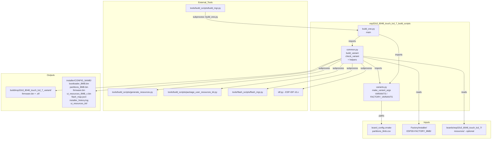
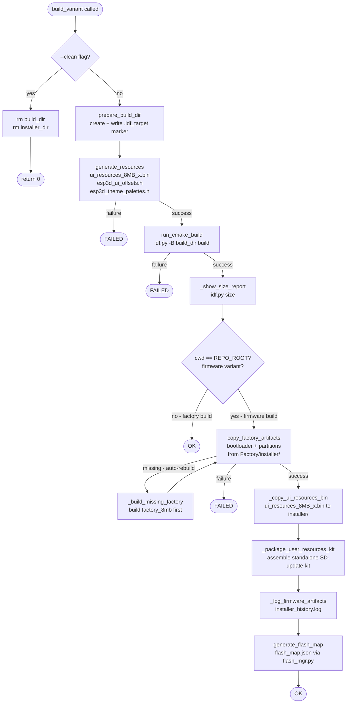
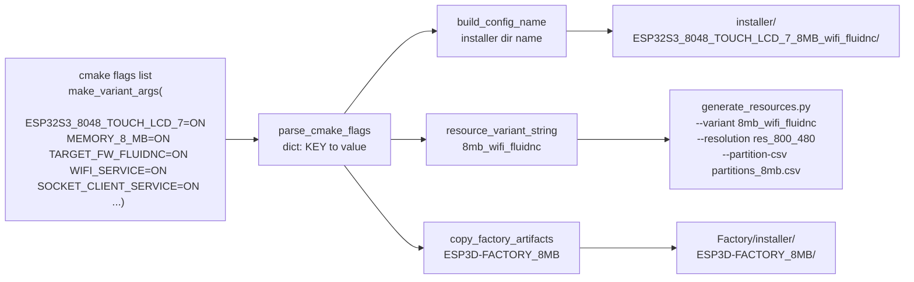
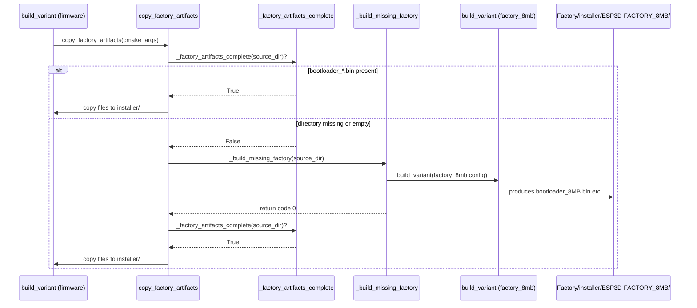

# esp32s3_8048_touch_lcd_7_build_scripts

Build automation scripts for the **ESP32-S3 8048 Touch LCD 7** board. This module is the sole entry point for producing flashable firmware artifacts for this board: it configures CMake feature flags, generates the UI resources partition, invokes ESP-IDF, copies factory bootloader artifacts, and assembles the final installer directory — all from a single Python command.

---

## Module Overview

```
boards/esp32s3_8048_touch_lcd_7/build_scripts/
├── variants.py     # Variant definitions: cmake flags, build/output paths
├── common.py       # Build orchestration, helper functions
└── build_one.py    # CLI entry point — build or check a single variant by name
```

This module is one of many identical-pattern board build-script modules in the repository. Its sibling modules (`esp32s3_8048s043c_build_scripts`, `esp32s3_8048s050c_build_scripts`, etc.) follow the exact same three-file layout. The top-level [`tools_build_scripts`](Build_and_Development_Tools.md) module (`tools/build_scripts/build_mgr.py`) orchestrates all boards together when building the whole firmware matrix.

---

## Architecture

### Component Diagram



### Build Pipeline (`build_variant`)



---

## Files

### `variants.py` — Variant Definitions

Declares every buildable configuration for this board. Two dictionaries are exported:

- **`VARIANTS`** — regular firmware variants (flashed to the main application partition)
- **`FACTORY_VARIANTS`** — factory test firmware variants (separate ESP-IDF project under `Factory/`)

#### `make_variant_args(*on_flags)`

The core helper that constructs a CMake argument list. It starts by turning **every** known CMake option `OFF` (using `ROOT_CMAKE_OPTIONS`), then enables only the flags passed as arguments. This "deny-all, allow-list" pattern guarantees that stale CMake cache values from a previous build cannot bleed into the new configuration.

```python
# Internally builds DEFAULT_OFF_CMAKE_ARGS = ["-D", "OPT1=OFF", "-D", "OPT2=OFF", ...]
# Then for each on_flag: extends with ["-D", "FLAG=ON"]
def make_variant_args(*on_flags):
    args = DEFAULT_OFF_CMAKE_ARGS.copy()
    for flag in on_flags:
        args.extend(["-D", flag])
    return args
```

#### Path Constants

| Constant | Resolved Value |
|---|---|
| `SCRIPT_DIR` | `boards/esp32s3_8048_touch_lcd_7/build_scripts/` |
| `BOARD_ROOT` | `boards/esp32s3_8048_touch_lcd_7/` |
| `REPO_ROOT` | Repository root |
| `FACTORY_DIR` | `boards/esp32s3_8048_touch_lcd_7/Factory/` |
| `BUILD_BASE` | `<REPO_ROOT>/build/` |
| `FACTORY_BUILD_BASE` | `<FACTORY_DIR>/build/` |

#### Defined Variants

##### Firmware Variants (`VARIANTS`)

| Key | Flash | CNC Transport | Firmware Target | Extra Features |
|---|---|---|---|---|
| `8mb_wifi_fluidnc` | 8 MB | WiFi (socket client TCP) | FluidNC | MDNS, Lua interpreter |
| `8mb_serial_fluidnc` | 8 MB | UART serial | FluidNC | — |
| `8mb_serial_grbl` | 8 MB | UART serial | GRBL | — |
| `8mb_wifi_grblhal` | 8 MB | WiFi (socket client TCP) | grblHAL | MDNS |

All firmware variants include: `SERIAL_SERVICE`, `TFT_UI_SERVICE`, `TFT_TOUCH_SERVICE`, `UPDATE_SERVICE`.

> **WiFi + socket-client constraint:** When `SOCKET_CLIENT_SERVICE=ON`, `cmake/sanity_check.cmake` forbids `WEBUI_SERVER`, `SSDP_SERVICE`, `WS_SERVER_SERVICE`, and `WS_CLIENT_SERVICE` from being enabled simultaneously. See [`docs/features/feature_resource_matrix.md`](https://github.com/luc-github/Pibot-cnc-pendant-firmware/blob/main/docs/features/feature_resource_matrix.md) for the full compatibility matrix.

##### Factory Variants (`FACTORY_VARIANTS`)

| Key | Flash | Purpose |
|---|---|---|
| `factory_8mb` | 8 MB | Factory test + OTA-restore firmware |

The factory variant uses `FACTORY_DIR` as its working directory (a separate ESP-IDF project). Its outputs land in `Factory/installer/ESP3D-FACTORY_8MB/` and are automatically copied into every regular firmware installer directory during `build_variant`. See [`esp32s3_8048_touch_lcd_7_factory`](esp32s3_8048_touch_lcd_7_factory.md) for details on the factory application itself.

#### CMake Option Categories (`ROOT_CMAKE_OPTIONS`)

All options listed here are forced `OFF` unless explicitly enabled in a variant definition:

| Category | Options |
|---|---|
| Board selection | `ESP32S3_8048_TOUCH_LCD_7`, `ESP32_PIBOT_CNC_PENDANT_V1`, and all other 14 board targets |
| Flash memory | `MEMORY_4_MB`, `MEMORY_8_MB`, `MEMORY_16_MB` |
| PSRAM | `PSRAM_NONE`, `PSRAM_2_MB`, `PSRAM_4_MB`, `PSRAM_8_MB` |
| Firmware target | `TARGET_FW_FLUIDNC`, `TARGET_FW_GRBLHAL`, `TARGET_FW_GRBL`, `TARGET_FW_SMOOTHIEWARE`, `TARGET_FW_REPETIER`, `TARGET_FW_MARLIN`, `TARGET_FW_NONE` |
| Transports | `SERIAL_SERVICE`, `UART_EXT_SERVICE`, `USB_SERIAL_SERVICE`, `WIFI_SERVICE`, `BT_SERVICE`, `BT_SERIAL_SERVICE`, `BT_BLE_SERVICE` |
| UI / hardware | `TFT_UI_SERVICE`, `TFT_TOUCH_SERVICE`, `SD_CARD_SERVICE`, `BUZZER_SERVICE`, `CAMERA_SERVICE` |
| Network services | `MDNS_SERVICE`, `SSDP_SERVICE`, `WEBUI_SERVER`, `WEB_SERVICES`, `HTTPS_SERVICE`, `WEBDAV_SERVICES`, `WS_SERVER_SERVICE`, `WS_CLIENT_SERVICE`, `SOCKET_SERVER_SERVICE`, `SOCKET_CLIENT_SERVICE` |
| Misc | `ESP3D_AUTHENTICATION`, `DISABLE_SERIAL_AUTHENTICATION`, `LUA_INTERPRETER_SERVICE`, `TIME_SERVICE`, `NOTIFICATIONS_SERVICE`, `UPDATE_SERVICE`, `USE_FAT_INSTEAD_OF_LITTLEFS` |

---

### `common.py` — Build Orchestration

Contains all reusable build logic. The two primary public functions are `build_variant` and `check_variant`; everything else is an internal helper.

#### `build_variant(config)`

Full build pipeline for a single variant configuration dict.

**Config dict structure:**

| Key | Type | Description |
|---|---|---|
| `name` | `str` | Human-readable variant name used in log output |
| `cmake` | `list[str]` | CMake arguments produced by `make_variant_args()` |
| `cwd` | `str` | Working directory for `idf.py`: `REPO_ROOT` for firmware, `FACTORY_DIR` for factory |
| `build_dir` | `str` | Dedicated output directory for compiled artifacts |

**Steps executed in order:**

1. **`--clean` mode** — Wipes `build_dir`, any stale parent cmake artifacts (`CMakeCache.txt`), and `installer_dir`. Returns immediately with exit code 0.

2. **`prepare_build_dir`** — Creates `build_dir` and writes a `.idf_target` marker file (`esp32s3`). If the directory previously held a build for a different IDF target, the entire directory is cleared first to prevent cross-target contamination.

3. **`generate_resources`** — Invokes `tools/build_scripts/generate_resources.py` to produce the `ui_resources_*.bin` partition binary, `esp3d_ui_offsets.h`, `esp3d_theme_palettes.h`, and `esp3d_lang_packs.h`. The variant string (e.g. `8mb_wifi_fluidnc`) and partition CSV (`partitions_8mb.csv`) are derived automatically from the cmake flags. Board-specific UI overrides from `boards/esp32s3_8048_touch_lcd_7/resources/` are passed when that directory exists.

4. **`run_cmake_build`** — Runs `idf.py -B <build_dir> <cmake_args> [-D PROD_BUILD=ON] build` with `IDF_TARGET=esp32s3`. In production mode (no `--dev` flag) all development tools are disabled via `PROD_BUILD=ON`. Optionally sets `CMAKE_BUILD_PARALLEL_LEVEL` from a `--jobs=N` argument forwarded by `build_mgr.py`.

5. **`_show_size_report`** — Runs `idf.py size` for a human-readable memory breakdown after a successful compile.

6. **Factory artifacts** (firmware variants only, where `cwd == REPO_ROOT`):
   - `copy_factory_artifacts` copies `bootloader_8MB.bin`, partition table, and factory app binaries from `Factory/installer/ESP3D-FACTORY_8MB/` into the installer directory.
   - `_factory_artifacts_complete` verifies the source directory both exists **and** contains a `bootloader_*.bin` file — an empty directory (created at cmake configure time by `file(MAKE_DIRECTORY)`) is treated as incomplete.
   - If artifacts are absent, `_build_missing_factory` auto-builds the `factory_8mb` variant before retrying the copy.

7. **`_copy_ui_resources_bin`** — Copies the `ui_resources_*.bin` generated in step 3 from `build_dir` into the installer directory.

8. **`_package_user_resources_kit`** — Calls `tools/build_scripts/package_user_resources_kit.py` to assemble a standalone kit under `installer/<config>/ui_resources_kit/`. This self-contained kit allows end users to customise images, fonts, and theme colors via SD card without a full repository clone. See [`docs/ui_resources/development.md`](https://github.com/luc-github/Pibot-cnc-pendant-firmware/blob/main/docs/ui_resources/development.md).

9. **`_log_firmware_artifacts`** — Appends a timestamped record to `installer_history.log`, tagging each file as `FACTORY` (from the factory build) or `FIRMWARE` (from this build).

10. **`generate_flash_map`** — Calls `tools/flash_scripts/flash_mgr.py --generate` to produce `flash_map.json` from `flash_params.json`, providing the flash tool with a complete address map for the installer directory.

#### `check_variant(config)`

Validates a configuration without compiling. Runs `idf.py reconfigure` only (cmake configure phase + `cmake/sanity_check.cmake`). Used by `build_mgr.py --check_*` commands to rapidly validate the full variant matrix without waiting for a compile.

#### Key Internal Helpers

| Function | Purpose |
|---|---|
| `parse_cmake_flags(cmake_args)` | Parses `["-D", "KEY=VAL", ...]` into `{KEY: VAL}` dict for programmatic inspection |
| `build_config_name(cmake_args)` | Derives installer subdirectory name from flags, e.g. `ESP32S3_8048_TOUCH_LCD_7_8MB_wifi_fluidnc` |
| `resource_variant_string(cmake_args)` | Derives the `generate_resources.py --variant` string, e.g. `8mb_wifi_fluidnc`; returns `None` for unrecognised combinations |
| `installer_dir_for(config)` | Returns the `installer/<subdir>` absolute path (formula differs for factory vs. firmware variants) |
| `_factory_artifacts_complete(source_dir)` | Returns `True` only when `source_dir` exists and contains a `bootloader_*.bin` file |
| `_build_missing_factory(source_dir)` | Matches `source_dir` to a factory variant by installer path, calls `build_variant` on it |
| `prepare_build_dir(build_dir)` | Creates dir + writes `.idf_target` marker; clears directory if target mismatch |
| `run_cmake_build(cmake_args, cwd, build_dir)` | Runs `idf.py build` with `IDF_TARGET=esp32s3` and optional `CMAKE_BUILD_PARALLEL_LEVEL` |
| `run_cmake_check(cmake_args, cwd, build_dir)` | Runs `idf.py reconfigure` with `IDF_TARGET=esp32s3` |
| `generate_resources(cmake_args, build_dir)` | Constructs and runs the `generate_resources.py` subprocess |
| `_package_user_resources_kit(...)` | Constructs and runs the `package_user_resources_kit.py` subprocess |
| `generate_flash_map(config)` | Constructs and runs `flash_mgr.py --generate` subprocess |
| `clean_build_dir(build_dir)` | `shutil.rmtree` with a log message |
| `_show_size_report(build_dir, cwd)` | Runs `idf.py size` |
| `_log_firmware_artifacts(...)` | Appends `FACTORY`/`FIRMWARE`-tagged file list to `installer_history.log` |
| `_copy_ui_resources_bin(...)` | Copies `ui_resources_*.bin` from build to installer directory |
| `_get_jobs_env_value()` | Parses `--jobs=N` from `sys.argv` for `CMAKE_BUILD_PARALLEL_LEVEL` |

**Board-specific constants:**

```python
RESOLUTION = "res_800_480"       # Must match RESOLUTION_SCREEN in board_config.cmake
EXPECTED_IDF_TARGET = "esp32s3"  # Used for .idf_target marker and IDF_TARGET env var
```

---

### `build_one.py` — CLI Entry Point

A minimal CLI wrapper for direct developer use, importing from `variants.py` and `common.py`.

#### `main()`

```
Usage: python build_one.py <variant_name> [--clean] [--check] [--dev] [--jobs=N]

Arguments:
  variant_name    Key from VARIANTS or FACTORY_VARIANTS in variants.py
  --clean         Wipe build + installer directories, do not rebuild
  --check         Run cmake reconfigure only, no compilation
  --dev           Keep dev tools enabled (no PROD_BUILD=ON)
  --jobs=N        Parallel compile jobs forwarded to cmake/ninja

No positional argument: prints all available variant names and exits.
```

`build_one.py` merges both `FACTORY_VARIANTS` and `VARIANTS` into one namespace so any variant key can be addressed by name regardless of type.

---

## Data Flow

### Variant Configuration Resolution



### Installer Directory Contents

After a successful firmware build the installer directory contains:

```
installer/ESP32S3_8048_TOUCH_LCD_7_8MB_wifi_fluidnc/
├── bootloader_8MB.bin                   ← FACTORY: custom bootloader binary
├── partitions_8MB.bin                   ← FACTORY: partition table
├── factory_8MB.bin                      ← FACTORY: factory test/restore firmware
├── firmware.bin                         ← FIRMWARE: main application image
├── ui_resources_8MB_wifi_fluidnc.bin    ← FIRMWARE: UI partition (images + fonts + palettes + lang)
├── flash_map.json                       ← FIRMWARE: flash address map for flash_mgr.py
├── installer_history.log                ← audit log with FACTORY/FIRMWARE tags per file
└── ui_resources_kit/                    ← FIRMWARE: standalone SD-card customization kit
    ├── ui_resources_manifest_8MB_wifi_fluidnc.json
    ├── build_ui_resources_from_manifest.py
    ├── defaults/                        ← default PNG, font .c, theme .ini source files
    └── README.md
```

### Factory Artifact Dependency



---

## Usage

### Build a Single Variant (Direct)

```bash
cd boards/esp32s3_8048_touch_lcd_7/build_scripts

# Build the WiFi + FluidNC variant
python build_one.py 8mb_wifi_fluidnc

# Build with parallel compilation jobs
python build_one.py 8mb_serial_grbl --jobs=8

# Build in dev mode (logging and snapshot enabled)
python build_one.py 8mb_wifi_grblhal --dev

# Validate cmake configuration only — fast, no compilation
python build_one.py 8mb_wifi_fluidnc --check

# Wipe build and installer directories
python build_one.py 8mb_wifi_fluidnc --clean

# Build the factory variant
python build_one.py factory_8mb

# List all available variant names
python build_one.py
```

### Build via `build_mgr.py` (Recommended for CI / Full Matrix)

```bash
cd <repo_root>

# Build all variants for this board
python tools/build_scripts/build_mgr.py --build_board esp32s3_8048_touch_lcd_7

# Build a single variant by board/name
python tools/build_scripts/build_mgr.py --build_variant esp32s3_8048_touch_lcd_7/8mb_wifi_fluidnc

# Check all board variants without compiling
python tools/build_scripts/build_mgr.py --check_board esp32s3_8048_touch_lcd_7

# Clean all build + installer directories for this board
python tools/build_scripts/build_mgr.py --clean_board esp32s3_8048_touch_lcd_7

# List all available boards and variants
python tools/build_scripts/build_mgr.py --list
```

### Prerequisites

| Requirement | Details |
|---|---|
| Python 3.9+ | Required for all scripts |
| ESP-IDF v5.4.3 | Must be installed; `IDF_PATH` env var must point to it |
| `idf.py` accessible | `ensure_idf_py()` exits early with a clear error if `idf.py` is not found at `$IDF_PATH/tools/idf.py` |

---

## Adding or Modifying Variants

To add a new firmware variant:

1. **Open `variants.py`** and add a new entry to the `VARIANTS` dict:

```python
"8mb_serial_grblhal": {
    "name": "8mb_serial_grblhal",
    "cmake": make_variant_args(
        "ESP32S3_8048_TOUCH_LCD_7=ON",
        "MEMORY_8_MB=ON",
        "TARGET_FW_GRBLHAL=ON",
        "SERIAL_SERVICE=ON",
        "TFT_UI_SERVICE=ON",
        "TFT_TOUCH_SERVICE=ON",
        "UPDATE_SERVICE=ON",
    ),
    "cwd": REPO_ROOT,
    "build_dir": os.path.join(BUILD_BASE, "esp32s3_8048_touch_lcd_7_8mb_serial_grblhal"),
},
```

2. **Check sanity rules** — verify the flag combination does not violate `cmake/sanity_check.cmake` (e.g. `SOCKET_CLIENT_SERVICE` and `WEBUI_SERVER` cannot coexist).

3. **Validate before building** to catch cmake errors fast:

```bash
python build_one.py 8mb_serial_grblhal --check
```

> **Note:** `build_config_name()` and `resource_variant_string()` derive names automatically from cmake flags. No changes to `common.py` are needed unless a brand-new memory size or transport category is introduced that the existing parsing logic does not handle.

---

## Relationship to Other Modules

| Module | Relationship |
|---|---|
| [`esp32s3_8048_touch_lcd_7_bsp`](esp32s3_8048_touch_lcd_7_bsp.md) | BSP component compiled by these scripts; provides `board_init`, `init_lvgl`, `lvgl_flush_cb`, `disp_on_vsync_event`, and `bsp_accessFs`/`bsp_releaseFs` |
| [`esp32s3_8048_touch_lcd_7_factory`](esp32s3_8048_touch_lcd_7_factory.md) | Factory firmware built by the `factory_8mb` variant; its bootloader and partition artifacts are automatically copied into every regular firmware installer directory |
| [`Build, Resource & Development Toolchain`](Build_and_Development_Tools.md) | `build_mgr.py` orchestrates this board alongside all others; `generate_resources.py` and `package_user_resources_kit.py` are called as subprocesses during `build_variant` |
| [`esp32s3_8048s043c`](esp32s3_8048s043c.md) | Sibling board with identical three-file script structure; same RGB parallel display architecture and `bsp_accessFs`/`bsp_releaseFs` pattern |
| [`esp32s3_8048s050c`](esp32s3_8048s050c.md) | Sibling board; same build pattern, 5-inch display |
| [`esp32s3_8048s070c`](esp32s3_8048s070c.md) | Sibling board; same build pattern, 7-inch display |
