# esp32s3_8048_touch_lcd_7_factory

The `esp32s3_8048_touch_lcd_7_factory` module is the **factory/recovery partition application** for the ESP32-S3 8048 Touch LCD 7" board — a 7-inch 800×480 RGB parallel display board with a Goodix GT911 capacitive touchscreen. It runs as an independent, standalone ESP-IDF C application with no LVGL dependency, occupying the `factory` OTA slot in flash and providing a touch-navigable recovery menu.

The recovery app is entered exclusively via a **software trigger** from the main firmware (`[ESP444]FACTORY` command). This board has no physical button, so there is no custom bootloader hook. The main firmware backs up `otadata` before switching partitions, and the factory app restores it on startup.

Its four core responsibilities are:

1. **Restore OTA boot state** — recover the `otadata` backup written by the main firmware before it switched to the factory partition.
2. **Boot partition selection** — let the operator switch the active OTA slot (`app0` / `app1`) and reboot.
3. **Firmware flash** — stream `esp3dfw.bin` from SD card to `app0` or `app1` using the ESP-IDF OTA API.
4. **UI resources flash** — erase and write `ui_resources.bin` from SD card to the `ui_resources` data partition.

---

## Table of Contents

1. [Module Position in the System](#1-module-position-in-the-system)
2. [Hardware Context](#2-hardware-context)
3. [Module Architecture](#3-module-architecture)
4. [Factory Application (`Factory/main/`)](#4-factory-application-factorymain)
   - 4.1 [Initialization Sequence](#41-initialization-sequence)
   - 4.2 [OTA Backup Restore](#42-ota-backup-restore)
   - 4.3 [Menu System](#43-menu-system)
   - 4.4 [Touch Navigation](#44-touch-navigation)
   - 4.5 [Firmware Flash Action](#45-firmware-flash-action)
   - 4.6 [Resources Flash Action](#46-resources-flash-action)
   - 4.7 [Snapshot Subsystem (optional)](#47-snapshot-subsystem-optional)
5. [Graphics Layer (`gfx.c`)](#5-graphics-layer-gfxc)
6. [Peripheral Drivers](#6-peripheral-drivers)
   - 6.1 [Touch — GT911 (I2C)](#61-touch--gt911-i2c)
   - 6.2 [SD Card (SPI)](#62-sd-card-spi)
   - 6.3 [Buttons](#63-buttons)
   - 6.4 [Buzzer](#64-buzzer)
   - 6.5 [Rotary Encoder](#65-rotary-encoder)
   - 6.6 [Logging Gate (`factory_log.h`)](#66-logging-gate-factory_logh)
7. [CH422G IO Expander Integration](#7-ch422g-io-expander-integration)
8. [Build System (`build_scripts/`)](#8-build-system-build_scripts)
9. [Flash Map and OTA Layout](#9-flash-map-and-ota-layout)
10. [Data Flow Diagrams](#10-data-flow-diagrams)
11. [Related Modules](#11-related-modules)

---

## 1. Module Position in the System

This module is a **child** of the `esp32s3_8048_touch_lcd_7` board target and one of three sub-modules that constitute the full board package:

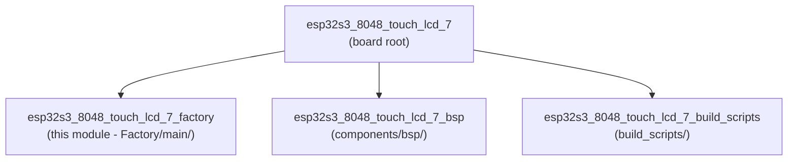

The factory app is **separate from the main firmware**. It resides in the ESP32-S3's `factory` OTA partition and is entered only via the software `[ESP444]FACTORY` trigger issued by the main firmware (see `esp444.cpp`). There is no custom bootloader hook on this board — the board has no physical button to hold during power-on, so `ENABLE_CUSTOM_BOOT_LOADER` is `OFF` in `CMakeLists.txt`.

Contrast with boards that **do** have a custom bootloader hook (e.g. `pibot_pendant_v1_0`, `ESP32_S3_WROOM_CAM`), where the user can hold a physical button at power-on to enter recovery — see [pibot_pendant_v1_0_bootloader.md](pibot_pendant_v1_0_bootloader.md).

---

## 2. Hardware Context

| Feature | Value |
|---------|-------|
| SoC | ESP32-S3 (dual-core Xtensa LX7, 240 MHz) |
| Display panel | ST7262-compatible, 800×480, 16-bit RGB565 parallel, 7 inch |
| Logical canvas | **800×480 landscape** (native, no rotation in factory app) |
| Touch IC | Goodix GT911 (capacitive, I2C at 0x5D or 0x14) |
| IO Expander | CH422G (I2C, same bus as GT911) — SD card CS and backlight |
| Physical buttons | **None** — `BUTTON_1/2/3_PIN` all `GPIO_NUM_NC` |
| Rotary encoder | **None** — `ENCODER_A/B_PIN` all `GPIO_NUM_NC` |
| Buzzer | **None** — `BUZZER_PIN` is `GPIO_NUM_NC` |
| SD card CS | **Not a raw GPIO** — asserted via CH422G EXIO3 |
| PSRAM | Yes (used only by main firmware LVGL buffers, not factory app) |

The factory app uses the panel in **native 800×480 landscape orientation** — no `swap_xy` / `mirror` flags are set, no physical/logical resolution split is needed. This differs from some sibling boards (e.g. `esp32s3_bzm_tft35_gt911`) that are mounted rotated in the pendant enclosure.

> **Note on GT911 coordinate reporting:** The GT911 on this board self-reports `x_max` / `y_max` values that do **not** match the physical 800×480 panel resolution. Raw coordinates must be rescaled using `touch_gt911_get_x_max()` / `touch_gt911_get_y_max()` — a step that the shared `touch_gt911` driver's internal flags do not handle automatically. See §6.1 for details.

---

## 3. Module Architecture

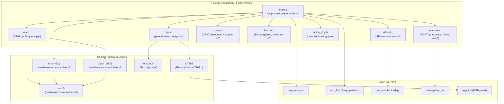

---

## 4. Factory Application (`Factory/main/`)

### 4.1 Initialization Sequence

`app_main()` executes the following startup sequence before entering the main event loop:

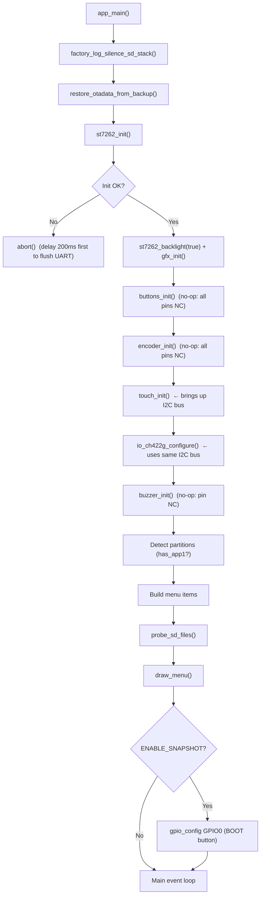

**Critical ordering constraint:** `touch_init()` initialises the shared I2C bus (`bus_i2c_init()`) as a side effect. `io_ch422g_configure()` **must follow** `touch_init()` — it uses the same I2C bus and will fail if called before the bus is up. Similarly, `probe_sd_files()` must follow `io_ch422g_configure()`, which permanently asserts the SD card CS low via CH422G EXIO3.

### 4.2 OTA Backup Restore

The main firmware (see `esp444.cpp`) writes a backup of the two OTA data entries to a reserved 4 KB sector **before** switching the boot partition to `factory`. This backup lives at `OTADATA_BACKUP_OFFSET = 0xB000`, safely between the bootloader end and the partition table at `0xC000`. A 32-bit magic word (`0xAA55AA55`) at `+0x40` within the backup sector marks a valid backup.

`restore_otadata_from_backup()` runs at the very start of `app_main()`, before any display or peripheral initialization. The algorithm is:

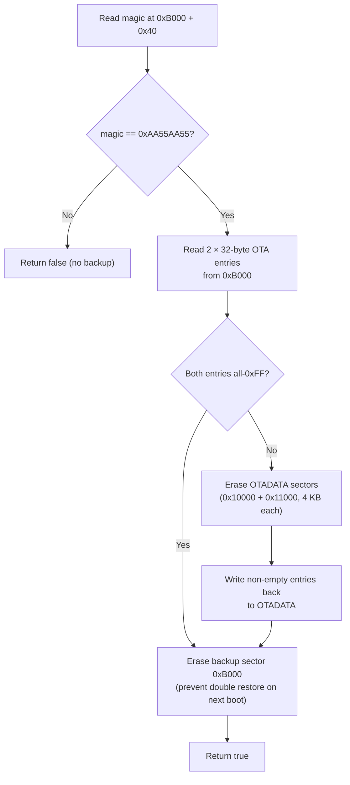

> **`CONFIG_SPI_FLASH_DANGEROUS_WRITE_ALLOWED` required:** `esp_flash_erase_region(NULL, 0xB000, …)` targets an address below the first ESP-IDF partition. ESP-IDF's default configuration (`CONFIG_SPI_FLASH_DANGEROUS_WRITE_ABORTS`) rejects this. The factory `sdkconfig` must set `CONFIG_SPI_FLASH_DANGEROUS_WRITE_ALLOWED=y`. This is intentional — the factory app is a privileged recovery tool with direct flash access.

See [factory_update_actions_otadata.md](factory_update_actions_otadata.md) for the cross-board design of this mechanism.

### 4.3 Menu System

The menu is a statically-allocated array of `menu_item_t` structs built at startup:

```c
typedef struct {
    const char *label;
    menu_action_t action;
    uint16_t color;    /* text color when not selected */
} menu_item_t;
```

Available actions (`menu_action_t`):

| Action | Label | Description |
|--------|-------|-------------|
| `MENU_ACTION_BOOT_APP0` | "Boot app0" | Set boot partition to `app0` and reboot |
| `MENU_ACTION_BOOT_APP1` | "Boot app1" | Set boot partition to `app1` and reboot (only if `app1` exists) |
| `MENU_ACTION_SD_UPDATE_APP0` | "SD -> app0" | Flash `esp3dfw.bin` from SD card to `app0` |
| `MENU_ACTION_SD_UPDATE_APP1` | "SD -> app1" | Flash `esp3dfw.bin` from SD card to `app1` (only if `app1` exists) |
| `MENU_ACTION_SD_UPDATE_RES` | "SD -> resources" | Flash `ui_resources.bin` from SD card to `ui_resources` partition |

The SD card is probed at startup (`probe_sd_files()`) and re-probed after any failed flash operation. SD indicator labels **FW** (green) and **RES** (cyan) appear in the header area when the matching `.bin` file is detected on the card.

Menu navigation functions:

- `menu_select(index)` — moves selection highlight, redraws old and new items, clears any active status message.
- `menu_move(direction)` — wraps around (`+1` / `-1`), calls `menu_select`.
- `execute_selected_action()` — dispatches the currently highlighted action.
- `show_status(msg, color)` — displays a transient status message in the footer zone.
- `clear_status()` — erases the status and restores "Power off to cancel".

Screen layout on the 800×480 landscape canvas:

```
┌──────────────────────────────────────────────────────────────────────┐  y=0
│             "Recovery vX.Y"          (title, centered)               │  y=13
│  ─────────────────────────────────────────────────────────────────── │  y=40
│  Active: app0                                          SD: FW RES    │  y=45/68
│  ─────────────────────────────────────────────────────────────────── │  y=88
│  [ Boot app0                                                        ] │  y=94
│  [ Boot app1                                                        ] │  y=128
│  [ SD -> app0                                                       ] │  y=162
│  [ SD -> app1                                                       ] │  y=196
│  [ SD -> resources                                                  ] │  y=230
│                  ...                                                  │
│  ─────────────────────────────────────────────────────────────────── │  STATUS_Y-7
│                    Power off to cancel                                │  STATUS_Y
│  ══════════════════════════════════════════════════════════════════ │  BTN_HINT_BASE_Y
│            ↑                  ↓                  ✓                   │  BTN_HINT_CY
└──────────────────────────────────────────────────────────────────────┘  y=479
```

Layout constants (800×480 landscape canvas, font12x24):

| Constant | Value | Role |
|----------|-------|------|
| `MENU_START_Y` | 94 | Y of first menu item |
| `MENU_ITEM_H` | 34 | Height per item row |
| `MENU_PAD_X` | 20 | Horizontal padding from border |
| `FONT_WIDTH` | 12 | Glyph column width (font12x24) |
| `FONT_HEIGHT` | 24 | Glyph row height (font12x24) |
| `BTN_CIRCLE_R` | 30 | Virtual button icon radius |
| `BTN_HINT_H` | 69 | Height of virtual button bar (2×30+9) |
| `BTN_HINT_CX1` | `SCREEN_WIDTH/2 − 100` = 300 | ↑ button center X |
| `BTN_HINT_CX2` | `SCREEN_WIDTH/2` = 400 | ↓ button center X |
| `BTN_HINT_CX3` | `SCREEN_WIDTH/2 + 100` = 500 | ✓ button center X |

### 4.4 Touch Navigation

All physical input pins are `GPIO_NUM_NC` — navigation is exclusively touch-driven. Three **virtual button regions** are drawn as circle-outline icons at the bottom of the screen. The effective touch targets are defined by midpoints between icon centers:

```
boundary_1_2 = (BTN_HINT_CX1 + BTN_HINT_CX2) / 2 = (300 + 400) / 2 = 350
boundary_2_3 = (BTN_HINT_CX2 + BTN_HINT_CX3) / 2 = (400 + 500) / 2 = 450

x < 350         → BTN_1 (↑ Up)
350 ≤ x < 450   → BTN_2 (↓ Down)
x ≥ 450         → BTN_3 (✓ OK)
y < BTN_HINT_BASE_Y → BTN_NONE (above button bar)
```

Using midpoint boundaries rather than equal thirds of the 800 px screen width is essential: the icons are clustered within a 200 px band at screen center. Equal-thirds columns (0–267, 267–534, 534–800) would map both BTN_1 (x=300) and BTN_3 (x=500) to the same middle column.

Touch input in the main loop uses edge detection (`touch_was_pressed` flag) to fire only on the leading edge of a press:

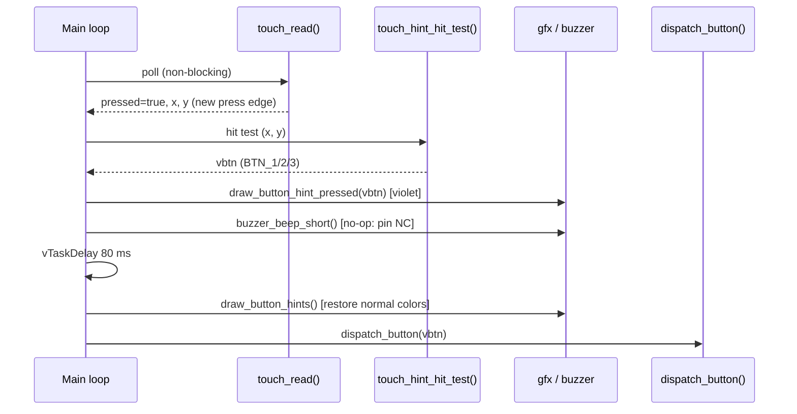

`dispatch_button()` is the single unified handler for both physical and virtual inputs:

| Button | Action |
|--------|--------|
| `BTN_1` | `menu_move(-1)` — scroll up |
| `BTN_2` | `menu_move(+1)` — scroll down |
| `BTN_3` | `execute_selected_action()` — confirm |

The encoder is also polled each loop iteration: CW rotation → `menu_move(-1)`, CCW → `menu_move(+1)`. On this board the encoder is NC so `encoder_read()` always returns 0.

### 4.5 Firmware Flash Action

`action_sd_update(target_label)` flashes `esp3dfw.bin` from the SD card to the named OTA partition using the standard ESP-IDF OTA API:

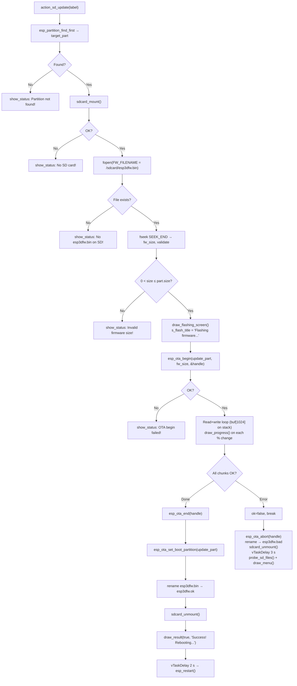

### 4.6 Resources Flash Action

`action_sd_update_res()` writes `ui_resources.bin` from the SD card to the `ui_resources` data partition. It uses `esp_partition_erase_range` + `esp_partition_write` (direct partition API) — not the OTA API — since `ui_resources` is a raw data partition, not an OTA app slot.

A 16-byte build header (`"ESP3"` + 12-char variant string), generated by `generate_resources.py`, is read and logged before flashing. This allows early detection of variant mismatches (wrong firmware type or transport). Flashing continues regardless — the operator is expected to verify the binary beforehand.

Post-flash, the file is renamed to `ui_resources.ok` (success) or `ui_resources.bad` (failure), matching the firmware flash convention.

### 4.7 Snapshot Subsystem (optional)

When `ENABLE_SNAPSHOT` is defined at compile time, pressing `GPIO0` (the ESP32-S3 BOOT button, always physically present on the development module) triggers a full screen capture to the SD card.

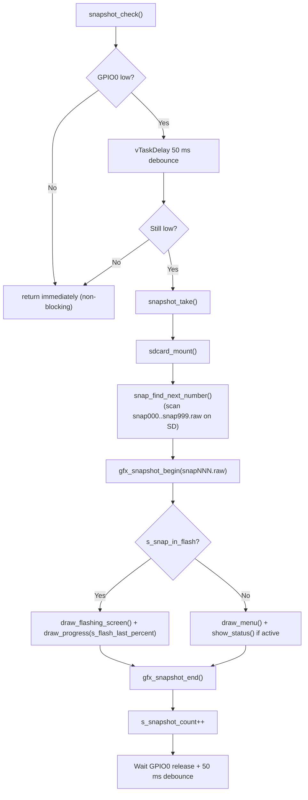

`snapshot_check()` is called:
- Once per main loop iteration (menu state)
- Once at the start of each flash action (before progress loop)
- Once per changed progress percent inside the flash loop (`s_snap_in_flash = true`)
- Once after `draw_result()` (final state)

The raw file format is identical across all boards that support this feature:

```
Offset    Size    Content
0x0000    4       SCREEN_WIDTH  (uint32_t, little-endian)
0x0004    4       SCREEN_HEIGHT (uint32_t, little-endian)
0x0008    W×H×2  RGB565 pixels, row-major, native endian
```

For this board: `8 + 800 × 480 × 2 = 768 008` bytes per snapshot.

> Convert `.raw` files to PNG using `tools/images_converter/raw2png.py`. The companion `snap2png.py` tool used by sibling boards (`esp32s3_8048s070c`, `pibot_pendant_v1_0`) is not currently shipped in this board's `Factory/tools/` directory, but accepts the same file format.

---

## 5. Graphics Layer (`gfx.c`)

The GFX layer is a lightweight, stateless drawing API that operates on a single `uint16_t line_buf[SCREEN_WIDTH]` static buffer (1600 bytes at 800 px width). All drawing is done line-by-line to minimise stack and heap usage on the memory-constrained ESP32-S3. There is no in-memory framebuffer.

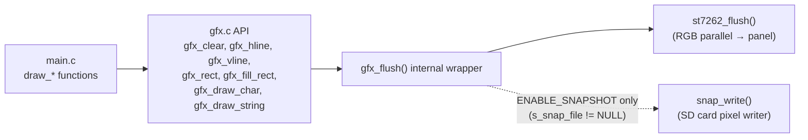

All pixel data is byte-swapped before transmission (the RGB parallel interface expects big-endian RGB565). `snap_write()` un-swaps bytes back to native RGB565 when writing to the SD card snapshot file, seeking to the correct file offset per row.

**GFX API summary:**

| Function | Description |
|----------|-------------|
| `gfx_init()` | No-op (reserved hook — snapshot is on-demand) |
| `gfx_clear(color)` | Fill entire screen with one color, line by line |
| `gfx_hline(x, y, w, color)` | Horizontal line, clipped to screen bounds |
| `gfx_vline(x, y, h, color)` | Vertical line (single-pixel flush per row) |
| `gfx_rect(x, y, w, h, color)` | Outline rectangle (four calls to h/vline) |
| `gfx_fill_rect(x, y, w, h, color)` | Filled rectangle, one line per row |
| `gfx_draw_char(x, y, c, fg, bg)` | 12×24 bitmap glyph from `font12x24` |
| `gfx_draw_string(x, y, str, fg, bg)` | String via repeated `gfx_draw_char`; stops at screen edge |
| `gfx_snapshot_begin(filepath)` | Open `.raw` file, write 8-byte header, pre-fill with black |
| `gfx_snapshot_end()` | Flush and close snapshot file |
| `gfx_snapshot_is_capturing()` | Returns `true` while a capture is in progress |

The helper icons drawn by the menu system (circle outlines, up/down arrows, check mark) are all composed of `gfx_hline` calls, scaled for the 30 px circle radius on the 800×480 canvas.

---

## 6. Peripheral Drivers

### 6.1 Touch — GT911 (I2C)

`touch.c` is a thin wrapper over the shared `hardware/common/drivers/touch_gt911` component — the same driver used by the main firmware's BSP. No re-implementation occurs here; the shared driver handles I2C communication and applies `swap_xy` / `invert_x` / `invert_y` flags from `hw_config.h` internally.

```c
typedef struct {
    bool    pressed;
    int16_t x;      /* display pixel column, 0..SCREEN_WIDTH-1 */
    int16_t y;      /* display pixel row, 0..SCREEN_HEIGHT-1   */
} touch_point_t;
```

**Coordinate rescaling is explicit and mandatory on this board.** The GT911 self-reports `x_max` / `y_max` values that do not match the physical 800×480 panel resolution (~468×253 measured on real hardware). `touch_read()` applies:

```c
pt.x = (int)data.x * SCREEN_WIDTH  / touch_gt911_get_x_max();
pt.y = (int)data.y * SCREEN_HEIGHT / touch_gt911_get_y_max();
```

This maps raw GT911 coordinates to the full 800×480 logical canvas. The BSP (`board_init.c`) applies the same rescaling in its `touch_read_cb`. On sibling boards that use the same GT911 driver with correct hardware configuration (e.g. `esp32s3_4827s043c`), this step is not needed.

`touch_init()` brings up the I2C bus as a side effect (`bus_i2c_init()` with `TOUCH_I2C_PORT_IDX`, `TOUCH_I2C_SDA_PIN=8`, `TOUCH_I2C_SCL_PIN=9`, `TOUCH_I2C_FREQ_HZ=400000`). The CH422G IO expander uses this same I2C bus, which is why `io_ch422g_configure()` must be called **after** `touch_init()`.

### 6.2 SD Card (SPI)

`sdcard.c` mounts the SD card via `esp_vfs_fat_sdspi_mount()` at `/sdcard` using `SPI2_HOST`.

**SD_CS is not a raw GPIO on this board.** `hw_config.h` defines `SD_CS = GPIO_NUM_NC` — the SPI host does not drive a CS pin. Instead, the CH422G IO expander permanently asserts the SD card CS low via EXIO3 (initialised once by `io_ch422g_configure()` in `app_main`). Since there is no other device on this SPI bus, per-transaction CS toggling is unnecessary.

The SPI bus is **never freed** after `sdcard_unmount()` to avoid interfering with the display's parallel RGB bus on the same ESP32-S3 subsystem. The `spi_bus_inited` flag guards first-time initialization.

Expected files at the SD card root:

| Filename | Role | Post-flash rename |
|----------|------|-------------------|
| `esp3dfw.bin` | Main firmware binary | → `esp3dfw.ok` (success) / `esp3dfw.bad` (failure) |
| `ui_resources.bin` | UI resources partition image | → `ui_resources.ok` / `ui_resources.bad` |

### 6.3 Buttons

`buttons.c` implements GPIO polling with 50 ms debounce. On this board all three button pins (`BUTTON_1_PIN`, `BUTTON_2_PIN`, `BUTTON_3_PIN`) are `GPIO_NUM_NC`. `buttons_init()` computes a zero `pin_mask` via the internal `pin_bit()` helper (which returns 0 for invalid pins via `GPIO_IS_VALID_GPIO()`) and skips `gpio_config()` entirely. `button_wait_press(timeout_ms)` always returns `BTN_NONE` at timeout.

### 6.4 Buzzer

`buzzer.c` uses bit-bang square wave generation at 2700 Hz for a 40 ms duration to produce a short click via `buzzer_beep_short()`. On this board `BUZZER_PIN == GPIO_NUM_NC`; both `buzzer_init()` and `buzzer_beep_short()` return immediately after the `GPIO_IS_VALID_GPIO()` guard. Call sites in `main.c` (touch-press feedback) are **not** conditionalised — they remain correct regardless of board capability.

### 6.5 Rotary Encoder

`encoder.c` uses the ESP32-S3 PCNT peripheral for quadrature decoding (4 pulses/detent, 1000 ns glitch filter). `encoder_init()` checks `GPIO_IS_VALID_GPIO()` for `ENCODER_A_PIN` and `ENCODER_B_PIN` — both `GPIO_NUM_NC` — and returns `ESP_OK` immediately without touching PCNT. `encoder_read()` returns `0` while `s_initialized == false`. The main loop polls every ~100 ms (governed by `button_wait_press(100)`) but receives no events on this board.

### 6.6 Logging Gate (`factory_log.h`)

The factory app uses a compile-time logging gate independent of the main sdkconfig log level:

```c
#if FACTORY_LOG_LEVEL
#define FACTORY_LOGD(tag, fmt, ...) ESP_LOGI(tag, fmt, ##__VA_ARGS__)
#else
#define FACTORY_LOGD(tag, fmt, ...) do {} while (0)
#endif
```

`FACTORY_LOG_LEVEL` is set by `ENABLE_FACTORY_DEBUG_LOG` in `Factory/CMakeLists.txt`. Warnings (`ESP_LOGW`) and errors (`ESP_LOGE`) are always active.

`factory_log_silence_sd_stack()` — the first call in `app_main()` — suppresses runtime logs from `sdmmc`, `vfs_fat_sdmmc`, `sdspi`, `fatfs`, and related ESP-IDF tags via `esp_log_level_set()`. Early-boot IDF messages (emitted before `app_main()`) are silenced separately by the production `sdkconfig` overlay applied by `cmake/targets.cmake` when `ENABLE_FACTORY_DEBUG_LOG` is OFF.

---

## 7. CH422G IO Expander Integration

The CH422G is an I2C IO expander that provides the SD card chip-select and the display backlight control on this board. The factory app initialises it once in `app_main()`, immediately after `touch_init()` has brought up the I2C bus:

```c
io_ch422g_config_t ch422g_cfg = {
    .i2c_port      = TOUCH_I2C_PORT_IDX,
    .i2c_clk_speed = TOUCH_I2C_FREQ_HZ,
    .initial_output = CH422G_INITIAL_OUTPUT,  /* = 0x2E & ~(1 << 3) */
};
io_ch422g_configure(&ch422g_cfg);
```

The `initial_output` value `0x2E & ~(1 << 3)` is the same value used by the main firmware's `board_init.c`. **These two values must remain identical** — using a different value in the factory app could leave the CH422G in a state the main firmware does not expect after a factory-app reboot, potentially breaking SD access.

`CH422G_INITIAL_OUTPUT` bit mapping (EXIO3 = SD_CS):

| Bit | EXIO | Role | Value |
|-----|------|------|-------|
| 3 | EXIO3 | SD card CS (active-low) | **0** (asserted = CS selected) |
| others | — | Vendor default / other peripherals | from `0x2E` |

The SD card CS is held permanently asserted throughout the factory app's lifetime — there is no per-transaction toggling because there is no other SPI device on the same bus.

See [io_expanders.md](io_expanders.md) for the CH422G driver API (`io_ch422g_configure`, `io_ch422g_write_output_pins`).

---

## 8. Build System (`build_scripts/`)

The build scripts orchestrate all ESP-IDF builds for this board's firmware variants. They are Python wrappers around `idf.py` that inject per-variant CMake arguments.

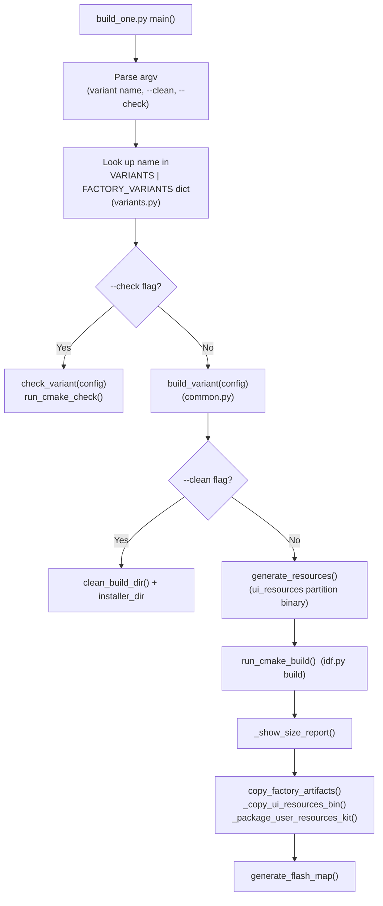

`make_variant_args()` in `variants.py` constructs the list of CMake `-D` flags from `DEFAULT_OFF_CMAKE_ARGS` (all features disabled by default) plus any variant-specific feature flags — such as `ENABLE_SNAPSHOT`, `ENABLE_FACTORY_DEBUG_LOG`, or transport selection flags.

Key CMake flags for the factory variant:

| Flag | Value | Effect |
|------|-------|--------|
| `ENABLE_CUSTOM_BOOT_LOADER` | OFF | No bootloader hook — board has no physical button |
| `ENABLE_FACTORY_DEBUG_LOG` | OFF (default) | Enables `FACTORY_LOGD` when ON |
| `ENABLE_SNAPSHOT` | OFF (default) | Enables GPIO0 snapshot trigger when ON |
| `CONFIG_SPI_FLASH_DANGEROUS_WRITE_ALLOWED` | y (sdkconfig) | Required for OTA backup restore |

---

## 9. Flash Map and OTA Layout

The factory app and the main firmware share a common flash map. Critical addresses:

| Region | Offset | Notes |
|--------|--------|-------|
| Bootloader | `0x0000` | Standard IDF bootloader — no custom hook |
| OTA data backup | `0xB000` | Written by main firmware before switching to factory |
| Partition table | `0xC000` | Standard IDF partition table |
| NVS | `0xD000` | First partition |
| OTA data (`otadata`) | `0x10000` | Two 4 KB sectors (entries at `+0x0000` and `+0x1000`) |
| `factory` partition | per table | This recovery app |
| `app0` partition | per table | Primary main firmware OTA slot |
| `app1` partition | per table | Secondary slot (if present) |
| `ui_resources` | per table | Raw data partition for UI images, fonts, and themes |

The OTA backup sector at `0xB000` satisfies all constraints:
- After bootloader end
- Before the partition table (`0xC000`)
- Does not overlap any partition (NVS starts at `0xD000`)
- 4 KB-aligned

> **Porting note:** If the bootloader size changes (e.g. when enabling a custom bootloader on a derived board), `OTADATA_BACKUP_OFFSET` must be recalculated and the new value applied **identically** in both `Factory/main/main.c` (factory app) and `esp444.cpp` (main firmware).

---

## 10. Data Flow Diagrams

### Overall Recovery Entry and Exit Flow

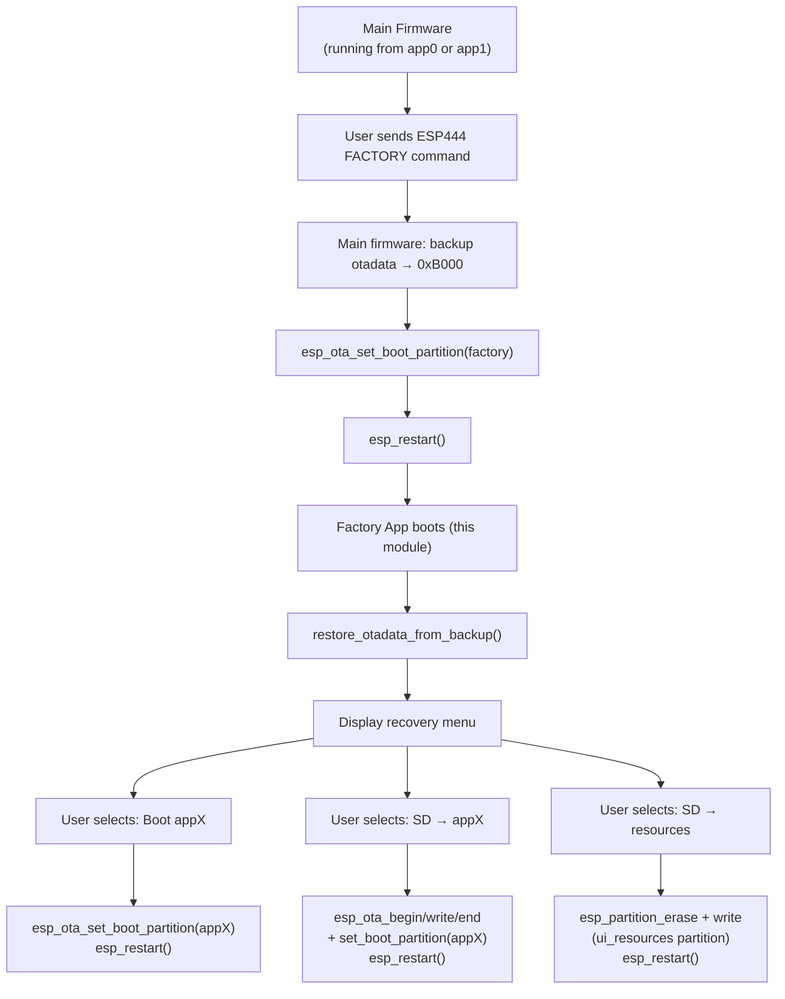

### SD Firmware Update Data Flow

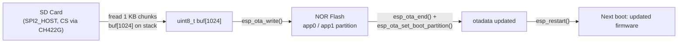

### I2C Bus Sharing

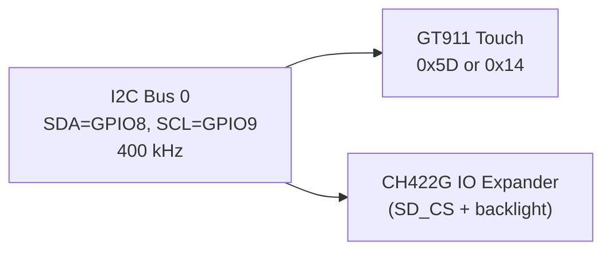

Both devices share I2C Bus 0. The factory app initialises the bus once (`touch_init()` → `bus_i2c_init()`) and then configures both devices in sequence. The bus is never torn down during factory app operation.

---

## 11. Related Modules

| Module | Relationship |
|--------|-------------|
| [esp32s3_8048_touch_lcd_7_bsp.md](esp32s3_8048_touch_lcd_7_bsp.md) | BSP used by the main firmware on this board — same ST7262, GT911, and CH422G hardware; see §8–9 for the main firmware's VSYNC-sync and FS pixel-clock patch that the factory app does not need |
| [esp32s3_8048_touch_lcd_7.md](esp32s3_8048_touch_lcd_7.md) | Parent board module overview |
| [esp32s3_8048s043c.md](esp32s3_8048s043c.md) | Closest sibling board — same 800×480 RGB panel, same CH422G SD_CS pattern; factory app structure is nearly identical |
| [esp32s3_4827s043c_factory.md](esp32s3_4827s043c_factory.md) | Sibling factory app — same menu/action structure; 480×272 RGB panel, no GT911 rescaling, no CH422G |
| [pibot_pendant_v1_0_factory_app.md](pibot_pendant_v1_0_factory_app.md) | Reference implementation this module was derived from; adds ILI9341 SPI display and custom bootloader hooks |
| [pibot_pendant_v1_0_bootloader.md](pibot_pendant_v1_0_bootloader.md) | Custom bootloader hook (button-hold factory entry) — not used on this board |
| [factory_app.md](factory_app.md) | Cross-board factory app overview and shared patterns |
| [factory_update_actions_otadata.md](factory_update_actions_otadata.md) | OTA backup/restore mechanism design |
| [factory_update_actions_sd_flash.md](factory_update_actions_sd_flash.md) | SD flash action design shared across boards |
| [factory_graphics.md](factory_graphics.md) | GFX library and snapshot capture design |
| [factory_touch.md](factory_touch.md) | Touch driver wrapper pattern and GT911 specifics |
| [factory_logging.md](factory_logging.md) | `factory_log.h` logging gate design |
| [io_expanders.md](io_expanders.md) | CH422G and TCA9554 IO expander driver reference |
| [touch_controllers.md](touch_controllers.md) | GT911 and other touch controller hardware drivers |
| [display_rgb_drivers.md](display_rgb_drivers.md) | Shared RGB parallel display driver architecture |
