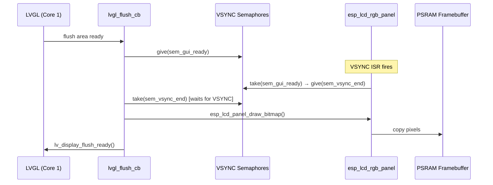
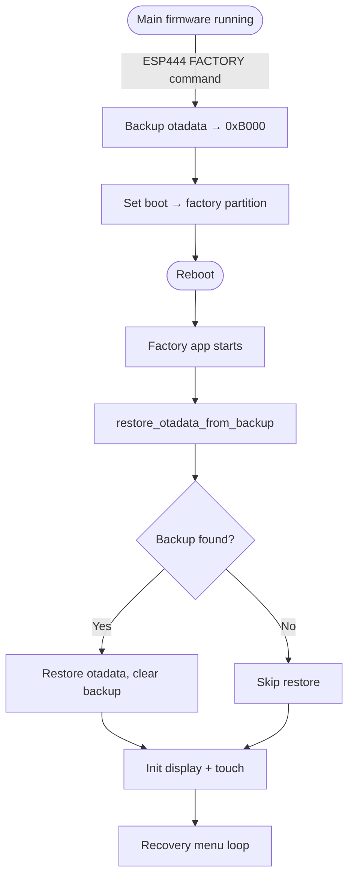

# esp32s3_8048s043c — Board Support Package

## Overview

`esp32s3_8048s043c` is the Board Support Package (BSP) for an ESP32-S3 module paired with an **800×480 RGB-parallel LCD panel** (ST7262 controller) and a **GT911 capacitive touchscreen**. It provides two independent firmware layers — a recovery/factory application and the main firmware BSP — plus Python build-automation scripts that assemble all firmware variants for this board.

This board is characterised by several properties that distinguish it from most other BSPs in the repository:

| Property | Value |
|---|---|
| MCU | ESP32-S3 |
| Flash | 16 MB |
| PSRAM | Octal PSRAM (required for RGB framebuffer) |
| Display controller | ST7262 — 16-bit RGB parallel bus |
| Display resolution | 800 × 480 (native landscape, no rotation) |
| Touch controller | GT911 (I2C, capacitive) |
| Physical inputs | None populated (`GPIO_NUM_NC` — touch-only) |
| Recovery trigger | Software only — `[ESP444]FACTORY` command from main firmware |
| Custom bootloader | Not used on this board |

Because the RGB parallel interface requires a persistent framebuffer held in PSRAM, and because the board ships without physical buttons, encoder, or buzzer, the factory application falls back exclusively to touch-driven navigation via virtual on-screen buttons.

---

## Architecture Overview

```mermaid
graph TD
    subgraph "esp32s3_8048s043c"
        direction TB

        subgraph Factory["Factory App  (recovery partition)"]
            MAIN["main.c<br/>Recovery menu / OTA flash"]
            ST7262F["st7262.c<br/>RGB panel wrapper"]
            GFX["gfx.c<br/>2-D graphics library"]
            TOUCH_F["touch.c<br/>GT911 wrapper (polled)"]
            BTN["buttons.c<br/>Button driver (NC stubs)"]
            BUZ["buzzer.c<br/>Buzzer driver (NC stub)"]
            ENC["encoder.c<br/>PCNT encoder (NC stubs)"]
            SD["sdcard.c<br/>SPI SD mount"]
            LOG["factory_log.h<br/>Conditional debug gate"]

            MAIN --> ST7262F
            MAIN --> GFX
            MAIN --> TOUCH_F
            MAIN --> BTN
            MAIN --> BUZ
            MAIN --> ENC
            MAIN --> SD
            MAIN --> LOG
        end

        subgraph BSP["BSP Component  (main firmware)"]
            BOARD["board_init.c<br/>Hardware + LVGL init"]
            CEVT["control_event.h<br/>Event structure"]
            CTYP["control_types.c<br/>Custom LVGL events"]

            BOARD --> CEVT
            BOARD --> CTYP
        end

        subgraph Scripts["Build Scripts"]
            BO["build_one.py<br/>Single-variant builder"]
            CO["common.py<br/>Shared build helpers"]
            VA["variants.py<br/>Variant definitions"]

            BO --> CO
            BO --> VA
            CO --> VA
        end
    end

    subgraph Shared["Shared Hardware Drivers"]
        DISP_ST7262["disp_st7262<br/>RGB panel driver"]
        TOUCH_GT911["touch_gt911<br/>GT911 driver"]
        BUS_I2C["bus_i2c<br/>I2C bus driver"]
        BACKLIGHT["disp_backlight<br/>PWM backlight"]
    end

    ST7262F --> DISP_ST7262
    TOUCH_F --> TOUCH_GT911
    TOUCH_F --> BUS_I2C
    BOARD --> DISP_ST7262
    BOARD --> TOUCH_GT911
    BOARD --> BUS_I2C
    BOARD --> BACKLIGHT
```



---

## Display Architecture

Unlike SPI-based boards (e.g. `esp32_3248s035r`, `pibot_pendant_v1_0`), the ST7262 is driven over a **16-bit RGB parallel bus**. ESP-IDF's `esp_lcd_rgb_panel` keeps a full-resolution framebuffer allocated in PSRAM and copies the LVGL draw buffer into it on each flush.



The two-semaphore handshake (`sem_gui_ready` / `sem_vsync_end`) prevents tearing: the LVGL flush is only committed to the framebuffer during the blanking interval after a VSYNC interrupt.

> **Why no rotation?** Unlike `esp32s3_4827s043c` (physical 480×272 glass mounted portrait), this board's glass is physically 800×480 landscape and mounted landscape — `DISP_ST7262_ORIENTATION_LANDSCAPE` is a pure passthrough with no `swap_xy` / mirror adjustments.

---

## Touch Coordinate Scaling

The GT911's own reported maximum resolution (read back from its configuration registers) does **not** match the physical panel resolution. Real hardware measures approximately 468×253 from the device, while the display pixel grid is 800×480. Both the Factory app and the BSP apply the same linear rescaling:

```c
x_px = touch_data.x * SCREEN_WIDTH  / touch_gt911_get_x_max();
y_px = touch_data.y * SCREEN_HEIGHT / touch_gt911_get_y_max();
```

---

## Recovery Trigger Model

This board has no physical button that can be held at power-on, so it does **not** use a custom bootloader. Recovery is entered exclusively via the software command `[ESP444]FACTORY` issued from the running main firmware (`esp444.cpp`). That command:

1. Backs up the `otadata` partition to a reserved flash sector (`0xB000`).
2. Sets the factory partition as the next boot target.
3. Reboots into the factory app.

On startup, the factory app restores `otadata` from the backup before doing anything else, so a power-off at any point during recovery returns the board to the correct OTA slot.



---

## Sub-modules

### [Factory Application](esp32s3_8048s043c_factory.md)

The factory/recovery application runs from the `factory` OTA partition. It provides:

- A touch-navigable menu rendered directly to the ST7262 via a lightweight 2-D graphics library (no LVGL dependency).
- OTA firmware flash from SD card (`esp3dfw.bin` → `app0` or `app1`).
- UI resources partition flash from SD card (`ui_resources.bin`).
- Boot-partition switching between `app0` and `app1`.
- Optional screen snapshot capture (raw RGB565 to SD, gated by `ENABLE_SNAPSHOT`).
- Graceful no-op stubs for buttons, encoder, and buzzer — the same code base compiles unchanged even if those peripherals are eventually populated.

→ See **[esp32s3_8048s043c_factory.md](esp32s3_8048s043c_factory.md)** for full component details.

---

### [Board Support Package (BSP)](esp32s3_8048s043c_bsp.md)

The BSP component integrates the board hardware with the main ESP3D firmware:

- `board_init()` — single entry point that initialises backlight, ST7262 RGB panel, GT911 touch, and LVGL.
- VSYNC-synchronised LVGL flush callback with double-buffer support.
- `bsp_accessFs()` / `bsp_releaseFs()` — temporarily reduce the pixel clock during SD/Flash access to avoid RGB signal corruption (required on boards without enough bus bandwidth).
- Custom LVGL event IDs for switch and potentiometer inputs.
- Activity-manager integration so the first touch after screen timeout wakes the display rather than being consumed by the UI.

→ See **[esp32s3_8048s043c_bsp.md](esp32s3_8048s043c_bsp.md)** for full component details.

---

### [Build Scripts](esp32s3_8048s043c_build_scripts.md)

Python build-automation scripts that wrap `idf.py` for this board:

- `variants.py` — all recognised firmware combinations (16 MB WiFi/Serial × FluidNC/grblHAL/grbl, plus the factory variant).
- `common.py` — shared helpers: cmake flag parsing, `generate_resources.py` invocation, factory-artifact copy, flash-map generation.
- `build_one.py` — CLI entry point for building or checking a single named variant.

→ See **[esp32s3_8048s043c_build_scripts.md](esp32s3_8048s043c_build_scripts.md)** for full details.

---

## Firmware Variants

| Variant name | Memory | Transport | CNC firmware |
|---|---|---|---|
| `16mb_wifi_fluidnc` | 16 MB | WiFi (socket client) | FluidNC |
| `16mb_serial_fluidnc` | 16 MB | Serial | FluidNC |
| `16mb_serial_grbl` | 16 MB | Serial | grbl |
| `16mb_wifi_grblhal` | 16 MB | WiFi (socket client) | grblHAL |
| `factory_16mb` | 16 MB | — | Factory recovery |

WiFi variants enable `SOCKET_CLIENT_SERVICE` (CNC-over-WiFi) along with `MDNS_SERVICE` and `LUA_INTERPRETER_SERVICE`. Serial variants connect to the CNC controller via UART. All variants require 16 MB flash.

---

## Key Constraints

- **PSRAM mandatory**: The RGB parallel panel requires the framebuffer to reside in PSRAM (`fb_in_psram = true`). Removing PSRAM support will cause display initialisation to fail.
- **Bluetooth is excluded**: WiFi and BT cannot run simultaneously on this board. See `cmake/sanity_check.cmake`.
- **`CONFIG_SPI_FLASH_DANGEROUS_WRITE_ALLOWED=y`**: Required in the factory sdkconfig so the factory app can write to the `otadata` backup sector at `0xB000` (below the first partition).
- **LVGL on Core 1 only**: All LVGL calls must be made from the LVGL task. Do not invoke `lv_obj_*` from high-frequency callbacks.
- **Pixel-clock throttle on FS access**: `bsp_accessFs()` / `bsp_releaseFs()` must bracket any SD or Flash access from the main firmware to prevent RGB signal corruption.

---

## Related Modules

- [Hardware Peripheral Drivers](Hardware_Peripheral_Drivers.md) — shared `disp_st7262`, `touch_gt911`, `bus_i2c`, and `disp_backlight` drivers used by both the factory app and the BSP.
- [esp32s3_4827s043c](esp32s3_4827s043c.md) — similar RGB-parallel board (480×272, rotated 90°, no `bsp_accessFs`).
- [esp32s3_8048s050c](esp32s3_8048s050c.md) — same ST7262 driver family, 800×480, 5-inch variant.
- [esp32s3_8048s070c](esp32s3_8048s070c.md) — same ST7262 driver family, 800×480, 7-inch variant.
- [UI Framework & Screens](UI_Framework_and_Screens.md) — LVGL screen system that runs on top of the BSP.
- [Core Platform & Infrastructure](Core_Platform_and_Infrastructure.md) — `ESP3DX::begin()` entry point that calls `board_init()`.
