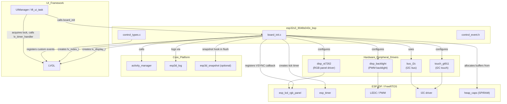
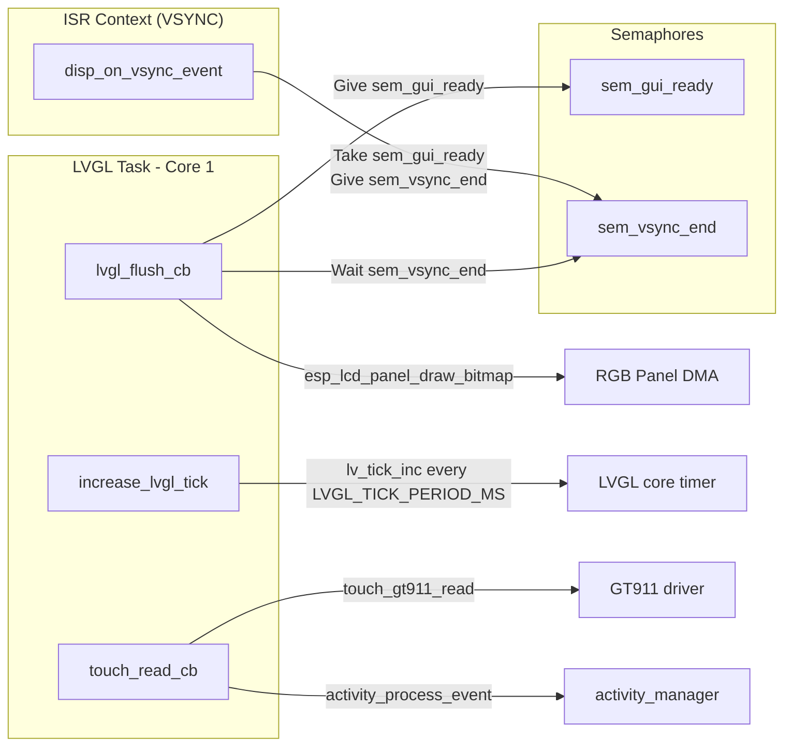
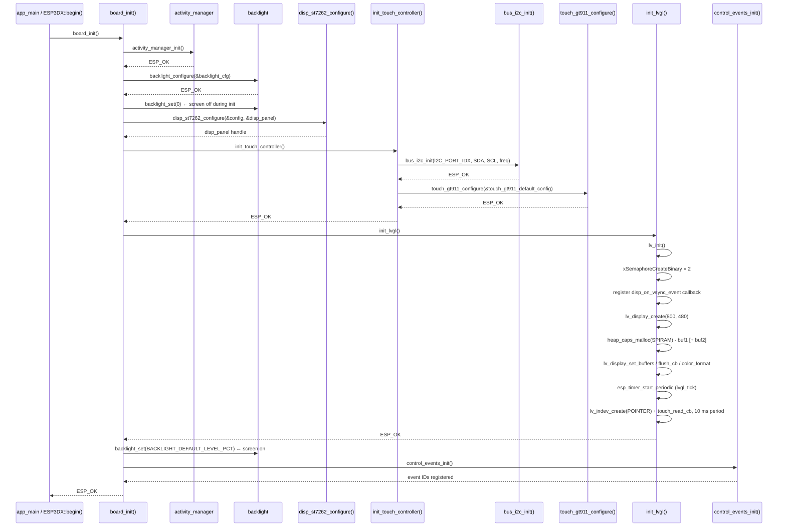
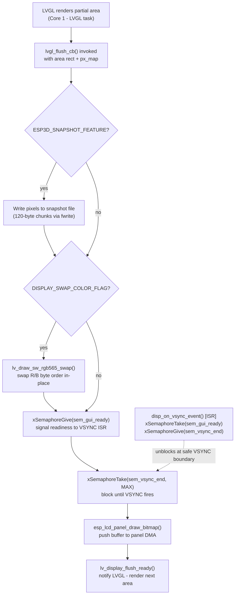
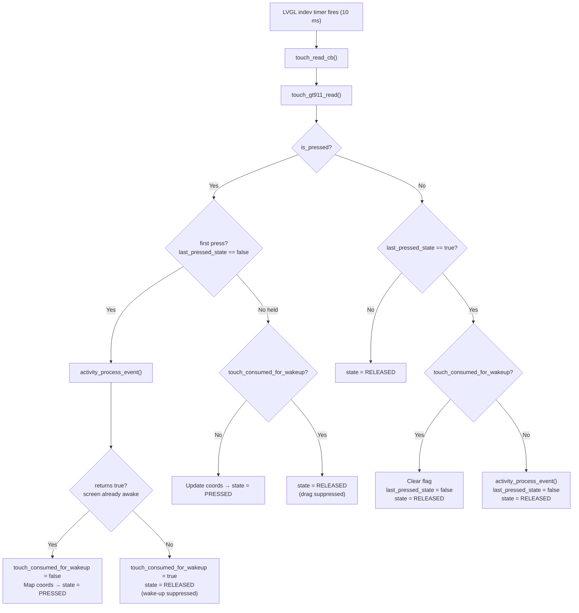
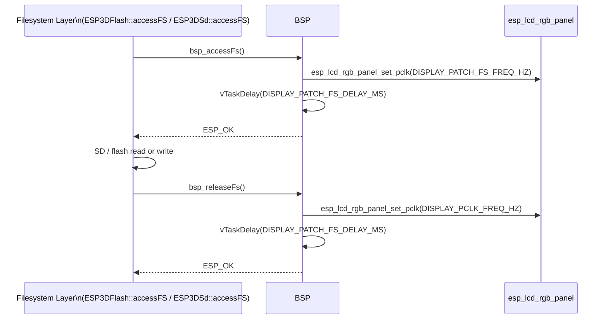
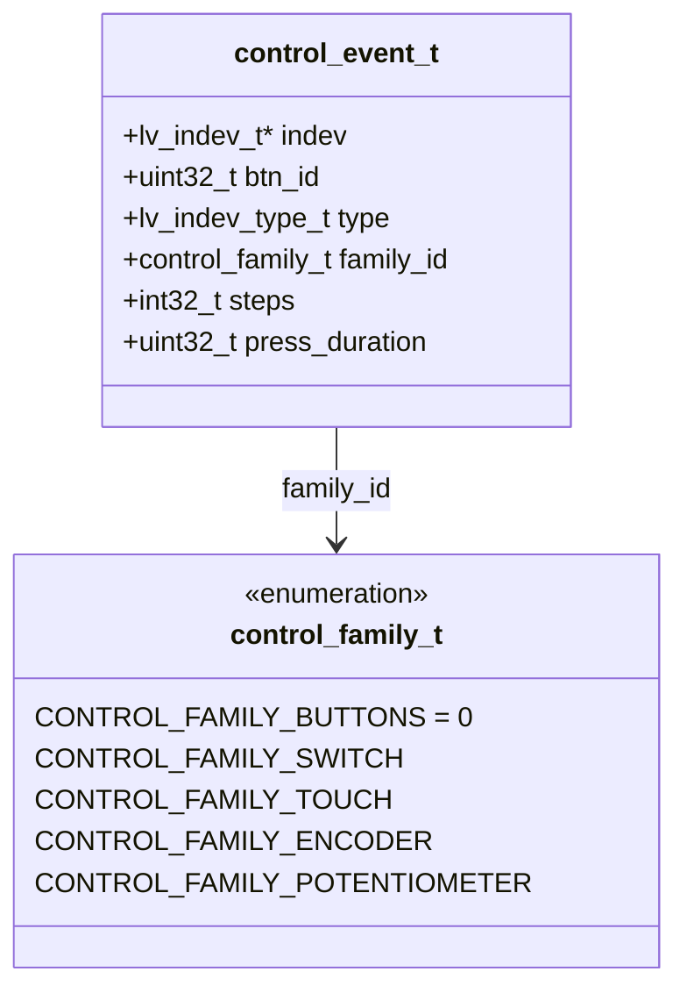

# ESP32S3-8048S043C Board Support Package (BSP)

The `esp32s3_8048s043c_bsp` module is the hardware abstraction layer for the **ESP32S3-8048S043C** board — a 4.3-inch 800 × 480 capacitive-touch display panel driven by an ST7262 controller over a 16-bit RGB parallel interface. It initialises every hardware peripheral needed by the pendant firmware, wires LVGL to the RGB panel and the GT911 touch controller, implements pixel-clock throttling for safe filesystem access, and registers board-specific custom control events consumed by the UI layer.

This board is the **800 × 480 (4.3-inch) sibling** of the 5-inch `esp32s3_8048s050c` and 7-inch `esp32s3_8048s070c` variants. It shares the same ST7262 RGB pipeline, VSYNC semaphore pattern, and `bsp_accessFs`/`bsp_releaseFs` filesystem-clock patch. Unlike the 7-inch `esp32s3_8048_touch_lcd_7`, SD card chip-select is routed through a **direct GPIO** rather than a CH422G I²C IO expander. The parent board module is documented in [esp32s3_8048s043c](esp32s3_8048s043c.md).

---

## Table of Contents

1. [Module Overview](#1-module-overview)
2. [Hardware Specifications](#2-hardware-specifications)
3. [Architecture](#3-architecture)
4. [Component Breakdown](#4-component-breakdown)
   - [board_init.c](#41-board_initc)
   - [control_event.h](#42-control_eventh)
   - [control_types.c](#43-control_typesc)
   - [Configuration Headers](#44-configuration-headers)
5. [Initialization Flow](#5-initialization-flow)
6. [Display Subsystem](#6-display-subsystem)
   - [RGB Parallel Pipeline](#61-rgb-parallel-pipeline)
   - [VSYNC Synchronization](#62-vsync-synchronization)
   - [LVGL Draw Buffers](#63-lvgl-draw-buffers)
   - [Snapshot Support](#64-snapshot-support)
7. [Touch Subsystem](#7-touch-subsystem)
   - [GT911 Configuration](#71-gt911-configuration)
   - [Touch Callback and Activity Manager](#72-touch-callback-and-activity-manager)
8. [Filesystem Access Pixel-Clock Patch](#8-filesystem-access-pixel-clock-patch)
9. [Custom Control Events](#9-custom-control-events)
10. [Public API](#10-public-api)
11. [Compile-Time Feature Flags](#11-compile-time-feature-flags)
12. [Sibling Modules and References](#12-sibling-modules-and-references)

---

## 1. Module Overview

| Item | Value |
|------|-------|
| **Board name** | `ESP32S3-8048S043C` |
| **MCU** | ESP32-S3 |
| **Display** | ST7262, 16-bit RGB565 parallel, 800 × 480 px, 4.3 inch |
| **Touch** | Goodix GT911, capacitive, I²C |
| **IO Expander** | None — SD card CS routed via direct GPIO |
| **Physical controls** | None (encoder, buttons, switch, potentiometer are NC) |
| **Source directory** | `boards/esp32s3_8048s043c/components/bsp/` |
| **Key source files** | `board_init.c`, `control_types.c` |
| **Key header files** | `board_init.h`, `board_config.h`, `control_event.h`, `control_types.h`, `tasks_def.h`, `disp_st7262_def.h`, `touch_gt911_def.h`, `disp_backlight_def.h` |

The BSP is the **only** place in the firmware where hardware I/O details live for this board. The rest of the firmware (UI, GCode host, communication transports) is hardware-agnostic and addresses the board solely through the public API exposed by `board_init.h` and the LVGL handles returned by this module.

---

## 2. Hardware Specifications

### Display

| Parameter | Value |
|-----------|-------|
| Controller | ST7262 (RGB parallel) |
| Interface | 16-bit RGB565 parallel (no SPI) |
| Physical size | 4.3 inch |
| Resolution | 800 × 480 px |
| Pixel clock (normal) | `DISPLAY_PCLK_FREQ_HZ` (defined in `board_config.h`) |
| Pixel clock (FS access) | `DISPLAY_PATCH_FS_FREQ_HZ` (reduced for SD/flash safety) |
| Color format | RGB565 |
| Byte swap | Controlled by `DISPLAY_SWAP_COLOR_FLAG` |
| Frame buffer location | PSRAM (`fb_in_psram = true`) |
| LVGL draw buffer | Single or double, allocated in SPIRAM (`MALLOC_CAP_SPIRAM`) |
| LVGL render mode | `LV_DISPLAY_RENDER_MODE_PARTIAL` |

### Backlight

| Parameter | Value |
|-----------|-------|
| Control | PWM (LEDC) |
| Default level | `BACKLIGHT_DEFAULT_LEVEL_PCT` (defined in `board_config.h`) |
| Startup sequence | Set to 0 before display init; restored to default after LVGL init |

### Touch Controller

| Parameter | Value |
|-----------|-------|
| Controller | GT911 (capacitive) |
| Interface | I²C |
| I²C bus | Dedicated (no expander sharing on this board) |
| Read interval | 10 ms (LVGL indev timer period) |
| Coordinate mapping | `raw_x × DISPLAY_WIDTH_PX / gt911_get_x_max()` |

### Physical Controls

All physical control GPIOs are set to `GPIO_NUM_NC`. There are no physical buttons, encoder, switch, or potentiometer on this board. The control events framework is retained so upper UI layers (shared across all boards) compile without modification and handle emulated input through the touch UI.

---

## 3. Architecture

### High-Level Module Relationships



### Internal BSP Data Flow



---

## 4. Component Breakdown

### 4.1 `board_init.c`

The central initialisation source file. Contains all module-level state variables and all callback functions needed to drive LVGL on this board.

#### Module-Level State

| Variable | Type | Purpose |
|----------|------|---------|
| `lvgl_api_lock` | `_lock_t` | Mutex protecting LVGL API calls from concurrent access |
| `lvgl_display` | `lv_display_t *` | LVGL display handle |
| `lvgl_buf1` | `lv_color16_t *` | Primary LVGL draw buffer (SPIRAM) |
| `lvgl_buf2` | `lv_color16_t *` | Secondary draw buffer (SPIRAM, double-buffer mode only) |
| `lvgl_tick_timer` | `esp_timer_handle_t` | Periodic timer driving `lv_tick_inc()` |
| `touch_indev` | `lv_indev_t *` | LVGL input device handle for the GT911 |
| `disp_panel` | `esp_lcd_panel_handle_t` | ESP-LCD RGB panel handle |
| `sem_vsync_end` | `SemaphoreHandle_t` | Binary semaphore: VSYNC ISR releases the flush pipeline |
| `sem_gui_ready` | `SemaphoreHandle_t` | Binary semaphore: flush signals readiness to the VSYNC ISR |

#### Functions

| Function | Scope | Description |
|----------|-------|-------------|
| `board_init()` | Public | Top-level entry: initialises activity manager, backlight, ST7262, I²C bus, GT911, LVGL, and control events |
| `init_lvgl()` | Static | Creates LVGL display, allocates SPIRAM draw buffers, registers flush callback, starts tick timer, creates touch `indev` |
| `init_touch_controller()` | Static | Initialises I²C bus, then configures GT911 |
| `lvgl_flush_cb()` | Static | LVGL flush callback: optional snapshot write → optional color swap → VSYNC sync → `draw_bitmap` → `flush_ready` |
| `disp_on_vsync_event()` | Static (ISR) | RGB panel VSYNC ISR — synchronises with `lvgl_flush_cb` via the semaphore pair |
| `touch_read_cb()` | Static | LVGL `indev` read callback — reads GT911, maps coordinates, handles wake-up touch suppression |
| `increase_lvgl_tick()` | Static | `esp_timer` callback — calls `lv_tick_inc(LVGL_TICK_PERIOD_MS)` |
| `bsp_accessFs()` | Public (conditional) | Reduces pixel clock to `DISPLAY_PATCH_FS_FREQ_HZ` before flash/SD I/O |
| `bsp_releaseFs()` | Public (conditional) | Restores pixel clock to `DISPLAY_PCLK_FREQ_HZ` after flash/SD I/O |
| `get_lvgl_display()` | Public | Returns `lvgl_display` handle for use by `ESP3DXUi` |
| `get_lvgl_lock()` | Public | Returns `&lvgl_api_lock` for thread-safe LVGL access |
| `get_touch_indev()` | Public | Returns `touch_indev` handle |
| `board_get_name()` | Public | Returns board name string (`BOARD_NAME_STR`) |
| `board_get_version()` | Public | Returns board version string (`BOARD_VERSION_STR`) |

### 4.2 `control_event.h`

Defines the `control_event_t` structure — the common payload dispatched through the LVGL event system for all hardware input events on this board.

```c
typedef struct {
    lv_indev_t        *indev;           // LVGL input device that generated the event
    uint32_t           btn_id;          // Button / control index
    lv_indev_type_t    type;            // LVGL indev type (pointer, button, encoder…)
    control_family_t   family_id;       // Which hardware family generated the event
    int32_t            steps;           // Encoder step count (signed)
    uint32_t           press_duration;  // How long the control was held (ms)
} control_event_t;
```

Because all physical control GPIOs are `GPIO_NUM_NC` on this board, events with non-touch family IDs are only generated by emulated virtual controls in the upper UI layer. Screens receive `control_event_t *` via `lv_event_get_param()`.

### 4.3 `control_types.c`

Declares and registers three custom LVGL event codes beyond the built-in set. These are assigned real IDs by `lv_event_register_id()` inside `control_events_init()`, which `board_init()` calls at the tail of its sequence — after `lv_init()` has run inside `init_lvgl()`.

| Event | Purpose |
|-------|---------|
| `LV_EVENT_SWITCH_PRESSED` | Physical 4-position switch moved to a new position |
| `LV_EVENT_SWITCH_RELEASED` | Physical 4-position switch released |
| `LV_EVENT_POTENTIOMETER_CHANGED` | Analog potentiometer value changed |

All three are initialised to the sentinel `LV_EVENT_ALL` at file scope and receive valid IDs only after `control_events_init()` runs. Calling it before `lv_init()` would cause all three IDs to collide at `LV_EVENT_ALL`.

### 4.4 Configuration Headers

All hardware constants are separated into dedicated `*_def.h` headers so that `board_init.c` remains free of magic numbers.

| Header | Contents |
|--------|---------|
| `board_config.h` | All GPIO assignments, pixel clock frequencies, display resolution, I²C pins and frequency, SD pins — single authoritative pin-map for this board |
| `tasks_def.h` | FreeRTOS task stack sizes, core affinities, priorities, `LVGL_TICK_PERIOD_MS` |
| `disp_st7262_def.h` | Complete `disp_st7262_config_t` wired from `board_config.h`, including RGB timing parameters |
| `touch_gt911_def.h` | Complete `touch_gt911_config_t` wired from `board_config.h`, including axis swap/mirror flags |
| `disp_backlight_def.h` | `backlight_config_t` wired from `board_config.h`, PWM timer/channel/frequency/resolution |

---

## 5. Initialization Flow



**Failure handling:** Every sub-step returns `esp_err_t`. `board_init()` returns on the first non-`ESP_OK` result and logs the failing subsystem via `esp3d_log_e`. LVGL semaphore and buffer allocations are individually checked — a partial allocation frees what was already allocated before returning `ESP_ERR_NO_MEM`.

---

## 6. Display Subsystem

### 6.1 RGB Parallel Pipeline

The ST7262 panel is driven over the ESP32-S3 RGB parallel interface (`esp_lcd_rgb_panel`). Unlike SPI panels, the RGB DMA engine streams pixel data continuously from a framebuffer in PSRAM. The full pipeline from LVGL rendering to panel output is:



### 6.2 VSYNC Synchronization

RGB panels on the ESP32-S3 stream pixel data from a single shared framebuffer. If LVGL writes new pixel data while a scanline is being output, tearing is visible. The BSP avoids this with a binary semaphore pair:

| Semaphore | Direction | Role |
|-----------|-----------|------|
| `sem_gui_ready` | flush → ISR | Signals that the LVGL buffer contains new data ready for DMA transfer |
| `sem_vsync_end` | ISR → flush | Signals that the VSYNC blanking window has opened — safe to transfer |

`lvgl_flush_cb` gives `sem_gui_ready`, then blocks on `sem_vsync_end`. The VSYNC ISR (`disp_on_vsync_event`) takes `sem_gui_ready` and gives `sem_vsync_end`, releasing the flush exactly at the blanking window. This ensures every DMA write-back starts on a scanline boundary, eliminating tearing.

> **ISR constraint:** `disp_on_vsync_event` runs in interrupt context. It uses `xSemaphoreTakeFromISR` / `xSemaphoreGiveFromISR` and returns the `high_task_awoken` flag so FreeRTOS can reschedule if a higher-priority task was unblocked. The ISR body contains no blocking calls and no logging.

### 6.3 LVGL Draw Buffers

Both draw buffers are allocated from SPIRAM (`MALLOC_CAP_SPIRAM`) to preserve the scarce internal DRAM for FreeRTOS stacks and the LVGL object heap.

| Build flag | Buffer count | Behaviour |
|------------|-------------|-----------|
| `DISPLAY_USE_DOUBLE_BUFFER_FLAG = 0` | 1 × `DISP_BUF_SIZE_BYTES` | Single buffer — simpler, lower PSRAM usage |
| `DISPLAY_USE_DOUBLE_BUFFER_FLAG = 1` | 2 × `DISP_BUF_SIZE_BYTES` | Double buffer — LVGL can render next area while DMA is active |

Both modes use `LV_DISPLAY_RENDER_MODE_PARTIAL`. LVGL divides the display into horizontal strips and calls `lvgl_flush_cb` once per strip. `DISP_BUF_SIZE_BYTES` is defined in `board_config.h`.

> **Memory rule:** Never call `heap_caps_malloc` from within `lvgl_flush_cb` or `touch_read_cb`. See [`docs/guides/esp32_memory_constraints.md`](https://github.com/luc-github/Pibot-cnc-pendant-firmware/blob/main/docs/guides/esp32_memory_constraints.md).

### 6.4 Snapshot Support

When `ESP3D_SNAPSHOT_FEATURE` is enabled, `lvgl_flush_cb` intercepts each partial-buffer flush and appends raw pixel data to an open file (`g_snapshot.file`), building a full-screen raw RGB565 capture strip by strip.

Key implementation details:

- Writes are done in **120-byte chunks** to avoid large stack allocations under memory pressure
- The global `g_snapshot.mutex` is taken non-blocking — if unavailable, the flush proceeds without capturing that strip
- `g_snapshot.captured_pixels` is compared against `g_snapshot.expected_pixels`; capture ends automatically when equal
- Any `fwrite` error sets `g_snapshot.error = true` and clears `g_snapshot.ongoing`
- `fflush()` is called after each successful write for durability
- The snapshot path runs **before** the VSYNC semaphore exchange — byte-swap and DMA transfer proceed normally after the capture write

For the `snapshot_state_t` type and the snapshot controller, see `main/display/esp3d_snapshot.h` ([ui_core](bsp_board_initialization.md)).

---

## 7. Touch Subsystem

### 7.1 GT911 Configuration

The GT911 capacitive touch controller is configured via `touch_gt911_configure()` using the board-specific `touch_gt911_default_config` struct from `touch_gt911_def.h`. Key properties:

- **I²C address**: Auto-detected by probing the candidate address list (typically `{0x5D, 0x14, 0}`)
- **Resolution**: Auto-read from GT911 firmware via `touch_gt911_get_x_max()` / `touch_gt911_get_y_max()` — not hardcoded
- **Axis mapping**: `swap_xy`, `invert_x`, `invert_y` set per board wiring in `board_config.h`

In `touch_read_cb`, raw GT911 coordinates are mapped to the logical display resolution at read time:

```c
uint16_t x = touch_data.x * DISPLAY_WIDTH_PX  / touch_gt911_get_x_max();
uint16_t y = touch_data.y * DISPLAY_HEIGHT_PX / touch_gt911_get_y_max();
```

The LVGL `indev` read timer period is set to **10 ms** via `lv_timer_set_period(lv_indev_get_read_timer(touch_indev), 10)`.

### 7.2 Touch Callback and Activity Manager

The touch callback integrates with the `activity_manager` to implement screen-wake-from-sleep behaviour. The first touch event after an idle period wakes the screen but is **not forwarded to LVGL widgets**, preventing accidental button activations on wake-up.



**Wake-up isolation:** `touch_consumed_for_wakeup` is set on the first press that woke the screen. While the flag is set, both press and drag events are reported as `RELEASED` to LVGL, so the waking gesture cannot trigger any UI action. The flag clears on finger lift.

For `ActivitySubscriber` and `activity_manager_init()`, see [bsp_board_initialization](bsp_board_initialization.md).

---

## 8. Filesystem Access Pixel-Clock Patch

On ESP32-S3 boards with RGB parallel displays, simultaneous SD/flash SPI DMA and the RGB pixel-clock signal can interfere at the memory bus level, causing a visible vertical drift artifact on the display or SPI read errors. The BSP implements a pixel-clock throttle gated by `ESP3D_PATCH_FS_ACCESS_RELEASE`.



The delay allows the RGB panel PLL to stabilise and the DMA pipeline to flush before normal display operation resumes. Both functions guard against a `NULL` panel handle and return `ESP_OK` immediately if the display was not initialized.

> See [`docs/architecture/display_drivers.md`](https://github.com/luc-github/Pibot-cnc-pendant-firmware/blob/main/docs/architecture/display_drivers.md) and [`docs/guides/esp32_memory_constraints.md`](https://github.com/luc-github/Pibot-cnc-pendant-firmware/blob/main/docs/guides/esp32_memory_constraints.md) for the full rationale and recommended clock values.

---

## 9. Custom Control Events

`control_types.c` registers three board-level custom LVGL event codes, allowing the application to dispatch hardware input events through the standard LVGL `lv_event_send()` / `lv_obj_add_event_cb()` API.



| Global variable | Trigger |
|----------------|---------|
| `LV_EVENT_SWITCH_PRESSED` | Dispatched when a 4-position switch moves to a new position |
| `LV_EVENT_SWITCH_RELEASED` | Dispatched when the switch is released |
| `LV_EVENT_POTENTIOMETER_CHANGED` | Dispatched when an analog potentiometer value changes |

All three are initialised to `LV_EVENT_ALL` (invalid sentinel) at file scope and receive valid IDs from `lv_event_register_id()` when `control_events_init()` is called — which `board_init()` does at the tail of its sequence, after `lv_init()` has run.

Because this board has no physical switch or potentiometer, these events are defined for API compatibility with shared upper-layer code and will not be generated by hardware interrupts.

---

## 10. Public API

All symbols below are declared in `board_init.h`.

### `board_init()`

```c
esp_err_t board_init(void);
```

Top-level board initialisation. Orchestrates the full hardware bringup in dependency order: activity manager → backlight → ST7262 → I²C → GT911 → LVGL → control events. Must be called once before any LVGL or hardware API is used. Returns `ESP_OK` on success, or the first failing subsystem's error code.

---

### `bsp_accessFs()` / `bsp_releaseFs()`

```c
esp_err_t bsp_accessFs(void);
esp_err_t bsp_releaseFs(void);
```

Throttle and restore the RGB pixel clock around filesystem I/O. Called by `ESP3DFlash::accessFS()` and `ESP3DSd::accessFS()`. Only compiled when `ESP3D_PATCH_FS_ACCESS_RELEASE` is enabled. `bsp_releaseFs()` must be paired with every `bsp_accessFs()` call.

---

### `get_lvgl_display()`

```c
lv_display_t *get_lvgl_display(void);
```

Returns the LVGL display handle created during `board_init()`. Used by `tft_ui_task` in the [UI Framework](UI_Framework_and_Screens.md). Returns `NULL` when `ESP3D_DISPLAY_FEATURE` is disabled.

---

### `get_lvgl_lock()`

```c
_lock_t *get_lvgl_lock(void);
```

Returns a pointer to the LVGL API mutex. The UI task acquires this lock around all `lv_*` API calls to protect against concurrent access from other tasks. Returns `NULL` when `ESP3D_DISPLAY_FEATURE` is disabled.

---

### `get_touch_indev()`

```c
lv_indev_t *get_touch_indev(void);
```

Returns the LVGL touch input device handle. Only compiled when `ESP3D_TOUCH_FEATURE` is enabled.

---

### `board_get_name()` / `board_get_version()`

```c
const char *board_get_name(void);
const char *board_get_version(void);
```

Return the board identification strings defined in `board_config.h`. Used in log output and system-info screens.

---

### `control_events_init()`

```c
void control_events_init(void);
```

Registers the three custom LVGL event IDs. Called automatically by `board_init()` after `lv_init()` — do not call directly.

---

## 11. Compile-Time Feature Flags

| Flag | Effect when enabled |
|------|---------------------|
| `ESP3D_DISPLAY_FEATURE` | Enables the full display + LVGL pipeline |
| `ESP3D_TOUCH_FEATURE` | Enables GT911 init, `lv_indev` registration, and `touch_read_cb` |
| `ESP3D_BRIGHTNESS_CONTROL_FEATURE` | Enables PWM backlight control via `disp_backlight` |
| `ESP3D_PATCH_FS_ACCESS_RELEASE` | Enables pixel-clock throttle during filesystem I/O |
| `ESP3D_SNAPSHOT_FEATURE` | Enables in-flush pixel capture to SD file |
| `DISPLAY_USE_DOUBLE_BUFFER_FLAG` | Allocates a second SPIRAM draw buffer for LVGL |
| `DISPLAY_SWAP_COLOR_FLAG` | Adds an RGB565 byte-swap pass in `lvgl_flush_cb` |

Feature macros are defined via `CMakeLists.txt` `OPTION()` declarations and converted to C preprocessor defines by `cmake/features.cmake`. Mutual-exclusion rules are enforced in `cmake/sanity_check.cmake`.

---

## 12. Sibling Modules and References

### Other BSP Sub-modules of This Board

| Sub-module | Documentation | Purpose |
|------------|--------------|---------|
| Factory App | [esp32s3_8048s043c_factory](esp32s3_8048s043c_factory.md) | Recovery partition: OTA flashing, UI resources update, touch-navigable menu |
| Build Scripts | [esp32s3_8048s043c](esp32s3_8048s043c.md) | Variant matrix, build automation, sdkconfig management |

### Related BSP Modules (RGB Parallel Pipeline)

| Board | Display | Size | Panel | Direct SD CS | FS patch | Doc |
|-------|---------|------|-------|--------------|----------|-----|
| **esp32s3_8048s043c** | 800×480 | 4.3" | ST7262 | **Yes** | Yes | *(this doc)* |
| esp32s3_8048s050c | 800×480 | 5" | ST7262 | Yes | Yes | [esp32s3_8048s050c](esp32s3_8048s050c.md) |
| esp32s3_8048s070c | 800×480 | 7" | ST7262 | Yes | Yes | [esp32s3_8048s070c](esp32s3_8048s070c.md) |
| esp32s3_8048_touch_lcd_7 | 800×480 | 7" | ST7262 | No (CH422G) | Yes | [esp32s3_8048_touch_lcd_7_bsp](esp32s3_8048_touch_lcd_7_bsp.md) |
| esp32s3_4827s043c | 480×272 | 4.3" | ILI9485 | Yes | Yes | [esp32s3_4827s043c_bsp](esp32s3_4827s043c_bsp.md) |

> **Key distinction from `esp32s3_8048_touch_lcd_7`:** That board routes SD CS through CH422G EXIO3 (I²C expander), requiring the expander to be initialised in `init_touch_controller()` before any SD access. This board uses a direct GPIO for SD CS and has no expander in the BSP layer.

### Upstream Consumers

| Consumer | Uses from this BSP |
|----------|-------------------|
| [UI Framework](UI_Framework_and_Screens.md) — `esp3d_x_ui.cpp` | `get_lvgl_display()`, `get_lvgl_lock()`, `get_touch_indev()` |
| [Storage Layer](Storage_and_Configuration.md) — `ESP3DFlash`, `ESP3DSd` | `bsp_accessFs()`, `bsp_releaseFs()` |
| [Core Platform](Core_Platform_and_Infrastructure.md) — `main.cpp` | `board_init()`, `board_get_name()`, `board_get_version()` |

### Hardware Driver Modules

| Module | Used by this BSP |
|--------|-----------------|
| [display_drivers_rgb](display_drivers_rgb.md) | `disp_st7262` (RGB parallel driver) |
| [bsp_board_initialization_display](bsp_board_initialization_display.md) | `disp_backlight` (PWM backlight) |
| [touch_controllers](touch_controllers.md) | `touch_gt911` |
| [bus_drivers](bus_drivers.md) | `bus_i2c` (I²C bus for GT911) |
| [bsp_control_events](bsp_control_events.md) | Custom LVGL event framework |

### Architecture Documentation

| Document | Relevance |
|----------|-----------|
| [`docs/architecture/display_drivers.md`](https://github.com/luc-github/Pibot-cnc-pendant-firmware/blob/main/docs/architecture/display_drivers.md) | RGB parallel vs SPI driver architecture, `swap_xy` semantics, FS patch rationale |
| [`docs/architecture/screens_architecture.md`](https://github.com/luc-github/Pibot-cnc-pendant-firmware/blob/main/docs/architecture/screens_architecture.md) | LVGL screen management built on top of this BSP |
| [`docs/guides/esp32_memory_constraints.md`](https://github.com/luc-github/Pibot-cnc-pendant-firmware/blob/main/docs/guides/esp32_memory_constraints.md) | SPIRAM, DRAM constraints, pixel-clock recommendations |
| [`docs/guides/esp3d_log_guide.md`](https://github.com/luc-github/Pibot-cnc-pendant-firmware/blob/main/docs/guides/esp3d_log_guide.md) | `esp3d_log` / `esp3d_log_e` usage patterns in this module |
| [`docs/features/feature_resource_matrix.md`](https://github.com/luc-github/Pibot-cnc-pendant-firmware/blob/main/docs/features/feature_resource_matrix.md) | RAM budget and feature compatibility per SKU |
