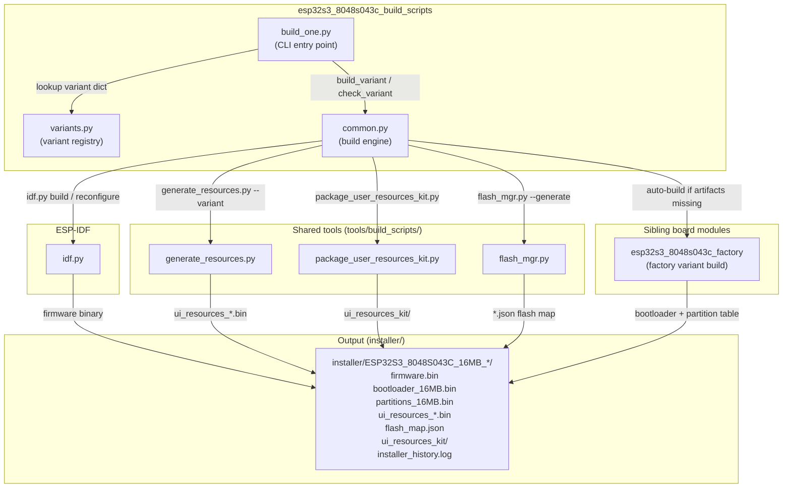
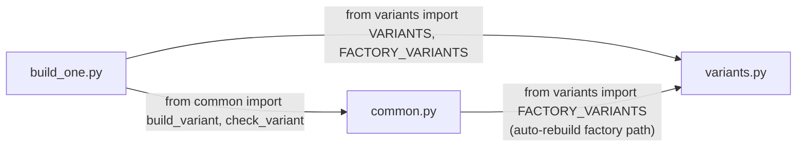
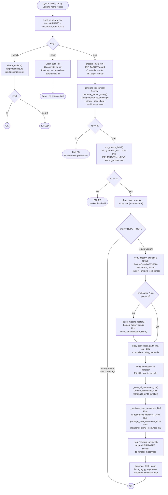
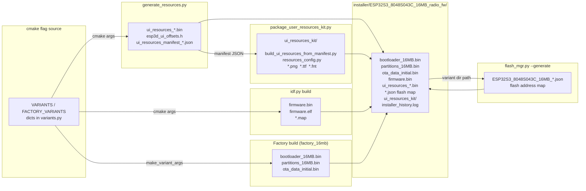
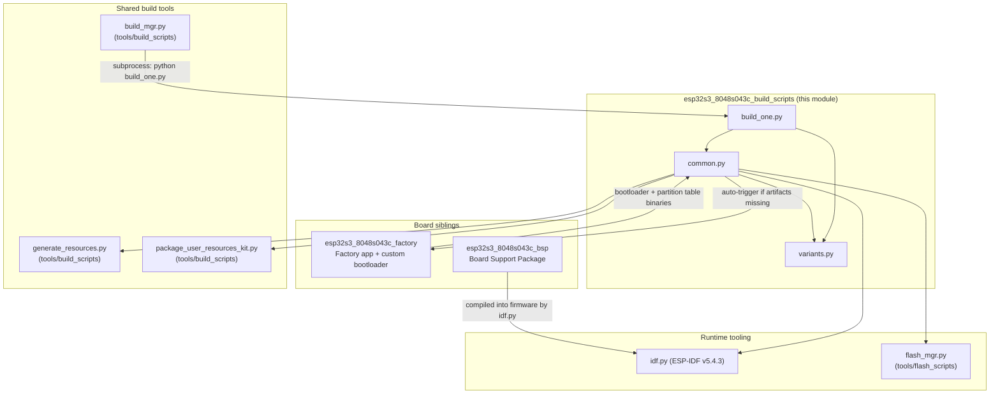

# ESP32S3_8048S043C Build Scripts

The `esp32s3_8048s043c_build_scripts` module is the board-specific build automation layer for the **ESP32S3-8048S043C** hardware target — an ESP32-S3 board with an 800×480 RGB parallel display and 16 MB flash. Its three Python scripts wrap ESP-IDF's `idf.py` to produce fully self-consistent firmware installer packages: UI resources partition, firmware binary, factory bootloader and partition table, flash map JSON, and a standalone user-customization kit, all in one reproducible pipeline.

---

## Table of Contents

1. [Module Overview](#1-module-overview)
2. [Architecture](#2-architecture)
3. [File Structure](#3-file-structure)
4. [Key Concepts](#4-key-concepts)
5. [Component Reference](#5-component-reference)
   - [variants.py](#51-variantspy)
   - [build\_one.py](#52-build_onepy)
   - [common.py](#53-commonpy)
6. [Variant Catalogue](#6-variant-catalogue)
7. [Build Process Flow](#7-build-process-flow)
8. [Data Flow: Artefact Assembly](#8-data-flow-artefact-assembly)
9. [Inter-Module Dependencies](#9-inter-module-dependencies)
10. [Usage](#10-usage)
11. [Board Constants and Environment](#11-board-constants-and-environment)

---

## 1. Module Overview

| Property | Value |
|---|---|
| **Location** | `boards/esp32s3_8048s043c/build_scripts/` |
| **Language** | Python 3 |
| **ESP-IDF version** | 5.4.3 |
| **IDF target** | `esp32s3` |
| **Board resolution** | 800 × 480 (`res_800_480`) |
| **Supported flash sizes** | 16 MB only |
| **Sibling modules** | See [esp32s3_8048s043c_bsp.md](esp32s3_8048s043c_bsp.md), [esp32s3_8048s043c_factory.md](esp32s3_8048s043c_factory.md) |

This module follows the identical three-file pattern used by every other board under `boards/`:

| File | Role |
|---|---|
| `variants.py` | Declares every buildable variant as a plain Python dict |
| `build_one.py` | CLI entry point — names one variant and dispatches to `common.py` |
| `common.py` | Build engine — orchestrates ESP-IDF, resource generation and artefact packaging |

For the shared, board-agnostic build tooling (resource generator, kit packager, size reporter, build manager) see [Build,_Resource_&_Development_Toolchain.md](Build_and_Development_Tools.md).

---

## 2. Architecture

### 2.1 High-Level Component Relationships



### 2.2 Script-Level Dependencies



---

## 3. File Structure

```
boards/esp32s3_8048s043c/
└── build_scripts/
    ├── build_one.py   # CLI: build or validate one named variant
    ├── common.py      # Build engine: ESP-IDF wrapper + artefact pipeline
    └── variants.py    # Variant registry: cmake flag sets + build directories
```

All paths in `common.py` and `variants.py` are anchored at:

| Anchor | Value | Derived from |
|---|---|---|
| `SCRIPT_DIR` | `boards/esp32s3_8048s043c/build_scripts` | `__file__` |
| `BOARD_ROOT` | `boards/esp32s3_8048s043c` | `SCRIPT_DIR/..` |
| `REPO_ROOT` | repository root | `SCRIPT_DIR/../../..` |
| `IDF_PATH` | ESP-IDF installation | `$IDF_PATH` env var (default: `C:\Users\luc\esp\v5.4.3\esp-idf`) |

---

## 4. Key Concepts

### 4.1 Variant Dictionary

Every buildable configuration is represented as a plain Python dict with four keys:

```python
{
    "name":      str,        # Human-readable identifier used in logging and directory names
    "cmake":     list[str],  # Flat list of -D KEY=VALUE arguments forwarded to idf.py
    "cwd":       str,        # Working directory for idf.py (REPO_ROOT or FACTORY_DIR)
    "build_dir": str,        # Absolute path to the per-variant build output directory
}
```

Two registries exist:
- **`VARIANTS`** — regular firmware variants; `cwd` is `REPO_ROOT`.
- **`FACTORY_VARIANTS`** — factory app variants; `cwd` is `boards/esp32s3_8048s043c/Factory/`.

`build_one.py` merges both with `{**FACTORY_VARIANTS, **VARIANTS}` so every name is reachable from a single CLI call.

### 4.2 Deterministic Defaults (All-OFF Baseline)

`variants.py` defines `ROOT_CMAKE_OPTIONS` — an exhaustive list of every toggleable CMake option across the project (board selection, memory size, PSRAM, firmware target, transports, features). `make_variant_args()` pre-generates `DEFAULT_OFF_CMAKE_ARGS` which sets every option to `OFF`, then selectively overrides only the flags that belong to the requested variant:

```python
def make_variant_args(*on_flags):
    args = DEFAULT_OFF_CMAKE_ARGS.copy()   # Every option = OFF
    for flag in on_flags:
        args.extend(["-D", flag])          # Override specific options to ON
    return args
```

This guarantees that stale CMake cache values from a previous build of a different variant cannot leak into the current one.

### 4.3 IDF_TARGET Guard

`prepare_build_dir()` in `common.py` writes a `.idf_target` marker file inside the build directory. Before any build, `_ensure_clean_build_dir()` reads the marker and wipes the entire build directory if it was produced for a different target chip. This prevents silent MCU cross-contamination when the same host machine has recently built for a different ESP32 variant.

### 4.4 Factory Artefact Auto-Rebuild

Regular firmware variants depend on factory artefacts (custom bootloader binary, partition table) produced by the `factory_16mb` variant. `copy_factory_artifacts()` checks whether `boards/esp32s3_8048s043c/Factory/installer/ESP3D-FACTORY_16MB/` contains a `bootloader_*.bin` file. If not — or if the directory is empty because `cmake/targets.cmake` recreated it without completing the build — it automatically runs `build_variant(factory_16mb_config)` before continuing with the regular build.

### 4.5 Resource Variant String

`resource_variant_string(cmake_args)` decodes the CMake flags back into the string format consumed by `generate_resources.py` (e.g. `16mb_wifi_grblhal`). It returns `None` for the Factory variant (which has no UI resources partition), causing `generate_resources()` to silently skip resource generation for that variant.

---

## 5. Component Reference

### 5.1 `variants.py`

#### `make_variant_args(*on_flags) → list[str]`

Creates the complete cmake argument list for a variant.

| Aspect | Detail |
|---|---|
| **Input** | One or more `"KEY=VALUE"` strings (the flags to enable) |
| **Output** | Flat `list[str]` of `-D KEY=VALUE` pairs: all options OFF first, then the requested overrides appended |
| **Side effects** | None — purely functional |

```python
make_variant_args("ESP32S3_8048S043C=ON", "MEMORY_16_MB=ON", "WIFI_SERVICE=ON")
# → ["-D", "ESP32_PIBOT_CNC_PENDANT_V1=OFF", ..., "-D", "ESP32S3_8048S043C=ON",
#    "-D", "MEMORY_16_MB=ON", "-D", "WIFI_SERVICE=ON"]
```

#### `ROOT_CMAKE_OPTIONS`

Master list of every project-wide CMake option. Grouped into categories:

| Category | Options |
|---|---|
| Board selection | `ESP32S3_8048S043C`, `ESP32S3_4827S043C`, `ESP32S3_8048S050C`, … (15 boards total) |
| Memory size | `MEMORY_4_MB`, `MEMORY_8_MB`, `MEMORY_16_MB` |
| PSRAM | `PSRAM_NONE`, `PSRAM_2_MB`, `PSRAM_4_MB`, `PSRAM_8_MB` |
| Firmware target | `TARGET_FW_FLUIDNC`, `TARGET_FW_GRBLHAL`, `TARGET_FW_GRBL`, `TARGET_FW_MARLIN`, `TARGET_FW_SMOOTHIEWARE`, `TARGET_FW_REPETIER`, `TARGET_FW_NONE` |
| Transports | `SERIAL_SERVICE`, `UART_EXT_SERVICE`, `USB_SERIAL_SERVICE`, `WIFI_SERVICE`, `BT_SERVICE`, `BT_SERIAL_SERVICE`, `BT_BLE_SERVICE` |
| Features | `TFT_UI_SERVICE`, `SD_CARD_SERVICE`, `BUZZER_SERVICE`, `LUA_INTERPRETER_SERVICE`, `MDNS_SERVICE`, `SSDP_SERVICE`, `WEBUI_SERVER`, `SOCKET_CLIENT_SERVICE`, `UPDATE_SERVICE`, … |

#### `VARIANTS` and `FACTORY_VARIANTS`

See [Section 6](#6-variant-catalogue) for the complete table.

---

### 5.2 `build_one.py`

#### `main()`

CLI entry point. Accepts a positional variant name plus optional mode flags.

```
python build_one.py <variant_name> [--clean] [--check] [--dev] [--jobs=N]
```

| Flag | Behaviour |
|---|---|
| *(none)* | Full build of the named variant via `build_variant()` |
| `--clean` | Cleans build and installer directories, then exits |
| `--check` | Validates cmake configuration via `check_variant()` without compiling |
| `--dev` | Suppresses `PROD_BUILD=ON` (development build) |
| `--jobs=N` | Sets `CMAKE_BUILD_PARALLEL_LEVEL=N` for parallel ninja compilation |

**Error handling**:
- No variant name → prints usage and available names, exits with code 1.
- Unknown name → prints error and the list of valid names, exits with code 1.
- Build/check failure → forwards the non-zero exit code from `common.py`.

---

### 5.3 `common.py`

#### `build_variant(config) → int`

Main build orchestrator. Returns 0 on success, non-zero on any failure.

**Pipeline** (in order):

```
1. If --clean: wipe build dir + installer dir → return 0
2. prepare_build_dir()           — IDF_TARGET guard, create dir, write marker
3. generate_resources()          — produce ui_resources_*.bin + esp3d_ui_offsets.h
4. run_cmake_build()             — idf.py build
5. _show_size_report()           — idf.py size (informational, non-gating)
6. copy_factory_artifacts()      — auto-build factory_16mb if missing, copy to installer/
7. _copy_ui_resources_bin()      — copy ui_resources_*.bin to installer/
8. _package_user_resources_kit() — assemble standalone end-user kit
9. _log_firmware_artifacts()     — append timestamped record to installer_history.log
10. generate_flash_map()         — run flash_mgr.py --generate → *.json flash map
```

If `cwd != REPO_ROOT` (i.e. the factory variant itself), steps 6–10 are skipped because the factory build produces its own installer directory independently.

---

#### `check_variant(config) → int`

Dry-run validation. Runs `idf.py reconfigure` (CMake configure phase only) to catch cmake errors without compiling anything. Useful for CI pre-flight checks or quickly validating new variant definitions.

---

#### `prepare_build_dir(build_dir)`

Ensures `build_dir` exists and belongs to the expected IDF target (`esp32s3`). Delegates to `_ensure_clean_build_dir()` which reads `.idf_target` and wipes the directory if the stored target does not match `EXPECTED_IDF_TARGET`. Must be called **before** `generate_resources()` writes any files into `build_dir`, so the marker file exists when cmake starts.

---

#### `generate_resources(cmake_args, build_dir) → int`

Decodes `cmake_args` into a resource variant string via `resource_variant_string()`, then invokes:

```bash
python tools/build_scripts/generate_resources.py \
    --variant <variant>          \
    --resolution res_800_480     \
    --partition-csv boards/esp32s3_8048s043c/partitions_16mb.csv \
    --out <build_dir>            \
    [--board-resources boards/esp32s3_8048s043c/resources/]
```

The `--board-resources` argument is only appended when `boards/esp32s3_8048s043c/resources/` exists, allowing optional per-board icon/font/theme overrides on top of the shared resource defaults. Returns 0 (skips silently) for variants with no recognized resource variant (e.g. Factory).

---

#### `copy_factory_artifacts(cmake_args) → int`

1. Checks `boards/esp32s3_8048s043c/Factory/installer/ESP3D-FACTORY_16MB/` for a `bootloader_*.bin` (`_factory_artifacts_complete()`).
2. If absent or directory is empty: calls `_build_missing_factory()` which looks up the matching factory config from `FACTORY_VARIANTS` and runs a full `build_variant()` on it.
3. Copies all artefacts (excluding `size_report.txt`) to `installer/<config_name>/`.
4. Appends a `FACTORY` log section to `installer_history.log`.

---

#### `build_config_name(cmake_args) → str`

Derives the installer subdirectory name from cmake flags. Format:
```
ESP32S3_8048S043C_<memory>_<radio>_<firmware>
```

Examples:
- `ESP32S3_8048S043C_16MB_wifi_fluidnc`
- `ESP32S3_8048S043C_16MB_serial_grbl`
- `ESP32S3_8048S043C_16MB_bt_serial_grblhal`

---

#### `resource_variant_string(cmake_args) → str | None`

Maps cmake flags → `generate_resources.py` variant string. Format: `<mem>mb_<transport>_<firmware>`.

| cmake flags set to ON | Resource variant string |
|---|---|
| `MEMORY_16_MB`, `WIFI_SERVICE`, `TARGET_FW_FLUIDNC` | `16mb_wifi_fluidnc` |
| `MEMORY_16_MB`, `TARGET_FW_GRBL` (no explicit radio) | `16mb_serial_grbl` |
| `MEMORY_16_MB`, `BT_SERIAL_SERVICE`, `TARGET_FW_GRBLHAL` | `16mb_bt_serial_grblhal` |
| `MEMORY_16_MB`, `BT_BLE_SERVICE`, `TARGET_FW_FLUIDNC` | `16mb_bt_ble_fluidnc` |
| Factory variant (no recognized mem/fw combination) | `None` — resource generation skipped |

---

#### `run_cmake_build(cmake_args, cwd, build_dir) → int`

Assembles and runs:
```bash
python $IDF_PATH/tools/idf.py -B <build_dir> <cmake_args> [-D PROD_BUILD=ON] build
```

Environment overrides applied to the subprocess:
- `IDF_TARGET=esp32s3` — forces correct target regardless of any VS Code / shell setting.
- `CMAKE_BUILD_PARALLEL_LEVEL=N` — set when `--jobs=N` is present in `sys.argv` (propagated by `build_mgr.py`).

`PROD_BUILD=ON` is appended unless `--dev` is in `sys.argv`.

---

#### `generate_flash_map(config)`

Invokes `tools/flash_scripts/flash_mgr.py --variant-dir <installer_dir> --generate` (with optional `--flash-params boards/esp32s3_8048s043c/flash_params.json`). Produces the variant's JSON flash map consumed by the web installer and `flash_mgr`.

---

#### `_package_user_resources_kit(cmake_args, build_dir, installer_dir) → int`

Finds the `ui_resources_manifest_*.json` written by `generate_resources.py` and invokes:
```bash
python tools/build_scripts/package_user_resources_kit.py \
    --variant <variant>         \
    --manifest <manifest_path>  \
    --out installer/<config>/ui_resources_kit/
```

Produces a standalone directory (no repo clone required) that end-users can use to customise icons, fonts and theme colours via SD card. See [Build,_Resource_&_Development_Toolchain.md](Build_and_Development_Tools.md).

---

#### Supporting helper functions

| Function | Purpose |
|---|---|
| `ensure_idf_py()` | Validates that `idf.py` exists at `IDF_PATH`; exits with error if missing |
| `clean_build_dir(build_dir)` | `shutil.rmtree` on `build_dir` |
| `parse_cmake_flags(cmake_args)` | Parses a flat `-D KEY=VALUE` list into a `{KEY: VALUE}` dict |
| `run_cmake_check(cmake_args, cwd, build_dir)` | Runs `idf.py reconfigure` for `check_variant()` |
| `_show_size_report(build_dir, cwd)` | Runs `idf.py size` — informational, not gating |
| `installer_dir_for(config)` | Returns the installer output directory path for a config dict |
| `_factory_artifacts_complete(source_dir)` | Returns `True` only when directory exists **and** contains a `bootloader_*.bin` |
| `_build_missing_factory(source_dir)` | Resolves and builds the factory variant whose installer dir matches `source_dir` |
| `_copy_ui_resources_bin(build_dir, installer_dir)` | Copies `ui_resources_*.bin` from build dir to installer dir |
| `_log_firmware_artifacts(...)` | Appends a timestamped `FIRMWARE` section to `installer_history.log` |
| `_get_jobs_env_value()` | Parses `--jobs=N` from `sys.argv` for `CMAKE_BUILD_PARALLEL_LEVEL` |

---

## 6. Variant Catalogue

### Regular Firmware Variants (`VARIANTS`)

| Name | Memory | Radio | CNC Firmware | Extra Services | Build dir |
|---|---|---|---|---|---|
| `16mb_wifi_fluidnc` | 16 MB | WiFi | FluidNC | Serial, mDNS, Socket Client, Lua, Update | `build/esp32s3_8048s043c_16mb_wifi_fluidnc/` |
| `16mb_serial_fluidnc` | 16 MB | Serial | FluidNC | Update | `build/esp32s3_8048s043c_16mb_serial_fluidnc/` |
| `16mb_serial_grbl` | 16 MB | Serial | GRBL | Update | `build/esp32s3_8048s043c_16mb_serial_grbl/` |
| `16mb_wifi_grblhal` | 16 MB | WiFi | grblHAL | Serial, mDNS, Socket Client, Lua, Update | `build/esp32s3_8048s043c_16mb_wifi_grblhal/` |

All regular variants enable `TFT_UI_SERVICE=ON` and `TFT_TOUCH_SERVICE=ON`.

### Factory Variants (`FACTORY_VARIANTS`)

| Name | Memory | CWD | Build dir |
|---|---|---|---|
| `factory_16mb` | 16 MB | `boards/esp32s3_8048s043c/Factory/` | `boards/esp32s3_8048s043c/Factory/build/factory_16mb/` |

The factory variant produces the custom bootloader and partition table artefacts that all regular variants depend on. It runs from the `Factory/` subdirectory and produces its own installer output under `Factory/installer/ESP3D-FACTORY_16MB/`. See [esp32s3_8048s043c_factory.md](esp32s3_8048s043c_factory.md) for the factory application details.

---

## 7. Build Process Flow



---

## 8. Data Flow: Artefact Assembly



---

## 9. Inter-Module Dependencies



**Relationship with `build_mgr.py`**: The higher-level [Build,_Resource_&_Development_Toolchain.md](Build_and_Development_Tools.md) `build_mgr.py` script coordinates multi-board, multi-variant batch builds by calling each board's `build_one.py` as a subprocess, passing `--jobs=N` for parallel compilation. This module is designed to be invoked either directly by a developer or as a subprocess of `build_mgr.py`.

---

## 10. Usage

### Build a single variant

```bash
cd boards/esp32s3_8048s043c/build_scripts

python build_one.py 16mb_wifi_fluidnc
python build_one.py 16mb_serial_grbl
python build_one.py factory_16mb
```

### List all available variants

```bash
python build_one.py
```

Output:
```
Usage: build_one.py <variant_name> [--clean] [--check]
Available variants:
  factory_16mb
  16mb_wifi_fluidnc
  16mb_serial_fluidnc
  16mb_serial_grbl
  16mb_wifi_grblhal
```

### Clean before rebuilding

```bash
python build_one.py 16mb_wifi_fluidnc --clean   # wipe artifacts only
python build_one.py 16mb_wifi_fluidnc            # then build fresh
```

### Validate cmake configuration without compiling

```bash
python build_one.py 16mb_wifi_grblhal --check
```

### Developer build (skip `PROD_BUILD=ON`)

```bash
python build_one.py 16mb_serial_fluidnc --dev
```

### Parallel compilation

```bash
python build_one.py 16mb_wifi_fluidnc --jobs=8
```

### Required environment

```bash
# ESP-IDF must be activated before running any build
. $IDF_PATH/export.sh          # Linux / macOS
%IDF_PATH%\export.bat          # Windows

# IDF_PATH must point to ESP-IDF v5.4.3
export IDF_PATH=/path/to/esp-idf
```

If `IDF_PATH` is not set, `common.py` falls back to `C:\Users\luc\esp\v5.4.3\esp-idf` and exits with a clear error if `idf.py` is not found there.

---

## 11. Board Constants and Environment

| Constant | Value | Purpose |
|---|---|---|
| `RESOLUTION` | `res_800_480` | Passed to `generate_resources.py` — selects image/font scale for the 800×480 panel |
| `EXPECTED_IDF_TARGET` | `esp32s3` | Written to `.idf_target` marker; mismatches trigger a full clean of the build directory |
| `_TARGET_MARKER` | `.idf_target` | Filename of the per-build-dir IDF target guard file |
| `PROD_BUILD=ON` | CMake define | Applied unless `--dev` flag is present; enables production optimisations in `cmake/` |
| Factory installer subdir | `ESP3D-FACTORY_16MB` | Hardcoded name matching `cmake/targets.cmake`'s output path for the factory build |

### Build directory layout

```
<REPO_ROOT>/
├── build/
│   ├── esp32s3_8048s043c_16mb_wifi_fluidnc/       ← idf.py -B target
│   │   ├── .idf_target                             ← "esp32s3"
│   │   ├── esp3d_ui_offsets.h                      ← generate_resources output
│   │   ├── ui_resources_16mb_wifi_fluidnc.bin
│   │   ├── ui_resources_manifest_16mb_wifi_fluidnc.json
│   │   └── ... (cmake / ninja artifacts)
│   └── esp32s3_8048s043c_16mb_serial_grbl/
│       └── ...
│
├── installer/
│   └── ESP32S3_8048S043C_16MB_wifi_fluidnc/
│       ├── firmware.bin                             ← from idf.py build
│       ├── bootloader_16MB.bin                      ← from factory_16mb build
│       ├── partitions_16MB.bin                      ← from factory_16mb build
│       ├── ota_data_initial.bin                     ← from factory_16mb build
│       ├── ui_resources_16mb_wifi_fluidnc.bin       ← from generate_resources
│       ├── ESP32S3_8048S043C_16MB_wifi_fluidnc.json ← from flash_mgr
│       ├── ui_resources_kit/                        ← from package_user_resources_kit
│       └── installer_history.log
│
└── boards/esp32s3_8048s043c/
    └── Factory/
        └── installer/
            └── ESP3D-FACTORY_16MB/                  ← factory build output (source)
                ├── bootloader_16MB.bin
                ├── partitions_16MB.bin
                └── ota_data_initial.bin
```

---

## See Also

- **[esp32s3_8048s043c_bsp.md](esp32s3_8048s043c_bsp.md)** — Board Support Package: ST7262 RGB display driver, GT911 touch, LVGL initialisation, vsync-based flush callback, `bsp_accessFs`/`bsp_releaseFs` SD arbitration
- **[esp32s3_8048s043c_factory.md](esp32s3_8048s043c_factory.md)** — Factory application: touch calibration UI, SD update flow, OTA partition management, custom bootloader hooks
- **[Build,_Resource_&_Development_Toolchain.md](Build_and_Development_Tools.md)** — Shared build tooling: `build_mgr.py` (batch builds), `generate_resources.py` (UI resources partition), `package_user_resources_kit.py`, size reporting scripts
- **[esp32s3_4827s043c_build_scripts.md](esp32s3_4827s043c_build_scripts.md)** — Sibling board build scripts (same three-file pattern, different display resolution and variants)
- **[esp32s3_8048_touch_lcd_7_build_scripts.md](esp32s3_8048_touch_lcd_7_build_scripts.md)** — Sibling 800×480 board with identical RGB panel type but different BSP
- **[docs/guides/board_build_guidelines.md](https://github.com/luc-github/Pibot-cnc-pendant-firmware/blob/main/docs/guides/board_build_guidelines.md)** — Project-level build guide: IDF setup, feature flags, partition strategy
- **[docs/ui_resources/development.md](https://github.com/luc-github/Pibot-cnc-pendant-firmware/blob/main/docs/ui_resources/development.md)** — UI resources partition format, `generate_resources.py` API, SD-card update workflow
