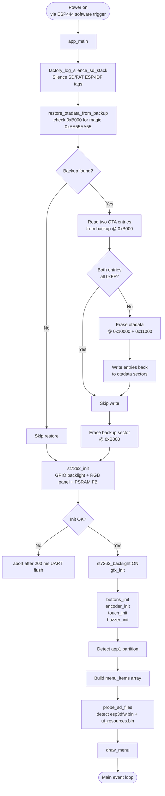
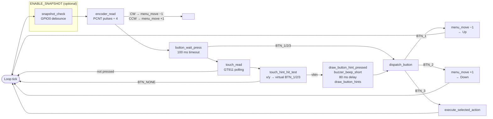
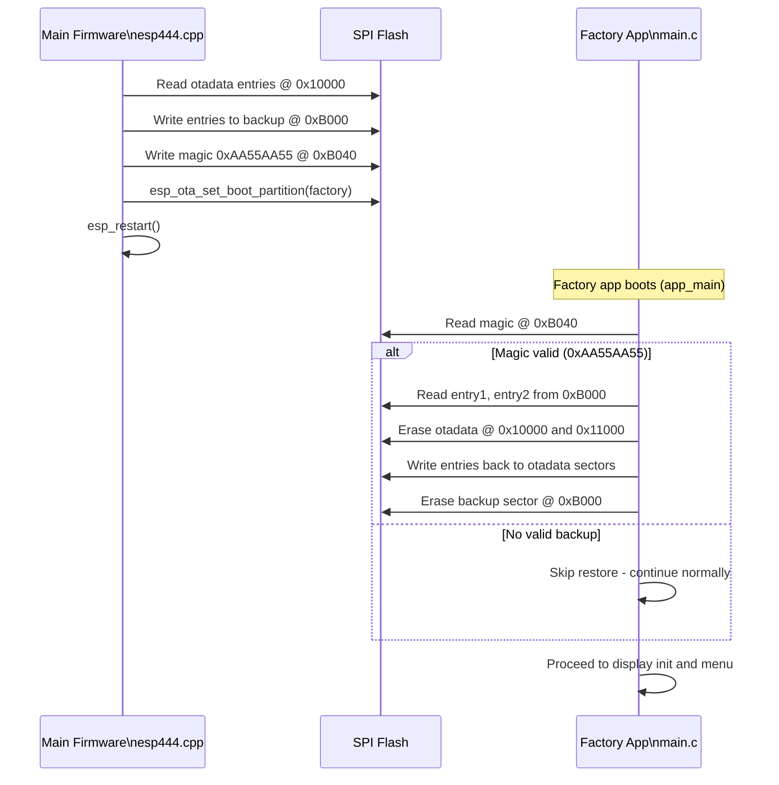
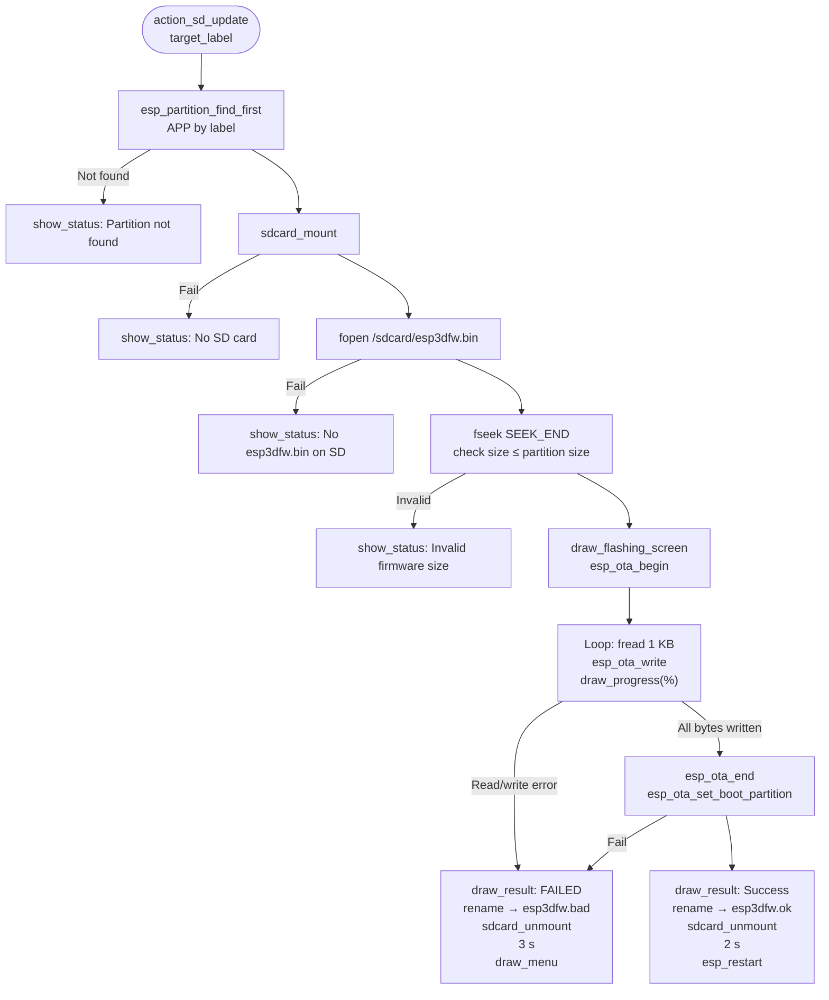
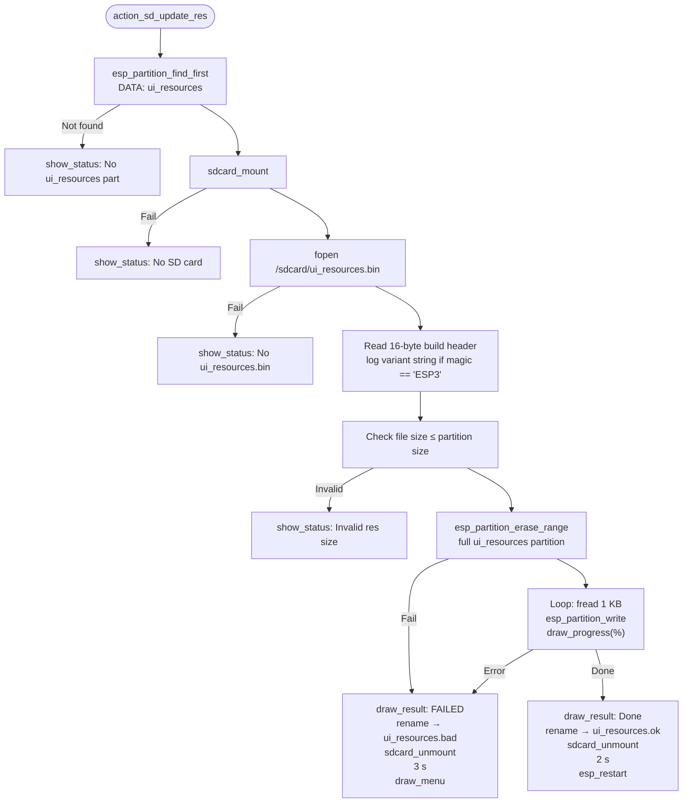
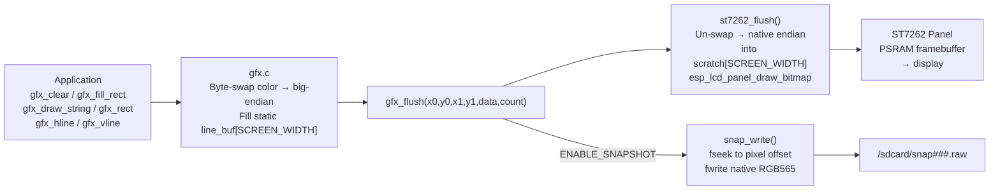
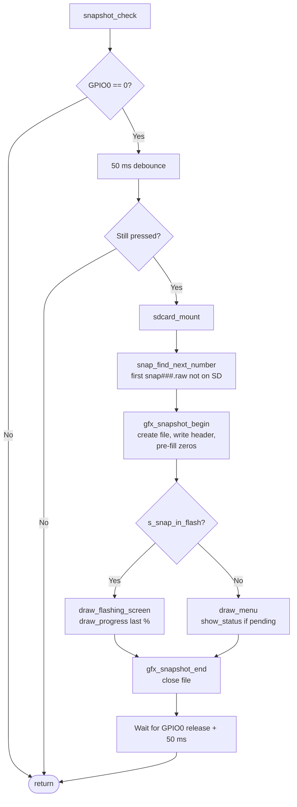
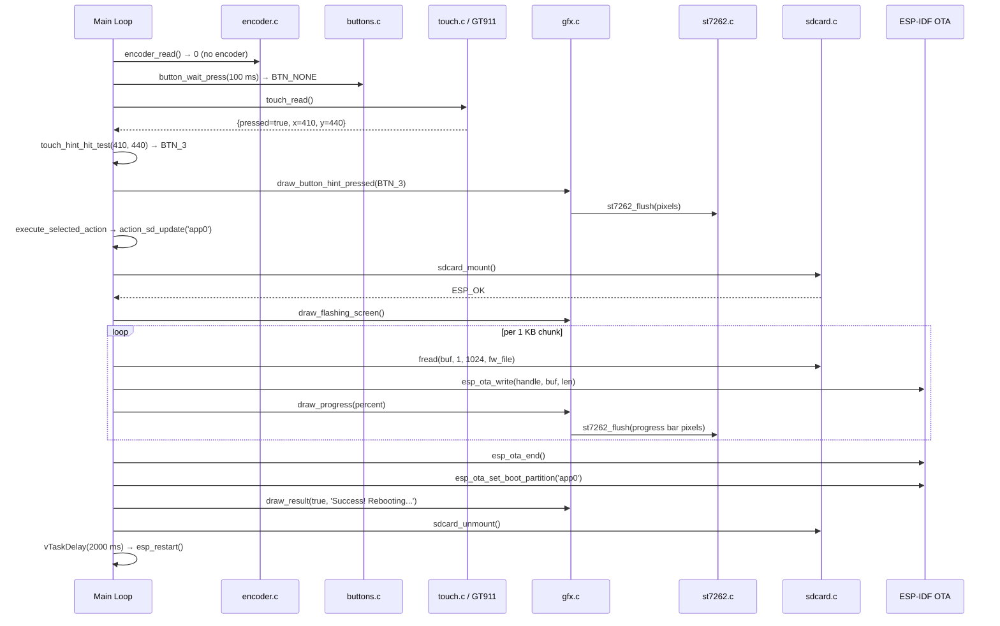

# esp32s3_8048s043c — Factory / Recovery Application

## Introduction

The `esp32s3_8048s043c_factory` module is the standalone recovery firmware for the **ESP32-S3 8048S043C** board: an 800 × 480 capacitive-touch LCD board driven by an ST7262 RGB-parallel panel and a GT911 I2C touch controller.

Unlike boards that enter recovery by holding a physical button at power-on (e.g. `pibot_pendant_v1_0`), **this board has no physical buttons, encoder, or buzzer populated** — all three peripherals are wired to `GPIO_NUM_NC`. Recovery is entered exclusively via the software `[ESP444]FACTORY` command issued from the main firmware, which backs up the OTA-data partition before switching the boot partition to `factory`. The factory app then restores that backup on startup so a subsequent power-cycle returns to the correct application partition.

The factory app is entirely self-contained: it implements its own lightweight graphics stack (no LVGL), its own touch driver, and its own display driver — all built without any dependency on the main firmware's infrastructure.

> **Key board differentiator vs. similar factory apps:** The ST7262 is an RGB-parallel panel that requires a PSRAM framebuffer. Every other board ported so far uses SPI panels (ST7796, ILI9341, ILI9485). This means `st7262_flush()` must un-swap byte order before calling `esp_lcd_panel_draw_bitmap()`, whereas SPI panels consume big-endian data directly on the wire.

---

## Module Location

```
boards/esp32s3_8048s043c/Factory/
├── main/
│   ├── main.c            # App entry point, recovery menu, OTA actions
│   ├── gfx.c             # Graphics primitives + optional snapshot capture
│   ├── st7262.c          # ST7262 RGB-parallel display driver wrapper
│   ├── touch.c           # GT911 I2C touch controller wrapper
│   ├── touch.h           # touch_point_t type + API declaration
│   ├── sdcard.c          # SD card mount / unmount (SPI, FAT-VFS)
│   ├── buttons.c         # Button driver (no-op on this board)
│   ├── buzzer.c          # Buzzer driver (no-op on this board)
│   ├── encoder.c         # Rotary encoder driver (no-op on this board)
│   └── factory_log.h     # Compile-time debug logging gate
├── CMakeLists.txt
└── sdkconfig             # Base sdkconfig (+ sdkconfig.prod_log overlay)
```

> **No custom bootloader directory:** This board has no physical button to detect at power-on, so `ENABLE_CUSTOM_BOOT_LOADER` is not set and there is no `custom_bootloader/` or `bootloader_components/` folder. The OTA-data backup/restore contract is fulfilled entirely in software.

---

## Architecture Overview

```mermaid
block-beta
  columns 3

  block:hardware["Hardware"]:1
    ST7262["ST7262\nRGB Parallel Panel\n800×480 native landscape"]
    GT911["GT911\nI2C Capacitive Touch"]
    SDCARD["SD Card\nSPI / FAT-VFS"]
    NOPHY["Buttons / Encoder / Buzzer\n(GPIO_NUM_NC - not populated)"]
  end

  block:drivers["Driver Wrappers"]:1
    st7262c["st7262.c\nRGB panel init + flush\n(PSRAM framebuffer)"]
    touchc["touch.c\nGT911 configure + read\n+ coordinate rescaling"]
    sdcardc["sdcard.c\nSPI bus + FAT mount"]
    buttonsc["buttons.c\n(guards GPIO_NUM_NC)"]
    buzzerc["buzzer.c\n(guards GPIO_NUM_NC)"]
    encoderc["encoder.c\n(guards GPIO_NUM_NC)"]
  end

  block:app["Application"]:1
    gfxc["gfx.c\nPixel rendering\n+ snapshot to SD"]
    mainc["main.c\nRecovery menu\nOTA + SD flash\nTouch navigation"]
    factorylog["factory_log.h\nConditional log gate"]
  end

  ST7262 --> st7262c
  GT911 --> touchc
  SDCARD --> sdcardc
  NOPHY --> buttonsc
  NOPHY --> buzzerc
  NOPHY --> encoderc

  st7262c --> gfxc
  touchc --> mainc
  sdcardc --> mainc
  buttonsc --> mainc
  buzzerc --> mainc
  encoderc --> mainc
  gfxc --> mainc
  factorylog --> mainc
```



---

## Startup and Initialization Flow



---

## Main Event Loop — Input Dispatching

All input sources are unified through `dispatch_button(button_id_t)`, so physical buttons, encoder turns, and virtual touch buttons produce identical outcomes. On this board, physical buttons and encoder always return `BTN_NONE` / 0.



---

## Menu System

### Menu Item Type

```c
typedef struct {
    const char *label;      // Text shown in the menu list
    menu_action_t action;   // Action executed on BTN_3 / touch OK
    uint16_t color;         // Foreground color when not selected
} menu_item_t;
```

### Available Menu Actions

| Action | Shown when | Description |
|---|---|---|
| `MENU_ACTION_BOOT_APP0` | Always | `esp_ota_set_boot_partition("app0")` → `esp_restart()` |
| `MENU_ACTION_BOOT_APP1` | `app1` partition exists | `esp_ota_set_boot_partition("app1")` → `esp_restart()` |
| `MENU_ACTION_SD_UPDATE_APP0` | Always | Flash `/sdcard/esp3dfw.bin` to `app0` via OTA API |
| `MENU_ACTION_SD_UPDATE_APP1` | `app1` exists | Flash `/sdcard/esp3dfw.bin` to `app1` via OTA API |
| `MENU_ACTION_SD_UPDATE_RES` | Always | Flash `/sdcard/ui_resources.bin` to `ui_resources` partition |

> This board ships with only `app0`; the `app1` branch is compiled in but the menu items for it are suppressed at runtime if the partition is absent.

---

## OTA Data Backup and Restore

This board uses no custom bootloader. The main firmware's `esp444.cpp` writes the otadata backup before switching to the factory partition; `restore_otadata_from_backup()` runs as the very first operation in `app_main()`.

See [factory_update_actions_otadata.md](factory_update_actions_otadata.md) for the general backup/restore design. The board-specific constants are:

| Constant | Value | Constraint |
|---|---|---|
| `OTADATA_OFFSET` | `0x10000` | Standard ESP32-S3 otadata location |
| `OTADATA_SECTOR_SIZE` | `0x1000` (4 KB) | Two sectors (one per OTA slot) |
| `OTADATA_BACKUP_OFFSET` | `0xB000` | After bootloader end, before partition table (`0xC000`) |
| `BACKUP_MAGIC_OFFSET` | `0x40` | Offset within backup sector |
| `BACKUP_MAGIC` | `0xAA55AA55` | Sentinel value matching `esp444.cpp` exactly |

> ⚠️ **`CONFIG_SPI_FLASH_DANGEROUS_WRITE_ALLOWED` required.** The factory app writes to `0xB000`, which is below the first partition. ESP-IDF's default `CONFIG_SPI_FLASH_DANGEROUS_WRITE_ABORTS` would abort this write. The factory sdkconfig must enable `CONFIG_SPI_FLASH_DANGEROUS_WRITE_ALLOWED=y`. This is intentional — the factory app is a privileged recovery tool.



---

## SD Firmware Update Flow

See also [factory_update_actions_sd_flash.md](factory_update_actions_sd_flash.md) for the cross-board description of this pattern.



---

## SD Resources Update Flow



---

## Display Driver — `st7262.c`

Thin wrapper over the shared `hardware/drivers_video_rgb/disp_st7262` component. See [display_drivers_rgb.md](display_drivers_rgb.md) for the shared driver reference.

### How This Board Differs from SPI-Panel Boards

| Aspect | SPI boards (ST7796 / ILI9341 / ILI9485) | This board — ST7262 RGB |
|---|---|---|
| Framebuffer | None (pixels streamed via SPI DMA) | PSRAM mandatory (`fb_in_psram=true`) |
| Draw API | `lcd_panel_draw_bitmap` → SPI transaction | `esp_lcd_panel_draw_bitmap` → PSRAM copy |
| Byte order | Big-endian on wire (SPI convention) | Native endian in PSRAM |
| Backlight | Often PWM / LEDC | Simple GPIO toggle (`TFT_LED`) |
| Orientation | Often 90° rotated (portrait enclosures) | Native landscape — `DISP_ST7262_ORIENTATION_LANDSCAPE` (pure passthrough, no `swap_xy/mirror`) |

### Byte-Swap in `st7262_flush()`

`gfx.c` writes pixels in **big-endian RGB565** (shared convention across all boards). `st7262_flush()` must un-swap to native order for the PSRAM framebuffer:

```c
for (size_t i = 0; i < count; i++) {
    uint16_t v = data[i];
    scratch[i] = (uint16_t)((v >> 8) | (v << 8));  // big-endian → native
}
esp_lcd_panel_draw_bitmap(s_panel, x0, y0, x1 + 1, y1 + 1, scratch);
```

A local `scratch[SCREEN_WIDTH]` buffer is used instead of in-place swapping because `gfx_hline()` / `gfx_fill_rect()` / `gfx_clear()` fill `line_buf` **once** and call `gfx_flush()` once per row with the **same pointer** — in-place swapping would produce alternating wrong-color rows on every other call.

---

## Graphics Layer — `gfx.c`

A minimal, LVGL-free pixel renderer. See [factory_graphics.md](factory_graphics.md) for the cross-board design description.

### Rendering Pipeline



### Snapshot File Format (`ENABLE_SNAPSHOT`)

| Offset | Size | Content |
|---|---|---|
| 0 | 4 B | Width in pixels (little-endian `uint32`) |
| 4 | 4 B | Height in pixels (little-endian `uint32`) |
| 8 | W × H × 2 B | Raw RGB565 pixels, native endian, row-major |

Convert to PNG with `tools/images_converter/raw2png.py`. See [factory_snapshot.md](factory_snapshot.md) for the complete snapshot design.

---

## Touch Driver — `touch.c`

Wrapper over the shared `hardware/common/drivers/touch_gt911` component. See [factory_touch.md](factory_touch.md) for the cross-board touch driver pattern and [touch_controllers.md](touch_controllers.md) for the shared GT911 hardware driver.

### GT911 Coordinate Rescaling

The GT911's internal `x_max` / `y_max` registers do **not** match the physical 800 × 480 panel resolution on this board (measured at approximately 468 × 253 on real hardware). Raw coordinates must be rescaled:

```c
pt.x = (int)data.x * SCREEN_WIDTH  / touch_gt911_get_x_max();
pt.y = (int)data.y * SCREEN_HEIGHT / touch_gt911_get_y_max();
```

This is identical to how the main firmware's `board_init.c` handles the same controller (see [esp32s3_8048s043c.md](esp32s3_8048s043c.md)).

### Virtual Button Hit-Testing

Three virtual button icons (up arrow / down arrow / check mark) are drawn in the bottom-bar area. `touch_hint_hit_test()` maps a raw touch coordinate to a `button_id_t` using column midpoints between the actual icon centers — **not** a simple screen-width ÷ 3 split, which would mismap the clustered icons on a wide 800 px canvas:

```
SCREEN_WIDTH = 800 px

BTN_HINT_CX1 = 400 − 100 = 300   (BTN_1 — Up)
BTN_HINT_CX2 = 400               (BTN_2 — Down)
BTN_HINT_CX3 = 400 + 100 = 500   (BTN_3 — OK)

boundary_1_2 = (300 + 400) / 2 = 350
boundary_2_3 = (400 + 500) / 2 = 450

x < 350  →  BTN_1 (Up)
x < 450  →  BTN_2 (Down)
x ≥ 450  →  BTN_3 (OK)
```

---

## Screen Layout

```
y=  0  ┌────────────────────────────────────────────────────────────────────────────┐
       │ ╔══════════════════════════════════════════════════════════════════════════╗ │
       │ ║                Recovery <version>               ← title, cyan           ║ │
       │ ╚══════════════════════════════════════════════════════════════════════════╝ │
y= 40  │────────────────────────────────────────────────────────────────────────────│ hline
y= 45  │             Active: <partition label>             ← yellow                  │
y= 68  │ SD:   FW (green)   RES (cyan)                   ← right-aligned SD status  │
y= 88  │────────────────────────────────────────────────────────────────────────────│ hline
y= 94  │ ┌──────────────────────────────────────────────────────────────────────┐    │ ← MENU_START_Y
       │ │ ▶ Boot app0          ← highlight box (dark blue) + bright-blue text  │    │   item 0, h=34
       │ └──────────────────────────────────────────────────────────────────────┘    │
       │   SD -> app0           ← green                                              │   item 1
       │   SD -> app1           ← green  (if app1 exists)                           │   item 2
       │   SD -> resources      ← cyan                                               │   item 3
       │                                                                              │
       │────────────────────────────────────────────────────────────────────────────│ STATUS_Y−7 hline
STATUS_Y  │   Power off to cancel   OR   <status message>  ← footer zone            │
BTN_BASE  │━━━━━━━━━━━━━━━━━━━━━━━━━━━━━━━━━━━━━━━━━━━━━━━━━━━━━━━━━━━━━━━━━━━━━━ │ separator
       │       ⬆ blue (CX1=300)      ⬇ blue (CX2=400)      ✓ green (CX3=500)       │ virtual btns
y=480  └────────────────────────────────────────────────────────────────────────────┘
```

### Layout Constants

| Constant | Value | Derivation |
|---|---|---|
| `MENU_START_Y` | `94` | Scaled ×0.85 from the 320×480 portrait reference boards |
| `MENU_ITEM_H` | `34` | Item row height (includes 2 px gap) |
| `MENU_PAD_X` | `20` | Horizontal margin |
| `FONT_WIDTH` | `12` | Monospace font column width (`font12x24`) |
| `FONT_HEIGHT` | `24` | Monospace font row height |
| `BTN_CIRCLE_R` | `30` | Virtual button circle radius |
| `BTN_HINT_CX1/2/3` | `300 / 400 / 500` | Icon centers (clustered around `SCREEN_WIDTH/2 = 400`) |

---

## SD Card Driver — `sdcard.c`

The SD card uses SPI (not SDIO) with the ESP-IDF FAT-VFS layer, mounted at `/sdcard`. See [factory_sdcard.md](factory_sdcard.md) for the cross-board pattern.

### SD File Lifecycle

| File | Status after successful flash | Status after failed flash |
|---|---|---|
| `/sdcard/esp3dfw.bin` | Renamed to `esp3dfw.ok` | Renamed to `esp3dfw.bad` |
| `/sdcard/ui_resources.bin` | Renamed to `ui_resources.ok` | Renamed to `ui_resources.bad` |
| `/sdcard/snap###.raw` | Created by snapshot feature | — |

> The SPI bus is initialized once and never freed between mount/unmount cycles to avoid interference with other SPI peripherals (pattern shared across all factory SD drivers).

---

## Physical Peripheral Drivers

All three peripheral drivers follow the same guard pattern — they check for `GPIO_NUM_NC` and become no-ops on this board. The code is identical to other boards so it works unchanged if these parts are ever populated.

See [factory_buttons.md](factory_buttons.md), [factory_encoder.md](factory_encoder.md), and [factory_buzzer.md](factory_buzzer.md) for the cross-board driver designs.

| Driver | Pin | Behavior on this board |
|---|---|---|
| `buttons.c` — `buttons_init()` | `BUTTON_1/2/3_PIN = GPIO_NUM_NC` | `pin_mask == 0` → early return; `button_wait_press()` always returns `BTN_NONE` after timeout |
| `encoder.c` — `encoder_init()` | `ENCODER_A/B_PIN = GPIO_NUM_NC` | `!GPIO_IS_VALID_GPIO()` → skip PCNT; `encoder_read()` always returns `0` |
| `buzzer.c` — `buzzer_beep_short()` | `BUZZER_PIN = GPIO_NUM_NC` | `!GPIO_IS_VALID_GPIO()` → early return |

---

## Snapshot Feature (`ENABLE_SNAPSHOT`)

An optional screen-capture mechanism triggered by pressing the BOOT button (`GPIO_NUM_0`). See [factory_snapshot.md](factory_snapshot.md) for the complete design.



`snapshot_check()` is called:
- On each main loop tick
- At the start of `action_sd_update()` (before OTA begin)
- On each progress update during firmware / resources flashing
- After `draw_result()` completes

---

## Logging — `factory_log.h`

See [factory_logging.md](factory_logging.md) for the cross-board logging design. This board follows the standard pattern.

| Macro | Active when | Maps to |
|---|---|---|
| `ESP_LOGE` / `ESP_LOGW` | Always | ESP-IDF error / warning |
| `FACTORY_LOGD(tag, fmt, ...)` | `FACTORY_LOG_LEVEL != 0` | `ESP_LOGI` |
| `FACTORY_LOGD(tag, fmt, ...)` | `FACTORY_LOG_LEVEL == 0` | No-op |

`factory_log_silence_sd_stack()` mutes the following ESP-IDF tags at runtime: `sdmmc`, `vfs_fat_sdmmc`, `sdmmc_periph`, `sdmmc_req`, `sdmmc_common`, `fatfs`, `sdspi`, `sd_diskio`.

---

## Build Configuration

| CMake option | Effect |
|---|---|
| `ENABLE_FACTORY_DEBUG_LOG` | `FACTORY_LOG_LEVEL=1` → `FACTORY_LOGD` active; sdkconfig log ceiling raised to INFO |
| `ENABLE_SNAPSHOT` | Compiles GPIO0 snapshot trigger and `gfx_snapshot_begin/end/snap_write` |
| `ENABLE_CUSTOM_BOOT_LOADER` | **Not set** on this board — no bootloader hooks |

When `ENABLE_FACTORY_DEBUG_LOG` is OFF, `sdkconfig.prod_log` is applied on top of the base `sdkconfig`, silencing ESP-IDF startup logs emitted before `app_main()`.

---

## Component Interaction Sequence



---

## Board Hardware Reference

| Property | Value |
|---|---|
| MCU | ESP32-S3 |
| Display controller | ST7262 RGB parallel |
| Panel resolution | 800 × 480 (physical landscape, no rotation) |
| Data bus | 16-bit RGB parallel |
| Framebuffer | PSRAM, 1 frame (`fb_in_psram=true`) |
| Orientation setting | `DISP_ST7262_ORIENTATION_LANDSCAPE` (passthrough) |
| Touch controller | GT911 |
| Touch bus | I2C |
| Touch coordinate scaling | Required (GT911 reports ~468 × 253, not 800 × 480) |
| Physical buttons | None — `GPIO_NUM_NC` |
| Rotary encoder | None — `GPIO_NUM_NC` |
| Buzzer | None — `GPIO_NUM_NC` |
| SD card interface | SPI |
| Recovery entry | Software only (ESP444 from main firmware) |
| Custom bootloader | Not used |
| Snapshot trigger | GPIO0 (BOOT button) when `ENABLE_SNAPSHOT` |

---

## Related Documentation

| Document | Relationship |
|---|---|
| [esp32s3_8048s043c.md](esp32s3_8048s043c.md) | Board overview; main firmware BSP for this board |
| [Factory_Application_&_Bootloader.md](factory_app.md) | Top-level factory app overview across all boards |
| [factory_app_core.md](factory_app.md) | Core factory app design (menu, OTA, shared patterns) |
| [factory_graphics.md](factory_graphics.md) | Cross-board `gfx.c` graphics layer design |
| [factory_touch.md](factory_touch.md) | Cross-board touch driver pattern |
| [factory_sdcard.md](factory_sdcard.md) | Cross-board SD card driver pattern |
| [factory_buttons.md](factory_buttons.md) | Cross-board button driver pattern |
| [factory_encoder.md](factory_encoder.md) | Cross-board encoder driver pattern |
| [factory_buzzer.md](factory_buzzer.md) | Cross-board buzzer driver pattern |
| [factory_snapshot.md](factory_snapshot.md) | Snapshot feature design |
| [factory_logging.md](factory_logging.md) | `factory_log.h` conditional logging |
| [factory_update_actions_otadata.md](factory_update_actions_otadata.md) | OTA data backup/restore design |
| [factory_update_actions_sd_flash.md](factory_update_actions_sd_flash.md) | SD firmware flash flow design |
| [display_drivers_rgb.md](display_drivers_rgb.md) | Shared `disp_st7262` hardware driver |
| [touch_controllers.md](touch_controllers.md) | Shared `touch_gt911` hardware driver |
| [bus_drivers.md](bus_drivers.md) | Shared `bus_i2c` used in `touch.c` |
| [esp32s3_4827s043c_factory.md](esp32s3_4827s043c_factory.md) | Similar ESP32-S3 factory app (RGB panel, GT911) |
| [esp32s3_8048_touch_lcd_7_factory.md](esp32s3_8048_touch_lcd_7_factory.md) | Similar ESP32-S3 factory app (RGB panel, GT911, 7-inch) |
