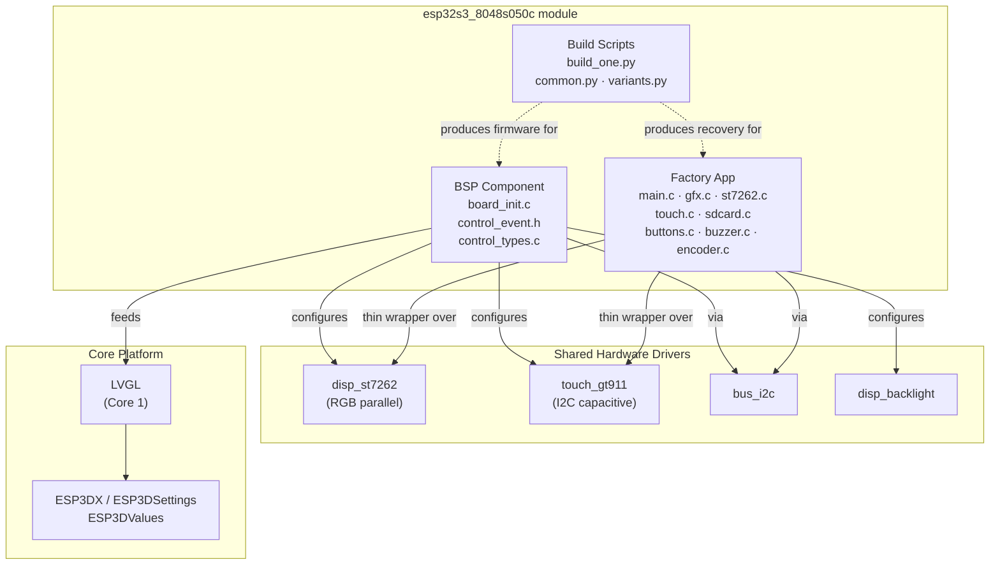
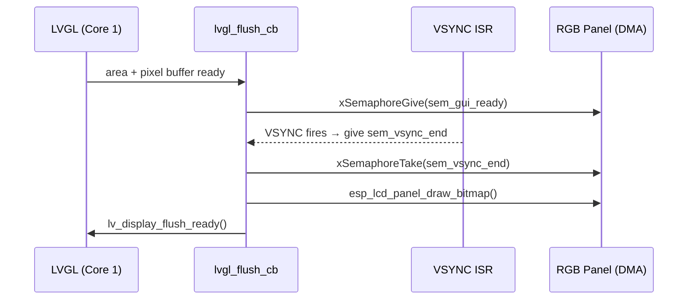
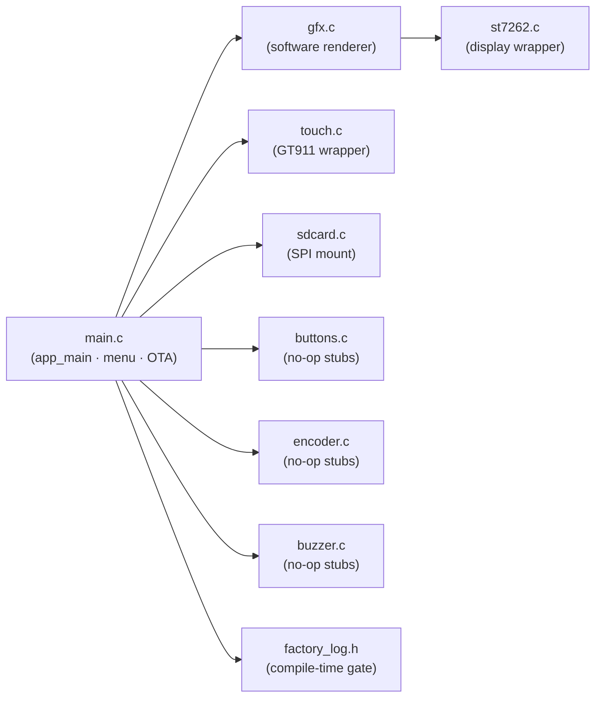
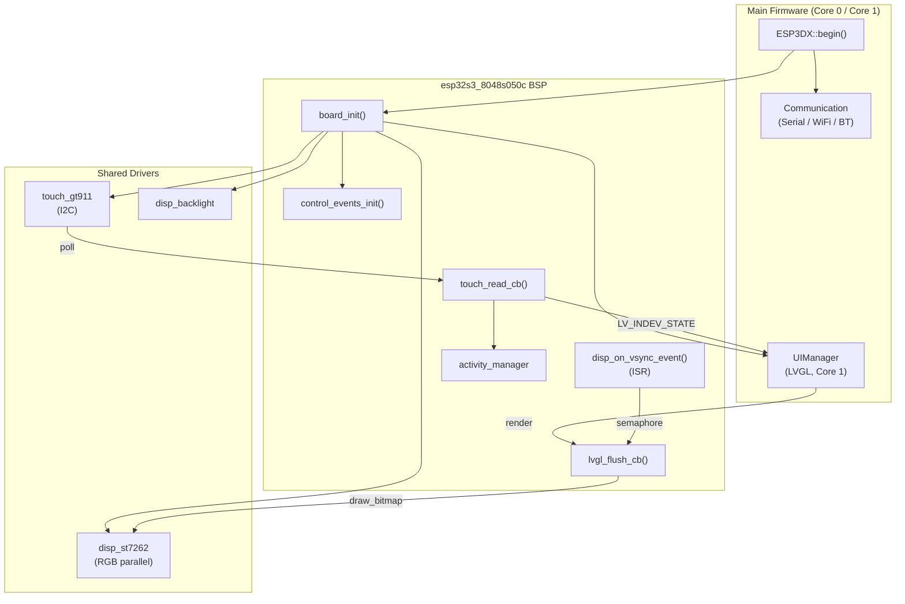

# ESP32S3-8048S050C Board Support Package

## Overview

The `esp32s3_8048s050c` module is the Board Support Package (BSP) for the **ESP32-S3 8048S050C** — a 5-inch, 800×480 capacitive-touch display board. It provides everything needed to run the ESP3D-TFT pendant firmware on this hardware:

- **BSP component** (`components/bsp/`) — hardware initialisation consumed by the main firmware (ST7262 RGB panel, GT911 touch, LVGL integration)
- **Factory / recovery app** (`Factory/`) — a self-contained recovery partition for OTA firmware and UI-resource flashing from SD card
- **Build scripts** (`build_scripts/`) — Python automation that defines all build variants and orchestrates the `idf.py` build pipeline

Within the larger [Board Support Packages](Board_Support_Packages.md) family this board shares the same factory-app structure and build-script conventions as the other RGB-parallel boards (`esp32s3_8048s043c`, `esp32s3_8048s070c`, `esp32s3_8048_touch_lcd_7`), and all hardware drivers are pulled from the shared [Hardware Peripheral Drivers](Hardware_Peripheral_Drivers.md) layer.

---

## Hardware Characteristics

| Property | Value |
|---|---|
| MCU | ESP32-S3 (Xtensa dual-core, 240 MHz) |
| Flash | 16 MB |
| PSRAM | Octal-SPI PSRAM (required for RGB framebuffer) |
| Display | 800 × 480, ST7262 RGB parallel (16-bit), native landscape |
| Display driver | `hardware/drivers_video_rgb/disp_st7262` |
| Touch controller | GT911, I2C capacitive |
| Touch driver | `hardware/common/drivers/touch_gt911` |
| Physical buttons | **None** (`BUTTON_n_PIN = GPIO_NUM_NC`) |
| Rotary encoder | **None** (`ENCODER_A/B_PIN = GPIO_NUM_NC`) |
| Buzzer | **None** (`BUZZER_PIN = GPIO_NUM_NC`) |
| SD card | SPI interface (`SDSPI`) |
| Recovery entry | Software-only (`[ESP444]FACTORY` command) — no boot-button hook |

> **Display orientation note:** The panel is native landscape (800 × 480). Unlike `esp32s3_4827s043c`, which is mounted rotated 90°, no `swap_xy`/`mirror` transform is needed. `DISP_ST7262_ORIENTATION_LANDSCAPE` is a pure passthrough.

---

## Architecture Overview



---

## Sub-Module Summary

### BSP Component — [`esp32s3_8048s050c_bsp.md`](esp32s3_8048s050c_bsp.md)

The runtime board layer consumed by the main firmware. Key responsibilities:

| Function | Description |
|---|---|
| `board_init()` | Top-level sequencer: backlight → ST7262 → GT911 → LVGL → control events |
| `lvgl_flush_cb()` | LVGL → RGB panel bridge; optionally writes snapshot pixels |
| `disp_on_vsync_event()` | ISR callback that synchronises flush with VSYNC (tearing prevention via semaphore pair) |
| `touch_read_cb()` | Polls GT911, rescales raw coordinates to display pixels, integrates activity manager |
| `bsp_accessFs()` / `bsp_releaseFs()` | Temporarily lowers pixel clock during SD/Flash access to prevent SPI-bus contention on the shared RGB parallel bus |
| `control_events_init()` | Registers custom LVGL event IDs (`LV_EVENT_SWITCH_PRESSED`, `LV_EVENT_SWITCH_RELEASED`, `LV_EVENT_POTENTIOMETER_CHANGED`) |

**LVGL integration pattern (tearing-free RGB flush):**



### Factory App — [`esp32s3_8048s050c_factory.md`](esp32s3_8048s050c_factory.md)

A self-contained recovery partition entered exclusively via the `[ESP444]FACTORY` software command from the main firmware (no custom bootloader — `ENABLE_CUSTOM_BOOT_LOADER` is OFF for this board).

**Recovery menu features:**
- Boot into `app0` or `app1` OTA partition
- Flash `esp3dfw.bin` from SD card to `app0` / `app1`
- Flash `ui_resources.bin` from SD card to the `ui_resources` partition
- Virtual on-screen navigation buttons (touch-only; physical BTN/encoder/buzzer pins are `GPIO_NUM_NC`)
- Optional GPIO0 snapshot capture (`ENABLE_SNAPSHOT`) for screen debugging

**OTA backup/restore protocol** — the main firmware backs up `otadata` to `0xB000` before switching boot partition; `restore_otadata_from_backup()` runs at the very start of `app_main()` so a power cycle from the recovery partition always returns to the correct OTA slot.

**Factory app layer diagram:**



### Build Scripts — [`esp32s3_8048s050c_build_scripts.md`](esp32s3_8048s050c_build_scripts.md)

Python scripts that wrap `idf.py` for all board variants.

**Defined variants:**

| Variant name | Transport | CNC firmware | Memory |
|---|---|---|---|
| `16mb_wifi_fluidnc` | WiFi + Serial | FluidNC | 16 MB |
| `16mb_serial_fluidnc` | Serial | FluidNC | 16 MB |
| `16mb_serial_grbl` | Serial | GRBL | 16 MB |
| `16mb_wifi_grblhal` | WiFi + Serial | grblHAL | 16 MB |
| `factory_16mb` | — | Recovery app | 16 MB |

Each `build_variant()` call:
1. Generates the `ui_resources` partition binary (`generate_resources.py`)
2. Runs `idf.py build` with the resolved CMake flags
3. Copies factory artifacts (bootloader, partition table) from `Factory/installer/`
4. Copies the `ui_resources_*.bin` into the installer directory
5. Packages the standalone `ui_resources_kit/` for end-users
6. Generates the flash map JSON (`flash_mgr.py`)

---

## Component Interaction Diagram



---

## Key Design Decisions

### RGB Parallel Display (ST7262)
Unlike SPI boards, the ST7262 uses a direct 16-bit RGB parallel bus. The driver keeps a persistent framebuffer in PSRAM (`fb_in_psram = true`) and `esp_lcd_panel_draw_bitmap()` copies partial tiles into it. This requires VSYNC synchronisation to prevent tearing on the single shared frame buffer — hence the `sem_vsync_end` / `sem_gui_ready` semaphore pair.

### Touch Coordinate Rescaling
The GT911 reports raw coordinates whose maximum values do **not** match the panel's 800×480 resolution (measured ~468×253 on real hardware). Both the BSP (`touch_read_cb`) and the factory app (`touch_read`) rescale via `touch_gt911_get_x_max()` / `get_y_max()` to map to display pixels.

### Filesystem Access Patch (`bsp_accessFs`)
Simultaneous RGB DMA and SD/Flash SPI access can cause bus contention. `bsp_accessFs()` drops the pixel clock to `DISPLAY_PATCH_FS_FREQ_HZ` for the duration of file operations; `bsp_releaseFs()` restores it. See `docs/guides/esp32_memory_constraints.md` for the fragmentation context.

### Touch-Only Input (No Physical Controls)
All physical input pins (`BUTTON_1_PIN`, `BUTTON_2_PIN`, `BUTTON_3_PIN`, `ENCODER_A_PIN`, `ENCODER_B_PIN`, `BUZZER_PIN`) are `GPIO_NUM_NC`. The factory app's button/encoder/buzzer drivers guard against invalid pins and are silent no-ops. Navigation is provided entirely by three on-screen virtual buttons rendered in the hint bar.

### No Custom Bootloader
Because this board has no accessible boot button, the recovery partition is entered only via the software command `[ESP444]FACTORY` from the main firmware. The main firmware backs up `otadata` before the switch, and `restore_otadata_from_backup()` at factory `app_main()` start ensures recovery from power loss.

---

## Directory Structure

```
boards/esp32s3_8048s050c/
├── Factory/
│   ├── CMakeLists.txt
│   └── main/
│       ├── main.c          # Recovery menu, OTA flashing, touch dispatch
│       ├── gfx.c / gfx.h   # Software framebuffer renderer
│       ├── st7262.c/.h      # RGB panel wrapper (factory-app standalone)
│       ├── touch.c / touch.h# GT911 minimal driver
│       ├── sdcard.c/.h      # SPI SD card mount
│       ├── buttons.c/.h     # Button stubs (GPIO_NUM_NC guards)
│       ├── buzzer.c/.h      # Buzzer stubs (GPIO_NUM_NC guards)
│       ├── encoder.c/.h     # Encoder stubs (GPIO_NUM_NC guards)
│       └── factory_log.h    # Compile-time debug gate
├── components/
│   └── bsp/
│       ├── board_init.c     # Main firmware BSP entry point
│       ├── board_init.h
│       ├── control_event.h  # control_event_t struct
│       └── control_types.c  # Custom LVGL event registration
├── build_scripts/
│   ├── build_one.py         # Build single variant
│   ├── common.py            # Build helpers, idf.py wrapper
│   └── variants.py          # Variant definitions (cmake flags)
└── board_config.cmake       # Resolution, pins, feature flags
```

---

## Related Modules

| Module | Relationship |
|---|---|
| [Hardware Peripheral Drivers](Hardware_Peripheral_Drivers.md) | Provides `disp_st7262`, `touch_gt911`, `bus_i2c`, `disp_backlight` |
| [Core Platform & Infrastructure](Core_Platform_and_Infrastructure.md) | `ESP3DX::begin()` calls `board_init()`; `esp3d_log` used throughout |
| [UI Framework & Screens](UI_Framework_and_Screens.md) | `UIManager` / LVGL runs on top of the BSP flush/touch callbacks |
| [Build & Development Tools](Build_and_Development_Tools.md) | `generate_resources.py`, `flash_mgr.py`, `package_user_resources_kit.py` called by `common.py` |
| [esp32s3_8048s043c](esp32s3_8048s043c.md) | Closest sibling — same RGB driver, same BSP structure, 4.3-inch panel |
| [esp32s3_8048s070c](esp32s3_8048s070c.md) | 7-inch variant sharing the same board structure |
