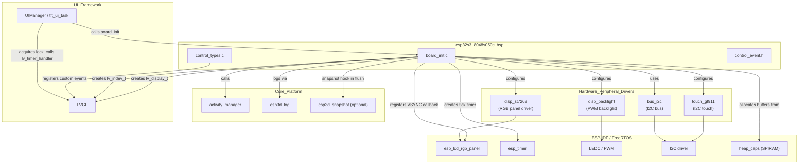
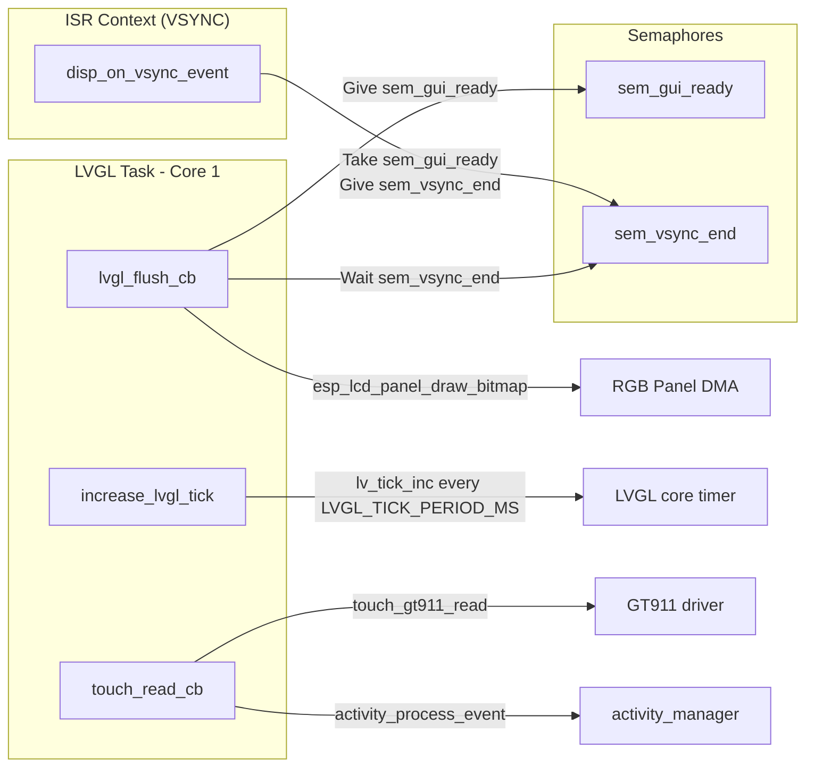
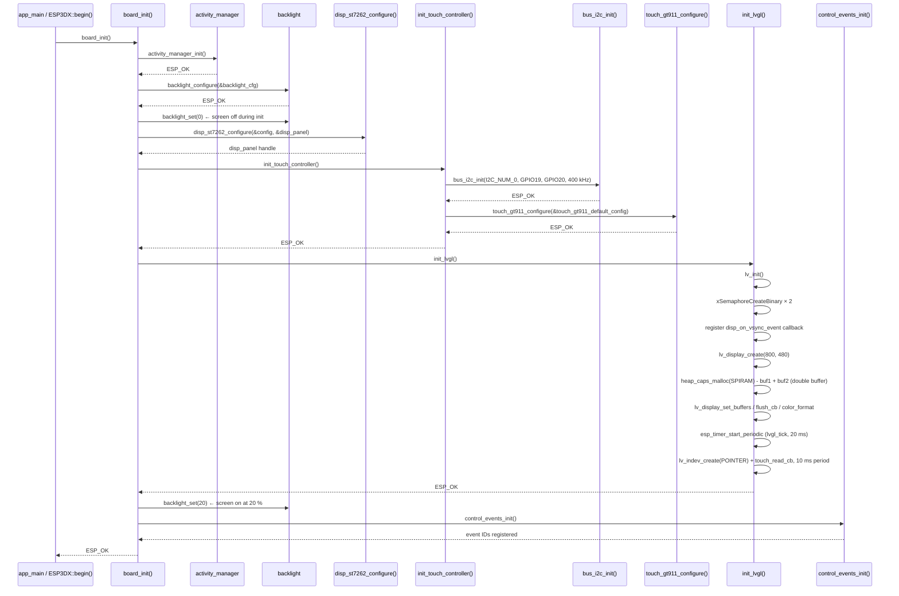
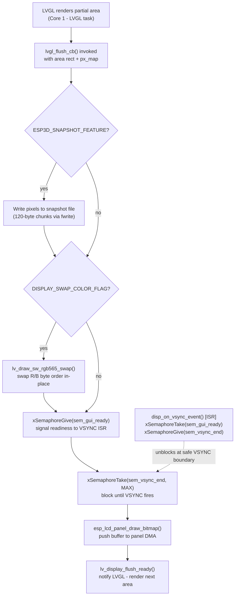

# ESP32S3-8048S050C Board Support Package (BSP)

The `esp32s3_8048s050c_bsp` module is the hardware abstraction layer for the **ESP32S3-8048S050C** board — a 5.0-inch 800 × 480 capacitive-touch display panel driven by an ST7262 controller over a 16-bit RGB parallel interface. It initialises every hardware peripheral needed by the pendant firmware, wires LVGL to the RGB panel and the GT911 touch controller, implements pixel-clock throttling for safe filesystem access, and registers board-specific custom control events consumed by the UI layer.

This board is the **800 × 480 (5.0-inch) sibling** of the 4.3-inch `esp32s3_8048s043c` and 7-inch `esp32s3_8048s070c` variants. It shares the same ST7262 RGB pipeline, VSYNC semaphore pattern, and `bsp_accessFs`/`bsp_releaseFs` filesystem-clock patch. SD card chip-select is routed through a **direct GPIO** (no IO expander), unlike the 7-inch `esp32s3_8048_touch_lcd_7` which uses a CH422G I²C expander. The parent board module is documented in [esp32s3_8048s050c](esp32s3_8048s050c.md).

---

## Table of Contents

1. [Module Overview](#1-module-overview)
2. [Hardware Specifications](#2-hardware-specifications)
3. [Architecture](#3-architecture)
4. [Component Breakdown](#4-component-breakdown)
   - [board_init.c](#41-board_initc)
   - [control_event.h](#42-control_eventh)
   - [control_types.c / control_types.h](#43-control_typesc--control_typesh)
   - [Configuration Headers](#44-configuration-headers)
5. [Initialization Flow](#5-initialization-flow)
6. [Display Subsystem](#6-display-subsystem)
   - [RGB Parallel Pipeline](#61-rgb-parallel-pipeline)
   - [VSYNC Synchronization](#62-vsync-synchronization)
   - [LVGL Draw Buffers](#63-lvgl-draw-buffers)
   - [Snapshot Support](#64-snapshot-support)
7. [Touch Subsystem](#7-touch-subsystem)
   - [GT911 Configuration](#71-gt911-configuration)
   - [Touch Callback and Activity Manager](#72-touch-callback-and-activity-manager)
8. [Filesystem Access Pixel-Clock Patch](#8-filesystem-access-pixel-clock-patch)
9. [Custom Control Events](#9-custom-control-events)
10. [Public API](#10-public-api)
11. [Compile-Time Feature Flags](#11-compile-time-feature-flags)
12. [Build Variants](#12-build-variants)
13. [Sibling Modules and References](#13-sibling-modules-and-references)

---

## 1. Module Overview

| Item | Value |
|------|-------|
| **Board name** | `ESP32S3-8048S050C` |
| **Board version** | v1.0 |
| **MCU** | ESP32-S3 |
| **Display** | ST7262, 16-bit RGB565 parallel, 800 × 480 px, 5.0 inch |
| **Touch** | Goodix GT911, capacitive, I²C |
| **IO Expander** | None — SD card CS routed via direct GPIO |
| **Physical controls** | None (encoder, buttons, switch, potentiometer are all NC) |
| **Source directory** | `boards/esp32s3_8048s050c/components/bsp/` |
| **Key source files** | `board_init.c`, `control_types.c` |
| **Key header files** | `board_init.h`, `board_config.h`, `control_event.h`, `control_types.h`, `tasks_def.h`, `disp_st7262_def.h`, `touch_gt911_def.h`, `disp_backlight_def.h` |

The BSP is the **only** place in the firmware where hardware I/O details live for this board. The rest of the firmware (UI, GCode host, communication transports) is hardware-agnostic and addresses the board solely through the public API exposed by `board_init.h` and the LVGL handles returned by this module.

---

## 2. Hardware Specifications

### Display

| Parameter | Value |
|-----------|-------|
| Controller | ST7262 (RGB parallel) |
| Interface | 16-bit RGB565 parallel (no SPI) |
| Physical size | 5.0 inch |
| Resolution | 800 × 480 px |
| Pixel clock (normal) | 13 MHz (`DISPLAY_PCLK_FREQ_HZ`) |
| Pixel clock (FS access) | 6 MHz (`DISPLAY_PATCH_FS_FREQ_HZ`) |
| Color format | RGB565 |
| Byte swap | No (`DISPLAY_SWAP_COLOR_FLAG = 0`) — direct parallel wiring needs no swap |
| Frame buffer location | PSRAM (`fb_in_psram = true`) |
| LVGL draw buffer | Double buffer, allocated in SPIRAM (`MALLOC_CAP_SPIRAM`) |
| LVGL render mode | `LV_DISPLAY_RENDER_MODE_PARTIAL` |

### Display GPIO Pinout

| Signal | GPIO |
|--------|------|
| HSYNC | 39 |
| VSYNC | 41 |
| DE | 40 |
| PCLK | 42 |
| EN | NC |
| D0 (B0) | 8 |
| D1 (B1) | 3 |
| D2 (B2) | 46 |
| D3 (B3) | 9 |
| D4 (B4) | 1 |
| D5 (G0) | 5 |
| D6 (G1) | 6 |
| D7 (G2) | 7 |
| D8 (G3) | 15 |
| D9 (G4) | 16 |
| D10 (G5) | 4 |
| D11 (R0) | 45 |
| D12 (R1) | 48 |
| D13 (R2) | 47 |
| D14 (R3) | 21 |
| D15 (R4) | 14 |

### Backlight

| Parameter | Value |
|-----------|-------|
| GPIO | 2 |
| Control | PWM (LEDC), active-high |
| PWM frequency | 5 kHz |
| PWM resolution | 8-bit |
| LEDC timer / channel | 0 / 0 |
| Default level | 20 % |
| Startup sequence | Set to 0 before display init; restored to 20 % after LVGL init |

### Touch Controller

| Parameter | Value |
|-----------|-------|
| Controller | GT911 (capacitive) |
| Interface | I²C (I2C_NUM_0) |
| SDA / SCL | GPIO 19 / GPIO 20 |
| Bus frequency | 400 kHz |
| Reset pin | GPIO 38 |
| IRQ pin | NC by default; GPIO 18 when `HARDWARE_MOD_GT911_INT` is set |
| I²C addresses probed | 0x5D, 0x14 |
| Axis max | Auto-detected from device registers |
| Read interval | 10 ms (LVGL indev timer period) |
| Coordinate mapping | `raw_x × DISPLAY_WIDTH_PX / gt911_get_x_max()` |

### UART (CNC serial link)

| Parameter | Value |
|-----------|-------|
| Port | UART_NUM_0 |
| TX / RX | GPIO 43 / GPIO 44 |
| Baud rate | 115 200 |
| Configuration | 8N1, no flow control |

### SD Card

| Parameter | Value |
|-----------|-------|
| Interface | SPI (SPI2_HOST) |
| MISO / MOSI / CLK / CS | GPIO 13 / 11 / 12 / 10 |
| Speed | 20 MHz |
| Detect pin | NC |

### Physical Controls

All physical control GPIOs are `GPIO_NUM_NC`. There are no physical buttons, encoder, switch, or potentiometer on this board. The control events framework is retained so upper UI layers (shared across all boards) compile without modification, and all non-touch input is emulated through the touch UI.

---

## 3. Architecture

### High-Level Module Relationships



### Internal BSP Data Flow



---

## 4. Component Breakdown

### 4.1 `board_init.c`

The central initialisation source file. Contains all module-level state variables and all callback functions needed to drive LVGL on this board.

#### Module-Level State

| Variable | Type | Purpose |
|----------|------|---------|
| `lvgl_api_lock` | `_lock_t` | Mutex protecting LVGL API calls from concurrent access |
| `lvgl_display` | `lv_display_t *` | LVGL display handle |
| `lvgl_buf1` | `lv_color16_t *` | Primary LVGL draw buffer (SPIRAM) |
| `lvgl_buf2` | `lv_color16_t *` | Secondary draw buffer (SPIRAM, double-buffer mode) |
| `lvgl_tick_timer` | `esp_timer_handle_t` | Periodic timer driving `lv_tick_inc()` |
| `touch_indev` | `lv_indev_t *` | LVGL input device handle for the GT911 |
| `disp_panel` | `esp_lcd_panel_handle_t` | ESP-LCD RGB panel handle |
| `sem_vsync_end` | `SemaphoreHandle_t` | Binary semaphore: VSYNC ISR releases the flush pipeline |
| `sem_gui_ready` | `SemaphoreHandle_t` | Binary semaphore: flush signals readiness to the VSYNC ISR |

#### Functions

| Function | Scope | Description |
|----------|-------|-------------|
| `board_init()` | Public | Top-level entry: initialises activity manager, backlight, ST7262, I²C bus, GT911, LVGL, and control events |
| `init_lvgl()` | Static | Creates LVGL display, allocates SPIRAM draw buffers, registers flush callback, starts tick timer, creates touch `indev` |
| `init_touch_controller()` | Static | Initialises I²C bus, then configures GT911 |
| `lvgl_flush_cb()` | Static | LVGL flush callback: optional snapshot write → optional colour swap → VSYNC sync → `draw_bitmap` → `flush_ready` |
| `disp_on_vsync_event()` | Static (ISR) | RGB panel VSYNC ISR — synchronises with `lvgl_flush_cb` via the semaphore pair |
| `touch_read_cb()` | Static | LVGL `indev` read callback — reads GT911, maps coordinates, handles wake-up touch suppression |
| `increase_lvgl_tick()` | Static | `esp_timer` callback — calls `lv_tick_inc(LVGL_TICK_PERIOD_MS)` |
| `bsp_accessFs()` | Public (conditional) | Reduces pixel clock to `DISPLAY_PATCH_FS_FREQ_HZ` before flash/SD I/O |
| `bsp_releaseFs()` | Public (conditional) | Restores pixel clock to `DISPLAY_PCLK_FREQ_HZ` after flash/SD I/O |
| `get_lvgl_display()` | Public | Returns `lvgl_display` handle for use by `ESP3DXUi` |
| `get_lvgl_lock()` | Public | Returns `&lvgl_api_lock` for thread-safe LVGL access |
| `get_touch_indev()` | Public | Returns `touch_indev` handle |
| `board_get_name()` | Public | Returns `"ESP32S3-8048S050C"` |
| `board_get_version()` | Public | Returns `"v1.0"` |

### 4.2 `control_event.h`

Defines the `control_event_t` structure — the common payload dispatched through the LVGL event system for all hardware input events on this board.

```c
typedef struct {
    lv_indev_t        *indev;           // LVGL input device that generated the event
    uint32_t           btn_id;          // Button / control index
    lv_indev_type_t    type;            // LVGL indev type (pointer, button, encoder…)
    control_family_t   family_id;       // Which hardware family generated the event
    int32_t            steps;           // Encoder step count (signed)
    uint32_t           press_duration;  // How long the control was held (ms)
} control_event_t;
```

Because all physical control GPIOs are `GPIO_NUM_NC` on this board, events with non-touch family IDs are only generated by emulated virtual controls in the upper UI layer. Screens receive `control_event_t *` via `lv_event_get_param()`.

### 4.3 `control_types.c` / `control_types.h`

Declares and registers three custom LVGL event codes beyond the built-in set. These are assigned real IDs by `lv_event_register_id()` inside `control_events_init()`, which `board_init()` calls at the tail of its sequence — after `lv_init()` has run inside `init_lvgl()`.

**`control_family_t` enum** (in `control_types.h`):

| Value | Description |
|-------|-------------|
| `CONTROL_FAMILY_BUTTONS` | Physical buttons (3, all NC on this board) |
| `CONTROL_FAMILY_SWITCH` | 4-position switch (NC on this board) |
| `CONTROL_FAMILY_TOUCH` | Touchscreen |
| `CONTROL_FAMILY_ENCODER` | Rotary encoder (NC on this board) |
| `CONTROL_FAMILY_POTENTIOMETER` | Potentiometer (NC on this board) |

**Custom LVGL event codes**:

| Event | Purpose |
|-------|---------|
| `LV_EVENT_SWITCH_PRESSED` | Physical 4-position switch moved to a new position |
| `LV_EVENT_SWITCH_RELEASED` | Physical 4-position switch released |
| `LV_EVENT_POTENTIOMETER_CHANGED` | Analog potentiometer value changed |

All three are initialised to the sentinel `LV_EVENT_ALL` at file scope and receive valid IDs only after `control_events_init()` runs. Calling it before `lv_init()` would cause all three IDs to collide at `LV_EVENT_ALL`.

### 4.4 Configuration Headers

All hardware constants are separated into dedicated `*_def.h` headers so that `board_init.c` remains free of magic numbers.

| Header | Contents |
|--------|---------|
| `board_config.h` | All GPIO assignments, pixel clock frequencies, display resolution, I²C pins and frequency, SD pins — single authoritative pin-map for this board |
| `tasks_def.h` | FreeRTOS task stack sizes, core affinities, priorities, `LVGL_TICK_PERIOD_MS` |
| `disp_st7262_def.h` | Complete `disp_st7262_config_t` wired from `board_config.h`, including RGB timing parameters |
| `touch_gt911_def.h` | Complete `touch_gt911_config_t` wired from `board_config.h`, including axis swap/mirror flags |
| `disp_backlight_def.h` | `backlight_config_t` wired from `board_config.h`, PWM timer/channel/frequency/resolution |

---

## 5. Initialization Flow



**Failure handling:** Every sub-step returns `esp_err_t`. `board_init()` returns on the first non-`ESP_OK` result and logs the failing subsystem via `esp3d_log_e`. LVGL semaphore and buffer allocations are individually checked — if `lvgl_buf1` allocation succeeds but `lvgl_buf2` fails, `lvgl_buf1` is freed before returning `ESP_ERR_NO_MEM`.

---

## 6. Display Subsystem

### 6.1 RGB Parallel Pipeline

The ST7262 panel is driven over the ESP32-S3 RGB parallel interface (`esp_lcd_rgb_panel`). Unlike SPI panels, the RGB DMA engine streams pixel data continuously from a framebuffer in PSRAM. The full pipeline from LVGL rendering to panel output is:



On this board `DISPLAY_SWAP_COLOR_FLAG = 0` — the RGB565 byte order matches the ST7262's native expectation over the parallel bus, so no swap is performed in the hot path.

### 6.2 VSYNC Synchronization

RGB panels on the ESP32-S3 stream pixel data from a single shared framebuffer. If LVGL writes new pixel data while a scanline is being output, tearing is visible. The BSP avoids this with a binary semaphore pair:

| Semaphore | Direction | Role |
|-----------|-----------|------|
| `sem_gui_ready` | flush → ISR | Signals that the LVGL buffer contains new data ready for DMA transfer |
| `sem_vsync_end` | ISR → flush | Signals that the VSYNC blanking window has opened — safe to transfer |

`lvgl_flush_cb` gives `sem_gui_ready` and then blocks on `sem_vsync_end` with `portMAX_DELAY`. The VSYNC ISR (`disp_on_vsync_event`) takes `sem_gui_ready` (non-blocking — returns `pdFALSE` if no frame is pending) and gives `sem_vsync_end` to unblock the flush. The ISR returns `high_task_awoken` so the FreeRTOS scheduler performs an immediate context switch if the unblocked task has higher priority.

Both semaphores are allocated in `init_lvgl()` before registering the VSYNC callback. If either allocation fails, `init_lvgl()` returns immediately without registering any callback.

### 6.3 LVGL Draw Buffers

| Parameter | Value |
|-----------|-------|
| Count | 2 (double buffer, `DISPLAY_USE_DOUBLE_BUFFER_FLAG = 1`) |
| Lines per buffer | 1/4 screen height (`DISPLAY_BUF_LINES_DIVIDER = 4`) → 120 lines |
| Size per buffer | 800 × 120 × 2 bytes = **192 000 bytes (~187 KB)** |
| Allocation | `heap_caps_malloc(MALLOC_CAP_SPIRAM)` |
| Render mode | `LV_DISPLAY_RENDER_MODE_PARTIAL` |
| Color format | `LV_COLOR_FORMAT_RGB565` |

Both buffers are passed to `lv_display_set_buffers()`. In double-buffer mode LVGL can render the next partial area into `lvgl_buf2` while `lvgl_buf1` is being flushed, improving throughput.

If `lvgl_buf2` allocation fails, `lvgl_buf1` is freed and `init_lvgl()` returns `ESP_ERR_NO_MEM` — no partial fallback to single-buffer mode occurs.

### 6.4 Snapshot Support

When `ESP3D_SNAPSHOT_FEATURE` is enabled, `lvgl_flush_cb` intercepts each partial render flush. Under `g_snapshot.mutex`:

1. Pixel bytes are written to `g_snapshot.file` in 120-byte chunks using `fwrite`.
2. `g_snapshot.captured_pixels` is incremented by the area's pixel count.
3. When `captured_pixels >= expected_pixels`, `g_snapshot.ongoing` is cleared to stop capture.
4. Any `fwrite` short-write or `ferror()` sets `g_snapshot.error = true` and clears `g_snapshot.ongoing`.

The mutex is taken with timeout 0 (`xSemaphoreTake(..., 0)`) — if it cannot be acquired immediately, the snapshot write for that flush is skipped silently rather than blocking the LVGL task.

---

## 7. Touch Subsystem

### 7.1 GT911 Configuration

The GT911 is configured via `touch_gt911_configure()` using the `touch_gt911_default_config` instance defined in `touch_gt911_def.h`:

| Field | Value | Notes |
|-------|-------|-------|
| `i2c_addr` | `{0x5D, 0x14, 0}` | Both addresses probed; floating INT pin can cause 0x14 enumeration |
| `i2c_port` | `I2C_NUM_0` | Shared I²C bus (no other I²C devices on this board) |
| `i2c_clk_speed` | 400 kHz | |
| `rst_pin` | GPIO 38 | |
| `int_pin` | NC (GPIO 18 with `HARDWARE_MOD_GT911_INT`) | Polled mode by default |
| `swap_xy` | 0 | No axis swap |
| `invert_x` | 0 | No X mirror |
| `invert_y` | 0 | No Y mirror |
| `x_max` / `y_max` | 0 | Auto-detected from GT911 device registers |

The dual-address probe list `{0x5D, 0x14, 0}` handles hardware revisions where the INT pull-up resistor is absent, causing the GT911 to enumerate at 0x14 instead of the default 0x5D. Without both addresses the driver would silently fail on affected units.

### 7.2 Touch Callback and Activity Manager

`touch_read_cb` is registered as the LVGL pointer `indev` read callback, polled every 10 ms. It implements wake-up touch suppression so that the first touch after a screen-off period wakes the display without forwarding the touch to any UI widget.

#### Wake-Up Suppression State Machine

```
Static state: last_pressed_state, touch_consumed_for_wakeup, last_x/y

New press detected (touch_data.is_pressed && !last_pressed_state):
  ├── activity_process_event() returns true  (screen was already active)
  │     touch_consumed_for_wakeup = false
  │     data->state = LV_INDEV_STATE_PRESSED  ← forwarded to LVGL
  └── activity_process_event() returns false  (screen was sleeping → now woken)
        touch_consumed_for_wakeup = true
        data->state = LV_INDEV_STATE_RELEASED ← suppressed

Continued press (touch_data.is_pressed && last_pressed_state):
  ├── !touch_consumed_for_wakeup → PRESSED, coordinates updated
  └──  touch_consumed_for_wakeup → RELEASED (still suppressed)

Release detected (!touch_data.is_pressed && last_pressed_state):
  ├── touch_consumed_for_wakeup == true
  │     → clear flag, do not forward release to LVGL
  └── touch_consumed_for_wakeup == false
        → activity_process_event() to refresh timeout, log "Touch released"
  last_pressed_state = false
  data->state = LV_INDEV_STATE_RELEASED
```

This guarantees that a wake-up touch is never forwarded to a UI widget, preventing accidental activation of whatever element happens to be under the user's finger when the screen turns back on.

---

## 8. Filesystem Access Pixel-Clock Patch

The ESP32-S3's internal memory bus is shared between the RGB LCD DMA engine and PSRAM/flash access. When the pixel clock is running at full speed (13 MHz), concurrent flash or SD reads can produce visible tearing or pixel-shift artefacts on the panel.

This patch is enabled by the `ESP3D_PATCH_FS_ACCESS_RELEASE` compile flag and has been confirmed necessary on all RGB-parallel boards in this repository that use PSRAM-backed frame buffers.

### Mechanism

```
Flash/SD access begins
  → bsp_accessFs()
       esp_lcd_rgb_panel_set_pclk(disp_panel, 6 MHz)
       vTaskDelay(40 ms)   ← allow panel to settle at new clock

… flash/SD read or write …

  → bsp_releaseFs()
       esp_lcd_rgb_panel_set_pclk(disp_panel, 13 MHz)
       vTaskDelay(40 ms)   ← allow panel to settle at normal clock
Flash/SD access complete
```

The 40 ms delay (`DISPLAY_PATCH_FS_DELAY_MS`) allows the RGB panel to re-lock its internal phase-locked loop and the DMA to stabilise before the next render flush.

If `disp_panel == NULL` (before `board_init()` completes), both functions return `ESP_OK` immediately — no crash during early-boot filesystem access.

Called from:
- `ESP3DFlash::accessFS()` / `ESP3DFlash::releaseFS()`
- `ESP3DSd::accessFS()` / `ESP3DSd::releaseFS()`

See also: [esp32_memory_constraints.md](https://github.com/luc-github/Pibot-cnc-pendant-firmware/blob/main/docs/guides/esp32_memory_constraints.md) — *Serial CNC + WiFi remote — fragmentation playbook*.

---

## 9. Custom Control Events

### `control_event_t` structure

```c
typedef struct {
    lv_indev_t        *indev;           // LVGL input device that generated the event
    uint32_t           btn_id;          // Button / control index
    lv_indev_type_t    type;            // LVGL indev type (pointer, button, encoder…)
    control_family_t   family_id;       // Hardware family identifier
    int32_t            steps;           // Encoder step delta (signed)
    uint32_t           press_duration;  // Hold duration in milliseconds
} control_event_t;
```

This structure is passed as the `param` of custom LVGL events. UI screens retrieve it with `lv_event_get_param()`. See [bsp_control_events.md](bsp_control_events.md) for the cross-board description of the event dispatch model.

### Custom Event Registration

`control_events_init()` calls `lv_event_register_id()` three times to obtain runtime-assigned event codes:

```c
LV_EVENT_SWITCH_PRESSED       = lv_event_register_id();
LV_EVENT_SWITCH_RELEASED      = lv_event_register_id();
LV_EVENT_POTENTIOMETER_CHANGED = lv_event_register_id();
```

These IDs are `extern`-declared in `control_types.h` so any translation unit can `lv_obj_add_event_cb()` for them. The IDs are only valid after `control_events_init()` runs. On this board they are never fired (no physical switch or potentiometer), but they must be registered to keep upper-layer code that references them from crashing.

---

## 10. Public API

All declarations are in `board_init.h`.

```c
/* Always available */
esp_err_t    board_init(void);
const char  *board_get_name(void);
const char  *board_get_version(void);

/* Requires ESP3D_PATCH_FS_ACCESS_RELEASE */
esp_err_t    bsp_accessFs(void);
esp_err_t    bsp_releaseFs(void);

/* Requires ESP3D_DISPLAY_FEATURE */
lv_display_t *get_lvgl_display(void);
_lock_t      *get_lvgl_lock(void);

/* Requires ESP3D_DISPLAY_FEATURE && ESP3D_TOUCH_FEATURE */
lv_indev_t   *get_touch_indev(void);
```

### Thread Safety

`get_lvgl_lock()` returns a pointer to `lvgl_api_lock`, a `_lock_t` (newlib recursive mutex). The UI framework acquires this lock around every `lv_timer_handler()` call. Any task that calls LVGL API functions outside of the LVGL task **must** hold this lock.

---

## 11. Compile-Time Feature Flags

| Flag | Effect when enabled |
|------|---------------------|
| `ESP3D_DISPLAY_FEATURE` | Compiles in display, LVGL, backlight, and draw-buffer code |
| `ESP3D_TOUCH_FEATURE` | Compiles in `init_touch_controller()`, `touch_read_cb`, `get_touch_indev()` |
| `ESP3D_BRIGHTNESS_CONTROL_FEATURE` | Includes `backlight_configure()` / `backlight_set()` calls |
| `ESP3D_PATCH_FS_ACCESS_RELEASE` | Includes `bsp_accessFs()` / `bsp_releaseFs()` |
| `ESP3D_SNAPSHOT_FEATURE` | Includes snapshot pixel-capture code inside `lvgl_flush_cb()` |
| `HARDWARE_MOD_GT911_INT` | Routes GT911 IRQ to GPIO 18 instead of leaving it NC |

---

## 12. Build Variants

Defined in `boards/esp32s3_8048s050c/build_scripts/variants.py`. All variants use 16 MB flash, enable `TFT_UI_SERVICE` and `TFT_TOUCH_SERVICE`.

| Variant | CNC firmware | Transport | Extra features |
|---------|-------------|-----------|----------------|
| `16mb_wifi_fluidnc` | FluidNC | Serial + WiFi (`SOCKET_CLIENT_SERVICE`) | mDNS, Lua |
| `16mb_serial_fluidnc` | FluidNC | Serial only | — |
| `16mb_serial_grbl` | grbl | Serial only | — |
| `16mb_wifi_grblhal` | grblHAL | Serial + WiFi (`SOCKET_CLIENT_SERVICE`) | mDNS, Lua |

**Factory variant:** `factory_16mb` — built from `boards/esp32s3_8048s050c/Factory/`. See [esp32s3_8048s050c_factory.md](esp32s3_8048s050c_factory.md).

WiFi variants enable `SOCKET_CLIENT_SERVICE`. Per `cmake/sanity_check.cmake`, this automatically disables `SSDP_SERVICE`, `WEBUI_SERVER`, `WS_SERVER_SERVICE`, and `WS_CLIENT_SERVICE` (two CNC-over-WiFi links are forbidden). See [feature_resource_matrix.md](https://github.com/luc-github/Pibot-cnc-pendant-firmware/blob/main/docs/features/feature_resource_matrix.md) §2–§4.

To build a single variant:

```bash
python3 boards/esp32s3_8048s050c/build_scripts/build_one.py 16mb_serial_fluidnc
```

---

## 13. Sibling Modules and References

### Same RGB-Parallel Architecture

| Module | Display | Difference from this board |
|--------|---------|---------------------------|
| [esp32s3_8048s043c_bsp](esp32s3_8048s043c_bsp.md) | ST7262, 4.3 in, 800×480 | Identical BSP pattern, different physical size |
| [esp32s3_8048s070c_bsp](esp32s3_8048s070c_bsp.md) | ST7262, 7.0 in, 800×480 | Identical BSP pattern, different physical size |
| [esp32s3_8048_touch_lcd_7_bsp](esp32s3_8048_touch_lcd_7_bsp.md) | RGB parallel, 7.0 in | SD card CS via CH422G I²C IO expander (adds `bsp_accessFs` CH422G step) |

### Different Display Interface

| Module | Display interface | Touch |
|--------|-------------------|-------|
| [esp32s3_4827s043c_bsp](esp32s3_4827s043c_bsp.md) | RGB parallel, 480×272 | GT911 (no FS-clock patch needed at that resolution) |
| [esp32s3_bzm_tft35_gt911_bsp](esp32s3_bzm_tft35_gt911_bsp.md) | SPI (ST7796) | GT911 |
| [esp32s3_hmi43v3_bsp](esp32s3_hmi43v3_bsp.md) | I80 (RM68120) | — |
| [pibot_pendant_v1_0_bsp](pibot_pendant_v1_0_bsp.md) | SPI (ILI9341) | XPT2046 resistive + encoder + buttons |

### Hardware Drivers Used

- [display_drivers_rgb](bsp_display_drivers_rgb.md) — `disp_st7262` driver
- [touch_controllers](bsp_touch_controllers.md) — `touch_gt911` driver
- [bus_drivers](bsp_bus_drivers.md) — `bus_i2c`
- [bsp_board_initialization_display](bsp_board_initialization_display.md) — cross-board display init patterns
- [bsp_board_initialization_touch](bsp_board_initialization_touch.md) — cross-board touch init patterns
- [bsp_control_events](bsp_control_events.md) — cross-board control event model

### Documentation

- [esp32_memory_constraints.md](https://github.com/luc-github/Pibot-cnc-pendant-firmware/blob/main/docs/guides/esp32_memory_constraints.md) — heap fragmentation, WiFi vs BT RAM, FS-clock patch rationale
- [display_drivers.md](https://github.com/luc-github/Pibot-cnc-pendant-firmware/blob/main/docs/architecture/display_drivers.md) — SPI vs RGB-parallel driver architecture, rotation/swap semantics
- [feature_resource_matrix.md](https://github.com/luc-github/Pibot-cnc-pendant-firmware/blob/main/docs/features/feature_resource_matrix.md) — feature compatibility and WiFi/CNC usage model
