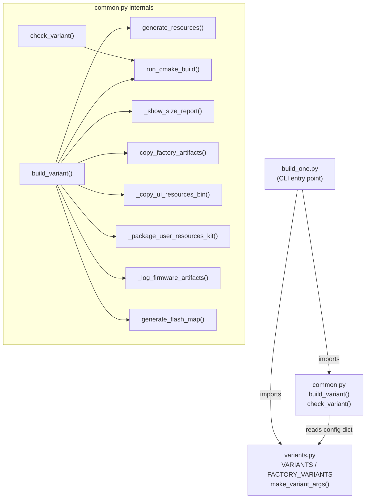
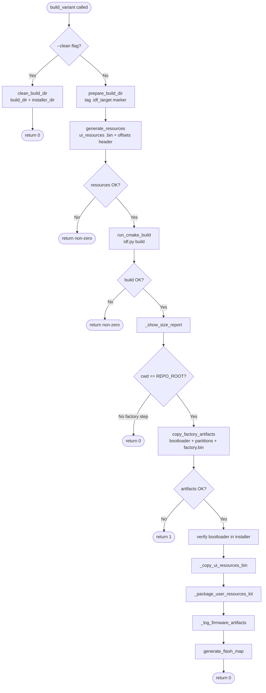
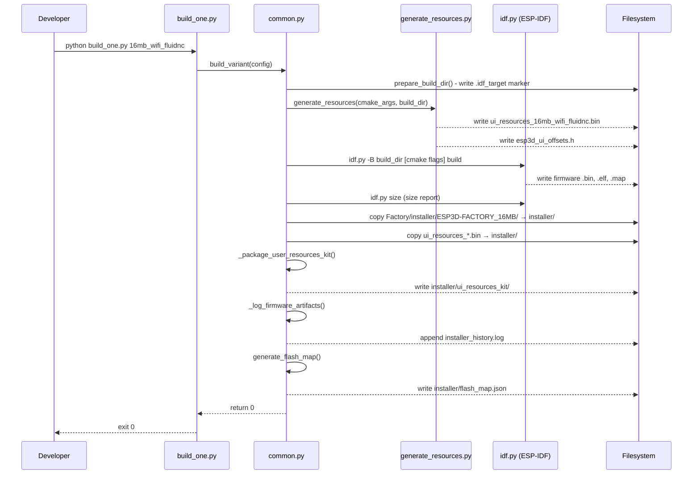
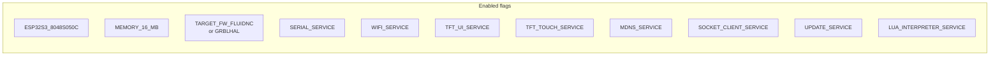

# ESP32S3-8048S050C Build Scripts

## Introduction

The `esp32s3_8048s050c_build_scripts` module provides the Python-based build automation for the **ESP32S3-8048S050C** board — a 5-inch 800×480 capacitive-touch display panel driven by a RGB parallel interface (ST7262 controller). It is one of the largest-display boards in the pendant family and uses the same three-script pattern shared by every board in `boards/`:

| File | Purpose |
|---|---|
| `variants.py` | Declares all buildable configurations as named dictionaries |
| `common.py` | Implements the full build pipeline that every variant runs through |
| `build_one.py` | CLI entry point: selects a single variant and dispatches to `common.py` |

This module operates on the **repository root** (for production firmware) and on `boards/esp32s3_8048s050c/Factory/` (for the factory recovery image). It produces self-contained installer directories consumed by the flash toolchain.

---

## Module Architecture



---

## Directory Layout

```
boards/esp32s3_8048s050c/
├── build_scripts/              ← this module
│   ├── build_one.py
│   ├── common.py
│   └── variants.py
│
├── Factory/                    ← see esp32s3_8048s050c_factory.md
│   ├── build/                  (factory build artefacts, git-ignored)
│   └── installer/
│       └── ESP3D-FACTORY_16MB/ (bootloader, partition table, factory .bin)
│
├── components/bsp/             ← see esp32s3_8048s050c_bsp.md
├── partitions_16mb.csv         (partition table referenced during resource gen)
└── resources/                  (optional board-specific UI overrides)

build/                          ← repo-root build tree (git-ignored)
└── esp32s3_8048s050c_<variant>/

installer/                      ← release artefacts (git-ignored)
└── ESP32S3_8048S050C_16MB_<radio>_<fw>/
    ├── bootloader_16MB.bin     (from factory)
    ├── partitions_16MB.bin     (from factory)
    ├── factory_16MB.bin        (from factory)
    ├── <firmware>.bin          (from main build)
    ├── ui_resources_<v>.bin    (from generate_resources)
    ├── ui_resources_kit/       (standalone user-customisation kit)
    ├── flash_map.json          (from flash_mgr)
    └── installer_history.log
```

---

## Component Reference

### `variants.py` — Build Variant Definitions

#### `make_variant_args(*on_flags) → list[str]`

The factory function for CMake argument lists. It starts by turning **every** known CMake option `OFF` (via `DEFAULT_OFF_CMAKE_ARGS`, built from `ROOT_CMAKE_OPTIONS`) and then selectively re-enables only the flags passed as arguments.

```python
DEFAULT_OFF_CMAKE_ARGS = []
for option in ROOT_CMAKE_OPTIONS:
    DEFAULT_OFF_CMAKE_ARGS.extend(["-D", f"{option}=OFF"])

def make_variant_args(*on_flags):
    args = DEFAULT_OFF_CMAKE_ARGS.copy()
    for flag in on_flags:
        args.extend(["-D", flag])
    return args
```

This "whitelist" approach guarantees that stale cached values from a previous build of a different board or configuration can never bleed into the current build.

#### `ROOT_CMAKE_OPTIONS`

The exhaustive list of mutually-exclusive and additive CMake boolean options that `make_variant_args` resets. They map directly to `OPTION()` declarations in the project's top-level `CMakeLists.txt`.

| Category | Options |
|---|---|
| **Board select** | `ESP32S3_8048S050C`, `ESP32S3_8048S043C`, `ESP32S3_8048S070C`, `ESP32S3_4827S043C`, `ESP32S3_8048_TOUCH_LCD_7`, `ESP32_PIBOT_CNC_PENDANT_V1`, … (all boards) |
| **Flash memory** | `MEMORY_4_MB`, `MEMORY_8_MB`, `MEMORY_16_MB` |
| **PSRAM** | `PSRAM_NONE`, `PSRAM_2_MB`, `PSRAM_4_MB`, `PSRAM_8_MB` |
| **Firmware target** | `TARGET_FW_FLUIDNC`, `TARGET_FW_GRBLHAL`, `TARGET_FW_GRBL`, `TARGET_FW_MARLIN`, `TARGET_FW_REPETIER`, `TARGET_FW_SMOOTHIEWARE`, `TARGET_FW_NONE` |
| **Transport** | `SERIAL_SERVICE`, `UART_EXT_SERVICE`, `USB_SERIAL_SERVICE`, `WIFI_SERVICE`, `BT_SERVICE`, `BT_SERIAL_SERVICE`, `BT_BLE_SERVICE`, `SOCKET_CLIENT_SERVICE`, `SOCKET_SERVER_SERVICE` |
| **Services** | `TFT_UI_SERVICE`, `TFT_TOUCH_SERVICE`, `SD_CARD_SERVICE`, `BUZZER_SERVICE`, `LUA_INTERPRETER_SERVICE`, `MDNS_SERVICE`, `SSDP_SERVICE`, `TIME_SERVICE`, `UPDATE_SERVICE`, `NOTIFICATIONS_SERVICE`, `CAMERA_SERVICE` |
| **Web / Auth** | `WEB_SERVICES`, `HTTPS_SERVICE`, `WEBUI_SERVER`, `WEBDAV_SERVICES`, `WS_SERVER_SERVICE`, `WS_CLIENT_SERVICE`, `ESP3D_AUTHENTICATION`, `DISABLE_SERIAL_AUTHENTICATION` |

#### `VARIANTS` — Production Firmware

| Key | Board | Memory | Radio | CNC Firmware | Notes |
|---|---|---|---|---|---|
| `16mb_wifi_fluidnc` | ESP32S3_8048S050C | 16 MB | WiFi | FluidNC | Socket client, mDNS, Lua |
| `16mb_serial_fluidnc` | ESP32S3_8048S050C | 16 MB | Serial | FluidNC | Minimal, no network |
| `16mb_serial_grbl` | ESP32S3_8048S050C | 16 MB | Serial | GRBL | Minimal, no network |
| `16mb_wifi_grblhal` | ESP32S3_8048S050C | 16 MB | WiFi | grblHAL | Socket client, mDNS, Lua |

All production variants share:
- `cwd` = `REPO_ROOT` (main firmware CMakeLists.txt)
- `build_dir` = `<repo_root>/build/esp32s3_8048s050c_<variant_key>/`

#### `FACTORY_VARIANTS` — Recovery Firmware

| Key | Memory | `cwd` | Build dir |
|---|---|---|---|
| `factory_16mb` | 16 MB | `boards/esp32s3_8048s050c/Factory/` | `Factory/build/factory_16mb/` |

The factory variant's CMake flags are minimal — only the memory size is set, with no board-select or service flags. The factory application's own `CMakeLists.txt` handles everything else. See [esp32s3_8048s050c_factory.md](esp32s3_8048s050c_factory.md).

---

### `common.py` — Build Pipeline

#### Board Constants

```python
SCRIPT_DIR  = <build_scripts/ dir>
BOARD_ROOT  = boards/esp32s3_8048s050c/
REPO_ROOT   = <repository root>
IDF_PATH    = os.environ.get("IDF_PATH", r"C:\Users\luc\esp\v5.4.3\esp-idf")
RESOLUTION  = "res_800_480"          # must match board_config.cmake
EXPECTED_IDF_TARGET = "esp32s3"
```

`RESOLUTION` is pinned to `"res_800_480"` (800 × 480 pixels) and is passed to `generate_resources.py` to select the correct icon and font sizes for this display. If `board_config.cmake` ever changes `RESOLUTION_SCREEN`, this constant must be updated to match.

#### `build_variant(config) → int`

The main build entry point. Returns `0` on success, non-zero on failure.



#### `check_variant(config) → int`

Runs `idf.py reconfigure` without compiling. Used for validating CMake configuration (flag conflicts, missing dependencies) quickly. The `--check` flag in `build_one.py` dispatches here.

#### `build_config_name(cmake_args) → str`

Derives the installer subdirectory name from CMake flags. Format:

```
ESP32S3_8048S050C_<MEMORY><_radio>_<firmware>
```

Examples:
- `ESP32S3_8048S050C_16MB_wifi_fluidnc`
- `ESP32S3_8048S050C_16MB_serial_grbl`

#### `resource_variant_string(cmake_args) → str | None`

Derives the `--variant` string for `generate_resources.py`. Format:

```
<mem>mb_<transport>_<fw>
```

Examples: `16mb_wifi_fluidnc`, `16mb_serial_grbl`. Returns `None` for unrecognised combinations, which silently skips resource generation and kit packaging.

#### `generate_resources(cmake_args, build_dir) → int`

Calls `tools/build_scripts/generate_resources.py` (see [tools_build_scripts.md](tools_build_scripts.md)) to produce:
- `ui_resources_<variant>.bin` — the partition image
- `esp3d_ui_offsets.h` — symbol offsets header included by the firmware

If a `boards/esp32s3_8048s050c/resources/` directory exists, it is passed as `--board-resources` to inject board-specific icon/font overrides before the shared defaults. See the [ui_resources development guide](https://github.com/luc-github/Pibot-cnc-pendant-firmware/blob/main/docs/ui_resources/development.md).

#### `copy_factory_artifacts(cmake_args) → int`

Copies the three factory artefacts from `Factory/installer/ESP3D-FACTORY_16MB/` into the installer output directory:

| File | Description |
|---|---|
| `bootloader_16MB.bin` | Custom bootloader (may include factory hooks) |
| `partitions_16MB.bin` | Partition table binary |
| `factory_16MB.bin` | Factory test + OTA-recovery application |

If the factory artefacts are absent or incomplete (empty directory from a failed prior build), `_build_missing_factory()` is called to trigger a factory build automatically before continuing.

`_factory_artifacts_complete()` guards against the edge case where cmake's `file(MAKE_DIRECTORY)` at configure time creates an empty directory, which would otherwise appear present but yield a broken flash image.

#### `prepare_build_dir(build_dir)` / `_ensure_clean_build_dir(build_dir)`

Writes a `.idf_target` marker file containing `"esp32s3"` into the build directory. On subsequent calls the marker is read back and compared; if the target changed (e.g. the same `build/` path was reused for an ESP32-C3 build), the directory is wiped automatically before proceeding.

#### `_package_user_resources_kit(cmake_args, build_dir, installer_dir) → int`

Invokes `tools/build_scripts/package_user_resources_kit.py` (see [tools_build_scripts.md](tools_build_scripts.md)) to assemble a self-contained `ui_resources_kit/` folder inside the installer directory. End users can use this kit to customise icons and fonts without cloning the repository.

#### `_get_jobs_env_value() → str | None`

Parses an optional `--jobs=N` argument forwarded by `build_mgr.py`. Because `idf.py` has no `-j` CLI flag, the value is injected through the `CMAKE_BUILD_PARALLEL_LEVEL` environment variable, which the underlying `cmake --build` step honours regardless of the CMake generator.

---

### `build_one.py` — CLI Entry Point

#### `main()`

```
Usage:  python build_one.py <variant_name> [--clean] [--check]

Options:
  --clean   Wipe build_dir and installer_dir, then exit (no build)
  --check   Run CMake reconfigure only (no compile)

Available variants (FACTORY_VARIANTS + VARIANTS):
  factory_16mb
  16mb_wifi_fluidnc
  16mb_serial_fluidnc
  16mb_serial_grbl
  16mb_wifi_grblhal
```

`build_one.py` merges `FACTORY_VARIANTS` and `VARIANTS` into a single lookup dictionary so both categories are reachable from the same command.

---

## Build Pipeline — Data Flow



---

## Variant Configuration Details

### WiFi variants (`16mb_wifi_fluidnc`, `16mb_wifi_grblhal`)



WiFi variants use `SOCKET_CLIENT_SERVICE` (TCP socket to the CNC controller) rather than `WEBUI_SERVER`. This is the "WiFi CNC" product model described in the project architecture — WiFi is reserved for the CNC transport link. `SSDP_SERVICE` and `WEBUI_SERVER` are **not** enabled (they conflict with `SOCKET_CLIENT_SERVICE` per `cmake/sanity_check.cmake`). See [feature_resource_matrix.md](https://github.com/luc-github/Pibot-cnc-pendant-firmware/blob/main/docs/features/feature_resource_matrix.md).

### Serial variants (`16mb_serial_fluidnc`, `16mb_serial_grbl`)

Minimal footprint: only `SERIAL_SERVICE`, `TFT_UI_SERVICE`, `TFT_TOUCH_SERVICE`, and `UPDATE_SERVICE` are enabled. No network stack initialises, maximising available DRAM for the UI and GCode host. No Lua engine either.

---

## Environment Requirements

| Requirement | Notes |
|---|---|
| **Python ≥ 3.8** | `subprocess`, f-strings, `os.path` |
| **ESP-IDF v5.4.3** | Path from `IDF_PATH` env var; fallback default is Windows path |
| **`IDF_TARGET`** | Set to `esp32s3` automatically by the scripts; do not override |
| **`CMAKE_BUILD_PARALLEL_LEVEL`** | Optional; forwarded from `--jobs=N` |

---

## Output Installer Directory

After a successful build of a production variant, the installer directory contains everything needed to flash a device from scratch:

```
installer/ESP32S3_8048S050C_16MB_wifi_fluidnc/
├── bootloader_16MB.bin          ← factory bootloader (custom hooks)
├── partitions_16MB.bin          ← partition table
├── factory_16MB.bin             ← factory recovery / test app
├── ESP32S3_8048S050C_16MB_wifi_fluidnc.bin   ← main firmware
├── ui_resources_16mb_wifi_fluidnc.bin         ← UI assets partition
├── ui_resources_kit/            ← standalone customisation kit
│   ├── README.md
│   ├── build_ui_resources_from_manifest.py
│   ├── ui_resources_manifest_*.json
│   └── sources/                 (PNG images, font files)
├── flash_map.json               ← address map for flash_mgr
└── installer_history.log        ← timestamped build audit trail
```

### `installer_history.log` format

```
[2026-08-19 14:23:05] factory artifacts from .../Factory/installer/ESP3D-FACTORY_16MB
  FACTORY  bootloader_16MB.bin
  FACTORY  partitions_16MB.bin
  FACTORY  factory_16MB.bin

[2026-08-19 14:25:41] firmware build: 16mb_wifi_fluidnc
  FIRMWARE ESP32S3_8048S050C_16MB_wifi_fluidnc.bin
  FIRMWARE ui_resources_16mb_wifi_fluidnc.bin
```

---

## Relation to Other Board Build Scripts

All board build script modules follow the identical three-file pattern. The ESP32S3-8048S050C scripts are most similar to those of its sibling RGB-panel boards:

| Module | Display | Resolution | Key difference |
|---|---|---|---|
| [esp32s3_8048s043c_build_scripts.md](esp32s3_8048s043c_build_scripts.md) | 4.3" RGB | 800×480 | Smaller display, otherwise identical pipeline |
| [esp32s3_8048s070c_build_scripts.md](esp32s3_8048s070c_build_scripts.md) | 7" RGB | 800×480 | Larger display, identical pipeline |
| [esp32s3_8048_touch_lcd_7_build_scripts.md](esp32s3_8048_touch_lcd_7_build_scripts.md) | 7" RGB | 800×480 | Alternative 7" panel vendor |
| [pibot_pendant_v1_0_build_scripts.md](pibot_pendant_v1_0_build_scripts.md) | 2.8" SPI | 320×240 | SPI display, ILI9341, additional Factory tools |

All of these modules call the same shared tooling in [tools_build_scripts.md](tools_build_scripts.md) (`generate_resources.py`, `package_user_resources_kit.py`) and the same `flash_mgr.py`.

---

## Usage

### Build a single variant

```bash
# From the board's build_scripts directory
cd boards/esp32s3_8048s050c/build_scripts

# Production variants
python build_one.py 16mb_wifi_fluidnc
python build_one.py 16mb_serial_fluidnc
python build_one.py 16mb_serial_grbl
python build_one.py 16mb_wifi_grblhal

# Factory recovery image
python build_one.py factory_16mb

# Clean artefacts for a variant (does not rebuild)
python build_one.py 16mb_wifi_fluidnc --clean

# Validate CMake configuration only (no compile)
python build_one.py 16mb_wifi_fluidnc --check

# Force full rebuild from scratch
python build_one.py 16mb_wifi_fluidnc --clean && python build_one.py 16mb_wifi_fluidnc
```

### Build all variants (via build manager)

The `tools/build_scripts/build_mgr.py` script (see [tools_build_scripts.md](tools_build_scripts.md)) orchestrates multi-board, multi-variant builds and calls `build_one.py` for each entry. It forwards `--jobs=N` for parallel compilation.

### Override IDF path

```bash
# Linux / macOS
export IDF_PATH=/home/user/esp/v5.4.3/esp-idf
python build_one.py 16mb_wifi_fluidnc

# Windows (PowerShell)
$env:IDF_PATH = "C:\Users\user\esp\v5.4.3\esp-idf"
python build_one.py 16mb_wifi_fluidnc
```

---

## Adding a New Variant

1. Open `variants.py`.
2. Call `make_variant_args(...)` with the required flags and add an entry to `VARIANTS`:

```python
"16mb_bt_ble_grblhal": {
    "name": "16mb_bt_ble_grblhal",
    "cmake": make_variant_args(
        "ESP32S3_8048S050C=ON",
        "MEMORY_16_MB=ON",
        "TARGET_FW_GRBLHAL=ON",
        "SERIAL_SERVICE=ON",
        "BT_SERVICE=ON",
        "BT_BLE_SERVICE=ON",
        "TFT_UI_SERVICE=ON",
        "TFT_TOUCH_SERVICE=ON",
        "UPDATE_SERVICE=ON",
    ),
    "cwd": REPO_ROOT,
    "build_dir": os.path.join(BUILD_BASE, "esp32s3_8048s050c_16mb_bt_ble_grblhal"),
},
```

3. Verify the new variant key is recognised by `resource_variant_string()` in `common.py` — add a transport mapping there if needed.
4. Check build constraint compatibility with `cmake/sanity_check.cmake` before enabling service combinations (e.g. BT and WiFi cannot coexist; `SOCKET_CLIENT_SERVICE` excludes `WEBUI_SERVER`). See [feature_resource_matrix.md](https://github.com/luc-github/Pibot-cnc-pendant-firmware/blob/main/docs/features/feature_resource_matrix.md).

---

## Related Documentation

- **BSP layer**: [esp32s3_8048s050c_bsp.md](esp32s3_8048s050c_bsp.md) — `board_init()`, LVGL flush, touch driver, vsync, SD access guard
- **Factory app**: [esp32s3_8048s050c_factory.md](esp32s3_8048s050c_factory.md) — bootloader hooks, OTA recovery, SD update menu
- **Shared tooling**: [tools_build_scripts.md](tools_build_scripts.md) — `generate_resources.py`, `build_mgr.py`, `package_user_resources_kit.py`
- **UI resources**: [ui_resources_development.md](https://github.com/luc-github/Pibot-cnc-pendant-firmware/blob/main/docs/ui_resources/development.md) — partition format, board-specific overrides, SD-card update
- **Feature matrix**: [feature_resource_matrix.md](https://github.com/luc-github/Pibot-cnc-pendant-firmware/blob/main/docs/features/feature_resource_matrix.md) — WiFi/CNC usage model, service exclusions
- **Memory constraints**: [esp32_memory_constraints.md](https://github.com/luc-github/Pibot-cnc-pendant-firmware/blob/main/docs/guides/esp32_memory_constraints.md) — heap budgets per transport configuration
- **Display architecture**: [display_drivers.md](https://github.com/luc-github/Pibot-cnc-pendant-firmware/blob/main/docs/architecture/display_drivers.md) — RGB parallel panel, ST7262 specifics
