# esp32s3_8048s050c_factory

## Introduction

The `esp32s3_8048s050c_factory` module is the **recovery/factory partition application** for the ESP32S3-8048S050C board. It runs as a standalone firmware image from a dedicated `factory` partition, entirely separate from the main pendant application. Its primary purpose is to provide a minimal, safe environment for:

- Restoring OTA boot data backed up by the main firmware before it transferred control to the factory partition
- Flashing updated firmware (`esp3dfw.bin`) or UI resources (`ui_resources.bin`) from an SD card
- Selecting the active boot partition (`app0` / `app1`)

This board has **no physical buttons, no buzzer, and no rotary encoder** in its default configuration — all three are defined as `GPIO_NUM_NC`. Navigation is entirely touch-based via three virtual on-screen buttons. The code is structurally identical to the reference implementation in [pibot_pendant_v1_0_factory_app.md](pibot_pendant_v1_0_factory_app.md) so it works unchanged if this board variant is ever populated with those physical parts.

The factory app is entered exclusively via the software `[ESP444]FACTORY` trigger in the main firmware. Unlike boards such as `pibot_pendant_v1_0`, there is **no custom bootloader hook** because there is no physical button available to detect at boot time. See [`docs/Factory/factory_app_technical_doc.md`](https://github.com/luc-github/Pibot-cnc-pendant-firmware/blob/main/docs/Factory/factory_app_technical_doc.md) for general factory-partition design context.

---

## Module Overview

| Property | Value |
|---|---|
| **Board** | ESP32S3-8048S050C (5.0-inch RGB parallel panel, capacitive touch) |
| **MCU** | ESP32-S3 |
| **Partition** | `factory` (dedicated recovery image) |
| **Display Driver** | ST7262, 16-bit RGB parallel, PSRAM framebuffer |
| **Touch Controller** | GT911, I²C |
| **Physical Buttons** | None (`GPIO_NUM_NC`) |
| **Rotary Encoder** | None (`GPIO_NUM_NC`) |
| **Buzzer** | None (`GPIO_NUM_NC`) |
| **SD Card** | SPI interface |
| **Custom Bootloader** | Not used (no physical boot-hold button on this board) |
| **Source Path** | `boards/esp32s3_8048s050c/Factory/main/` |

### File Map

| File | Purpose |
|---|---|
| `main.c` | App entry point, OTA restore, menu system, all actions, main loop |
| `gfx.c` | Software graphics primitives (static line buffer + optional snapshot routing) |
| `st7262.c` | Thin wrapper over the shared RGB parallel panel driver |
| `touch.c` | GT911 capacitive touch driver wrapper with coordinate rescaling |
| `touch.h` | `touch_point_t` structure and API |
| `sdcard.c` | SD card mount/unmount via SPI VFS |
| `buttons.c` | GPIO button driver (graceful no-ops when all pins are `GPIO_NUM_NC`) |
| `buzzer.c` | Bit-bang buzzer driver (graceful no-ops when `BUZZER_PIN` is `GPIO_NUM_NC`) |
| `encoder.c` | PCNT-based rotary encoder (graceful no-ops when pins are `GPIO_NUM_NC`) |
| `factory_log.h` | Compile-time log gate (`FACTORY_LOGD`) and SD stack silencer |

---

## Architecture Overview

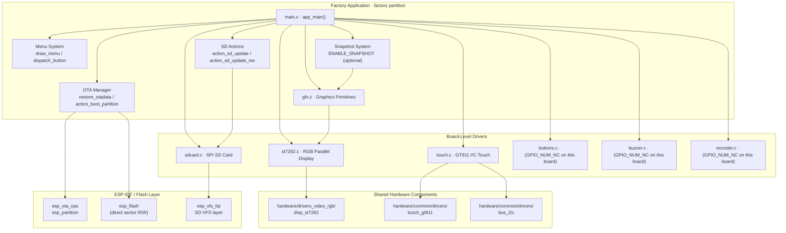

---

## Boot Sequence

The startup order is deliberate: OTA data is restored **before** the display is initialised so that even a display failure leaves the boot chain intact.

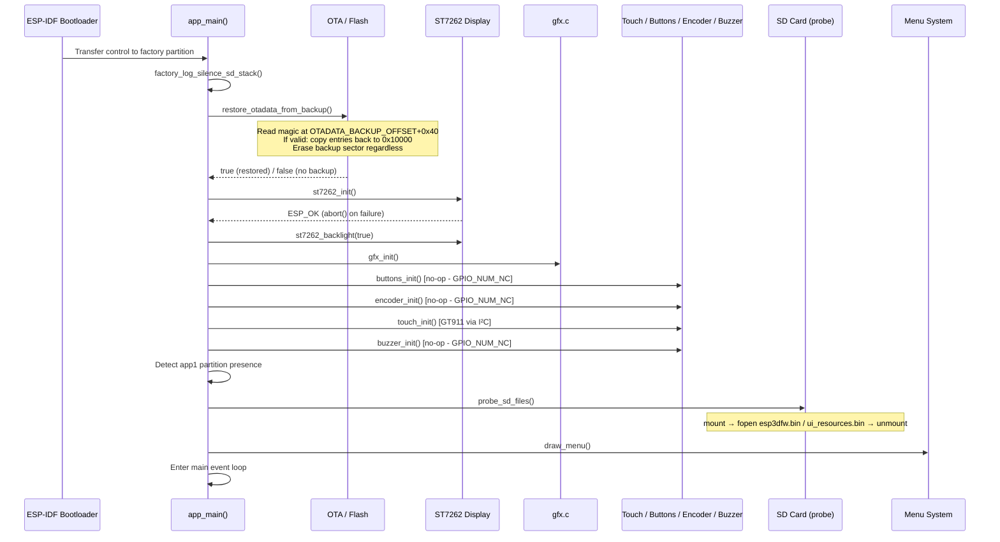

---

## Component Details

### `app_main()` — Entry Point and Main Loop

`app_main()` is the sole entry point. After hardware init it enters a bare `while(1)` that polls all three input sources and calls the unified `dispatch_button(button_id_t)`:

```
[optional] snapshot_check()          — GPIO0 (BOOT button), ENABLE_SNAPSHOT
encoder_read()     → menu_move(±1)
button_wait_press(100 ms timeout)   → dispatch_button()
touch_read()
  → touch_hint_hit_test(x, y)
  → draw_button_hint_pressed(vbtn)  — visual feedback
  → buzzer_beep_short()             — audible feedback (no-op here)
  → 80 ms delay
  → draw_button_hints()             — restore hint bar
  → dispatch_button(vbtn)
```

`dispatch_button()` maps button IDs to menu actions:

| Button | Action |
|---|---|
| `BTN_1` | `menu_move(-1)` — scroll up |
| `BTN_2` | `menu_move(+1)` — scroll down |
| `BTN_3` | `execute_selected_action()` — confirm |

---

### OTA / Boot Management

#### `restore_otadata_from_backup()`

Before rendering anything, the app checks for a backup written by the main firmware's `esp444.cpp`. The backup uses a 4-byte magic sentinel (`0xAA55AA55`) at `OTADATA_BACKUP_OFFSET + BACKUP_MAGIC_OFFSET`.

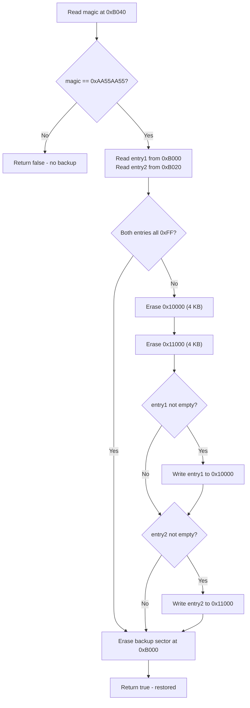

**Flash offset table** — must match `esp444.cpp` in the main firmware exactly:

| Symbol | Offset | Constraint |
|---|---|---|
| `OTADATA_OFFSET` | `0x10000` | Standard ESP-IDF OTA data partition |
| `OTADATA_SECTOR_SIZE` | `0x1000` | 4 KB per OTA entry slot |
| `OTADATA_BACKUP_OFFSET` | `0xB000` | After bootloader end; before partition table (`0xC000`) |
| `BACKUP_MAGIC_OFFSET` | `0x40` | Stored at `OTADATA_BACKUP_OFFSET + 0x40` |
| `BACKUP_MAGIC` | `0xAA55AA55` | Sentinel value |

> ⚠️ **`CONFIG_SPI_FLASH_DANGEROUS_WRITE_ALLOWED=y`** is required in the factory `sdkconfig`. `esp_flash_erase_region()` targets `0xB000`, which is below the first partition. ESP-IDF aborts such calls by default (`CONFIG_SPI_FLASH_DANGEROUS_WRITE_ABORTS`). The factory app is an intentionally privileged recovery tool.

#### `boot_partition(label)` and `action_boot_partition(label)`

`boot_partition()` calls `esp_partition_find_first()` → `esp_ota_set_boot_partition()` → `esp_restart()`. `action_boot_partition()` wraps it with status display and handles the partition-not-found error case.

---

### Display System

#### `st7262.c` — RGB Parallel Display Driver

`st7262.c` is a thin wrapper over the shared `hardware/drivers_video_rgb/disp_st7262` component (see [display_rgb_drivers.md](display_rgb_drivers.md)). Key properties of this integration:

- **16-bit RGB parallel bus** — 16 data GPIO lines + HSYNC / VSYNC / DE / PCLK / backlight
- **PSRAM framebuffer mandatory** (`fb_in_psram = true`) — the RGB panel controller DMA-fetches pixels from PSRAM continuously; `esp_lcd_panel_draw_bitmap()` copies data into that buffer
- **Native landscape orientation** — `DISP_ST7262_ORIENTATION_LANDSCAPE` is a pure passthrough with no `swap_xy` / `mirror`. This contrasts with `esp32s3_4827s043c`, where the panel is physically mounted rotated 90° and requires orientation correction in the driver
- **Byte-swap in `st7262_flush()`** — `gfx.c` stores pixels in SPI big-endian RGB565 (shared convention across all boards). The RGB parallel bus requires native RGB565. `st7262_flush()` swaps each pixel into a local `scratch[SCREEN_WIDTH]` buffer before calling `esp_lcd_panel_draw_bitmap()`. Using a scratch buffer — rather than swapping in-place — prevents corruption on multi-row fill operations where `gfx_hline()` / `gfx_fill_rect()` reuse the same line buffer across multiple successive `st7262_flush()` calls

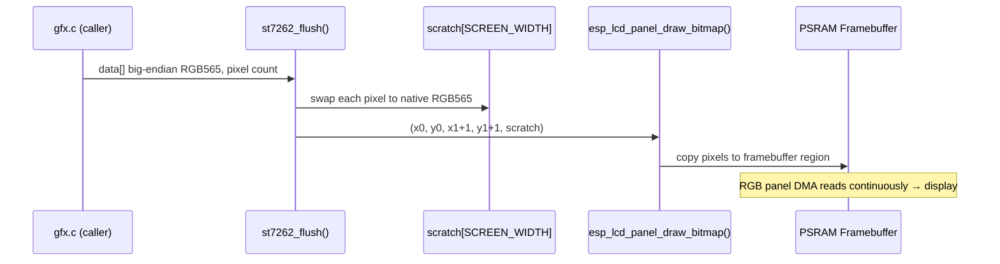

#### `gfx.c` — Software Graphics Layer

`gfx.c` provides all drawing primitives above the panel driver. A single static `line_buf[SCREEN_WIDTH]` is reused for all horizontal fill operations to avoid per-row allocation.

| Function | Description |
|---|---|
| `gfx_init()` | No-op (snapshot is purely on-demand) |
| `gfx_clear(color)` | Full-screen fill using line-buffer horizontal scan |
| `gfx_draw_char(x,y,c,fg,bg)` | 12×24 bitmap font character (clipped to screen bounds) |
| `gfx_draw_string(x,y,str,fg,bg)` | Null-terminated string via repeated `gfx_draw_char()` |
| `gfx_hline(x,y,w,color)` | Horizontal line — one `gfx_flush()` call |
| `gfx_vline(x,y,h,color)` | Vertical line — one `gfx_flush()` per row |
| `gfx_rect(x,y,w,h,color)` | Rectangle outline via four line calls |
| `gfx_fill_rect(x,y,w,h,color)` | Filled rectangle via horizontal line scan |
| `gfx_snapshot_begin(path)` | Open snapshot file, write 8-byte header, pre-fill with zeros |
| `gfx_snapshot_end()` | Close snapshot file |
| `snap_write(...)` | Route pixel data to correct byte offset in snapshot file |

All draw calls funnel through the internal `gfx_flush()` wrapper, which calls `st7262_flush()` and, when a snapshot is active, also calls `snap_write()`.

---

### Input System

All three input sources converge on a single `dispatch_button(button_id_t)` call:

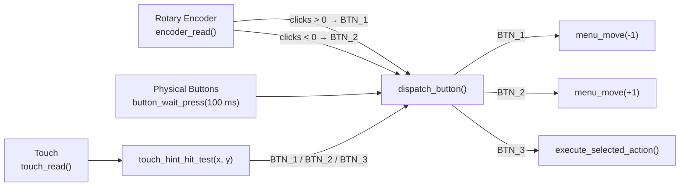

#### `touch.c` — GT911 Capacitive Touch

Wraps the shared `touch_gt911` component (see [touch_drivers.md](touch_drivers.md)) and `bus_i2c`. The GT911 reports its own `x_max` / `y_max` from internal configuration registers. On this board, these values do **not** match the physical panel resolution (measured approximately 468×253 on real hardware). Raw coordinates are rescaled in `touch_read()`:

```c
pt.x = (int)data.x * SCREEN_WIDTH  / touch_gt911_get_x_max();
pt.y = (int)data.y * SCREEN_HEIGHT / touch_gt911_get_y_max();
```

#### `touch_hint_hit_test(x, y)` — Virtual Button Touch Zones

Three virtual buttons are drawn at `BTN_HINT_CX1`, `BTN_HINT_CX2`, and `BTN_HINT_CX3` (clustered around horizontal screen centre). Hit zones span the full hint bar height. Column boundaries use **midpoints between adjacent button centres** — not equal screen-width thirds — because equal thirds would map the wrong touch column to each button on a wide landscape canvas where all icons are clustered near centre:

```c
int boundary_1_2 = (BTN_HINT_CX1 + BTN_HINT_CX2) / 2;
int boundary_2_3 = (BTN_HINT_CX2 + BTN_HINT_CX3) / 2;
```

#### `buttons.c` — Physical Button Driver

Computes a combined GPIO pin mask at runtime with `GPIO_IS_VALID_GPIO()`. If all three button pins are `GPIO_NUM_NC`, the mask is `0` and `buttons_init()` returns immediately without configuring any GPIO. `button_wait_press()` then times out on every poll cycle, adding only the configured timeout latency to the main loop.

#### `encoder.c` — PCNT Rotary Encoder

Guards against `GPIO_NUM_NC` on both encoder pins before creating a PCNT unit. When populated, uses full quadrature decoding with `PULSES_PER_DETENT = 4` and clears the hardware counter after each read. The 100 ms `button_wait_press()` timeout in the main loop sets the effective encoder polling interval.

#### `buzzer.c` — Bit-Bang Buzzer

Guards against `GPIO_NUM_NC` in both `buzzer_init()` and `buzzer_beep_short()`. When populated, generates a 2700 Hz square wave for 40 ms using `esp_rom_delay_us()` — no LEDC/PWM peripheral is required.

---

### SD Card Management

#### `sdcard.c` — SPI SD Card

Mounts to `/sdcard` via `esp_vfs_fat_sdspi_mount()`. The SPI bus is initialised once and kept active across mount/unmount cycles — releasing and re-initialising it can interfere with the display SPI bus on shared-bus boards. The `card` pointer is set to `NULL` on unmount to permit clean remounting after card swaps.

**Files managed by the factory app:**

| Path | Role |
|---|---|
| `/sdcard/esp3dfw.bin` | Main firmware image to flash |
| `/sdcard/esp3dfw.ok` | Renamed from `.bin` after a successful firmware flash |
| `/sdcard/esp3dfw.bad` | Renamed from `.bin` after a failed firmware flash |
| `/sdcard/ui_resources.bin` | UI resources partition image |
| `/sdcard/ui_resources.ok` | Renamed from `.bin` after a successful resources flash |
| `/sdcard/ui_resources.bad` | Renamed from `.bin` after a failed resources flash |
| `/sdcard/snap###.raw` | Screen snapshots (optional, `ENABLE_SNAPSHOT`) |

`probe_sd_files()` mounts, checks for both files, then unmounts. The resulting `sd_has_fw` and `sd_has_res` flags drive the SD indicator line in the menu header.

---

### Menu System

The menu is a flat list of `menu_item_t` entries with an immediate-mode highlighted cursor. There is no retained widget state.

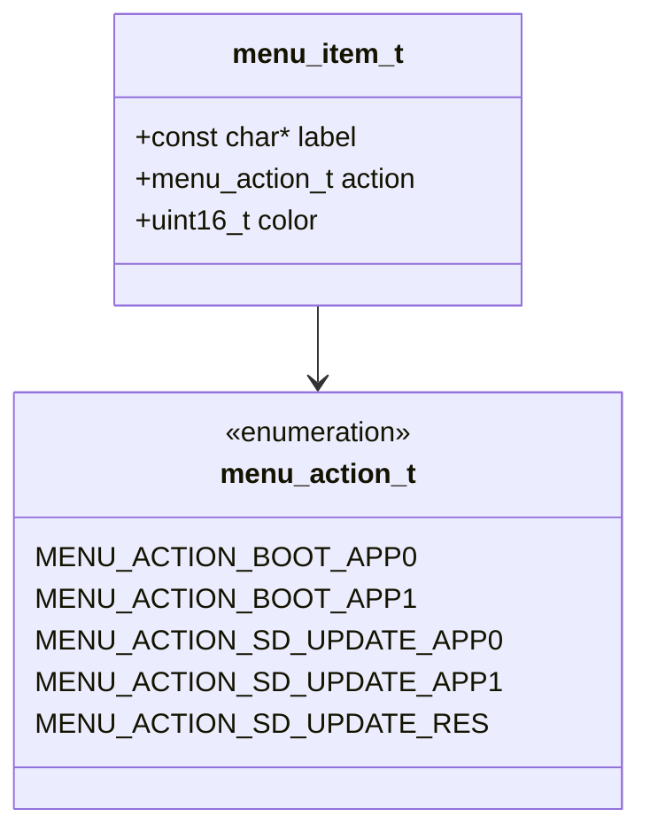

#### Screen Layout (logical canvas, portrait orientation in pendant enclosure)

```
┌──────────────────────────────────────┐  y=0
│       Recovery vX.Y.Z                │  Title  (CYAN)
│  ────────────────────────────────    │  y=40  separator
│  Active: app0                        │  y=45  active partition (YELLOW)
│  SD: FW  RES                         │  y=68  SD file indicators
│  ────────────────────────────────    │  y=88  separator
│  ┌──────────────────────────────┐    │  y=94  MENU_START_Y
│  │  Boot app0                   │    │        34 px per item
│  ├──────────────────────────────┤    │
│  │  SD -> app0   ◀ HIGHLIGHTED  │    │        selected item
│  ├──────────────────────────────┤    │
│  │  SD -> resources             │    │
│  └──────────────────────────────┘    │
│  ────────────────────────────────    │  STATUS_Y − 7  separator
│      Power off to cancel             │  STATUS_Y  footer / status message
│  ────────────────────────────────    │  BTN_HINT_BASE_Y  separator
│  [↑ circle]  [↓ circle]  [✓ circle] │  Virtual button hints
└──────────────────────────────────────┘  y=SCREEN_HEIGHT
```

Menu items are built dynamically from partition detection results:

| Item label | Condition |
|---|---|
| `Boot app0` | Always present |
| `Boot app1` | Only if `app1` partition exists in flash |
| `SD -> app0` | Always present |
| `SD -> app1` | Only if `app1` partition exists in flash |
| `SD -> resources` | Always present |

---

### SD Update Actions

#### `action_sd_update(target_label)` — Firmware Flash Flow

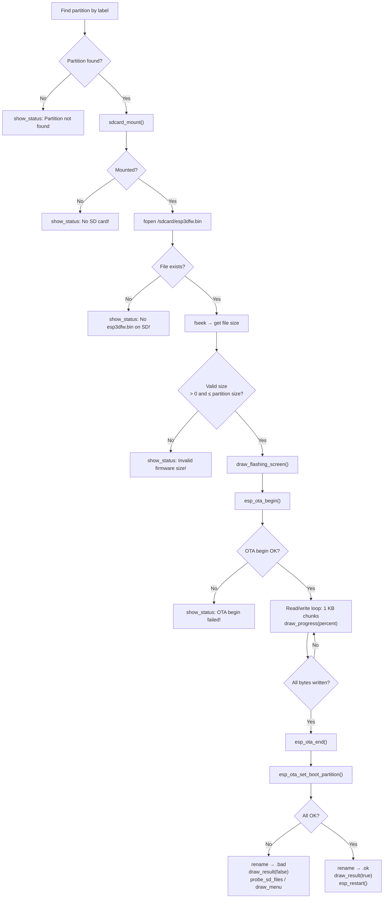

#### `action_sd_update_res()` — Resources Flash

Follows the same structure but targets the `ui_resources` data partition using `esp_partition_erase_range()` + `esp_partition_write()` instead of the OTA API. Before erasing, it reads and logs an optional 16-byte build header (magic `ESP3` + 12-char variant string written by `generate_resources.py`) to enable early detection of variant mismatches without destructive side effects.

---

### Snapshot System (Optional — `ENABLE_SNAPSHOT`)

When enabled, **GPIO0 (the BOOT button)** acts as a snapshot trigger. This pin is always available on ESP32-S3 modules regardless of board peripheral population.

**Raw file format:**

| Bytes | Content |
|---|---|
| 0–3 | `SCREEN_WIDTH` as little-endian `uint32_t` |
| 4–7 | `SCREEN_HEIGHT` as little-endian `uint32_t` |
| 8 … end | Raw RGB565 pixels, native byte order, row-major |

**Capture mechanism:** `gfx_snapshot_begin()` opens the output file, writes the 8-byte header, and pre-fills the pixel area with zeros. The caller then performs a **full screen redraw** — every `gfx_flush()` call routes pixel data concurrently to the display and to `snap_write()`. `snap_write()` reverses the big-endian byte convention used internally by `gfx.c` back to native RGB565 before writing at the correct file offset for each row.

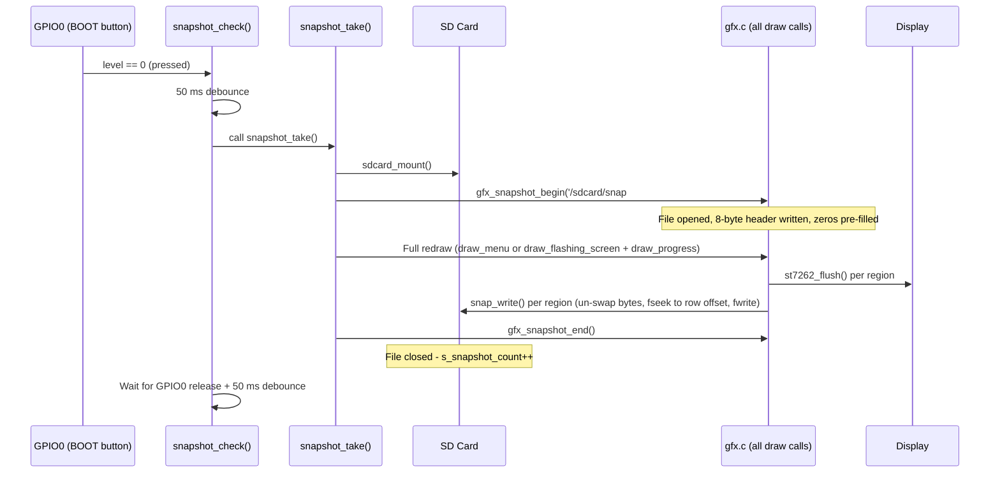

Snapshots can be converted to PNG using `snap2png.py` from a board that ships the tool (e.g. `boards/esp32s3_8048s070c/Factory/tools/raw2png/snap2png.py`).

---

### Logging System

`factory_log.h` provides a two-tier log gate independent of `sdkconfig` log levels:

| Macro / Call | `FACTORY_LOG_LEVEL == 1` | `FACTORY_LOG_LEVEL == 0` |
|---|---|---|
| `FACTORY_LOGD(tag, fmt, …)` | → `ESP_LOGI()` | → empty `do {} while(0)` |
| `ESP_LOGE` / `ESP_LOGW` | Always active | Always active |
| `factory_log_silence_sd_stack()` | Silences 8 SD/FAT tags at runtime | Silences 8 SD/FAT tags at runtime |

`FACTORY_LOG_LEVEL` is set at compile time by `ENABLE_FACTORY_DEBUG_LOG` in `Factory/CMakeLists.txt`. ESP-IDF internal logs emitted before `app_main()` (startup banner, partition scan, flash driver init) are silenced separately via `sdkconfig.prod_log`, applied by `cmake/targets.cmake` when debug logging is off — they cannot be gated at runtime because they fire before `app_main()` executes.

See [esp3d_log_guide.md](https://github.com/luc-github/Pibot-cnc-pendant-firmware/blob/main/docs/guides/esp3d_log_guide.md) for the main firmware logging patterns.

---

## Data Flow Diagrams

### Firmware Flash Data Path

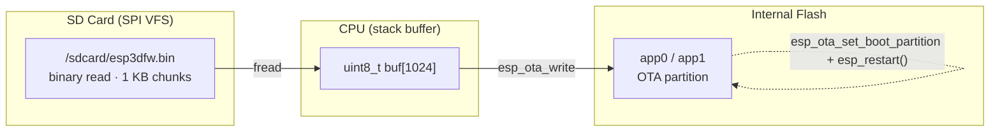

### Display Pixel Data Path

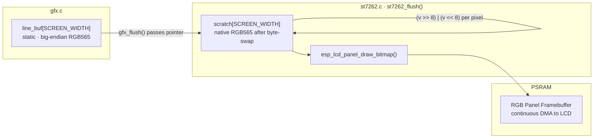

### Touch Coordinate Mapping

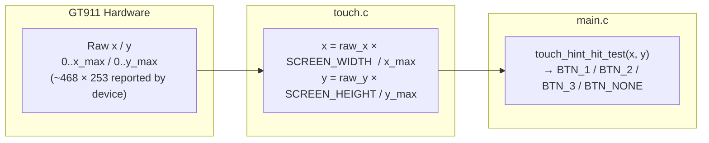

---

## Build and Configuration

### CMake Feature Flags (`Factory/CMakeLists.txt`)

| Flag | Effect |
|---|---|
| `ENABLE_FACTORY_DEBUG_LOG` | `FACTORY_LOG_LEVEL=1`; raises sdkconfig log ceiling to `INFO` |
| `ENABLE_SNAPSHOT` | Adds GPIO0-triggered screen capture to SD |
| `ENABLE_CUSTOM_BOOT_LOADER` | **Not used** on this board |

### `sdkconfig` Requirements

| Key | Required Value | Reason |
|---|---|---|
| `CONFIG_SPI_FLASH_DANGEROUS_WRITE_ALLOWED` | `y` | `esp_flash_erase_region()` targets address below first partition (`0xB000`) |
| `CONFIG_SPIRAM` | `y` | ST7262 RGB panel mandates PSRAM framebuffer (`fb_in_psram = true`) |

---

## Relationships to Other Modules

| Module | Relationship |
|---|---|
| [esp32s3_8048s050c_bsp.md](esp32s3_8048s050c_bsp.md) | **Sibling** — BSP for the main firmware on the same board; shares `hw_config.h`, `disp_st7262`, and `touch_gt911` but occupies a different flash partition |
| [esp32s3_8048s043c_factory.md](esp32s3_8048s043c_factory.md) | **Near-identical sibling** — same factory architecture (ST7262 + GT911, native landscape) for the 4.3-inch variant |
| [pibot_pendant_v1_0_factory_app.md](pibot_pendant_v1_0_factory_app.md) | **Reference implementation** — structurally identical; differs only in panel driver (ILI9341 vs ST7262), touch controller (XPT2046 vs GT911), and peripheral population |
| [esp32s3_8048s070c_factory_app.md](esp32s3_8048s070c_factory_app.md) | **Sibling** — same factory pattern for the 7-inch variant |
| [display_rgb_drivers.md](display_rgb_drivers.md) | **Dependency** — `disp_st7262` component wrapped by `st7262.c` |
| [touch_drivers.md](touch_drivers.md) | **Dependency** — `touch_gt911` and `bus_i2c` components wrapped by `touch.c` |
| [esp32s3_8048s050c_build_scripts.md](esp32s3_8048s050c_build_scripts.md) | **Sibling** — Python build scripts for this board's firmware variants |

---

## Key Design Decisions

### No Custom Bootloader

Boards with a physical BOOT/RESET button (e.g. `pibot_pendant_v1_0`) detect a long-press in a custom bootloader hook to autonomously switch to the factory partition. The ESP32S3-8048S050C has no such button, so the factory partition is entered **only** via the main firmware's `[ESP444]FACTORY` command, which:

1. Backs up the current OTA data to `OTADATA_BACKUP_OFFSET`
2. Calls `esp_ota_set_boot_partition("factory")` + `esp_restart()`

The `restore_otadata_from_backup()` logic is identical across all boards regardless of how they enter the factory partition.

### Double Byte-Swap Between `gfx.c` and `st7262.c`

`gfx.c` is shared across all factory apps in this project. It applies the SPI big-endian byte swap once, matching the native pixel expectation of every SPI-connected panel (ILI9341, ST7796, …). The ST7262 RGB parallel bus is the only panel type requiring native little-endian RGB565, so `st7262.c` reverses the swap locally in `st7262_flush()` — keeping `gfx.c` unchanged across all board variants.

### SD Menu Items Always Present

SD update menu items are always built regardless of whether `probe_sd_files()` found the files at startup. The SD probe is a best-effort check; the user may insert the SD card after boot. When a file is absent at action time, `action_sd_update()` and `action_sd_update_res()` display a clear error status and return without any destructive side effects.
