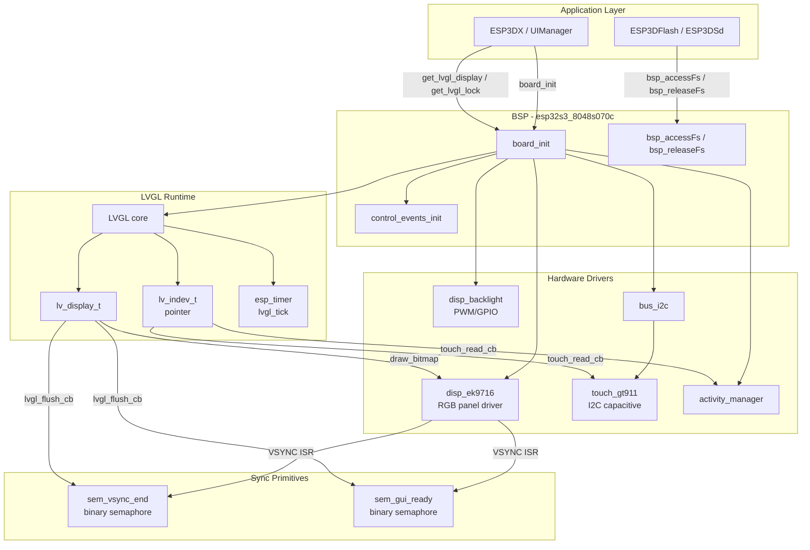
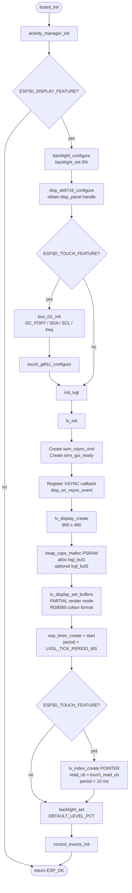
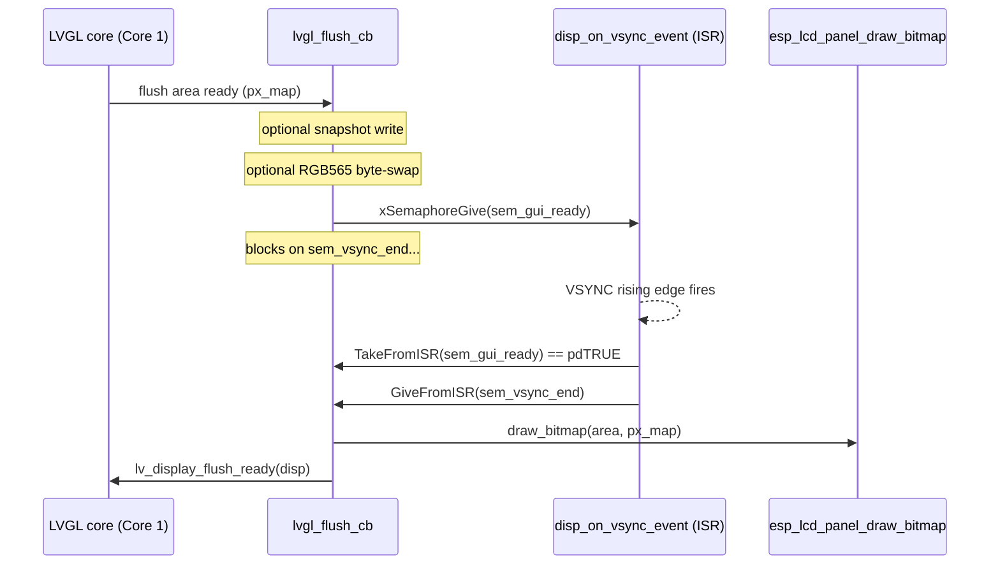
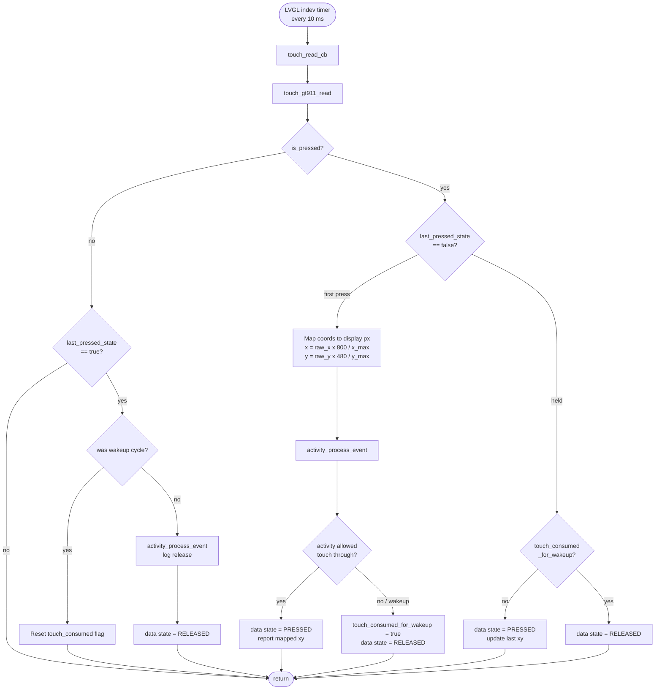
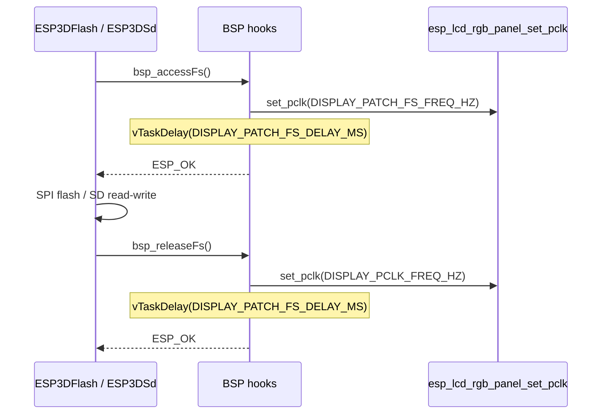
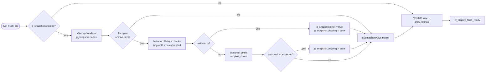
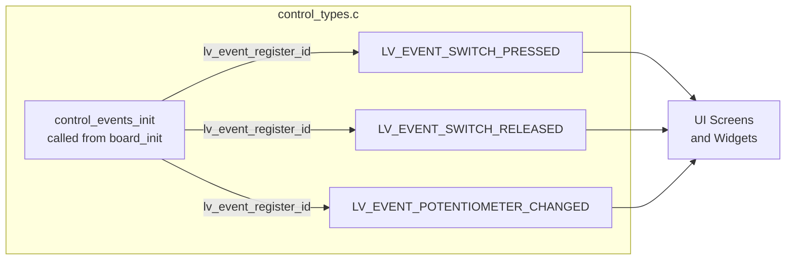
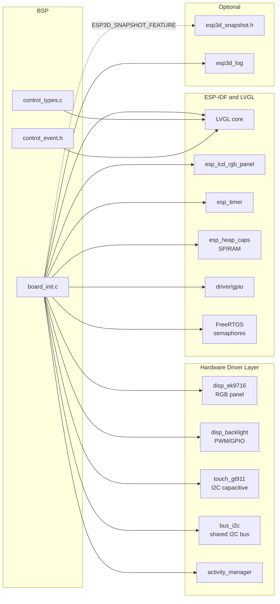

# esp32s3_8048s070c_bsp

Board Support Package (BSP) for the **ESP32-S3 8048S070C** — a 7-inch, 800 × 480 capacitive-touch display board driven over an RGB parallel bus. This module owns every hardware-specific detail: display initialisation, RGB VSYNC tear-prevention, GT911 touch input, backlight control, filesystem-access pixel-clock patching, and custom LVGL event registration. The rest of the firmware is entirely board-agnostic and communicates with this module through the `board_init.h` / `control_event.h` interfaces.

---

## Table of Contents

1. [Hardware Profile](#1-hardware-profile)
2. [Module Structure](#2-module-structure)
3. [Architecture Overview](#3-architecture-overview)
4. [Component Reference](#4-component-reference)
   - 4.1 [board_init.c](#41-board_initc)
   - 4.2 [control_event.h](#42-control_eventh)
   - 4.3 [control_types.c](#43-control_typesc)
5. [Initialization Sequence](#5-initialization-sequence)
6. [Display Pipeline & VSYNC Synchronisation](#6-display-pipeline--vsync-synchronisation)
7. [Touch Input Pipeline](#7-touch-input-pipeline)
8. [Filesystem Access Patching](#8-filesystem-access-patching)
9. [Snapshot Feature](#9-snapshot-feature)
10. [Activity Manager Integration](#10-activity-manager-integration)
11. [Custom LVGL Events](#11-custom-lvgl-events)
12. [Build System](#12-build-system)
13. [Dependencies](#13-dependencies)
14. [Related Board BSPs](#14-related-board-bsps)

---

## 1. Hardware Profile

| Attribute | Value |
|---|---|
| MCU | ESP32-S3 |
| Display | 7 inch, 800 × 480 px |
| Display interface | RGB parallel (16-bit) |
| Display driver IC | EK9716 |
| Touch controller | GT911 (I²C, capacitive) |
| Backlight | PWM / GPIO (configurable) |
| Filesystem | Flash + SD (SPI shared bus — requires pixel-clock throttling) |
| PSRAM | Required (LVGL draw buffers allocated via `MALLOC_CAP_SPIRAM`) |

---

## 2. Module Structure

```
boards/esp32s3_8048s070c/
├── components/bsp/
│   ├── board_init.c        ← hardware initialisation, LVGL integration
│   ├── board_init.h        ← public API (board_init, get_lvgl_*, bsp_accessFs…)
│   ├── board_config.h      ← pin map, timing constants, feature flags
│   ├── control_event.h     ← control_event_t structure
│   ├── control_types.h     ← extern custom LVGL event codes
│   └── control_types.c     ← LVGL custom event registration
├── Factory/                ← standalone factory-test application
│   └── main/               → see esp32s3_8048s070c_factory_app.md
└── build_scripts/          ← Python variant build helpers
    ├── build_one.py
    ├── common.py
    └── variants.py
```

---

## 3. Architecture Overview



---

## 4. Component Reference

### 4.1 `board_init.c`

The single source file that implements the entire BSP public API. All symbols are either `static` (internal) or exported through `board_init.h`.

#### Public API

| Symbol | Signature | Description |
|---|---|---|
| `board_init` | `esp_err_t board_init(void)` | Master initialisation entry point. Called once by the application. |
| `board_get_name` | `const char *board_get_name(void)` | Returns `BOARD_NAME_STR`. |
| `board_get_version` | `const char *board_get_version(void)` | Returns `BOARD_VERSION_STR`. |
| `get_lvgl_display` | `lv_display_t *get_lvgl_display(void)` | Returns the LVGL display handle (NULL when display disabled). |
| `get_lvgl_lock` | `_lock_t *get_lvgl_lock(void)` | Returns the LVGL API mutex used by `ESP3DXUi`. |
| `get_touch_indev` | `lv_indev_t *get_touch_indev(void)` | Returns the LVGL pointer input device (guarded by `ESP3D_TOUCH_FEATURE`). |
| `bsp_accessFs` | `esp_err_t bsp_accessFs(void)` | Throttles the RGB pixel clock before SPI flash/SD access (guarded by `ESP3D_PATCH_FS_ACCESS_RELEASE`). |
| `bsp_releaseFs` | `esp_err_t bsp_releaseFs(void)` | Restores the RGB pixel clock after SPI flash/SD access. |

#### Static (internal) functions

| Function | Description |
|---|---|
| `init_lvgl` | Creates LVGL display, allocates PSRAM buffers, registers flush callback, starts tick timer, creates touch indev. |
| `init_touch_controller` | Initialises the I²C bus and configures the GT911 driver. |
| `lvgl_flush_cb` | LVGL flush callback: optionally writes a snapshot chunk, colour-swaps if needed, synchronises with VSYNC, then calls `esp_lcd_panel_draw_bitmap`. |
| `disp_on_vsync_event` | RGB panel ISR: handshakes with `lvgl_flush_cb` via two binary semaphores to prevent display tearing. |
| `touch_read_cb` | LVGL indev read callback: maps GT911 native coordinates to display pixels, integrates with `activity_manager` for wakeup-touch suppression. |
| `increase_lvgl_tick` | `esp_timer` periodic callback that calls `lv_tick_inc(LVGL_TICK_PERIOD_MS)`. |

#### Module-private global state

```c
static _lock_t                lvgl_api_lock;    // LVGL thread-safety mutex
static lv_display_t          *lvgl_display;     // LVGL display handle
static lv_color16_t          *lvgl_buf1;        // Primary draw buffer (PSRAM)
static lv_color16_t          *lvgl_buf2;        // Secondary draw buffer (PSRAM, optional)
static esp_timer_handle_t     lvgl_tick_timer;  // Periodic LVGL tick
static lv_indev_t            *touch_indev;      // LVGL pointer input device
static esp_lcd_panel_handle_t disp_panel;       // EK9716 RGB panel handle
static SemaphoreHandle_t      sem_vsync_end;    // ISR → flush synchronisation
static SemaphoreHandle_t      sem_gui_ready;    // flush → ISR synchronisation
```

---

### 4.2 `control_event.h`

Defines the unified event payload passed between BSP input callbacks and LVGL widget event handlers.

```c
typedef struct {
    lv_indev_t       *indev;           // Originating LVGL input device
    uint32_t          btn_id;          // Button/key identifier
    lv_indev_type_t   type;            // POINTER / KEYPAD / ENCODER / BUTTON
    control_family_t  family_id;       // TOUCH / ENCODER / BUTTON / SWITCH / POT
    int32_t           steps;           // Encoder step count (signed)
    uint32_t          press_duration;  // Hold time in milliseconds
} control_event_t;
```

This board's BSP only populates the `TOUCH` family — `steps` and `press_duration` are zero for pointer events. Other boards (e.g. `pibot_pendant_v1_0`) extend the same struct for encoders, buttons, and potentiometers.

---

### 4.3 `control_types.c`

Registers board-specific custom LVGL event codes **after** `lv_init()` has been called. On this board three codes are registered:

| Extern symbol | Registered via | Intended use |
|---|---|---|
| `LV_EVENT_SWITCH_PRESSED` | `lv_event_register_id()` | Physical switch pressed |
| `LV_EVENT_SWITCH_RELEASED` | `lv_event_register_id()` | Physical switch released |
| `LV_EVENT_POTENTIOMETER_CHANGED` | `lv_event_register_id()` | Analog potentiometer value changed |

`control_events_init()` must be called from `board_init()` strictly **after** `lv_init()` returns. The extern declarations in `control_types.h` are initialised to `LV_EVENT_ALL` until that point — using them before registration silently matches every LVGL event.

---

## 5. Initialization Sequence



> **Anti-flash pattern:** Backlight is explicitly set to 0 % before display initialisation and raised to the configured default only after LVGL is fully ready. This prevents a white-flash artifact on cold boot.

---

## 6. Display Pipeline & VSYNC Synchronisation

The EK9716 is driven over a 16-bit RGB parallel bus. Unlike SPI or I80 panels, RGB panels stream pixel data continuously from a shared frame buffer. Without coordination, an LVGL partial-buffer copy landing mid-scan produces visible horizontal tearing. Two binary semaphores implement a producer–consumer handshake between `lvgl_flush_cb` and the VSYNC ISR.

### Flush / VSYNC handshake



- `sem_gui_ready` — given by `lvgl_flush_cb` ("pixel data is ready"); taken by the ISR.
- `sem_vsync_end` — given by the ISR on the *next* VSYNC edge ("safe to write"); taken by `lvgl_flush_cb`.
- The bitmap is pushed to hardware only **after** VSYNC, ensuring the scan begins on a clean frame boundary.

### Buffer configuration

| Build flag | Behaviour |
|---|---|
| `DISPLAY_USE_DOUBLE_BUFFER_FLAG = 1` | Two PSRAM buffers; LVGL prepares the next area while the previous one transfers. |
| `DISPLAY_USE_DOUBLE_BUFFER_FLAG = 0` | Single PSRAM buffer; simpler, slightly lower throughput. |
| `DISPLAY_SWAP_COLOR_FLAG = 1` | `lv_draw_sw_rgb565_swap()` is applied before bitmap push (byte-order correction for some panel wiring). |

All buffers are allocated with `MALLOC_CAP_SPIRAM`. The board **requires PSRAM**.

---

## 7. Touch Input Pipeline



**GT911 coordinate mapping:** The GT911's native resolution may differ from the panel pixel dimensions (e.g., 1024 × 600 vs 800 × 480). `touch_read_cb` performs a proportional remap:

```c
display_x = touch_raw_x * DISPLAY_WIDTH_PX  / touch_gt911_get_x_max();
display_y = touch_raw_y * DISPLAY_HEIGHT_PX / touch_gt911_get_y_max();
```

This guarantees correct LVGL hit-testing regardless of the hardware difference between the GT911 internal grid and the pixel grid.

**Wakeup-touch suppression:** When the display is in the activity manager's idle/sleep state, the first touch fires `activity_process_event()` which returns `false`. The BSP suppresses that touch (reports `LV_INDEV_STATE_RELEASED` to LVGL) and sets `touch_consumed_for_wakeup = true`. The flag is cleared on the matching release event. The next distinct touch cycle is delivered normally to the UI.

---

## 8. Filesystem Access Patching

On ESP32-S3 boards with an RGB parallel display and a shared SPI bus (flash and/or SD card), simultaneous high-frequency SPI transactions and a fast pixel clock can cause data corruption. The BSP exposes two hooks to throttle the pixel clock around filesystem operations.



These hooks are compiled only when `ESP3D_PATCH_FS_ACCESS_RELEASE` is defined. `disp_panel` is checked for NULL so calls before display initialisation are silently ignored.

> For the full fragmentation and bus-contention analysis, see [esp32_memory_constraints.md](https://github.com/luc-github/Pibot-cnc-pendant-firmware/blob/main/docs/guides/esp32_memory_constraints.md) (section *Serial CNC + WiFi remote — fragmentation playbook*) and [feature_resource_matrix.md](https://github.com/luc-github/Pibot-cnc-pendant-firmware/blob/main/docs/features/feature_resource_matrix.md) §2–§4.

---

## 9. Snapshot Feature

When `ESP3D_SNAPSHOT_FEATURE` is enabled, `lvgl_flush_cb` writes each flushed pixel block to an open file before sending it to the display. This enables screen-capture without halting the UI.



The 120-byte chunk limit avoids large stack or heap allocations in the flush path, complying with the project's strict memory constraints (see [esp32_memory_constraints.md](https://github.com/luc-github/Pibot-cnc-pendant-firmware/blob/main/docs/guides/esp32_memory_constraints.md)).

The `snapshot_state_t` type and `g_snapshot` global are declared in `esp3d_snapshot.h` (UI layer); the BSP references this header conditionally under the `ESP3D_SNAPSHOT_FEATURE` guard.

---

## 10. Activity Manager Integration

`board_init()` calls `activity_manager_init()` as its first action, before any display work. The activity manager tracks user-interaction events and drives screen-timeout / sleep policies.

Two integration points exist in this BSP:

| Location | Call | Purpose |
|---|---|---|
| `touch_read_cb` — first press edge | `activity_process_event()` | Signal new user activity; the return value determines whether the touch is delivered to LVGL or consumed as a wakeup. |
| `touch_read_cb` — release edge (non-wakeup) | `activity_process_event()` | Signal end of interaction so the timeout timer is refreshed correctly. |

For the activity manager API, see [esp3d_activity_manager.md](esp3d_activity_manager.md).

---

## 11. Custom LVGL Events

`control_types.c` registers three runtime event codes with LVGL after `lv_init()`. They are declared `extern` in `control_types.h` and consumed by UI screens and input-handling code in the application layer.



> **Timing constraint:** `control_events_init()` is invoked by `board_init()` strictly **after** `init_lvgl()` returns (which itself calls `lv_init()`). Calling it before `lv_init()` leaves all codes as `LV_EVENT_ALL`, causing undefined widget behaviour.

---

## 12. Build System

The build system follows the same Python-driven pattern used across all BSPs in the project.

### Script files

| File | Entry point | Purpose |
|---|---|---|
| `build_scripts/build_one.py` | `main()` | CLI for building a single named variant; delegates to `common.py`. |
| `build_scripts/common.py` | `build_variant()`, `check_variant()` | Runs `idf.py` CMake, triggers resource generation, copies factory artifacts, packages the `ui_resources` kit, prints size report. |
| `build_scripts/variants.py` | `make_variant_args()` | Produces the `-D FLAG=ON/OFF` CMake argument list for each named build variant from a shared `DEFAULT_OFF_CMAKE_ARGS` base. |

### Usage

```bash
# List all available variants
python boards/esp32s3_8048s070c/build_scripts/build_one.py

# Build a specific variant
python boards/esp32s3_8048s070c/build_scripts/build_one.py <variant_name>

# Build with a clean first
python boards/esp32s3_8048s070c/build_scripts/build_one.py <variant_name> --clean

# CMake configuration check only (no compile)
python boards/esp32s3_8048s070c/build_scripts/build_one.py <variant_name> --check
```

Or use the standard ESP-IDF CLI directly:

```bash
idf.py -B build build
idf.py -B build flash monitor
```

> Feature flags (socket client, BT, WebUI, etc.) are selected via `-D` CMake flags assembled by `make_variant_args()`. See [board_build_guidelines.md](https://github.com/luc-github/Pibot-cnc-pendant-firmware/blob/main/docs/guides/board_build_guidelines.md) for the full flag reference and `cmake/sanity_check.cmake` for mutual-exclusion rules (e.g., `SOCKET_CLIENT_SERVICE` vs. `WEBUI_SERVER`).

---

## 13. Dependencies



### Key driver configuration structures

| Driver | Config struct | Notable fields for this board |
|---|---|---|
| `disp_ek9716` | `disp_ek9716_config_t` | `panel_config` (RGB timing/pins), `orientation`, `hor_res=800`, `ver_res=480` |
| `touch_gt911` | `touch_gt911_config_t` | `i2c_addr[]`, `i2c_port`, `rst_pin`, `int_pin`, `swap_xy`, `invert_x/y`, `x_max/y_max` |
| `disp_backlight` | `backlight_config_t` | `pwm_control`, `gpio_num`, `duty`, `freq_hz`, `resolution_bits` |
| `bus_i2c` | inline params | `I2C_PORT_IDX`, `I2C_SDA_PIN`, `I2C_SCL_PIN`, `I2C_FREQ_HZ` (from `board_config.h`) |

All board-specific pin numbers, clock frequencies, buffer sizes, and feature-enable flags live in `board_config.h`.

---

## 14. Related Board BSPs

The `esp32s3_8048s070c_bsp` belongs to the **RGB parallel display** BSP family. All boards in this family share the same `bsp_accessFs` / `bsp_releaseFs` pixel-clock throttle pattern and VSYNC-semaphore tear-prevention design. Primary differences are panel size, display driver IC, and touch controller.

| BSP module | Panel | Driver IC | Touch IC | Key difference |
|---|---|---|---|---|
| **esp32s3_8048s070c_bsp** ← *this module* | 7" 800×480 | EK9716 RGB | GT911 I²C | — |
| [esp32s3_8048s050c_bsp](esp32s3_8048s050c_bsp.md) | 5" 800×480 | ST7262 RGB | GT911 I²C | Different panel size / driver IC |
| [esp32s3_8048s043c_bsp](esp32s3_8048s043c_bsp.md) | 4.3" 800×480 | ST7262 RGB | GT911 I²C | Smaller panel |
| [esp32s3_4827s043c_bsp](esp32s3_4827s043c_bsp.md) | 4.3" 480×272 | RGB | GT911 I²C | Lower resolution |
| [esp32s3_8048_touch_lcd_7_bsp](esp32s3_8048_touch_lcd_7_bsp.md) | 7" 800×480 | RGB | GT911 I²C | Alternative 7" variant |
| [pibot_pendant_v1_0_bsp](pibot_pendant_v1_0_bsp.md) | 2.4" 320×240 | ILI9341 SPI | XPT2046 SPI | Pendant form factor; adds encoder, buttons, potentiometer, switches |
| [esp32_3248s035c_bsp](esp32_3248s035c_bsp.md) | 3.5" 320×480 | ST7796 SPI | GT911 I²C | SPI display — no RGB/VSYNC synchronisation needed |
| [esp32s3_hmi43v3_bsp](esp32s3_hmi43v3_bsp.md) | 4.3" 480×272 | RM68120 I80 | GT911 I²C | Intel 8080 parallel bus with `i80_flush_ready_cb` |

For the full hardware and feature compatibility matrix (WiFi / BT / transport exclusions) see [feature_resource_matrix.md](https://github.com/luc-github/Pibot-cnc-pendant-firmware/blob/main/docs/features/feature_resource_matrix.md).

For display driver architecture, RGB vs SPI vs I80 trade-offs, orientation/rotation math, and `swap_xy` + mirror semantics see [display_drivers.md](https://github.com/luc-github/Pibot-cnc-pendant-firmware/blob/main/docs/architecture/display_drivers.md).
