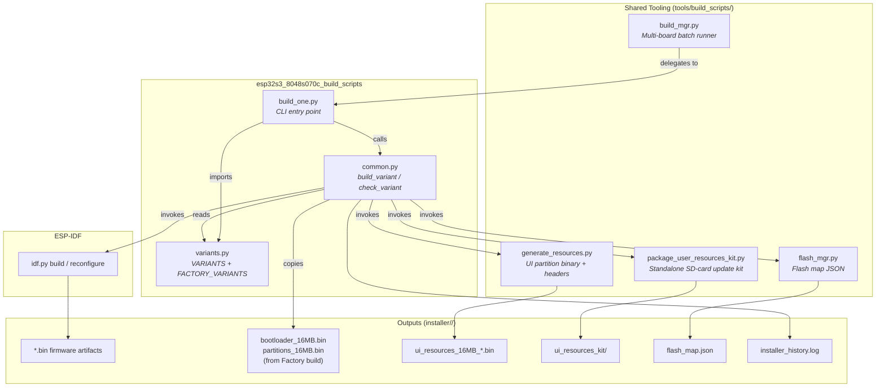
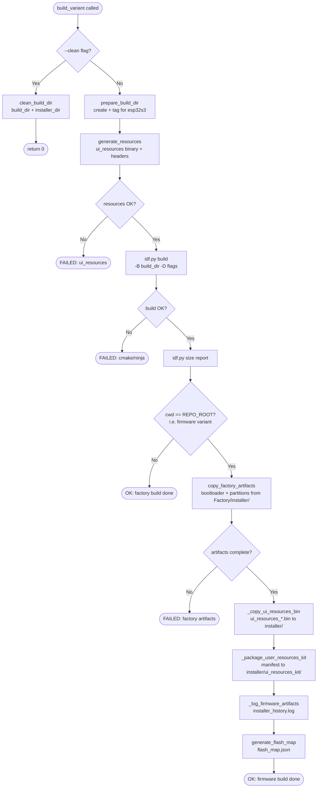
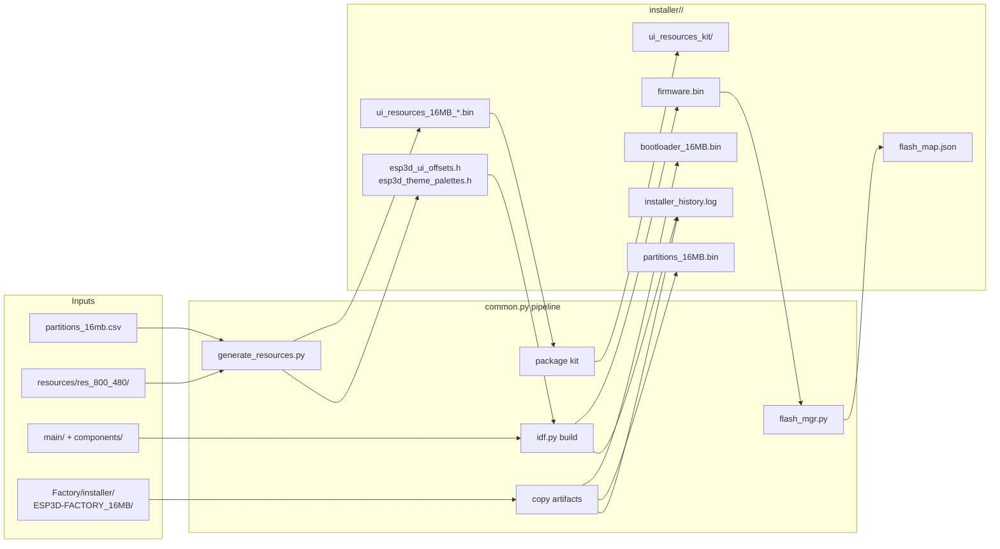
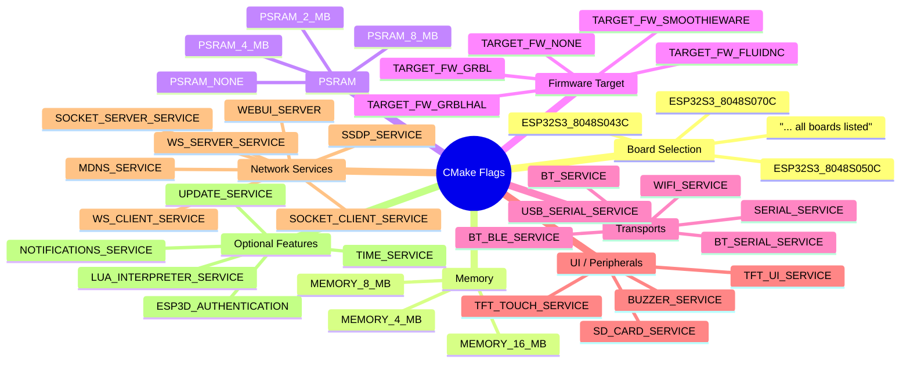
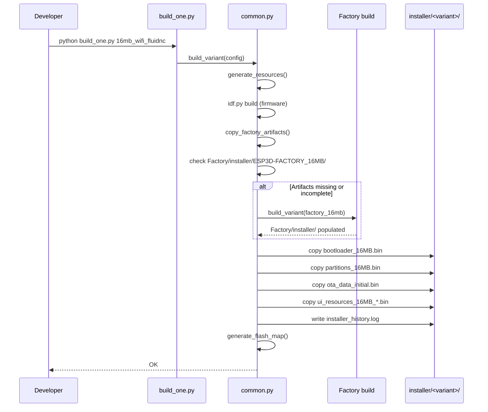

# esp32s3_8048s070c Build Scripts

Build automation for the **ESP32S3-8048S070C** board — an ESP32-S3 module carrying an 800 × 480 RGB-parallel display with capacitive touch. The three scripts in `boards/esp32s3_8048s070c/build_scripts/` form a self-contained mini build system that orchestrates ESP-IDF compilation, UI-resource partition generation, factory-artifact staging, and installer packaging for every firmware variant shipped for this board.

---

## Module Structure

```
boards/esp32s3_8048s070c/
├── build_scripts/
│   ├── build_one.py    ← CLI entry point: build or check a single named variant
│   ├── common.py       ← Build orchestration helpers (variant-agnostic logic)
│   └── variants.py     ← Variant registry: CMake flag sets + directory layout
├── board_config.cmake  ← Board-level CMake config (RESOLUTION_SCREEN, …)
├── partitions_16mb.csv ← Flash partition table (used by generate_resources.py)
├── flash_params.json   ← Flash parameters for flash_mgr.py
├── components/bsp/     ← Board Support Package (see esp32s3_8048s070c_bsp.md)
└── Factory/            ← Factory application project (see esp32s3_8048s070c_factory_app.md)
```

---

## Architecture



---

## Component Responsibilities

### `build_one.py` — CLI Entry Point

Single-variant entry point used both by developers directly and by [`build_mgr.py`](tools_build_scripts.md) when targeting this specific board.

```
python build_one.py <variant_name> [--clean] [--check]
```

| Flag | Behaviour |
|---|---|
| *(none)* | Build the named variant end-to-end |
| `--clean` | Wipe build dir + installer dir; do **not** rebuild |
| `--check` | Run CMake `reconfigure` only — no compilation |

The script merges `FACTORY_VARIANTS` and `VARIANTS` from `variants.py` into a single lookup table so factory and firmware variants share the same CLI interface.

**Exit codes:** `0` = success, `1` = error — suitable for CI pipelines and `build_mgr.py` error aggregation.

---

### `variants.py` — Variant Registry

Defines every build configuration for the board. Two dictionaries are exported:

| Dictionary | Purpose |
|---|---|
| `VARIANTS` | Releasable firmware images |
| `FACTORY_VARIANTS` | Recovery/factory-reset images (different `cwd`) |

#### `make_variant_args(*on_flags)` — Flag Discipline

Every CMake option the build system knows about is listed in `ROOT_CMAKE_OPTIONS` and **forced to `OFF`** first. Only the flags explicitly passed to `make_variant_args` are turned `ON`. This prevents stale values from a previous CMakeCache leaking into a different variant's build directory.

```python
DEFAULT_OFF_CMAKE_ARGS = ["-D", "OPTION_A=OFF", "-D", "OPTION_B=OFF", ...]

def make_variant_args(*on_flags):
    args = DEFAULT_OFF_CMAKE_ARGS.copy()
    for flag in on_flags:
        args.extend(["-D", flag])   # e.g. "WIFI_SERVICE=ON"
    return args
```

#### Defined Variants

| Variant key | Memory | Transport | Firmware | Extra services |
|---|---|---|---|---|
| `16mb_wifi_fluidnc` | 16 MB | WiFi + Serial | FluidNC | mDNS, Socket Client, Update, Lua |
| `16mb_serial_fluidnc` | 16 MB | Serial only | FluidNC | Update |
| `16mb_serial_grbl` | 16 MB | Serial only | GRBL | Update |
| `16mb_wifi_grblhal` | 16 MB | WiFi + Serial | GrblHAL | mDNS, Socket Client, Update, Lua |
| `factory_16mb` *(factory)* | 16 MB | — | Factory app | — |

> **WiFi + Socket Client constraint:** `SOCKET_CLIENT_SERVICE=ON` is the correct WiFi CNC transport for this board.  
> The build system (`cmake/sanity_check.cmake`) forbids `WEBUI_SERVER`, `SSDP_SERVICE`, `WS_SERVER_SERVICE`, and `WS_CLIENT_SERVICE` when `SOCKET_CLIENT_SERVICE` is ON.  
> See [`connection_management.md`](https://github.com/luc-github/Pibot-cnc-pendant-firmware/blob/main/docs/architecture/connection_management.md) and the feature resource matrix for details.

#### Directory Layout

```
build/
└── esp32s3_8048s070c_<variant>/          ← build_dir (idf.py -B target)

installer/
└── ESP32S3_8048S070C_16MB_<radio>_<fw>/  ← firmware installer dir
    └── (under Factory/ for factory variants)
        ESP3D-FACTORY_16MB/
```

The helper `build_config_name(cmake_args)` derives the installer directory name deterministically from the CMake flags so it is always consistent between builds.

---

### `common.py` — Build Orchestrator

All build logic that is not variant-specific lives here. The two public functions called by `build_one.py` are:

#### `build_variant(config)` — Full Build Pipeline



#### `check_variant(config)` — CMake Validate Only

Runs `idf.py reconfigure` (the CMake configure step, no compilation). Used by `build_mgr.py --check_*` commands and `build_one.py --check` to catch CMake errors in CI without a full compile.

---

## Key Helper Functions

| Function | File | Purpose |
|---|---|---|
| `make_variant_args(*on_flags)` | variants.py | Build CMake flag list with safe all-OFF baseline |
| `build_config_name(cmake_args)` | common.py | Derive deterministic installer directory name from flags |
| `resource_variant_string(cmake_args)` | common.py | Map CMake flags → `generate_resources.py --variant` string (e.g. `16mb_wifi_fluidnc`) |
| `installer_dir_for(config)` | common.py | Compute installer output path for any variant |
| `generate_resources(cmake_args, build_dir)` | common.py | Invoke `generate_resources.py` for the UI partition binary |
| `copy_factory_artifacts(cmake_args)` | common.py | Stage bootloader/partitions from `Factory/installer/` into the firmware installer dir; triggers an auto-rebuild of the factory variant if artifacts are absent or incomplete |
| `prepare_build_dir(build_dir)` | common.py | Create build dir and write `.idf_target` marker; wipes the dir if the marker shows a different target (prevents cross-target CMakeCache corruption) |
| `run_cmake_build(cmake_args, cwd, build_dir)` | common.py | Execute `idf.py build`; honours `--jobs=N` via `CMAKE_BUILD_PARALLEL_LEVEL` |
| `run_cmake_check(cmake_args, cwd, build_dir)` | common.py | Execute `idf.py reconfigure` only (no build) |
| `_package_user_resources_kit(...)` | common.py | Assemble SD-card self-contained UI resource kit under `installer/<variant>/ui_resources_kit/` |
| `generate_flash_map(config)` | common.py | Call `flash_mgr.py --generate` to write `flash_map.json` |
| `_log_firmware_artifacts(...)` | common.py | Append timestamped record to `installer_history.log` |
| `_factory_artifacts_complete(source_dir)` | common.py | Check that `Factory/installer/` contains at least one `bootloader_*.bin` (empty dir = incomplete) |

---

## Build Pipeline — Data Flow



---

## CMake Flag Categories

`ROOT_CMAKE_OPTIONS` resets all known flags before each variant applies its own selections. Flags are grouped by concern:



---

## Factory Variant Relationship

The factory variant (`factory_16mb`) uses a **separate `CMakeLists.txt`** rooted at `boards/esp32s3_8048s070c/Factory/` rather than the repo root. Its build produces the recovery application (see [esp32s3_8048s070c_factory_app.md](esp32s3_8048s070c_factory_app.md)) and stages its binaries under `Factory/installer/ESP3D-FACTORY_16MB/`.

Firmware variants depend on these factory artifacts:



> **Completeness check:** `_factory_artifacts_complete` verifies that the factory installer directory contains at least one `bootloader_*.bin` file. A directory that exists but is empty (created by CMake's `file(MAKE_DIRECTORY)` at configure time but never successfully built) is treated the same as a missing directory and triggers an automatic factory rebuild.

> **`--clean` depth:** When `--clean` is applied to the factory variant, `build_variant` also wipes any legacy `CMakeCache.txt` found in the *parent* of `build_dir` (e.g. `Factory/build/`), covering old builds that ran `idf.py` without the `-B <subdir>` flag and left artifacts in the wrong place.

---

## IDF Target Isolation

`prepare_build_dir` writes a `.idf_target` marker file inside each build directory to record that it was configured for `esp32s3`. If a subsequent build detects a mismatch — e.g. because the directory was previously used for a different chip — it clears the directory entirely before proceeding, preventing CMakeCache cross-contamination.

```
build/esp32s3_8048s070c_16mb_wifi_fluidnc/
└── .idf_target   ← contents: "esp32s3"
```

---

## Board-Specific Context

| Property | Value |
|---|---|
| MCU | ESP32-S3 |
| Display | 800 × 480, RGB parallel |
| Touch | Capacitive (`c` suffix in board name) |
| Flash | 16 MB (all variants) |
| IDF target | `esp32s3` (enforced via `.idf_target` marker) |
| Partition table | `boards/esp32s3_8048s070c/partitions_16mb.csv` |
| UI resolution string | `res_800_480` (must match `RESOLUTION_SCREEN` in `board_config.cmake`) |
| sdkconfig overlays | `sdkconfig.16mb.wifi`, `sdkconfig.16mb.serial` |
| BSP component | `boards/esp32s3_8048s070c/components/bsp/` |

The `RESOLUTION` constant (`res_800_480`) is used by `generate_resources.py` to select the correct image and font assets from the shared `resources/` tree.

---

## Integration with `build_mgr.py`

[`build_mgr.py`](tools_build_scripts.md) discovers this board's variants by scanning all `boards/*/build_scripts/variants.py` files across the repository. It delegates individual variant execution to `build_one.py` via subprocess, passing through `--clean`, `--check`, `--dev`, and `--jobs=N` flags.

```bash
# Build all variants for this board
python tools/build_scripts/build_mgr.py --build_board esp32s3_8048s070c

# Build a single named variant
python tools/build_scripts/build_mgr.py --build_variant 16mb_wifi_fluidnc

# Validate CMake configuration without compiling
python tools/build_scripts/build_mgr.py --check_board esp32s3_8048s070c

# Clean all build and installer artifacts for this board
python tools/build_scripts/build_mgr.py --clean_board esp32s3_8048s070c
```

Alternatively, call `build_one.py` directly for a faster single-variant workflow:

```bash
cd boards/esp32s3_8048s070c/build_scripts
python build_one.py 16mb_wifi_fluidnc
python build_one.py 16mb_wifi_fluidnc --clean
python build_one.py factory_16mb
```

---

## UI Resources Integration

Each firmware variant requires a matching `ui_resources` flash partition binary. `common.py` generates it automatically *before* compiling the firmware by calling `generate_resources.py` with variant-specific parameters derived from the CMake flags:

```
resource_variant_string(cmake_args)  →  "16mb_wifi_fluidnc"
                                              ↓
generate_resources.py
    --variant      16mb_wifi_fluidnc
    --resolution   res_800_480
    --partition-csv boards/esp32s3_8048s070c/partitions_16mb.csv
    --out          build/esp32s3_8048s070c_16mb_wifi_fluidnc/
```

**Outputs injected into the build:**

| File | Destination | Purpose |
|---|---|---|
| `ui_resources_16MB_wifi_fluidnc.bin` | `installer/<variant>/` | Partition binary flashed alongside firmware |
| `esp3d_ui_offsets.h` | `main/display/` | Image/font IDs compiled into firmware |
| `esp3d_theme_palettes.h` | `main/display/` | Theme colour fallbacks compiled into firmware |
| `esp3d_lang_packs.h` | `main/display/` | Language slot IDs compiled into firmware |
| `ui_resources_manifest_*.json` | `build/<variant>/` | Input for `package_user_resources_kit.py` |

For the UI partition binary format see [development.md](https://github.com/luc-github/Pibot-cnc-pendant-firmware/blob/main/docs/ui_resources/development.md).  
For customising icons and fonts via the SD-card kit see [ui_resources_guide.md](https://github.com/luc-github/Pibot-cnc-pendant-firmware/blob/main/docs/guides/ui_resources_guide.md).

---

## Parallel Sibling Boards

This module follows an identical three-file pattern to the other ESP32-S3 boards. Differences between boards live in the BSP, not the build scripts:

| Board build-scripts module | Resolution | Display interface |
|---|---|---|
| [`esp32s3_8048s043c_build_scripts`](esp32s3_8048s043c_build_scripts.md) | 800 × 480 | RGB parallel (ST7262) |
| [`esp32s3_8048s050c_build_scripts`](esp32s3_8048s050c_build_scripts.md) | 800 × 480 | RGB parallel (ST7262) |
| **`esp32s3_8048s070c_build_scripts`** (this document) | **800 × 480** | **RGB parallel** |
| [`esp32s3_8048_touch_lcd_7_build_scripts`](esp32s3_8048_touch_lcd_7_build_scripts.md) | 800 × 480 | RGB parallel |
| [`esp32s3_4827s043c_build_scripts`](esp32s3_4827s043c_build_scripts.md) | 480 × 272 | RGB parallel |

---

## Related Documentation

| Document | Topic |
|---|---|
| [esp32s3_8048s070c_bsp.md](esp32s3_8048s070c_bsp.md) | BSP: display init, touch, LVGL integration for this board |
| [esp32s3_8048s070c_factory_app.md](esp32s3_8048s070c_factory_app.md) | Factory recovery application built by `factory_16mb` |
| [tools_build_scripts.md](tools_build_scripts.md) | `build_mgr.py`, `generate_resources.py`, `package_user_resources_kit.py` |
| [development.md](https://github.com/luc-github/Pibot-cnc-pendant-firmware/blob/main/docs/ui_resources/development.md) | `ui_resources` partition format, binary layout, SD-card update mechanics |
| [ui_resources_guide.md](https://github.com/luc-github/Pibot-cnc-pendant-firmware/blob/main/docs/guides/ui_resources_guide.md) | How to add/replace icons and fonts; SD-card kit workflow |
| [board_build_guidelines.md](https://github.com/luc-github/Pibot-cnc-pendant-firmware/blob/main/docs/guides/board_build_guidelines.md) | Cross-board build conventions and onboarding a new board |
| [display_drivers.md](https://github.com/luc-github/Pibot-cnc-pendant-firmware/blob/main/docs/architecture/display_drivers.md) | RGB parallel driver architecture, rotation/orientation math |
| [feature_resource_matrix.md](https://github.com/luc-github/Pibot-cnc-pendant-firmware/blob/main/docs/features/feature_resource_matrix.md) | Feature compatibility; WiFi + Socket Client transport policy |
| [esp32_memory_constraints.md](https://github.com/luc-github/Pibot-cnc-pendant-firmware/blob/main/docs/guides/esp32_memory_constraints.md) | Heap fragmentation guidance for serial + WiFi configurations |
