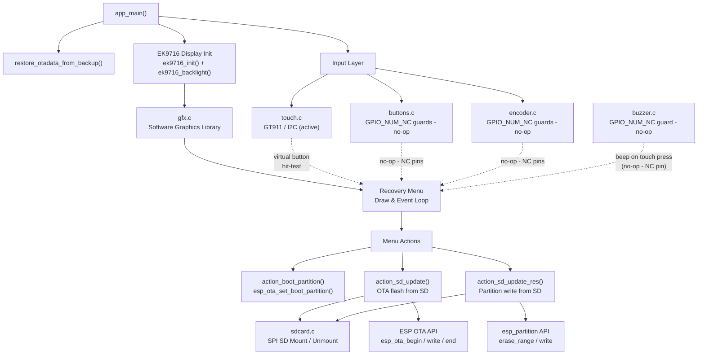
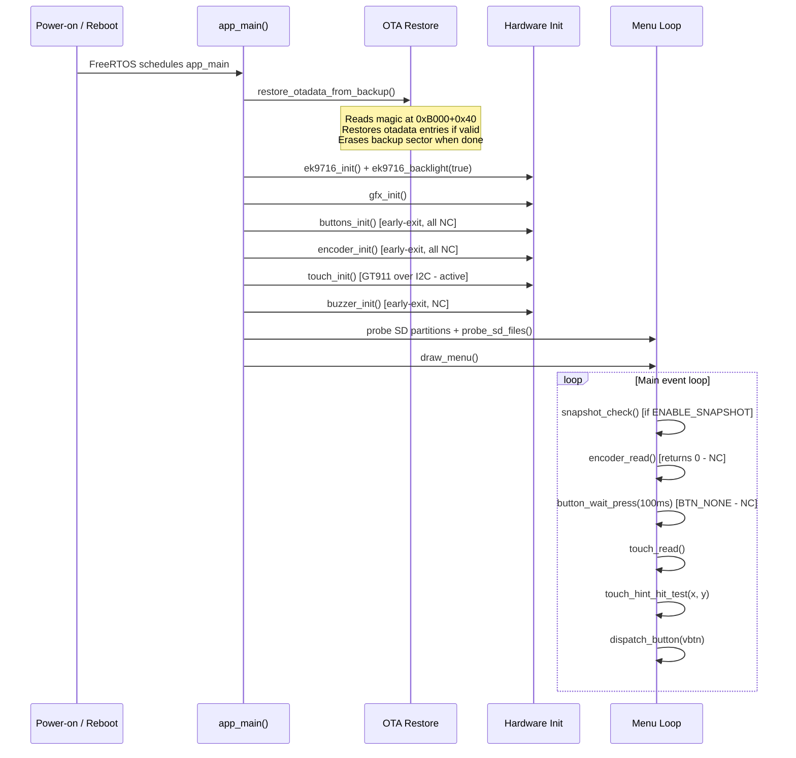
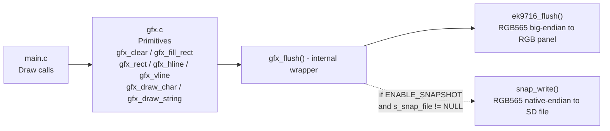
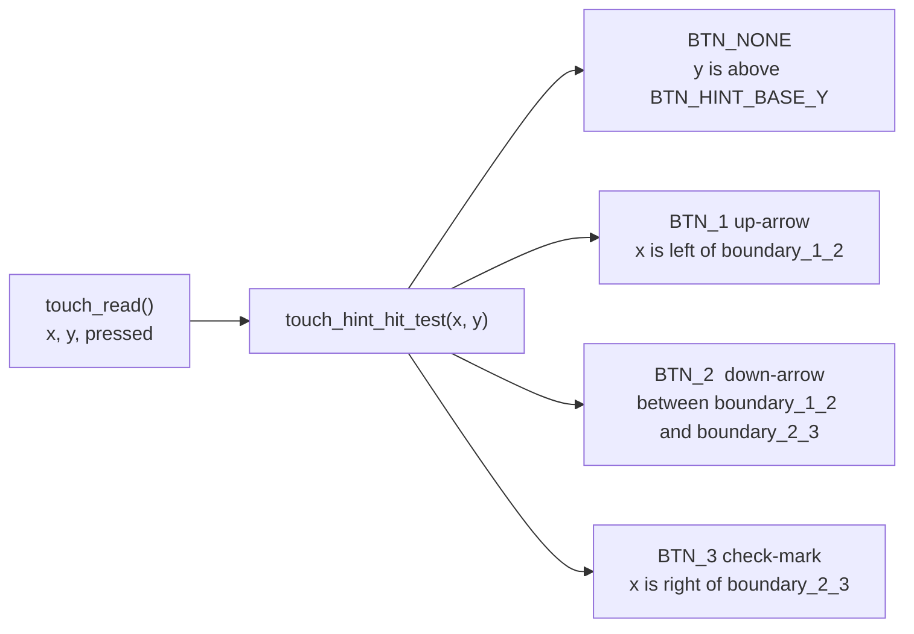
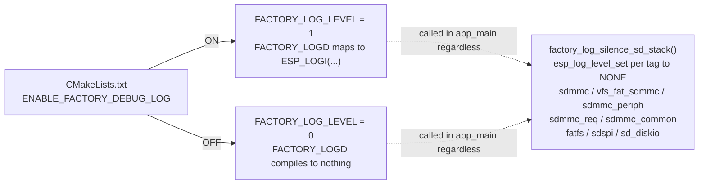
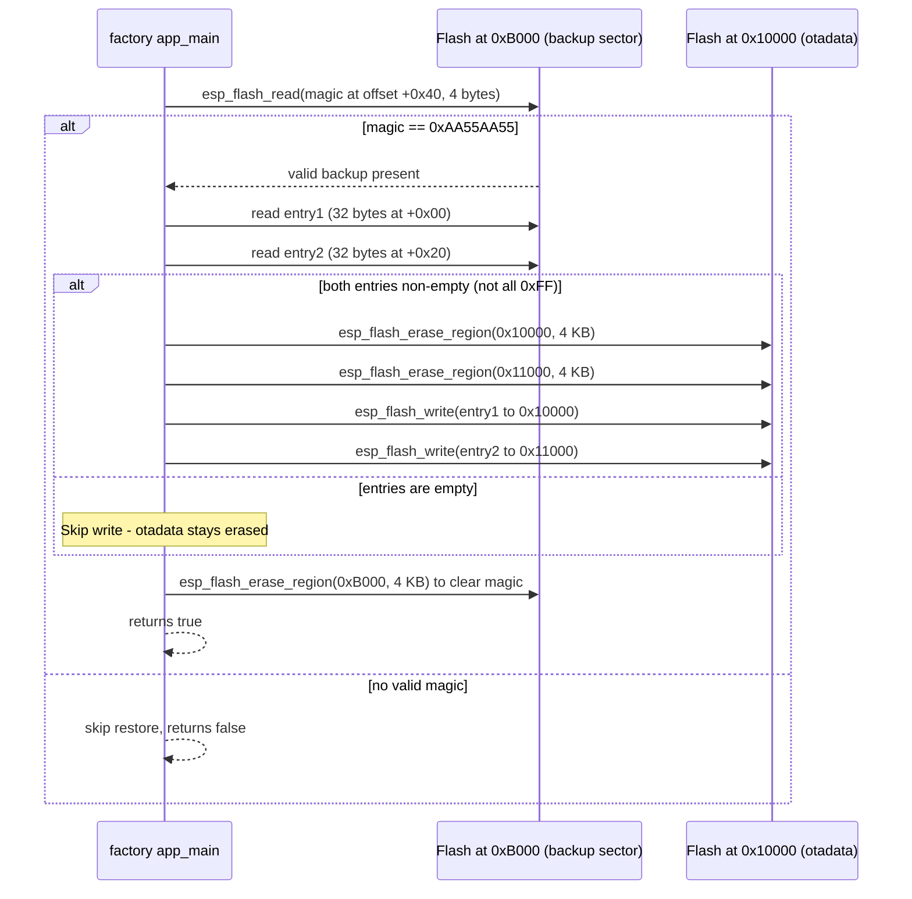
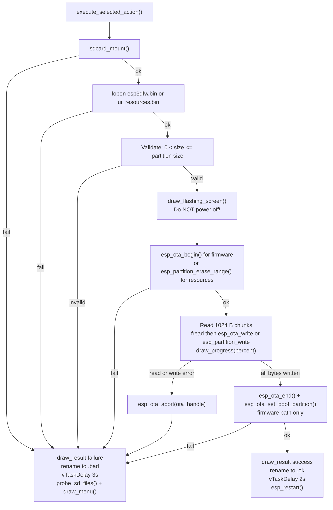
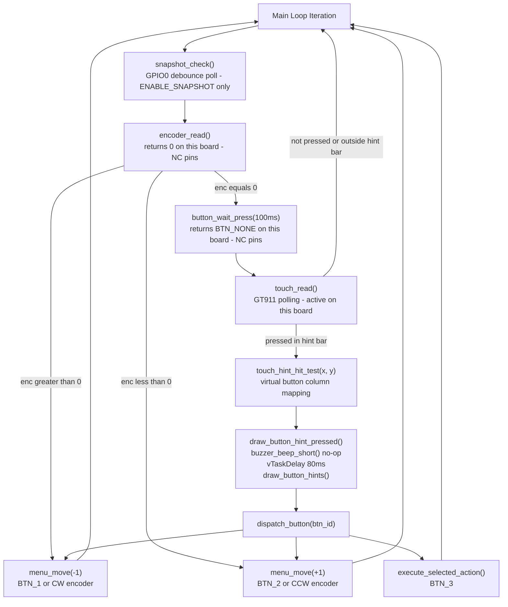

# esp32s3_8048s070c Factory App

## Introduction

The `esp32s3_8048s070c_factory_app` is the recovery partition application for the **ESP32-S3 8048S070C** board — a 800×480 RGB-panel pendant display with capacitive touch (GT911). It runs from a dedicated `factory` flash partition and provides a touch-navigable recovery menu for:

- Selecting which OTA partition (`app0` / `app1`) to boot into
- Flashing updated firmware (`esp3dfw.bin`) from SD card to `app0` or `app1`
- Flashing updated UI resources (`ui_resources.bin`) from SD card to the `ui_resources` partition
- Restoring OTA boot-selection metadata (otadata) that the main firmware backed up before entering recovery

This module follows the same source architecture as all other factory apps in this repository (e.g. [`pibot_pendant_v1_0_factory_app`](pibot_pendant_v1_0_factory_app.md), [`factory_app`](factory_app.md)), but has several board-specific adaptations:

- **Touch-only navigation**: all physical button, encoder, and buzzer pins are `GPIO_NUM_NC` — their drivers are compiled in and null-safe, but no-op at runtime.
- **EK9716 RGB parallel display driver** (not SPI like `st7796` or `ili9341` used on other boards).
- **GT911 I2C capacitive touchscreen** (not resistive XPT2046 used on some other boards).
- **No custom bootloader hook**: `ENABLE_CUSTOM_BOOT_LOADER` is OFF. Recovery is triggered exclusively via the `[ESP444]FACTORY` command in the main firmware, which writes the OTA backup and switches the boot partition programmatically before rebooting.

---

## Architecture Overview



---

## Module Structure

```
boards/esp32s3_8048s070c/Factory/
├── main/
│   ├── main.c              — Recovery menu, OTA logic, input dispatch, main loop
│   ├── gfx.c / gfx.h       — Lightweight software graphics primitives
│   ├── touch.c / touch.h   — GT911 capacitive touch polling driver
│   ├── buttons.c / buttons.h  — GPIO button driver (null-safe for NC pins)
│   ├── buzzer.c / buzzer.h    — Bit-bang buzzer driver (null-safe for NC pin)
│   ├── encoder.c / encoder.h  — PCNT rotary encoder driver (null-safe for NC pins)
│   ├── sdcard.c / sdcard.h    — SPI SD card mount / unmount (FAT over VFS)
│   └── factory_log.h       — Compile-time-gated debug logging macros
└── tools/
    ├── flash_all.py        — Complete board flash (bootloader + partitions + factory ± firmware)
    └── flash_factory.py    — Flash factory partition only
```

---

## Component Details

### `main.c` — Recovery Application Entry Point

`app_main()` is the FreeRTOS application entry point. Its startup sequence initialises hardware and the recovery menu, then runs the main input/dispatch loop.

#### Startup Sequence



#### Menu System

The recovery menu is built dynamically at startup by probing available flash partitions and SD card contents:

| Menu Item | Action | Show Condition |
|-----------|--------|----------------|
| `Boot app0` | `esp_ota_set_boot_partition` + restart | Always |
| `Boot app1` | `esp_ota_set_boot_partition` + restart | Only if `app1` exists in flash |
| `SD -> app0` | Flash `esp3dfw.bin` to `app0` via OTA API | Always |
| `SD -> app1` | Flash `esp3dfw.bin` to `app1` via OTA API | Only if `app1` exists |
| `SD -> resources` | Flash `ui_resources.bin` to `ui_resources` partition | Always |

The selected item is highlighted with a blue outline box and bright-blue text. Navigation is performed through three virtual button icons drawn in a bar at the screen bottom.

#### Screen Layout

```
┌────────────────────────────────────────────────────────────────────┐ y=0
│             Recovery vX.Y.Z                (header)                │ y=13
│ ───────────────────────────────────────────────────────────────── │ y=40
│             Active: app0                   (OTA status)            │ y=45
│  SD: FW  RES                               (SD indicators)         │ y=68
│ ───────────────────────────────────────────────────────────────── │ y=88
│  ┌──────────────────────────────────────┐  MENU_START_Y=94          │
│  │  Boot app0                           │  MENU_ITEM_H=34           │
│  ├──────────────────────────────────────┤                           │
│  │▓▓  SD -> app0  (selected)  ▓▓▓▓▓▓▓▓│  blue highlight            │
│  ├──────────────────────────────────────┤                           │
│  │  SD -> resources                     │                           │
│  └──────────────────────────────────────┘                           │
│ ───────────────────────────────────────────────────────────────── │ STATUS_Y-7
│             Power off to cancel            (footer / status)       │ STATUS_Y
│ ───────────────────────────────────────────────────────────────── │ BTN_HINT_BASE_Y
│      ↑ (BTN_1)     ↓ (BTN_2)     ✓ (BTN_3)   (virtual buttons)   │
└────────────────────────────────────────────────────────────────────┘ y=479
 x=0                   x=400                  x=799
```

> **Orientation note**: the physical panel is 800×480 landscape, but the pendant enclosure mounts it rotated 90°. The gfx/LVGL logical canvas is therefore treated as portrait internally (matching the reference design used for other 480-wide boards). Layout constants are scaled ×0.85 from those reference boards to match this board's wider physical canvas.

---

### `gfx.c` — Graphics Library

A lightweight software renderer that writes directly to the EK9716 display via `ek9716_flush()`. No full framebuffer is held in RAM; each drawing call immediately pushes pixels to the panel. A single static `line_buf[SCREEN_WIDTH]` provides a row-level scratch buffer to batch horizontal runs.



All pixel data is byte-swapped from native to big-endian RGB565 before being sent to `ek9716_flush()` (the panel's wire format). `snap_write()` un-swaps back to native endian for the file format.

#### Snapshot Feature (`ENABLE_SNAPSHOT`)

When compiled with `ENABLE_SNAPSHOT`, every `gfx_flush()` call also writes into an open snapshot file on the SD card:

- `gfx_snapshot_begin(filepath)` — opens the file, writes an 8-byte header (`uint32_t width LE` + `uint32_t height LE`), then pre-fills the pixel area with zeros.
- Any subsequent `gfx_flush()` call seeks to the correct file offset and writes that region.
- `gfx_snapshot_end()` — closes and finalises the file.
- `gfx_snapshot_is_capturing()` — returns `true` while a capture is in progress.
- In the main loop, `snapshot_check()` debounce-polls GPIO0 (the BOOT button) and calls `snapshot_take()` on press. `snapshot_take()` triggers a full screen redraw so the capture file contains a complete frame.
- Files are named `snap000.raw`, `snap001.raw`, … with the counter persisting across presses within a single boot.

**Snapshot file format**:
```
Offset  Size    Content
0       4       uint32_t width  (little-endian)
4       4       uint32_t height (little-endian)
8       W×H×2   RGB565 pixels, native endian, row-major
```

---

### `touch.c` / `touch.h` — Touch Driver

Thin polling wrapper over the shared [`touch_drivers`](touch_drivers.md) `touch_gt911` component, using the same hardware paths as the main firmware's `board_init.c`.

```c
typedef struct {
    bool    pressed;
    int16_t x;   // calibrated screen coordinates (0 … SCREEN_WIDTH-1)
    int16_t y;   // calibrated screen coordinates (0 … SCREEN_HEIGHT-1)
} touch_point_t;
```

**Coordinate scaling**: the GT911's `x_max` / `y_max` read back from device registers does not match the physical 800×480 panel resolution on this hardware. Raw coordinates are rescaled in `touch_read()`:

```c
pt.x = data.x * SCREEN_WIDTH  / touch_gt911_get_x_max();
pt.y = data.y * SCREEN_HEIGHT / touch_gt911_get_y_max();
```

#### Virtual Button Hit-Testing

`touch_hint_hit_test(x, y)` maps a touch coordinate to one of three virtual navigation buttons. The column boundaries are the midpoints between the actual icon centre positions (`BTN_HINT_CX1`, `BTN_HINT_CX2`, `BTN_HINT_CX3`) rather than thirds of the screen width — the icons are clustered around the horizontal centre of the wide landscape canvas, so equal-width thirds would misalign the tap targets.



On a confirmed touch in the hint bar:
1. `draw_button_hint_pressed(vbtn)` redraws the icon in `BTN_PRESSED_COLOR` (violet).
2. `buzzer_beep_short()` is called (no-op on this board).
3. 80 ms delay for visual feedback.
4. `draw_button_hints()` redraws the bar in its normal colours.
5. `dispatch_button(vbtn)` executes the mapped action.

---

### `buttons.c` — Button Driver

Standard active-low GPIO input driver with 50 ms software debounce and release detection. The `pin_bit()` helper returns `0ULL` for any `GPIO_NUM_NC` pin, preventing invalid bitmask construction. `buttons_init()` exits immediately when the composite pin mask is zero (all three buttons are NC on this board), so no GPIO is misconfigured.

`button_wait_press(timeout_ms)`:
- Polls in 20 ms increments up to `timeout_ms`.
- On a press, waits an additional 50 ms debounce, re-checks, then waits for release + 50 ms release debounce.
- Called with `timeout_ms = 100` in the main loop to remain encoder-responsive without blocking.

---

### `encoder.c` — Rotary Encoder Driver

Uses the ESP32 PCNT (Pulse Counter) peripheral for full-quadrature decoding. `ENCODER_A_PIN` and `ENCODER_B_PIN` are both `GPIO_NUM_NC` on this board; `encoder_init()` skips PCNT setup and `encoder_read()` returns `0` unconditionally.

When pins are populated on other boards:
- High/low PCNT limits of ±1000 prevent counter wrap-around.
- 1000 ns glitch filter matches the main firmware setting.
- Quadrature decoding: Channel A edges on pin A, level on pin B; Channel B edges on pin B, level on pin A.
- 4 pulses per detent (`PULSES_PER_DETENT`).
- Counter is cleared after each non-zero read; any sub-detent remainder is discarded (acceptable at ~100 ms polling intervals).
- CW rotation → `menu_move(-1)` (up); CCW → `menu_move(+1)` (down).

---

### `buzzer.c` — Buzzer Driver

Bit-banged square-wave output at 2700 Hz for 40 ms using `esp_rom_delay_us()`. `BUZZER_PIN` is `GPIO_NUM_NC` on this board; both `buzzer_init()` and `buzzer_beep_short()` return early without touching GPIO. When populated on other boards, the buzzer provides audible confirmation feedback on virtual button taps.

---

### `sdcard.c` — SD Card Driver

SPI-based SD card using ESP-IDF's `esp_vfs_fat_sdspi_mount()` / `esp_vfs_fat_sdcard_unmount()`. A static `spi_bus_inited` flag ensures the SPI bus is initialised only once, even across repeated mount / unmount cycles. The SPI bus is intentionally kept initialised after `sdcard_unmount()` to avoid interfering with the TFT display's SPI bus.

Mount configuration highlights:
- `format_if_mount_failed = false` — never format an unrecognised card.
- `max_files = 4` — sufficient for firmware read + rename operations.
- `disk_status_check_enable = true` — detect card removal.

---

### `factory_log.h` — Debug Logging Gate



`ESP_LOGW` / `ESP_LOGE` are always active regardless of `FACTORY_LOG_LEVEL`. ESP-IDF internal startup logs (emitted before `app_main()`) are silenced by a separate `sdkconfig.prod_log` overlay applied at build time when `ENABLE_FACTORY_DEBUG_LOG` is OFF. `factory_log_silence_sd_stack()` mutes the SD/FAT driver tags at runtime; in debug builds (`FACTORY_LOG_LEVEL=1`) the sdkconfig ceiling is raised to INFO for everything, which would otherwise flood output with SD stack internals.

---

## OTA Backup / Restore Mechanism

This board does not use a custom bootloader hook. Recovery is entered when the main firmware executes the `[ESP444]FACTORY` command (`esp444.cpp`), which:

1. Backs up the two 32-byte otadata entries to `OTADATA_BACKUP_OFFSET` (0xB000).
2. Writes the magic word `0xAA55AA55` at `OTADATA_BACKUP_OFFSET + 0x40`.
3. Calls `esp_ota_set_boot_partition(factory)` and reboots.

On every startup the factory app checks for and processes this backup before touching the display:



> ⚠️ **Critical constraints for `OTADATA_BACKUP_OFFSET` (0xB000)**:
> - Must be after the bootloader end.
> - Must be before the partition table (`CONFIG_PARTITION_TABLE_OFFSET = 0xC000`).
> - Must be 4 KB-aligned.
> - Must not overlap any partition.
>
> The factory `sdkconfig` **must** set `CONFIG_SPI_FLASH_DANGEROUS_WRITE_ALLOWED=y` because `esp_flash_erase_region(NULL, 0xB000, …)` targets an address below the first data partition, which ESP-IDF rejects by default. This is intentional: the factory app is a privileged recovery tool.
>
> When porting to a new board, recalculate `OTADATA_BACKUP_OFFSET` and update **both** this file and `main/core/commands/esp444.cpp` with the same value.

---

## SD Card Firmware / Resource Flash Flow



**SD probe**: `probe_sd_files()` mounts the SD card, checks for `esp3dfw.bin` and `ui_resources.bin`, sets `sd_has_fw` / `sd_has_res` flags, then unmounts. These flags drive the SD indicator row (`draw_sd_indicators()`), but **not** whether SD menu items appear — those are always present regardless of card content.

**Resources variant check**: when flashing `ui_resources.bin`, the first 16 bytes are inspected for the `ESP3` magic. If present, the embedded 12-byte variant string is logged so firmware/resource mismatches can be caught before the flash completes.

---

## Input Dispatch Flow



---

## Build System

The factory app is an independent ESP-IDF project rooted at `boards/esp32s3_8048s070c/Factory/`. It shares build-script infrastructure with the main firmware targets on this board; see [`esp32s3_8048s070c_build`](esp32s3_8048s070c_build_scripts.md) for the full variant list and build pipeline.

### Build Commands

```bash
# From the repository root — using the board's build script:
python boards/esp32s3_8048s070c/build_scripts/build_one.py factory
python boards/esp32s3_8048s070c/build_scripts/build_one.py factory --clean

# Check-only (CMake configure without building):
python boards/esp32s3_8048s070c/build_scripts/build_one.py factory --check

# Directly with idf.py (from the factory app directory):
cd boards/esp32s3_8048s070c/Factory
idf.py -B build/factory build
idf.py -B build/factory flash monitor
```

### Key CMake Build Flags

| Flag | Effect |
|------|--------|
| `ENABLE_FACTORY_DEBUG_LOG` | Sets `FACTORY_LOG_LEVEL=1`; enables `FACTORY_LOGD` → `ESP_LOGI` output |
| `ENABLE_SNAPSHOT` | Adds GPIO0 snapshot capture; requires SD card accessible during use |
| `ENABLE_CUSTOM_BOOT_LOADER` | **Always OFF** on this board — no bootloader hook needed |

---

## Flash Tools

### `tools/flash_all.py` — Complete Board Flash

Orchestrates a full or partial flash using `esptool` via `subprocess`. Three mutually exclusive modes:

| Mode | Command | Files Flashed |
|------|---------|---------------|
| `--recovery` | First-time / replacement setup | `bootloader.bin` + `partitions.bin` + `factory.bin` |
| `--full --fw <bin>` | Complete image including firmware | All of `--recovery` + firmware at `app0` |
| `--fw <bin>` | Dev iteration: firmware only | `esp3dfw.bin` at `0x20000` |

Fixed flash address map:

| Offset | Content |
|--------|---------|
| `0x1000` | `bootloader.bin` |
| `0xC000` | `partitions.bin` (44 KB bootloader region — larger than ESP-IDF's default `0x8000`) |
| `0x20000` | `app0` firmware |
| auto-detected | `factory.bin` (parsed from `partitions*.csv`; defaults to `0x7A0000` for 8 MB layouts) |

Port is auto-detected by scanning for CP210x, CH340, CH910, FTDI USB-UART descriptions; `--port` overrides.

### `tools/flash_factory.py` — Factory Partition Only

Useful for updating the recovery app without disturbing the main firmware. Reads the factory partition offset from the partition table CSV automatically.

```bash
python flash_factory.py                           # auto-detect port and offset
python flash_factory.py --port /dev/ttyUSB0      # specify port
python flash_factory.py --port COM3 --offset 0x7A0000   # manual offset
python flash_factory.py --bin custom_factory.bin          # custom binary
```

---

## Relationship to Other Modules

| Module | Relationship |
|--------|-------------|
| [`esp32s3_8048s070c_bsp`](esp32s3_8048s070c_bsp.md) | Shares the same physical hardware (EK9716 panel, GT911 touch, `hw_config.h` pin definitions), but the factory app drives peripherals directly without LVGL |
| [`pibot_pendant_v1_0_factory_app`](pibot_pendant_v1_0_factory_app.md) | Primary reference design — identical menu architecture and OTA backup mechanism; differs in ILI9341 SPI display, resistive XPT2046 touch, and physical buttons / encoder / buzzer |
| [`factory_app`](factory_app.md) | Cross-board pattern documentation — covers the shared source layout common to all factory apps |
| [`esp32s3_8048s070c_build`](esp32s3_8048s070c_build_scripts.md) | Build scripts shared by this factory app and all main firmware variants for this board |
| [`touch_drivers`](touch_drivers.md) | `touch_gt911` component reused as-is from `hardware/common/drivers/touch_gt911` |
| [`display_drivers_rgb`](display_drivers_rgb.md) | EK9716 RGB parallel panel driver referenced by `gfx.c` via `ek9716_flush()` |

---

## Key Constants Reference

| Constant | Value | Description |
|----------|-------|-------------|
| `OTADATA_OFFSET` | `0x10000` | OTA data partition flash address |
| `OTADATA_SECTOR_SIZE` | `0x1000` | Size of each otadata sector (4 KB) |
| `OTADATA_ENTRY_SIZE` | `32` | Size of one otadata entry in bytes |
| `OTADATA_BACKUP_OFFSET` | `0xB000` | Backup sector address (between bootloader and partition table) |
| `BACKUP_MAGIC_OFFSET` | `0x40` | Offset within backup sector for the magic word |
| `BACKUP_MAGIC` | `0xAA55AA55` | Magic value confirming a valid backup is present |
| `SCREEN_WIDTH` | `800` | Logical screen width in pixels |
| `SCREEN_HEIGHT` | `480` | Logical screen height in pixels |
| `FONT_WIDTH` | `12` | Glyph width in pixels (font12x24) |
| `FONT_HEIGHT` | `24` | Glyph height in pixels (font12x24) |
| `MENU_START_Y` | `94` | Y-coordinate of the first menu item |
| `MENU_ITEM_H` | `34` | Height of each menu item row in pixels |
| `BTN_CIRCLE_R` | `30` | Radius of virtual button circle icons |
| `BEEP_FREQ_HZ` | `2700` | Buzzer output frequency |
| `BEEP_DURATION_MS` | `40` | Buzzer beep duration |
| `DEBOUNCE_MS` | `50` | Button press / release debounce period |
| `PULSES_PER_DETENT` | `4` | PCNT raw pulses per encoder detent |
| `FW_FILENAME` | `/sdcard/esp3dfw.bin` | Firmware binary expected on the SD card |
| `RES_FILENAME` | `/sdcard/ui_resources.bin` | UI resources binary expected on the SD card |
| `FW_OK_FILENAME` | `/sdcard/esp3dfw.ok` | Firmware binary renamed to on successful flash |
| `FW_BAD_FILENAME` | `/sdcard/esp3dfw.bad` | Firmware binary renamed to on failed flash |


## Documents de conception (depot)

- [factory_app_technical_doc.md](https://github.com/luc-github/Pibot-cnc-pendant-firmware/blob/main/docs/Factory/factory_app_technical_doc.md)
