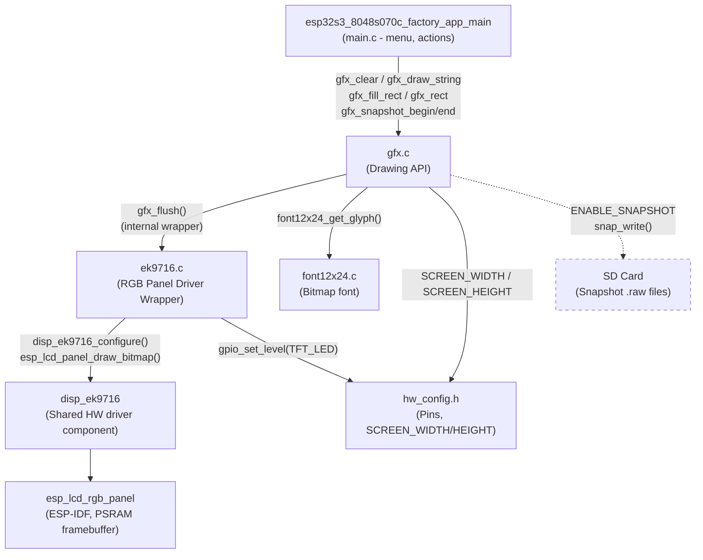
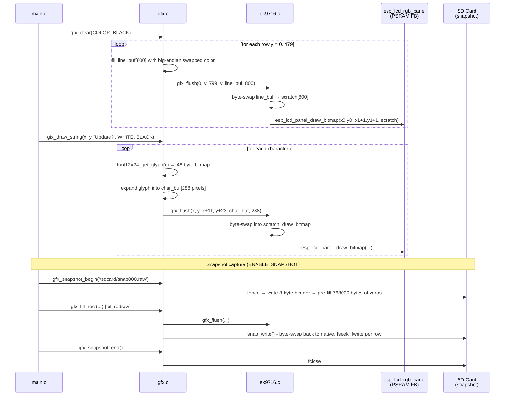
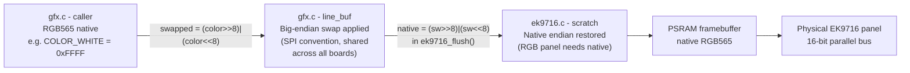
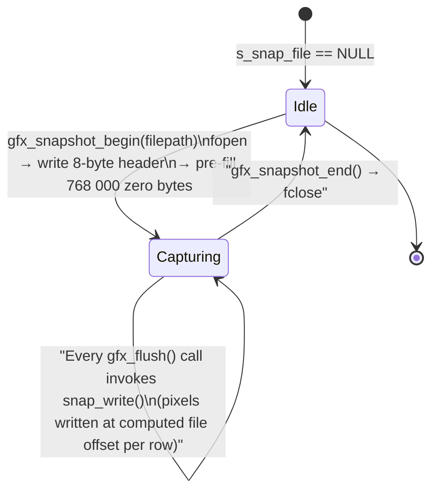
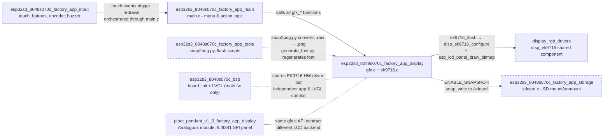

# esp32s3_8048s070c_factory_app_display

Display subsystem for the ESP32-S3 8048S070C board's Factory application. Provides a lightweight software graphics API (`gfx.c`) backed by a thin EK9716 RGB-parallel panel driver (`ek9716.c`), driving an 800×480 7-inch capacitive-touch display during factory test, firmware flashing, and SD-card update operations.

---

## Table of Contents

1. [Module Overview](#module-overview)
2. [Architecture](#architecture)
3. [Component Descriptions](#component-descriptions)
   - [gfx — Graphics API](#gfx--graphics-api)
   - [ek9716 — RGB Panel Driver Wrapper](#ek9716--rgb-panel-driver-wrapper)
   - [font12x24 — Bitmap Font](#font12x24--bitmap-font)
   - [hw_config — Hardware Constants](#hw_config--hardware-constants)
4. [Data Flow](#data-flow)
5. [Color Pipeline & Byte-Swap Convention](#color-pipeline--byte-swap-convention)
6. [Snapshot Feature](#snapshot-feature)
7. [API Reference](#api-reference)
8. [Key Design Decisions](#key-design-decisions)
9. [Dependencies and Related Modules](#dependencies-and-related-modules)

---

## Module Overview

This module covers two source files and their headers:

| File | Role |
|------|------|
| `Factory/main/gfx.c` + `gfx.h` | Public drawing API: clear, text, lines, rectangles, snapshot |
| `Factory/main/ek9716.c` + `ek9716.h` | RGB-parallel panel driver: init, backlight, pixel flush |
| `Factory/main/font12x24.c` + `font12x24.h` | Auto-generated 12×24 bitmap font (ASCII 0x20–0x7E) |
| `Factory/main/hw_config.h` | Board-specific pin definitions and screen dimensions |

**Hardware target:** ESP32-S3, 800×480 EK9716 RGB panel (native landscape, 16-bit parallel), GT911 capacitive touch (I²C), SD card (SPI).

**Context:** The Factory app is a standalone ESP-IDF application flashed to a dedicated factory partition. It runs before the main pendant firmware and provides a recovery/update menu. This display module renders that menu entirely in C with no LVGL dependency — see [esp32s3_8048s070c_factory_app_main](esp32s3_8048s070c_factory_app_main.md) for the menu logic that calls these functions.

---

## Architecture



---

## Component Descriptions

### gfx — Graphics API

**File:** `boards/esp32s3_8048s070c/Factory/main/gfx.c`

The public drawing surface for the Factory application. All draw calls follow the same pattern:

1. Apply screen clipping.
2. Build a row of big-endian RGB565 pixels into a static 800-pixel line buffer.
3. Call the internal `gfx_flush()` wrapper, which forwards to `ek9716_flush()` and, when snapshot capture is active, also calls `snap_write()`.

**Static resources:**

```c
static uint16_t line_buf[SCREEN_WIDTH];   /* 800 × 2 = 1 600 bytes, reused per row */
static FILE    *s_snap_file = NULL;       /* NULL when not capturing (ENABLE_SNAPSHOT only) */
```

`gfx_init()` is intentionally empty — initialization is owned by the panel driver (`ek9716_init()`), which is called from `main.c` before `gfx_init()`.

---

### ek9716 — RGB Panel Driver Wrapper

**File:** `boards/esp32s3_8048s070c/Factory/main/ek9716.c`

A thin wrapper over the shared `hardware/drivers_video_rgb/disp_ek9716` component (the same driver used by the main pendant firmware). Key responsibilities:

- Configure the `esp_lcd_rgb_panel` with the board's exact timing parameters (HSYNC, VSYNC, DE, PCLK, 16 data pins).
- Control the backlight GPIO (on/off only — no PWM dimming needed for a recovery menu).
- Receive big-endian RGB565 pixel data from `gfx.c`, byte-swap it into native order, and write it to the PSRAM-backed framebuffer via `esp_lcd_panel_draw_bitmap()`.

**Static resources:**

```c
static esp_lcd_panel_handle_t s_panel = NULL;
static uint16_t scratch[SCREEN_WIDTH];    /* byte-swap scratch buffer, prevents in-place aliasing */
```

**Key timing parameters for the 7" EK9716 panel:**

| Parameter | Value |
|-----------|-------|
| Pixel clock | 12 MHz |
| Resolution | 800 × 480 |
| HSYNC pulse / back porch / front porch | 30 / 16 / 210 |
| VSYNC pulse / back porch / front porch | 13 / 10 / 22 |
| PCLK active edge | Negative |
| Framebuffer location | PSRAM (`fb_in_psram = true`) |

> **Note on pixel clock:** The comment in `hw_config.h` flags 12 MHz as a first-pass value. If a "clean horizontal screen shift" symptom appears after initial flash, lower the clock (e.g. to 11 MHz or 10 MHz) — this is the same diagnosis pattern observed on `esp32s3_8048s050c`. See [`docs/architecture/display_drivers.md`](https://github.com/luc-github/Pibot-cnc-pendant-firmware/blob/main/docs/architecture/display_drivers.md) for the general orientation/timing diagnosis methodology.

---

### font12x24 — Bitmap Font

**File:** `boards/esp32s3_8048s070c/Factory/main/font12x24.c` (auto-generated)

| Property | Value |
|----------|-------|
| Glyph size | 12 × 24 pixels |
| Bytes per glyph | 48 (24 rows × 2 bytes/row) |
| Character range | ASCII 0x20 (space) – 0x7E (`~`) |
| Bit order | MSB first within each byte |

Characters outside the printable range are substituted with `?` by `gfx_draw_char()`. The font data is compiled into firmware flash, not loaded from SD card. Regenerate with `Factory/tools/generate_font/generate_font.py` (see [esp32s3_8048s070c_factory_app_tools](esp32s3_8048s070c_factory_app_tools.md)).

---

### hw_config — Hardware Constants

**File:** `boards/esp32s3_8048s070c/Factory/main/hw_config.h`

Defines all board-specific hardware configuration consumed by `gfx.c`, `ek9716.c`, `touch.c`, `sdcard.c`, `buttons.c`, and `buzzer.c`.

**Screen constants (used by gfx.c):**

```c
#define SCREEN_WIDTH   800
#define SCREEN_HEIGHT  480
```

Unlike the 4827s043c board (which has a 90° rotated panel mount requiring separate physical/logical dimension constants), this panel is native landscape. Physical and logical dimensions are identical — `DISP_EK9716_ORIENTATION_LANDSCAPE` is a pure passthrough with no `swap_xy` or mirror transforms.

**Peripheral pin summary:**

| Peripheral | Notes |
|------------|-------|
| RGB panel | 16 data pins (GPIO 1–48), HSYNC(39)/VSYNC(40)/DE(41)/PCLK(42), backlight GPIO 2 |
| Touch (GT911) | I²C0, SDA=19, SCL=20, RST=38, INT=NC (interrupt pin not connected by default) |
| SD card | SPI2, MISO=13, MOSI=11, CLK=12, CS=10, 20 MHz |
| Buttons | Not populated (GPIO_NUM_NC) |
| Buzzer | Not populated (GPIO_NUM_NC) |
| Encoder | Not populated (GPIO_NUM_NC) |

---

## Data Flow



---

## Color Pipeline & Byte-Swap Convention

Two byte-swap operations traverse the full stack. They cancel each other out for the display path, but each serves a distinct architectural purpose:



**Why big-endian in `gfx.c`?** The `gfx.c` file is a shared convention used across all boards in this repository. SPI-based panels (ILI9341, ST7796, etc.) transmit bytes MSB-first and the panel controllers expect big-endian RGB565 — so `gfx.c` applies the swap once and all SPI-based board drivers receive the correct byte order transparently. For this RGB parallel board, `ek9716.c` reverses the swap before calling `esp_lcd_panel_draw_bitmap()`.

**Why a separate scratch buffer in `ek9716.c`?** `gfx_hline()`, `gfx_fill_rect()`, and `gfx_clear()` fill `line_buf` once and call `gfx_flush()` once per row with the *same buffer pointer*. If `ek9716_flush()` swapped bytes in place, the second row call would receive already-swapped data and swap it back — producing alternating wrong-color rows. The static `scratch[SCREEN_WIDTH]` in `ek9716.c` writes to a separate buffer, leaving `line_buf` unchanged between rows. This was first identified in the `esp32s3_4827s043c` board's `ili9485.c` implementation.

**Snapshot byte-swap:** `snap_write()` in `gfx.c` receives big-endian data from `gfx.c`'s own line buffer and reverses the swap before writing to file:

```c
uint16_t native = (sw >> 8) | (sw << 8);
fwrite(&native, sizeof(uint16_t), 1, s_snap_file);
```

This ensures the `.raw` snapshot file contains native-endian RGB565 as expected by `snap2png.py`.

---

## Snapshot Feature

The snapshot system captures a binary screenshot to the SD card during a full-screen redraw cycle. It is conditionally compiled with the `ENABLE_SNAPSHOT` preprocessor flag.

### File Format

```
Offset    Size    Content
------    ----    -------
0         4       Width  (uint32_t, little-endian) — always 800
4         4       Height (uint32_t, little-endian) — always 480
8         N×2     Raw RGB565 pixels (native/little-endian, row-major)
                  N = 800 × 480 = 384 000 pixels → 768 000 bytes
Total             768 008 bytes per snapshot
```

### Capture Lifecycle



**Intended usage pattern** (orchestrated by `main.c`):
1. Mount the SD card (via `sdcard_mount()`).
2. Find the next available snapshot filename (`snap_find_next_number()` in `main.c`).
3. Call `gfx_snapshot_begin("/sdcard/snap000.raw")`.
4. Perform a **complete redraw** of the desired screen state — the pre-filled zeros mean any region not redrawn during this window will appear black.
5. Call `gfx_snapshot_end()`.
6. The file is immediately readable on the SD card.

`gfx_snapshot_is_capturing()` lets callers check capture state without accessing the internal `s_snap_file` pointer — used in `main.c` to guard the `snapshot_check()` / `snapshot_take()` functions.

### Converting to PNG

Tool: `boards/esp32s3_8048s070c/Factory/tools/raw2png/snap2png.py`

```bash
# Single file
python snap2png.py snap000.raw

# Batch — all .raw files in current directory
python snap2png.py snap*.raw

# Custom output path
python snap2png.py snap000.raw -o screenshot.png
```

Requires: `pip install Pillow`

The tool decodes native-endian RGB565 → RGB888 (with 5-bit and 6-bit channel expansion) for each pixel and saves a standard PNG. See [esp32s3_8048s070c_factory_app_tools](esp32s3_8048s070c_factory_app_tools.md) for the full tooling inventory.

---

## API Reference

### gfx.h — Public Drawing API

All coordinates are in pixels. Origin (0, 0) is the top-left corner. All functions clip silently to screen bounds (0–799 × 0–479). Colors are RGB565 values expressed in the caller's natural native order.

**Color helpers:**

```c
/* Compose an RGB565 value from 8-bit R, G, B components */
#define GFX_RGB565(r, g, b)  ((uint16_t)(((r & 0xF8) << 8) | ((g & 0xFC) << 3) | (b >> 3)))

/* Predefined constants */
#define COLOR_BLACK     0x0000
#define COLOR_WHITE     0xFFFF
#define COLOR_RED       GFX_RGB565(255,   0,   0)
#define COLOR_GREEN     GFX_RGB565(  0, 255,   0)
#define COLOR_BLUE      GFX_RGB565(  0,   0, 255)
#define COLOR_YELLOW    GFX_RGB565(255, 255,   0)
#define COLOR_CYAN      GFX_RGB565(  0, 255, 255)
#define COLOR_GRAY      GFX_RGB565(128, 128, 128)
#define COLOR_DARKGRAY  GFX_RGB565( 64,  64,  64)
```

**Function reference:**

| Function | Signature | Description |
|----------|-----------|-------------|
| `gfx_init` | `void gfx_init(void)` | No-op placeholder. Must be called after `ek9716_init()`. |
| `gfx_clear` | `void gfx_clear(uint16_t color)` | Fill entire 800×480 screen. Sends 480 flush calls (one per row). |
| `gfx_draw_char` | `void gfx_draw_char(int x, int y, char c, uint16_t fg, uint16_t bg)` | Render one 12×24 px ASCII character. Out-of-range `c` renders as `?`. |
| `gfx_draw_string` | `void gfx_draw_string(int x, int y, const char *str, uint16_t fg, uint16_t bg)` | Render null-terminated string left-to-right; stops at right screen edge. |
| `gfx_hline` | `void gfx_hline(int x, int y, int w, uint16_t color)` | Horizontal line of `w` pixels starting at (`x`, `y`). |
| `gfx_vline` | `void gfx_vline(int x, int y, int h, uint16_t color)` | Vertical line of `h` pixels. **One `gfx_flush()` per pixel row** — avoid very tall lines in performance-critical paths. |
| `gfx_rect` | `void gfx_rect(int x, int y, int w, int h, uint16_t color)` | Hollow rectangle outline; composed of 2 hlines + 2 vlines. |
| `gfx_fill_rect` | `void gfx_fill_rect(int x, int y, int w, int h, uint16_t color)` | Solid filled rectangle; sends `h` row-wide flush calls. |
| `gfx_snapshot_begin` | `bool gfx_snapshot_begin(const char *filepath)` | *(ENABLE_SNAPSHOT)* Open snapshot file, write header, pre-fill with black. Returns `false` if file can't be created or capture already active. |
| `gfx_snapshot_end` | `bool gfx_snapshot_end(void)` | *(ENABLE_SNAPSHOT)* Close snapshot file. Returns `false` if not capturing. |
| `gfx_snapshot_is_capturing` | `bool gfx_snapshot_is_capturing(void)` | *(ENABLE_SNAPSHOT)* Returns `true` while snapshot file is open. |

### ek9716.h — Panel Driver API

```c
esp_err_t ek9716_init(void);
void      ek9716_backlight(bool on);
void      ek9716_flush(uint16_t x0, uint16_t y0, uint16_t x1, uint16_t y1,
                        const uint16_t *data, size_t len);
```

`ek9716_init()` must be called from `app_main()` before any `gfx_*` call. `ek9716_flush()` is an internal implementation detail called only by `gfx.c`; it is not intended to be called directly from `main.c`. The `len` parameter is a **pixel count**, not a byte count.

---

## Key Design Decisions

### Native Landscape — No Physical/Logical Split

The EK9716 panel is mounted in its natural landscape orientation. `SCREEN_WIDTH` = `TFT_PANEL_PHYSICAL_WIDTH` = 800 and `SCREEN_HEIGHT` = `TFT_PANEL_PHYSICAL_HEIGHT` = 480. `DISP_EK9716_ORIENTATION_LANDSCAPE` applies no `swap_xy` or mirror — it is a pure passthrough. This is in contrast to `esp32s3_4827s043c`, where the 4.3" panel is rotated 90° on the PCB and requires a physical/logical dimension split. See [`docs/architecture/display_drivers.md`](https://github.com/luc-github/Pibot-cnc-pendant-firmware/blob/main/docs/architecture/display_drivers.md) for the full orientation and rotation math model.

### PSRAM Framebuffer (RGB Parallel Interface)

`esp_lcd_rgb_panel` requires a persistent framebuffer in PSRAM (`fb_in_psram = true`). The DMA engine continuously scans this buffer to drive the RGB parallel bus — there is no "send region" command as with SPI panels. `esp_lcd_panel_draw_bitmap()` copies new pixels into the PSRAM buffer, and the display picks up changes on the next frame scan. This also means a single framebuffer (no double-buffering) is used to keep PSRAM consumption within bounds.

### Shared `gfx.c` Convention Across All Boards

The `gfx.c` API and its big-endian internal convention are byte-for-byte identical across every board in this repository that has a factory app display module (pibot_pendant_v1_0, esp32s3_4827s043c, esp32s3_8048s043c, esp32s3_8048s050c, etc.). The only board-specific piece is the `*_flush()` backend (`ek9716_flush()` here vs `st7262_flush()`, `ili9341_flush()`, etc. elsewhere). This portability is intentional and should be preserved when porting to new boards.

### No LVGL Dependency

The Factory app renders its entire menu using only this raw `gfx` API. This eliminates the LVGL initialization overhead, keeps binary size minimal for the factory partition, and avoids FreeRTOS task constraints (LVGL is single-threaded on Core 1 in the main firmware). The BSP component (`esp32s3_8048s070c_bsp`) that configures LVGL for the main firmware is an entirely separate component not linked into the Factory app binary.

---

## Dependencies and Related Modules



| Module | Relationship |
|--------|-------------|
| [esp32s3_8048s070c_factory_app_main](esp32s3_8048s070c_factory_app_main.md) | **Consumer.** Calls all `gfx_*` functions to render the factory recovery menu, progress bars, and status messages. |
| [esp32s3_8048s070c_factory_app_storage](esp32s3_8048s070c_factory_app_storage.md) | **Runtime dependency (conditional).** When `ENABLE_SNAPSHOT` is active, the SD card must be mounted before `gfx_snapshot_begin()` is called. |
| [esp32s3_8048s070c_factory_app_input](esp32s3_8048s070c_factory_app_input.md) | **Peer.** Touch events drive menu selection and redraw requests in `main.c`, not directly in this module. |
| [esp32s3_8048s070c_factory_app_tools](esp32s3_8048s070c_factory_app_tools.md) | **Development tooling.** `snap2png.py` converts `.raw` snapshot files to PNG; `generate_font.py` regenerates `font12x24.c`. |
| [display_rgb_drivers](display_rgb_drivers.md) | **Hardware driver.** Provides the shared `disp_ek9716` component (RGB panel config + `esp_lcd_rgb_panel` init) consumed by `ek9716.c`. |
| [esp32s3_8048s070c_bsp](esp32s3_8048s070c_bsp.md) | **Shares hardware, different context.** The BSP configures the same EK9716 panel for use with LVGL in the main firmware; the factory app does not use the BSP. |
| [pibot_pendant_v1_0_factory_app_display](pibot_pendant_v1_0_factory_app_display.md) | **Analogous module.** PiBot Pendant v1.0 factory display (ILI9341 SPI, 240×320). Same `gfx.c` API contract; different `ili9341.c` backend and screen dimensions. |
