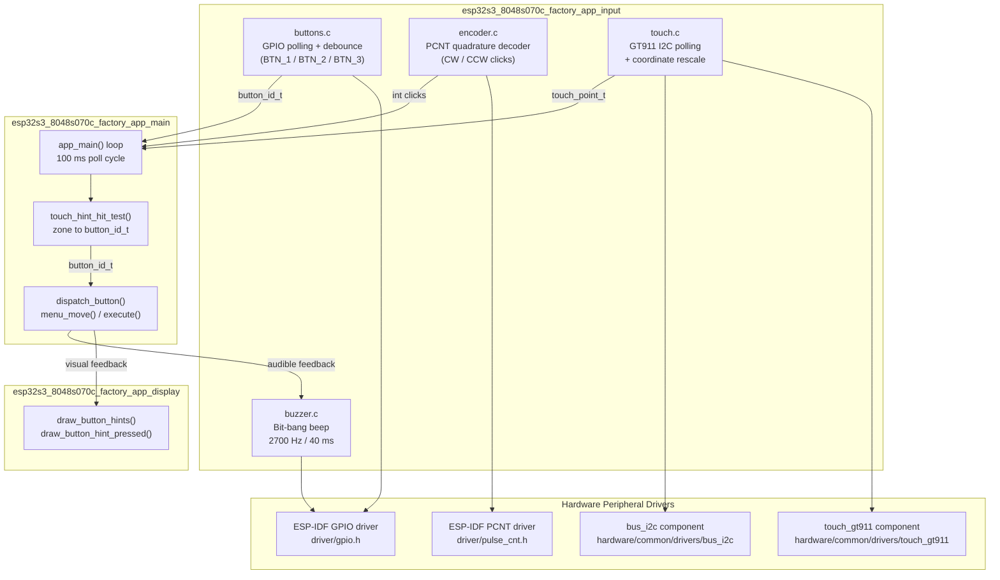
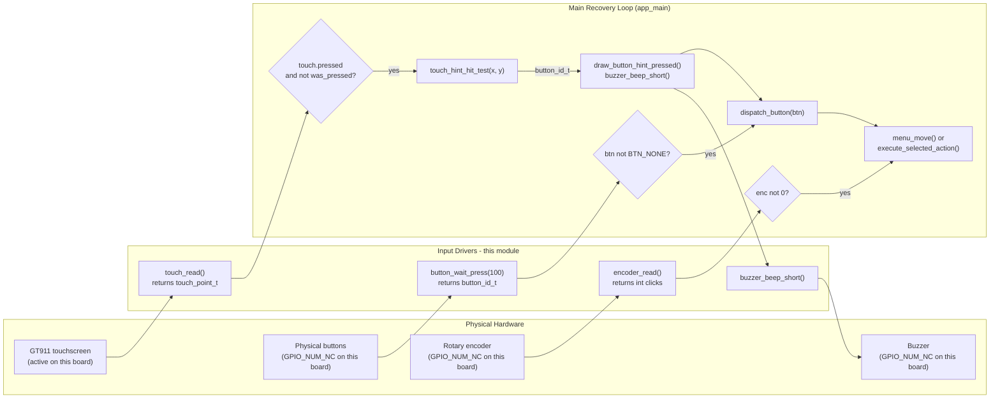
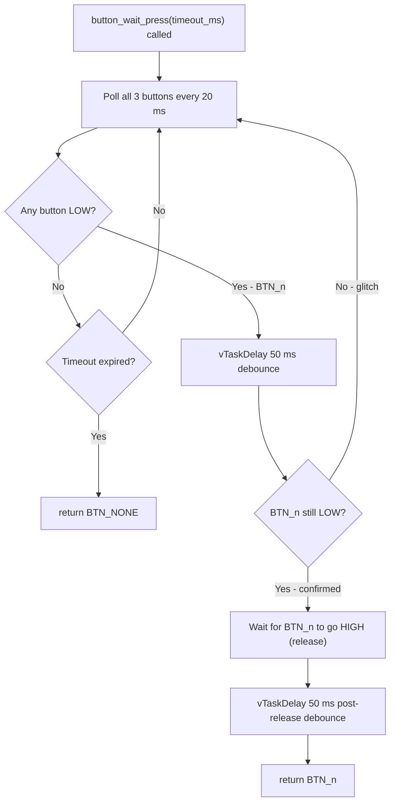
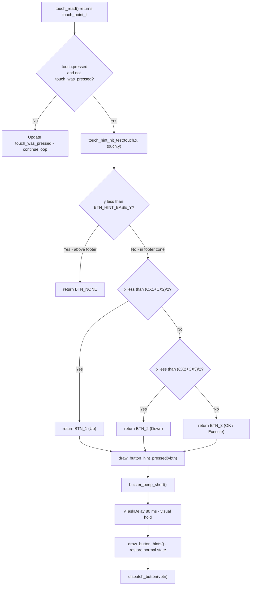
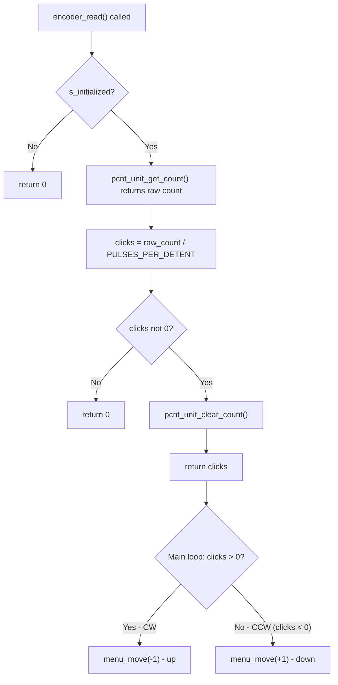
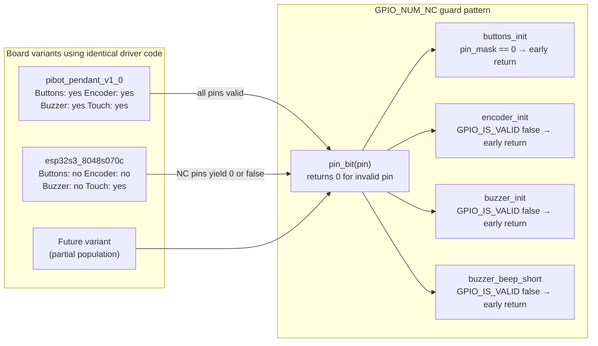
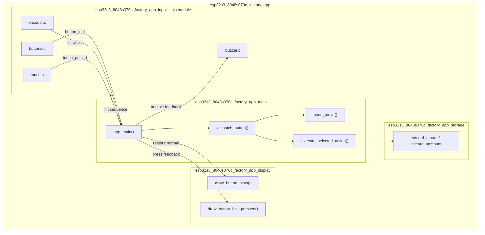

# ESP32S3-8048S070C Factory App — Input Module

The `esp32s3_8048s070c_factory_app_input` module provides all human-interface input handling for the ESP32-S3 8048S070C board's factory/recovery application. It consolidates four independent input channels — physical buttons, rotary encoder, capacitive touch, and buzzer feedback — into a polled, non-blocking interface consumed by the main recovery loop.

> **Board context:** The ESP32-S3 8048S070C is a 7-inch 800×480 RGB panel board with a GT911 capacitive touchscreen. On this specific hardware variant, `BUTTON_n_PIN`, `ENCODER_A/B_PIN`, and `BUZZER_PIN` are all defined as `GPIO_NUM_NC` — the buttons, encoder, and buzzer are **electrically absent**. Touch is the sole active input. All drivers include `GPIO_NUM_NC` guards, so they degrade gracefully to no-ops rather than faulting, and the code stays portable across board variants that do populate these peripherals.

---

## Table of Contents

1. [Module Structure](#1-module-structure)
2. [Architecture Overview](#2-architecture-overview)
3. [Component Reference](#3-component-reference)
   - 3.1 [Buttons (`buttons.c`)](#31-buttons-buttonsc)
   - 3.2 [Rotary Encoder (`encoder.c`)](#32-rotary-encoder-encoderc)
   - 3.3 [Capacitive Touch (`touch.c` / `touch.h`)](#33-capacitive-touch-touchc--touchh)
   - 3.4 [Buzzer (`buzzer.c`)](#34-buzzer-buzzerc)
4. [Data Flow](#4-data-flow)
5. [Process Flows](#5-process-flows)
   - 5.1 [Button Debounce & Release Flow](#51-button-debounce--release-flow)
   - 5.2 [Touch-to-Virtual-Button Mapping](#52-touch-to-virtual-button-mapping)
   - 5.3 [Encoder Read Flow](#53-encoder-read-flow)
6. [Cross-Board Compatibility (GPIO_NUM_NC Guards)](#6-cross-board-compatibility-gpio_num_nc-guards)
7. [Integration with the Factory App](#7-integration-with-the-factory-app)
8. [Hardware Configuration Reference](#8-hardware-configuration-reference)

---

## 1. Module Structure

```
boards/esp32s3_8048s070c/Factory/main/
├── buttons.c        # GPIO-based 3-button driver with debounce
├── encoder.c        # Hardware PCNT rotary encoder (quadrature)
├── touch.c          # GT911 I2C capacitive touch (polling, rescaled)
├── touch.h          # touch_point_t type + public API
└── buzzer.c         # Bit-bang square-wave buzzer feedback
```

This module is a child of [`esp32s3_8048s070c_factory_app`](esp32s3_8048s070c_factory_app.md). Its output feeds exclusively into the main recovery menu loop documented in [`esp32s3_8048s070c_factory_app_main`](esp32s3_8048s070c_factory_app_main.md). The analogous module on the PiBot pendant board is [`pibot_pendant_v1_0_factory_app_input`](pibot_pendant_v1_0_factory_app_input.md) — the driver code is architecturally identical; only `hw_config.h` pin assignments differ.

---

## 2. Architecture Overview



---

## 3. Component Reference

### 3.1 Buttons (`buttons.c`)

A lightweight GPIO input driver for up to three physical buttons. All buttons are active-LOW with internal pull-ups enabled.

#### API

| Function | Signature | Description |
|---|---|---|
| `buttons_init` | `void buttons_init(void)` | Configures GPIO pins as inputs with pull-ups. No-op if all pins are `GPIO_NUM_NC`. |
| `button_is_pressed` | `bool button_is_pressed(button_id_t btn)` | Instantaneous non-blocking level check. Returns `true` when the GPIO reads LOW. |
| `button_wait_press` | `button_id_t button_wait_press(uint32_t timeout_ms)` | Blocking poll: waits for a press+release cycle with debounce. Returns `BTN_NONE` on timeout. Pass `0` for infinite wait. |
| `pin_bit` *(internal)* | `static uint64_t pin_bit(gpio_num_t pin)` | Safe bitmask helper — returns `0` for `GPIO_NUM_NC`, avoiding undefined shift behaviour on negative pin numbers. |

#### Button IDs

```c
typedef enum { BTN_NONE = -1, BTN_1 = 0, BTN_2 = 1, BTN_3 = 2 } button_id_t;
```

| Button | Recovery Menu Action |
|---|---|
| `BTN_1` | Navigate **up** (`menu_move(-1)`) |
| `BTN_2` | Navigate **down** (`menu_move(+1)`) |
| `BTN_3` | **Execute** selected item |

#### Timing Constants

| Constant | Value | Purpose |
|---|---|---|
| `DEBOUNCE_MS` | 50 ms | Applied twice: on press detection and after release |
| `poll_ms` | 20 ms | Scan interval inside `button_wait_press` |

#### GPIO Configuration

```c
gpio_config_t io_conf = {
    .pin_bit_mask = /* union of valid pin bits */,
    .mode         = GPIO_MODE_INPUT,
    .pull_up_en   = GPIO_PULLUP_ENABLE,
    .pull_down_en = GPIO_PULLDOWN_DISABLE,
    .intr_type    = GPIO_INTR_DISABLE,   // polling, no ISR
};
```

---

### 3.2 Rotary Encoder (`encoder.c`)

Uses the ESP32-S3 hardware **PCNT** (Pulse Counter) peripheral for noise-immune quadrature decoding. No FreeRTOS queue or ISR callback is used — the counter is polled from the main loop.

#### API

| Function | Signature | Description |
|---|---|---|
| `encoder_init` | `esp_err_t encoder_init(void)` | Configures PCNT unit, two quadrature channels, glitch filter, and pull-ups. No-op if pins are `GPIO_NUM_NC`. |
| `encoder_read` | `int encoder_read(void)` | Returns accumulated clicks since last call. Positive = clockwise, negative = counter-clockwise, 0 = no movement. Clears the counter after reading. |

#### PCNT Configuration

| Parameter | Value | Notes |
|---|---|---|
| High limit | +1000 | Prevents wrap-around between 100 ms polls |
| Low limit | −1000 | Symmetric |
| Glitch filter | 1000 ns | Matches the main firmware's `board_init.c` setting |
| Pulses per detent | 4 | Standard quadrature encoder (4 edges per physical click) |

#### Quadrature Channel Wiring

```
Channel A: edge_gpio = ENCODER_A_PIN,  level_gpio = ENCODER_B_PIN
Channel B: edge_gpio = ENCODER_B_PIN,  level_gpio = ENCODER_A_PIN

Edge actions   (Channel A): DECREASE on rising, INCREASE on falling
Level actions  (Channel A): KEEP on HIGH level, INVERSE on LOW level
Edge actions   (Channel B): INCREASE on rising, DECREASE on falling
Level actions  (Channel B): KEEP on HIGH level, INVERSE on LOW level
```

This configuration produces 4 PCNT pulses per physical detent, making `clicks = raw_count / 4`.

#### Main Loop Usage

```c
int enc = encoder_read();
if      (enc > 0) menu_move(-1);  // CW  → up
else if (enc < 0) menu_move(+1);  // CCW → down
```

---

### 3.3 Capacitive Touch (`touch.c` / `touch.h`)

A thin polling wrapper over the shared `touch_gt911` hardware component — the same driver the main firmware uses for this board via `board_init.c`. No custom GT911 register access is implemented; the component is reused as-is.

#### Public Type

```c
typedef struct {
    bool    pressed;  // true when screen is touched
    int16_t x;        // pixel X, scaled to [0, SCREEN_WIDTH)
    int16_t y;        // pixel Y, scaled to [0, SCREEN_HEIGHT)
} touch_point_t;
```

When `pressed == false`, `x` and `y` are `-1`.

#### API

| Function | Signature | Description |
|---|---|---|
| `touch_init` | `void touch_init(void)` | Initialises I2C bus and configures the GT911 controller. |
| `touch_read` | `touch_point_t touch_read(void)` | Non-blocking: reads GT911 state and returns a rescaled coordinate. Returns `{false, -1, -1}` if not initialised. |

#### Coordinate Rescaling

The GT911 on this panel reports internal raw coordinates that do **not** match the physical 800×480 resolution (measured ~468×253 on real hardware). The driver reads back the chip's actual max values and rescales:

```c
pt.x = (int)data.x * SCREEN_WIDTH  / touch_gt911_get_x_max();
pt.y = (int)data.y * SCREEN_HEIGHT / touch_gt911_get_y_max();
```

This is identical to what the main firmware's `board_init.c` does.

#### GT911 Initialisation Parameters

```c
static const touch_gt911_config_t config = {
    .i2c_addr      = TOUCH_I2C_ADDR_LIST,
    .i2c_port      = TOUCH_I2C_PORT_IDX,
    .i2c_clk_speed = TOUCH_I2C_FREQ_HZ,
    .rst_pin       = TOUCH_RST_PIN,
    .int_pin       = TOUCH_IRQ_PIN,
    .swap_xy       = TOUCH_SWAP_XY_FLAG,
    .invert_x      = TOUCH_MIRROR_X_FLAG,
    .invert_y      = TOUCH_MIRROR_Y_FLAG,
    .x_max         = 0,   // auto-detected from GT911 config registers
    .y_max         = 0,   // auto-detected from GT911 config registers
};
```

All `TOUCH_*` macros are defined in `hw_config.h`. For the shared GT911 component interface, see [`touch_drivers`](touch_drivers.md).

---

### 3.4 Buzzer (`buzzer.c`)

A minimal bit-bang driver that generates a short square-wave beep as audible confirmation for touch-button presses. Uses the same technique as the custom bootloader's `hooks.c` — no PWM/LEDC peripheral needed.

#### API

| Function | Signature | Description |
|---|---|---|
| `buzzer_init` | `void buzzer_init(void)` | Configures `BUZZER_PIN` as a GPIO output driven LOW. No-op if pin is `GPIO_NUM_NC`. |
| `buzzer_beep_short` | `void buzzer_beep_short(void)` | Emits a single 40 ms beep at 2700 Hz by toggling the GPIO. Blocks for the full duration. |
| `pin_bit` *(internal)* | `static uint64_t pin_bit(gpio_num_t pin)` | Identical safe bitmask helper as in `buttons.c`. |

#### Timing

| Constant | Value | Formula |
|---|---|---|
| `BEEP_FREQ_HZ` | 2700 Hz | Fixed |
| `BEEP_DURATION_MS` | 40 ms | Fixed |
| `half_period_us` | ~185 µs | `1 000 000 / (2 × 2700)` |
| `cycles` | 108 | `2700 × 40 / 1000` |

> **⚠ Blocking call:** `buzzer_beep_short()` calls `esp_rom_delay_us()` in a tight loop and blocks for ~40 ms. It is called only from the main task after a touch event is processed. LVGL is not active in the factory app, so this does not create any UI responsiveness concern.

---

## 4. Data Flow



---

## 5. Process Flows

### 5.1 Button Debounce & Release Flow



The double-debounce (press + release) ensures:
- Contact bounce spikes during the press stroke are rejected.
- The returned button ID is available only once the user has fully released the key, preventing repeated triggers on a single press.

---

### 5.2 Touch-to-Virtual-Button Mapping

The display module renders three virtual button icons (`UP`, `DOWN`, `OK`) at the bottom of the 800×480 screen at fixed horizontal centres `BTN_HINT_CX1`, `BTN_HINT_CX2`, `BTN_HINT_CX3`. The hit-test function maps a raw tap coordinate to the nearest icon using midpoint boundaries rather than equal thirds, because the icons are clustered around screen centre rather than spread across the full width.



The leading-edge detection (`touch.pressed && !touch_was_pressed`) ensures only the initial touch frame triggers an action, preventing continuous repeat while a finger rests on the screen.

---

### 5.3 Encoder Read Flow



> **Remainder loss:** Clearing the counter discards pulses that have not yet accumulated into a full detent click. At the 100 ms poll interval this is negligible for normal user interaction speeds.

---

## 6. Cross-Board Compatibility (GPIO_NUM_NC Guards)

Every driver in this module contains an explicit guard against `GPIO_NUM_NC` (−1). This makes the same source code usable across all boards in the BSP family regardless of which peripherals are physically populated.



**`pin_bit()` — shared safe bitmask helper (duplicated in `buttons.c` and `buzzer.c`):**

```c
static uint64_t pin_bit(gpio_num_t pin) {
    return GPIO_IS_VALID_GPIO(pin) ? (1ULL << pin) : 0ULL;
}
```

This avoids undefined behaviour from left-shifting by a negative number when `pin` is `GPIO_NUM_NC` (−1).

---

## 7. Integration with the Factory App

This module sits between raw hardware and the recovery menu logic. It has no awareness of menu state itself — it only reports input events.



**Initialisation order in `app_main()`:**

1. `restore_otadata_from_backup()` — partition management
2. Display init (`ek9716_init`, `gfx_init`)
3. `buttons_init()`
4. `encoder_init()`
5. `touch_init()`
6. `buzzer_init()`
7. Menu construction + `draw_menu()`
8. Enter the main poll loop

**Main loop poll cycle (~100 ms):**

| Step | Call | Blocking? | Notes |
|---|---|---|---|
| 1 | `encoder_read()` | No | Checked first to keep encoder responsive |
| 2 | `button_wait_press(100)` | Yes, up to 100 ms | Yields CPU via `vTaskDelay` throughout |
| 3 | `touch_read()` | No | Leading-edge detection via `touch_was_pressed` |

---

## 8. Hardware Configuration Reference

All pin assignments are defined in `hw_config.h` (not part of this module). The table below reflects the values effective for this board:

| Macro | Value on this board | Driver |
|---|---|---|
| `BUTTON_1_PIN` | `GPIO_NUM_NC` | `buttons.c` |
| `BUTTON_2_PIN` | `GPIO_NUM_NC` | `buttons.c` |
| `BUTTON_3_PIN` | `GPIO_NUM_NC` | `buttons.c` |
| `ENCODER_A_PIN` | `GPIO_NUM_NC` | `encoder.c` |
| `ENCODER_B_PIN` | `GPIO_NUM_NC` | `encoder.c` |
| `BUZZER_PIN` | `GPIO_NUM_NC` | `buzzer.c` |
| `TOUCH_I2C_PORT_IDX` | board-defined | `touch.c` |
| `TOUCH_I2C_SDA_PIN` | board-defined | `touch.c` |
| `TOUCH_I2C_SCL_PIN` | board-defined | `touch.c` |
| `TOUCH_I2C_FREQ_HZ` | board-defined | `touch.c` |
| `TOUCH_I2C_ADDR_LIST` | board-defined | `touch.c` |
| `TOUCH_RST_PIN` | board-defined | `touch.c` |
| `TOUCH_IRQ_PIN` | board-defined | `touch.c` |
| `SCREEN_WIDTH` | 800 | `touch.c` — rescale target |
| `SCREEN_HEIGHT` | 480 | `touch.c` — rescale target |

**Related documentation:**

- Shared GT911 and I2C component interfaces → [`touch_drivers`](touch_drivers.md), [`bus_drivers`](bus_drivers.md)
- Recovery menu that consumes this module's output → [`esp32s3_8048s070c_factory_app_main`](esp32s3_8048s070c_factory_app_main.md)
- Display primitives used to render button hint overlays → [`esp32s3_8048s070c_factory_app_display`](esp32s3_8048s070c_factory_app_display.md)
- Parent factory application module → [`esp32s3_8048s070c_factory_app`](esp32s3_8048s070c_factory_app.md)
- Equivalent input module on the PiBot pendant board → [`pibot_pendant_v1_0_factory_app_input`](pibot_pendant_v1_0_factory_app_input.md)
