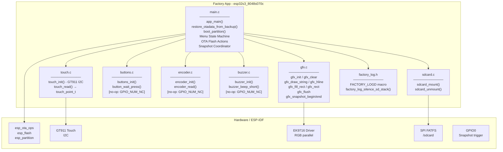
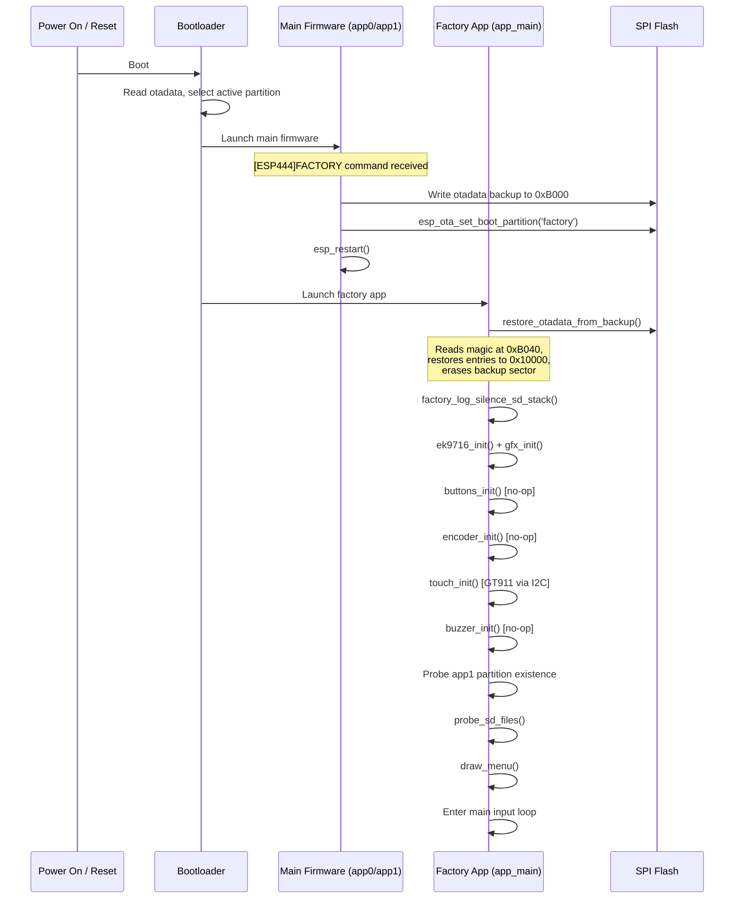
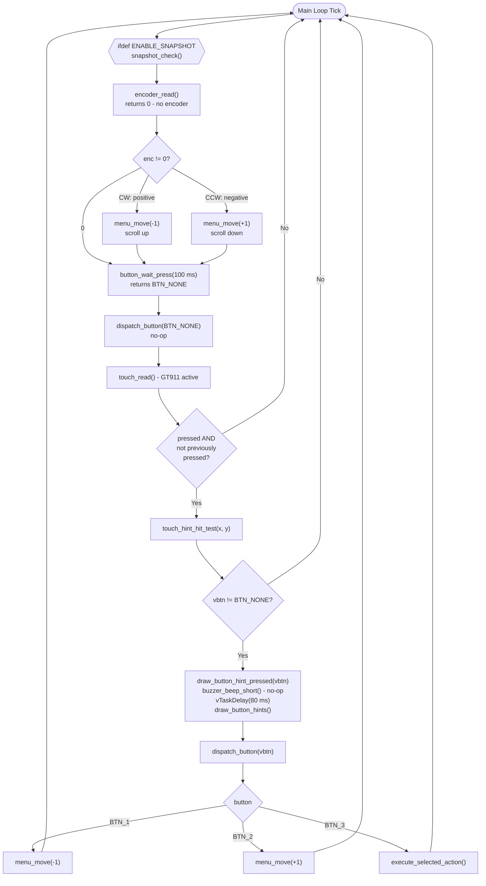
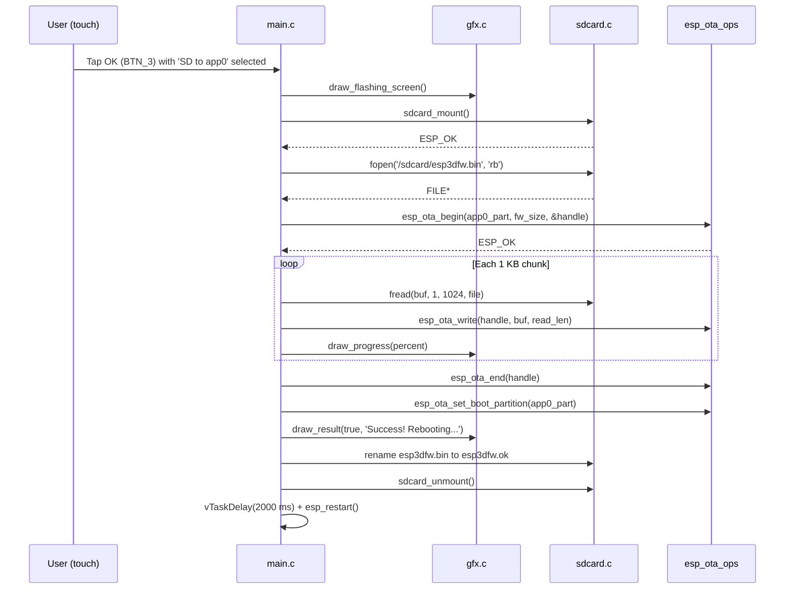
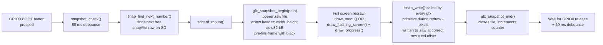

# esp32s3_8048s070c_factory_app_main

## Overview

The `esp32s3_8048s070c_factory_app_main` module is the **recovery application entry point** for the ESP32-S3 8048S070C board. It runs from the dedicated `factory` OTA partition and provides a touch-navigable menu that allows operators to:

- Boot a specific OTA application partition (`app0` or `app1`)
- Flash new main firmware from an SD card (`esp3dfw.bin`)
- Flash new UI resource data from an SD card (`ui_resources.bin`)
- (Optional, debug only) Capture raw RGB565 screen snapshots to SD via GPIO0

The module is the direct counterpart of [`pibot_pendant_v1_0_factory_app_main`](pibot_pendant_v1_0_factory_app_main.md) — it shares the same menu architecture, OTA restore mechanism, and action set, but targets a **touch-only board**: the 8048S070C has **no physical buttons and no custom bootloader hook**. All navigation is handled through three virtual buttons rendered at the bottom of the display, tapped via the GT911 capacitive touchscreen. A rotary encoder and physical buttons are architecturally supported but are unpopulated (`GPIO_NUM_NC`) on the shipping board; their code paths have guards and become no-ops at runtime.

---

## Board Hardware Context

| Property | Value |
|---|---|
| MCU | ESP32-S3 |
| Display | 800 × 480, RGB parallel (EK9716 controller) |
| Physical glass orientation | Landscape |
| Pendant enclosure mount | Rotated 90° |
| Logical canvas | 480 wide × 272 tall (portrait) |
| Touch controller | GT911 capacitive, I2C |
| Physical buttons | None — `BUTTON_n_PIN = GPIO_NUM_NC` |
| Encoder | None — `ENCODER_A/B_PIN = GPIO_NUM_NC` |
| Buzzer | None — `BUZZER_PIN = GPIO_NUM_NC` |
| SD card | SPI (FATFS, mounted at `/sdcard`) |
| Snapshot trigger | GPIO0 (BOOT button) — only when `ENABLE_SNAPSHOT` defined |

Because this board has no physical boot button, there is **no custom bootloader** for the factory app. Entry into the factory partition happens exclusively through the `[ESP444]FACTORY` software command issued by the main firmware (see `esp444.cpp`).

---

## Architecture

### Module Structure

```
boards/esp32s3_8048s070c/Factory/main/
├── main.c              ← This module: app entry, menu, OTA actions
├── factory_log.h       ← Compile-time log gate (FACTORY_LOGD macro)
├── gfx.c / gfx.h       ← Pixel drawing layer, snapshot capture
├── buttons.c           ← GPIO button polling (no-op on this board)
├── encoder.c           ← PCNT quadrature decoder (no-op on this board)
├── touch.c / touch.h   ← GT911 I2C capacitive touch driver
├── buzzer.c            ← GPIO square-wave buzzer (no-op on this board)
└── sdcard.c            ← SPI FATFS SD mount / unmount
```

### Position in the Module Tree

```
esp32s3_8048s070c_factory_app
├── esp32s3_8048s070c_factory_app_main      ← THIS MODULE
├── esp32s3_8048s070c_factory_app_display   (gfx.c)
├── esp32s3_8048s070c_factory_app_input     (buttons, encoder, touch, buzzer)
├── esp32s3_8048s070c_factory_app_storage   (sdcard.c)
└── esp32s3_8048s070c_factory_app_tools     (flash scripts)
```

The BSP (`esp32s3_8048s070c_bsp`) is **not used** by the factory app. The factory app drives hardware directly through its own lightweight drivers rather than the LVGL-integrated BSP layer used by the main firmware.

---

## Component Architecture



---

## Key Data Structures

### `menu_item_t`

Describes a single entry in the recovery menu.

```c
typedef struct {
    const char *label;       // Display string
    menu_action_t action;    // Enum identifying the action to execute
    uint16_t color;          // RGB565 foreground color when not selected
} menu_item_t;
```

**Menu actions (`menu_action_t`):**

| Enum value | Effect |
|---|---|
| `MENU_ACTION_BOOT_APP0` | Sets boot partition to `app0` and restarts |
| `MENU_ACTION_BOOT_APP1` | Sets boot partition to `app1` and restarts |
| `MENU_ACTION_SD_UPDATE_APP0` | Flashes `esp3dfw.bin` from SD into `app0` |
| `MENU_ACTION_SD_UPDATE_APP1` | Flashes `esp3dfw.bin` from SD into `app1` |
| `MENU_ACTION_SD_UPDATE_RES` | Flashes `ui_resources.bin` from SD into the `ui_resources` partition |

### `touch_point_t`

Returned by `touch_read()` after scaling raw GT911 coordinates to logical screen coordinates.

```c
typedef struct {
    bool    pressed;   // True when a touch contact exists
    int16_t x;         // Scaled X in [0, SCREEN_WIDTH)
    int16_t y;         // Scaled Y in [0, SCREEN_HEIGHT)
} touch_point_t;
```

---

## Flash Address Map (OTA Restore)

The main firmware (via `esp444.cpp`) writes a backup of the OTA data sector to a reserved area before switching the boot partition to factory. On startup this module reads the backup and restores the original OTA configuration, then erases the backup sector so it does not repeat.

```
Flash address map (relevant region)
────────────────────────────────────────
0x00000  Bootloader
   ...
0x0B000  OTADATA_BACKUP_OFFSET   ← 4 KB backup sector (written by main firmware)
           [entry1 — 32 bytes]
           [entry2 — 32 bytes]
           [zeros until...]
   0x40:  BACKUP_MAGIC (0xAA55AA55)
0x0C000  Partition table
0x0D000  NVS partition
   ...
0x10000  OTADATA_OFFSET          ← Live OTA data (2 × 4 KB sectors)
0x11000
   ...
[app partitions]
```

> **Port note:** `OTADATA_BACKUP_OFFSET` (0xB000) must sit after the bootloader end and before the partition table (0xC000), and must be 4 KB-aligned. When porting to a different board, recalculate this value and keep it identical in both `factory/main/main.c` and the main firmware's `esp444.cpp`.

> **Build requirement:** `CONFIG_SPI_FLASH_DANGEROUS_WRITE_ALLOWED=y` is required in the factory `sdkconfig` because the backup offset falls below the first partition boundary. This is intentional — the factory app is a privileged recovery tool that manages flash directly.

---

## Startup Sequence



---

## Main Loop — Input Dispatch

All three input sources (physical buttons, encoder, and touch) are unified through a single `dispatch_button()` function. Since physical buttons and encoder are unpopulated on this board, the touch path is the **only active input mechanism at runtime**.



---

## Screen Layout

The logical canvas is 480 px wide × 272 px tall (portrait orientation in the enclosure). All Y-coordinate constants are scaled ×0.85 relative to the 320 px-wide portrait reference boards (e.g., `esp32_3248s035r`).

```
┌─────────────────────────────────────────────────────────────────────────┐  y=0
│  ╔═══════════════════════════════════════════════════════════════════╗   │
│  ║         Recovery v1.2.3              (title, cyan)               ║   │  y=13
│  ║  ───────────────────────────────────────────────────────────     ║   │  y=40
│  ║  Active: app0                        (yellow)                    ║   │  y=45
│  ║  SD: FW RES             (gray label / green FW / cyan RES)       ║   │  y=68
│  ║  ───────────────────────────────────────────────────────────     ║   │  y=88
│  ║                                                                  ║   │
│  ║  ██████████████████  Boot app0  (selected — blue highlight box)  ║   │  y=94
│  ║                       SD → app0                (green)           ║   │  y=128
│  ║                       SD → resources           (cyan)            ║   │  y=162
│  ║                                                                  ║   │
│  ║  ───────────────────────────────────────────────────────────     ║   │
│  ║       Power off to cancel   (or transient status message)        ║   │  STATUS_Y
│  ║  ───────────────────────────────────────────────────────────     ║   │
│  ║                                                                  ║   │
│  ║    ◎ Up         ◎ Down       ✓ OK                               ║   │  BTN_HINT_CY
│  ╚═══════════════════════════════════════════════════════════════════╝   │  y=271
└─────────────────────────────────────────────────────────────────────────┘
```

### Virtual Button Bar Geometry

Three circular touch targets are drawn at the bottom of the screen. Hit-testing splits the screen at the **midpoints between the icon centers** rather than at screen-width thirds, because the icons are clustered around screen center on this wide canvas.

| Virtual Button | Center X constant | Icon | Action |
|---|---|---|---|
| BTN_1 (Up) | `SCREEN_WIDTH/2 − 100` | ↑ arrow | `menu_move(-1)` |
| BTN_2 (Down) | `SCREEN_WIDTH/2` | ↓ arrow | `menu_move(+1)` |
| BTN_3 (OK) | `SCREEN_WIDTH/2 + 100` | ✓ check | `execute_selected_action()` |

---

## Function Reference

### `app_main()`

ESP-IDF application entry point. Orchestrates the full startup sequence and runs the main input loop indefinitely. Never returns.

### `restore_otadata_from_backup()`

```c
static bool restore_otadata_from_backup(void);
```

Called as the first operation in `app_main()`, before any hardware init. Reads the 4-byte magic at `OTADATA_BACKUP_OFFSET + BACKUP_MAGIC_OFFSET`. If the magic matches `0xAA55AA55`:

1. Reads both 32-byte OTA data entries from the backup sector.
2. Erases the live OTA data area (two 4 KB sectors at `OTADATA_OFFSET`).
3. Writes back any non-empty entries.
4. Erases the backup sector so restore does not repeat on the next reboot.

Returns `true` if a backup was found and acted upon.

### `boot_partition(const char *label)`

Finds the named application partition, calls `esp_ota_set_boot_partition()`, and calls `esp_restart()`. Logs an error and returns without restarting if the partition is not found or the OTA call fails.

### `probe_sd_files()`

Mounts the SD card, probes for `esp3dfw.bin` and `ui_resources.bin`, then unmounts. Sets module-level flags `sd_has_fw` and `sd_has_res` used by `draw_sd_indicators()` to display SD content hints in the menu header.

### `touch_hint_hit_test(int x, int y)`

Returns the virtual `button_id_t` (`BTN_1` / `BTN_2` / `BTN_3` / `BTN_NONE`) for a touch coordinate. Only fires when `y >= BTN_HINT_BASE_Y`. Column boundaries are computed as midpoints between `BTN_HINT_CX1`, `BTN_HINT_CX2`, `BTN_HINT_CX3`.

### `dispatch_button(button_id_t btn)`

Unified handler for all input sources. Maps `BTN_1` → `menu_move(-1)`, `BTN_2` → `menu_move(+1)`, `BTN_3` → `execute_selected_action()`. Ignores `BTN_NONE`.

### `execute_selected_action()`

Reads `menu_items[menu_selected].action` and calls the appropriate action function (`action_boot_partition`, `action_sd_update`, or `action_sd_update_res`).

---

## SD Card Update Actions

### `action_sd_update(const char *target_label)`

Streams `esp3dfw.bin` from SD to the named OTA application partition using the ESP-IDF OTA API (`esp_ota_begin` / `esp_ota_write` / `esp_ota_end`). Reads and writes in 1 KB chunks; calls `draw_progress()` on each percent change. On success:

- Sets boot partition to the updated target.
- Renames `esp3dfw.bin` → `esp3dfw.ok`.
- Restarts after 2 seconds.

On failure:
- Renames `esp3dfw.bin` → `esp3dfw.bad`.
- Returns to the recovery menu after 3 seconds.
- Re-probes SD files to refresh header indicators.

### `action_sd_update_res()`

Streams `ui_resources.bin` from SD directly to the `ui_resources` data partition using `esp_partition_erase_range` + `esp_partition_write`. Reads and logs the 16-byte build header (`"ESP3"` + 12-char variant string) to detect variant mismatches before flashing. On success:

- Renames `ui_resources.bin` → `ui_resources.ok`.
- Restarts after 2 seconds.

On failure:
- Renames `ui_resources.bin` → `ui_resources.bad`.
- Returns to the recovery menu.

---

## SD File Naming Convention

| Path | Purpose |
|---|---|
| `/sdcard/esp3dfw.bin` | Main firmware image to flash |
| `/sdcard/esp3dfw.ok` | Renamed from `.bin` after successful flash |
| `/sdcard/esp3dfw.bad` | Renamed from `.bin` after failed flash |
| `/sdcard/ui_resources.bin` | UI resource partition image |
| `/sdcard/ui_resources.ok` | Renamed after successful flash |
| `/sdcard/ui_resources.bad` | Renamed after failed flash |
| `/sdcard/snap%03d.raw` | Debug snapshots (if `ENABLE_SNAPSHOT` defined) |

---

## SD Firmware Flash — Sequence Diagram



---

## Snapshot Subsystem (Optional — `ENABLE_SNAPSHOT`)

When compiled with `ENABLE_SNAPSHOT`, pressing GPIO0 (the BOOT button on ESP32-S3 modules) triggers a full-screen capture to the SD card.



**Raw file format:** `[width: u32 LE][height: u32 LE][RGB565 pixels, row-major, native byte order]`

Convert `.raw` files to PNG using `boards/esp32s3_8048s070c/Factory/tools/raw2png/snap2png.py`.

The state variables `s_snap_in_flash` and `s_flash_last_percent` ensure the snapshot redraws the correct screen (flashing-in-progress or idle menu) even when triggered mid-update.

---

## Logging System

### `FACTORY_LOGD` Macro (`factory_log.h`)

A **compile-time log gate** independent of the main `sdkconfig` log level:

```c
#if FACTORY_LOG_LEVEL          // Controlled by ENABLE_FACTORY_DEBUG_LOG in CMakeLists.txt
#define FACTORY_LOGD(tag, fmt, ...) ESP_LOGI(tag, fmt, ##__VA_ARGS__)
#else
#define FACTORY_LOGD(tag, fmt, ...) do {} while (0)
#endif
```

`ESP_LOGW` and `ESP_LOGE` are always active regardless of `FACTORY_LOG_LEVEL`.

### `factory_log_silence_sd_stack()`

Called as the first statement in `app_main()`. Suppresses verbose ESP-IDF SD/FATFS internal log tags at runtime to prevent SD stack chatter from obscuring factory app logic in debug builds:

```
sdmmc  vfs_fat_sdmmc  sdmmc_periph  sdmmc_req
sdmmc_common  fatfs  sdspi  sd_diskio
```

---

## Comparison with Sibling Board Modules

This module is architecturally identical to the factory app main modules on sibling boards. Key differences versus the reference implementation:

| Feature | pibot_pendant_v1_0 | esp32s3_8048s070c |
|---|---|---|
| Display driver | ILI9341 (SPI) | EK9716 (RGB parallel) |
| Touch controller | Resistive / none | GT911 capacitive (I2C) |
| Physical buttons | Yes (GPIO) | No — `GPIO_NUM_NC` |
| Encoder | Yes (PCNT) | No — `GPIO_NUM_NC` |
| Buzzer | Yes (GPIO) | No — `GPIO_NUM_NC` |
| Custom bootloader | Yes (physical button hold) | No — software trigger only |
| Virtual button bar | Yes (touch fallback) | Yes (primary and only input) |
| Screen logical resolution | 320 × 480 portrait | 480 × 272 portrait (rotated) |
| Layout Y-scale | 1.0× (reference) | ~0.85× of reference |

Boards with a similar profile (RGB panel, touch-only, no bootloader hook) include `esp32s3_8048s043c`, `esp32s3_8048s050c`, and `esp32s3_8048_touch_lcd_7`. Their factory app main modules follow the same pattern.

---

## Build Configuration

### Feature Flags (CMakeLists.txt)

| Flag | Effect |
|---|---|
| `ENABLE_FACTORY_DEBUG_LOG` | Sets `FACTORY_LOG_LEVEL=1`; enables `FACTORY_LOGD` output |
| `ENABLE_SNAPSHOT` | Enables GPIO0 snapshot capture; adds `snapshot_check()` calls throughout the main loop and flash actions |
| `ENABLE_CUSTOM_BOOT_LOADER` | **Not set** for this board — factory entry is software-triggered only |
| `CONFIG_SPI_FLASH_DANGEROUS_WRITE_ALLOWED=y` | **Required** in factory sdkconfig to allow direct flash writes to the pre-partition region used by the OTA backup restore |

### Key Compile-Time Constants (`main.c`)

| Constant | Value | Description |
|---|---|---|
| `OTADATA_OFFSET` | `0x10000` | Live OTA data flash address |
| `OTADATA_SECTOR_SIZE` | `0x1000` | 4 KB per sector |
| `OTADATA_BACKUP_OFFSET` | `0xB000` | Backup sector address written by main firmware |
| `BACKUP_MAGIC_OFFSET` | `0x40` | Magic word offset within backup sector |
| `BACKUP_MAGIC` | `0xAA55AA55` | Sentinel confirming a valid backup exists |
| `MENU_START_Y` | `94` | Y-pixel of first menu item |
| `MENU_ITEM_H` | `34` | Height of each menu item in pixels |
| `BTN_CIRCLE_R` | `30` | Radius of virtual button circles |
| `BTN_HINT_CX1/2/3` | `SW/2−100`, `SW/2`, `SW/2+100` | X centers of the three virtual buttons |

---

## Related Documentation

- [`esp32s3_8048s070c_factory_app_display`](esp32s3_8048s070c_factory_app_display.md) — GFX drawing layer and snapshot file writer (`gfx.c`)
- [`esp32s3_8048s070c_factory_app_input`](esp32s3_8048s070c_factory_app_input.md) — Touch (GT911), buttons, encoder, buzzer drivers
- [`esp32s3_8048s070c_factory_app_storage`](esp32s3_8048s070c_factory_app_storage.md) — SD card SPI FATFS mount/unmount (`sdcard.c`)
- [`esp32s3_8048s070c_factory_app_tools`](esp32s3_8048s070c_factory_app_tools.md) — Flash helper scripts and snapshot converter
- [`esp32s3_8048s070c_bsp`](esp32s3_8048s070c_bsp.md) — Board Support Package (used by main firmware only, not this factory app)
- [`pibot_pendant_v1_0_factory_app_main`](pibot_pendant_v1_0_factory_app_main.md) — Reference implementation (physical buttons, ILI9341 SPI display)
- `docs/Factory/` — Factory app and bootloader design documentation
- `docs/architecture/display_drivers.md` — EK9716 RGB panel driver, orientation and rotation semantics
