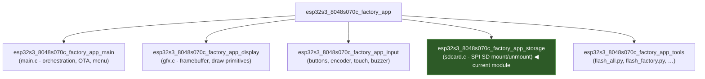
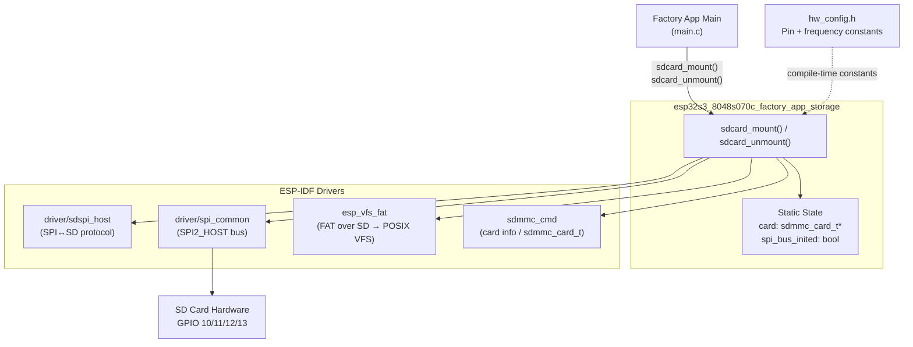
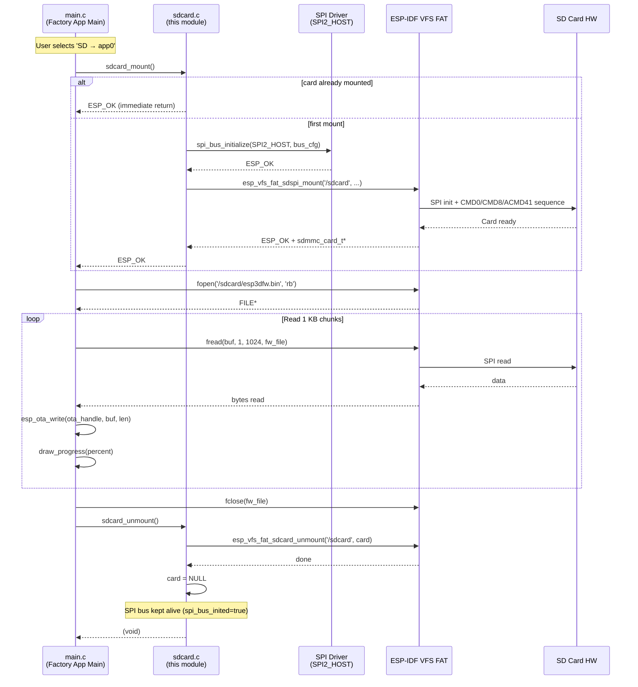
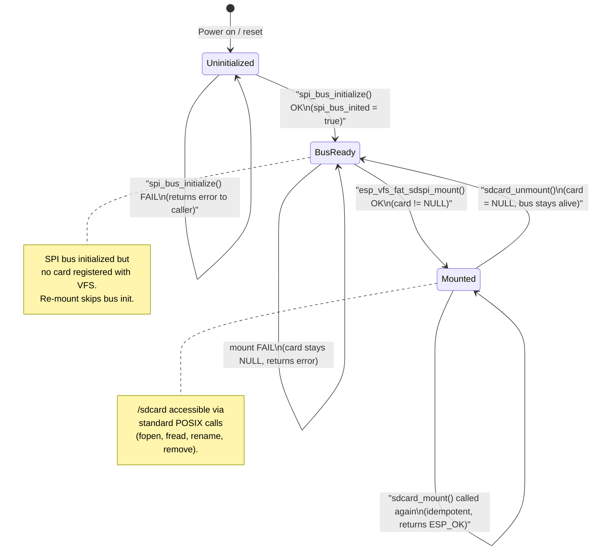

# esp32s3_8048s070c_factory_app_storage

## Introduction

The `esp32s3_8048s070c_factory_app_storage` module is the SD card storage layer for the Factory recovery application on the **ESP32-S3 8048S070C** board (800×480, 7.0-inch capacitive-touch panel). It wraps ESP-IDF's VFS FAT over SDSPI into a minimal two-function API — `sdcard_mount` / `sdcard_unmount` — that the factory application's main logic calls whenever it needs to read a firmware binary or UI-resources image from an SD card.

This module is intentionally narrow in scope. It owns only the SPI bus configuration, card handle lifecycle, and VFS registration. File I/O, OTA flashing, and progress reporting are handled exclusively by the parent module [`esp32s3_8048s070c_factory_app_main`](esp32s3_8048s070c_factory_app_main.md).

---

## Module Position within the Factory Application

The factory application is structured as five sibling sub-modules under the parent `esp32s3_8048s070c_factory_app`. The storage module is the only one concerned with persistent mass storage:



The BSP layer used by the **main** firmware (LVGL task, touch, display flush) lives in the sibling module [`esp32s3_8048s070c_bsp`](esp32s3_8048s070c_bsp.md); that code is **not** active during factory app execution.

---

## Source Files

| File | Role |
|---|---|
| `boards/esp32s3_8048s070c/Factory/main/sdcard.c` | Implementation — SPI bus init, VFS FAT mount, card handle lifecycle |
| `boards/esp32s3_8048s070c/Factory/main/sdcard.h` | Public header — declares `sdcard_mount()` and `sdcard_unmount()` |
| `boards/esp32s3_8048s070c/Factory/main/hw_config.h` | Pin and bus constants consumed by `sdcard.c` |
| `boards/esp32s3_8048s070c/Factory/main/factory_log.h` | `FACTORY_LOGD` macro + `factory_log_silence_sd_stack()` |

---

## Hardware Configuration

All SD-related constants are defined in `hw_config.h` and consumed at compile time by `sdcard.c`. No runtime pin selection occurs.

### SPI Pin Assignments

| Signal | GPIO | Direction |
|---|---|---|
| `SD_MOSI` | GPIO 11 | Host → Card |
| `SD_MISO` | GPIO 13 | Card → Host |
| `SD_CLK`  | GPIO 12 | Clock |
| `SD_CS`   | GPIO 10 | Chip Select (active low) |

### Bus and Mount Constants

| Constant | Value | Description |
|---|---|---|
| `SD_SPI_HOST` | `SPI2_HOST` | ESP-IDF SPI peripheral identifier |
| `SD_FREQ_KHZ` | `20000` (20 MHz) | Maximum SPI clock for SD transfers |
| `SD_MOUNT_POINT` | `"/sdcard"` | VFS mount path for POSIX file access |

> **SPI bus sharing note:** The SPI bus (`SPI2_HOST`) is dedicated exclusively to the SD card within the factory app. The 7-inch panel uses a **16-bit parallel RGB interface** (EK9716 driver), not SPI — so there is no bus conflict between the display and SD card on this board. See [`esp32s3_8048s070c_factory_app_display`](esp32s3_8048s070c_factory_app_display.md) for the EK9716 parallel bus configuration.

---

## Architecture: Layering and Dependencies



---

## API Reference

### `sdcard_mount()`

```c
esp_err_t sdcard_mount(void);
```

Mounts the SD card at the VFS path `/sdcard` via SPI.

**Behavior:**
- If the card is already mounted (`card != NULL`), returns `ESP_OK` immediately — idempotent, safe to call multiple times.
- If the SPI bus (`SPI2_HOST`) has not yet been initialized for this session, calls `spi_bus_initialize()` with the pin constants from `hw_config.h` and sets the internal `spi_bus_inited` flag.
- Configures the SDSPI device slot with `SD_CS` and `SD_SPI_HOST`.
- Configures the host with `SD_FREQ_KHZ` (20 MHz max).
- Mounts via `esp_vfs_fat_sdspi_mount()` with:
  - `format_if_mount_failed = false` — the factory app never formats an SD card.
  - `max_files = 4` — conservative limit; only one file is ever open at a time during flash operations.
  - `disk_status_check_enable = true` — enables card-present detection.
- On success, logs the card information (only when `FACTORY_LOG_LEVEL` is set).

**Returns:** `ESP_OK` on success, or the `esp_err_t` code from the failing ESP-IDF call.

---

### `sdcard_unmount()`

```c
void sdcard_unmount(void);
```

Unmounts the SD card from the VFS.

**Behavior:**
- Calls `esp_vfs_fat_sdcard_unmount(SD_MOUNT_POINT, card)` and sets the `card` handle to `NULL`.
- **Does NOT de-initialize the SPI bus.** The bus handle is intentionally kept alive across mount/unmount cycles to prevent interference with other SPI peripherals. See [Design Decisions](#design-decisions) below.

---

## Internal State

The module uses two file-scoped (static) variables:

| Variable | Type | Initial Value | Description |
|---|---|---|---|
| `card` | `sdmmc_card_t *` | `NULL` | Handle to the mounted SD card. `NULL` = not mounted. |
| `spi_bus_inited` | `bool` | `false` | Tracks whether `spi_bus_initialize()` has been called. Prevents re-initialization on subsequent mount calls. |

---

## Data Flow: Mount and File Operation Sequence

This diagram shows the complete flow from a factory-app menu action through this module to the SD card hardware and back up to the OTA write path:



---

## State Machine



---

## Integration: How the Factory App Main Uses This Module

The factory app main (`main.c`) calls this module in three distinct contexts:

### 1. Startup Probe (`probe_sd_files`)

Called once at boot to detect which update files are present on the SD card. The result drives the menu item color coding (green = firmware available, cyan = resources available):

```
app_main()
  └─ probe_sd_files()
       ├─ sdcard_mount()          ← storage module
       ├─ fopen(FW_FILENAME)      → sd_has_fw  = true/false
       ├─ fopen(RES_FILENAME)     → sd_has_res = true/false
       └─ sdcard_unmount()        ← storage module
```

### 2. Firmware Flash (`action_sd_update`)

Mounts the card, opens `esp3dfw.bin`, streams it in 1 KB chunks through `esp_ota_write`, then unmounts. On success the source file is renamed to `esp3dfw.ok`; on failure to `esp3dfw.bad`:

```
action_sd_update(target_label)
  ├─ sdcard_mount()               ← storage module
  ├─ fopen("/sdcard/esp3dfw.bin")
  ├─ [OTA write loop with progress]
  ├─ fclose()
  ├─ rename(FW_FILENAME → FW_OK_FILENAME or FW_BAD_FILENAME)
  └─ sdcard_unmount()             ← storage module
```

### 3. UI Resources Flash (`action_sd_update_res`)

Mounts the card, validates the `ui_resources.bin` build header (4-byte `"ESP3"` magic + 12-char variant tag), erases the `ui_resources` flash partition, and writes the image directly. The file is renamed to `ui_resources.ok` or `ui_resources.bad` on completion:

```
action_sd_update_res()
  ├─ sdcard_mount()               ← storage module
  ├─ fopen("/sdcard/ui_resources.bin")
  ├─ fread(16-byte header) → variant validation
  ├─ esp_partition_erase_range(ui_resources)
  ├─ [partition write loop with progress]
  ├─ fclose()
  ├─ rename(RES_FILENAME → RES_OK_FILENAME or RES_BAD_FILENAME)
  └─ sdcard_unmount()             ← storage module
```

### SD File Naming Convention

| Filename on SD | Role |
|---|---|
| `esp3dfw.bin` | Firmware image to flash (input) |
| `esp3dfw.ok` | Renamed after successful firmware flash |
| `esp3dfw.bad` | Renamed after failed firmware flash |
| `ui_resources.bin` | UI resources image to flash (input) |
| `ui_resources.ok` | Renamed after successful resources flash |
| `ui_resources.bad` | Renamed after failed resources flash |

---

## Logging

The module uses two logging mechanisms:

| Macro / Function | Source | Active when |
|---|---|---|
| `FACTORY_LOGD(TAG, ...)` | `factory_log.h` | `FACTORY_LOG_LEVEL > 0` (compile-time) |
| `ESP_LOGE(TAG, ...)` | ESP-IDF `esp_log.h` | Always (errors are never suppressed) |
| `sdmmc_card_print_info(stdout, card)` | `sdmmc_cmd.h` | `FACTORY_LOG_LEVEL > 0` |

At `app_main()` startup, `factory_log_silence_sd_stack()` sets all SD-related ESP-IDF log tags (`sdmmc`, `vfs_fat_sdmmc`, `sdmmc_periph`, `sdmmc_req`, `sdmmc_common`, `fatfs`, `sdspi`, `sd_diskio`) to `ESP_LOG_NONE`. This prevents the ESP-IDF SD stack from flooding the UART console during normal recovery menu operation. Errors from this module still surface because `ESP_LOGE` bypasses per-tag suppression at the `ERROR` severity level.

---

## Design Decisions

### SPI Bus Never De-initialized

`sdcard_unmount()` intentionally omits a `spi_bus_free()` call. The comment in the source reads:
> *"Keep SPI bus initialized — freeing it can interfere with TFT SPI. The bus will be reused on next mount."*

On this specific board the TFT uses a 16-bit parallel RGB bus (not SPI), so the conflict risk is lower than on SPI-panel boards. However, the deliberate choice to not free the bus is maintained for two reasons:
1. **Consistency** across all boards in the BSP family — the same `sdcard.c` pattern appears across `pibot_pendant_v1_0`, `esp32s3_8048s043c`, `esp32s3_8048s050c`, and others.
2. **Safety** — future board variants or additional SPI peripherals cannot inadvertently be disrupted by a bus teardown.

The practical benefit is that repeated `mount → unmount → mount` cycles (e.g., probe at boot, then flash later) avoid the overhead of re-calling `spi_bus_initialize()`.

### `format_if_mount_failed = false`

The factory app must never silently format the operator's SD card. If mount fails (card absent, wrong format, filesystem corruption), an error is returned to the caller and displayed on-screen. The operator is expected to prepare the SD card externally.

### `max_files = 4`

Conservative limit. Only one file is open at any given time during factory operations. The headroom guards against unexpected ESP-IDF internal file descriptor allocation.

### Idempotent Mount

`sdcard_mount()` checks `card != NULL` before doing any work. This allows callers to call mount unconditionally without bookkeeping, and makes the API safe under any future refactoring that might invoke mount from multiple code paths.

---

## Cross-Board Counterpart

An **identical** storage module pattern is used by other boards in this BSP family. The sibling module in `pibot_pendant_v1_0` is documented at [`pibot_pendant_v1_0_factory_app_storage`](pibot_pendant_v1_0_factory_app_storage.md). The only differences across boards are the pin constants in each board's `hw_config.h` and the SPI host identifier — the `sdcard.c` logic itself is functionally identical across all boards.

---

## Related Documentation

| Document | Relevance |
|---|---|
| [`esp32s3_8048s070c_factory_app_main`](esp32s3_8048s070c_factory_app_main.md) | Main orchestrator — calls `sdcard_mount`/`sdcard_unmount`, owns OTA and partition-write logic |
| [`esp32s3_8048s070c_factory_app_display`](esp32s3_8048s070c_factory_app_display.md) | GFX layer — draws flash progress bars during SD update operations |
| [`esp32s3_8048s070c_factory_app_input`](esp32s3_8048s070c_factory_app_input.md) | Input layer — provides button/encoder/touch events that trigger SD actions |
| [`esp32s3_8048s070c_factory_app_tools`](esp32s3_8048s070c_factory_app_tools.md) | PC-side flash scripts for initial factory programming |
| [`esp32s3_8048s070c_bsp`](esp32s3_8048s070c_bsp.md) | BSP layer — used by main firmware only, not active during factory app |
| [`pibot_pendant_v1_0_factory_app_storage`](pibot_pendant_v1_0_factory_app_storage.md) | Counterpart on the PiBot Pendant board (same pattern, different pins) |
| `docs/Factory/` | Factory app and bootloader architecture overview |
| `docs/ui_resources/development.md` | `ui_resources` partition binary format validated during `action_sd_update_res` |
