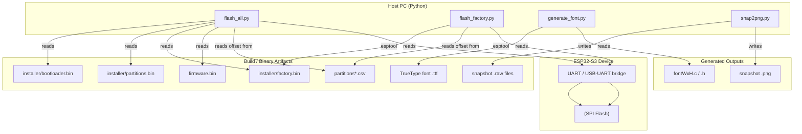
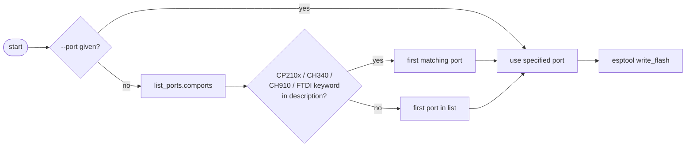
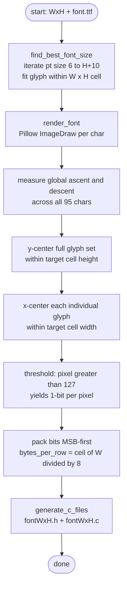
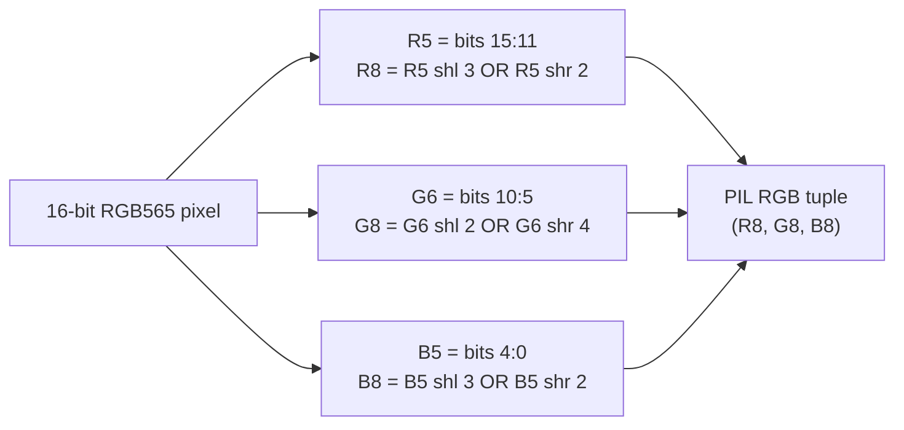
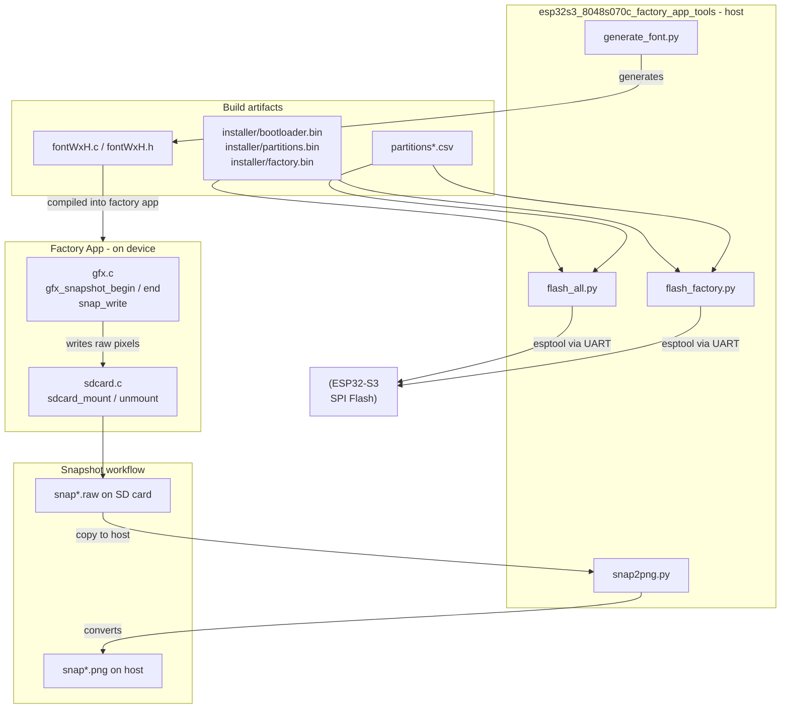
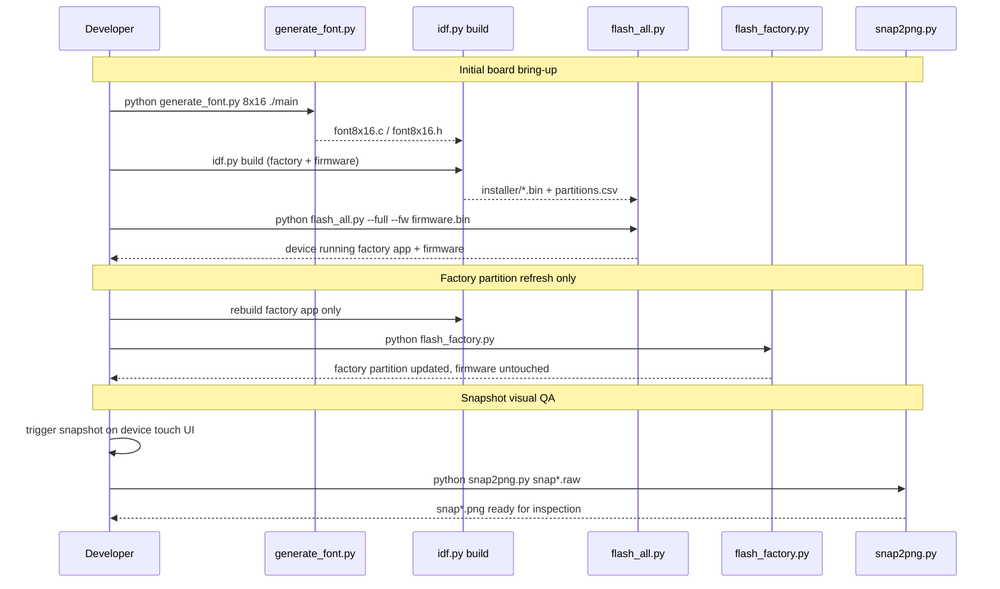

# esp32s3_8048s070c_factory_app_tools

Host-side Python utilities for manufacturing, development, and asset-pipeline work on the **ESP32-S3 8048S070C** board (800×480, 7-inch capacitive touch). These scripts run on a developer's PC — never on the embedded device — and cover three concerns:

1. **Flashing** — push firmware and partition images to a device over serial.
2. **Font generation** — compile TTF fonts into bitmap C arrays consumed by the factory app display layer.
3. **Snapshot conversion** — decode RGB565 raw captures produced by the running factory app into viewable PNG files.

> **Parent module:** [esp32s3_8048s070c_factory_app](esp32s3_8048s070c_factory_app.md)  
> **Equivalent tools for other boards:** [pibot_pendant_v1_0_factory_app_tools](pibot_pendant_v1_0_factory_app_tools.md)

---

## Directory Layout

```
boards/esp32s3_8048s070c/Factory/tools/
├── flash_all.py                  # Multi-mode full-device flash utility
├── flash_factory.py              # Single-partition factory flash utility
├── generate_font/
│   └── generate_font.py          # Bitmap font C-source generator
└── raw2png/
    └── snap2png.py               # RGB565 raw → PNG converter
```

---

## Architecture Overview



---

## Tool Reference

### 1. `flash_all.py` — Multi-Mode Flash Utility

#### Purpose

Orchestrates all flashing scenarios from first-time board bring-up through iterative firmware development. Three mutually exclusive modes cover every use case.

#### Flash Modes

| Flag | Use Case | What Gets Written |
|---|---|---|
| `--recovery` | First-time setup, restore after brick | bootloader + partition table + factory app |
| `--full --fw <bin>` | Clean full installation | bootloader + partition table + factory app + main firmware |
| `--fw <bin>` | Dev iteration | main firmware only → `app0` at `0x20000` |

#### Flash Address Map

```
SPI Flash (8 MB layout)
─────────────────────────────────────────────────────────────────
0x001000   bootloader.bin          (44 KB reserved space)
0x00C000   partitions.bin
0x010000   otadata
0x020000   app0   ← --fw / --full target
  ...
0x660000   filesystem partition
0x7A0000   factory.bin  ← offset auto-detected from partitions*.csv
```

> **Note:** The factory partition offset is read dynamically from the first matching `partitions*.csv` found in the working directory tree. The hard-coded fallback is `0x7A0000` (8 MB layout).

#### Port Auto-Detection Logic



#### Key Parameters

| Parameter | Default | Description |
|---|---|---|
| `--port / -p` | auto-detected | Serial port (e.g., `/dev/ttyUSB0`, `COM3`) |
| `--baud` | `460800` | Flash baud rate |
| `--fw / --firmware` | — | Path to main firmware binary (required with `--full`) |
| `--fw-file` | — | Alias for `--fw` when used alongside `--full` |

#### Usage Examples

```bash
# Restore a bricked device (no firmware needed)
python flash_all.py --recovery

# Complete clean install
python flash_all.py --full --fw build/pibot_pendant.bin

# Dev iteration: firmware only
python flash_all.py --fw build/pibot_pendant.bin

# Specify port explicitly
python flash_all.py --recovery --port /dev/ttyUSB0
python flash_all.py --full --fw build/pibot_pendant.bin --port COM3
```

---

### 2. `flash_factory.py` — Factory Partition Flash Utility

#### Purpose

Focused utility to re-flash **only** the factory recovery partition. Useful when the factory app has been updated independently of the main firmware, or when a quick recovery image refresh is needed without disturbing the running firmware in `app0`.

#### Offset Discovery

Searches three CSV glob patterns in order:

```
partitions*.csv
boards/*/partitions*.csv
boards/*/*/partitions*.csv
```

Parses each CSV line looking for the column where the subtype field equals `factory` (case-insensitive) and returns the corresponding offset value.

#### Key Parameters

| Parameter | Default | Description |
|---|---|---|
| `--port / -p` | auto-detected | Serial port |
| `--bin / -b` | `installer/factory.bin` | Binary to flash |
| `--baud` | `460800` | Flash baud rate |
| `--offset / -o` | auto from CSV | Manual override for partition offset |

#### Usage Examples

```bash
# Auto-detect everything
python flash_factory.py

# Specify port only
python flash_factory.py --port /dev/ttyUSB0

# Custom binary and offset
python flash_factory.py --bin my_factory.bin --offset 0x7A0000

# Override offset without a custom binary
python flash_factory.py --port COM4 --offset 0x7A0000
```

---

### 3. `generate_font/generate_font.py` — Bitmap Font Generator

#### Purpose

Converts a TrueType font into C source files (`fontWxH.c` / `fontWxH.h`) that the factory app's display layer (`gfx.c`) uses for text rendering. See [esp32s3_8048s070c_factory_app_display](esp32s3_8048s070c_factory_app_display.md) for how these arrays are consumed by `gfx_draw_char` and `gfx_draw_string`.

#### Character Coverage

ASCII printable range **0x20 (space) through 0x7E (tilde)** — 95 characters total. Non-printable characters fall back to the space glyph at runtime.

#### Generation Pipeline



#### Output File Structure

**Header (`fontWxH.h`)**
```c
#define FONT_WIDTH          W
#define FONT_HEIGHT         H
#define FONT_BYTES_PER_ROW  /* ceil(W / 8) */

const uint8_t *fontWxH_get_glyph(char c);
```

**Source (`fontWxH.c`)**
```c
static const uint8_t font_data[][bytes_per_glyph] = {
    { 0x00, 0x00, ... },  /* 0x20 ' ' */
    { 0x00, 0x18, ... },  /* 0x21 '!' */
    ...                   /* 0x7E '~' */
};

const uint8_t *fontWxH_get_glyph(char c) {
    if (c < 0x20 || c > 0x7E) return font_data[0];  /* fallback: space */
    return font_data[c - 0x20];
}
```

#### Glyph Memory Footprint

| Cell size | Bytes/row | Bytes/glyph | Total (95 chars) |
|---|---|---|---|
| 6×12 | 1 | 12 | 1,140 bytes |
| 8×16 | 1 | 16 | 1,520 bytes |
| 10×20 | 2 | 40 | 3,800 bytes |
| 16×32 | 2 | 64 | 6,080 bytes |

These sizes fit comfortably in ESP32 flash and can be placed in DRAM for fast access.

#### Font Discovery (no `--font` flag)

Searches OS-specific paths for a monospace TTF (DejaVu Sans Mono, Liberation Mono, Menlo, Consolas, Courier New, Lucida Console). Exits with an actionable error message if none is found.

#### Recommended Font

**Perfect DOS VGA 437** by Zeh Fernando (free) gives the closest match to the CP437/DOS look used in the factory UI. Best used at multiples of 8: `8x16`, `16x32`, `24x48`.  
Download: https://www.dafont.com/perfect-dos-vga-437.font

#### Key Parameters

| Positional / Flag | Description |
|---|---|
| `<WxH>` | Cell dimensions, e.g., `8x16`, `10x20` (range: 4–32 wide, 6–64 tall) |
| `[output_dir]` | Directory for `.h` / `.c` output files (default: `.`) |
| `--font <path.ttf>` | Override font file; auto-detect system monospace if omitted |

#### Usage Examples

```bash
# 8×16 with auto-detected font, output to current directory
python generate_font.py 8x16 .

# 8×16 with CP437 DOS font, output into ./main
python generate_font.py 8x16 ./main --font "Perfect DOS VGA 437.ttf"

# Smaller 6×12 font into ./main
python generate_font.py 6x12 ./main

# Large font with an explicit system path
python generate_font.py 10x20 ./main --font /usr/share/fonts/truetype/dejavu/DejaVuSansMono.ttf
```

---

### 4. `raw2png/snap2png.py` — RGB565 Snapshot Converter

#### Purpose

Decodes binary snapshot files captured by the running factory app (`gfx_snapshot_begin` / `gfx_snapshot_end` / `snap_write` in [esp32s3_8048s070c_factory_app_display](esp32s3_8048s070c_factory_app_display.md)) and writes standard PNG images. Supports single-file and batch conversion, enabling visual QA, documentation captures, and UI layout debugging during factory testing.

#### Raw File Format

```
Offset    Size       Field
───────   ────────   ────────────────────────────────────────────
0         4 bytes    Width  (uint32, little-endian)
4         4 bytes    Height (uint32, little-endian)
8         W×H×2 B    Pixel data (RGB565, row-major, little-endian)
```

#### RGB565 → RGB888 Conversion



The `(channel << upshift) | (channel >> downshift)` formula replicates the top bits into the vacated low bits, producing the closest 8-bit approximation without a lookup table.

#### Key Parameters

| Parameter | Description |
|---|---|
| `files` (positional) | One or more `.raw` files; shell glob expansion supported |
| `-o / --output` | Custom output filename (single-file mode only) |

#### Output Naming

Without `-o`, the output filename mirrors the input with the extension replaced by `.png` (e.g., `snap000.raw` → `snap000.png`).

#### Usage Examples

```bash
# Single file
python snap2png.py snap000.raw

# Batch convert all snapshots in current directory
python snap2png.py snap*.raw

# Custom output name (single file only)
python snap2png.py snap000.raw -o screenshot.png
```

---

## Component Interaction Map



---

## Python Dependencies

| Tool | Package | Install |
|---|---|---|
| `flash_all.py` | `esptool`, `pyserial` | `pip install esptool pyserial` |
| `flash_factory.py` | `esptool`, `pyserial` | `pip install esptool pyserial` |
| `generate_font.py` | `Pillow` | `pip install pillow` |
| `snap2png.py` | `Pillow` | `pip install pillow` |

All tools require **Python 3.6+** and run on the host only — no ESP-IDF or device connection is needed for font generation and snapshot conversion.

---

## End-to-End Workflow



---

## Related Modules

| Module | Relationship |
|---|---|
| [esp32s3_8048s070c_factory_app](esp32s3_8048s070c_factory_app.md) | Parent — full factory app for this board |
| [esp32s3_8048s070c_factory_app_main](esp32s3_8048s070c_factory_app_main.md) | Main loop — drives menu, triggers snapshot actions |
| [esp32s3_8048s070c_factory_app_display](esp32s3_8048s070c_factory_app_display.md) | GFX layer — produces `.raw` snapshot files; consumes font arrays from `generate_font.py` |
| [esp32s3_8048s070c_factory_app_storage](esp32s3_8048s070c_factory_app_storage.md) | SD card — physical storage medium for `.raw` snapshot files |
| [esp32s3_8048s070c_bsp](esp32s3_8048s070c_bsp.md) | BSP — board-level hardware init used by the main firmware |
| [pibot_pendant_v1_0_factory_app_tools](pibot_pendant_v1_0_factory_app_tools.md) | Identical toolset for the PiBot Pendant v1.0 board |
| [tools_build_scripts](tools_build_scripts.md) | Project-level resource and build toolchain (distinct scope) |
