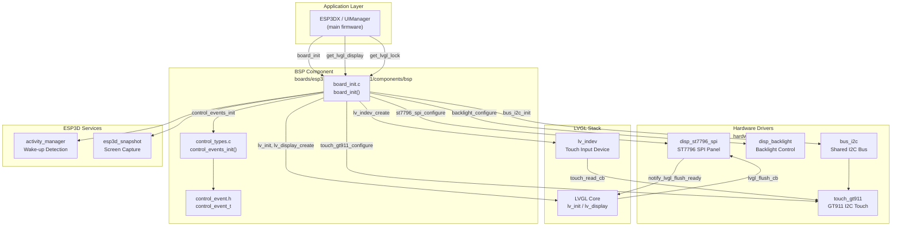
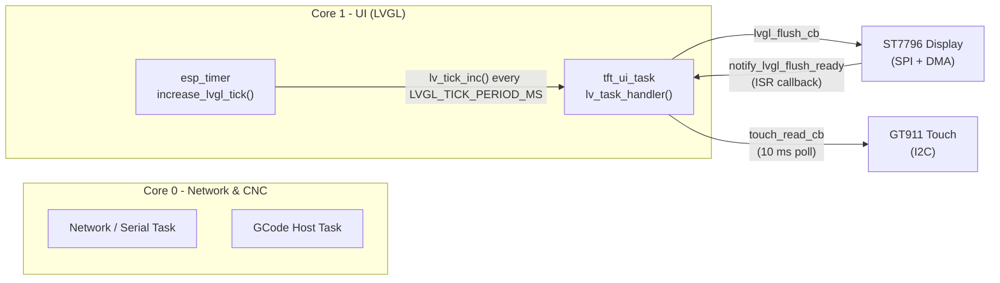
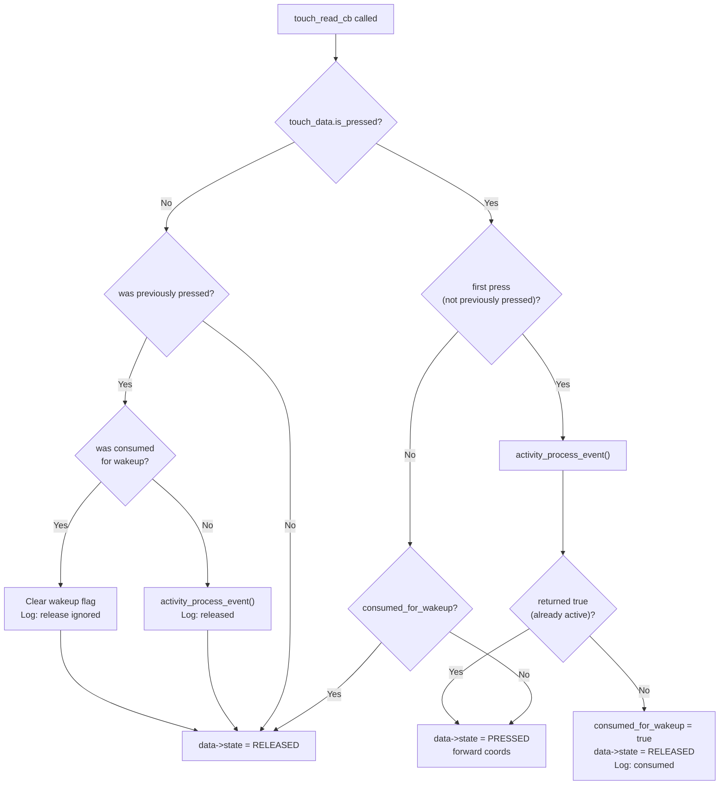
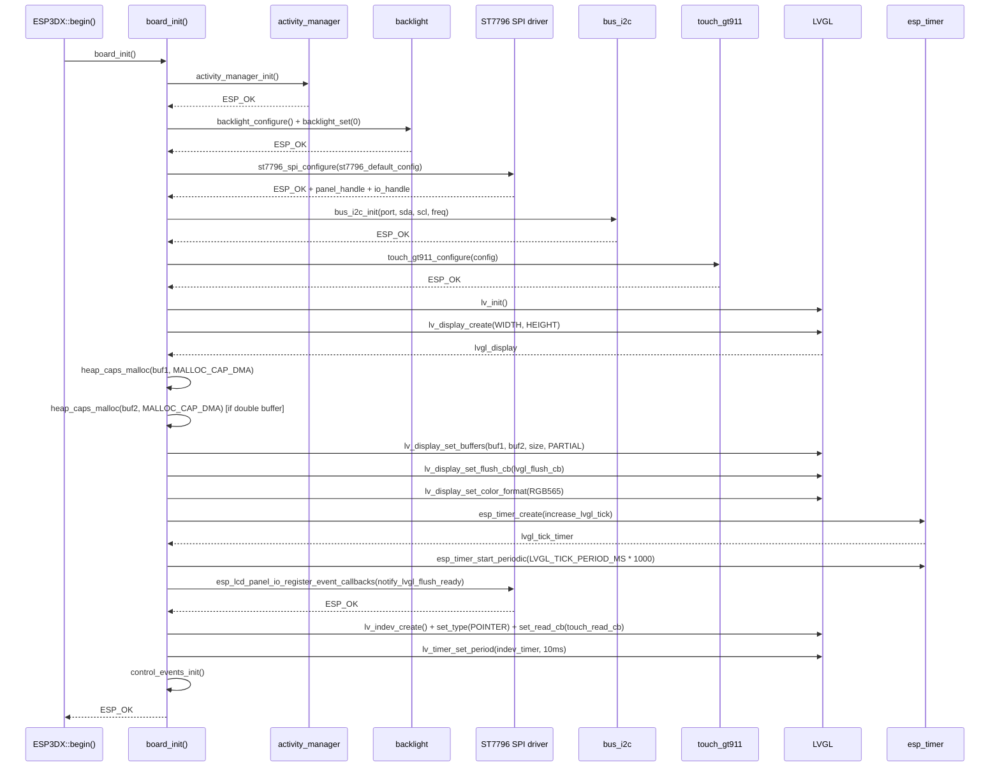
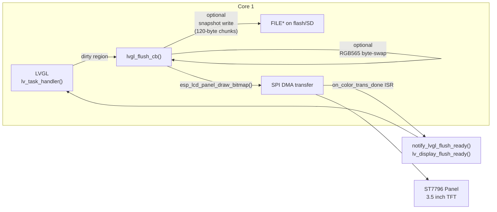
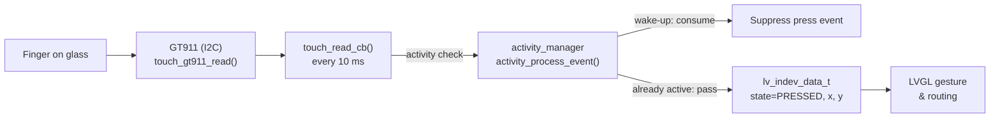
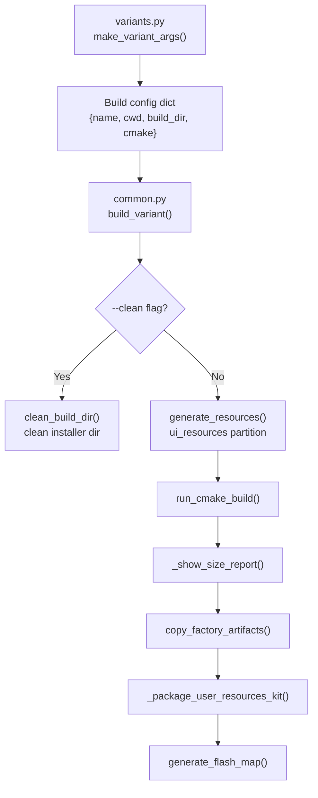
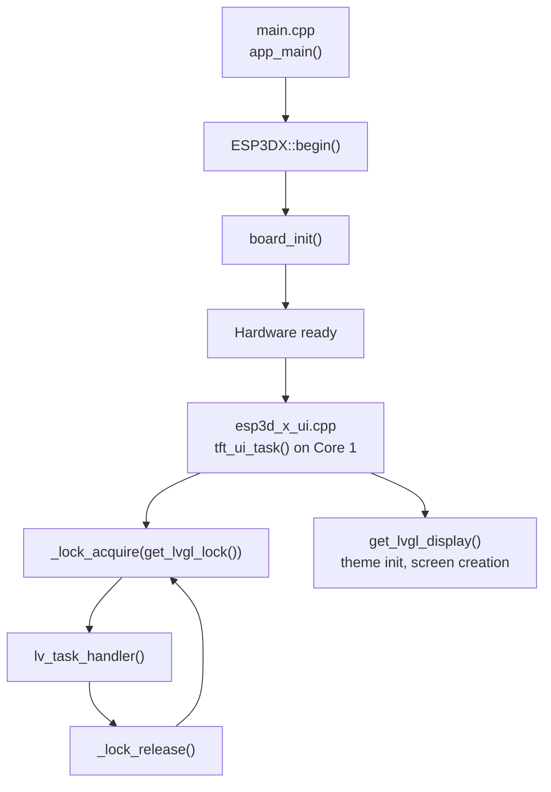

# esp32s3_bzm_tft35_gt911_bsp

Board Support Package (BSP) for the **ESP32-S3 BZM TFT 3.5″** board, which pairs an ST7796-driven SPI display with a GT911 capacitive touch controller. The BSP bridges the raw hardware drivers to LVGL and the ESP3D application layer, and is accompanied by a standalone factory application and a Python-based build-variant system.

---

## Table of Contents

1. [Hardware Overview](#1-hardware-overview)
2. [Module Structure](#2-module-structure)
3. [Architecture](#3-architecture)
4. [BSP Component Reference](#4-bsp-component-reference)
   - 4.1 [board_init()](#41-board_init)
   - 4.2 [Display Subsystem](#42-display-subsystem)
   - 4.3 [Touch Subsystem](#43-touch-subsystem)
   - 4.4 [Control Event System](#44-control-event-system)
5. [Initialization Sequence](#5-initialization-sequence)
6. [Data Flow](#6-data-flow)
7. [Factory Application](#7-factory-application)
8. [Build System](#8-build-system)
9. [Configuration Reference](#9-configuration-reference)
10. [Integration with the Application Layer](#10-integration-with-the-application-layer)
11. [Related Modules](#11-related-modules)

---

## 1. Hardware Overview

| Attribute | Value |
|---|---|
| MCU | ESP32-S3 (WROOM module) |
| Display controller | ST7796 |
| Display interface | SPI (hardware SPI with DMA) |
| Display color format | RGB565 (16-bit) |
| Touch controller | GT911 |
| Touch interface | I2C |
| SD card interface | SPI |
| Backlight control | GPIO (optional PWM via LEDC) |
| Encoder | Quadrature via ESP32-S3 PCNT (optional) |
| Buttons | Up to 3, active-LOW |
| Buzzer | GPIO-driven passive buzzer |

The board exposes a 3.5″ TFT with capacitive multi-touch. Unlike the resistive-touch boards in the same family (see [esp32_3248s035r](esp32_3248s035r_bsp.md)), no calibration is required for the GT911 — coordinates are read directly from the controller over I2C.

---

## 2. Module Structure

```
boards/esp32s3_bzm_tft35_gt911/
├── components/
│   └── bsp/                          ← BSP component (runtime firmware)
│       ├── board_init.c              ← Master HW + LVGL initialization
│       ├── board_init.h
│       ├── board_config.h            ← Pin assignments & display constants
│       ├── control_event.h           ← control_event_t definition
│       ├── control_types.c           ← Custom LVGL event registration
│       ├── control_types.h
│       ├── tasks_def.h               ← FreeRTOS task priorities/stack sizes
│       ├── disp_st7796_spi_def.h     ← ST7796 SPI config instance
│       ├── touch_gt911_def.h         ← GT911 I2C config instance
│       └── disp_backlight_def.h      ← Backlight config instance
├── Factory/
│   ├── bootloader_components/
│   │   └── custom_bootloader/
│   │       └── hooks.c               ← Factory bootloader hooks
│   ├── custom_bootloader/
│   │   └── hooks.c                   ← OTA-backup bootloader hooks
│   ├── main/
│   │   ├── main.c                    ← Factory app entry point
│   │   ├── st7796.c / .h             ← Bare-metal ST7796 driver
│   │   ├── touch.c / touch.h         ← GT911 wrapper (factory context)
│   │   ├── gfx.c / .h               ← Software framebuffer & primitives
│   │   ├── buttons.c / .h            ← GPIO button driver
│   │   ├── buzzer.c / .h             ← Passive buzzer driver
│   │   ├── encoder.c / .h            ← Quadrature encoder (PCNT)
│   │   ├── sdcard.c / .h             ← SPI SD card (FAT)
│   │   └── factory_log.h             ← Factory logging control
│   └── tools/
│       ├── flash_all.py              ← Flash complete image set
│       └── flash_factory.py          ← Flash factory app only
└── build_scripts/
    ├── build_one.py                  ← Single-variant build entry
    ├── common.py                     ← Shared build helpers
    └── variants.py                   ← Firmware variant definitions
```

---

## 3. Architecture

### 3.1 Component Dependency Graph



### 3.2 Runtime Task Model



LVGL **must** run entirely on Core 1. The `_lock_t lvgl_api_lock` mutex (returned by `get_lvgl_lock()`) must be held by any Core 0 code that calls LVGL APIs.

---

## 4. BSP Component Reference

### 4.1 `board_init()`

**File:** `boards/esp32s3_bzm_tft35_gt911/components/bsp/board_init.c`

Top-level hardware initialization. Called once from `ESP3DX::begin()` before the UI task starts.

```c
esp_err_t board_init(void);
```

**Sequence of operations:**

1. `activity_manager_init()` — initializes the inactivity / wake-up tracker
2. *(if `ESP3D_BRIGHTNESS_CONTROL_FEATURE`)* `backlight_configure()` + `backlight_set(0)` — backlight off during init
3. `st7796_spi_configure()` — configures the SPI bus and ST7796 panel
4. `init_touch_controller()` — configures the I2C bus and GT911
5. `init_lvgl()` — creates the LVGL display, allocates draw buffers, starts the tick timer, registers flush and indev callbacks
6. `control_events_init()` — registers custom LVGL event IDs

Returns `ESP_OK` on success; the first failing step returns its `esp_err_t` immediately.

**Accessor functions** (used by `ESP3DXUi`):

| Function | Returns |
|---|---|
| `get_lvgl_display()` | `lv_display_t*` — the active LVGL display handle |
| `get_lvgl_lock()` | `_lock_t*` — mutex for LVGL API access from other cores |
| `get_touch_indev()` | `lv_indev_t*` — the LVGL touch input device |

---

### 4.2 Display Subsystem

#### Driver: ST7796 over SPI

The ST7796 panel is initialized by the shared `disp_st7796_spi` driver (see [display_drivers_spi](display_drivers_spi.md)). Configuration is supplied by `disp_st7796_spi_def.h` (board-specific pin/timing instance of `spi_st7796_config_t`).

| Parameter | Description |
|---|---|
| `spi_bus.host` | SPI host index (`SPI2_HOST` or `SPI3_HOST`) |
| `spi_bus.mosi/miso/sclk/cs/dc/rst` | GPIO pin assignments |
| `spi_bus.clock_speed_hz` | SPI clock (typically 40–80 MHz) |
| `display.width / height` | Panel resolution |
| `display.orientation` | Rotation mapped to MADCTL register |
| `interface.swap_color_bytes` | RGB565 byte-swap for DMA alignment |

#### LVGL Draw Buffers

Buffers are allocated from **DMA-capable DRAM** (`MALLOC_CAP_DMA`):

```
draw_buf_size = DISPLAY_WIDTH_PX × DISPLAY_BUFFER_LINES_NB × sizeof(lv_color16_t)
```

Double-buffering is controlled by `DISPLAY_USE_DOUBLE_BUFFER_FLAG`. When enabled, `lvgl_buf2` is allocated alongside `lvgl_buf1`, allowing DMA transfers to overlap with the next render pass.

#### `lvgl_flush_cb()`

Called by LVGL when a dirty region must be pushed to the display:

```c
static void lvgl_flush_cb(lv_display_t *disp, const lv_area_t *area, uint8_t *px_map);
```

1. *(if `ESP3D_SNAPSHOT_FEATURE`)* Captures pixel data to an open `FILE*` in `g_snapshot` in 120-byte chunks
2. *(if `DISPLAY_SWAP_COLOR_FLAG`)* Byte-swaps the RGB565 buffer in-place via `lv_draw_sw_rgb565_swap()`
3. Calls `esp_lcd_panel_draw_bitmap()` to push the rectangle over SPI/DMA

#### `notify_lvgl_flush_ready()`

Registered as `esp_lcd_panel_io_callbacks_t.on_color_trans_done`. Fires when the SPI DMA transfer completes and calls `lv_display_flush_ready()` to unblock LVGL.

```c
static bool notify_lvgl_flush_ready(esp_lcd_panel_io_handle_t panel_io,
                                    esp_lcd_panel_io_event_data_t *edata,
                                    void *user_ctx);
```

#### `increase_lvgl_tick()`

Periodic `esp_timer` callback that advances the LVGL timebase:

```c
static void increase_lvgl_tick(void *arg);  // calls lv_tick_inc(LVGL_TICK_PERIOD_MS)
```

Period: `LVGL_TICK_PERIOD_MS` milliseconds (defined in `tasks_def.h`).

---

### 4.3 Touch Subsystem

Guarded by `ESP3D_TOUCH_FEATURE`. When disabled, all touch symbols are omitted.

#### Driver: GT911 over I2C

The GT911 is a capacitive multi-touch controller. Only the first touch point is used by LVGL. Configuration is supplied by `touch_gt911_def.h` (board-specific instance of `touch_gt911_config_t`).

| Field | Description |
|---|---|
| `i2c_addr[3]` | Candidate I2C addresses (0x5D / 0x14), 0-terminated |
| `i2c_port` | I2C port index |
| `i2c_clk_speed` | I2C frequency (typically 400 kHz) |
| `rst_pin / int_pin` | Reset and interrupt GPIO pins |
| `swap_xy / invert_x / invert_y` | Coordinate orientation corrections |
| `x_max / y_max` | 0 = auto-detected from device registers |

#### `init_touch_controller()`

```c
static esp_err_t init_touch_controller(void);
```

1. `bus_i2c_init()` — initializes the shared I2C bus
2. `touch_gt911_configure()` — programs the GT911 and verifies I2C communication

#### `touch_read_cb()`

Registered as the LVGL input device read callback. Called every **10 ms** (configured via `lv_timer_set_period`).

```c
static void touch_read_cb(lv_indev_t *indev, lv_indev_data_t *data);
```

**Wake-up logic:** The first touch event after the screen has been idle is forwarded to `activity_process_event()`. If the activity manager indicates a wake-up transition, the touch is *consumed* — it resets the idle timer but does **not** dispatch a press event to LVGL. This prevents an accidental tap from triggering UI actions after the screen wakes.



---

### 4.4 Control Event System

**Files:**
- `control_event.h` — `control_event_t` structure
- `control_types.c` — `control_events_init()` and custom event IDs

#### `control_event_t`

Unified structure passed with any custom LVGL control event:

```c
typedef struct {
    lv_indev_t      *indev;          // Source input device
    uint32_t         btn_id;         // Button / switch ID
    lv_indev_type_t  type;           // POINTER, ENCODER, BUTTON, …
    control_family_t family_id;      // SWITCH, ENCODER, POTENTIOMETER, …
    int32_t          steps;          // Encoder step delta
    uint32_t         press_duration; // Duration in ms (buttons)
} control_event_t;
```

#### Custom LVGL Events

Three custom LVGL event codes are registered after `lv_init()`:

| Global Variable | Meaning |
|---|---|
| `LV_EVENT_SWITCH_PRESSED` | A physical switch was pressed |
| `LV_EVENT_SWITCH_RELEASED` | A physical switch was released |
| `LV_EVENT_POTENTIOMETER_CHANGED` | Analog potentiometer value changed |

IDs are assigned dynamically by `lv_event_register_id()` and stored in module-level `lv_event_code_t` globals. This board does not use the encoder or potentiometer paths in the main BSP (these are available for future extension), but the events are pre-registered so that the application layer can subscribe to them uniformly across all supported boards.

> **Note:** `control_events_init()` **must** be called after `lv_init()`. `board_init()` guarantees this ordering.

---

## 5. Initialization Sequence



---

## 6. Data Flow

### 6.1 Render Path (LVGL → Display)



### 6.2 Touch Input Path (Hardware → LVGL)



---

## 7. Factory Application

**Location:** `boards/esp32s3_bzm_tft35_gt911/Factory/`

The factory application is a **standalone ESP-IDF project** compiled separately from the main firmware. It runs directly on the hardware without LVGL, using bare-metal SPI writes for the display and a software framebuffer (`gfx.c`).

### 7.1 Purpose

- Hardware acceptance testing after PCB assembly
- SD-card-based firmware update workflow
- OTA partition management (backup/restore `otadata`)
- Screen snapshot capture for visual verification

### 7.2 Key Modules

| Module | File(s) | Description |
|---|---|---|
| Display | `st7796.c` | Bare-metal SPI init + flush (no LVGL) |
| Touch | `touch.c` / `touch.h` | GT911 wrapper returning `touch_point_t` |
| Graphics | `gfx.c` | Software framebuffer, primitives, snapshot |
| Buttons | `buttons.c` | GPIO active-LOW, `button_is_pressed()` / `button_wait_press()` |
| Encoder | `encoder.c` | PCNT quadrature decoder, GPIO_NUM_NC guard |
| Buzzer | `buzzer.c` | GPIO passive buzzer, `buzzer_beep_short()` |
| SD Card | `sdcard.c` | SPI FAT mount/unmount |
| Main | `main.c` | Menu system, OTA, SD update, snapshots |

### 7.3 Factory Display Initialization

`st7796_init()` performs a full hardware sequence:

1. Configure DC / RST / backlight GPIO outputs
2. Initialize SPI2 bus + attach device at `TFT_SPI_FREQ_HZ`
3. Hardware reset via RST pin (10 ms low → 120 ms recovery)
4. SLPOUT (0x11) + 120 ms
5. MADCTL (0x36) — orientation from `rotation_map[]`
6. COLMOD (0x3A) — pixel format 0x55 (RGB565)
7. Positive/negative gamma curves (0xE0 / 0xE1)
8. DISPON (0x29)

`st7796_flush()` transfers pixel data in **4 096-byte chunks** via polling SPI to respect DMA size limits.

### 7.4 Factory Bootloader Hooks

Two bootloader override layers exist:

| Path | Hook | Purpose |
|---|---|---|
| `Factory/bootloader_components/custom_bootloader/hooks.c` | `bootloader_before_init` / `bootloader_after_init` | Lightweight hooks framework |
| `Factory/custom_bootloader/hooks.c` | `backup_and_erase_otadata` + `is_button_pressed` | Detects button hold at boot; backs up `otadata` and erases it to force factory app on next reset |

### 7.5 Flash Tools

| Script | Description |
|---|---|
| `tools/flash_all.py` | Flash bootloader + partition table + factory app + full firmware |
| `tools/flash_factory.py` | Flash factory app partition only |

---

## 8. Build System

**Location:** `boards/esp32s3_bzm_tft35_gt911/build_scripts/`

The build system follows the same pattern as all other boards in the project.

### 8.1 Entry Points

| Script | CLI Usage | Description |
|---|---|---|
| `build_one.py` | `python build_one.py [--clean]` | Build a single variant |
| `build_one.py` | `python build_one.py --check` | CMake dry-run (no compile) |

### 8.2 Variant Pipeline



`make_variant_args()` starts from `DEFAULT_OFF_CMAKE_ARGS` (all optional features OFF) and selectively enables flags:

```python
def make_variant_args(*on_flags):
    args = DEFAULT_OFF_CMAKE_ARGS.copy()
    for flag in on_flags:
        args.extend(["-D", flag])
    return args
```

The `check_variant()` function runs a CMake configuration pass (`run_cmake_check`) without compiling — used in CI to verify sdkconfig and CMake logic without a full build.

---

## 9. Configuration Reference

### 9.1 Display Constants (`board_config.h`)

| Macro | Description |
|---|---|
| `BOARD_NAME_STR` | Human-readable board name |
| `BOARD_VERSION_STR` | Board version string |
| `DISPLAY_WIDTH_PX` | Horizontal resolution |
| `DISPLAY_HEIGHT_PX` | Vertical resolution |
| `DISPLAY_BUFFER_LINES_NB` | Number of scanlines per LVGL draw buffer |
| `DISPLAY_USE_DOUBLE_BUFFER_FLAG` | `1` = allocate two buffers for DMA overlap |
| `DISPLAY_SWAP_COLOR_FLAG` | `1` = byte-swap RGB565 before SPI transfer |
| `LVGL_TICK_PERIOD_MS` | LVGL tick interval in milliseconds |

### 9.2 Touch Constants

| Macro | Description |
|---|---|
| `TOUCH_I2C_PORT_IDX` | I2C peripheral index |
| `TOUCH_I2C_SDA_PIN` | SDA GPIO |
| `TOUCH_I2C_SCL_PIN` | SCL GPIO |
| `TOUCH_I2C_FREQ_HZ` | I2C clock (e.g. 400000) |
| `TOUCH_RST_PIN` | GT911 reset GPIO |
| `TOUCH_IRQ_PIN` | GT911 interrupt GPIO |
| `TOUCH_SWAP_XY_FLAG` | Mirror X/Y axes in GT911 config |
| `TOUCH_MIRROR_X_FLAG` | Invert X coordinate |
| `TOUCH_MIRROR_Y_FLAG` | Invert Y coordinate |

### 9.3 Feature Guards

| Feature Define | Effect when enabled |
|---|---|
| `ESP3D_DISPLAY_FEATURE` | Compiles display + LVGL init path |
| `ESP3D_TOUCH_FEATURE` | Compiles GT911 init + `touch_read_cb` |
| `ESP3D_BRIGHTNESS_CONTROL_FEATURE` | Compiles backlight configure call |
| `ESP3D_SNAPSHOT_FEATURE` | Compiles pixel-capture block in `lvgl_flush_cb` |

### 9.4 GT911 Driver (`touch_gt911_config_t`)

See [touch_drivers](touch_drivers.md) for full field documentation.

The BSP supplies a board-specific default config instance in `touch_gt911_def.h`, referenced as `touch_gt911_default_config`.

### 9.5 ST7796 SPI Driver (`spi_st7796_config_t`)

See [display_drivers_spi](display_drivers_spi.md) for full field documentation.

The BSP supplies a board-specific default config instance in `disp_st7796_spi_def.h`, referenced as `st7796_default_config`.

### 9.6 Backlight Driver (`backlight_config_t`)

See [display_drivers_spi](display_drivers_spi.md) for full field documentation.

The BSP supplies a board-specific default config instance in `disp_backlight_def.h`, referenced as `backlight_cfg`.

---

## 10. Integration with the Application Layer



The UI task acquires `get_lvgl_lock()` around every `lv_task_handler()` call. Any code on Core 0 that must call LVGL APIs (e.g., value observers) must also acquire the same lock. This single mutex guards the entire LVGL call graph.

Refer to:
- `lvgl_system` — `esp3d_lvgl.cpp`, `lv_timer_pause_all` / `lv_timer_resume_all`
- [ui_core](ui_core.md) — `UIManager`, screen management, theme system
- [activity_manager](esp3d_activity_manager.md) — inactivity timeout, wake-up policy

---

## 11. Related Modules

| Module | Documentation | Relationship |
|---|---|---|
| ST7796 / ILI9341 SPI drivers | [display_drivers_spi](display_drivers_spi.md) | Hardware display driver used by this BSP |
| GT911 / FT5x06 / XPT2046 touch drivers | [touch_drivers](touch_drivers.md) | Hardware touch driver used by this BSP |
| Backlight driver | [display_drivers_spi](display_drivers_spi.md) | PWM/GPIO backlight control |
| I2C bus driver | [communication_bus_drivers](bus_drivers.md) | Shared I2C bus for GT911 |
| Activity manager | [activity_manager](esp3d_activity_manager.md) | Wake-up / inactivity detection |
| LVGL core | `lvgl_system` | Graphics engine integrated by this BSP |
| LVGL display | `lvgl_display` | `lv_display_t` lifecycle |
| LVGL input device | [input_device](physical_input.md) | `lv_indev_t` and read callback |
| LVGL event system | `lvgl_event_system` | `lv_event_register_id()` used by `control_events_init()` |
| UI core / UIManager | [ui_core](ui_core.md) | Consumes `get_lvgl_display()` and `get_lvgl_lock()` |
| Pibot Pendant v1.0 BSP | [pibot_pendant_v1_0_bsp](pibot_pendant_v1_0_bsp.md) | Reference SPI-display BSP with encoder + buttons |
| ESP32 3248S035R BSP | [esp32_3248s035r_bsp](esp32_3248s035r_bsp.md) | Similar SPI + ST7796 board with resistive touch (XPT2046) |
| ESP32S3 4827S043C BSP | [esp32s3_4827s043c_bsp](esp32s3_4827s043c_bsp.md) | Similar ESP32-S3 board with RGB parallel display and FT5x06 touch |
| Factory documentation | [docs/Factory](docs/Factory/) | Factory app architecture and OTA bootloader |
| Display drivers architecture | [docs/architecture/display_drivers.md](https://github.com/luc-github/Pibot-cnc-pendant-firmware/blob/main/docs/architecture/display_drivers.md) | SPI vs RGB panel driver patterns |
