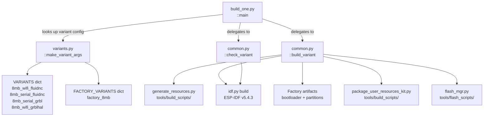
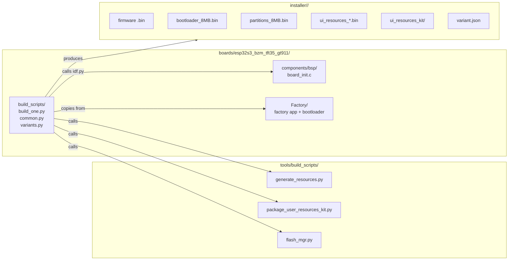
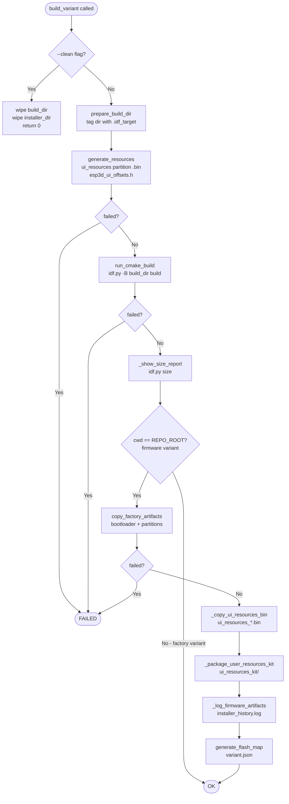
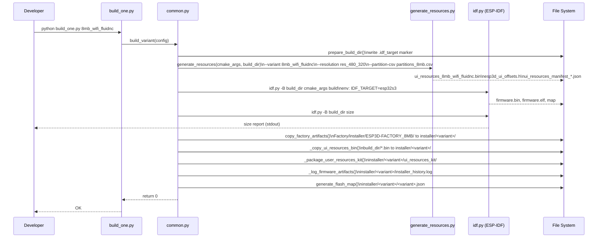
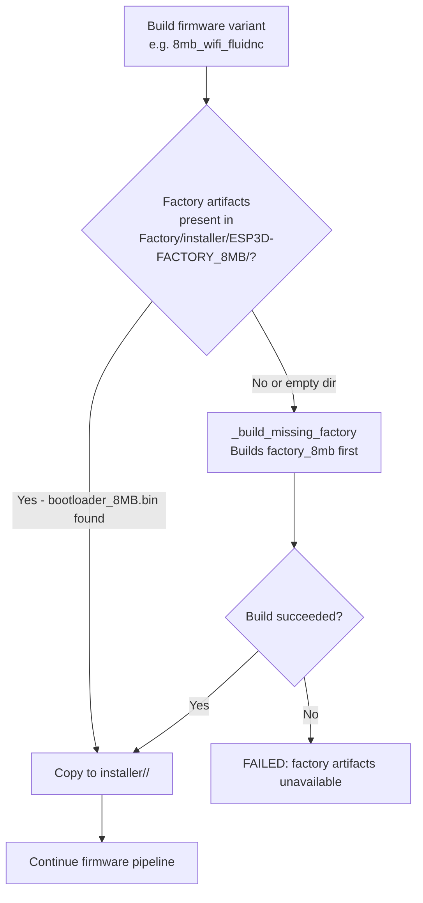
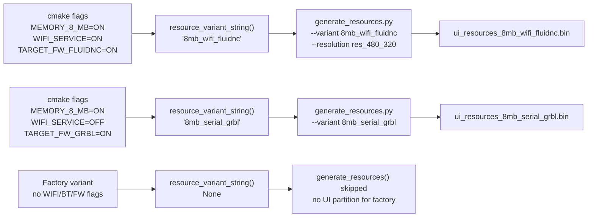

# esp32s3_bzm_tft35_gt911_build_scripts

## Introduction

The `esp32s3_bzm_tft35_gt911_build_scripts` module contains the board-specific Python build automation for the **ESP32-S3 BZM TFT35 GT911** hardware target — an ESP32-S3 board with a 480×320 ST7796 SPI display and a GT911 capacitive touch controller.

These scripts sit in `boards/esp32s3_bzm_tft35_gt911/build_scripts/` and serve as the single authoritative entry point for compiling, packaging, and installing any firmware variant for this board. They orchestrate the full pipeline: UI resource generation, ESP-IDF cmake builds via `idf.py`, factory artifact management, installer packaging, and flash-map generation.

The module is one instance of a board-specific build pattern repeated across the BSP layer; its sibling counterparts follow an identical three-file structure. Where those boards differ in hardware (display driver, touch controller, resolution, memory), the differences are isolated entirely within `variants.py` and the board's `CMakeLists.txt` / `sdkconfig` files — the pipeline logic in `common.py` is shared by convention.

---

## Architecture

### Module Structure

```
boards/esp32s3_bzm_tft35_gt911/
└── build_scripts/
    ├── build_one.py      # CLI entry point — builds or checks a single named variant
    ├── common.py         # Build pipeline engine and helper utilities
    └── variants.py       # Variant matrix (cmake flags + paths for every build config)
```

### Component Relationships



### Position in the Broader System



> See [esp32s3_bzm_tft35_gt911_bsp.md](esp32s3_bzm_tft35_gt911_bsp.md) for the runtime BSP layer this build targets.  
> See [esp32s3_bzm_tft35_gt911_factory_app.md](esp32s3_bzm_tft35_gt911_factory_app.md) for the factory app whose artifacts are consumed here.  
> See [tools_build_scripts.md](tools_build_scripts.md) for the shared resource-generation toolchain invoked by these scripts.

---

## Component Reference

### `variants.py` — Variant Matrix

#### `make_variant_args(*on_flags)`

The foundation of the variant system. It produces a complete list of cmake `-D` arguments by:

1. Starting from `DEFAULT_OFF_CMAKE_ARGS` — every known cmake option (board selectors, memory, PSRAM, transports, firmware targets, features) explicitly set to `OFF`.
2. Extending that list with each `on_flags` argument formatted as `-D <flag>` (already contains `=ON`).

**Why all-OFF first?**  
ESP-IDF cmake caches values between builds. Without explicitly zeroing every option, a stale cache from a previous variant could silently activate features in a new build. The all-OFF base prevents cross-variant contamination.

```python
# Example: produce cmake args for the 8mb_wifi_fluidnc variant
make_variant_args(
    "ESP32S3_BZM_TFT35_GT911=ON",
    "MEMORY_8_MB=ON",
    "TARGET_FW_FLUIDNC=ON",
    "SERIAL_SERVICE=ON",
    "WIFI_SERVICE=ON",
    "TFT_UI_SERVICE=ON",
    "TFT_TOUCH_SERVICE=ON",
    "MDNS_SERVICE=ON",
    "SOCKET_CLIENT_SERVICE=ON",
    "UPDATE_SERVICE=ON",
    "LUA_INTERPRETER_SERVICE=ON",
)
# → [..., "-D", "ESP32S3_BZM_TFT35_GT911=OFF", ..., "-D", "ESP32S3_BZM_TFT35_GT911=ON", ...]
```

#### Variant Registry

All variants are defined as Python dicts in `VARIANTS` and `FACTORY_VARIANTS`. Each entry contains:

| Key | Description |
|-----|-------------|
| `name` | Canonical identifier string |
| `cmake` | List of `-D` args produced by `make_variant_args` |
| `cwd` | Working directory for `idf.py` (`REPO_ROOT` for firmware, `FACTORY_DIR` for factory) |
| `build_dir` | Absolute path to the cmake build directory |

**Firmware Variants (`VARIANTS`)**

| Variant Name | Memory | Transport | Firmware | Notable Features |
|---|---|---|---|---|
| `8mb_wifi_fluidnc` | 8 MB | WiFi (socket client) | FluidNC | mDNS, LUA, TFT UI, touch |
| `8mb_serial_fluidnc` | 8 MB | UART serial | FluidNC | TFT UI, touch |
| `8mb_serial_grbl` | 8 MB | UART serial | GRBL | TFT UI, touch |
| `8mb_wifi_grblhal` | 8 MB | WiFi (socket client) | grblHAL | mDNS, TFT UI, touch |

**Factory Variant (`FACTORY_VARIANTS`)**

| Variant Name | Memory | Purpose |
|---|---|---|
| `factory_8mb` | 8 MB | Initial flash: custom bootloader + partition table + factory app |

> **Note**: Factory variants set `cwd = FACTORY_DIR` (the `Factory/` subdirectory) and are built separately from the main firmware. They produce the bootloader and partition binaries that all regular variants depend on.

#### Board-Specific Constants

| Constant | Value | Purpose |
|---|---|---|
| `RESOLUTION` | `"res_480_320"` | Passed to `generate_resources.py` to select the correct icon/font sizes for the 480×320 ST7796 display |
| `EXPECTED_IDF_TARGET` | `"esp32s3"` | Forced into the build environment to prevent IDF target mismatch from VSCode or shell settings |

---

### `common.py` — Build Pipeline Engine

#### `build_variant(config)`

The primary build function. Executes the full pipeline for a given variant config dict.



**Key behaviors**:

- `--clean` skips the entire build and only removes artifacts — it returns `0` immediately after cleanup.
- For factory variants (`cwd != REPO_ROOT`), only steps up through `_show_size_report` run. The artifact-packaging steps are skipped.
- If `copy_factory_artifacts` finds missing factory binaries, it **auto-triggers a factory build** before continuing. This ensures the bootloader and partition table are always available.

#### `check_variant(config)`

A lightweight check mode that runs `idf.py reconfigure` (cmake configuration only) without compiling. Used with the `--check` flag in `build_one.py`. Useful for validating cmake flags and sdkconfig without the full build cost.

#### Resource Generation Helpers

| Function | Purpose |
|---|---|
| `resource_variant_string(cmake_args)` | Converts cmake flags to `generate_resources.py` variant string (e.g. `8mb_wifi_fluidnc`). Returns `None` for factory variants which have no UI resources partition. |
| `generate_resources(cmake_args, build_dir)` | Invokes `tools/build_scripts/generate_resources.py` with the correct `--variant`, `--resolution`, `--partition-csv`, and `--out` arguments. Optionally passes `--board-resources` if a `resources/` directory exists under the board root. |

#### Build Directory Management

| Function | Purpose |
|---|---|
| `prepare_build_dir(build_dir)` | Ensures `build_dir` exists and writes a `.idf_target` marker file. Calls `_ensure_clean_build_dir` first to wipe the directory if the cached target does not match `esp32s3`. |
| `_ensure_clean_build_dir(build_dir)` | Reads `.idf_target` from an existing build directory. If the value does not match `EXPECTED_IDF_TARGET`, the directory is removed with `shutil.rmtree` to prevent cross-target corruption. |

#### Factory Artifact Management

| Function | Purpose |
|---|---|
| `copy_factory_artifacts(cmake_args)` | Copies bootloader and partition binaries from `Factory/installer/ESP3D-FACTORY_8MB/` into `installer/<variant>/`. Skips `size_report.txt` to avoid clobbering the firmware variant's own report. |
| `_factory_artifacts_complete(source_dir)` | Returns `True` only if `source_dir` exists and contains at least one `bootloader_*.bin` file. An empty directory (cmake configured but never built) is treated the same as a missing directory. |
| `_build_missing_factory(source_dir)` | Locates the factory variant whose installer output matches `source_dir` and calls `build_variant` on it. Used for automatic factory rebuilds. |

#### Installer Packaging

| Function | Purpose |
|---|---|
| `_copy_ui_resources_bin(build_dir, installer_dir)` | Copies any `ui_resources_*.bin` files from the build directory into the installer directory. |
| `_package_user_resources_kit(cmake_args, build_dir, installer_dir)` | Calls `tools/build_scripts/package_user_resources_kit.py` to assemble the standalone `ui_resources_kit/` directory — a self-contained bundle end users can use to customize icons, fonts, and theme colors without a full repo checkout. Requires a manifest JSON produced by `generate_resources.py`. |
| `generate_flash_map(config)` | Calls `tools/flash_scripts/flash_mgr.py --generate` to produce the variant's flash map JSON, which the web installer and flash tooling use to know exactly what to flash at which addresses. |
| `_log_firmware_artifacts(...)` | Appends a timestamped section to `installer_history.log` categorizing each file as `FACTORY` or `FIRMWARE` for audit purposes. |

#### cmake Naming Utilities

| Function | Purpose |
|---|---|
| `build_config_name(cmake_args)` | Derives the human-readable variant output directory name (e.g. `ESP32S3_BZM_TFT35_GT911_8MB_wifi_fluidnc`) from cmake flags. Used for both `installer/<subdir>` and log entries. |
| `installer_dir_for(config)` | Returns the absolute installer output path for any variant config. Regular variants map to `REPO_ROOT/installer/<build_config_name>`. Factory variants map to `Factory/installer/ESP3D-FACTORY_8MB`. |
| `parse_cmake_flags(cmake_args)` | Parses a cmake `-D` arg list into a `{name: value}` dict. Handles both `-D NAME=VALUE` (two tokens) and `-DNAME=VALUE` (single token) forms. |

#### Environment and IDF Management

| Function | Purpose |
|---|---|
| `ensure_idf_py()` | Confirms `idf.py` exists at `IDF_PATH/tools/idf.py`. Prints a clear error and exits if not found. `IDF_PATH` is read from the environment (default `C:\Users\luc\esp\v5.4.3\esp-idf`). |
| `run_cmake_build(cmake_args, cwd, build_dir)` | Assembles and runs `python idf.py -B <build_dir> <cmake_args> [-D PROD_BUILD=ON] build`. Forces `IDF_TARGET=esp32s3` in the subprocess environment. Passes `CMAKE_BUILD_PARALLEL_LEVEL` if `--jobs=N` was given. |
| `run_cmake_check(cmake_args, cwd, build_dir)` | Same as `run_cmake_build` but runs `reconfigure` instead of `build`. |
| `_get_jobs_env_value()` | Scans `sys.argv` for a `--jobs=N` argument forwarded by `build_mgr.py`. The value is passed via `CMAKE_BUILD_PARALLEL_LEVEL` because `idf.py` does not accept a `-j` CLI flag. |

---

### `build_one.py` — CLI Entry Point

#### `main()`

The standalone command-line interface for targeting a single named variant.

**Usage**:
```bash
python build_one.py <variant_name> [--clean] [--check]
```

**Behavior**:
1. Parses `sys.argv` to extract the variant name and option flags.
2. Merges `FACTORY_VARIANTS` and `VARIANTS` into a single lookup dict.
3. If no name is given, prints the list of available variants and exits with code 1.
4. If the name is unknown, prints an error and exits with code 1.
5. `--check`: calls `check_variant()` (cmake reconfigure only).
6. Default: calls `build_variant()` (full build pipeline).

**Examples**:
```bash
# Full build
python build_one.py 8mb_wifi_fluidnc

# Build with clean
python build_one.py 8mb_serial_grbl --clean

# CMake check only (no compilation)
python build_one.py 8mb_wifi_grblhal --check

# Build factory app
python build_one.py factory_8mb
```

> `build_one.py` is typically invoked by `build_mgr.py` (see [tools_build_scripts.md](tools_build_scripts.md)) when building the full variant matrix, but can also be run manually for single-variant development cycles.

---

## Data Flow

### Full Firmware Build Pipeline



### Factory Auto-Build Dependency



### Resource Variant String Mapping



---

## Installer Output Layout

After a successful build of `8mb_wifi_fluidnc`, the `installer/` directory contains:

```
installer/
└── ESP32S3_BZM_TFT35_GT911_8MB_wifi_fluidnc/
    ├── bootloader_8MB.bin                     ← from Factory/installer/ESP3D-FACTORY_8MB/
    ├── partitions_8MB.bin                     ← from Factory/installer/ESP3D-FACTORY_8MB/
    ├── ota_data_initial_8MB.bin               ← from Factory/installer/ESP3D-FACTORY_8MB/
    ├── firmware.bin                           ← main application image
    ├── ui_resources_8mb_wifi_fluidnc.bin      ← UI partition
    ├── ESP32S3_BZM_TFT35_GT911_8MB_wifi_fluidnc.json  ← flash map
    ├── installer_history.log                  ← timestamped audit log
    └── ui_resources_kit/                      ← standalone customization bundle
        ├── build_ui_resources_from_manifest.py
        ├── ui_resources_manifest_*.json
        └── resources/                         ← default PNG/font sources
```

The factory app is built separately and stored at:

```
boards/esp32s3_bzm_tft35_gt911/Factory/installer/
└── ESP3D-FACTORY_8MB/
    ├── bootloader_8MB.bin
    ├── partitions_8MB.bin
    ├── ota_data_initial_8MB.bin
    └── factory.bin
```

---

## Variant Feature Matrix

| Variant | Flash | CNC Transport | Firmware | WiFi | mDNS | LUA | Update |
|---|---|---|---|---|---|---|---|
| `8mb_wifi_fluidnc` | 8 MB | Socket client (TCP) | FluidNC | ✓ | ✓ | ✓ | ✓ |
| `8mb_serial_fluidnc` | 8 MB | UART serial | FluidNC | ✗ | ✗ | ✗ | ✓ |
| `8mb_serial_grbl` | 8 MB | UART serial | GRBL | ✗ | ✗ | ✗ | ✓ |
| `8mb_wifi_grblhal` | 8 MB | Socket client (TCP) | grblHAL | ✓ | ✓ | ✗ | ✓ |
| `factory_8mb` | 8 MB | — | — | ✗ | ✗ | ✗ | ✗ |

All firmware variants include: `TFT_UI_SERVICE`, `TFT_TOUCH_SERVICE`, and `SERIAL_SERVICE` (even WiFi variants retain serial for debugging/fallback).

> ⚠️ WiFi and Bluetooth are mutually exclusive on this board (no PSRAM). The BZM TFT35 GT911 has no BT variants defined — only WiFi or serial. See [esp32_memory_constraints.md](https://github.com/luc-github/Pibot-cnc-pendant-firmware/blob/main/docs/guides/esp32_memory_constraints.md) and `cmake/sanity_check.cmake` for the underlying constraints.

---

## Developer Guide

### Prerequisites

- ESP-IDF v5.4.3 installed and `IDF_PATH` set in the environment (or the default Windows path `C:\Users\luc\esp\v5.4.3\esp-idf` must be valid).
- Python 3.x with standard library only (no third-party deps in these scripts).
- Board-specific sdkconfig and CMakeLists.txt present in `boards/esp32s3_bzm_tft35_gt911/`.

### Building a Single Variant

```bash
cd boards/esp32s3_bzm_tft35_gt911/build_scripts

# Standard build
python build_one.py 8mb_wifi_fluidnc

# Clean then build
python build_one.py 8mb_wifi_fluidnc --clean

# Validate cmake flags only (no compilation)
python build_one.py 8mb_wifi_fluidnc --check

# Build factory app first (required before any firmware variant)
python build_one.py factory_8mb
```

### Building via build_mgr

The shared `tools/build_scripts/build_mgr.py` can drive all board variants. It calls `build_one.py` per variant and forwards `--jobs=N` for parallel cmake:

```bash
python tools/build_scripts/build_mgr.py --board esp32s3_bzm_tft35_gt911 --jobs=8
```

See [tools_build_scripts.md](tools_build_scripts.md) for full `build_mgr.py` documentation.

### Adding a New Variant

1. Open `boards/esp32s3_bzm_tft35_gt911/build_scripts/variants.py`.
2. Add a new entry to `VARIANTS` using `make_variant_args()`:

```python
VARIANTS["8mb_bt_serial_fluidnc"] = {
    "name": "8mb_bt_serial_fluidnc",
    "cmake": make_variant_args(
        "ESP32S3_BZM_TFT35_GT911=ON",
        "MEMORY_8_MB=ON",
        "TARGET_FW_FLUIDNC=ON",
        "SERIAL_SERVICE=ON",
        "BT_SERVICE=ON",
        "BT_SERIAL_SERVICE=ON",
        "TFT_UI_SERVICE=ON",
        "TFT_TOUCH_SERVICE=ON",
        "UPDATE_SERVICE=ON",
    ),
    "cwd": REPO_ROOT,
    "build_dir": os.path.join(BUILD_BASE, "esp32s3_bzm_tft35_gt911_8mb_bt_serial_fluidnc"),
}
```

3. Verify the variant resolves to a recognized resource string by checking `resource_variant_string()` — the transport must be one of `wifi`, `bt`, `bt_serial`, `bt_ble`, or `serial`.
4. Confirm constraints: BT and WiFi cannot be combined on this board (no PSRAM). See `cmake/sanity_check.cmake`.

### Parallel Job Count

Pass `--jobs=N` as a CLI argument; `common.py` intercepts it and sets `CMAKE_BUILD_PARALLEL_LEVEL`:

```bash
python build_one.py 8mb_wifi_fluidnc --jobs=8
```

### Development vs Production Builds

By default, `PROD_BUILD=ON` is passed to cmake (stripping debug symbols, etc.). Pass `--dev` to disable:

```bash
python build_one.py 8mb_serial_grbl --dev
```

### Board-Specific UI Overrides

Place custom icon PNGs, fonts, or theme color files in `boards/esp32s3_bzm_tft35_gt911/resources/`. The build scripts automatically detect this directory and pass `--board-resources` to `generate_resources.py`, overriding the shared defaults for this board only.

See [development.md](https://github.com/luc-github/Pibot-cnc-pendant-firmware/blob/main/docs/ui_resources/development.md) (ui_resources) and [ui_resources_guide.md](https://github.com/luc-github/Pibot-cnc-pendant-firmware/blob/main/docs/guides/ui_resources_guide.md) for the full workflow.

---

## Relationship to Sibling Boards

All boards in the BSP layer share the same three-file build script pattern. The `esp32s3_bzm_tft35_gt911` scripts are structurally identical to sibling boards — the board-specific differences are:

| Aspect | esp32s3_bzm_tft35_gt911 | Example: esp32s3_8048s070c |
|---|---|---|
| `RESOLUTION` constant | `res_480_320` | `res_800_480` |
| Board cmake flag | `ESP32S3_BZM_TFT35_GT911=ON` | `ESP32S3_8048S070C=ON` |
| Display driver | ST7796 SPI | ST7262 RGB parallel |
| Touch controller | GT911 (I2C capacitive) | GT911 (I2C capacitive) |
| Defined variants | 4 firmware + 1 factory | different variant set |

For documentation on sibling boards, see their respective `*_build_scripts.md` files (e.g. [esp32s3_8048s070c_build_scripts.md](esp32s3_8048s070c_build_scripts.md)).
