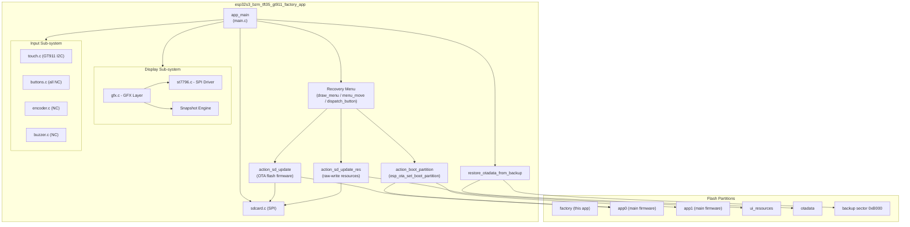
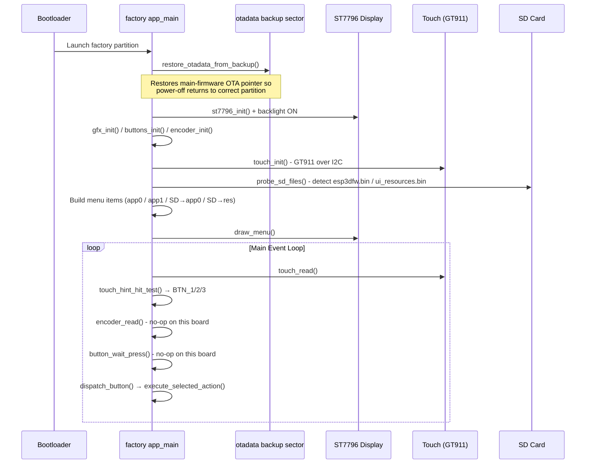
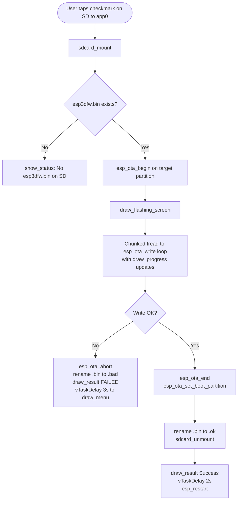
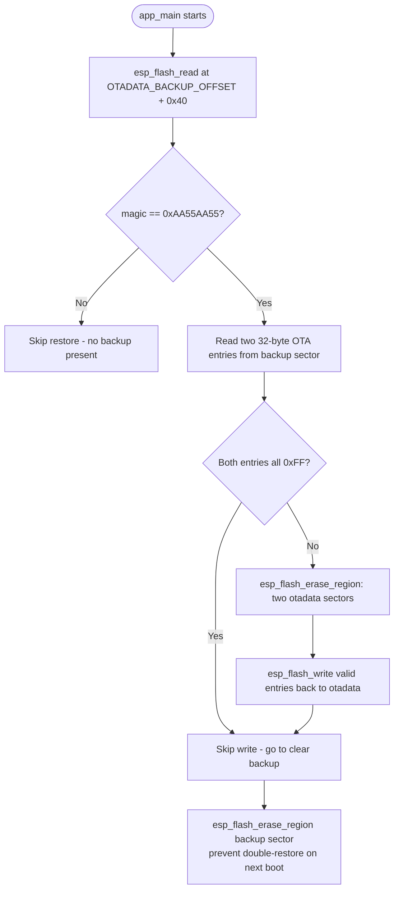

# ESP32S3-BZM-TFT35-GT911 Factory App

## Overview

The `esp32s3_bzm_tft35_gt911_factory_app` is the **recovery (factory) partition application** for the ESP32-S3 BZM TFT35 GT911 board — a 3.5-inch, 320×480 SPI display panel with a GT911 capacitive touch controller.

The factory app occupies a dedicated `factory` flash partition and runs as a **self-contained recovery environment** independent of the main pendant firmware. Its responsibilities are:

- **Firmware recovery**: Flash a new main firmware binary (`esp3dfw.bin`) from SD card onto `app0` or `app1`.
- **Resource recovery**: Flash a new UI resources binary (`ui_resources.bin`) from SD card onto the `ui_resources` partition.
- **Partition boot switching**: Manually redirect boot to `app0` or `app1`.
- **OTA state preservation**: Restore the ESP32's OTA boot pointer (`otadata`) from a backup written by the main firmware before switching to factory, so powering off during recovery returns to the correct partition.

### Board-Specific Characteristics

| Feature | Detail |
|---|---|
| Display | 3.5" 320×480 SPI (ST7796 controller), portrait |
| Touch | GT911 capacitive, I2C — **only input device** |
| Physical buttons | None — all `GPIO_NUM_NC` |
| Rotary encoder | Not populated — `GPIO_NUM_NC` |
| Buzzer | Not populated — `GPIO_NUM_NC` |
| SD card | SPI interface (separate bus from display) |
| Font | 11×21 bitmap (scaled for 320×480) |
| Custom bootloader | **Not used** — recovery is triggered by software (`[ESP444]FACTORY`) |

Because no physical buttons, encoder, or buzzer are populated, user interaction is **touch-only** via three virtual buttons drawn at the bottom of the screen. All hardware-abstraction guards (`GPIO_IS_VALID_GPIO`) ensure the code compiles and runs correctly even when those optional GPIOs are absent.

---

## Architecture Overview



### Startup Sequence



---

## File Structure

```
boards/esp32s3_bzm_tft35_gt911/Factory/
├── main/
│   ├── main.c            ← Recovery menu, OTA flash, boot switching, snapshot
│   ├── factory_log.h     ← Compile-time log gate (FACTORY_LOGD macro)
│   ├── gfx.c / gfx.h     ← Software graphics layer + snapshot capture
│   ├── st7796.c / st7796.h ← Standalone SPI ST7796 display driver
│   ├── buttons.c / .h    ← GPIO button driver (all NC on this board)
│   ├── encoder.c / .h    ← PCNT rotary encoder driver (NC on this board)
│   ├── touch.c / touch.h ← GT911 capacitive touch — primary input
│   ├── buzzer.c / .h     ← Bit-bang buzzer (NC on this board)
│   └── sdcard.c / .h     ← SPI SD card mount / unmount
└── tools/
    ├── flash_all.py           ← Full-board flash helper (esptool wrapper)
    ├── flash_factory.py       ← Factory-partition-only flash helper
    ├── generate_font/
    │   └── generate_font.py   ← Bitmap font C-source generator (Pillow)
    └── raw2png/
        └── snap2png.py        ← Raw RGB565 snapshot → PNG converter
```

---

## Sub-Module Descriptions

### Main Application Logic
*→ [esp32s3_bzm_tft35_gt911_factory_app_main.md](esp32s3_bzm_tft35_gt911_factory_app_main.md)*

The core of the factory app. Contains:

- **`app_main`** — entry point: restores OTA state, initialises all peripherals, builds the menu, and runs the main event loop.
- **OTA state management** — `restore_otadata_from_backup()` reads the otadata backup from a reserved flash sector (written by the main firmware's `esp444.cpp` before switching to factory) and writes it back. This ensures the correct app partition is restored even if the user powers off during recovery.
- **Recovery menu** — `menu_item_t` list with highlight-box selection, `menu_move()`, `menu_select()`, rendered by `draw_menu()` and its family of `draw_*` helpers (header, footer, SD indicators, button hints, progress bar, result).
- **Virtual button bar** — since no physical buttons exist, three touch targets (▲ ▼ ✓) are drawn at the bottom of the screen. `touch_hint_hit_test()` maps a tap coordinate to `BTN_1`/`BTN_2`/`BTN_3`. `dispatch_button()` translates that to menu navigation or action execution.
- **SD firmware flash** (`action_sd_update`) — OTA-API-based chunked write with a progress bar and automatic rename to `.ok` / `.bad` on completion.
- **SD resources flash** (`action_sd_update_res`) — raw `esp_partition_write` into the `ui_resources` partition with progress tracking and build-header variant logging.
- **Snapshot subsystem** (conditional on `ENABLE_SNAPSHOT`) — GPIO0 / BOOT button triggers a full-screen capture to an SD `.raw` file; `snapshot_check()` is called throughout the event loop and during flashing operations.
- **`factory_log.h`** — provides `FACTORY_LOGD` (compile-time silenced when `ENABLE_FACTORY_DEBUG_LOG` is off) and `factory_log_silence_sd_stack()` (mutes SD/FAT driver tags at runtime to prevent log noise in debug builds).

---

### Display Sub-system
*→ [esp32s3_bzm_tft35_gt911_factory_app_display.md](esp32s3_bzm_tft35_gt911_factory_app_display.md)*

Two-layer display stack sitting below the factory app's graphics calls, with no LVGL or BSP dependency:

**`st7796.c`** — standalone SPI display driver for the ST7796 controller, reimplemented directly over ESP-IDF's `spi_master` driver (same approach as `ili9341.c` in `pibot_pendant_v1_0`). Handles hardware reset, init command sequence (sleep-out, MADCTL rotation, pixel format, gamma tables), and chunked pixel transmission.

**`gfx.c`** — lightweight frame-buffer-free 2D graphics library on top of `st7796_flush`:

| Function | Purpose |
|---|---|
| `gfx_init()` | Placeholder initialiser |
| `gfx_clear(color)` | Fill entire screen row by row using a static line buffer |
| `gfx_draw_char(x,y,c,fg,bg)` | Render one character from the embedded `font11x21` bitmap |
| `gfx_draw_string(x,y,str,fg,bg)` | Render a null-terminated string via `gfx_draw_char` |
| `gfx_hline / gfx_vline` | Horizontal / vertical lines |
| `gfx_rect / gfx_fill_rect` | Outline / filled rectangle |
| `gfx_flush(x0,y0,x1,y1,data,n)` | Internal — sends pixels to `st7796_flush` and optionally to the snapshot file |

**Snapshot engine** (conditional on `ENABLE_SNAPSHOT`): When `gfx_snapshot_begin(filepath)` is called, every subsequent `gfx_flush` simultaneously writes its pixels to the open `.raw` file at the correct byte offset. A full-screen redraw populates the file completely; `gfx_snapshot_end()` closes it. Format: 8-byte header (width + height as `uint32_t LE`) followed by raw RGB565 pixels, native endian (byte-swap undone from SPI big-endian).

---

### Input Sub-system
*→ [esp32s3_bzm_tft35_gt911_factory_app_input.md](esp32s3_bzm_tft35_gt911_factory_app_input.md)*

Four hardware input drivers, all with `GPIO_IS_VALID_GPIO` guards so they become no-ops when pins are `GPIO_NUM_NC`:

| Driver | Chip / Method | Status on this Board |
|---|---|---|
| `buttons.c` | GPIO active-LOW, 50 ms debounce | All NC — no-op |
| `encoder.c` | ESP-IDF PCNT, quadrature, 4 pulses/detent | NC — no-op |
| `touch.c` | GT911 I2C via shared `touch_gt911` component | **Active — primary input** |
| `buzzer.c` | Bit-bang square wave at 2700 Hz, 40 ms | NC — no-op |

Unlike the 8048s070c board's touch driver, this board's `touch_read()` does **not** rescale coordinates — the GT911 auto-detects its native panel resolution and reports calibrated pixel coordinates directly (configured via `x_max = 0` / `y_max = 0` in `touch_gt911_config_t`). Orientation transforms (swap_xy, invert_x/y) are configured via `hw_config.h` flags passed into the driver.

---

### Storage Sub-system
*→ [esp32s3_bzm_tft35_gt911_factory_app_storage.md](esp32s3_bzm_tft35_gt911_factory_app_storage.md)*

A minimal SPI SD card driver using `esp_vfs_fat_sdspi_mount` for FAT filesystem access. Exposes `sdcard_mount()` and `sdcard_unmount()`. The SPI bus is initialised once on the first mount and reused across subsequent mount/unmount cycles, avoiding interference with the TFT display (which uses a separate SPI host). Mount point: `/sdcard`.

---

### Developer Tools
*→ [esp32s3_bzm_tft35_gt911_factory_app_tools.md](esp32s3_bzm_tft35_gt911_factory_app_tools.md)*

Four Python utility scripts for deployment and development:

| Script | Purpose |
|---|---|
| `flash_all.py` | `esptool` wrapper — flash bootloader + partitions + factory ± firmware; modes: `--recovery`, `--full`, `--fw` |
| `flash_factory.py` | Flash only the factory partition; auto-detects offset from partition table CSV |
| `generate_font/generate_font.py` | Render a TTF font into a bitmap `font_WxH.c/.h` pair for embedding in the factory app (uses Pillow) |
| `raw2png/snap2png.py` | Convert `.raw` RGB565 snapshot files to PNG images (uses Pillow) |

---

## Key Data Flows

### SD Firmware Flash



### OTA Backup Restore



---

## Key Constants and Addresses

| Constant | Value | Purpose |
|---|---|---|
| `OTADATA_OFFSET` | `0x10000` | ESP32 OTA data partition start |
| `OTADATA_BACKUP_OFFSET` | `0xB000` | Reserved backup sector (below partition table) |
| `BACKUP_MAGIC` | `0xAA55AA55` | Sentinel to detect a valid backup |
| `FW_FILENAME` | `/sdcard/esp3dfw.bin` | Firmware binary source on SD |
| `RES_FILENAME` | `/sdcard/ui_resources.bin` | Resources binary source on SD |
| `MENU_HIGHLIGHT` | `RGB(0, 80, 160)` | Selection box background colour |
| `BTN_HINT_CX1/2/3` | `W/2−100`, `W/2`, `W/2+100` | Virtual button X centres |
| `BTN_CIRCLE_R` | `27` | Virtual button circle radius (px) |
| `FONT_WIDTH / FONT_HEIGHT` | `11 / 21` | Embedded bitmap font cell size |
| `PULSES_PER_DETENT` | `4` | Encoder quadrature edges per detent click |
| `BEEP_FREQ_HZ` | `2700` | Buzzer square-wave frequency |
| `BEEP_DURATION_MS` | `40` | Buzzer beep duration |

> **⚠ Config requirement**: The factory `sdkconfig` must set `CONFIG_SPI_FLASH_DANGEROUS_WRITE_ALLOWED=y` because `esp_flash_erase_region` targets addresses below the first declared partition (the otadata backup sector at `0xB000`). This is intentional — the factory app is a privileged recovery tool.

> **⚠ Porting note**: `OTADATA_BACKUP_OFFSET` (0xB000) and the exact OTA entry offsets must match `esp444.cpp` in the main firmware **exactly**. When porting to a board with a different bootloader size or partition table offset, recalculate and update both files together.

---

## Relationship to Other Modules

- **[esp32s3_bzm_tft35_gt911_bsp](esp32s3_bzm_tft35_gt911_bsp.md)** — The BSP is used by the **main firmware** only. The factory app drives the display directly through its own standalone `st7796.c` driver without LVGL or the BSP abstraction layer, but reuses the shared `touch_gt911` and `bus_i2c` hardware driver components.
- **[Hardware_Peripheral_Drivers / touch_drivers](touch_drivers.md)** — The factory app reuses the shared `touch_gt911` and `bus_i2c` drivers from the hardware driver library, avoiding reimplementation of the GT911 I2C protocol. This is unlike the display, which is reimplemented standalone.
- **[esp32s3_bzm_tft35_gt911_build_scripts](esp32s3_bzm_tft35_gt911_build_scripts.md)** — Board-level `build_scripts/` (`build_one.py`, `common.py`, `variants.py`) orchestrate compilation of the factory binary across firmware variants.
- **Sibling factory apps** — Architecturally identical to [`pibot_pendant_v1_0_factory_app`](pibot_pendant_v1_0_factory_app.md) and [`esp32s3_8048s070c_factory_app`](esp32s3_8048s070c_factory_app.md). Key differences from pibot_pendant_v1_0: ST7796 SPI display (vs ILI9341 SPI), GT911 I2C capacitive touch (vs XPT2046 SPI resistive), no physical buttons, no custom bootloader, larger 320×480 panel with 11×21 font. Key differences from 8048s070c: SPI display (vs RGB parallel EK9716), 320×480 portrait (vs 800×480), no coordinate rescaling needed for GT911.


## Documents lies (deep dive)

- [esp32s3_bzm_tft35_gt911_factory_app_flash_tools](esp32s3_bzm_tft35_gt911_factory_app_flash_tools.md)
- [esp32s3_bzm_tft35_gt911_factory_app_recovery](esp32s3_bzm_tft35_gt911_factory_app_recovery.md)


## Documents de conception (depot)

- [factory_app_technical_doc.md](https://github.com/luc-github/Pibot-cnc-pendant-firmware/blob/main/docs/Factory/factory_app_technical_doc.md)
