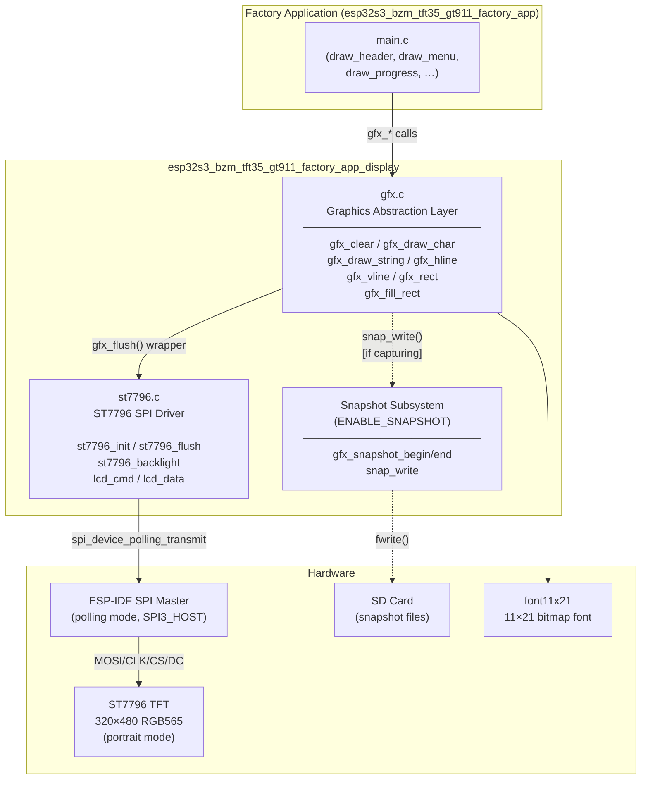
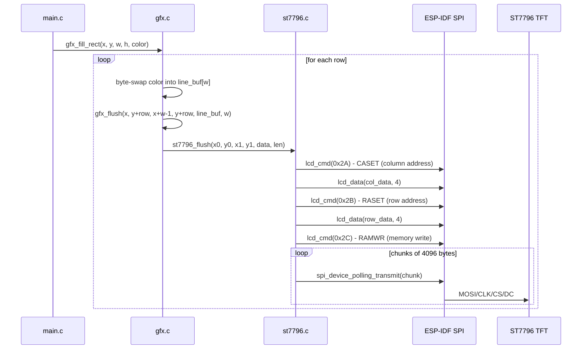
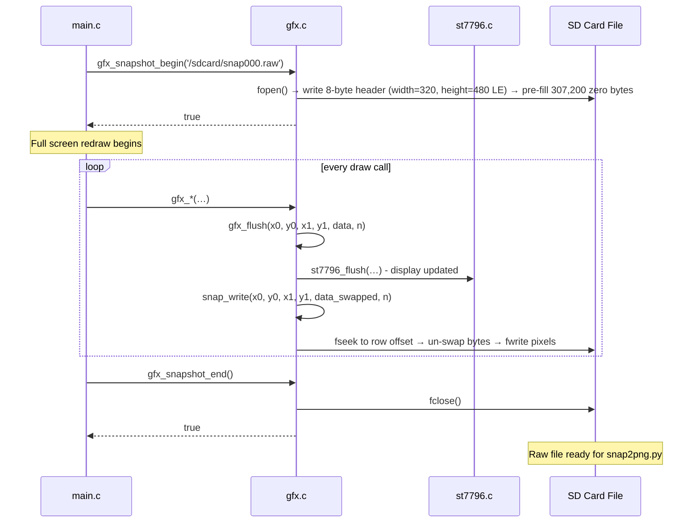
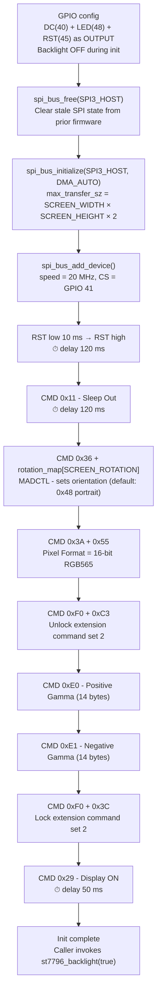
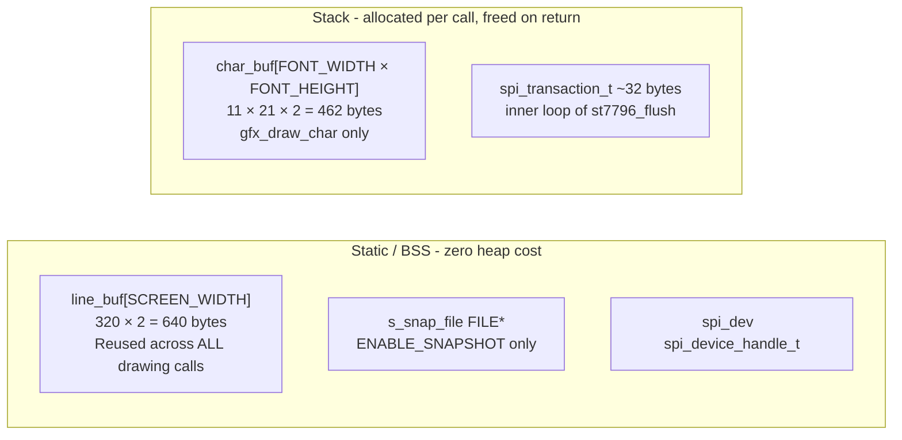
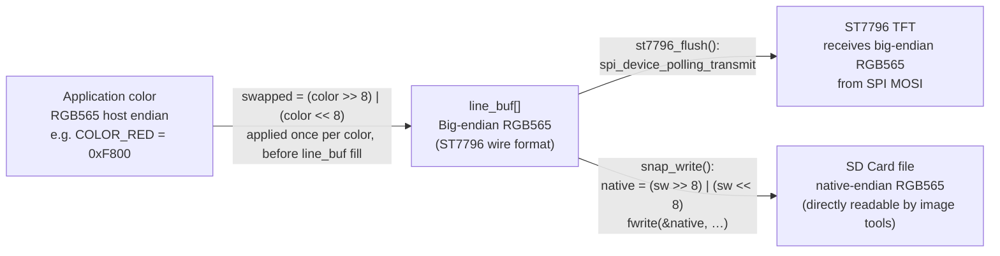
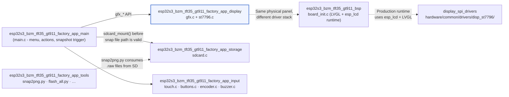

# esp32s3_bzm_tft35_gt911_factory_app_display

Display subsystem for the Factory recovery application on the **ESP32-S3 BZM TFT 3.5"** board (GT911 capacitive touch variant). It provides a two-layer stack — a drawing API (`gfx.c`) sitting on top of a minimal standalone ST7796 SPI driver (`st7796.c`) — that the factory application uses to render its interactive menu UI, progress indicators, and diagnostic screens. An optional snapshot subsystem (compiled in when `ENABLE_SNAPSHOT` is defined) tees every rendered frame to a raw file on the SD card so the `snap2png.py` tool can produce a PNG audit trail.

---

## Table of Contents

1. [Architecture Overview](#architecture-overview)
2. [Component Descriptions](#component-descriptions)
   - [gfx.c — Graphics Abstraction Layer](#gfxc--graphics-abstraction-layer)
   - [st7796.c — ST7796 SPI Display Driver](#st7796c--st7796-spi-display-driver)
3. [API Reference](#api-reference)
   - [Drawing API (gfx.h)](#drawing-api-gfxh)
   - [Driver API (st7796.h)](#driver-api-st7796h)
4. [Data Flow](#data-flow)
   - [Normal Render Path](#normal-render-path)
   - [Snapshot Capture Path](#snapshot-capture-path)
5. [Snapshot File Format](#snapshot-file-format)
6. [ST7796 Initialization Sequence](#st7796-initialization-sequence)
7. [Memory Design](#memory-design)
8. [Hardware Configuration](#hardware-configuration)
9. [Color Encoding and Byte Order](#color-encoding-and-byte-order)
10. [Module Relationships](#module-relationships)

---

## Architecture Overview

The module is a self-contained display stack, isolated from the main firmware's LVGL-based UI system. It operates entirely in the factory application's single task context — no LVGL, no DMA callbacks, no FreeRTOS queues. All SPI transfers use synchronous polling (`spi_device_polling_transmit`).



### Layer Responsibilities

| Layer | File | Role |
|-------|------|------|
| **Drawing API** | `gfx.c` | Pixel-level primitives; byte-swap management; snapshot tee |
| **Hardware Driver** | `st7796.c` | SPI bus setup; ST7796 register sequences; chunked DMA transfer |
| **Font data** | `font11x21.h` | Embedded 11×21 bitmap font accessed via `font11x21_get_glyph()` |
| **Pin configuration** | `hw_config.h` | `TFT_*` GPIO/SPI macros; `SCREEN_WIDTH/HEIGHT/ROTATION` |

---

## Component Descriptions

### gfx.c — Graphics Abstraction Layer

`gfx.c` provides the complete drawing vocabulary used by the factory application's UI renderer. Its design priorities are:

- **Zero dynamic allocation** in the hot drawing path — a `static uint16_t line_buf[SCREEN_WIDTH]` (640 bytes in portrait mode) is reused across all line, fill, and clear operations.
- **Uniform byte-swap** — every color value is byte-swapped from host-endian to SPI big-endian (the ST7796 wire format) exactly once, before being written into `line_buf` or `char_buf`.
- **Transparent snapshot tee** — the single internal `gfx_flush()` wrapper calls both `st7796_flush()` and (when capturing) `snap_write()`, so no drawing call site needs to be aware of snapshotting.

`gfx_init()` is intentionally empty. The ST7796 driver must be initialized separately via `st7796_init()` before any drawing call.

#### Snapshot Subsystem (`ENABLE_SNAPSHOT`)

When `ENABLE_SNAPSHOT` is defined at compile time, `gfx.c` gains a file-backed framebuffer tee:

- `gfx_snapshot_begin(filepath)` opens a file, writes an 8-byte header (width + height as `uint32_t` LE), and pre-fills the pixel region with zeros (black). The caller is then expected to perform a **full screen redraw** to populate the file.
- Every `gfx_flush()` call subsequently writes its pixel data to the open file via `snap_write()`, un-swapping bytes back from SPI big-endian to native RGB565.
- `gfx_snapshot_end()` closes the file.
- `snap_write()` uses `fseek` to position each row at the correct file offset (`SNAP_HEADER_SIZE + (row * SCREEN_WIDTH + x0) * 2`), allowing partial-region updates to land in the correct row without requiring a full scratch buffer.

The raw snapshot file is consumed offline by the [`esp32s3_bzm_tft35_gt911_factory_app_tools`](esp32s3_bzm_tft35_gt911_factory_app_tools.md) `snap2png.py` script, which reads the header dimensions and converts the RGB565 pixel stream to a standard PNG.

---

### st7796.c — ST7796 SPI Display Driver

`st7796.c` is a minimal, factory-only SPI driver for the ST7796 TFT controller. It does **not** use the shared hardware driver from [`display_spi_drivers`](display_spi_drivers.md) (`hardware/common/drivers/disp_st7796/`); instead it provides a lean, self-contained implementation suited to the factory environment (no LVGL, no `esp_lcd` panel API abstraction, no ESP3D-X log dependency).

**Key design choices:**

- Uses `spi_device_polling_transmit` — synchronous, no DMA callback dependencies, predictable latency in a non-RTOS-sensitive single-task context.
- Issues `spi_bus_free()` before `spi_bus_initialize()` to handle the case where the SPI3 peripheral retains state after the main firmware's software reset into the factory partition.
- Pixel data is sent in **4096-byte chunks** to stay within SPI DMA transfer size limits.
- Backlight is kept off (`gpio_set_level(TFT_LED, 0)`) during `st7796_init()` to prevent the user from seeing partial initialization frames; the caller enables it afterwards with `st7796_backlight(true)`.
- The gamma tuning bytes (commands `0xE0`/`0xE1`) mirror the values used by the production ST7796 driver in `hardware/common/drivers/disp_st7796/st7796.c`, ensuring visual consistency between the factory app and the main firmware.
- The DC (Data/Command) GPIO is driven directly by `lcd_cmd()` (DC=0) and `lcd_data()` (DC=1) before each SPI transaction.

---

## API Reference

### Drawing API (gfx.h)

All coordinates are in pixels relative to the top-left corner `(0, 0)`. All functions silently clip to screen bounds — no call results in an out-of-bounds SPI transfer. Colors are expressed in native host-endian RGB565; the internal `gfx_flush()` wrapper handles the SPI byte-swap transparently.

**Color helpers:**

```c
/* Compose an RGB565 value from 8-bit R, G, B components */
#define GFX_RGB565(r, g, b)  ((uint16_t)(((r & 0xF8) << 8) | ((g & 0xFC) << 3) | (b >> 3)))

/* Predefined constants */
#define COLOR_BLACK     0x0000
#define COLOR_WHITE     0xFFFF
#define COLOR_RED       GFX_RGB565(255,   0,   0)
#define COLOR_GREEN     GFX_RGB565(  0, 255,   0)
#define COLOR_BLUE      GFX_RGB565(  0,   0, 255)
#define COLOR_YELLOW    GFX_RGB565(255, 255,   0)
#define COLOR_CYAN      GFX_RGB565(  0, 255, 255)
#define COLOR_GRAY      GFX_RGB565(128, 128, 128)
#define COLOR_DARKGRAY  GFX_RGB565( 64,  64,  64)
```

**Function reference:**

| Function | Signature | Description |
|----------|-----------|-------------|
| `gfx_init` | `void gfx_init(void)` | Placeholder; currently a no-op. Call `st7796_init()` separately before drawing. |
| `gfx_clear` | `void gfx_clear(uint16_t color)` | Fill the entire screen with a solid RGB565 color. Sends one row-wide flush per row (480 calls in portrait mode). |
| `gfx_draw_char` | `void gfx_draw_char(int x, int y, char c, uint16_t fg, uint16_t bg)` | Render a single 11×21 character at `(x, y)` with foreground and background colors. Non-printable characters are substituted with `?`. |
| `gfx_draw_string` | `void gfx_draw_string(int x, int y, const char *str, uint16_t fg, uint16_t bg)` | Render a null-terminated string left-to-right. Stops when the next character would exceed `SCREEN_WIDTH`. |
| `gfx_hline` | `void gfx_hline(int x, int y, int w, uint16_t color)` | Draw a horizontal line of width `w` starting at `(x, y)`. Single `gfx_flush()` call. |
| `gfx_vline` | `void gfx_vline(int x, int y, int h, uint16_t color)` | Draw a vertical line of height `h` starting at `(x, y)`. Sends **one pixel per flush call** — avoid very tall lines in performance-critical paths. |
| `gfx_rect` | `void gfx_rect(int x, int y, int w, int h, uint16_t color)` | Draw a hollow rectangle outline using 2 hlines + 2 vlines. |
| `gfx_fill_rect` | `void gfx_fill_rect(int x, int y, int w, int h, uint16_t color)` | Draw a solid filled rectangle, one row-wide flush per row. |
| `gfx_snapshot_begin` | `bool gfx_snapshot_begin(const char *filepath)` | *(Requires `ENABLE_SNAPSHOT`)* Open a raw capture file. Returns `false` if already capturing or the file cannot be created. |
| `gfx_snapshot_end` | `bool gfx_snapshot_end(void)` | *(Requires `ENABLE_SNAPSHOT`)* Close the capture file. Returns `false` if not currently capturing. |
| `gfx_snapshot_is_capturing` | `bool gfx_snapshot_is_capturing(void)` | *(Requires `ENABLE_SNAPSHOT`)* Returns `true` if a snapshot file is currently open. |

### Driver API (st7796.h)

| Function | Signature | Description |
|----------|-----------|-------------|
| `st7796_init` | `esp_err_t st7796_init(void)` | Configure GPIO pins, initialize SPI bus and device on SPI3_HOST, run ST7796 startup sequence. Returns `ESP_OK` on success. |
| `st7796_backlight` | `void st7796_backlight(bool on)` | Enable (`true`) or disable (`false`) the TFT backlight GPIO (GPIO 48). |
| `st7796_flush` | `void st7796_flush(uint16_t x0, uint16_t y0, uint16_t x1, uint16_t y1, const uint16_t *data, size_t len)` | Set CASET/RASET address window and transmit `len` RGB565 pixels in 4096-byte DMA chunks. Data must already be in SPI big-endian byte order. |

The static functions `lcd_cmd()`, `lcd_data()`, and `lcd_data_byte()` are internal to `st7796.c` and are not part of the public interface.

---

## Data Flow

### Normal Render Path



### Snapshot Capture Path



---

## Snapshot File Format

The raw snapshot file produced by `gfx_snapshot_begin` / `gfx_snapshot_end` has the following binary layout:

```
Offset   Size     Type          Description
──────   ────     ────          ───────────
0        4        uint32 LE     Screen width  (320 in default portrait mode)
4        4        uint32 LE     Screen height (480 in default portrait mode)
8        w×h×2   uint16[]      RGB565 pixels, native endian, row-major
                               Row 0 (top) → Row h-1 (bottom)
                               Each row: pixel[0] (left) → pixel[w-1] (right)
```

**Total file size** (320×480 portrait): `8 + 320 × 480 × 2 = 307,208 bytes`

The `snap_write()` function reverses the SPI big-endian byte swap applied by `gfx.c` drawing functions before writing to the file, so stored values are native-endian RGB565 as consumed by standard image tools:

```c
uint16_t native = (sw >> 8) | (sw << 8);
fwrite(&native, sizeof(uint16_t), 1, s_snap_file);
```

The [`esp32s3_bzm_tft35_gt911_factory_app_tools`](esp32s3_bzm_tft35_gt911_factory_app_tools.md) `snap2png.py` script reads this format and produces a standard PNG file.

---

## ST7796 Initialization Sequence

`st7796_init()` configures GPIO and SPI before running the ST7796 startup register sequence:



**Rotation map (`SCREEN_ROTATION` → MADCTL byte):**

| `SCREEN_ROTATION` | MADCTL | Logical Size | Orientation |
|:-----------------:|--------|:------------:|-------------|
| `0` | `0x28` | 480 × 320 | Landscape |
| `1` (**default**) | `0x48` | **320 × 480** | **Portrait** |
| `2` | `0xE8` | 480 × 320 | Landscape inverted |
| `3` | `0x88` | 320 × 480 | Portrait inverted |

> ⚠️ The portrait default (`SCREEN_ROTATION = 1`) matches the `res_480_320` UI resource set orientation used by the main firmware. It was derived from hardware-confirmed values for the same GT911+ST7796 combination on `esp32_3248s035c` and has **not yet been independently confirmed on this specific board's hardware**.

---

## Memory Design

This module is designed to operate within the constrained DRAM budget of the factory application (no WiFi stack, no Bluetooth).



**Key constraints respected:**

- No `malloc()` / `new` in any drawing path.
- `char_buf` (462 bytes) is the largest per-call stack allocation; it falls within the 512-byte safe limit defined in the project [memory constraints guide](https://github.com/luc-github/Pibot-cnc-pendant-firmware/blob/main/docs/guides/esp32_memory_constraints.md).
- `line_buf` is a module-level static — the same buffer is reused for every row of every fill or clear operation, eliminating both allocation overhead and fragmentation risk.
- `snap_write()` uses `fseek`/`fwrite` in a tight per-pixel loop with no intermediate heap buffer; the SD card's internal buffering handles I/O efficiency.

---

## Hardware Configuration

All pin assignments and display geometry are resolved at compile time from `hw_config.h`. The factory application does not support runtime reconfiguration.

### ST7796 SPI Display (SPI3_HOST)

| Macro | GPIO | Purpose |
|-------|------|---------|
| `TFT_HOST` | `SPI3_HOST` | SPI peripheral |
| `TFT_CS` | 41 | Chip select (active low) |
| `TFT_DC` | 40 | Data/Command select (low = command, high = data) |
| `TFT_MOSI` | 38 | SPI data out to display |
| `TFT_CLK` | 39 | SPI clock |
| `TFT_MISO` | NC | Not connected — panel is write-only |
| `TFT_RST` | 45 | Hardware reset (also shared with GT911 touch RST) |
| `TFT_LED` | 48 | Backlight enable (active high) |
| `TFT_SPI_FREQ_HZ` | — | 20 MHz (conservative; 40 MHz is the main firmware target) |

### Screen Dimensions

| Macro | Portrait (default) | Landscape |
|-------|--------------------|-----------|
| `SCREEN_WIDTH` | 320 | 480 |
| `SCREEN_HEIGHT` | 480 | 320 |
| `SCREEN_ROTATION` | 1 | 0 or 2 |

### Touch Controller (GT911, I2C) — for context

The GT911 touch controller shares the `TFT_RST` line (GPIO 45). Since `st7796_init()` already toggles RST low→high to reset the ST7796 panel, no separate GT911 hardware reset is required. Touch is handled by [`esp32s3_bzm_tft35_gt911_factory_app_input`](esp32s3_bzm_tft35_gt911_factory_app_input.md) and is not part of this display module.

### Unpopulated Peripherals

Buttons (`BUTTON_1/2/3_PIN`), buzzer (`BUZZER_PIN`), and encoder (`ENCODER_A/B_PIN`) are all `GPIO_NUM_NC` — this board is touch-only.

---

## Color Encoding and Byte Order

Understanding the byte-swap pipeline is important when reading or modifying rendering code:



The byte-swap in `gfx.c` is applied once before filling `line_buf` or `char_buf`. Since `line_buf` is reused across multiple row calls (e.g. `gfx_fill_rect` calls `gfx_flush` H times with the same buffer), the swap happens only during buffer initialization, not per-flush — this avoids the double-swap bug that would arise if the driver re-swapped in place. Unlike some RGB-parallel board drivers (e.g. `esp32s3_8048s043c`), `st7796_flush()` transmits the pixel data directly to SPI without any additional byte manipulation.

---

## Module Relationships



| Module | Relationship |
|---|---|
| [`esp32s3_bzm_tft35_gt911_factory_app_main`](esp32s3_bzm_tft35_gt911_factory_app_main.md) | **Consumer** — calls all `gfx_*` functions to render the factory UI; orchestrates the snapshot lifecycle (`gfx_snapshot_begin` → full redraw → `gfx_snapshot_end`) |
| [`esp32s3_bzm_tft35_gt911_factory_app_storage`](esp32s3_bzm_tft35_gt911_factory_app_storage.md) | **Peer** — mounts the SD card (`/sdcard`) so that snapshot file paths (e.g. `/sdcard/snap000.raw`) are valid before `gfx_snapshot_begin()` is called |
| [`esp32s3_bzm_tft35_gt911_factory_app_input`](esp32s3_bzm_tft35_gt911_factory_app_input.md) | **Peer** — handles GT911 capacitive touch, buttons, encoder, and buzzer; shares the `TFT_RST` GPIO (GPIO 45) with the ST7796 display reset |
| [`esp32s3_bzm_tft35_gt911_factory_app_tools`](esp32s3_bzm_tft35_gt911_factory_app_tools.md) | **Tooling** — `snap2png.py` converts the `.raw` snapshots written by this module to PNG files |
| [`esp32s3_bzm_tft35_gt911_bsp`](esp32s3_bzm_tft35_gt911_bsp.md) | **Parallel** — the BSP drives the same physical ST7796 panel in the main pendant firmware using the `esp_lcd` framework + LVGL; this factory module provides an entirely independent, simpler driver |
| [`display_spi_drivers`](display_spi_drivers.md) | **Production counterpart** — `hardware/common/drivers/disp_st7796/st7796.c` is the production ST7796 driver used by the BSP; `st7796.c` in this module reimplements the same init sequence without the `esp_lcd`/ESP3D-X dependency chain |

### Comparison with Other Factory Display Modules

The `gfx.c` API is identical (same function names, same `GFX_RGB565` macro, same `COLOR_*` constants, same snapshot protocol) across all SPI-based factory display modules in this repository. Only the underlying hardware driver file differs:

| Board module | Display IC | Interface | Driver file |
|---|---|---|---|
| **esp32s3_bzm_tft35_gt911** *(this)* | ST7796 | SPI3, 20 MHz | `st7796.c` |
| [`pibot_pendant_v1_0`](pibot_pendant_v1_0_factory_app_display.md) | ILI9341 | SPI | `ili9341.c` |
| [`esp32_3248s035r`](esp32_3248s035r_factory.md) | ST7796 | SPI | `st7796.c` |
| [`esp32_3248s035c`](esp32_3248s035c_factory.md) | ST7796 | SPI | `st7796.c` (write-only) |
| [`esp32s3_8048s043c`](esp32s3_8048s043c_factory.md) | ST7262 | RGB parallel | `st7262.c` |
| [`esp32s3_8048s050c`](esp32s3_8048s050c_factory.md) | ST7262 | RGB parallel | `st7262.c` |
| [`esp32s3_8048s070c`](esp32s3_8048s070c_factory_app_display.md) | EK9716 | RGB parallel | `ek9716.c` |

The font glyph size does vary by board: this board uses an **11×21** font (wider than the 8×16 used by `pibot_pendant_v1_0` and the 12×24 used by `esp32s3_8048s070c`), tuned to the 320-pixel portrait width.

---

## Key Design Decisions

### No `esp_lcd` dependency

The factory app must stay minimal and free of the main firmware's component tree. `st7796.c` uses only the plain ESP-IDF SPI master driver (`driver/spi_master.h`) and standard GPIO API — no `esp_lcd`, no `esp3d_log`, no LVGL.

### Static line buffer avoids heap fragmentation

`line_buf[SCREEN_WIDTH]` is allocated statically at module scope. All fill operations (`gfx_clear`, `gfx_fill_rect`, `gfx_hline`) pre-fill the buffer once and reuse it across multiple row-flush calls. This prevents heap fragmentation in a constrained environment and avoids repeated color/swap computation.

### Polling transmit over interrupt-driven SPI

`spi_device_polling_transmit()` is used throughout. The factory app is single-threaded and does not benefit from queued/async SPI — polling avoids FreeRTOS task overhead for short transfers and makes the transfer sequence fully predictable.

### SPI bus re-init guard

`spi_bus_free(SPI3_HOST)` is called unconditionally before `spi_bus_initialize()`. This handles the common case where SPI3 retains state from the main firmware's `disp_st7796` driver after a software reset into the factory partition.

### 4096-byte DMA chunks

`st7796_flush()` breaks large pixel payloads into 4096-byte chunks. This stays within the SPI DMA hardware transfer size limits regardless of the pixel area being written.

### Snapshot pre-fill strategy

The snapshot file is pre-filled with 307,200 zero bytes (black) at `gfx_snapshot_begin()` time. This ensures that any screen region not explicitly redrawn during the capture window appears as black rather than containing stale or uninitialized data — critical because there is no RAM framebuffer to copy from.

### Shared RST pin with touch controller

GPIO 45 is the hardware reset line for both the ST7796 panel and the GT911 touch controller. The `st7796_init()` toggle (RST low → high) resets both ICs simultaneously. No separate touch reset is issued, which simplifies initialization and matches the pattern used in the `esp32_3248s035c`/`esp32_3248s035r` boards.
