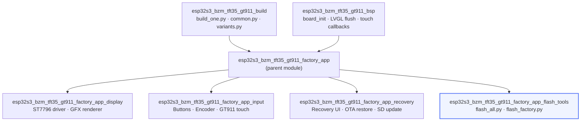
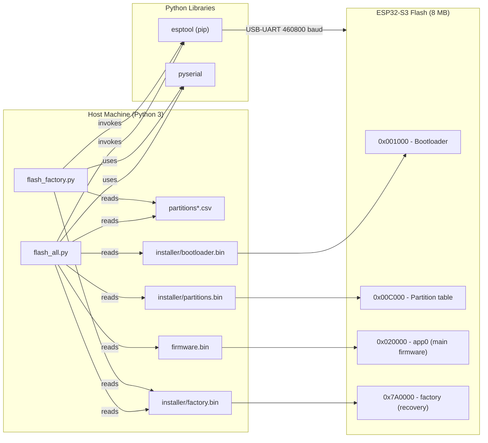
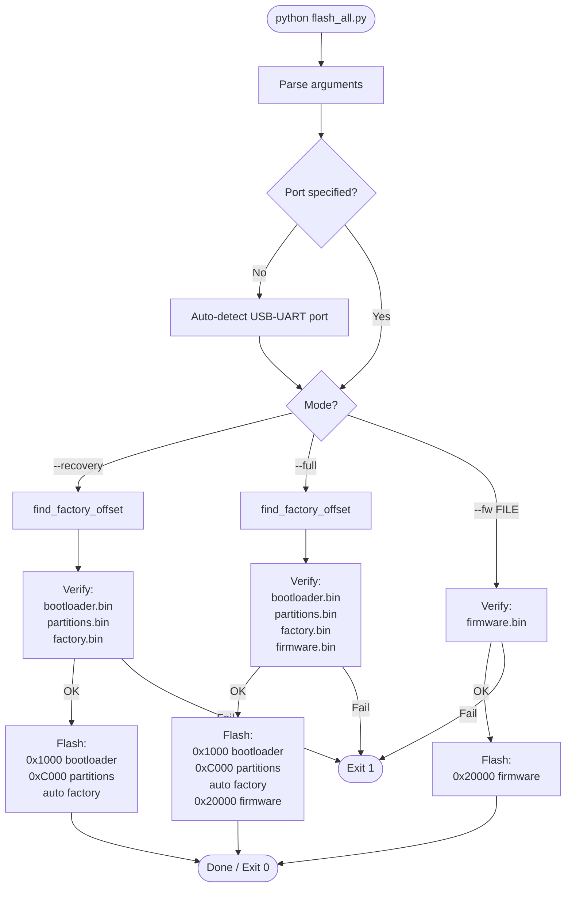
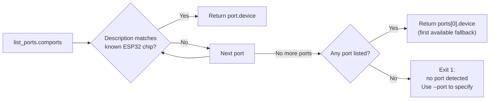
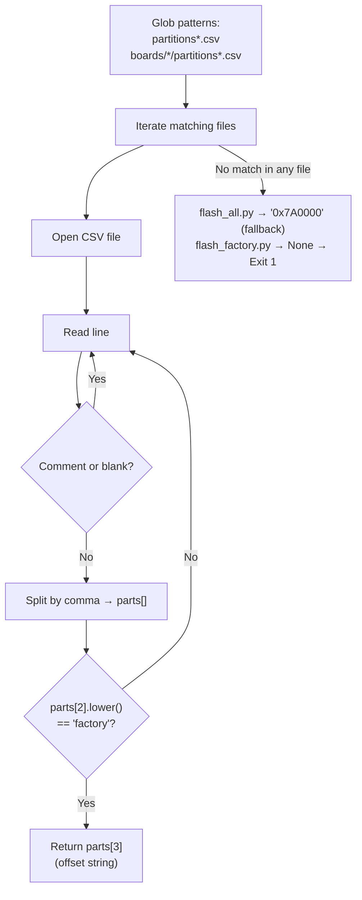
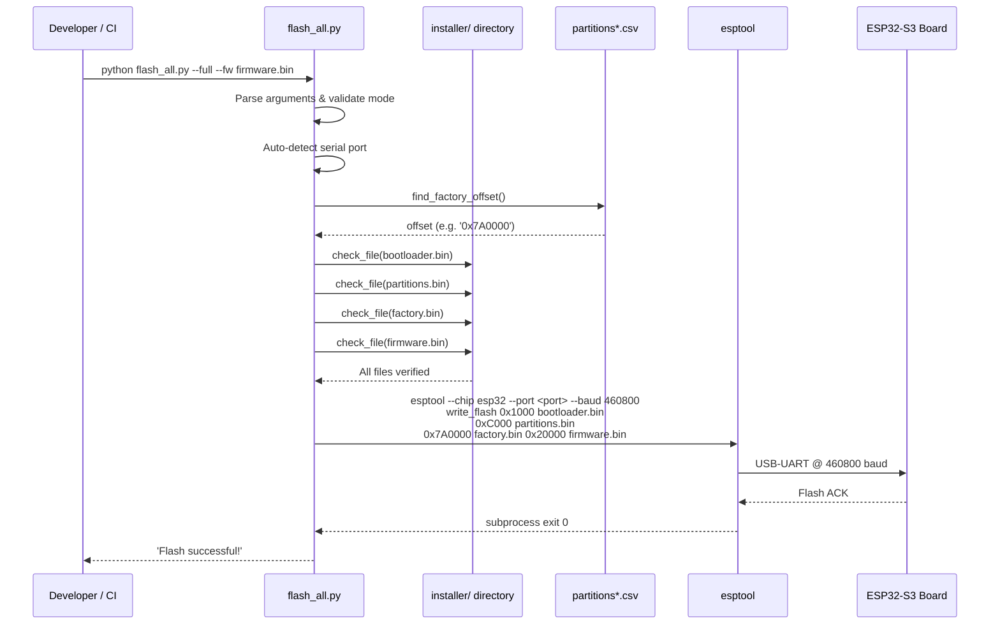
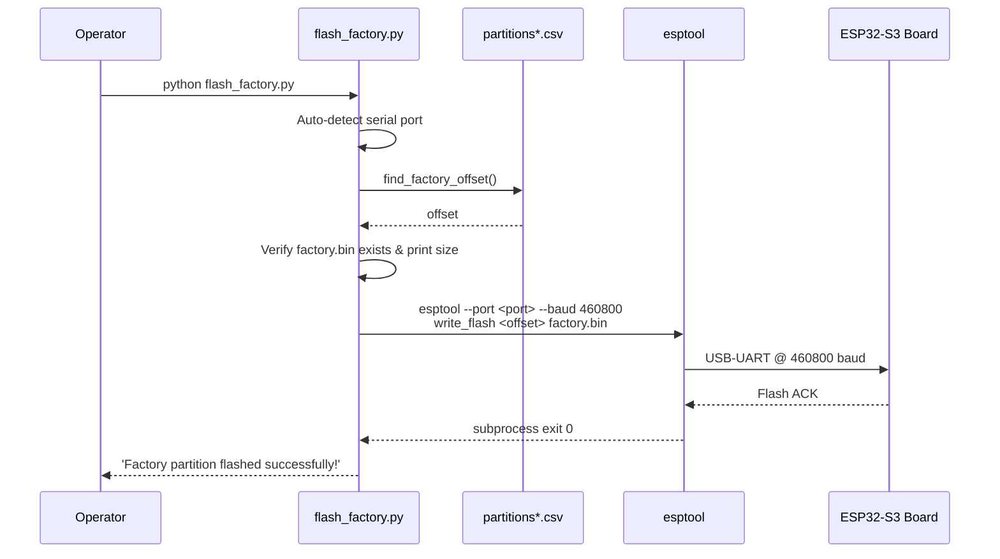

# ESP32-S3 BZM TFT35 GT911 — Factory App Flash Tools

Flash-tools sub-module of the **esp32s3_bzm_tft35_gt911** factory application.  
Two Python scripts handle every production and development flashing workflow for this board: a full-featured multi-mode orchestrator (`flash_all.py`) and a focused single-partition utility (`flash_factory.py`).

---

## Table of Contents

1. [Purpose and Scope](#1-purpose-and-scope)
2. [Module Architecture](#2-module-architecture)
3. [Script Reference](#3-script-reference)
   - 3.1 [`flash_all.py` — Multi-Mode Orchestrator](#31-flash_allpy--multi-mode-orchestrator)
   - 3.2 [`flash_factory.py` — Factory-Partition Utility](#32-flash_factorypy--factory-partition-utility)
4. [Flash Mode Reference](#4-flash-mode-reference)
5. [ESP32-S3 Flash Memory Layout](#5-esp32-s3-flash-memory-layout)
6. [Port and Offset Auto-Detection](#6-port-and-offset-auto-detection)
7. [Data Flow](#7-data-flow)
8. [Dependencies](#8-dependencies)
9. [Usage Examples](#9-usage-examples)
10. [Cross-Board Consistency](#10-cross-board-consistency)
11. [Related Modules](#11-related-modules)

---

## 1. Purpose and Scope

The flash-tools sub-module provides host-side Python scripts used at production time and during firmware development to program the **ESP32-S3 BZM TFT35 GT911** board over USB-UART.

The two scripts cover three distinct lifecycle phases:

| Phase | Script | What is written to flash |
|---|---|---|
| **Initial provisioning** | `flash_all.py --recovery` | Custom bootloader + partition table + factory recovery app |
| **Complete re-flash** | `flash_all.py --full --fw <bin>` | Bootloader + partition table + factory recovery app + main firmware |
| **Firmware update (dev)** | `flash_all.py --fw <bin>` | Main firmware binary only (app0 slot) |
| **Factory-only re-flash** | `flash_factory.py` | Factory recovery partition only |

Both scripts rely on **esptool** (invoked as `python -m esptool`) and auto-detect the serial port and factory-partition offset where possible, requiring no hand-crafted commands in the common case.

---

## 2. Module Architecture

### 2.1 Position in the Factory App Module Tree



### 2.2 Component Relationships



---

## 3. Script Reference

### 3.1 `flash_all.py` — Multi-Mode Orchestrator

**Location:** `boards/esp32s3_bzm_tft35_gt911/Factory/tools/flash_all.py`

The primary flashing tool, covering all deployment scenarios through mutually exclusive modes.

#### CLI Interface

```
flash_all.py [--port PORT] [--baud BAUD] <MODE> [--fw-file FILE]

Modes (mutually exclusive, one required):
  --recovery                           Bootloader + partitions + factory
  --full                               Bootloader + partitions + factory + firmware
  --fw FILE / --firmware FILE          Firmware only (app0)
```

| Argument | Default | Description |
|---|---|---|
| `--port` / `-p` | auto-detect | Serial port (e.g., `/dev/ttyUSB0`, `COM3`) |
| `--baud` | `460800` | UART baud rate passed to esptool |
| `--recovery` | — | Production initial-setup mode |
| `--full` | — | Full re-flash mode; requires `--fw-file` or `--fw` |
| `--fw FILE` / `--firmware FILE` | — | Dev firmware-only mode |
| `--fw-file FILE` | — | Firmware binary path (alternative form for `--full`) |

#### Key Internal Functions

| Function | Purpose |
|---|---|
| `main()` | Argument parsing, mode dispatch, orchestration |
| `find_factory_offset()` | Parses `partitions*.csv` for the `factory` entry offset |
| `find_esp32_port()` | Scans serial ports; matches CP210x, CH340, CH910, FTDI descriptors |
| `check_file(path, name)` | Validates existence of a required binary and prints its size |
| `flash(port, baud, files)` | Builds and runs the `esptool write_flash` command |

#### Hardcoded Flash Constants

```python
BAUD_RATE         = "460800"
BOOTLOADER_BIN    = "installer/bootloader.bin"
PARTITIONS_BIN    = "installer/partitions.bin"
FACTORY_BIN       = "installer/factory.bin"
BOOTLOADER_OFFSET = "0x1000"
PARTITIONS_OFFSET = "0xC000"
APP0_OFFSET       = "0x20000"
```

The factory partition offset is **not** hardcoded for the flash command; it is always resolved by `find_factory_offset()` at runtime, with a fallback of `0x7A0000` for 8 MB flash layouts.

---

### 3.2 `flash_factory.py` — Factory-Partition Utility

**Location:** `boards/esp32s3_bzm_tft35_gt911/Factory/tools/flash_factory.py`

A focused single-purpose script that flashes only the factory (recovery) partition. Intended for:
- Re-programming the recovery partition without disturbing the main firmware.
- Production-line workflows where only the recovery image has been updated.

#### CLI Interface

```
flash_factory.py [--port PORT] [--bin FILE] [--baud BAUD] [--offset OFFSET]
```

| Argument | Default | Description |
|---|---|---|
| `--port` / `-p` | auto-detect | Serial port |
| `--bin` / `-b` | `installer/factory.bin` | Binary to flash |
| `--baud` | `460800` | UART baud rate |
| `--offset` / `-o` | auto-detect from CSV | Factory partition offset |

#### Key Internal Functions

| Function | Purpose |
|---|---|
| `main()` | Argument parsing, file validation, esptool invocation |
| `find_factory_offset()` | Searches `partitions*.csv` and `boards/*/partitions*.csv` for the `factory` sub-type |
| `find_esp32_port()` | Same port-detection heuristic as `flash_all.py` |

> **Difference from `flash_all.py`:** When `find_factory_offset()` finds no CSV match, `flash_factory.py` returns `None` and exits with an actionable error, requiring the user to pass `--offset` manually. `flash_all.py` silently falls back to `0x7A0000`.

---

## 4. Flash Mode Reference



---

## 5. ESP32-S3 Flash Memory Layout

The address constants used by these scripts correspond to the fixed partition layout agreed between the bootloader and the partition CSV.

```
┌──────────────────────────────────────────────────────────────┐
│  Address     Region                       Script constant     │
├──────────────────────────────────────────────────────────────┤
│  0x000000    (unused by these scripts)                        │
│  0x001000    Bootloader               ← BOOTLOADER_OFFSET     │
│  0x00C000    Partition table          ← PARTITIONS_OFFSET     │
│  0x010000    OTA data (otadata)                               │
│  0x020000    app0 / main firmware     ← APP0_OFFSET           │
│  ...         Filesystem partitions                            │
│  0x7A0000    factory / recovery       ← find_factory_offset() │
│              (8 MB layout default)                            │
└──────────────────────────────────────────────────────────────┘
```

> **Note:** The factory partition offset is read dynamically from `partitions*.csv` at runtime. The value `0x7A0000` is the fallback for an 8 MB flash layout. Always verify the correct offset against the CSV shipped with the build before using `--offset` overrides, especially if the board uses a 4 MB flash (typical fallback: `0x320000`).

---

## 6. Port and Offset Auto-Detection

### 6.1 Serial Port Detection

Both scripts share the same heuristic: iterate `serial.tools.list_ports.comports()` and match against known ESP32 USB-UART chip descriptors.

**Matched keywords:** `CP210`, `CH340`, `CH910`, `FTDI`, `USB Serial`, `USB-SERIAL`



### 6.2 Factory Partition Offset Detection

`find_factory_offset()` walks CSV files matched by glob patterns, parses each non-comment line as a comma-separated partition descriptor, and returns the offset field of the first entry whose **sub-type** column equals `factory` (case-insensitive).

**Search patterns (in order):**
1. `partitions*.csv`
2. `boards/*/partitions*.csv`
3. `boards/*/*/partitions*.csv` *(flash_factory.py only)*



---

## 7. Data Flow

### 7.1 End-to-End Flash Sequence (`--full` mode)



### 7.2 Factory-Only Sequence (`flash_factory.py`)



---

## 8. Dependencies

### 8.1 Runtime (Host)

| Dependency | Version | Purpose |
|---|---|---|
| Python 3 | ≥ 3.7 | Script interpreter |
| `esptool` | ≥ 4.x | Flash write via `python -m esptool` |
| `pyserial` | ≥ 3.x | Serial port enumeration (`serial.tools.list_ports`) |

Install with:

```bash
pip install esptool pyserial
```

### 8.2 Input Files

All binary inputs are expected in the `installer/` directory relative to the script location unless overridden via CLI.

| File | Produced by | Description |
|---|---|---|
| `installer/bootloader.bin` | ESP-IDF factory app build | Custom bootloader with OTA-data backup hooks |
| `installer/partitions.bin` | ESP-IDF factory app build | Compiled binary partition table |
| `installer/factory.bin` | ESP-IDF factory app build | Recovery / factory application binary |
| `<firmware>.bin` | Main pendant firmware build | Main pendant application; path supplied by caller |

> The `installer/` directory and its binaries are generated by the build pipeline described in [esp32s3_bzm_tft35_gt911_build.md](esp32s3_bzm_tft35_gt911_build_scripts.md).

### 8.3 Partition Table CSV

Both scripts search for `partitions*.csv` to resolve the factory partition offset dynamically. This CSV is part of the board's ESP-IDF project and is also consumed by the build system. No CSV is required at flash time if `--offset` is supplied manually.

---

## 9. Usage Examples

### 9.1 First-Time Board Provisioning (Recovery Mode)

Programs the bootloader, partition table, and factory recovery app. The main firmware slot is left unprogrammed; the board will boot into the recovery UI on first power-up.

```bash
cd boards/esp32s3_bzm_tft35_gt911/Factory/tools

# Auto-detect port
python flash_all.py --recovery

# Specify port explicitly (Linux / macOS)
python flash_all.py --recovery --port /dev/ttyUSB0

# Specify port explicitly (Windows)
python flash_all.py --recovery --port COM3
```

### 9.2 Complete Factory Flash (Full Mode)

Programs all partitions including the main firmware. Used for production final programming or complete board restore.

```bash
# Using --fw-file
python flash_all.py --full --fw-file ../../build/esp32s3_bzm_tft35_gt911.bin

# Using short alias --fw with explicit port
python flash_all.py --full --fw ../../build/esp32s3_bzm_tft35_gt911.bin --port COM4
```

### 9.3 Development Firmware Update

Flashes only the main firmware binary to the `app0` slot at `0x20000`. Fastest iteration path during development; leaves the factory partition, partition table, and bootloader intact.

```bash
python flash_all.py --fw build/output/firmware.bin
```

### 9.4 Refresh Factory Partition Only

Re-programs just the recovery/factory partition — for example after an update to the recovery UI or factory app behavior.

```bash
cd boards/esp32s3_bzm_tft35_gt911/Factory/tools

# Auto-detect everything
python flash_factory.py

# Override offset for a non-standard layout
python flash_factory.py --offset 0x320000

# Specify a custom binary and port
python flash_factory.py --bin /path/to/new_factory.bin --port COM5
```

### 9.5 Baud Rate Override

When USB adapters or cables are unreliable at 460800 baud:

```bash
python flash_all.py --recovery --baud 115200
python flash_factory.py --baud 230400
```

---

## 10. Cross-Board Consistency

The flash-tool pattern (`flash_all.py` + `flash_factory.py`) is replicated identically across every board variant in this repository. All variants share the same function signatures, chip-detection heuristics, and `installer/` directory conventions.

```mermaid
graph TD
    TMPL["Shared Flash Tool Pattern\nflash_all.py + flash_factory.py"]

    TMPL --> B1["esp32_2432s028r/Factory/tools/"]
    TMPL --> B2["esp32_3248s035c/Factory/tools/"]
    TMPL --> B3["esp32_3248s035r/Factory/tools/"]
    TMPL --> B4["esp32s3_4827s043c/Factory/tools/"]
    TMPL --> B5["esp32s3_8048s043c/Factory/tools/"]
    TMPL --> B6["esp32s3_8048s050c/Factory/tools/"]
    TMPL --> B7["esp32s3_8048s070c/Factory/tools/"]
    TMPL --> B8["esp32s3_8048_touch_lcd_7/Factory/tools/"]
    TMPL --> B9["esp32s3_hmi43v3/Factory/tools/"]
    TMPL --> B10["esp32s3_zx3d50ce02s_usrc_4832/Factory/tools/"]
    TMPL --> B11["pibot_pendant_v1_0/Factory/tools/"]
    TMPL --> CURRENT["esp32s3_bzm_tft35_gt911/Factory/tools/\n← this module"]

    style CURRENT fill:#f0f4ff,stroke:#4a6cf7,stroke-width:2px
```



Board-specific differences are limited to:
- **Factory partition offset** — resolved from each board's own `partitions*.csv`.
- **Chip target string** — `flash_all.py` passes `--chip esp32`; esptool's auto-detect handles ESP32-S3 transparently without a board-specific override.

---

## 11. Related Modules

| Module | Documentation | Relationship |
|---|---|---|
| Factory recovery application | [esp32s3_bzm_tft35_gt911_factory_app_recovery.md](esp32s3_bzm_tft35_gt911_factory_app_recovery.md) | Produces `installer/factory.bin` that these scripts flash; implements the OTA restore and SD-update UI |
| Factory display subsystem | [esp32s3_bzm_tft35_gt911_factory_app_display.md](esp32s3_bzm_tft35_gt911_factory_app_display.md) | ST7796 SPI display driver and GFX renderer linked into `factory.bin` |
| Factory input subsystem | [esp32s3_bzm_tft35_gt911_factory_app_input.md](esp32s3_bzm_tft35_gt911_factory_app_input.md) | Buttons, rotary encoder, and GT911 touch linked into `factory.bin` |
| Board build system | [esp32s3_bzm_tft35_gt911_build.md](esp32s3_bzm_tft35_gt911_build_scripts.md) | Generates all `installer/` binaries consumed by these scripts |
| Board support package | [esp32s3_bzm_tft35_gt911_bsp.md](esp32s3_bzm_tft35_gt911_bsp.md) | BSP used by the main firmware binary that `--fw` / `--full` modes write to `app0` |
| Factory bootloader | [factory_bootloader.md](factory_bootloader.md) | Custom bootloader written at `0x1000`; implements OTA-data backup triggered by button press at boot |
| General tools guide | [tools.md](https://github.com/luc-github/Pibot-cnc-pendant-firmware/blob/main/docs/guides/tools.md) | Project-wide tools reference including flash helpers, WebSocket test, and bridge scripts |
| Factory documentation | [docs/Factory/](docs/Factory/) | High-level factory process and provisioning workflow documentation |
