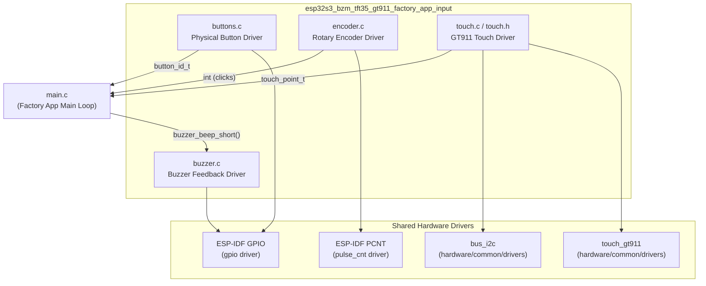
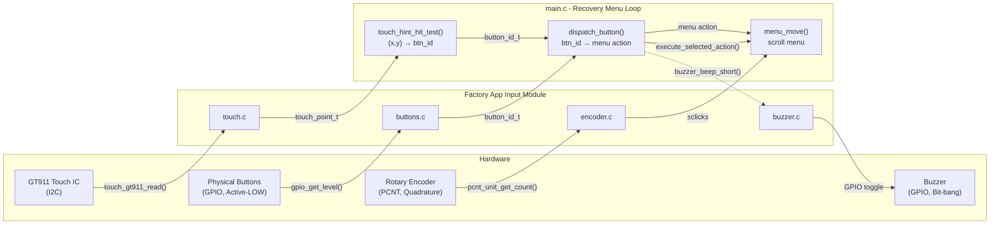
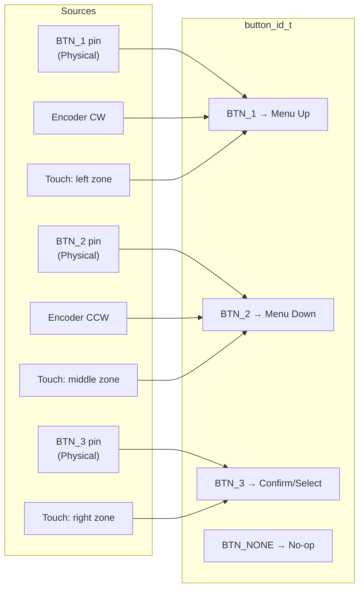
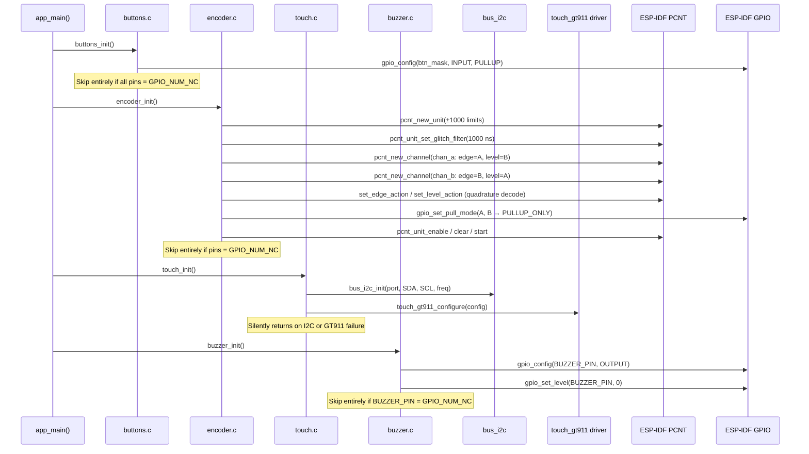
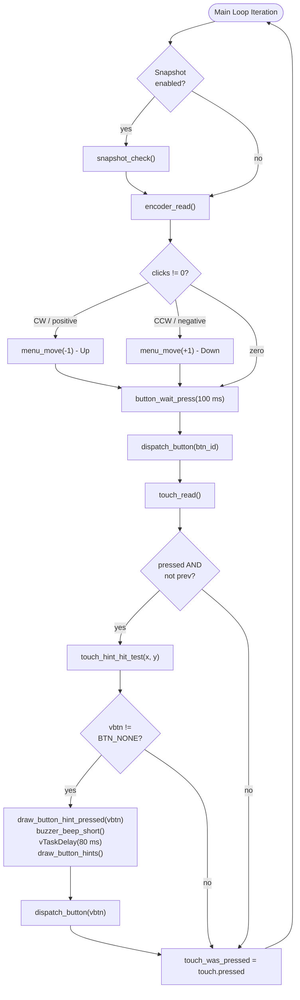
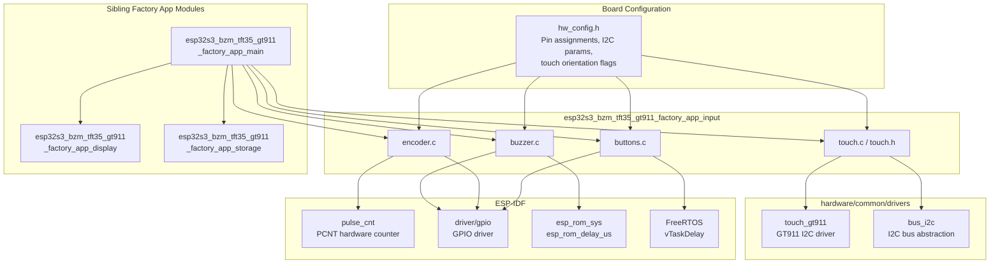

# esp32s3_bzm_tft35_gt911_factory_app_input

## Introduction

The `esp32s3_bzm_tft35_gt911_factory_app_input` module is the **input subsystem** of the ESP32-S3 BZM TFT3.5 GT911 factory/recovery application. It provides all user interaction mechanisms used by the factory app's recovery menu, which runs without LVGL or any GUI framework.

The module aggregates four distinct input sources — physical push-buttons, a rotary encoder, a capacitive touchscreen (GT911, I2C), and a buzzer for audible feedback — behind a unified `button_id_t` abstraction. All drivers share a **GPIO_NUM_NC guard pattern**: when a board variant omits a peripheral (pin defined as `GPIO_NUM_NC`), the corresponding driver silently becomes a no-op, allowing the same source tree to target boards with or without physical controls.

This module is a sibling of the display and storage sub-modules within the factory application. For the overall factory app and its bootloader context, see [esp32s3_bzm_tft35_gt911_factory_app.md](esp32s3_bzm_tft35_gt911_factory_app.md). For the BSP and LVGL input layer used by the main firmware (not the factory app), see [esp32s3_bzm_tft35_gt911_bsp.md](esp32s3_bzm_tft35_gt911_bsp.md). For the shared hardware peripheral drivers this module wraps, see [Hardware_Peripheral_Drivers.md](Hardware_Peripheral_Drivers.md).

---

## Module Architecture



---

## Component Breakdown

### 1. Button Driver (`buttons.c`)

Manages three physical push-buttons (BTN_1, BTN_2, BTN_3) configured as active-LOW GPIO inputs with internal pull-up resistors. Provides both a non-blocking poll and a blocking wait-for-press with a configurable timeout.

**Key design choices:**
- Debounce is 50 ms, applied via `vTaskDelay` after initial edge detection.
- `button_wait_press()` polls in 20 ms intervals and waits for release before returning, preventing spurious repeat events.
- `pin_bit()` is a helper that calls `GPIO_IS_VALID_GPIO()` at runtime to safely build the pin bitmask — needed because `GPIO_NUM_NC` is negative and would cause a compile-time shift error if used as a literal.

| Symbol | Purpose |
|---|---|
| `buttons_init()` | Configures GPIO pins as INPUT with pull-up; no-op if all pins are `GPIO_NUM_NC` |
| `button_is_pressed(btn)` | Returns `true` if the specified button's GPIO reads LOW (active-LOW) |
| `button_wait_press(timeout_ms)` | Blocking poll; returns `button_id_t` or `BTN_NONE` on timeout |
| `pin_bit(pin)` | Internal helper; returns `1ULL << pin` or `0` for invalid pins |

```c
// Active-LOW detection: pressed = level 0
return gpio_get_level(btn_pins[btn]) == 0;
```

---

### 2. Rotary Encoder Driver (`encoder.c`)

Implements quadrature decoding using the ESP32-S3's hardware **PCNT (Pulse Counter)** peripheral. Two channels (A and B) are configured to count rising and falling edges on both phases, allowing accurate direction detection without software interrupts.

**Key design choices:**
- PCNT counter limits are set to ±1000 to avoid wrap-around during a single polling interval.
- A 1000 ns glitch filter is applied (same as the main firmware's BSP setting).
- `encoder_read()` converts raw PCNT counts to "detent clicks" using `PULSES_PER_DETENT = 4`, clears the counter after reading, and returns a signed integer (positive = CW, negative = CCW).
- The driver is entirely polled — no FreeRTOS queues or ISR callbacks.

| Symbol | Purpose |
|---|---|
| `encoder_init()` | Creates PCNT unit and two channels; no-op if encoder pins are `GPIO_NUM_NC` |
| `encoder_read()` | Returns accumulated signed click count since last call; always `0` if not initialized |

```c
// Quadrature: edge on A, level on B (and vice versa for channel B)
pcnt_channel_set_edge_action(chan_a,
    PCNT_CHANNEL_EDGE_ACTION_DECREASE, PCNT_CHANNEL_EDGE_ACTION_INCREASE);
pcnt_channel_set_level_action(chan_a,
    PCNT_CHANNEL_LEVEL_ACTION_KEEP, PCNT_CHANNEL_LEVEL_ACTION_INVERSE);
```

---

### 3. Touch Driver (`touch.c` / `touch.h`)

A thin polling wrapper over the shared `touch_gt911` hardware driver (from `hardware/common/drivers/touch_gt911`). The GT911 is a capacitive touch controller connected over I2C; it internally calibrates coordinates to the panel's native resolution using swap/invert flags stored in its own configuration, so no additional rescaling is required in this factory-app wrapper.

**Key design choices:**
- Reuses exactly the same `touch_gt911` component as the main firmware BSP, reducing maintenance burden.
- The `bus_i2c` shared driver handles I2C bus initialization.
- Coordinate transform flags (`swap_xy`, `invert_x`, `invert_y`) are sourced from `hw_config.h` macros, keeping this file board-agnostic.
- Returns `pressed=false, x=-1, y=-1` when not initialized or not touched.

| Symbol | Purpose |
|---|---|
| `touch_point_t` | Struct: `bool pressed`, `int16_t x`, `int16_t y` |
| `touch_init()` | Initializes I2C bus and GT911; silently degrades on failure |
| `touch_read()` | Polls the GT911 and returns a `touch_point_t`; non-blocking |

```c
typedef struct {
    bool    pressed;
    int16_t x;
    int16_t y;
} touch_point_t;
```

---

### 4. Buzzer Driver (`buzzer.c`)

Provides short audible feedback by bit-banging a square wave on the buzzer GPIO. No LEDC or PWM peripheral is used — the driver simply toggles the GPIO in a tight loop using `esp_rom_delay_us()`.

**Key design choices:**
- Frequency: 2700 Hz, duration: 40 ms (108 cycles).
- The same bit-bang technique is used in the custom bootloader's `hooks.c` for consistency.
- `buzzer_beep_short()` is a blocking call for its ~40 ms duration; this is acceptable in the factory app's main loop since it only triggers on explicit user input.
- `pin_bit()` is defined locally (same pattern as `buttons.c`) for the pin mask validation guard.

| Symbol | Purpose |
|---|---|
| `buzzer_init()` | Configures buzzer GPIO as OUTPUT, drives LOW; no-op if `BUZZER_PIN = GPIO_NUM_NC` |
| `buzzer_beep_short()` | Emits a 40 ms / 2700 Hz square wave; no-op if pin is invalid |
| `pin_bit(pin)` | Internal helper for safe GPIO mask construction |

---

## Data Flow



---

## Unified `button_id_t` Abstraction

All three physical input mechanisms (buttons, encoder, touch) are normalized into the same `button_id_t` enum before reaching `dispatch_button()`:



The `touch_hint_hit_test()` function divides the bottom portion of the screen into three equal-width columns, each mapping to a virtual button:

```c
// Columns: screen width / 3 each
if      (x < col_w)     // → BTN_1 (Up)
else if (x < 2 * col_w) // → BTN_2 (Down)
else                    // → BTN_3 (Select/OK)
```

---

## Initialization Sequence



---

## Main Loop Polling Flow



---

## GPIO Guard Pattern

All four drivers share an identical safety idiom to handle boards where a peripheral is not populated. When a pin is defined as `GPIO_NUM_NC` (−1) in `hw_config.h`, the guard prevents an invalid GPIO mask from being passed to the ESP-IDF drivers.

```c
// Safe pin-to-bitmask conversion (avoids negative shift count at compile time)
static uint64_t pin_bit(gpio_num_t pin) {
    return GPIO_IS_VALID_GPIO(pin) ? (1ULL << pin) : 0ULL;
}

// Usage in buttons_init():
uint64_t pin_mask = pin_bit(BUTTON_1_PIN) | pin_bit(BUTTON_2_PIN) | pin_bit(BUTTON_3_PIN);
if (pin_mask == 0) { return; }  // no buttons on this board — skip entirely
```

This pattern ensures the factory app's `app_main()` can call all four `*_init()` functions unconditionally, while each driver self-quiesces when its hardware is absent.

---

## Dependencies



---

## Component API Reference

### buttons.c

| Function | Signature | Description |
|---|---|---|
| `buttons_init` | `void buttons_init(void)` | Configures button GPIOs as INPUT with pull-ups. No-op if all pins are `GPIO_NUM_NC`. |
| `button_is_pressed` | `bool button_is_pressed(button_id_t btn)` | Returns `true` if the button's GPIO reads LOW (active-LOW logic). |
| `button_wait_press` | `button_id_t button_wait_press(uint32_t timeout_ms)` | Polls buttons with debounce. Returns pressed `button_id_t`, or `BTN_NONE` on timeout. Pass `0` for infinite wait. |

**Constants:**
- `DEBOUNCE_MS = 50` — Post-press debounce window in milliseconds
- `BTN_1`, `BTN_2`, `BTN_3` — Valid button IDs (mapped to `BUTTON_1_PIN`, `BUTTON_2_PIN`, `BUTTON_3_PIN` from `hw_config.h`)
- `BTN_NONE` — Sentinel returned on timeout or no press

---

### encoder.c

| Function | Signature | Description |
|---|---|---|
| `encoder_init` | `esp_err_t encoder_init(void)` | Creates PCNT unit and channels for quadrature decoding. No-op (returns `ESP_OK`) if pins are `GPIO_NUM_NC`. |
| `encoder_read` | `int encoder_read(void)` | Returns signed click count since last call (positive = CW, negative = CCW). Clears PCNT counter after reading. Returns `0` if uninitialized. |

**Constants:**
- `PULSES_PER_DETENT = 4` — Quadrature pulses per mechanical detent click

---

### touch.c / touch.h

| Symbol | Type | Description |
|---|---|---|
| `touch_point_t` | `struct` | `bool pressed`, `int16_t x`, `int16_t y` — current touch state |
| `touch_init` | `void touch_init(void)` | Initializes I2C bus and GT911 controller. Silently returns on any failure (graceful degradation). |
| `touch_read` | `touch_point_t touch_read(void)` | Returns current touch state. Non-blocking. Returns `{false, -1, -1}` if uninitialized or untouched. |

---

### buzzer.c

| Function | Signature | Description |
|---|---|---|
| `buzzer_init` | `void buzzer_init(void)` | Configures buzzer GPIO as OUTPUT, drives LOW. No-op if `BUZZER_PIN = GPIO_NUM_NC`. |
| `buzzer_beep_short` | `void buzzer_beep_short(void)` | Blocking: emits a 40 ms square wave at 2700 Hz via bit-bang. No-op if pin is invalid. |

**Constants:**
- `BEEP_FREQ_HZ = 2700` — Buzzer square wave frequency
- `BEEP_DURATION_MS = 40` — Beep duration in milliseconds

---

## Relationship to Other Board Variants

This module's structure is consistent (with minor peripheral differences) across all factory app boards in the BSP repository:

| Board | Touch Controller | Encoder | Buttons | Buzzer |
|---|---|---|---|---|
| **esp32s3_bzm_tft35_gt911** | GT911 (I2C, capacitive) | PCNT quadrature | 3× GPIO + `pin_bit` guard | Bit-bang GPIO |
| pibot_pendant_v1_0 | Resistive (custom) | PCNT quadrature | 3× GPIO (no `pin_bit` guard) | Bit-bang GPIO |
| esp32s3_8048s070c | GT911 (I2C, capacitive) | PCNT quadrature | 3× GPIO + `pin_bit` guard | Bit-bang GPIO |
| esp32_3248s035r | XPT2046 (SPI, resistive) | PCNT quadrature | 3× GPIO + `pin_bit` guard | Bit-bang GPIO |
| esp32_3248s035c | FT5x06 (I2C, capacitive) | PCNT quadrature | 3× GPIO + `pin_bit` guard | Bit-bang GPIO |

The key differentiator for the `bzm_tft35_gt911` board is the **GT911 capacitive touch controller** wrapped by `touch.c`, which delegates to the same `hardware/common/drivers/touch_gt911` component used by the main firmware's BSP. This makes `touch.c` a zero-overhead shim — no coordinate remapping is needed because the GT911 driver handles all orientation transforms internally.

For the equivalent input module on the reference pibot pendant board, see [pibot_pendant_v1_0_factory_app_input.md](pibot_pendant_v1_0_factory_app_input.md).

---

## Related Documentation

- [esp32s3_bzm_tft35_gt911_factory_app.md](esp32s3_bzm_tft35_gt911_factory_app.md) — Parent factory application (bootloader, main, all sub-modules)
- [esp32s3_bzm_tft35_gt911_factory_app_main.md](esp32s3_bzm_tft35_gt911_factory_app_main.md) — Main recovery menu logic and action handlers
- [esp32s3_bzm_tft35_gt911_factory_app_display.md](esp32s3_bzm_tft35_gt911_factory_app_display.md) — Display subsystem (ST7796 SPI, gfx layer)
- [esp32s3_bzm_tft35_gt911_factory_app_storage.md](esp32s3_bzm_tft35_gt911_factory_app_storage.md) — SD card mount/unmount subsystem
- [esp32s3_bzm_tft35_gt911_bsp.md](esp32s3_bzm_tft35_gt911_bsp.md) — BSP for the main firmware (LVGL, production touch path via `touch_read_cb`)
- [Hardware_Peripheral_Drivers.md](Hardware_Peripheral_Drivers.md) — Shared hardware drivers: `touch_gt911`, `bus_i2c`, `phy_encoder`, `phy_buttons`, `buzzer`
- [pibot_pendant_v1_0_factory_app_input.md](pibot_pendant_v1_0_factory_app_input.md) — Equivalent input module for the pibot pendant reference board
