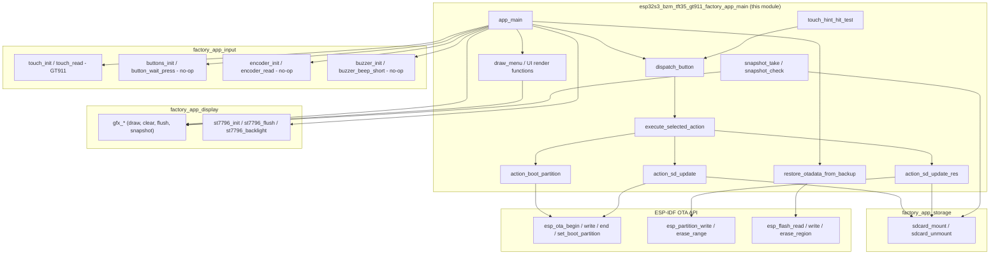
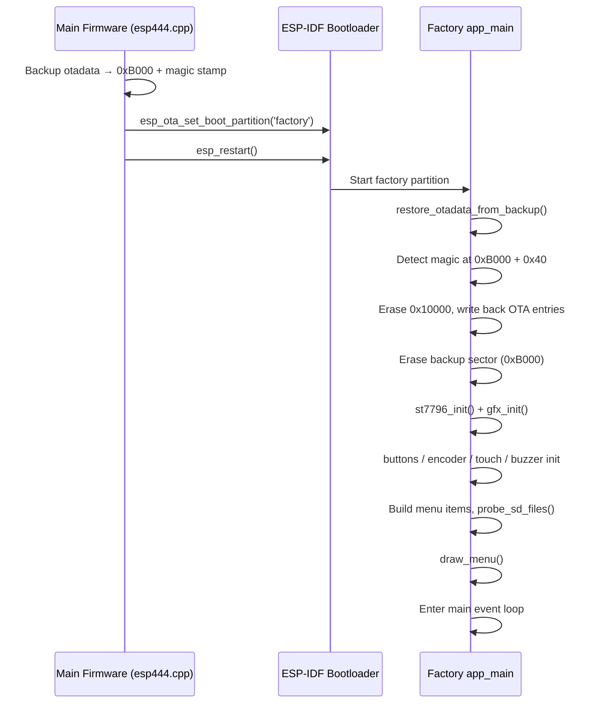
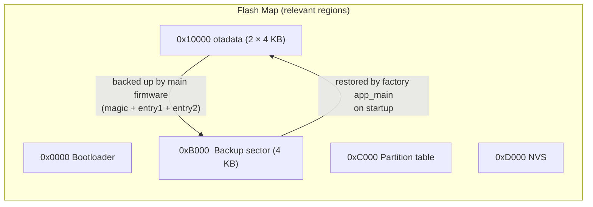
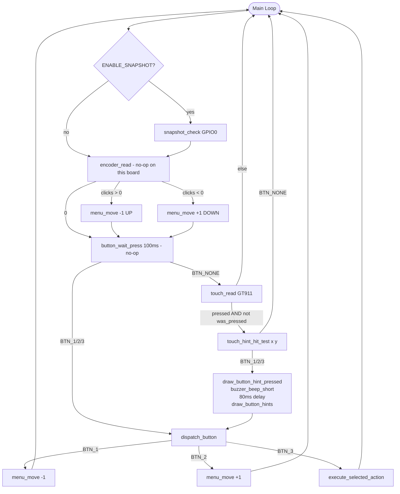
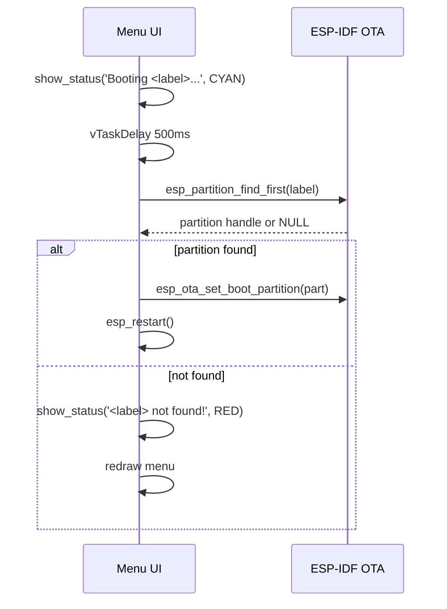
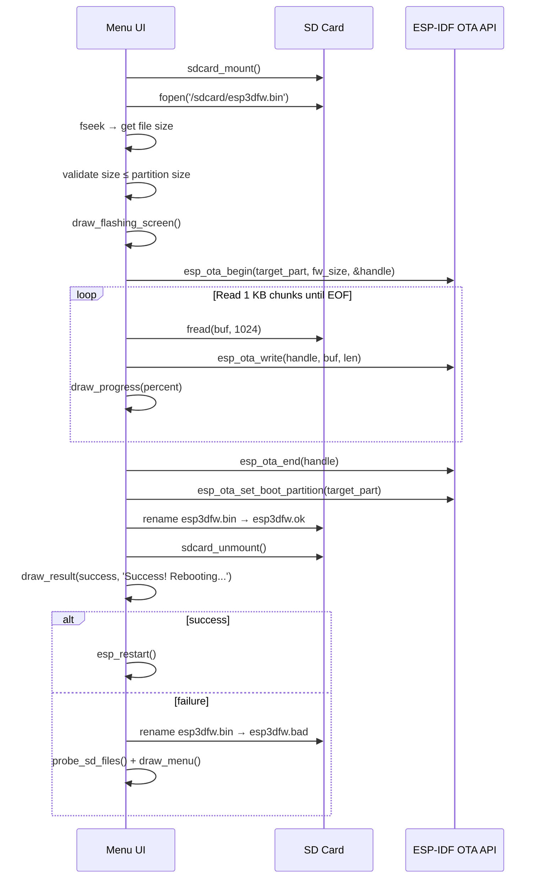
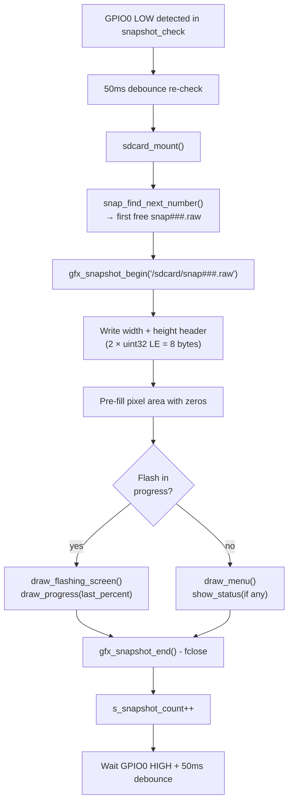
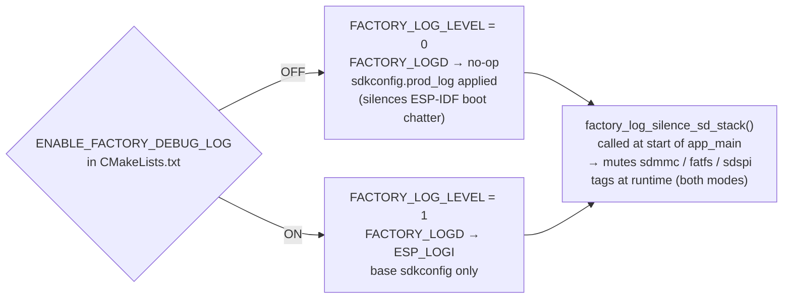

# esp32s3_bzm_tft35_gt911_factory_app_main

## Overview

The `esp32s3_bzm_tft35_gt911_factory_app_main` module is the **application logic core** of the factory/recovery firmware for the **ESP32S3-BZM-TFT35-GT911** board. It runs from the dedicated `factory` flash partition and provides a touch-navigable recovery menu that allows field operators and developers to:

- Boot a specific OTA application partition (`app0` or `app1`)
- Flash a new firmware image from an SD card (`esp3dfw.bin` → `app0` or `app1`)
- Flash a UI resources image from an SD card (`ui_resources.bin` → `ui_resources` partition)
- Restore the OTA metadata backup written by the main firmware before entering recovery

Unlike most other boards in the BSP family, the **ESP32S3-BZM-TFT35-GT911 has no physical buttons, encoder, or buzzer** (all are `GPIO_NUM_NC`). Navigation is exclusively through the **GT911 capacitive touchscreen** via virtual buttons rendered at the bottom of the display. All hardware no-op paths are guarded at the driver level, so the code remains identical to the reference `pibot_pendant_v1_0` design and will work automatically if physical controls are ever populated.

> **Entry path**: The factory partition is entered only via the `[ESP444]FACTORY` software command from the main firmware. There is no custom bootloader hook because this board has no physical BOOT button to hold at reset. See [`esp32s3_bzm_tft35_gt911_bsp`](esp32s3_bzm_tft35_gt911_bsp.md) for the board-level BSP used by the main firmware.

---

## Module Structure

This module is a child of [`esp32s3_bzm_tft35_gt911_factory_app`](esp32s3_bzm_tft35_gt911_factory_app.md) and contains two source files:

| File | Purpose |
|------|---------|
| `boards/esp32s3_bzm_tft35_gt911/Factory/main/main.c` | Application entry point, menu logic, OTA operations, UI rendering |
| `boards/esp32s3_bzm_tft35_gt911/Factory/main/factory_log.h` | Compile-time debug log gate and SD stack silencer |

### Sibling Modules (same parent)

| Module | Responsibility |
|--------|----------------|
| [`esp32s3_bzm_tft35_gt911_factory_app_display`](esp32s3_bzm_tft35_gt911_factory_app_display.md) | Framebuffer GFX API + ST7796 SPI display driver |
| [`esp32s3_bzm_tft35_gt911_factory_app_input`](esp32s3_bzm_tft35_gt911_factory_app_input.md) | Buttons (no-op), encoder (no-op), GT911 touch, buzzer (no-op) |
| [`esp32s3_bzm_tft35_gt911_factory_app_storage`](esp32s3_bzm_tft35_gt911_factory_app_storage.md) | SD card mount/unmount |
| [`esp32s3_bzm_tft35_gt911_factory_app_tools`](esp32s3_bzm_tft35_gt911_factory_app_tools.md) | Host-side flash and font generation scripts |

---

## Architecture

### High-Level Component Relationships



---

## Boot and Entry Flow

The factory partition is activated by the main firmware's `ESP444` command (`esp444.cpp`). Before switching the boot partition, the main firmware:

1. Reads the current OTA data sectors from flash offset `0x10000`
2. Writes them to a backup sector at `0xB000`
3. Stamps the backup with magic `0xAA55AA55` at backup offset `0x40`
4. Sets the boot partition to `factory` and reboots

On the very next `app_main` call, `restore_otadata_from_backup()` detects and restores this backup **before any other initialization**, ensuring that a power-cut during recovery still returns to the correct OTA partition on the next boot.



---

## OTA Backup / Restore Architecture



### Constraints

| Constraint | Value | Reason |
|------------|-------|--------|
| `OTADATA_BACKUP_OFFSET` | `0xB000` | After bootloader end, before partition table (`0xC000`), 4 KB-aligned |
| `OTADATA_OFFSET` | `0x10000` | Fixed ESP-IDF otadata location |
| `OTADATA_ENTRY_SIZE` | `32 bytes` | One ESP-IDF OTA state record |
| `BACKUP_MAGIC` | `0xAA55AA55` at `+0x40` | Presence check before restore |
| `CONFIG_SPI_FLASH_DANGEROUS_WRITE_ALLOWED` | Must be `y` | `esp_flash_erase_region` targets address below first partition |

> ⚠️ **Porting note**: When adapting this factory app to a board with a different flash layout, recalculate `OTADATA_BACKUP_OFFSET` and update **both** this file and the main firmware's `esp444.cpp` with the same value.

---

## Menu System

### Data Model

```c
typedef struct {
    const char *label;     /* Display label */
    menu_action_t action;  /* Action dispatched by execute_selected_action */
    uint16_t color;        /* Text color when item is not selected */
} menu_item_t;
```

Menu items are built dynamically at startup based on detected partitions and SD card contents:

| Label | Action | Shown when |
|-------|--------|-----------|
| `Boot app0` | `MENU_ACTION_BOOT_APP0` | Always |
| `Boot app1` | `MENU_ACTION_BOOT_APP1` | `app1` partition detected |
| `SD -> app0` | `MENU_ACTION_SD_UPDATE_APP0` | Always |
| `SD -> app1` | `MENU_ACTION_SD_UPDATE_APP1` | `app1` partition detected |
| `SD -> resources` | `MENU_ACTION_SD_UPDATE_RES` | Always |

### Screen Layout (320 × 480 portrait)

```
┌────────────────────────────────┐  ← Y=0
│   Recovery vX.Y.Z  (title)    │  Y=13   CYAN
│ ─────────────────────────────  │  Y=40   separator
│   Active: <partition>          │  Y=53   YELLOW
│   SD: FW  RES                  │  Y=81   SD indicators
│ ─────────────────────────────  │  Y=104  separator
│                                │
│  [ Boot app0              ]    │  Y=111  (MENU_START_Y)
│  [ SD -> app0             ]    │  Y=151  each item H=40
│  [ SD -> app1             ]    │  Y=191
│  [ SD -> resources        ]    │  Y=231
│                                │
│ ─────────────────────────────  │  STATUS_Y − 7  separator
│   <status / "Power off">       │  STATUS_Y  footer zone
│ ─────────────────────────────  │  BTN_HINT_BASE_Y  separator
│   (↑)       (↓)       (✓)     │  BTN_HINT_CY  virtual buttons
└────────────────────────────────┘  ← Y=479
```

### Virtual Button Touch Zones

Physical buttons are unpopulated (`GPIO_NUM_NC`). Three virtual buttons are drawn as circle-outline icons at the bottom of the screen. The **touch hit zones are column-thirds of the full screen width** — much larger than the drawn circles — for easy tapping.

```
Screen width: 320 px
│     col 0–106      │    col 107–213    │    col 214–320    │
│  BTN_1 (↑ Up)      │  BTN_2 (↓ Down)  │  BTN_3 (✓  OK)   │
│  CX1 = 60          │  CX2 = 160        │  CX3 = 260        │
│  BLUE              │  BLUE             │  GREEN            │
```

`touch_hint_hit_test(x, y)` returns `BTN_NONE` for any `y < BTN_HINT_BASE_Y`, ensuring that taps on menu items are never misinterpreted as button presses.

---

## Input Event Processing



> **Loop timing**: `button_wait_press(100)` blocks for up to 100 ms each iteration. On this board, since physical buttons return `BTN_NONE` immediately, the loop runs at approximately 100 ms cadence, providing responsive touch polling.

---

## Action Flows

### Boot Partition Action



### SD Firmware Flash Action (`action_sd_update`)



### SD Resources Flash Action (`action_sd_update_res`)

Follows the same pattern as the firmware flash but targets the `ui_resources` DATA partition using `esp_partition_erase_range()` + `esp_partition_write()` directly (no OTA handle). The binary header (`ESP3` magic + 12-char variant string) is read and logged before flashing to allow early detection of variant mismatches (wrong firmware type or transport).

---

## Display Rendering Functions

All drawing calls route through the GFX API defined in [`esp32s3_bzm_tft35_gt911_factory_app_display`](esp32s3_bzm_tft35_gt911_factory_app_display.md).

### Layout Constants

| Constant | Value | Description |
|----------|-------|-------------|
| `SCREEN_WIDTH` | 320 | Portrait display width (pixels) |
| `SCREEN_HEIGHT` | 480 | Portrait display height (pixels) |
| `FONT_WIDTH` | 11 | Pixels per character column |
| `FONT_HEIGHT` | 21 | Pixels per character row |
| `MENU_START_Y` | 111 | Y coordinate of first menu item |
| `MENU_ITEM_H` | 40 | Height of each menu item row |
| `MENU_PAD_X` | 20 | Horizontal padding for menu items |
| `BTN_CIRCLE_R` | 27 | Virtual button circle radius |
| `STATUS_Y` | `SCREEN_HEIGHT - 33 - BTN_HINT_H` | Footer message Y coordinate |
| `BTN_HINT_BASE_Y` | `SCREEN_HEIGHT - BTN_HINT_H` | Top edge of button hint bar |

> The layout constants are scaled ×4/3 relative to the 240×320 reference (`pibot_pendant_v1_0`) to match the 320×480 screen and the proportionally larger 11×21 font.

### UI Function Reference

| Function | Description |
|----------|-------------|
| `draw_header()` | Clears screen, double border, title, separator line |
| `draw_menu()` | Full menu repaint: header + active partition + SD indicators + all items + footer + button hints |
| `draw_menu_item(index)` | Redraws a single menu item with or without selection highlight |
| `draw_sd_indicators()` | Shows `FW` (green) and/or `RES` (cyan) badges if files detected on SD |
| `draw_footer_zone()` | Status message, or "Power off to cancel" if no message pending |
| `draw_flashing_screen()` | Full-screen flash-in-progress overlay with "Do NOT power off!" warning |
| `draw_progress(percent)` | Outlined progress bar + percentage text |
| `draw_result(success, msg)` | Green success or red failure result message |
| `draw_button_hints()` | Horizontal separator line + three circle icons with ↑ ↓ ✓ |
| `draw_button_hint_pressed(btn)` | Redraws one button in violet for touch-press visual feedback |
| `draw_circle(cx,cy,r,color)` | Midpoint circle algorithm, outline only |
| `draw_up_arrow(cx,cy,color)` | Upward arrow icon centered at (cx, cy), fits within r=27 |
| `draw_down_arrow(cx,cy,color)` | Downward arrow icon centered at (cx, cy), fits within r=27 |
| `draw_check_mark(cx,cy,color)` | Checkmark icon centered at (cx, cy), 4 px thick strokes |

### Color Palette

| Constant | RGB565 value | Used for |
|----------|-------------|---------|
| `MENU_HIGHLIGHT` | Dark blue | Selection highlight box |
| `MENU_HIGHLIGHT_TXT` | Bright blue | Selected item text |
| `BTN_NAV_COLOR` | Blue | Up/Down button icons |
| `BTN_OK_COLOR` | Green | OK/Select button icon |
| `BTN_PRESSED_COLOR` | Violet | Touch-press feedback |

---

## Snapshot System (Optional)

When compiled with `-DENABLE_SNAPSHOT`, pressing **GPIO0** (BOOT button on evaluation breakout boards) triggers a full screen capture saved to SD card as a raw pixel file.



Snapshot files are named `snap000.raw` through `snap999.raw`. `snap_find_next_number()` scans existing files on SD to find the first unused index. The raw format (width + height `uint32` LE header followed by RGB565 pixel data, row-major) can be converted to PNG with the host tool in [`esp32s3_bzm_tft35_gt911_factory_app_tools`](esp32s3_bzm_tft35_gt911_factory_app_tools.md).

---

## Logging (`factory_log.h`)

The module uses a two-tier logging scheme, entirely independent of the main firmware's `esp3d_log` system (see [`factory_logging`](factory_logging.md)):



| Macro / Function | Behavior |
|-----------------|----------|
| `FACTORY_LOGD(tag, fmt, ...)` | → `ESP_LOGI` when `FACTORY_LOG_LEVEL=1`, no-op otherwise |
| `ESP_LOGW` / `ESP_LOGE` | Always active regardless of log level |
| `factory_log_silence_sd_stack()` | Calls `esp_log_level_set(ESP_LOG_NONE)` for 8 SD/FAT driver tags at runtime |

The SD stack silencer is invoked as the very first statement in `app_main` to suppress internal SD driver noise from polluting the serial monitor even in debug builds.

---

## Hardware Configuration Summary

| Peripheral | Interface | Notes |
|------------|-----------|-------|
| ST7796 display | SPI (`TFT_HOST`) | 320×480 portrait, RGB565, SPI DMA chunked transfers |
| Display DC | GPIO `TFT_DC` | Data/Command select |
| Display RST | GPIO `TFT_RST` | Active low, 10 ms pulse, then 120 ms sleep |
| Display CS | GPIO `TFT_CS` | SPI chip select |
| Display backlight | GPIO `TFT_LED` | Active high; off during `st7796_init`, on after `gfx_init` |
| GT911 touch | I2C (`TOUCH_I2C_PORT_IDX`) | SDA = `TOUCH_I2C_SDA_PIN`, SCL = `TOUCH_I2C_SCL_PIN` |
| GT911 RST | GPIO `TOUCH_RST_PIN` | Touch controller reset |
| GT911 INT | GPIO `TOUCH_IRQ_PIN` | Interrupt line (polled in factory app, no ISR) |
| Physical buttons | `GPIO_NUM_NC` | Not populated — `buttons_init` skips GPIO config, `button_wait_press` returns `BTN_NONE` |
| Rotary encoder | `GPIO_NUM_NC` | Not populated — `encoder_init` returns early, `encoder_read` returns `0` |
| Buzzer | `GPIO_NUM_NC` | Not populated — `buzzer_beep_short` is a no-op |
| Snapshot trigger | GPIO0 | Only when `ENABLE_SNAPSHOT` is compiled in |
| SD card | SPI or SDIO | Via `sdcard_mount()` / `sdcard_unmount()` |

---

## SD Card File Conventions

| Path | Purpose | After success | After failure |
|------|---------|---------------|---------------|
| `/sdcard/esp3dfw.bin` | Firmware image to flash | Renamed → `esp3dfw.ok` | Renamed → `esp3dfw.bad` |
| `/sdcard/esp3dfw.ok` | Record of last successful firmware flash | — | — |
| `/sdcard/esp3dfw.bad` | Record of last failed firmware flash | — | — |
| `/sdcard/ui_resources.bin` | UI resources image to flash | Renamed → `ui_resources.ok` | Renamed → `ui_resources.bad` |
| `/sdcard/ui_resources.ok` | Record of last successful resources flash | — | — |
| `/sdcard/ui_resources.bad` | Record of last failed resources flash | — | — |
| `/sdcard/snap###.raw` | Screen snapshots (optional, `ENABLE_SNAPSHOT`) | — | — |

`probe_sd_files()` mounts the SD, checks for the presence of `esp3dfw.bin` and `ui_resources.bin`, then unmounts. It is called at startup and again after any failed flash to refresh the `FW`/`RES` indicator badges in the menu header.

---

## Comparison With Other Board Factory Apps

This module is architecturally identical to the reference [`pibot_pendant_v1_0_factory_app_main`](pibot_pendant_v1_0_factory_app_main.md). Board-specific differences are limited to:

| Aspect | ESP32S3-BZM-TFT35-GT911 | pibot_pendant_v1_0 |
|--------|-------------------------|---------------------|
| Display driver | ST7796 SPI | ILI9341 SPI |
| Screen resolution | 320 × 480 | 240 × 320 |
| Touch controller | GT911 (I2C, capacitive) | XPT2046 (SPI, resistive) |
| Physical buttons | None (`GPIO_NUM_NC`) | 3× GPIO (populated) |
| Rotary encoder | None (`GPIO_NUM_NC`) | Quadrature PCNT encoder (populated) |
| Buzzer | None (`GPIO_NUM_NC`) | GPIO PWM buzzer (populated) |
| Bootloader hook | Not used (software-only entry) | `is_button_pressed` at boot |
| Font dimensions | 11 × 21 px (×4/3 scale) | 8 × 16 px (reference) |
| UI layout scale | ×4/3 from reference | Reference |
| Custom bootloader | Not present | [`pibot_pendant_v1_0_bootloader`](pibot_pendant_v1_0_bootloader.md) |

---

## Related Documentation

- [`esp32s3_bzm_tft35_gt911_factory_app`](esp32s3_bzm_tft35_gt911_factory_app.md) — Parent module: complete factory app, all sibling modules, build scripts
- [`esp32s3_bzm_tft35_gt911_factory_app_display`](esp32s3_bzm_tft35_gt911_factory_app_display.md) — GFX API and ST7796 SPI driver
- [`esp32s3_bzm_tft35_gt911_factory_app_input`](esp32s3_bzm_tft35_gt911_factory_app_input.md) — GT911 touch, buttons (no-op), encoder (no-op), buzzer (no-op)
- [`esp32s3_bzm_tft35_gt911_factory_app_storage`](esp32s3_bzm_tft35_gt911_factory_app_storage.md) — SD card mount/unmount
- [`esp32s3_bzm_tft35_gt911_factory_app_tools`](esp32s3_bzm_tft35_gt911_factory_app_tools.md) — Host flash tools and raw→PNG converter
- [`esp32s3_bzm_tft35_gt911_bsp`](esp32s3_bzm_tft35_gt911_bsp.md) — Board Support Package used by the main firmware
- [`pibot_pendant_v1_0_factory_app_main`](pibot_pendant_v1_0_factory_app_main.md) — Reference implementation this module derives from
- [`factory_logging`](factory_logging.md) — Shared factory app logging conventions
- [`factory_update_actions_otadata`](factory_update_actions_otadata.md) — OTA data backup/restore design shared across boards
- [`factory_update_actions_sd_flash`](factory_update_actions_sd_flash.md) — SD-based firmware and resources flash patterns
